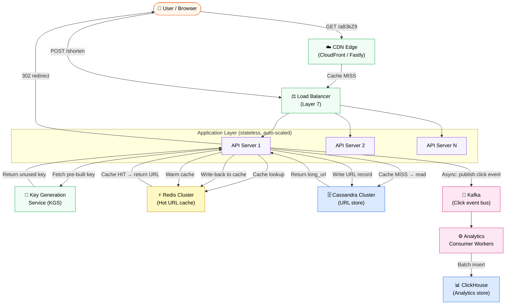
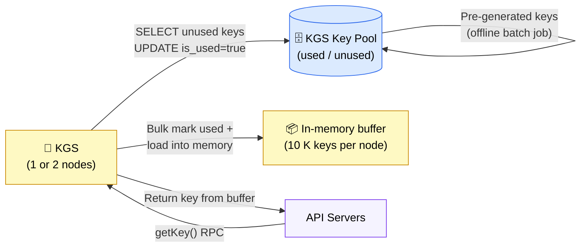
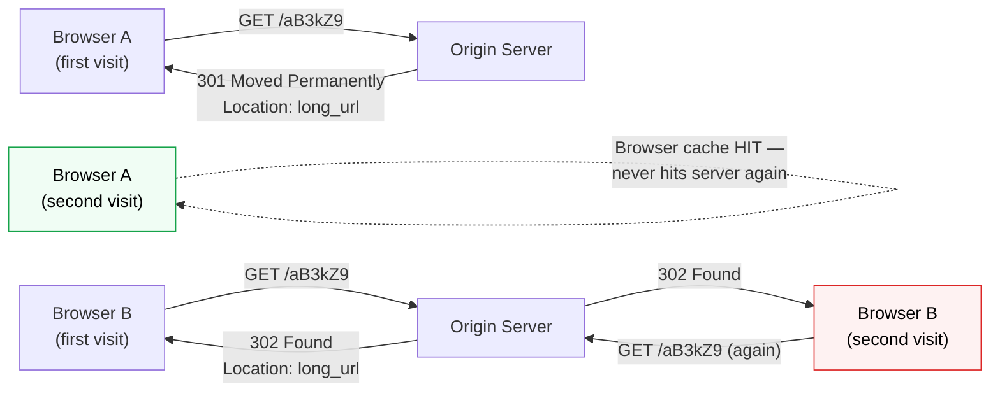

# Design URL Shortener

> Given a long URL, produce a short alias (e.g. `https://tny.io/aB3kZ9`) that redirects to the original — reliably, at global scale, in milliseconds.

**Difficulty:** ⭐⭐ · **Builds on:**
[Caching](../../Level-01-Building-Blocks/03-Caching/README.md) ·
[CDN](../../Level-01-Building-Blocks/06-CDN/README.md) ·
[Databases](../../Level-01-Building-Blocks/04-Databases-SQL-vs-NoSQL/README.md) ·
[Sharding](../../Level-02-Data-Layer/02-Sharding-and-Partitioning/README.md) ·
[Replication](../../Level-02-Data-Layer/01-Database-Replication/README.md) ·
[Distributed Systems](../../Level-04-Distributed-Systems/README.md) ·
[CAP Theorem](../../Level-04-Distributed-Systems/01-CAP-Theorem/README.md) ·
[Scale & Reliability](../../Level-06-Scale-and-Reliability/README.md)

---

## 1. 🎯 Problem & Scope

You're building the backend for a service like TinyURL or Bitly. Users paste a long URL and get back a short 6–8 character alias. Anyone who visits that alias gets transparently redirected to the original. The core loop is simple — the engineering challenge is making it work at 100 B+ URLs and billions of daily redirects without a hiccup.

**In scope:**
- Shorten a URL (with optional custom alias and TTL)
- Redirect short URL → original URL
- Per-link click analytics (async)
- URL expiration / TTL

**Out of scope (for this case study):**
- User authentication / accounts (treat it as anonymous for now)
- Link-in-bio pages, QR codes, A/B destination testing
- Fraud / phishing detection pipeline

---

## 2. 📋 Requirements

### Functional

1. `POST /shorten` — accept a long URL and return a unique short key (6–8 chars).
2. `GET /{shortKey}` — redirect to the original URL.
3. Custom aliases — let the caller specify a preferred key (e.g. `my-sale`).
4. Expiration — optional TTL; expired links return 410 Gone.
5. Analytics — track click count, referrer, geo, timestamp (eventually consistent is fine).

### Non-Functional

| Property | Target |
|---|---|
| Availability | 99.99 % uptime (≤ 52 min downtime/yr) |
| Redirect latency | p99 < 50 ms globally |
| Durability | Zero URL loss once written |
| Write latency | p99 < 200 ms |
| Read:write ratio | ~100 : 1 (reads dominate) |
| Short key uniqueness | Guaranteed — no collision in the face of 100 B records |
| Security | Short keys must not be guessable/enumerable |

---

## 3. 🧮 Capacity Estimation

Let's size a mid-sized production service, not a toy.

### Traffic

```
Write (shorten) QPS:
  100 M new URLs / day
  = 100,000,000 / 86,400 s
  ≈ 1,160 writes/s  →  round to ~1,200 writes/s

Read (redirect) QPS:
  Read:Write ratio = 100:1
  = 1,200 × 100
  = 120,000 reads/s  →  ~120 K reads/s peak
```

### Storage

```
Per URL record (rough):
  short_key   :   8 bytes
  long_url    : 512 bytes (avg; max 2 KB)
  user_id     :   8 bytes
  created_at  :   8 bytes
  expires_at  :   8 bytes
  ─────────────────────────
  total       : ~544 bytes  →  round to 600 bytes

URLs stored per year:
  100 M writes/day × 365 days = 36.5 B URLs

Storage per year:
  36.5 B × 600 bytes = 21.9 TB/yr  →  ~22 TB/yr
  With 3× replication: 66 TB/yr of raw disk
```

### Bandwidth

```
Write bandwidth:
  1,200 writes/s × 600 bytes = ~720 KB/s  (negligible)

Read bandwidth (redirect response is tiny — just a Location header):
  120,000 reads/s × 200 bytes (response headers) = ~24 MB/s egress
```

### Cache sizing

```
80/20 rule: 20% of URLs get 80% of traffic.
  Active URL set ≈ 20% of daily writes
  = 20% × 100 M = 20 M URLs/day cached

  20 M × 600 bytes = 12 GB of hot data
  → A single Redis cluster with 32 GB RAM covers the hot set comfortably.
```

**Ballpark summary:** ~1.2 K writes/s, ~120 K reads/s, ~22 TB new storage/year, ~12 GB working set in cache.

---

## 4. 🔌 API Design

### POST /shorten

**Request**
```http
POST /shorten
Content-Type: application/json

{
  "long_url": "https://www.example.com/very/long/path?q=something&ref=newsletter",
  "custom_alias": "summer-sale",   // optional
  "ttl_seconds": 2592000           // optional — 30 days
}
```

**Response 201 Created**
```json
{
  "short_url": "https://tny.io/summer-sale",
  "short_key": "summer-sale",
  "long_url": "https://www.example.com/very/long/path?q=something&ref=newsletter",
  "expires_at": "2026-07-24T00:00:00Z"
}
```

**Errors:** 400 Invalid URL · 409 Alias taken · 422 Alias violates policy (reserved word, too long)

---

### GET /{shortKey}

**Request**
```http
GET /aB3kZ9 HTTP/1.1
Host: tny.io
```

**Response 302 Found**
```http
HTTP/1.1 302 Found
Location: https://www.example.com/very/long/path?q=something&ref=newsletter
Cache-Control: no-store
```

*See Deep Dive §7.1 for the 301 vs 302 decision.*

**Errors:** 404 Not found · 410 Gone (expired)

---

### GET /analytics/{shortKey}

```json
{
  "short_key": "aB3kZ9",
  "total_clicks": 183429,
  "unique_visitors": 94210,
  "top_countries": ["US", "IN", "GB"],
  "clicks_last_24h": 4201
}
```

---

## 5. 🗄️ Data Model

### URLs table (primary store)

| Column | Type | Notes |
|---|---|---|
| `short_key` | `VARCHAR(16)` PK | The generated or custom alias |
| `long_url` | `TEXT` | Up to 2 KB |
| `user_id` | `BIGINT` | NULL for anonymous |
| `created_at` | `TIMESTAMP` | UTC |
| `expires_at` | `TIMESTAMP` | NULL = never |
| `is_active` | `BOOLEAN` | Soft-delete / manual disable |

**Index:** `short_key` is the primary key — all reads are point lookups, no range scans needed.

### Click events table (analytics, write-heavy)

| Column | Type | Notes |
|---|---|---|
| `event_id` | `UUID` | |
| `short_key` | `VARCHAR(16)` | FK |
| `clicked_at` | `TIMESTAMP` | |
| `referrer` | `TEXT` | |
| `country` | `CHAR(2)` | Geo-resolved |
| `user_agent` | `TEXT` | |

### Pre-generated keys table (Key Generation Service)

| Column | Type | Notes |
|---|---|---|
| `key` | `VARCHAR(8)` PK | |
| `is_used` | `BOOLEAN` | |

---

### Storage choice & justification

**URLs → Cassandra (or DynamoDB)**

The access pattern is 100% point lookups by `short_key`. You never need joins, transactions across rows, or complex queries. Cassandra gives you:
- Linear write scalability via consistent hashing (see [Sharding](../../Level-02-Data-Layer/02-Sharding-and-Partitioning/README.md))
- Tunable consistency — you can write at `QUORUM` for durability and read at `LOCAL_ONE` for speed
- Multi-region replication built-in

A relational DB (Postgres, MySQL) works fine at smaller scale but becomes a sharding headache above ~1 TB. If your team runs Postgres already, use it with a hash-sharded extension (Citus) and revisit at 10× scale.

**Click events → Apache Kafka → ClickHouse (or BigQuery)**

Click events are write-heavy (120 K events/s) and queried with aggregations (GROUP BY country, day). Stream them through Kafka so the redirect path is never blocked by analytics writes, then land them in a columnar OLAP store for cheap GROUP BY performance. See [Event-Driven Architecture](../../Level-05-Architecture-Patterns/02-Event-Driven-Architecture/README.md).

**Cache → Redis**

12 GB working set, sub-millisecond reads, TTL support built-in, cluster mode for horizontal scale. See [Caching](../../Level-01-Building-Blocks/03-Caching/README.md).

---

## 6. 🏗️ High-Level Architecture



### Request Flow Walk-through

**Redirect (read path — the hot path):**
1. Browser hits `GET tny.io/aB3kZ9`. CDN edge checks its cache.
2. **CDN HIT** (for 301 redirects) — browser is redirected immediately, zero origin traffic. Otherwise, CDN forwards to the Load Balancer.
3. Load balancer routes to any stateless API server (L7, round-robin or least-connections).
4. API server checks **Redis** for `aB3kZ9`.
5. **Redis HIT** — returns the long URL, server emits a 302 redirect response. Also publishes a click event to Kafka asynchronously (fire-and-forget).
6. **Redis MISS** — API server queries Cassandra by primary key. Sub-millisecond on a local replica. Writes result back to Redis (write-back caching), then responds.

**Shorten (write path):**
1. Client POSTs `{ long_url, custom_alias?, ttl? }` to any API server.
2. If no custom alias: API server calls KGS to fetch a pre-generated, guaranteed-unique key.
3. If custom alias: validate format, check uniqueness directly in Cassandra (lightweight transaction / CAS).
4. Write the URL row to Cassandra at QUORUM consistency.
5. Warm the Redis cache immediately (optional — avoids a cold read on the first redirect).
6. Return the short URL to the caller.

---

## 7. 🔬 Deep Dives

### 7.1 Short-Key Generation — the Hardest Part

Generating a globally unique, short, non-guessable key is the central problem. Three strategies:

#### Option A — Hash + truncate

```
MD5(long_url) → 128-bit hash
Take first 43 bits → base62 encode → 7-char key
```

Simple, but collisions are guaranteed at scale (birthday paradox). You'd need a retry loop: hash, check DB, if taken hash with a salt and retry. Under heavy write load this creates unpredictable latency spikes and DB read pressure on the write path.

#### Option B — Auto-increment counter + base62 encode

```
Global counter:  1, 2, 3, … N
base62(N)     : "1", "2", … "aB3kZ9" (7 chars handles 3.5 T values)
```

Zero collisions. But a single-node counter is a write bottleneck and SPOF. You can use a distributed counter (Zookeeper, etcd) or range pre-allocation (each API server claims a range of 10,000 IDs), but this adds operational complexity and the keys are sequential — enumerable by an attacker.

#### Option C — Key Generation Service (KGS) ✅ Recommended



An offline batch job pre-generates all 6–7 char base62 combinations (~56 B unique keys for 7 chars) and stores them in a dedicated DB table. KGS loads batches of 10 K keys into memory, marking them used in the DB atomically (CAS / two-phase). API servers request a key via a cheap RPC — it's just a memory pop, no DB touch on the hot write path.

**Failure handling:**
- KGS holds keys in RAM: a crash loses at most one in-memory batch (10 K keys) — acceptable.
- Run 2 KGS nodes in active-active, each with non-overlapping key ranges claimed from DB.
- Key pool exhaustion: a Prometheus alert fires when unused key count < 10 M; the batch job runs nightly to refill.

**Why not UUID?** UUIDs are 128 bits — the resulting URL would be 22 base62 chars. That defeats the purpose.

---

### 7.2 301 vs 302 Redirects — Caching Implications



| | 301 Permanent | 302 Temporary |
|---|---|---|
| Browser caches | Yes — client skips server forever | No — every click hits origin |
| CDN caches | Yes (with Cache-Control) | No (by default) |
| Click analytics | Undercounts (browser-side redirect) | Accurate every time |
| Server load | Very low after warm-up | Full QPS hits origin |
| URL update possible? | No (browser ignores new destination) | Yes |

**The right answer depends on your use case:**
- If you need accurate analytics → use **302**. The load is manageable with CDN + Redis.
- If you want maximum performance and don't care about analytics → use **301** with a long `Cache-Control: max-age`.
- Bitly uses **301** for standard links (performance) and a JavaScript beacon for analytics bypass.
- If you care about both: serve **302** initially, collect analytics via an async beacon or edge function, then optionally upgrade to 301 after the first N clicks.

---

### 7.3 Collision & Consistency — Custom Aliases

Custom aliases race: two users posting `summer-sale` simultaneously must not both succeed. Cassandra's **Lightweight Transaction (LWT)** solves this:

```sql
INSERT INTO urls (short_key, long_url, created_at)
VALUES ('summer-sale', 'https://...', now())
IF NOT EXISTS;
```

This is a Paxos-backed CAS — only one writer wins. The loser gets a 409 Conflict response. LWTs have ~2× latency vs a regular write (requires a round of Paxos) — acceptable for the rare custom-alias write path.

For generated keys, there are no collisions by construction (KGS guarantees uniqueness), so you skip the LWT overhead entirely.

---

### 7.4 URL Expiration & Cleanup

Expiration has two parts:

**Serving expired links:** API servers check `expires_at` on every cache-miss DB read and return 410 Gone if expired. Redis TTL is set to match `expires_at` so cached entries auto-evict. No scan needed on the read path.

**Storage reclamation:** A nightly background job (`DELETE WHERE expires_at < NOW() AND expires_at IS NOT NULL`) runs against Cassandra in batches of 1,000 rows with pacing (to avoid overwhelming compaction). Alternatively, Cassandra's native TTL column automatically tombstones rows — simpler but tombstones accumulate; periodic `nodetool compact` is needed.

Reclaimed `short_key` values can be returned to the KGS key pool (mark `is_used = false`) if you want to reuse 7-char space, or simply left retired (56 B keys is effectively infinite for realistic scale).

---

## 8. 📈 Scaling, Bottlenecks & Failure Modes

| Concern | Bottleneck | Solution |
|---|---|---|
| Hot keys | A viral short URL hammers one Redis node | Redis cluster consistent hashing distributes; additionally CDN caches the redirect at edge — most traffic never reaches Redis |
| Write throughput | Cassandra nodes at capacity | Add nodes — Cassandra scales linearly. Or batch writes with a write buffer queue. |
| KGS single point of failure | KGS crashes, writes stall | Active-active KGS pair with non-overlapping key ranges; client retries with exponential backoff |
| Analytics write spike | Kafka consumer lag grows | Add Kafka partitions + more consumer workers; ClickHouse handles batched inserts well |
| Cache stampede on popular new URL | First redirect floods DB | Probabilistic early expiration (PER) or a "lock and load" pattern — first miss acquires a distributed lock, fetches DB, warms cache; others spin briefly |
| Region failure | Single-region Cassandra goes down | Multi-region Cassandra replication (NetworkTopologyStrategy, RF=3 per region); LB fails over to healthy region. See [Multi-Region](../../Level-06-Scale-and-Reliability/06-Multi-Region-and-Geo-Distribution/README.md) |
| DB overload during cold start | Cache is empty after deploy | Pre-warm cache from a recent DB snapshot on startup; or accept briefly elevated DB load post-deploy with circuit breaker protecting the DB |

---

## 9. ⚖️ Trade-offs & Alternatives

### Hashing vs KGS

| | Hash + truncate | KGS |
|---|---|---|
| Complexity | Low | Medium (extra service) |
| Collision risk | Yes (birthday paradox at scale) | Zero by construction |
| Write path DB reads | Yes (collision check) | No |
| Statefulness | Stateless | Stateful (key pool) |
| Verdict | OK for prototypes | Production choice |

### SQL vs NoSQL for URL store

| | PostgreSQL | Cassandra |
|---|---|---|
| Schema flexibility | High (FK, constraints) | Low (denormalized) |
| Point-lookup perf | Excellent with index | Excellent (primary key) |
| Horizontal scale | Hard (sharding needed) | Native |
| Ops complexity | Lower (familiar) | Higher |
| Sweet spot | < 500 GB, single region | Multi-TB, multi-region |

### 301 vs 302 (see Deep Dive 7.2)

For most analytics-first products, **302 + CDN edge analytics** is the sweet spot — you get accurate counts without hammering origin.

### Synchronous vs Asynchronous Analytics

Writing click events synchronously on the redirect path adds ~5–20 ms and risks redirect failures if the analytics DB is slow. Async Kafka decouples concerns cleanly: redirects stay fast and the analytics pipeline can lag by seconds without user impact. The trade-off is eventual consistency in dashboards — typically fine.

---

## 10. 🌐 How It's Actually Done

**Bitly** shards its MySQL database by hash of the short key and uses a custom in-house KGS. Their 2014 blog post ("Lessons Learned from Building a Production URL Shortener") confirmed the read:write ratio of ~100:1 and heavy reliance on Memcached for the hot set.

**TinyURL** runs a simpler architecture: a counter-based key generator with a MySQL backend, sharded and read-replicated. They use Varnish for HTTP caching at the edge.

**Twitter's t.co** (acquired from their own URL shortener project) is notable for running click analytics *synchronously* on the redirect using a streaming pipeline — they prioritize analytics fidelity over the ~10 ms latency cost.

**Relevant engineering posts:**
- Bitly Engineering Blog — "Lessons Learned Building URL Shortener at Scale" (2014)
- High Scalability — "How TinyURL Works" (architecture walkthrough)
- AWS Blog — "Building a URL Shortener with API Gateway + DynamoDB + Lambda" (serverless approach)
- Pinterest Engineering — "URL shortener design at Pinterest" (custom alias handling)

**The serverless alternative:** API Gateway → Lambda → DynamoDB handles the MVP in an afternoon. DynamoDB's on-demand pricing and auto-scaling make it appealing for unpredictable traffic. The catch: cold starts add 50–200 ms on the redirect path and Lambda has a 15-min max execution limit (irrelevant here but illustrates serverless constraints).

---

## 11. 📝 Summary

### 30-second recap

A URL shortener is deceptively simple on the surface but forces you to make careful decisions at every layer:

- **Key generation:** Don't use hashing (collisions). Use a Key Generation Service that pre-generates base62 keys offline and hands them out atomically — zero collisions, zero DB round-trips on the write hot path.
- **Read path:** 302 redirect + Redis cache + CDN edge. The working set is only ~12 GB. Cache hit rates above 95% are realistic, dropping origin load to a tiny fraction of total QPS.
- **Analytics:** Async via Kafka so the redirect is never blocked. A columnar store (ClickHouse) makes GROUP BY aggregations fast and cheap.
- **Expiration:** Redis TTL handles cache auto-eviction; a nightly background job reclaims DB storage.
- **Custom aliases:** Cassandra Lightweight Transactions (CAS) prevent race conditions with one round of Paxos — only needed on the rare custom-alias write path.

### What made this one hard

The challenge isn't any single component — it's the **read:write skew** (100:1) forcing you to build an aggressive, multi-layer caching strategy, combined with the **uniqueness requirement** at 100 B+ scale where simple hashing breaks down. Add the nuance of 301 vs 302 (performance vs analytics accuracy), the global low-latency requirement driving multi-region replication, and the thundering-herd problem on viral links — and you have a case study that touches nearly every distributed systems concept in the curriculum.
