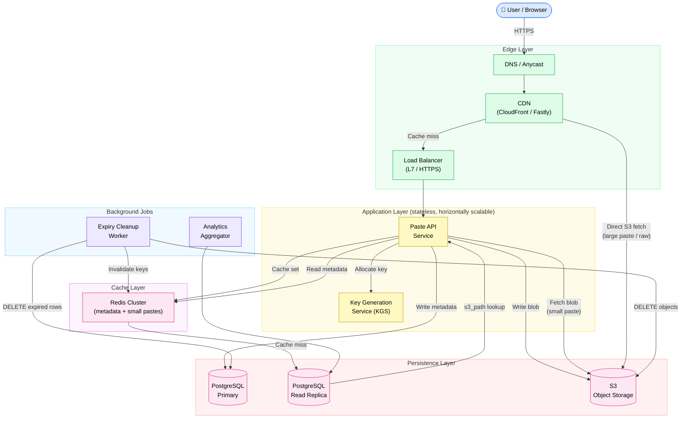
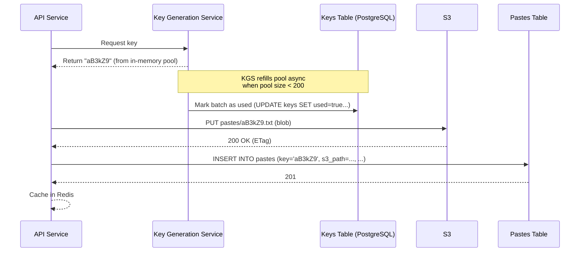
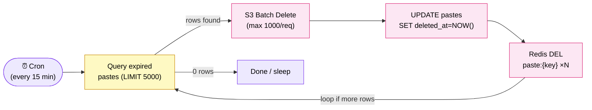

# Design Pastebin

> A service that lets users store and share plain text or code snippets via a short, unique URL — with optional expiry, privacy controls, and syntax highlighting.

**Difficulty:** ⭐⭐ · **Builds on:** [URL Shortener](../01-URL-Shortener/README.md) · [Caching](../../Level-01-Building-Blocks/03-Caching/README.md) · [Data Layer](../../Level-02-Data-Layer/README.md)

---

## 1. 🎯 Problem & Scope

Pastebin (and clones like GitHub Gist, hastebin, Dpaste) solves a simple but non-trivial problem: you have a blob of text — a log dump, a code snippet, a config file — and you want to share it with someone over a medium that can't carry long text (Slack, Twitter, email subject lines). You paste it, get a short URL, and share that instead.

From a systems perspective the interesting tension is this: it looks like a URL shortener, but it isn't. A URL shortener stores a tiny metadata record (≤ 200 bytes). Pastebin stores **large, variable-size blobs** (up to ~10 MB). That one difference changes almost every storage and caching decision you make.

**In scope:**
- Create a paste (text blob, up to 10 MB)
- Read a paste by its short key
- Optional: TTL/expiry, privacy mode, syntax-language hint
- Optional: user accounts and paste ownership

**Out of scope for this design:**
- Real-time collaborative editing
- Binary file uploads
- Full-text search across pastes

---

## 2. 📋 Requirements

### Functional

1. **Create paste** — POST text content, get back a short unique key (e.g., `abc123`).
2. **Read paste** — GET `/abc123` returns the raw content or a rendered HTML page.
3. **Expiry (TTL)** — Pastes can have a user-specified TTL: 10 min, 1 hr, 1 day, 1 week, 1 month, or never.
4. **Privacy modes** — `public` (listed/searchable), `unlisted` (key-only), `password-protected`.
5. **Syntax hint** — user can tag a paste with a language (Python, JSON, SQL…) for highlighting.
6. **Delete paste** — owner or admin can hard-delete before expiry.

### Non-Functional

| Property | Target |
|---|---|
| Availability | 99.9% (≤ 8.7 hr/yr downtime) |
| Read latency | p99 < 200 ms (cache hit), p99 < 800 ms (cache miss, S3 fetch) |
| Write latency | p99 < 500 ms |
| Durability | 11 nines (S3 SLA) |
| Consistency | Eventual for reads is fine; write-then-read within same session should be consistent |
| Max paste size | 10 MB |

---

## 3. 🧮 Capacity Estimation

### Traffic

```
DAU                    = 5,000,000
Write ratio            = 20% of DAU create ≥1 paste per day
                       = 1,000,000 pastes / day

Write QPS (avg)        = 1,000,000 / 86,400
                       ≈ 11.6 writes/sec
Write QPS (peak ×3)   ≈ 35 writes/sec

Read ratio             ≈ 10 reads per paste on average (shared widely)
Read requests/day      = 10,000,000 / day

Read QPS (avg)         = 10,000,000 / 86,400
                       ≈ 116 reads/sec
Read QPS (peak ×3)    ≈ 350 reads/sec
```

This is a **read-heavy** system (~10:1 read/write). Classic CDN + cache territory.

### Storage

```
Average paste size     = 10 KB  (median is smaller; large pastes pull average up)
Pastes / day           = 1,000,000
Storage added / day    = 1,000,000 × 10 KB = 10 GB / day

Retention              = assume 3-year horizon
Total object storage   = 10 GB/day × 365 × 3 ≈ 10.9 TB

Metadata per paste     = ~300 bytes (key, owner_id, ttl, size, lang, visibility, s3_path, timestamps)
Metadata total         = 1,000,000 × 300 × 365 × 3 ≈ 330 GB (fits easily in a relational DB)
```

### Bandwidth

```
Write bandwidth        = 35 writes/sec × 10 KB = 350 KB/s  (trivial)
Read bandwidth         = 350 reads/sec × 10 KB = 3.5 MB/s  (manageable; CDN absorbs most)
```

**Key takeaway:** storage volume is the dominant concern, not raw throughput. Object storage (S3) is the right answer.

---

## 4. 🔌 API Design

### Create Paste

```
POST /api/v1/pastes
Authorization: Bearer <token>   (optional for anonymous)

{
  "content":    "def hello():\n    print('world')",
  "language":   "python",
  "visibility": "unlisted",       // "public" | "unlisted" | "protected"
  "password":   null,             // required if visibility == "protected"
  "expires_in": "7d"              // "10m"|"1h"|"1d"|"7d"|"30d"|null (never)
}

201 Created
{
  "key":        "aB3kZ9",
  "url":        "https://paste.example.com/aB3kZ9",
  "expires_at": "2026-07-01T03:01:00Z"
}
```

### Read Paste

```
GET /api/v1/pastes/{key}
X-Paste-Password: <password>    (only needed for protected pastes)

200 OK
{
  "key":        "aB3kZ9",
  "content":    "def hello():\n    print('world')",
  "language":   "python",
  "visibility": "unlisted",
  "size_bytes": 42,
  "created_at": "2026-06-24T03:01:00Z",
  "expires_at": "2026-07-01T03:01:00Z"
}

410 Gone       (paste expired or deleted)
403 Forbidden  (wrong password)
404 Not Found  (key never existed)
```

### Delete Paste

```
DELETE /api/v1/pastes/{key}
Authorization: Bearer <token>

204 No Content
```

### Raw Content (browser-friendly)

```
GET /raw/{key}        → Content-Type: text/plain; charset=utf-8
```

---

## 5. 🗄️ Data Model

### Why two stores?

This is the **central design insight** that separates Pastebin from URL shortener.

- **URL shortener:** the "content" is a URL — 50–200 bytes. You can store it directly in a relational DB row.
- **Pastebin:** the content is a text blob — average 10 KB, max 10 MB. Storing blobs in PostgreSQL rows causes table bloat, vacuuming nightmares, and wastes buffer cache on data that's never queried by column. The blob goes to **object storage (S3)**. The DB stores only the metadata — a pointer to S3.

### `pastes` table (PostgreSQL)

| Column | Type | Notes |
|---|---|---|
| `key` | `CHAR(8)` | PK — the short unique identifier |
| `owner_id` | `BIGINT` | FK to `users`, nullable for anonymous |
| `s3_path` | `TEXT` | e.g., `pastes/aB3kZ9.txt` — pointer into S3 |
| `size_bytes` | `INT` | stored at write time |
| `language` | `VARCHAR(32)` | syntax hint (`python`, `json`, …) |
| `visibility` | `ENUM` | `public`, `unlisted`, `protected` |
| `password_hash` | `TEXT` | bcrypt, nullable |
| `expires_at` | `TIMESTAMPTZ` | nullable = never expires |
| `created_at` | `TIMESTAMPTZ` | default now() |
| `deleted_at` | `TIMESTAMPTZ` | soft-delete flag |

Indexes: `(owner_id, created_at)` for user paste history; `(expires_at)` for the cleanup job.

### `users` table (PostgreSQL)

| Column | Type | Notes |
|---|---|---|
| `id` | `BIGINT` | PK, auto-increment |
| `username` | `VARCHAR(64)` | unique |
| `email` | `VARCHAR(256)` | unique |
| `password_hash` | `TEXT` | |
| `created_at` | `TIMESTAMPTZ` | |

### Object Storage (S3 or compatible)

```
Bucket: pastebin-content
Key layout: pastes/{short_key}.txt
  e.g.:  pastes/aB3kZ9.txt

Presigned URL TTL: 15 minutes (for CDN cache-miss origin fetches)
```

Content-Type is always `text/plain; charset=utf-8` — the client or CDN handles rendering. S3 Server-Side Encryption (SSE-S3) is on by default.

### Caching Layer (Redis)

```
Key:   paste:{short_key}
Value: JSON blob of metadata + content (for pastes ≤ 64 KB)
TTL:   min(paste.expires_at, 24h)
```

Large pastes (> 64 KB) are not cached in Redis — the CDN edge caches the S3 GET directly.

---

## 6. 🏗️ High-Level Architecture



### Request-Flow Walk-through

**Write path (create paste):**

1. Browser POSTs to `https://paste.example.com/api/v1/pastes` — hits DNS, CDN (POST bypasses cache), then LB.
2. API Service calls **KGS** to get a pre-generated unique 8-char key (same approach as URL shortener — see `../01-URL-Shortener/README.md`).
3. API uploads the raw content to **S3** at path `pastes/{key}.txt`. S3 returns an ETag on success.
4. API writes the metadata row to **PostgreSQL Primary** (key, owner, s3_path, size, ttl, visibility, etc.).
5. API writes a Redis cache entry for the paste (if ≤ 64 KB, includes content; otherwise metadata only).
6. API returns `201 Created` with the short URL to the client.

**Read path (fetch paste):**

1. Browser GETs `https://paste.example.com/aB3kZ9` — CDN checks its edge cache.
2. **Cache hit at CDN edge** → response served in < 20 ms (public/unlisted pastes only; protected pastes are never CDN-cached).
3. **Cache miss at CDN** → request forwarded to LB → API Service.
4. API checks **Redis** for `paste:aB3kZ9`.
   - Redis hit → return metadata + content directly (for small pastes).
   - Redis miss → query **PostgreSQL Read Replica** for metadata → get `s3_path`.
5. API fetches blob from **S3** (or returns a presigned URL for the client to fetch directly for large pastes).
6. API sets Redis cache entry, returns content to CDN edge, CDN caches response (with `Cache-Control: public, max-age=3600` for public pastes).

---

## 7. 🔬 Deep Dives

### Key Generation

Pastebin's key problem is identical to URL shortener's: generate short, unique, URL-safe keys at scale without collisions.

**Option A — Random generation + collision check (naive):**
Generate a random 8-char base-62 key, try to INSERT into the DB, retry on unique-key constraint violation. At 1M keys/day with a 62^8 ≈ 218 trillion keyspace, collision probability is negligible — but DB round-trips add latency.

**Option B — Key Generation Service (KGS) — preferred:**
A small dedicated service pre-generates keys in batches and marks them `used` in a `keys` table. API servers pull keys from KGS without racing on the DB. KGS can hold an in-memory pool of 1,000 pre-fetched keys; if a KGS instance crashes, those keys are simply lost (wasted, not duplicate).



Key space math:
```
Characters: a-z A-Z 0-9 = 62 symbols
Key length: 8 characters
Keyspace:   62^8 = 218,340,105,584,896  (~218 trillion)
At 1M/day: would take 218 billion days to exhaust — we're safe
```

If you want shorter keys (6 chars = 56 billion), you still have 150,000 years of runway at 1M/day.

### TTL Expiry & Background Cleanup

Paste expiry is a **write amplification** problem disguised as a simple feature. You can't delete lazily (expired content served to users) and you can't scan the full table every second (table lock hell).

**Two-phase approach:**

- **Soft expiry at read time:** the API always checks `expires_at < NOW()` before serving. If expired → return `410 Gone`, don't touch S3 yet. This costs nothing at write time.
- **Hard deletion by background worker:** a cron job runs every 15 minutes:
  1. `SELECT key, s3_path FROM pastes WHERE expires_at < NOW() AND deleted_at IS NULL LIMIT 5000`
  2. For each batch: `DELETE s3://pastebin-content/pastes/{key}.txt` (S3 batch delete, up to 1000/request)
  3. `UPDATE pastes SET deleted_at = NOW() WHERE key IN (...)`
  4. Invalidate Redis keys in batch



**Why not DB-level cascade delete?** S3 is not a relational table — you must issue explicit DELETE calls. The worker decouples the two stores cleanly.

**Index tip:** partial index on `(expires_at)` where `deleted_at IS NULL` keeps the cleanup query fast even at tens of millions of rows.

### Read Path & CDN Caching Strategy

The read path has to handle three paste privacy tiers very differently:

| Visibility | CDN Cache? | Redis Cache? | Auth Required? |
|---|---|---|---|
| `public` | Yes (`public, max-age=3600`) | Yes | No |
| `unlisted` | Yes (`private, max-age=3600`) | Yes | No — URL is the secret |
| `protected` | No (`no-store`) | No | Yes — password checked per-request |

For **raw content** (`/raw/{key}`), the CDN can cache the S3 response directly using a **CDN-to-S3 origin** setup (CloudFront → S3 Origin). This bypasses the API server entirely on cache hit, reducing compute cost significantly at scale.

For **rendered HTML** pages (with syntax highlighting), the API server generates the page and CDN caches the HTML output.

**Cache invalidation on delete:** when a paste is deleted or expires, the cleanup worker must send a CDN invalidation (e.g., `CloudFront CreateInvalidation` for `/aB3kZ9` and `/raw/aB3kZ9`). CDN invalidations are eventually consistent (typically seconds), but that's acceptable — 410 at the origin is authoritative.

### Syntax Highlighting: Client-Side vs Server-Side

```
Option A — Client-side (highlight.js / Prism.js)
  Pros:  Zero server CPU; cached in browser; simpler API (just ship plain text)
  Cons:  Flash of unstyled content; doesn't work for scrapers/bots; larger JS bundle

Option B — Server-side (Pygments / tree-sitter)
  Pros:  Pre-rendered HTML; consistent across clients; works for bots/OG previews
  Cons:  CPU cost per unique render; must cache rendered HTML; Pygments adds ~200ms

Hybrid (chosen approach):
  - API stores raw text in S3 (always)
  - Server renders syntax-highlighted HTML once, caches in Redis/CDN
  - Client gets pre-rendered HTML on first load (good for OG previews)
  - JS bundle (Prism) enhances interactivity (copy button, line numbers) on the client
  - Cache key: paste:{key}:html:{theme}  (light/dark)
```

---

## 8. 📈 Scaling, Bottlenecks & Failure Modes

### Bottleneck: PostgreSQL Write Throughput

At 35 writes/sec peak this is not a concern today. But at 10× scale (350 writes/sec), single-primary PostgreSQL will become the bottleneck. Mitigations in order of complexity:

1. **Write batching** — batch inserts from multiple API instances using a small buffer (50 ms window). Reduces IOPS dramatically.
2. **Read replicas** — all reads (metadata lookups) go to replicas; primary handles writes only.
3. **Sharding by key prefix** — partition `pastes` table across multiple PostgreSQL instances by first character of key (62 shards, but typically 2–4 physical shards with virtual mapping). KGS must be shard-aware.
4. **Replace with Cassandra/DynamoDB** — if relational features (joins, user history queries) can be sacrificed, a NoSQL wide-column store handles millions of writes/sec natively. Trade-off: no transactions, no foreign keys.

### Bottleneck: KGS as SPOF

KGS is a singleton service. If it goes down, no new pastes can be created.

- **Fix:** Run 2–3 KGS instances, each pre-loading a non-overlapping key range from the `keys` table. A distributed lock (Redis `SETNX`) prevents two instances from claiming the same batch.
- **Fallback:** If KGS is unreachable, API falls back to random key generation with DB-level unique constraint (slower but correct).

### Failure Mode: S3 Upload Succeeds, DB Write Fails

This creates an **orphaned S3 object** — content exists in S3 but no metadata row.

```
Solution: write DB metadata FIRST (with a "pending" status), THEN upload to S3,
THEN flip status to "active". If S3 upload fails, the DB row stays in "pending"
and a reconciliation job cleans it up after 1 hour.

Alternative: use a distributed transaction via saga pattern (overkill here) or
accept occasional orphans and run a weekly S3-vs-DB reconciliation sweep.
```

### Failure Mode: Cache Stampede on Popular Paste

A paste goes viral: 50,000 req/sec hit a Redis cold-start. All miss at once, flooding PostgreSQL and S3.

- **Probabilistic early expiration** — refresh cache when TTL drops below 10% of original, not exactly at 0.
- **Request coalescing** — first request acquires a Redis lock (`SETNX paste:{key}:lock 1 EX 2`); subsequent requests wait on the lock. Only one DB/S3 fetch happens.
- **CDN as first line of defense** — for public pastes, CDN absorbs viral traffic; Redis stampede only matters for unlisted pastes.

---

## 9. ⚖️ Trade-offs & Alternatives

| Decision | Chosen | Alternative | Why chosen |
|---|---|---|---|
| Blob storage | S3 | Store in PostgreSQL as `TEXT`/`BYTEA` | DB bloat; poor vacuum performance on large rows; S3 is durable and cheap at ~$0.023/GB |
| Key generation | KGS pre-generation | Random + collision retry | Predictable latency; no DB round-trip on write path |
| Metadata store | PostgreSQL | DynamoDB, Cassandra | Relational queries (user history, analytics); easy TTL-indexed cleanup; fits on one node for years |
| CDN for raw content | CloudFront → S3 direct | API serves all content | API CPU scales with reads; CDN handles 99%+ of reads for popular pastes at the edge |
| Expiry enforcement | Soft (read-time check) + async hard delete | Hard delete only at expiry time | Cron approach avoids distributed timer complexity; lazy check is O(1) |
| Syntax highlighting | Hybrid client+server | Server-only | CPU cost; Pygments adds ~200 ms; client-side Prism is instant after initial JS load |
| Privacy for "unlisted" | Key secrecy (no auth required) | Token-based access | Simpler; matches user expectation (share the URL = share access) |

---

## 10. 🌐 How It's Actually Done

**Pastebin (original):** Uses a PHP backend with MySQL for metadata and a separate blob store. Their engineering isn't publicly documented, but the architecture is well-understood through leaked schema references and community reconstruction.

**GitHub Gist:** Stores git repositories per gist (each gist is a git repo), enabling versioning and forking. Metadata in MySQL. Blob content in git object storage on distributed filesystem (likely HDFS or custom). CDN (Fastly) in front. Reference: [GitHub Engineering blog](https://github.blog/engineering/).

**Cloudflare R2 / Backblaze B2 as S3 alternatives:** Many modern Pastebin clones (PrivateBin, hastebin) use S3-compatible object stores to avoid AWS egress fees. Same API, swappable.

**Key insight from real deployments:** the biggest operational pain is not key generation or storage — it's **abuse detection**. Spammers, malware distribution, and credential leaks are major operational problems. Production systems add:
- Rate limiting per IP and per account (token bucket, Redis-backed)
- Content scanning (regex + ML classifiers for credentials, malware URLs)
- DMCA takedown handling
- Honeypot paste detection

**Relevant reading:**
- [Designing Pastebin — Grokking the System Design Interview](https://www.educative.io/courses/grokking-the-system-design-interview/m2ygV4E81AR) (classic treatment)
- [S3 Best Practices for Object Storage](https://docs.aws.amazon.com/AmazonS3/latest/userguide/best-practices-performance.html)
- [Redis cache stampede prevention](https://redis.io/docs/latest/develop/use/patterns/distributed-locks/)
- [PostgreSQL partial indexes](https://www.postgresql.org/docs/current/indexes-partial.html) (critical for TTL cleanup queries)

---

## 11. 📝 Summary

**30-second recap:** Pastebin stores text blobs behind short unique keys. Metadata (key, owner, TTL, S3 pointer) lives in PostgreSQL; actual content lives in S3. Keys are pre-generated by a KGS to avoid collisions without expensive DB round-trips. Reads are served from a CDN → Redis → S3 layered cache, with privacy mode determining which layers are used. A background worker handles TTL expiry with a soft read-time check plus async hard deletion from both S3 and the DB.

**What made this one hard:**

1. **Two-store architecture** — the instinct is to put everything in one DB. The design forces you to reason about distributed consistency between PostgreSQL and S3, and handle partial failures gracefully.
2. **Expiry at scale** — deleting millions of objects across two stores on a schedule without locking the DB or missing anything requires careful indexing, batching, and ordering.
3. **Cache hierarchy for three privacy modes** — public, unlisted, and protected pastes need completely different caching policies at CDN, Redis, and API layers. Getting this wrong either leaks private content or destroys performance.
4. **KGS as SPOF** — the pre-generation trick that makes writes fast also creates a critical single point of failure that needs explicit HA design.

If you can walk through the write path, the read path, the expiry flow, and the two-store consistency model fluently — with the numbers to back up your choices — you'll pass a senior system design interview on this problem.
