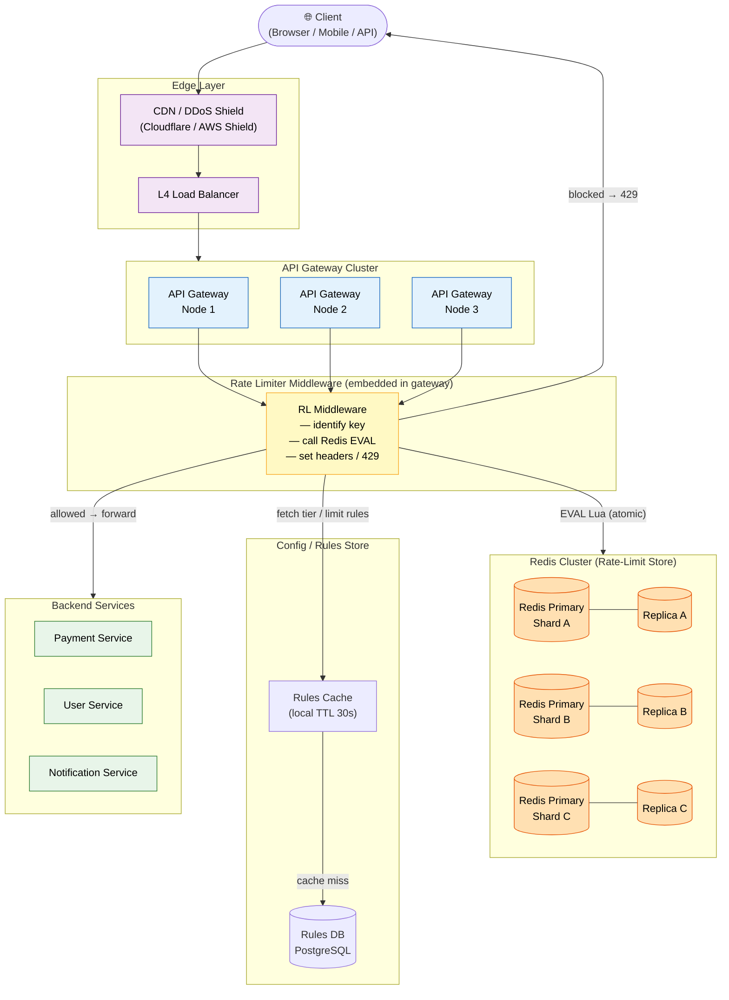
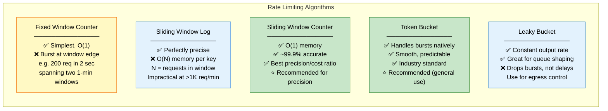
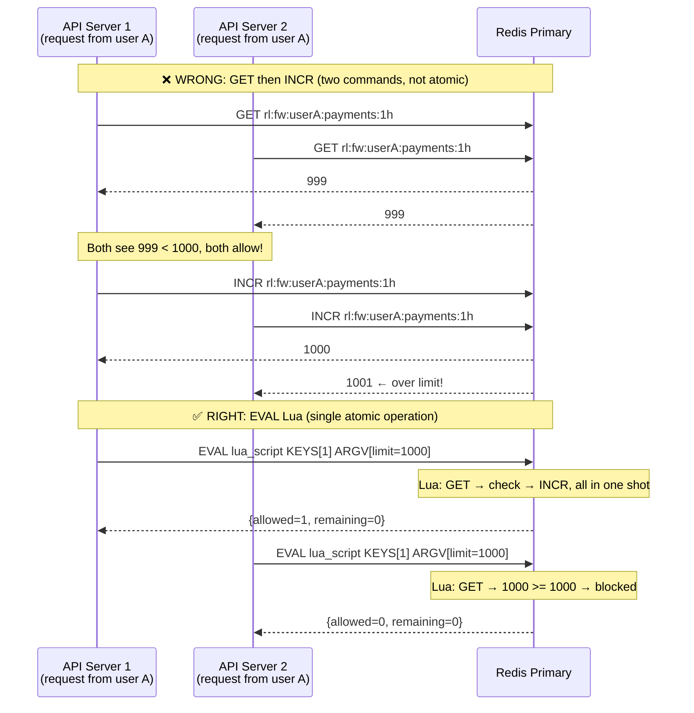
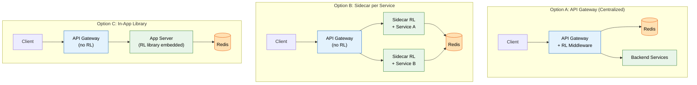

# Design Rate Limiter

> A distributed rate limiter that enforces per-user, per-IP, and per-endpoint request quotas across a fleet of API servers — without a single point of failure.

**Difficulty:** ⭐⭐ · **Builds on:**
[Level-03 · Rate-Limiting Concepts](../../Level-03-Communication/07-Rate-Limiting/README.md) ·
[Level-03 · API Design](../../Level-03-Communication/01-API-Design-REST/README.md) ·
[Level-01 · Caching](../../Level-01-Building-Blocks/03-Caching/README.md) ·
[Level-05 · API Gateway](../../Level-05-Architecture-Patterns/05-API-Gateway/README.md) ·
[Bonus · URL Shortener](../01-URL-Shortener/README.md)

---

## 1. 🎯 Problem & Scope

You're designing the rate-limiting layer for a public API platform (think Stripe, Twilio, or GitHub). Without rate limiting, a single misbehaving client — or a bug in a mobile app — can saturate your database, starve out legitimate traffic, and trigger a cascading outage.

**The core challenge:** you have hundreds of API servers. Each server handles only a slice of total traffic. Counting locally on each server is useless — you need a *shared*, *consistent* counter that all servers can increment atomically, with sub-millisecond latency and no single point of failure.

**What you're building:**
- A distributed rate limiter service (or middleware) that sits in the hot path of every API request
- Support for multiple rate-limit dimensions: per-user, per-IP, per-API-key, per-endpoint, global
- Multiple algorithms with different precision/performance trade-offs
- Graceful handling of Redis downtime (fail open vs. fail closed)
- Correct HTTP 429 responses with retry guidance

**Out of scope:** Authentication, billing, request body validation, DDoS protection at the network layer.

---

## 2. 📋 Requirements

### Functional

- **Enforce quotas** at multiple granularities: per user, per IP, per API key, per endpoint, and globally
- **Multiple time windows:** per-second, per-minute, per-hour, per-day
- **Soft vs. hard limits:** soft limits allow short bursts; hard limits never exceed the cap
- **Return 429 Too Many Requests** with `Retry-After`, `X-RateLimit-Limit`, `X-RateLimit-Remaining`, `X-RateLimit-Reset` headers on breach
- **Different limits per tier:** free users get 60 req/min; pro users get 1000 req/min; enterprise gets custom limits
- **Cascading protection:** independent limits at the gateway, service, and database layers

### Non-Functional

- **Latency:** add no more than 1–2 ms P99 to the request path
- **Availability:** rate limiter must not be a hard dependency — if it's down, the system decides to fail open (allow) or fail closed (block), depending on the use case
- **Accuracy:** tolerate at most ~0.1% overcounting in the sliding window approximation
- **Throughput:** handle 500K+ check-and-increment operations per second
- **Consistency:** distributed counters must be accurate enough that a client can't significantly exceed their quota by hitting different servers
- **Durability:** counters don't need to survive restarts (they're short-lived by design)

---

## 3. 🧮 Capacity Estimation

### Traffic assumptions

- 50 million API calls per day
- Peak traffic: 5× average → roughly **3,000 requests/sec** at peak (50M / 86400 ≈ 578 avg, × 5 = ~2,900)
- Each request triggers **1 Redis call** (EVAL Lua script, atomic)
- Redis can handle **100K–500K ops/sec** on a single node — we have plenty of headroom

### Redis memory

Each rate-limit counter entry stores:

```
key  = "rl:{user_id}:{endpoint}:{window}"   → ~40–60 bytes
value = integer count                         → 8 bytes
TTL  = window duration (auto-expiry)
```

Sliding Window Log (worst case): stores every timestamp for the window.

```
1,000 req/min limit × 60 bytes per timestamp = 60 KB per user per window
10,000 active users × 60 KB = 600 MB  ← impractical at scale
```

Sliding Window Counter (practical): only 2 integers per window.

```
2 keys × 8 bytes = 16 bytes per user per window
10,000 active users × 5 dimensions × 16 bytes = ~800 KB  ← totally fine
```

Fixed / Token Bucket: similar to sliding window counter — a few bytes per key.

```
1 million active keys × 64 bytes avg = 64 MB  ← negligible
```

**Verdict:** Sliding Window Counter uses ~64–100 MB for 1M active users. A single Redis instance with 1–2 GB RAM handles this easily. Use Redis Cluster if you need horizontal scale or geo-distribution.

### Replication & failover

- 1 primary + 2 replicas per shard
- Writes go to primary; reads are served locally during a check (the Lua script runs on primary)
- Redis Sentinel for automatic failover; failover completes in ~30 seconds

---

## 4. 🔌 API Design

### Rate limiter internal interface

This is the interface your API Gateway / middleware calls:

```http
POST /internal/ratelimit/check
Content-Type: application/json

{
  "user_id":    "usr_abc123",
  "ip":         "203.0.113.45",
  "api_key":    "sk_live_xyz",
  "endpoint":   "/v1/payments",
  "method":     "POST",
  "tier":       "pro"
}
```

**Response — allowed (200):**

```json
{
  "allowed":    true,
  "limit":      1000,
  "remaining":  873,
  "reset_at":   1719187260,
  "retry_after": null
}
```

**Response — blocked (429):**

```json
{
  "allowed":     false,
  "limit":       1000,
  "remaining":   0,
  "reset_at":    1719187260,
  "retry_after": 42,
  "reason":      "per_user_minute_limit_exceeded"
}
```

### Client-facing 429 response

```http
HTTP/1.1 429 Too Many Requests
X-RateLimit-Limit: 1000
X-RateLimit-Remaining: 0
X-RateLimit-Reset: 1719187260
Retry-After: 42
Content-Type: application/json

{
  "error": {
    "code":    "rate_limit_exceeded",
    "message": "You have exceeded the rate limit of 1000 requests per minute.",
    "docs_url": "https://api.example.com/docs/rate-limits"
  }
}
```

`Retry-After` is in seconds. `X-RateLimit-Reset` is a Unix timestamp. Both let clients back off intelligently instead of hammering you harder.

---

## 5. 🗄️ Data Model

### Algorithm → Redis data structure mapping

| Algorithm | Redis Structure | Key pattern | TTL |
|---|---|---|---|
| Fixed Window Counter | `STRING` (integer) | `rl:fw:{uid}:{endpoint}:{window_ts}` | window duration |
| Sliding Window Log | `SORTED SET` | `rl:swl:{uid}:{endpoint}` | window duration |
| Sliding Window Counter | Two `STRING`s | `rl:swc:{uid}:{endpoint}:{curr_ts}` + `{prev_ts}` | window duration |
| Token Bucket | `HASH` | `rl:tb:{uid}:{endpoint}` → `{tokens, last_refill}` | idle TTL |
| Leaky Bucket | `LIST` + `STRING` | `rl:lb:{uid}:{endpoint}` | window duration |

### Token Bucket — Redis HASH

```
HSET rl:tb:usr_abc:/v1/payments tokens 850 last_refill 1719187218
EXPIRE rl:tb:usr_abc:/v1/payments 3600
```

Fields: `tokens` (float, current bucket level), `last_refill` (Unix timestamp of last refill).

### Sliding Window Counter — two STRING counters

```
rl:swc:usr_abc:/v1/payments:1719187200   →  124  (TTL: 120s)
rl:swc:usr_abc:/v1/payments:1719187260   →   37  (TTL: 120s)
```

The Lua script reads both, computes the weighted count, and increments the current-window key — all atomically.

### Sliding Window Log — SORTED SET

```
ZADD rl:swl:usr_abc:/v1/payments 1719187218.341 "req:uuid1"
ZADD rl:swl:usr_abc:/v1/payments 1719187219.002 "req:uuid2"
...
ZREMRANGEBYSCORE rl:swl:usr_abc:/v1/payments -inf (now - window)
ZCARD rl:swl:usr_abc:/v1/payments
```

Score = request timestamp (float). Trim old entries before counting. Precise, but memory-hungry at high limits.

---

## 6. 🏗️ High-Level Architecture



### Request flow walk-through

1. **Client** sends `POST /v1/payments` with `Authorization: Bearer sk_live_xyz`.
2. **CDN / L4 LB** absorbs network-level floods, forwards TCP to an API Gateway node.
3. **API Gateway** extracts the rate-limit key — typically `{user_id}:{endpoint}` — and invokes the RL middleware.
4. **RL Middleware** looks up the user's tier and limit rules from its **local in-memory cache** (refreshed every 30 s from the Rules DB). Cache hit keeps this under 100 µs.
5. Middleware calls `EVAL <lua_script> 1 <key> <limit> <window> <now>` on the correct **Redis shard** (key hashing routes to the right primary).
6. **Lua script** atomically reads the counter, checks the limit, increments if allowed, and returns `{allowed, remaining, reset_at}`.
7. If **allowed**: gateway forwards to the backend service, injects `X-RateLimit-*` headers into the response.
8. If **blocked**: gateway returns `429 Too Many Requests` immediately — the backend is never touched.
9. Backend services have **their own inner rate limits** (e.g., DB query limits) as a second line of defence.

---

## 7. 🔬 Deep Dives

### 7.1 Choosing the Right Algorithm

All five algorithms solve rate limiting differently. Here's when to use each:



**Recommendation:**
- Use **Token Bucket** as your default. It handles bursty legitimate traffic (a user loads a dashboard and fires 10 calls at once) while enforcing an average rate. Easy to reason about.
- Use **Sliding Window Counter** when precision matters — billing APIs, quota enforcement — because the fixed window boundary burst is unacceptable.
- Avoid **Sliding Window Log** unless your limits are very low (< 100 req/window) and you have the memory budget.

### 7.2 Atomic Lua Script — The Heart of the System

The most critical correctness requirement is that **read-check-increment** is atomic. In Redis, you achieve this with a Lua script that runs as a single transaction (no other command can interleave).

Here's the **Sliding Window Counter** Lua script — the recommended precision algorithm:

```lua
-- KEYS[1] = current window key  e.g. "rl:swc:usr_abc:/payments:1719187260"
-- KEYS[2] = previous window key e.g. "rl:swc:usr_abc:/payments:1719187200"
-- ARGV[1] = limit               e.g. "1000"
-- ARGV[2] = window_seconds      e.g. "60"
-- ARGV[3] = current_time_ms     e.g. "1719187242500"
-- ARGV[4] = window_start_ms     e.g. "1719187200000"  (floored to window)

local limit         = tonumber(ARGV[1])
local window_ms     = tonumber(ARGV[2]) * 1000
local now_ms        = tonumber(ARGV[3])
local curr_start_ms = tonumber(ARGV[4])
local prev_start_ms = curr_start_ms - window_ms

-- How far into the current window are we? (0.0 → 1.0)
local elapsed_fraction = (now_ms - curr_start_ms) / window_ms

-- Weight of the previous window that still falls inside our sliding window
local prev_weight = 1.0 - elapsed_fraction

-- Get current counts
local curr_count = tonumber(redis.call('GET', KEYS[1])) or 0
local prev_count = tonumber(redis.call('GET', KEYS[2])) or 0

-- Weighted total: previous window contributes proportionally
local weighted_total = math.floor(prev_count * prev_weight) + curr_count

if weighted_total >= limit then
    -- Blocked — return remaining=0, time until window resets
    local ttl = math.ceil((curr_start_ms + window_ms - now_ms) / 1000)
    return {0, 0, ttl}
end

-- Allowed — increment current window counter
local new_count = redis.call('INCR', KEYS[1])
if new_count == 1 then
    -- First request in this window — set expiry
    redis.call('PEXPIRE', KEYS[1], window_ms * 2)
end

local remaining = limit - weighted_total - 1
local reset_in  = math.ceil((curr_start_ms + window_ms - now_ms) / 1000)
return {1, remaining, reset_in}
-- Returns: {allowed (0/1), remaining, seconds_until_reset}
```

**Why Lua?** Redis executes a Lua script atomically — no other command runs between `GET` and `INCR`. This eliminates the classic TOCTOU race condition where two concurrent requests both read `count=999`, both see it's under the limit, and both increment to 1000 and 1001.

**Token Bucket Lua** (for burst-friendly limiting) would instead:
1. Compute tokens to add since last refill: `tokens_to_add = (now - last_refill) * refill_rate`
2. Cap at max_tokens: `tokens = min(current_tokens + tokens_to_add, max_tokens)`
3. If `tokens >= 1`: subtract 1, allow. Else: block.

### 7.3 Race Conditions & Distributed Consistency



**Other race conditions to watch for:**

- **Clock skew:** Different servers may have slightly different system clocks. Use a single `now` timestamp from Redis (`TIME` command) inside the Lua script instead of passing it from the application server — or accept ±1ms jitter.
- **Redis replication lag:** If a primary fails and you fail over to a replica, the replica may have missed the last few writes. You can see a brief window where counters are slightly under-counted. Acceptable in most cases; use synchronous replication (`WAIT 1 0`) if not.
- **Partitioned Redis:** If your Redis Cluster splits, some nodes become unavailable. The client library should fail the rate-limit check — you then decide: fail open (allow the request, risk abuse) or fail closed (block the request, risk availability).

### 7.4 Deployment Topology: Where Does the Rate Limiter Live?



| | API Gateway | Sidecar | In-App Library |
|---|---|---|---|
| **Centralized logic** | ✅ Single place to update rules | ❌ Deploy to every sidecar | ❌ Deploy to every app |
| **Language agnostic** | ✅ Gateway speaks HTTP | ✅ Sidecar handles translation | ❌ Need library per language |
| **Fine-grained control** | ❌ Hard to limit per-method | ✅ Service knows its context | ✅ Full access to app state |
| **Latency** | ✅ One hop | ✅ Localhost call | ✅ In-process |
| **Blast radius if RL bugs** | ❌ Affects all services | ✅ Isolated per service | ✅ Isolated per service |

**Recommendation:** Start with the API Gateway approach. It's the simplest to operate and gives you a single enforcement point. Add service-level limits as a secondary safety net once you know which services need independent quotas.

---

## 8. 📈 Scaling, Bottlenecks & Failure Modes

### Scaling Redis

- A single Redis node at 100K–500K ops/sec handles most APIs up to ~100M req/day.
- Beyond that: **Redis Cluster** with consistent hashing. Shard by `user_id` so one user's requests always hit the same shard (avoids cross-shard transactions).
- For multi-region (US + EU + APAC): run independent Redis clusters per region. Accept that a user who routes through two regions (via anycast DNS) might slightly exceed their quota. Add a global counter with lower accuracy if you need strict global enforcement.

### Bottlenecks

1. **Hot keys:** A viral API key can hammer a single Redis shard. Mitigate with **local in-process caching**: cache the "this key is throttled" signal for 1–5 seconds. After a 429, the next N requests short-circuit before touching Redis.
2. **Lua script CPU:** Complex scripts slow down Redis (it's single-threaded per shard). Keep your Lua under 50 µs — the sliding window counter script above is ~5 µs.
3. **Rules DB latency:** Fetching limit rules on every request is fatal. Cache in-process with a 30-second TTL. Propagate rule changes via a pub/sub channel to invalidate caches immediately.

### Failure modes & mitigations

| Failure | Impact | Mitigation |
|---|---|---|
| Redis primary dies | Counters unavailable until failover (~30s) | **Fail open** (allow traffic, log for audit) for most APIs; **fail closed** for sensitive endpoints. Redis Sentinel auto-promotes replica. |
| Redis Cluster partition | Some shards unreachable | Route to replica (reads may be slightly stale). If primary unreachable: fail open or closed per policy. |
| RL middleware crash | No rate limiting enforced | Deploy as a sidecar or library so it's co-located with the gateway process. Monitor with health checks. Circuit breaker on the Redis call. |
| Clock skew between app servers | Window boundaries off by ±1s | Read `now` from Redis `TIME` command inside Lua, or accept the jitter (usually harmless). |
| Burst at window boundary (fixed window) | Up to 2× the limit in 1 second | Switch to sliding window counter or token bucket. |

### Cascading protection (defence in depth)

```
Client → [CDN: IP-level throttle 10K/min]
       → [API Gateway RL: per-user 1K req/min]
       → [Service RL: per-endpoint 500 req/min]
       → [DB connection pool: 100 connections max]
```

Each layer uses a different limit and a different mechanism. If the outer layer is misconfigured, the inner layers still protect the most critical resources.

---

## 9. ⚖️ Trade-offs & Alternatives

### Soft vs. hard limits

- **Soft limit:** Allow up to 10% over the limit for short bursts (token bucket with burst allowance). Better UX for legitimate bursty clients like mobile apps. Risk: clients learn to exploit the burst.
- **Hard limit:** Zero tolerance. Useful for billing boundaries (you paid for 1000 calls, you get exactly 1000). Requires sliding window counter or sliding window log.

### Local vs. centralized counting

- **Local (per-server) counters:** zero latency overhead, no Redis dependency, but wildly inaccurate across a fleet. A user hitting 10 servers gets 10× their quota. Only viable for single-server deployments or as a pre-filter for obvious abusers.
- **Centralized Redis:** accurate, ~0.5–1 ms overhead, Redis is a dependency. The standard choice for distributed systems.
- **Gossip / eventually consistent counters:** each node tracks local count and periodically syncs with peers. Accurate enough for loose quotas, no single Redis bottleneck. Hard to implement correctly; rarely needed unless Redis is a proven bottleneck.

### Algorithm comparison summary

| Algorithm | Memory | Accuracy | Burst handling | Complexity |
|---|---|---|---|---|
| Fixed Window Counter | O(1) | ❌ Boundary burst | ❌ None | Very low |
| Leaky Bucket | O(N queue) | ✅ Precise rate | ❌ Drops bursts | Medium |
| Token Bucket | O(1) | ✅ Good | ✅ Native burst | Medium |
| Sliding Window Log | O(requests) | ✅ Perfect | ✅ Accurate | Medium |
| Sliding Window Counter | O(1) | ✅ ~99.9% | ✅ Good | Medium |

### Alternatives to Redis

- **Memcached:** Lacks Lua scripting → can't do atomic check-and-increment. Not suitable.
- **DynamoDB / Bigtable:** Conditional writes can approximate atomic increments, but latency is 5–20 ms vs. Redis's 0.3–1 ms. Use only if you need durable counters (billing-grade).
- **In-process (no external store):** Only for single-instance services. Use a `sync.Map` + goroutine or `java.util.concurrent.AtomicLong`.
- **Service Mesh (Envoy / Istio):** Built-in rate limiting via `ratelimit` service. Integrates with Redis under the hood. Good if you're already running a mesh.

---

## 10. 🌐 How It's Actually Done

Real engineering teams have open-sourced their approaches — here's what they found:

**Stripe** ([Engineering Blog](https://stripe.com/blog/rate-limiters)) uses a combination of Request Rate Limiters (per endpoint), Concurrent Request Limiters (max in-flight), and Fleet Usage Load Shedders. They explicitly recommend Token Bucket for user-facing APIs and note that "failing open" (allowing traffic when Redis is down) is the right choice for most endpoints — the alternative is a Redis outage taking down your entire API.

**Cloudflare** uses a sliding window approach built on top of their distributed key-value store. Their "Leaky Bucket" variant meters egress traffic to prevent one customer's traffic spike from impacting others on shared infrastructure.

**GitHub** enforces API rate limits with fixed window counters (simple, visible to users) but uses sliding windows for abuse detection internally. Their `X-RateLimit-*` headers became the de facto standard that most APIs now follow.

**Kong / AWS API Gateway** both expose rate limiting as a configurable plugin/policy backed by Redis. Kong's `rate-limiting` plugin supports local (per-node), cluster (Redis), and hybrid modes.

**Envoy Proxy's `ratelimit` service** ([GitHub](https://github.com/envoyproxy/ratelimit)) is a production-grade open-source rate limiter written in Go, backed by Redis, that you can deploy as a sidecar with any Envoy-based service mesh (Istio, Consul Connect).

**Recommended reading:**
- Stripe's "Scaling your API with rate limiters" — covers why they chose token bucket and how they handle Redis failures
- "An alternative approach to rate limiting" by Figma — discusses sliding window counter implementation
- Redis documentation on `EVAL` and Lua scripting atomicity guarantees

---

## 11. 📝 Summary

### 30-second recap

You're building a distributed rate limiter that sits in the API gateway and enforces per-user, per-IP, and per-endpoint quotas across hundreds of app servers. The key insight is that **local counting doesn't work** — you need a shared atomic counter. Redis with a Lua script gives you that in under 1 ms. The Lua script runs `GET → check → INCR` as a single atomic operation, eliminating race conditions. For most APIs, **Token Bucket** is the right algorithm (handles legitimate bursts, simple mental model). For billing-grade precision, use **Sliding Window Counter** (two Redis keys, ~99.9% accurate, O(1) memory). When Redis goes down, fail open — don't let your rate limiter take down your API.

### What made this one hard

1. **Atomic counter in a distributed system:** Every server needs to share the same counter. The naive approach (GET then INCR) has a race condition. The fix (Lua script) is simple but non-obvious and requires understanding Redis's threading model.

2. **The fixed window burst problem:** Doubling your throughput for 1 second by timing requests at a window boundary is a real attack vector. The sliding window counter eliminates this with just two extra Redis keys and a weighted average — but explaining why the approximation is accurate under load requires careful math.

3. **Failure mode decisions:** Should your rate limiter fail open or closed when Redis dies? Neither answer is universally correct. The right answer depends on your threat model, your users, and your SLA — and you need to have thought it through before the incident, not during it.

4. **Where to enforce:** Gateway, sidecar, or in-app? The answer affects your deployment model, your ability to enforce limits per microservice, and your blast radius when things go wrong. Each approach has genuine trade-offs that depend on your org structure as much as your technical requirements.
