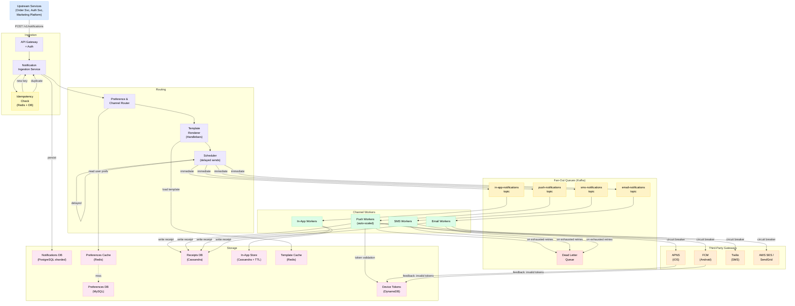
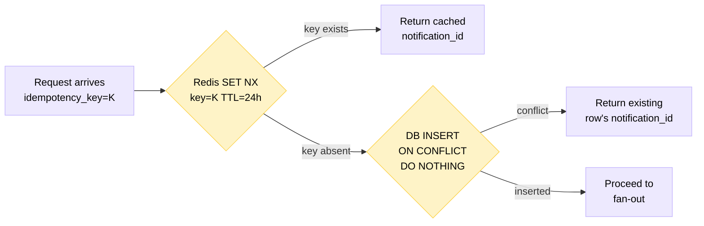
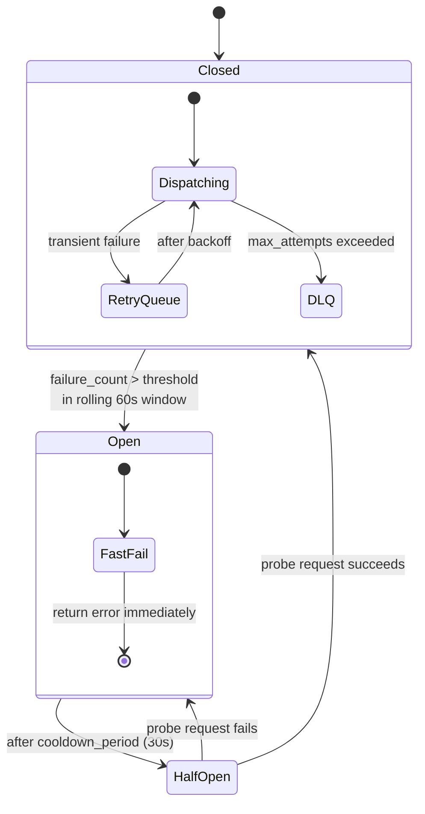
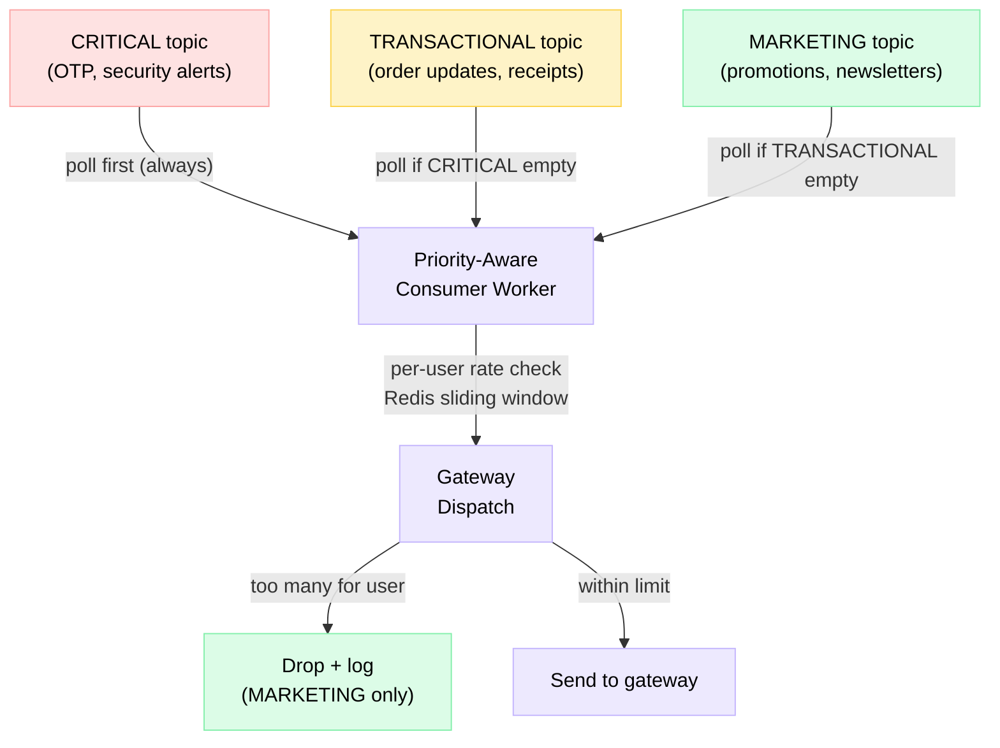

# Design Notification Service

> A multi-channel notification platform that reliably delivers billions of push, SMS, email, and in-app messages per day while respecting user preferences, surviving third-party gateway failures, and never sending the same message twice.

**Difficulty:** ⭐⭐⭐ · **Builds on:**
[Message Queues](../../Level-03-Communication/04-Message-Queues/README.md) ·
[Rate Limiting](../../Level-03-Communication/07-Rate-Limiting/README.md) ·
[Idempotency & Exactly-Once](../../Level-04-Distributed-Systems/07-Idempotency-and-Exactly-Once/README.md) ·
[Resilience Patterns](../../Level-05-Architecture-Patterns/06-Resilience-Patterns/README.md) ·
[Caching](../../Level-01-Building-Blocks/03-Caching/README.md) ·
[Sibling: Rate Limiter](../03-Rate-Limiter/README.md)

---

## 1. 🎯 Problem & Scope

You are asked to design the notification service that sits behind apps like Uber, Instagram, DoorDash, or Slack. At its simplest it sounds easy — call Twilio, done. But at scale the interesting problems appear fast:

- 1 billion notifications/day means ~11,500/sec sustained, with spikes during marketing blasts
- Every third-party gateway (APNS, FCM, Twilio, SES/SendGrid) has its own rate limits, SLAs, and failure modes
- A user might have 5 devices, 3 email addresses, and explicit per-topic opt-outs
- A marketing campaign must never send a promo twice if the first attempt timed out
- A password-reset SMS must never be silently dropped

**In scope:**
- Ingestion API for upstream services to request notifications
- Fan-out to Push (iOS/Android), SMS, Email, and In-App channels
- Per-user, per-channel, per-notification-type preference management
- Template rendering with localization (i18n)
- Retry logic, dead-letter queues, circuit breakers for third-party gateways
- Idempotent delivery (exactly-once semantics visible to the user)
- Delivery receipt tracking (sent, delivered, opened, clicked, bounced)
- Rate limiting and priority tiers (transactional > marketing)
- Device token lifecycle (registration, rotation, invalidation)

**Out of scope:** designing the upstream services themselves, email/SMS gateway internals, anti-spam ML scoring.

---

## 2. 📋 Requirements

### Functional

1. **Send Notification** — upstream services POST a notification request with recipient ID, type, payload, and optional template data; the system fans out across eligible channels.
2. **Channel Support** — Push (APNS for iOS, FCM for Android), SMS (Twilio), Email (AWS SES or SendGrid), In-App (stored and served via API).
3. **User Preferences** — users can opt out globally, per channel, or per notification type (e.g., "no marketing emails but yes transactional SMS").
4. **Template Engine** — notifications are rendered from versioned templates (Handlebars/Mustache) with per-locale variants.
5. **Device Token Management** — register/deregister tokens; handle token invalidation from APNS/FCM feedback services.
6. **Priority Tiers** — `CRITICAL` (OTP, security alerts), `TRANSACTIONAL` (order updates), `MARKETING` (promotions) — processed in strict priority order.
7. **Delivery Receipts** — track sent, delivered, opened, clicked, failed, bounced per notification per channel.
8. **Deduplication** — callers supply an idempotency key; the same key is never delivered more than once.

### Non-Functional

| Concern | Target |
|---|---|
| Scale | 100M DAU, 1B notifications/day |
| Throughput | ~11,500 notifications/sec sustained; 50k/sec burst |
| Latency | CRITICAL notifications dispatched to gateway <1 s P99 |
| Availability | 99.99% ingestion API uptime; delivery is best-effort per channel |
| Durability | No notification lost once accepted by ingestion API |
| Idempotency | At-most-once visible delivery per user per notification |
| Preference propagation | Opt-outs respected within 60 seconds |
| Observability | Per-channel delivery rate, latency, DLQ depth dashboards |

---

## 3. 🧮 Capacity Estimation

### Traffic

```
DAU:                 100,000,000 users
Notifications/user/day:      10  (mix of push-heavy, some email/SMS)
Total/day:       1,000,000,000  (1B)

Seconds/day:              86,400
Average throughput: 1B / 86,400 ≈ 11,574/sec

Channel split (rough):
  Push (FCM/APNS):  60% → 600M/day ≈ 6,944/sec
  In-App:           25% → 250M/day ≈ 2,894/sec
  Email:            12% → 120M/day ≈   1,389/sec
  SMS:               3% →  30M/day ≈     347/sec

Peak burst factor: 3–5x during marketing blasts
Peak push throughput: ~35,000/sec
```

### Storage

```
Notification record:   ~500 bytes
In-App retention:      30 days
In-App stored/day:     250M × 500B ≈ 125 GB/day
30-day window:         ~3.75 TB (before compression)

Delivery receipt:      ~200 bytes per channel attempt
Receipts/day:          1B × 1.2 attempts avg ≈ 240 GB/day
Retained 90 days:      ~21 TB (hot/warm tiered; compress to ~5 TB)

Device token table:
  100M users × 2 devices avg = 200M tokens
  Each token record: ~256 bytes → ~51 GB (fits in a sharded MySQL cluster)
```

### Bandwidth

```
Payload to gateway (push):  ~1 KB/notification
6,944/sec × 1 KB ≈ 6.9 MB/sec outbound to FCM/APNS — trivial
```

The storage numbers mean you need a time-series-friendly DB for receipts and a TTL-aware store for in-app notifications. The compute bottleneck is the **worker fleet** dispatching to gateways, not CPU or bandwidth.

---

## 4. 🔌 API Design

### Send Notification (Producer-facing)

```
POST /v1/notifications
Authorization: Bearer <service-token>

{
  "idempotency_key": "order-svc:order_123:shipped",   // caller-supplied UUID or composite key
  "recipient_id":    "usr_abc123",
  "notification_type": "ORDER_SHIPPED",               // maps to template + channel rules
  "priority":        "TRANSACTIONAL",                 // CRITICAL | TRANSACTIONAL | MARKETING
  "channels":        ["PUSH", "EMAIL"],               // optional override; default: preference-driven
  "template_data": {
    "order_id":      "ORD-9981",
    "item_name":     "Running Shoes",
    "eta":           "Tomorrow by 8pm"
  },
  "scheduled_at":    null                             // null = send immediately; ISO-8601 for future
}

Response 202 Accepted:
{
  "notification_id": "notif_xyz789",
  "status":          "QUEUED"
}
```

### User Preferences

```
GET  /v1/users/{user_id}/preferences
PUT  /v1/users/{user_id}/preferences
{
  "global_opt_out": false,
  "channels": {
    "PUSH":  { "enabled": true },
    "SMS":   { "enabled": true },
    "EMAIL": { "enabled": true }
  },
  "notification_types": {
    "MARKETING": { "channels": ["EMAIL"], "enabled": true },
    "ORDER_SHIPPED": { "channels": ["PUSH", "SMS"], "enabled": true }
  }
}
```

### Device Token Management

```
POST   /v1/users/{user_id}/devices
DELETE /v1/users/{user_id}/devices/{device_id}
{
  "platform":    "IOS",          // IOS | ANDROID
  "token":       "<apns/fcm token>",
  "app_version": "4.2.1",
  "locale":      "en-US"
}
```

### Delivery Receipts (Internal + Consumer-facing)

```
GET /v1/notifications/{notification_id}/receipts
→ [{ "channel": "PUSH", "status": "DELIVERED", "timestamp": "..." }, ...]

POST /v1/webhooks/receipts          // gateway callbacks (FCM, APNS feedback)
POST /v1/notifications/{id}/events  // client-side open/click events
```

---

## 5. 🗄️ Data Model

### `notifications` table (PostgreSQL or MySQL, sharded by `recipient_id`)

| Column | Type | Notes |
|---|---|---|
| `notification_id` | UUID PK | |
| `idempotency_key` | VARCHAR(256) UNIQUE | Dedup fence |
| `recipient_id` | VARCHAR(64) | Shard key |
| `notification_type` | VARCHAR(64) | e.g. `ORDER_SHIPPED` |
| `priority` | ENUM | `CRITICAL`, `TRANSACTIONAL`, `MARKETING` |
| `template_id` | VARCHAR(64) | FK to templates |
| `template_data` | JSONB | Render context |
| `status` | ENUM | `QUEUED`, `PROCESSING`, `DONE`, `FAILED` |
| `scheduled_at` | TIMESTAMP | Null = immediate |
| `created_at` | TIMESTAMP | |
| `updated_at` | TIMESTAMP | |

Unique index on `idempotency_key` is the last-resort dedup guard.

### `delivery_receipts` table (time-series optimized, Cassandra or TimescaleDB)

| Column | Type | Notes |
|---|---|---|
| `receipt_id` | UUID PK | |
| `notification_id` | UUID | FK |
| `channel` | ENUM | `PUSH`, `SMS`, `EMAIL`, `IN_APP` |
| `gateway` | VARCHAR(32) | `FCM`, `APNS`, `TWILIO`, `SES` |
| `status` | ENUM | `SENT`, `DELIVERED`, `OPENED`, `CLICKED`, `FAILED`, `BOUNCED` |
| `attempt_number` | SMALLINT | 1-based retry counter |
| `gateway_message_id` | VARCHAR(128) | External reference |
| `error_code` | VARCHAR(64) | Null on success |
| `timestamp` | TIMESTAMP | Event time (partition key for Cassandra) |

Partition key: `(notification_id)`, clustering: `(timestamp, channel)`.

### `user_preferences` table (Redis + MySQL dual write)

| Column | Type | Notes |
|---|---|---|
| `user_id` | VARCHAR(64) PK | |
| `preferences_json` | JSONB | Full preference tree |
| `version` | BIGINT | Optimistic lock |
| `updated_at` | TIMESTAMP | |

Write to MySQL for durability, invalidate + re-cache in Redis (TTL 300s). Workers read from Redis; fall back to MySQL on cache miss. This keeps opt-outs propagating in <60 s.

### `templates` table (MySQL, read-heavy, cached aggressively)

| Column | Type | Notes |
|---|---|---|
| `template_id` | VARCHAR(64) PK | |
| `notification_type` | VARCHAR(64) | |
| `channel` | ENUM | |
| `locale` | VARCHAR(8) | e.g. `en-US`, `fr-FR` |
| `version` | SMALLINT | |
| `subject` | TEXT | Email subject line |
| `body_template` | TEXT | Handlebars/Mustache source |
| `active` | BOOLEAN | |
| `created_at` | TIMESTAMP | |

### `device_tokens` table (MySQL or DynamoDB, queried by `user_id`)

| Column | Type | Notes |
|---|---|---|
| `token_id` | UUID PK | |
| `user_id` | VARCHAR(64) | GSI / index |
| `platform` | ENUM | `IOS`, `ANDROID` |
| `token` | VARCHAR(512) UNIQUE | Push token |
| `locale` | VARCHAR(8) | For i18n template selection |
| `app_version` | VARCHAR(16) | |
| `valid` | BOOLEAN | Set false on APNS/FCM feedback |
| `registered_at` | TIMESTAMP | |
| `invalidated_at` | TIMESTAMP | |

---

## 6. 🏗️ High-Level Architecture



### Request Flow Walk-through

1. **Upstream service** calls `POST /v1/notifications` with an `idempotency_key`, recipient ID, type, and template data.
2. **Ingestion Service** checks the `idempotency_key` against Redis (fast path) and then the `notifications` DB (durable fence). If it already exists, return `202` with the existing `notification_id` — no work is duplicated.
3. The ingestion service persists a `QUEUED` record, then calls the **Preference & Channel Router**, which reads the user's opt-in/out state from **Redis** (falling back to MySQL on miss). Channels where the user has opted out are dropped here.
4. For each eligible channel the **Template Renderer** selects the correct template variant (channel × locale × notification_type), hydrates it with `template_data`, and produces a fully-rendered payload.
5. Rendered per-channel messages are published to the appropriate **Kafka topic** (`push-notifications`, `sms-notifications`, `email-notifications`, `in-app-notifications`) with priority encoded in the message header.
6. **Channel Workers** consume from their topic. Each worker calls the third-party gateway through a **circuit breaker**. On success, a `SENT` receipt is written to Cassandra.
7. On transient failure the worker **retries with exponential backoff + jitter** (see Deep Dives). After exhausting retries the message lands in the **Dead Letter Queue** for alerting and manual inspection.
8. Gateways asynchronously call back for delivery confirmations (`DELIVERED`), bounces, and invalid-token feedback. The token table is updated accordingly.
9. Client apps report `OPENED`/`CLICKED` events via the receipts API, completing the engagement funnel.

---

## 7. 🔬 Deep Dives

### 7.1 Idempotency & Deduplication

This is the hardest correctness problem. The same notification can arrive at the gateway twice due to:
- Network timeout on the first attempt (worker retried, but the first delivery succeeded)
- Duplicate message from Kafka (consumer rebalance before offset commit)
- Caller retrying the ingestion API

**Two-fence approach:**



**At the worker level**, before dispatching to the gateway, the worker checks whether a `SENT` receipt already exists for this `(notification_id, channel)` pair. If yes, skip — don't call the gateway again. This covers the Kafka duplicate case.

**Gateway-level idempotency:** FCM supports a `message_id` that is idempotent within a 24h window. APNS does not — so APNS dedup relies entirely on the worker-level receipt check.

**The tricky window:** there is a brief race between a worker checking for an existing receipt and writing a new one. You close this with a DB-level unique index on `(notification_id, channel, attempt_number)` and catching the constraint violation.

### 7.2 Third-Party Gateway Failures & Circuit Breaker

Every gateway has its own failure personality:
- **FCM**: 500s under load, 401 for expired credentials, 400 for invalid tokens
- **APNS**: connection drops (HTTP/2 persistent), 410 Gone for unregistered tokens
- **Twilio**: 429 rate-limit with `Retry-After`, 400 for invalid numbers
- **SES**: daily sending quota, bounce rate thresholds that suspend your account



**Retry schedule with jitter** (prevents thundering herd after an outage clears):

```
attempt 1: immediate
attempt 2: base_delay=2s + random(0, 1s)
attempt 3: 4s + jitter
attempt 4: 8s + jitter
attempt 5: 16s + jitter   ← max; then DLQ
```

Jitter formula: `sleep = min(cap, base * 2^attempt) + random(0, base)`

**DLQ strategy:** messages in the DLQ trigger a PagerDuty alert. An on-call engineer either re-fans (if the gateway recovered) or marks the notification as permanently failed. CRITICAL tier DLQ messages page immediately; MARKETING tier are reviewed daily.

### 7.3 Rate Limiting & Priority Tiers

Two dimensions of rate limiting:
1. **Per-upstream-service** — order-service can't accidentally flood notifications
2. **Per-user** — prevent a bug from spamming a single user 1000x in 10 seconds

Priority queues in Kafka are implemented with **separate topics** and a consumer that polls `CRITICAL` topic first, then `TRANSACTIONAL`, then `MARKETING` (weighted round-robin, not strict starvation).



Per-user rate limits (examples):

| Priority | Limit |
|---|---|
| CRITICAL | No limit (always send) |
| TRANSACTIONAL | 50/hour/user |
| MARKETING | 3/day/user, 1/hour/user |

### 7.4 Device Token Lifecycle

Push notifications fail silently if you have stale tokens. Token hygiene is critical.

**Token rotation flow:**
- On app launch, the mobile SDK checks if the OS-provided token differs from the stored one
- If different, call `POST /v1/users/{uid}/devices` with the new token; the old record is soft-deleted
- Workers always query the **current valid** tokens from DynamoDB just before dispatch

**APNS/FCM feedback:**
- APNS returns a `410 Gone` with `timestamp` when a token has been unregistered; set `valid=false` in the token table if the `timestamp` is newer than `registered_at`
- FCM returns `registration.not_registered` in the response body; same invalidation logic
- A nightly **token audit job** queries FCM's batch endpoint for all tokens and marks stale ones

**Multi-device fan-out:** a user with 3 valid push tokens gets 3 push attempts — you write 3 separate Kafka messages with the same `notification_id` but different `token_id`. Receipts are per-token, but the notification is considered `DELIVERED` if at least one token succeeds.

---

## 8. 📈 Scaling, Bottlenecks & Failure Modes

### Scaling the Ingestion API

The ingestion API is stateless — scale horizontally behind the API Gateway. The main write path is a Redis `SET NX` (dedup check) + a DB insert. At 11,500/sec the DB is the chokepoint: shard the `notifications` table by `recipient_id` across 32+ MySQL shards or use a NewSQL DB (CockroachDB, TiDB).

### Kafka Partitioning

Topic partitioning drives parallelism. Use `user_id` as the partition key to preserve per-user ordering within a channel. At 11,500/sec with 100-byte messages that is ~1.15 MB/sec per topic — a single Kafka cluster handles this comfortably with 64 partitions per topic and 3× replication.

### Worker Auto-scaling

Workers are K8s Deployments with HPA driven by **consumer lag** (via KEDA or a custom metric). When a marketing blast creates a spike, the push worker fleet scales out in <2 minutes. CRITICAL and TRANSACTIONAL workers have a higher min-replica count to avoid cold starts.

### Bottlenecks

| Component | Risk | Mitigation |
|---|---|---|
| Redis dedup check | Single point if Redis is down | Redis Cluster + local in-process LRU cache as L1 |
| Preference cache invalidation | Stale opt-out delivered | Pub/sub invalidation on preference write + short TTL (300s) |
| Gateway rate limits (Twilio) | SMS backed up | Multiple Twilio accounts (sub-accounts), round-robin |
| APNS HTTP/2 connection pool | Connection exhaustion | Maintain persistent connection pool; reconnect with backoff |
| DB shard hotspot | Power user with 1000 devices | Notifications table: shard by `notification_id` not `recipient_id` for write path; separate read path |

### Failure Modes

**Gateway fully down (e.g., Twilio outage):**
Circuit breaker opens. Messages accumulate in Kafka (retention: 7 days). When gateway recovers, circuit closes and workers drain the backlog. CRITICAL SMS may be rerouted to a fallback SMS provider (e.g., Vonage) via feature flag.

**Kafka broker failure:**
Replication factor 3 — producer `acks=all` means no message is lost. Consumer lag grows during broker election; workers resume automatically.

**Preference DB down:**
Workers fall back to the Redis cache. If Redis is also down, the safe default is to **send** (opt-in default) for TRANSACTIONAL and **suppress** (opt-out default) for MARKETING.

**DLQ grows unboundedly:**
Alert at 1,000 messages. CRITICAL DLQ pages on-call in <5 min. Runbook: triage by error code, determine if retry is safe, bulk re-publish or discard.

---

## 9. ⚖️ Trade-offs & Alternatives

### Kafka vs. SQS + SNS

| | Kafka | SQS + SNS fan-out |
|---|---|---|
| Replay | Yes — rewind by offset | No — once consumed, gone |
| Ordering | Per-partition | FIFO queues only, complex |
| Throughput | Millions/sec | ~100k/sec (FIFO) |
| Ops burden | High (cluster management) | Low (fully managed) |
| Cost | Compute-based | Per-message |

For a startup: SQS + SNS is faster to ship. At 1B/day: Kafka's replay and partitioned ordering win. Managed Kafka (Confluent Cloud, MSK) reduces ops burden.

### Push-only vs. Multi-channel Fan-out

You could build a simple push-only service and bolt on SMS/email later. The problem: user preferences are channel-aware from day one. Adding channels later requires retrofitting the preference model. Better to design the preference schema multi-channel upfront even if you only ship push first.

### Template rendering: server-side vs. client-side

Server-side (our approach): centralized control, easy A/B testing, one place to fix a typo. Client-side: smaller payload over the wire. For push notifications, the payload limit (4KB APNS, 4KB FCM) makes pre-rendering mandatory anyway.

### Synchronous vs. Asynchronous delivery

A caller could wait for gateway confirmation (synchronous). This ties the caller to third-party SLA jitter and makes the ingestion API as slow as the slowest gateway. The async queue pattern decouples them: ingestion is fast (P99 <50ms), and delivery is best-effort in the background. The trade-off: callers must poll receipts or use webhooks to know if delivery succeeded.

### At-most-once vs. At-least-once

Kafka consumers with `enable.auto.commit=true` give at-most-once (message can be lost if worker crashes after consume but before gateway call). `enable.auto.commit=false` + commit after gateway ACK gives at-least-once (possible duplicate, which you handle with the receipt dedup check). We choose **at-least-once** + dedup: better to check a receipt than to silently drop an OTP.

---

## 10. 🌐 How It's Actually Done

Real companies have published heavily on this problem:

- **Uber** runs a service called "Motif" (now open-sourced concepts in various posts). Their challenge was multi-region delivery with local compliance (EU SMS must route through EU gateways). They use a priority queue with per-user rate limiting enforced at the consumer level.

- **Airbnb** described their notification platform on the Airbnb Engineering blog. They migrated from a monolithic email service to a fan-out architecture using Kafka and per-channel microservices, reducing end-to-end latency for transactional emails from ~30s to <5s.

- **Slack** handles real-time notifications (WebSocket push) separately from async notifications (email digests). Their "Flannel" edge caching layer absorbs presence reads so the notification path stays fast.

- **Meta (Push)** uses a custom push delivery system called "Iris" that maintains persistent connections to APNS and FCM, batching tokens in a single HTTP/2 request frame. They coalesce multiple notifications to the same device into one push to reduce battery drain.

- **AWS SNS** is essentially a managed version of this architecture: topics, subscriptions per channel, fan-out. SNS's Mobile Push service manages APNS/FCM connections. The gap vs. building your own: SNS lacks per-user preference enforcement, dedup across channels, and custom retry policies — you'd bolt those on.

- **Twilio's best practices** (twilio.com/docs) cover exactly-once SMS: supply a unique `MessagingServiceSid` + your own idempotency key and Twilio will de-duplicate on their end within a 4-hour window.

- **FCM documentation** covers token management, topic messaging (for broadcast), and the feedback service for stale tokens. Their recommendation: always check `registration.not_registered` responses and prune immediately.

---

## 11. 📝 Summary

**30-second recap:**

You build a multi-channel notification platform by:
1. Accepting notification requests via an idempotent ingestion API (dedup with `idempotency_key`)
2. Routing through a preference engine that enforces per-user, per-channel, per-type opt-outs (Redis-cached)
3. Rendering templates server-side (Handlebars + locale selection)
4. Fan-out publishing to per-channel Kafka topics with CRITICAL / TRANSACTIONAL / MARKETING priority
5. Per-channel worker fleets that dispatch to third-party gateways (FCM, APNS, Twilio, SES) through circuit breakers with exponential-backoff retry and DLQ
6. Writing delivery receipts to Cassandra and surfacing engagement events back through a receipts API
7. Maintaining device token hygiene by consuming APNS/FCM feedback and running periodic token audits

**What made this one hard:**

Four genuinely difficult sub-problems collide:
- **Exactly-once delivery** across a distributed retry system where the gateway itself may not be idempotent
- **Third-party gateway reliability** — you have zero control over APNS/FCM/Twilio uptime, rate limits, or API changes; your circuit breaker + DLQ design is the entire reliability story
- **Preference propagation latency** — a user opts out and then immediately receives the notification they just blocked, because the worker read a stale cache entry; the dual-write + short-TTL + pub/sub invalidation pattern is the careful answer
- **Priority without starvation** — MARKETING notifications must eventually be delivered (or explicitly dropped), not silently queued forever behind CRITICAL; the weighted consumer + per-tier DLQ handling closes that loop

Master these four and you have a genuinely production-grade notification service.
