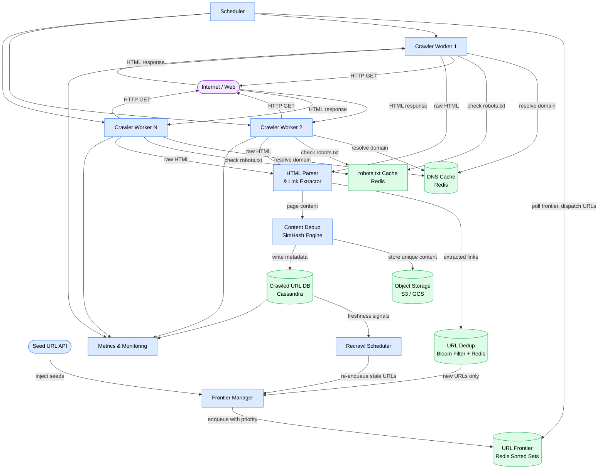
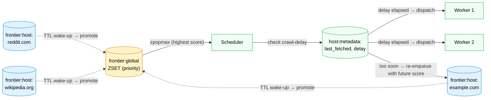
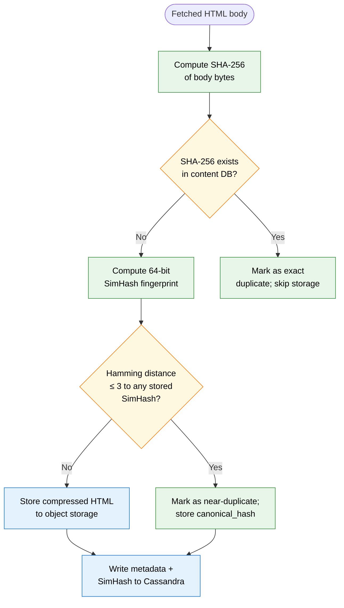

# Design Web Crawler

> A distributed system that systematically browses the internet, downloading and indexing billions of web pages for use by search engines, data pipelines, and archive services.

**Difficulty:** ⭐⭐⭐⭐ · **Builds on:**
[Caching & Bloom Filters](../../Level-01-Building-Blocks/03-Caching/README.md) ·
[Message Queues](../../Level-03-Communication/04-Message-Queues/README.md) ·
[Distributed Systems Fundamentals](../../Level-04-Distributed-Systems/README.md) ·
[Probabilistic Data Structures](../../Level-07-Big-Data-and-Specialized/06-Probabilistic-Data-Structures/README.md) ·
[Notification Service (sibling)](../04-Notification-Service/README.md)

---

## 1. 🎯 Problem & Scope

A web crawler (also called a spider or bot) starts from a seed set of URLs and recursively discovers and downloads pages across the web. The output feeds search engine indexes, content-change monitors, ML training corpora, and web archives (like the Wayback Machine).

**What you are designing:**

- Ingest a seed list of URLs and crawl outward via extracted links
- Download page content at massive scale (1 billion pages in 30 days)
- Deduplicate both URLs (avoid re-crawling the same address) and content (avoid storing duplicates)
- Respect `robots.txt` and crawl-delay politeness rules
- Store raw HTML and extracted metadata for downstream consumers

**Out of scope for this design:**

- Full-text indexing and search ranking (that is a separate system)
- JavaScript rendering / headless browser execution
- Real-time streaming of results to end users

---

## 2. 📋 Requirements

### Functional

1. **Seed ingestion** — accept a list of seed URLs to bootstrap the crawl
2. **Link extraction** — parse HTML, extract all `<a href>` links, and enqueue discovered URLs
3. **Page download** — fetch the raw HTML body of each URL via HTTP/HTTPS
4. **Content storage** — persist raw HTML and extracted metadata (URL, fetch timestamp, HTTP status, content hash)
5. **URL deduplication** — never enqueue a URL that has already been crawled or is already in the frontier
6. **Content deduplication** — detect and flag near-duplicate pages without storing redundant content
7. **robots.txt compliance** — fetch and cache each domain's robots.txt; honor `Disallow` paths and `Crawl-delay` directives
8. **Recrawl scheduling** — revisit pages on a schedule based on freshness signals (sitemap frequency hints, historical change rate)
9. **Crawl status API** — allow operators to query crawl progress, inspect URL status, and inject new seed URLs

### Non-Functional

| Requirement | Target |
|---|---|
| Scale | 1 billion pages crawled within 30 days |
| Politeness | ≤ 1 request/second per domain |
| Freshness | Popular pages recrawled within 24 hours; long-tail within 30 days |
| URL dedup accuracy | < 0.01% false-positive rate (Bloom filter tuned accordingly) |
| Availability | Crawler workers are stateless and horizontally restartable; frontier is durable |
| Fault tolerance | Any single worker crash loses at most one in-flight URL; no data is permanently lost |
| Storage durability | 99.999% — raw HTML stored in object storage with replication |

---

## 3. 🧮 Capacity Estimation

### Pages and throughput

```
Target:         1,000,000,000 pages in 30 days
Seconds in 30d: 30 × 24 × 3600 = 2,592,000 s

Required fetch rate = 1,000,000,000 / 2,592,000 ≈ 386 pages/sec
Round up with headroom → 400 pages/sec sustained
```

### Worker count

```
Average fetch latency (network + parse): ~500 ms
Requests in flight per worker (async):   50
Pages/sec per worker:                    50 / 0.5 = 100 pages/sec

Workers needed = 400 / 100 = 4 workers minimum
Run 20 workers for safety margin and burst capacity
```

### Bandwidth

```
Average page HTML size:    ~100 KB
Fetch rate:                400 pages/sec

Inbound bandwidth = 400 × 100 KB = 40 MB/s ≈ 320 Mbps
Over 30 days:       40 MB/s × 2,592,000 s ≈ 96 TB raw HTML
```

### Storage

```
Raw HTML (compressed ~3×): 96 TB / 3     ≈  32 TB
URL metadata per page:      ~200 bytes
Metadata total:             1B × 200 B   = 200 GB
Extracted links (avg 50/page, 100B each):
  10B links × 100 B                      =   1 TB
Content hash index (SHA-256, 32B + 8B URL pointer):
  1B × 40 B                              =  40 GB

Total storage needed ≈ 34 TB (compressed object storage) + ~1.3 TB structured data
```

### Bloom filter sizing

```
Target:        1B URLs, false-positive rate p = 0.01% = 0.0001
Bits needed:   m = -n × ln(p) / (ln2)² = -1B × ln(0.0001) / 0.48 ≈ 19.2B bits ≈ 2.4 GB
Hash functions: k = (m/n) × ln2 ≈ 13

→ A 2.4 GB Bloom filter comfortably fits in a Redis instance with a single replication replica.
```

### DNS caching

```
Unique domains (estimate 10% of 1B pages): 100M domains
DNS TTL respected; average domain hit rate: 10 pages/domain
Cache 100M <domain → IP> entries at ~60 bytes each = 6 GB
```

---

## 4. 🔌 API Design

### Submit seed URLs

```
POST /api/v1/crawl/seeds
Content-Type: application/json

{
  "urls": ["https://example.com", "https://news.ycombinator.com"],
  "priority": "high"          // "high" | "normal" | "low"
}

Response 202 Accepted:
{
  "queued": 2,
  "frontier_depth": 1
}
```

### Query URL crawl status

```
GET /api/v1/crawl/status?url=https%3A%2F%2Fexample.com

Response 200 OK:
{
  "url": "https://example.com",
  "status": "crawled",          // pending | in_flight | crawled | disallowed | error
  "last_crawled_at": "2026-06-20T14:32:00Z",
  "http_status": 200,
  "content_hash": "sha256:abc123...",
  "next_scheduled_at": "2026-06-21T14:32:00Z"
}
```

### Query crawl progress (operator endpoint)

```
GET /api/v1/crawl/progress

Response 200 OK:
{
  "pages_crawled_total": 482000000,
  "pages_in_frontier":   1200000000,
  "pages_per_second":    398,
  "worker_count":        20,
  "elapsed_hours":       347,
  "estimated_completion": "2026-07-19T08:00:00Z"
}
```

### Retrieve stored page content

```
GET /api/v1/pages/{sha256_hash}

Response 200 OK:
{
  "url": "https://example.com",
  "fetched_at": "2026-06-20T14:32:00Z",
  "content_type": "text/html",
  "raw_html_url": "s3://crawl-bucket/2026/06/20/abc123.html.gz",
  "links_extracted": 87
}
```

---

## 5. 🗄️ Data Model

### URL Frontier store (Redis sorted sets + per-host queues)

```
frontier:global          ZSET  score=priority  member=url
frontier:host:<domain>   ZSET  score=scheduled_at  member=url
host:metadata:<domain>   HASH  {last_fetched_at, crawl_delay_sec, robots_fetched_at}
```

The two-tier design gives you global priority control (which domains to prefer) while respecting per-host politeness delays.

### Crawled URL index (PostgreSQL or Cassandra)

```sql
CREATE TABLE crawled_urls (
  url_hash       BYTEA PRIMARY KEY,     -- SHA-256 of normalized URL
  url            TEXT NOT NULL,
  status         SMALLINT NOT NULL,     -- HTTP status or internal code
  crawled_at     TIMESTAMPTZ NOT NULL,
  content_hash   BYTEA,                 -- SHA-256 of body; NULL on error
  next_crawl_at  TIMESTAMPTZ,
  change_freq    FLOAT,                 -- estimated daily change probability
  depth          INT,                   -- BFS depth from seed
  parent_url_hash BYTEA
);

CREATE INDEX idx_next_crawl ON crawled_urls (next_crawl_at)
  WHERE status = 200;
```

### Content store (Object Storage + metadata DB)

```sql
CREATE TABLE page_content (
  content_hash   BYTEA PRIMARY KEY,     -- SHA-256 of raw body
  simhash        BIGINT NOT NULL,       -- 64-bit SimHash fingerprint
  storage_key    TEXT NOT NULL,         -- e.g. s3://bucket/2026/06/abc123.html.gz
  byte_size      INT,
  stored_at      TIMESTAMPTZ NOT NULL,
  is_near_dup    BOOLEAN DEFAULT FALSE,
  canonical_hash BYTEA                  -- points to deduplicated canonical if near-dup
);

CREATE INDEX idx_simhash ON page_content (simhash);
```

Raw HTML blobs live in S3/GCS. The metadata row points to the object. Near-duplicate detection runs SimHash comparisons at write time.

### robots.txt cache (Redis)

```
robots:<domain>   STRING  serialized allow/disallow rules  TTL=24h
```

---

## 6. 🏗️ High-Level Architecture



### Request-flow walk-through

1. **Seed injection** — an operator `POST`s seed URLs to the Seed URL API. The Frontier Manager normalizes them (lowercase scheme+host, strip fragments, resolve relative paths) and inserts them into the Redis sorted set `frontier:global` with a high priority score.

2. **Scheduling** — the Scheduler continuously polls `frontier:global`, picks the highest-priority URL, and checks the per-host queue for that domain. If the host's crawl-delay has elapsed, it dispatches the URL to an available Crawler Worker; otherwise it re-schedules it with a delay.

3. **DNS resolution** — the Worker checks the Redis DNS cache for the domain. On miss it resolves via the system resolver and caches the `<domain → IP>` mapping with the record's TTL (min 60 s, max 24 h).

4. **robots.txt check** — before fetching any path on a domain the Worker fetches `robots.txt` (cached in Redis for 24 h). If the URL is disallowed, it marks it `DISALLOWED` in the Crawled URL DB and moves on.

5. **Page fetch** — the Worker issues an HTTP GET with a descriptive `User-Agent` header. It follows up to 3 redirects, enforces a 10-second timeout, and honours `Crawl-Delay` from robots.txt.

6. **HTML parsing & link extraction** — the HTML Parser extracts all `<a href>` values, normalizes them to absolute URLs, and passes each to the URL Dedup layer (Bloom filter backed by Redis). Only genuinely new URLs are forwarded back to the Frontier Manager.

7. **Content dedup** — the Content Dedup engine computes a SHA-256 hash of the body. Exact matches are discarded (content already stored). For near-duplicates it computes a 64-bit SimHash and compares it against existing fingerprints; if Hamming distance ≤ 3, the page is flagged as a near-duplicate and its `canonical_hash` is recorded.

8. **Storage** — unique content is gzip-compressed and written to object storage. Metadata (URL, status, content hash, SimHash, depth, timestamps) is written to Cassandra.

9. **Recrawl scheduling** — periodically the Recrawl Scheduler queries Cassandra for pages whose `next_crawl_at` has elapsed, re-enqueues them in the frontier with priority proportional to their estimated importance (PageRank proxy) and historical change frequency.

10. **Observability** — every worker emits metrics (pages/sec, error rate, queue depth, per-host request counts) to a central monitoring system.

---

## 7. 🔬 Deep Dives

### 7.1 URL Frontier: Two-Tier Priority + Politeness

The URL frontier is the heart of the crawler. A naive single FIFO queue fails on two axes: it ignores page importance, and it hammers individual domains with back-to-back requests.

**Two-tier architecture:**

- **Tier 1 — Global priority queue** (`frontier:global` Redis ZSET): ranks all known URLs by a score that combines estimated page importance (PageRank, link in-degree) and recency of discovery. The Scheduler always picks from the highest-score bucket.
- **Tier 2 — Per-host queues** (`frontier:host:<domain>` Redis ZSET): once the Scheduler picks a domain, it checks when that host was last fetched. If the elapsed time is less than `max(1s, crawl_delay_from_robots_txt)`, the URL is deferred back into the per-host queue with a future `scheduled_at` timestamp.



**Why Redis sorted sets?** `ZPOPMAX` and `ZADD` are O(log N) and atomic. A single Redis node handles ~100k ops/sec, easily covering our 400 pages/sec dispatch rate. For billion-scale frontiers you shard by domain hash across Redis Cluster nodes.

**Politeness contract:** each Worker records `last_fetched_at` in `host:metadata:<domain>`. The Scheduler reads this before dispatch. This guarantees ≤ 1 req/sec per domain even with 20 concurrent workers because the enforcement point is centralized in the Scheduler, not distributed across workers.

---

### 7.2 URL Deduplication: Bloom Filter + Backing Set

With 10 billion extracted links and only 1 billion unique pages to crawl, dedup is critical. You cannot afford to look up every URL in a database on the hot path.

**Two-layer approach:**

| Layer | Technology | Role |
|---|---|---|
| Fast filter | Redis Bloom filter (2.4 GB) | Reject ~99.99% of duplicates instantly with O(1) lookup |
| Authoritative set | Redis Set or Cassandra | Confirm true membership; catch Bloom false positives |

**Workflow for each extracted URL:**

```
1. Normalize URL (lowercase host, strip default port, sort query params, strip fragment)
2. BF.EXISTS crawled_bloom <url_hash>
   → 0 (probably new): proceed to step 3
   → 1 (probably seen): discard  ← handles ~99.99% of dupes with zero DB reads
3. Check Cassandra crawled_urls by url_hash
   → found: discard (true positive confirmed)
   → not found: it was a false positive; enqueue as new URL
4. BF.ADD crawled_bloom <url_hash>
5. Insert stub row in Cassandra crawled_urls (status=pending)
```

**False positive budget:** with p = 0.01% and 1B entries, you'll see ~100k false positives out of 1B dedups. Each costs one Cassandra read. At 400 pages/sec that is < 1 extra read/sec, negligible.

**Bloom filter reset:** when starting a recrawl cycle, you may want to re-crawl previously seen URLs. Rather than clearing the filter (lossy), maintain a generation counter. Each URL's entry in Cassandra includes the crawl generation. The Bloom filter is rebuilt at the start of each generation from the Cassandra truth set.

---

### 7.3 Content Deduplication: MD5 Exact + SimHash Near-Duplicate

Many pages are mirrors, pagination variants, or printer-friendly versions of each other. Storing duplicates wastes ~20–30% of storage based on Common Crawl measurements.



**How SimHash works (in a nutshell):**

1. Tokenize the HTML text into shingles (overlapping 3-word sequences).
2. For each shingle, compute a 64-bit hash and treat each bit as +1 or −1.
3. Sum the vectors across all shingles (weighted by token frequency).
4. The sign of each column in the final sum gives you one bit of the 64-bit SimHash.

Two pages with Hamming distance ≤ 3 (differ in ≤ 3 bits out of 64) are considered near-duplicates. Google uses Hamming ≤ 3 as the production threshold.

**SimHash lookup efficiency:** comparing a new 64-bit fingerprint against 1B stored values naively costs 1B operations. Instead, use **banding**: split the 64-bit hash into 4 bands of 16 bits each. For any two fingerprints with Hamming distance ≤ 3, at least one band must be identical. Index each band separately in a hash map. A lookup requires 4 hash-map lookups and a small number of full Hamming-distance verifications on the candidates found.

---

### 7.4 Crawler Traps & Dynamic URL Detection

Some sites are adversarial (accidentally or intentionally): they generate infinite link graphs, infinite session-parameterized URLs, or calendar-based traps that go back forever.

**Common trap types and mitigations:**

| Trap type | Example | Mitigation |
|---|---|---|
| Infinite calendar | `/calendar?date=2026-06-24` → links to 2026-06-25, 2026-06-26 … | Cap URL depth; detect date-incrementing URL pattern; limit pages per domain |
| Session tokens | `/page?sessionId=a1b2c3` each load unique | Normalize and strip known session params (`sessionid`, `jsessionid`, `phpsessid`) from URL before dedup |
| Infinite pagination | `/articles?page=1`, `/page=2` … `/page=99999` | Cap page parameter at configurable threshold (default 100) |
| Redirect loops | A→B→A | Track redirect chain per-fetch; abort after 3 hops |
| Long path depth | `/a/b/c/.../z` with 50 path segments | Reject URLs with path depth > configurable max (default 10) |
| Per-domain explosion | Site generates 10M unique param combos | Set per-domain cap: default 100k pages/domain |

**Detection heuristic — URL entropy budget:**

For each domain, track the set of URL path templates (collapse digit runs: `/article/12345` → `/article/{id}`). If a single domain generates more than N distinct templates, flag it for manual review and reduce its crawl priority to near-zero.

---

## 8. 📈 Scaling, Bottlenecks & Failure Modes

### Bottlenecks and mitigations

| Bottleneck | Why it hurts | Mitigation |
|---|---|---|
| DNS resolution | Resolving 100M unique domains at 400 pages/sec | Dedicated DNS cache in Redis (6 GB); use async batch DNS resolvers (c-ares, dnspython async) |
| URL frontier throughput | 400 dispatch/sec + 400 × 50 = 20k enqueue/sec (extracted links) | Redis Cluster sharded by `hash(domain)`; sorted set ops are O(log N) |
| robots.txt fetch storms | First-touch of 100M domains each requires a robots.txt fetch | Warm robots.txt cache proactively from sitemap index; stagger first-touch across workers |
| Cassandra write hotspot | 400 metadata writes/sec plus ~20k URL stub inserts/sec | Partition by `url_hash`; write to local DC first; async replication to replica DC |
| Object storage throughput | 40 MB/s sustained write | S3 multi-part uploads; 20 workers write to different prefixes; S3 scales to >10 GB/s per prefix |
| Worker memory | HTML parser holds full DOM in memory | Stream-parse HTML (never build full DOM); discard raw bytes after hash is computed |

### Failure modes

**Worker crash mid-fetch:** the URL was dispatched but not written to the crawled DB. The Scheduler uses a visibility timeout (like SQS): a dispatched URL returns to the frontier if not acknowledged within 60 seconds. At most one re-fetch per worker crash.

**Redis Bloom filter loss:** Redis AOF persistence captures all BF.ADD commands. On restart it replays from the AOF. Alternatively, rebuild the Bloom filter from the Cassandra `crawled_urls` truth set (a one-time 1B-row scan taking ~30 minutes).

**Cassandra node failure:** replication factor 3 across 3 availability zones. With quorum reads/writes, one node failure is transparent.

**Network partition between DCs:** workers in each DC can continue crawling independently. The Frontier Manager detects partition and stops cross-DC URL dispatch to avoid duplication. URL dedup correctness degrades to "eventually deduplicated" until the partition heals.

**Spider trap discovered late:** operator can add a domain to a block-list via the admin API. The Frontier Manager drains that domain's per-host queue and sets its priority to −∞ in the global queue.

---

## 9. ⚖️ Trade-offs & Alternatives

### BFS vs. DFS traversal

You are implicitly using **BFS** (breadth-first search) because seeds go into a priority queue and newly discovered URLs are enqueued at a lower priority than existing high-importance seeds. BFS naturally discovers high-PageRank pages first (they are linked to by many pages already in the queue). Pure DFS would dive deep into one site before discovering others — terrible for coverage in a time-bounded crawl.

**Alternative — priority-first search:** weight the score by estimated PageRank (approximated by in-link count at enqueue time). This is what Google Googlebot actually does.

### Centralized vs. distributed frontier

| Approach | Pro | Con |
|---|---|---|
| Single Redis Cluster (chosen) | Simple; globally consistent dedup; easy politeness enforcement | Redis is a single coordination point; ~100k ops/sec ceiling per node |
| Distributed frontier (e.g., Kafka per domain) | Massive throughput; natural partitioning | Dedup across partitions requires cross-partition coordination; politeness harder |
| Hybrid: Kafka for URL ingestion + Redis for active frontier | Best throughput + dedup | Operational complexity of two systems |

For 400 pages/sec with ~20k URL enqueues/sec, Redis Cluster is the right choice. At Google-scale (10k pages/sec) you would need the hybrid approach.

### Exact dedup only vs. SimHash near-dedup

Skipping SimHash saves CPU at the cost of storing ~20% more content. If storage is cheap and CPU is constrained, you can defer near-dup detection to an offline batch job that runs over stored content. Many production crawlers (including Common Crawl) do exactly this.

### Storing raw HTML vs. parsed content only

Storing raw HTML is more expensive but allows reprocessing with improved parsers later without re-fetching. Parsed-only storage is cheaper but lossy. The industry standard (Common Crawl WARC format) stores full HTTP response including headers — you should too.

---

## 10. 🌐 How It's Actually Done

**Google Googlebot** — Google's 2009 crawl architecture paper (Shkapenyuk & Suel, "Design and Implementation of a High-Performance Distributed Web Crawler") describes a very similar two-tier frontier design with per-host queues. Googlebot processes billions of pages per day across thousands of workers. Google uses a custom DNS resolver cluster (not system DNS) and maintains its own IP reputation database.

**Common Crawl** — an open-source web archive that crawls ~3.5 billion pages per monthly crawl using Apache Nutch and stores results in WARC (Web ARChive) format on S3. Their architecture is public; they use Hadoop for URL dedup at scale. Their data is freely available and widely used for ML training (GPT series, BERT, etc.).

**Nutch (Apache)** — the reference open-source crawler. Uses MapReduce for batch dedup, Bloom filters for in-memory dedup, and a plugin architecture for parsers. Production deployments at medium scale (100M pages) often start here.

**Internet Archive Heritrix** — Java-based crawler optimized for completeness (archival) rather than freshness. Uses a priority-based frontier called BdbFrontier backed by BerkeleyDB. Good reference for politeness implementation details.

**SimHash** — Charikar's locality-sensitive hashing for near-duplicate detection was described in "Similarity Estimation Techniques from Rounding Algorithms" (STOC 2002). Google's application to web-scale dedup is described in Manku, Jain & Das Sarma, "Detecting Near-Duplicates for Web Crawling" (WWW 2007).

**robots.txt** — governed by [RFC 9309](https://www.rfc-editor.org/rfc/rfc9309) (2022). Google open-sourced their robots.txt parser at [github.com/google/robotstxt](https://github.com/google/robotstxt). Key production lessons: some sites serve 500 errors for robots.txt — treat this as "allow all". Some serve robots.txt files > 500 KB — enforce a maximum parse size.

---

## 11. 📝 Summary

### 30-second recap

You are building a distributed system that:

1. Maintains a **two-tier URL frontier** in Redis — a global priority sorted set for importance ordering, and per-host sorted sets for politeness (≤ 1 req/sec per domain).
2. Dispatches URLs to **stateless crawler workers** that resolve DNS from a cache, check robots.txt, fetch HTML, and extract links.
3. Deduplicates URLs via a **Bloom filter** (2.4 GB, fits in Redis, O(1) checks) backed by a Cassandra truth set.
4. Deduplicates content via **SHA-256** for exact matches and **SimHash** with Hamming-distance banding for near-duplicates.
5. Stores compressed raw HTML in **object storage** (S3/GCS) with metadata in Cassandra.
6. Handles **crawler traps** by normalizing URLs, capping per-domain page counts, and detecting templated URL explosions.
7. Schedules **recrawls** based on historical change frequency and estimated page importance.

At 400 pages/sec sustained across 20 workers, this design crawls 1 billion pages in 30 days, respects robots.txt and crawl-delay on every domain, and stores ~32 TB of compressed content plus ~1.3 TB of structured metadata.

### What made this one hard

- **Politeness at scale** — enforcing ≤ 1 req/sec per domain is trivially stated but requires a centralized, low-latency check on every dispatch. The two-tier Redis frontier is the elegant solution, but it takes careful thought to see why a naive per-worker counter would not work (workers don't coordinate).
- **Dedup correctness vs. performance** — the Bloom filter can only say "probably not seen"; the Cassandra backing set is the truth. You must design both layers together and reason about what happens when the Bloom filter is lost.
- **Crawler trap detection** — infinite URL spaces are not obviously traps at first glance. Recognizing them requires URL normalization, per-domain page caps, and template detection — all running on the hot path.
- **Content near-dedup at 1B scale** — SimHash lookup is O(N) naively; the banding trick reduces it to near-O(1) but requires knowing the theory behind locality-sensitive hashing to implement correctly.
