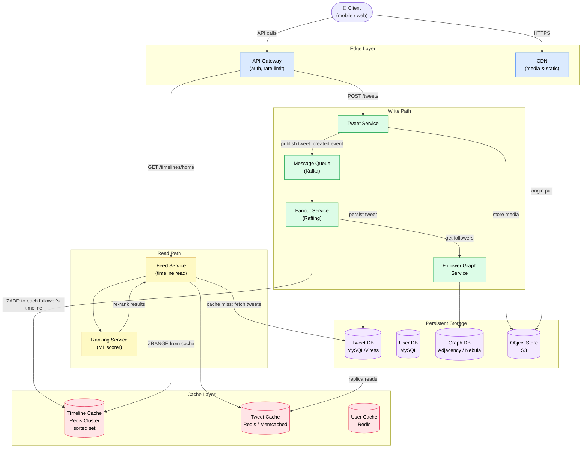
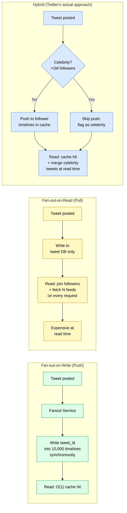

# Design Twitter/X News Feed

> Design the system that generates and serves a personalized, real-time news feed for 300 M daily active users — the core "home timeline" product of Twitter/X.

**Difficulty:** ⭐⭐⭐⭐ · **Builds on:**
[Caching](../../Level-01-Building-Blocks/03-Caching/README.md) ·
[Databases SQL vs NoSQL](../../Level-01-Building-Blocks/04-Databases-SQL-vs-NoSQL/README.md) ·
[Sharding and Partitioning](../../Level-02-Data-Layer/02-Sharding-and-Partitioning/README.md) ·
[Message Queues](../../Level-03-Communication/04-Message-Queues/README.md) ·
[Pub-Sub](../../Level-03-Communication/05-Pub-Sub/README.md) ·
[Stream Processing](../../Level-07-Big-Data-and-Specialized/02-Stream-Processing/README.md)

**See also:** [Instagram](../07-Instagram/README.md) · [URL Shortener](../01-URL-Shortener/README.md)

---

## 1. 🎯 Problem & Scope

When you open Twitter/X you instantly see a feed of tweets from people you follow — plus ads, trending content, and recommended accounts. Under the hood that means:

- You follow people; they post tweets; you see those tweets (eventually) in your feed.
- The feed must be **fast** (sub-200 ms) and **fresh** (new tweets appear within seconds).
- The system must handle the most lopsided fan-out possible: a celebrity with 100 M followers posts once, and the platform must propagate that single event to 100 M inboxes.

**In scope:** home timeline read, tweet write / fan-out, follower graph, timeline cache, ranking signals.  
**Out of scope:** search, notifications, DMs, ads auction, video transcoding.

---

## 2. 📋 Requirements

### Functional

1. A user can post a tweet (text ≤ 280 chars, optional media).
2. A user can follow / unfollow another user.
3. A user can load their **home timeline** — an ordered list of tweets from accounts they follow.
4. New tweets appear in followers' timelines within **≤ 5 seconds** (eventual consistency is fine).
5. The timeline supports infinite scroll (pagination via cursor).

### Non-Functional

| Property | Target |
|---|---|
| Availability | 99.99 % (≤ 53 min downtime/year) |
| Read latency (P99) | < 200 ms end-to-end |
| Write latency (P99) | < 500 ms to acknowledge tweet |
| Fan-out propagation | < 5 s for normal users |
| Durability | Zero tweet loss after ack |
| Consistency | Eventual — feed lag acceptable |

---

## 3. 🧮 Capacity Estimation

### Traffic

```
DAU                   = 300 M
Tweets per day        = 500 M   (~1,700 tweets/s avg)
Peak write multiplier = 3×       → ~5,000 tweets/s peak
Reads per DAU         = ~50 feed refreshes/day
Total read QPS avg    = 300 M × 50 / 86,400 ≈ 175,000 reads/s
Peak read QPS         = 175,000 × 3 ≈ 500,000 reads/s
Read : Write ratio    ≈ 100 : 1
```

The 100:1 skew is the dominant design signal — **optimize aggressively for reads**.

### Storage

```
Tweet metadata (text + indices):
  500 M tweets/day × 500 bytes ≈ 250 GB/day → ~90 TB/year

Media (photos, GIFs, video):
  ~30 % of tweets carry media, avg 200 KB each
  500 M × 0.30 × 200 KB ≈ 30 TB/day (stored in object storage / CDN)

User profiles:
  500 M users × 1 KB ≈ 500 GB (fits in one big DB shard)

Social graph (follower edges):
  500 M users × avg 200 follows = 100 B edges
  each edge ~16 bytes → ~1.6 TB (graph DB or adjacency table)

Timeline cache (Redis):
  300 M active timelines × 800 tweets × avg 100 bytes ≈ 24 TB
  (in practice only hot timelines are cached — realistic hot set ~2–4 TB)
```

### Bandwidth

```
Read:  500,000 req/s × 5 KB avg payload ≈ 2.5 GB/s egress
Write: 5,000 tweets/s × 500 B ≈ 2.5 MB/s ingest (tiny vs reads)
Media: CDN-served, not counted in app-tier bandwidth
```

---

## 4. 🔌 API Design

### Post a Tweet

```
POST /v2/tweets
Authorization: Bearer <token>

{
  "text": "Hello world! #SystemDesign",
  "media_ids": ["1234567890123456789"],   // optional, pre-uploaded
  "reply_to_tweet_id": null               // optional
}

→ 201 Created
{
  "data": {
    "id": "1802345678901234567",
    "text": "Hello world! #SystemDesign",
    "created_at": "2026-06-24T10:00:00Z",
    "author_id": "9876543210"
  }
}
```

### Get Home Timeline

```
GET /v2/timelines/home?max_results=20&pagination_token=<cursor>
Authorization: Bearer <token>

→ 200 OK
{
  "data": [
    { "id": "...", "text": "...", "author_id": "...", "created_at": "..." },
    ...
  ],
  "meta": {
    "newest_id": "1802345678901234567",
    "oldest_id": "1802000000000000001",
    "next_token": "abc123cursor"
  }
}
```

Pagination is **cursor-based** (not offset) — the cursor encodes a tweet ID or timestamp so reads remain stable as new tweets arrive.

### Follow a User

```
POST /v2/users/:id/following
{ "target_user_id": "9876543210" }
→ 200 OK  { "data": { "following": true } }
```

---

## 5. 🗄️ Data Model

### Core Tables / Collections

**tweets** (MySQL / Vitess, sharded by `tweet_id`)

| Column | Type | Notes |
|---|---|---|
| tweet_id | BIGINT (Snowflake) | PK, time-sortable |
| author_id | BIGINT | FK → users |
| text | VARCHAR(280) | |
| media_ids | JSON | array of blob IDs |
| reply_to_id | BIGINT | nullable |
| created_at | TIMESTAMP | indexed |
| like_count | INT | denormalized counter |
| retweet_count | INT | denormalized counter |

**users** (MySQL, sharded by `user_id`)

| Column | Type |
|---|---|
| user_id | BIGINT |
| username | VARCHAR(50) |
| follower_count | INT |
| following_count | INT |
| is_celebrity | BOOLEAN |

**follower_graph** (graph DB or adjacency table sharded by `follower_id`)

| Column | Type | Notes |
|---|---|---|
| follower_id | BIGINT | who follows |
| followee_id | BIGINT | who is followed |
| created_at | TIMESTAMP | |

Index: `(followee_id)` for fan-out lookups, `(follower_id)` for "who do I follow".

**timeline_cache** (Redis Sorted Set, key = `timeline:{user_id}`)

```
ZADD timeline:42  <tweet_id_score>  <tweet_id>
ZRANGE timeline:42  0  799  REV    # latest 800 tweets
```

Score = tweet_id (Snowflake IDs embed creation timestamp, so sorting by ID ≈ sorting by time).

### Storage Justification

| Data | Store | Why |
|---|---|---|
| Tweet metadata | MySQL + Vitess | Relational, shard by tweet_id |
| Media blobs | S3 / GCS + CDN | Cheap, high-throughput, globally cacheable |
| Follower graph | MySQL adjacency table (or FlockDB / Nebula) | Twitter originally used FlockDB; modern choice is Nebula Graph or adjacency table with composite index |
| Timeline cache | Redis Cluster (sorted set) | O(log N) insert/read, TTL eviction |
| Trending / analytics | Apache Flink + ClickHouse | Real-time aggregation |

---

## 6. 🏗️ High-Level Architecture



### Numbered Walk-Through

1. **Tweet write** — Client hits the API Gateway, which authenticates and routes to the **Tweet Service**. The tweet is validated, given a Snowflake ID, and persisted to **Tweet DB** (MySQL, sharded by tweet_id). A `tweet_created` event is published to **Kafka**.

2. **Fan-out** — The **Fanout Service** (Twitter calls this part of "Rafting") consumes the Kafka event. It calls the **Follower Graph Service** to get the poster's follower list. For each follower, it writes the new tweet_id into that user's **Timeline Cache** (Redis sorted set, score = tweet_id).

3. **Celebrity shortcut** — If the poster is a *celebrity* (follower count > threshold, e.g. 1 M), fan-out is skipped or rate-limited. Instead, celebrity tweets are fetched at read time (fan-out-on-read for that subset).

4. **Timeline read** — Client requests `GET /timelines/home`. The **Feed Service** reads the top N tweet_ids from the user's Redis sorted set. It batch-fetches tweet payloads from **Tweet Cache** (Memcached / Redis). Cache misses fall through to Tweet DB. The result set is handed to the **Ranking Service**.

5. **Ranking** — Chronological order is the default; optionally the Ranking Service re-scores tweets using engagement signals, recency, and model output, then returns the final ordered list to the client.

6. **Media** — Images and video are stored in S3 and served via CDN. The tweet payload carries signed CDN URLs, not raw S3 links.

---

## 7. 🔬 Deep Dives

### 7.1 Fan-Out: Three Strategies Compared

This is the core design decision and the most common interview deep-dive.



| Strategy | Write Cost | Read Cost | Best For |
|---|---|---|---|
| Fan-out-on-write (push) | High — O(followers) per tweet | O(1) cache lookup | Normal users (low follower count) |
| Fan-out-on-read (pull) | O(1) — just write tweet | O(following) per read | Celebrity / power users |
| Hybrid | Low-medium | Near O(1) + small merge | Production at scale |

**The Beyoncé problem:** Beyoncé has ~300 M followers. A single tweet triggers 300 M Redis writes at ~10 µs each = 3,000 seconds of single-threaded work. The hybrid approach skips the push for celebrities. When you load your timeline, the Feed Service fetches your cached feed (regular follows) and *then* appends the latest N tweets from celebrity accounts you follow, merging the two lists by timestamp.

**Implementation detail:** Twitter marks users as "heavy hitter" once their follower count crosses a configurable threshold. The Fanout Service checks a Bloom filter / user metadata before deciding to push.

---

### 7.2 Timeline Cache Design (Redis Sorted Set)

```
Key:    timeline:{user_id}
Type:   Sorted Set
Score:  tweet_id   (Snowflake IDs are monotonically increasing by time)
Member: tweet_id

Operations:
  ZADD timeline:42  1802345678901234567  "1802345678901234567"   # fan-out write
  ZRANGE timeline:42  0  799  REV                                 # read latest 800
  ZREMRANGEBYRANK timeline:42  0  -801                            # trim to 800 cap
  TTL: 7 days (evict inactive users)
```

- Cap each timeline at **800 entries** — studies show users rarely scroll past 800 tweets.
- If a user has been inactive > 7 days, their timeline is evicted. On next login, the Feed Service **cold-starts** the timeline: fetches followees from the graph, pulls recent tweets from Tweet DB, and pre-populates Redis.
- Redis Cluster is sharded by `user_id % num_shards`. A user's timeline always lives on one shard (no cross-shard sorted set operations needed).

---

### 7.3 Follower Graph at Scale

Twitter's original solution was **FlockDB**, a MySQL-based graph database optimized for adjacency list lookups. Modern choices:

- **Nebula Graph / JanusGraph** — native distributed graph, handles billion-edge graphs.
- **MySQL adjacency table + sharding** — simpler ops, Twitter's original approach.

Key query patterns:

```sql
-- Who follows user X? (fan-out list)
SELECT follower_id FROM followers WHERE followee_id = X LIMIT 50000;

-- Who does user Y follow? (build timeline on cold-start)
SELECT followee_id FROM followers WHERE follower_id = Y LIMIT 5000;
```

Both queries must be fast. Use **two sharding strategies in parallel** (or a graph DB):
- Shard 1: keyed by `followee_id` → fast fan-out reads.
- Shard 2: keyed by `follower_id` → fast "who do I follow" reads.

This is a **dual-write** pattern: every follow action writes to both shards. Eventual consistency between the two is acceptable.

---

### 7.4 Feed Ranking

Twitter ships two modes:

1. **Chronological ("Latest")** — sort by tweet_id descending. Trivial; served directly from cache.
2. **Algorithmic ("For You")** — ML model scores each candidate tweet. Signals include:
   - Author relationship strength (how often you interact)
   - Engagement velocity (likes/RT rate in first N minutes)
   - Recency decay
   - Content embeddings (topic affinity)

The Ranking Service sits **between** the Feed Service and the client. It's stateless, horizontally scalable, and operates on a candidate set (top 500 from cache) to produce a final ranked list (top 20 to return).

Latency budget: cache read ~5 ms + ranking inference ~30 ms + hydration ~10 ms = ~45 ms server-side, well within 200 ms SLA.

---

## 8. 📈 Scaling, Bottlenecks & Failure Modes

### Hot Spots

| Bottleneck | Symptom | Mitigation |
|---|---|---|
| Celebrity tweet | 300 M Redis writes in seconds | Hybrid fan-out; skip push for heavy-hitters |
| Redis timeline shard | One shard holds all timelines for user_id range | Consistent hashing; autoscaling shard count |
| Kafka consumer lag | Fan-out queue backs up during viral events | Increase consumer parallelism; partition by author_id |
| Graph DB read spike | Everyone follows the same celebrity | Cache follower lists (TTL 60 s) in Memcached |
| Tweet DB write surge | Live event + everyone live-tweeting | Vitess sharding; async write buffer via Kafka |

### Failure Modes

**Redis node failure** — Redis Cluster replicates each slot to N replicas. On primary failure, replica is elected primary within seconds. Timeline writes during this window are lost; the feed shows slightly stale content — acceptable (eventual consistency).

**Fanout Service crash mid-fan-out** — Kafka offset is not committed until fan-out completes. On restart, the service replays the same tweet event. Fan-out writes must be **idempotent** (`ZADD` in Redis is idempotent — re-adding a member with the same score is a no-op).

**Feed Service cache miss storm (cold start)** — If Redis restarts, every user's first request misses. Use **load-shedding + staggered warm-up**: return partial results from Tweet DB and populate cache asynchronously; never let a cold start stampede kill the DB.

**Graph DB unavailable** — Return a degraded timeline (only tweets from a subset of followees stored in local fan-out queue) rather than an error. Graceful degradation is better than 503.

### Scaling Numbers

```
Fanout workers:  500 M tweets/day × avg 200 followers = 100 B Redis writes/day
                 → 100 B / 86,400 ≈ 1.2 M ZADD/s
                 → At 50,000 ZADD/s per Redis node → ~24 Redis primaries needed

Read traffic:    500,000 timeline reads/s
                 At 10,000 ZRANGE/s per Redis node → ~50 Redis read replicas
```

---

## 9. ⚖️ Trade-offs & Alternatives

### Fan-out-on-Write vs Fan-out-on-Read

You already analyzed this in §7.1. The key insight for an interview: **pure push doesn't work at celebrity scale; pure pull doesn't work at read scale**. Always land on the hybrid.

### SQL vs NoSQL for Tweet Storage

Twitter uses **MySQL** for tweet metadata despite massive scale — Vitess provides horizontal sharding while preserving SQL semantics, transactions, and a proven ops model. NoSQL (Cassandra, DynamoDB) would also work and is used by some competitors; the trade-off is eventual consistency on counters vs easier ops.

### Chronological vs Algorithmic Feed

Chronological is simpler, faster, and users trust it more. Algorithmic keeps users in the app longer (per Twitter's own A/B tests). Twitter/X ships both and lets users toggle. Designing for both means your system stores raw chronological order in cache and applies ranking as a stateless layer on top — no re-architecture needed.

### Tweet ID Strategy: Snowflake vs UUIDv7

Twitter invented **Snowflake** IDs: 64-bit integers composed of timestamp (41 bits), datacenter ID (5 bits), worker ID (5 bits), sequence (12 bits). This gives ~4,000 IDs/ms per worker, is globally unique without coordination, and sorts chronologically. UUIDv7 solves the same problem with a UUID format — interchangeable for this design.

### Caching TTL vs Storage Cost

Keeping 800 tweets × 300 M users × 100 bytes = 24 TB in Redis is expensive. In practice:
- Only **hot timelines** (last 7 days of activity) are cached → ~20–30 M users → ~2.4 TB.
- Inactive users' timelines are re-hydrated on demand.

---

## 10. 🌐 How It's Actually Done

### Twitter's "Rafting" Architecture (2012–present)

Twitter published details of their fan-out system at QCon 2012 and subsequent conferences:

- **Timeline Service** — manages per-user timeline stored in RAM across a distributed cluster. Each timeline is a fixed-size circular buffer of tweet IDs.
- **Fanout Service** (part of Rafting) — consumes from Kafka; uses a segmented worker pool where each worker "owns" a set of user IDs to avoid contention.
- **FlockDB** — custom MySQL-backed graph DB for follower/following lists; later phased toward internal services.
- **Manhattan** — Twitter's own distributed key-value store (built on RocksDB) used for tweet metadata and user data; replaced some MySQL usage at scale.
- **Snowflake** — open-sourced in 2010, now the standard for distributed ID generation.

### 2023 Rewrite (X / "Twitter 2.0")

After the 2022 acquisition, Twitter/X restructured engineering significantly:

- Reduced datacenter footprint by ~50 % via aggressive workload consolidation.
- Moved more ranking computation to the client to reduce server-side complexity.
- Open-sourced the **recommendation algorithm** in 2023 — the codebase reveals the "heavy ranker" ML model, candidate sourcing from social graph + network + geolocation, and a Nitter-style real-time pipeline.

### Key Lessons from Production

1. **Pre-compute is king** — Twitter found that any computation done at read time adds hundreds of ms; fan-out-on-write is worth the write amplification for 99 % of users.
2. **Graceful degradation beats hard dependencies** — the feed service returns stale or partial data rather than erroring; users tolerate a slightly old tweet far more than an empty feed.
3. **Idempotency everywhere** — retries in distributed fan-out are safe only because Redis ZADD and DB upserts are idempotent; design for at-least-once delivery.
4. **Observability over perfection** — Twitter ships per-tweet fan-out latency histograms, cache hit rates, and Kafka consumer lag as first-class metrics; alerting on lag before users feel it.

---

## 11. 📝 Summary

| Decision | Choice | Why |
|---|---|---|
| Fan-out strategy | **Hybrid** — push for normal users, pull-merge for celebrities | Balances write amplification vs read latency |
| Timeline storage | **Redis Sorted Set** (score = tweet_id) | O(log N) insert, O(1) range read, fits in RAM |
| Tweet persistence | **MySQL + Vitess** sharded by tweet_id | Proven ops, SQL semantics, horizontal scale |
| Follower graph | **Adjacency table** (dual-shard) or graph DB | Fast fan-out lookup AND fast "who do I follow" |
| ID generation | **Snowflake** (64-bit, time-ordered) | No coordination, globally unique, sort-by-time free |
| Feed ranking | **Chronological first, ML re-rank optional** | Cheap default; ranking is a stateless add-on |
| Media | **S3 + CDN** | Offloads massive bandwidth; globally cached |
| Consistency | **Eventual** (timeline lag ≤ 5 s) | Necessary for 100:1 read:write at this scale |

### The Three Things to Remember in an Interview

1. **100:1 read:write ratio** → optimize for reads, pre-compute feeds, use cache as the primary read path.
2. **Celebrity / hot-key problem** → never push to 100 M timelines synchronously; use the hybrid approach with a follower-count threshold.
3. **Redis sorted set per user** → the timeline cache is the product; the Tweet DB is the source of truth but should rarely be hit at read time.

If you can whiteboard the hybrid fan-out flow, explain the Beyoncé edge case, and size the Redis cluster, you have a complete senior-level answer.
