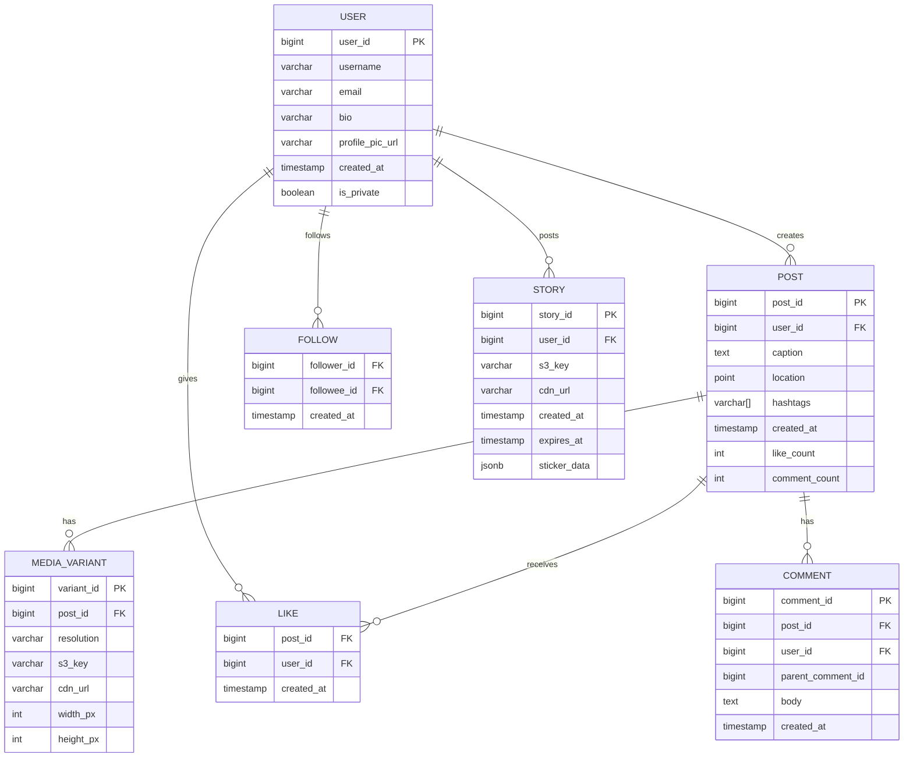
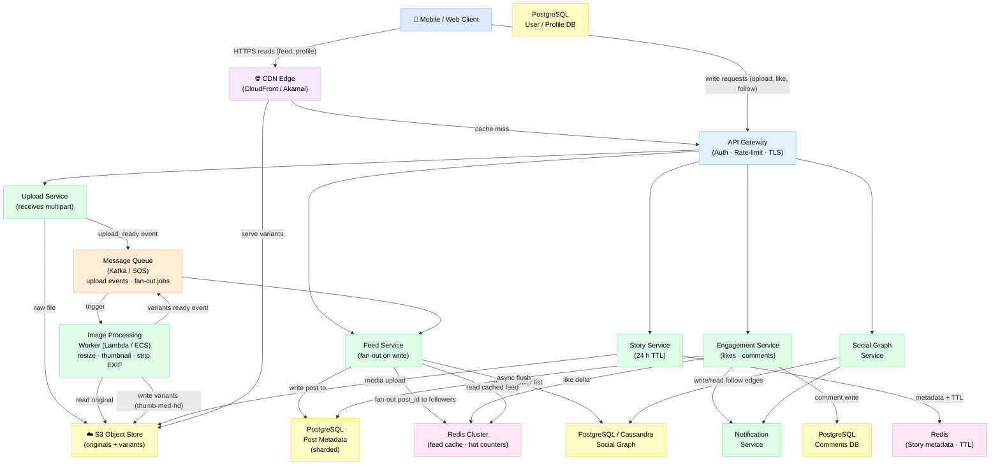
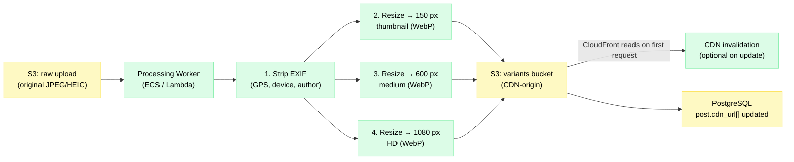

# Design Instagram

> A photo and video sharing social platform where users upload media, follow others, and consume algorithmically-ranked feeds and ephemeral Stories.

**Difficulty:** ⭐⭐⭐⭐ · **Builds on:** [Level 02 – Data Layer](../../Level-02-Data-Layer/README.md) · [Level 03 – Caching](../../Level-01-Building-Blocks/03-Caching/README.md) · [06 – News Feed / Twitter](../06-News-Feed-Twitter/README.md)

---

## 1. 🎯 Problem & Scope

Instagram started as a simple photo filter app. Today it handles billions of daily interactions across photos, Reels, Stories, and DMs. For a senior-level interview you're expected to cover:

- **Photo upload pipeline** – reliably ingest large files, process them into multiple resolutions, and serve via CDN globally.
- **Feed generation** – show each user a ranked, personalized feed of posts from people they follow (and beyond).
- **Stories** – 24-hour ephemeral content with distinct access patterns.
- **Social graph** – follower/following relationships at scale.
- **Engagement counters** – likes and comments, with the "hot celebrity post" problem.

Out of scope for one interview: Reels encoding, DMs, ads ranking, explore page ML, notification delivery.

---

## 2. 📋 Requirements

### Functional

1. Users can **upload photos** (and short videos); the system processes and stores them.
2. Users can **follow / unfollow** other users.
3. Users see a **home feed** of recent posts from people they follow, ranked by recency (or optionally ranked by engagement).
4. Users can **like and comment** on posts.
5. Users can post **Stories** that expire after 24 hours.
6. Any user can **view a profile** (grid of their posts).
7. Photos are served through a **CDN** with fast global latency.

### Non-Functional

| Property | Target |
|---|---|
| Availability | 99.99 % (≤ 52 min downtime/year) |
| Upload latency | Photo visible in feed within 5 seconds of upload |
| Feed read latency | p99 < 200 ms |
| Photo serve latency | p99 < 50 ms (from CDN edge) |
| Durability | 99.999999999 % (11 nines) – S3-class storage |
| Scale | 2 B MAU, 500 M DAU |
| Consistency | Eventual – a new post appearing seconds late is acceptable; likes/counters can lag |

---

## 3. 🧮 Capacity Estimation

### Users & Traffic

```
MAU  = 2,000,000,000
DAU  = 500,000,000        (25 % of MAU)

Photo uploads/day = 100,000,000
Uploads/sec (peak, 3× avg) = 100M / 86,400 × 3 ≈ 3,500 RPS

Feed reads/day ≈ DAU × 5 sessions × 2 pages = 5,000,000,000
Feed reads/sec (peak) ≈ 5B / 86,400 × 3 ≈ 174,000 RPS
```

### Storage

```
Average compressed photo size = 3 MB
Originals/day       = 100M × 3 MB     = 300 TB/day
Processed variants  × 3 (thumbnail 150px, medium 600px, HD 1080px)
                    = 100M × (0.05 + 0.5 + 1.5) MB = 205 TB/day
Total new storage/day ≈ 505 TB
10-year raw storage = 505 TB × 365 × 10 ≈ 1.8 EB
With replication (3×)                  ≈ 5.5 EB
```

### Bandwidth

```
Uploads:   3,500 RPS × 3 MB    = 10.5 GB/s  ingress
Reads:    174,000 RPS × 0.5 MB = 87 GB/s    egress  (mostly served from CDN PoPs)
CDN offload expected: ~98 %    → origin egress ≈ 1.7 GB/s
```

### Metadata Database

```
Posts/day = 100M  →  Posts/year = 36.5B
Row size (photo_id, user_id, caption, timestamps, location, ~20 cols) ≈ 1 KB
Posts table size/year ≈ 36.5 TB   (sharded across PostgreSQL clusters)
```

---

## 4. 🔌 API Design

All endpoints require OAuth 2.0 bearer token. Media is multipart/form-data; reads are JSON.

```
# Upload a photo
POST /v1/media/upload
Content-Type: multipart/form-data
Body: { file: <binary>, caption: string, location?: GeoPoint, tags?: string[] }
→ 202 Accepted  { upload_id: "u_abc123", status_url: "/v1/media/u_abc123/status" }

# Poll processing status (or receive webhook)
GET /v1/media/{upload_id}/status
→ 200 { state: "processing" | "ready" | "failed", variants: { thumb, medium, hd } }

# Get home feed (cursor-based pagination)
GET /v1/feed?limit=20&cursor=<opaque_token>
→ 200 { posts: [ PostObject ], next_cursor: "...", has_more: true }

# Like a post
POST /v1/posts/{post_id}/like
→ 204 No Content

# Unlike a post
DELETE /v1/posts/{post_id}/like
→ 204 No Content

# Add a comment
POST /v1/posts/{post_id}/comments
Body: { text: string, reply_to?: comment_id }
→ 201 { comment_id, created_at }

# Get comments (threaded, paginated)
GET /v1/posts/{post_id}/comments?limit=20&cursor=<token>

# Follow a user
POST /v1/users/{user_id}/follow
→ 204 No Content

# Get a user's profile grid
GET /v1/users/{user_id}/posts?limit=12&cursor=<token>

# Post a Story
POST /v1/stories
Content-Type: multipart/form-data
Body: { file: <binary>, duration_sec?: int, sticker_data?: JSON }
→ 201 { story_id, expires_at }

# Get Stories for users you follow
GET /v1/stories/feed
→ 200 { story_reels: [ { user_id, stories: [ StoryObject ] } ] }
```

---

## 5. 🗄️ Data Model

### Entity-Relationship Overview



### Storage Technology Choices

| Data | Store | Why |
|---|---|---|
| User profiles, post metadata | **PostgreSQL** (sharded) | Rich queries, ACID, mature tooling; Instagram's real choice |
| Social graph (followers) | **PostgreSQL** or **Cassandra** | Graph is wide but reads are key-value (`followees of X`); Cassandra excels at wide-row fan-out |
| Feed cache | **Redis** sorted sets | O(log N) ranked push/pop; TTL eviction |
| Likes (hot counters) | **Redis** + async flush | In-memory increments handle celebrity bursts |
| Photo / video files | **Amazon S3** (or equivalent object store) | Infinite scale, 11-nine durability, lifecycle policies |
| Stories | **Redis** (metadata + TTL) + S3 (media) | Automatic key expiry; no DB sweep needed |
| CDN | **CloudFront / Akamai** | Edge caching near users; >98 % cache hit ratio for photos |

---

## 6. 🏗️ High-Level Architecture



**Walk-through: what happens when you post a photo**

1. **Client → Upload Service** — your app sends the photo as multipart/form-data over HTTPS. Upload Service writes the raw file to S3 and immediately returns `upload_id` (202 Accepted).
2. **Upload event → Kafka** — Upload Service publishes `{ upload_id, user_id, s3_key }` to a Kafka topic.
3. **Image Processing Worker** — consumes the event, reads the original from S3, generates three variants (150 px thumbnail, 600 px medium, 1080 px HD), strips all EXIF metadata (privacy), and writes variants back to S3. Publishes a `variants_ready` event.
4. **Feed Service** — consumes `variants_ready`, writes post metadata row to PostgreSQL, then fans out `post_id` to the Redis sorted-set feed of each follower (see Section 7).
5. **Followers open the app** — Feed Service reads their Redis sorted set, hydrates post details from PostgreSQL, returns enriched feed JSON. The API Gateway returns the response; photos are served from the CDN edge (not origin).

---

## 7. 🔬 Deep Dives

### 7.1 Image Processing Pipeline



Key decisions:
- **WebP output** — ~30 % smaller than JPEG at the same quality; supported by all modern clients.
- **EXIF stripping** — mandatory for user privacy; done before any CDN distribution.
- **Parallel resizes** — thumbnail, medium, and HD are generated concurrently inside the worker (goroutine / thread pool), keeping per-photo processing under 2 seconds on average.
- **Idempotent workers** — if the worker crashes mid-flight, Kafka re-delivers the event. Writing variants to S3 with a deterministic key (`{user_id}/{post_id}/{resolution}.webp`) makes re-processing safe.
- **Lambda vs. ECS** — Lambda handles bursty traffic cheaply; ECS (containers) is preferred for large video frames where Lambda's 15-min timeout and 10 GB memory could be limiting.

### 7.2 Feed Generation – Fan-Out on Write (Push Model)

> This is a specialised extension of the pattern covered in [06 – News Feed / Twitter](../06-News-Feed-Twitter/README.md). Read that first.

Instagram uses a **hybrid push/pull** model:

| User type | Strategy |
|---|---|
| Regular user (< ~1 M followers) | **Fan-out on write** – post_id pushed to every follower's Redis feed list at upload time |
| Celebrity / mega-influencer (> 1 M followers) | **Pull on read** – feed reader fetches their latest posts at request time and merges with the cached feed |

**Redis data structure per user:**

```
Key: feed:{user_id}
Type: Sorted Set
Score: post_created_at (Unix epoch ms)  ← enables chronological ordering
Member: post_id

ZADD feed:42 1719820800000 post_789
ZREVRANGE feed:42 0 19  → latest 20 post_ids
```

Feed hydration then does a pipelined `MGET` against the post metadata cache (or PostgreSQL) for the 20 post_ids.

**Why not fan-out on read (pull only)?** At 500 M DAU each opening the app 5× per day, a pure pull model would overwhelm the social graph DB. Pre-computed feeds shift work to write time, amortizing the cost.

### 7.3 Like Counters – The Hot Post Problem

A celebrity post (Selena Gomez, ~400 M followers) can receive **millions of likes per minute**. Updating `post.like_count` in PostgreSQL on every like would cause write hot-spots and lock contention.

**Solution: Redis counter with async flush**

```
On like:
  INCR  like_count:{post_id}
  SADD  dirty_like_posts {post_id}     ← track which posts need flushing

Background job (every 5 s):
  SMEMBERS dirty_like_posts  → batch of post_ids
  For each post_id:
    count = GETDEL like_count:{post_id}
    UPDATE posts SET like_count = like_count + count WHERE post_id = ?
  SREM dirty_like_posts ...
```

This batches potentially thousands of individual updates into a handful of DB writes per flush cycle. Like counts displayed to users are read from Redis (fast, approximate), while PostgreSQL holds the durable total.

**Deduplication** — store `{post_id, user_id}` in a Redis set or Bloom filter to prevent double-likes before the async DB write.

### 7.4 Stories – 24-Hour TTL Storage

Stories have fundamentally different access patterns from posts:
- **Short-lived** — must auto-expire after exactly 24 hours.
- **Sequential reads** — viewers consume all stories from a user in order.
- **Separate from the main feed** — shown as a separate horizontal tray.

**Design:**

```
Redis HASH key:  story:{story_id}
  Fields: user_id, s3_key, cdn_url, created_at, sticker_data
Redis TTL: EXPIREAT story:{story_id} {created_at + 86400}   ← automatic cleanup

Redis SORTED SET per user:  user_stories:{user_id}
  Score: created_at epoch
  Member: story_id
  TTL on the set: 25 hours (longer to handle late reads)

On TTL expiry: a keyspace notification triggers S3 object tagging → S3 lifecycle rule deletes media in 7 days (allows recovery window)
```

Media is still stored on S3 + CDN. The Redis TTL handles **metadata expiry** so expired stories are never returned to viewers. Periodic cleanup jobs reconcile any Redis-S3 gaps.

---

## 8. 📈 Scaling, Bottlenecks & Failure Modes

### Upload Ingestion Spikes

**Problem:** Major events (concerts, New Year) can triple upload rates within minutes.

**Solution:** Upload Service is stateless and auto-scales horizontally behind a load balancer. S3's multipart upload API handles large files in parallel chunks. Kafka buffers the processing queue, decoupling ingestion from processing speed.

### Social Graph Reads During Feed Generation

**Problem:** Fan-out for a user with 500 K followers requires reading all 500 K follower IDs and writing 500 K Redis keys — in microseconds to meet the 5-second SLA.

**Solution:**
- Store follower lists in Cassandra using `user_id` as partition key — a single partition scan fetches all followers.
- Fan-out is parallelized: multiple worker threads process sub-ranges of the follower list concurrently.
- For mega-influencers the fan-out is skipped entirely (pull model).

### PostgreSQL Sharding

Instagram sharded PostgreSQL by `user_id` early. Each shard holds all posts, comments, and profile data for a range of user IDs. Cross-shard queries (e.g., joining posts from two users) are resolved in the application layer, not the DB.

**Shard key choice:** `user_id` (not `post_id`) — because the most common query pattern is "all posts by user X" (profile page), which is then a single-shard scan.

### CDN Cache Invalidation

**Problem:** Users who update a profile photo or delete a post expect the change to be visible globally within seconds.

**Solution:**
- Photo updates use **new S3 keys** (immutable objects; no invalidation needed).
- Deletes send a targeted CloudFront invalidation for the specific path; costs are low because deletes are rare relative to reads.

### Redis Failure

**Problem:** If the feed Redis cluster goes down, all home-feed reads fail.

**Solution:**
- Redis Cluster with 3 replicas per shard; automatic failover via Redis Sentinel / Cluster promotion.
- **Fallback:** Feed Service falls back to a direct PostgreSQL pull (slower, but functional). Circuit breaker pattern controls the fallback to avoid DB overload.

---

## 9. ⚖️ Trade-offs & Alternatives

| Decision | Choice Made | Alternative | Why this one |
|---|---|---|---|
| Feed model | Hybrid push/pull | Pure pull | Push eliminates per-read graph traversal for 99 % of users |
| Like counter | Redis + async flush | DB row per like | DB can't sustain 10 M writes/min on a single post |
| Media storage | S3 + CDN | Self-hosted NFS | S3 durability and CloudFront PoPs globally are hard to beat |
| Photo format | WebP | JPEG 2000, AVIF | WebP has near-universal browser/OS support as of 2023 |
| Story expiry | Redis TTL + keyspace events | Cron job scanning DB | Redis TTL is exact and avoids expensive full-table scans |
| Graph store | Cassandra wide rows | Neo4j | Cassandra's write throughput and partition-key model fits follow edges better than a graph DB at this scale |
| DB for metadata | PostgreSQL (sharded) | MySQL, DynamoDB | Instagram's existing stack; rich query support; sharding proved sufficient |

---

## 10. 🌐 How It's Actually Done

Instagram's engineering blog reveals several real decisions:

**Django Monolith → Services (2012–2016)**
Instagram started as a Python/Django monolith talking to a single PostgreSQL instance. As they scaled past 100 M users they moved to a service-oriented architecture while keeping Django for much of the application logic. The transition was gradual — they extracted read-heavy features (feed, search) first, keeping writes in the monolith until sharding was stable.

**PostgreSQL Sharding (django-sharding)**
Rather than migrating to a distributed DB, Instagram built `django-sharding`, a library that routes queries to the correct PostgreSQL shard based on `user_id`. This let them keep SQL semantics while distributing data. They described running thousands of PostgreSQL instances across shards.

**Cassandra for Social Graph**
The follower/following relationship graph moved to Cassandra. A row in Cassandra stores all follower IDs for a given user as a wide column — ideal for the "get all followers of user X" fan-out pattern.

**Memcached (not Redis) for Feed Cache**
Early Instagram used Memcached extensively for caching post data and user sessions. Redis sorted sets came later as feed ranking became more complex. Both are still used in the modern stack.

**Direct S3 Uploads (Presigned URLs)**
Clients receive a presigned S3 URL and upload directly to S3, bypassing application servers entirely. This eliminates a bottleneck: the Upload Service only handles the pre-auth step and the post-upload callback, not the actual byte transfer. This pattern offloads the majority of ingress bandwidth directly to AWS.

**IGTV / Reels Media Pipeline**
Video uses a separate transcoding pipeline (similar to the image pipeline but with ffmpeg-based workers) producing HLS (`.m3u8`) playlists at multiple bitrates — adaptive streaming without a dedicated media server.

**Vacuum / EXIF Scrubbing**
Instagram confirmed they strip EXIF on all uploads server-side, even if the client already did it — defense-in-depth against metadata leakage.

**Stories on Cassandra**
Stories metadata moved to Cassandra with a TTL column — Cassandra natively supports `DEFAULT TTL` at the column or row level, making it a natural fit for time-bounded content.

---

## 11. 📝 Summary

| Layer | Key Insight |
|---|---|
| **Upload** | Multipart → S3 via presigned URL; decoupled from processing via Kafka |
| **Processing** | Parallel resize workers; WebP output; EXIF stripped before CDN |
| **CDN** | 98 %+ cache hit rate; immutable URLs mean no invalidation |
| **Metadata** | Sharded PostgreSQL by `user_id`; no cross-shard JOINs |
| **Social Graph** | Cassandra wide rows; fast `follower_id` bulk reads |
| **Feed** | Hybrid push/pull; Redis sorted sets; celebrity posts pulled on read |
| **Likes** | Redis INCR + async batch flush to PostgreSQL; Bloom filter deduplication |
| **Stories** | Redis TTL for metadata; S3 + CDN for media; Cassandra TTL column as alternative |
| **Failure** | Redis failover + PostgreSQL fallback; circuit breakers; Kafka replay |

**For the interview:** Lead with the upload pipeline and fan-out tradeoff. The hot-counter problem and the hybrid feed model are the two places interviewers dig deep — know the Redis patterns cold. Mention Instagram's real PostgreSQL sharding journey to show you've read primary sources.

**See also:**
- [06 – News Feed / Twitter](../06-News-Feed-Twitter/README.md) — fan-out architecture in full detail
- [08 – WhatsApp Chat](../08-WhatsApp-Chat/README.md) — real-time messaging and presence
- [Level 02 – Data Layer](../../Level-02-Data-Layer/README.md) — sharding, replication, and consistency foundations
