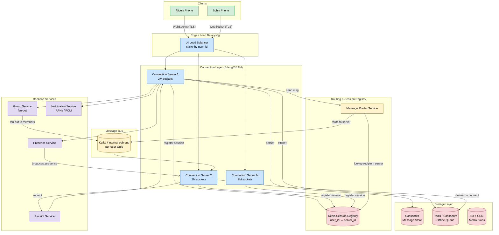
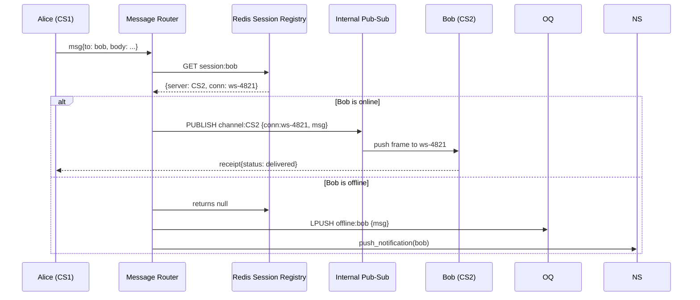
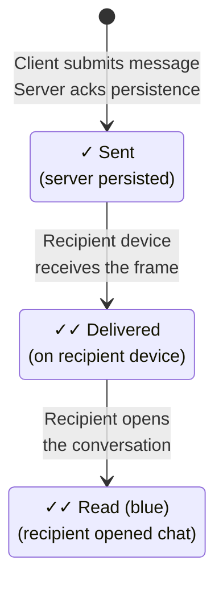

# Design WhatsApp

> A real-time messaging platform where 2 billion users exchange 100 billion messages per day with end-to-end encryption, delivery receipts, and sub-second latency.

**Difficulty:** ⭐⭐⭐ · **Builds on:**
[Level 4 — Message Queues](../../Level-03-Communication/04-Message-Queues/README.md) ·
[Bonus 7 — Instagram](../07-Instagram/README.md) ·
[Bonus 9 — YouTube/Netflix Streaming](../09-YouTube-Netflix-Streaming/README.md)

---

## 1. 🎯 Problem & Scope

WhatsApp started as a simple status-update app and became the world's most-used messaging platform. The core challenge is deceptively simple: "deliver a message from Alice to Bob in under a second, reliably, even when Bob is offline, at 2 billion-user scale."

**In scope:**
- 1:1 real-time text messaging
- Group chat (up to 1,024 members)
- Online / last-seen presence
- Delivery receipts (sent → delivered → read)
- Offline message queuing
- Media attachments (at a high level)

**Out of scope:** voice/video calls, Stories, payments, business API.

---

## 2. 📋 Requirements

### Functional
1. Users can send text messages to individuals or groups.
2. Messages are delivered in real time when the recipient is online.
3. Messages are queued and delivered when the recipient comes online.
4. Delivery receipts: ✓ sent, ✓✓ delivered to device, ✓✓ (blue) read by recipient.
5. Online/last-seen presence visible to contacts.
6. Group messages fan out to all members.
7. End-to-end encryption (Signal Protocol).

### Non-Functional
- **Latency:** < 100 ms message delivery (P99) when both parties are online.
- **Availability:** 99.99% uptime (< 52 min downtime/year).
- **Durability:** Messages must not be lost once acknowledged to sender.
- **Consistency:** Messages must arrive in order within a conversation.
- **Scale:** 2B registered users, ~500M daily active users.
- **Throughput:** 100B messages/day (~1.16M messages/second peak).

---

## 3. 🧮 Capacity Estimation

### Message throughput

```
100B messages/day ÷ 86,400 sec/day ≈ 1,157,000 msg/sec (avg)
Peak is ~65B messages/day during high-traffic windows:
  65B ÷ 57,600 "peak seconds" ≈ 1,130,000 msg/sec peak write
Read fan-out (each message read by ~1.5 recipients on avg):
  1.16M * 1.5 ≈ 1.74M delivery events/sec
```

### Storage

```
Avg message size (text + metadata): ~2 KB
Messages per day:         100B × 2 KB = 200 TB/day
WhatsApp stores messages only until delivered → keep ~7 days offline buffer
Offline buffer peak:      200 TB/day × 7 days = 1.4 PB rolling window
Media (images, video) stored on separate CDN blob store; assume 30% of messages
carry media, avg 500 KB → 100B × 0.30 × 500 KB ≈ 15 PB/day (CDN)
```

### Connection servers

```
WhatsApp (BEAM/Erlang) handles 2M concurrent WebSocket connections per server node.
500M DAU, each online ~2 hrs/day:
  500M × 2/24 ≈ 42M concurrent connections
Servers needed: 42M ÷ 2M = ~21 server nodes (with redundancy: ~60-80 nodes)
```

### Presence updates

```
A user comes online → notify all their contacts.
Avg contacts per user: 250.
42M concurrent users × 250 contacts = 10.5B presence fan-out events if every
state change propagated immediately → must throttle / batch (see Deep Dive §7.3).
```

---

## 4. 🔌 API Design

All connections are long-lived WebSocket sessions after initial HTTP upgrade. REST is used only for registration, media upload URLs, and account management.

### WebSocket frames (binary protobuf, simplified as JSON here)

**Send message**
```json
// Client → Connection Server
{
  "type": "message",
  "msg_id": "alice-1719230400-uuid4",
  "to": "user_id:bob",
  "body": { "text": "Hey Bob!" },
  "timestamp": 1719230400123
}

// Connection Server → Client (ack)
{
  "type": "ack",
  "msg_id": "alice-1719230400-uuid4",
  "status": "sent"   // single tick ✓
}
```

**Delivery receipt**
```json
// Bob's device → Connection Server → Alice
{
  "type": "receipt",
  "msg_id": "alice-1719230400-uuid4",
  "status": "delivered",   // double tick ✓✓
  "from": "user_id:bob",
  "timestamp": 1719230400456
}
```

**Read receipt**
```json
{
  "type": "receipt",
  "msg_id": "alice-1719230400-uuid4",
  "status": "read",        // blue ticks
  "from": "user_id:bob",
  "timestamp": 1719230400789
}
```

**Presence update**
```json
{ "type": "presence", "user_id": "bob", "state": "online" }
{ "type": "presence", "user_id": "bob", "state": "offline", "last_seen": 1719230500 }
```

### REST endpoints (abbreviated)

```
POST /v1/media/upload-url          → presigned S3/CDN URL for media
GET  /v1/messages/pending          → pull offline queue on reconnect
POST /v1/groups                    → create group
PUT  /v1/groups/{gid}/members      → add/remove member
GET  /v1/contacts/presence         → bulk presence fetch (throttled)
```

---

## 5. 🗄️ Data Model

### Core tables

```
erDiagram
    USER {
        uuid   user_id PK
        string phone_number UK
        string display_name
        bytes  public_key
        ts     created_at
        ts     last_seen
    }

    MESSAGE {
        uuid   msg_id PK
        uuid   sender_id FK
        uuid   chat_id FK
        string status
        bytes  ciphertext
        string media_url
        ts     sent_at
        ts     delivered_at
        ts     read_at
    }

    CHAT {
        uuid   chat_id PK
        enum   type
        ts     created_at
    }

    CHAT_MEMBER {
        uuid   chat_id FK
        uuid   user_id FK
        ts     joined_at
        bool   is_admin
    }

    OFFLINE_QUEUE {
        uuid   queue_id PK
        uuid   recipient_id FK
        uuid   msg_id FK
        ts     queued_at
        int    retry_count
    }

    SESSION_REGISTRY {
        uuid   user_id PK
        string server_id
        string ws_conn_id
        ts     connected_at
    }

    USER ||--o{ CHAT_MEMBER : "belongs to"
    CHAT ||--o{ CHAT_MEMBER : "has"
    CHAT ||--o{ MESSAGE : "contains"
    USER ||--o{ OFFLINE_QUEUE : "has pending"
```

### Storage layer choices

| Data | Store | Why |
|---|---|---|
| Messages (persistent history) | Cassandra / ScyllaDB | Wide-column, write-optimized, partition by chat_id |
| Session registry (user → server) | Redis (in-memory) | Sub-ms lookup, TTL-based expiry on disconnect |
| Offline queue | Cassandra or Redis sorted set | Fast enqueue/dequeue, TTL for abandoned messages |
| Presence state | Redis pub-sub + in-memory | Volatile, high churn — persistence not needed |
| User/contact metadata | MySQL (sharded by user_id) | Relational, low write rate |
| Media blobs | S3 + CDN | Object storage, globally distributed |

> **Note on message deletion:** WhatsApp's original design deleted messages from servers once delivered, storing only a rolling 30-day backup for undelivered messages. Persistent chat history is stored on the device, encrypted, optionally backed up to iCloud/Google Drive.

---

## 6. 🏗️ High-Level Architecture



### Numbered walk-through (1:1 message, Alice → Bob)

1. **Alice sends** a message over her persistent WebSocket connection to Connection Server 1 (CS1).
2. **CS1 persists** the message to Cassandra and immediately sends Alice a `sent` ack (single tick ✓).
3. **CS1 asks the Message Router** to deliver to Bob. The router does a Redis lookup: "Which server is Bob connected to?"
4. **If Bob is online:** the router publishes the message to Bob's topic on the internal pub-sub. CS2 (Bob's server) picks it up and pushes it over Bob's WebSocket. CS2 sends a `delivered` receipt back through the system to Alice (double tick ✓✓).
5. **If Bob is offline:** the message lands in the Offline Queue (keyed by Bob's user_id). The Notification Service fires a silent push via APNs/FCM to wake Bob's phone.
6. **Bob reconnects:** CS2 registers his new session in Redis, then drains his Offline Queue. Each message delivered triggers a `delivered` receipt to Alice.
7. **Bob reads the message:** his app sends a `read` receipt → CS2 → Receipt Service → CS1 → Alice (blue ticks).

---

## 7. 🔬 Deep Dives

### 7.1 WebSocket Connection Management

Each Connection Server is a long-lived process written in Erlang/OTP (BEAM VM). Erlang's lightweight process model means each WebSocket connection is a separate Erlang process with negligible overhead (~2 KB heap each). This is why WhatsApp could sustain **2 million concurrent connections on a single server** — a feat that would kill a thread-per-connection Java server with ~1 GB stack per thread.

The L4 load balancer uses **consistent hashing on user_id** to sticky-route reconnects to the same server where possible, reducing session churn. When a server restarts, clients reconnect and re-register their session.

**Heartbeats:** Clients send a ping every 30 seconds. The server closes the socket after two missed pings (~60 s). This quickly detects dead connections and cleans up Redis session entries.

### 7.2 Message Routing Between Connection Servers



The session registry entry is: `session:{user_id}` → `{server_id, conn_id, ttl}`. TTL is refreshed on every heartbeat. On disconnect, the Connection Server deletes the key immediately (or lets TTL expire as a safety net).

The internal pub-sub can be implemented as:
- **Direct gRPC call** CS1 → CS2 (low latency, tight coupling)
- **Kafka per-server topic** (better fan-out for group messages, at-least-once delivery)
- **Redis pub-sub per server** (simple, but not durable)

WhatsApp uses direct Erlang message passing between nodes (they run a distributed Erlang cluster), which is essentially native RPC at microsecond latency.

### 7.3 Presence at Scale

Presence is deceptively expensive. Naively:

```
User comes online → notify 250 contacts → 42M users × 250 = 10.5B events/second
```

Strategies to survive this:

1. **Subscription model:** only notify contacts who are *currently online and actively viewing a chat with you*. If no one cares right now, skip the broadcast.
2. **Throttle:** coalesce presence updates to at most once every 30 seconds per user.
3. **Pull on demand:** when Alice opens a chat with Bob, she subscribes to Bob's presence topic at that moment. Presence Server pushes updates only to active subscribers.
4. **Lazy last-seen:** "last seen" timestamps are written to a database on disconnect. On-demand reads fetch from there — no real-time fan-out needed for last-seen display.

The Presence Service maintains an in-memory map of `{user_id → [subscriber_conn_ids]}` using the same BEAM cluster. State is volatile by design — a server restart just means clients re-subscribe on their next chat open.

### 7.4 Delivery Receipt State Machine

Every message travels through exactly three states:



**Implementation details:**

- `Sent` ack is generated by the Connection Server the moment it writes to Cassandra — not when it delivers to the recipient.
- `Delivered` receipt is sent by the *recipient's device* once the message frame arrives (not the server).
- `Read` receipt is sent by the recipient's app when the user scrolls the message into the visible viewport of an active conversation.
- Receipts are themselves tiny messages routed back through the system. They are queued if the sender is offline.
- **Group receipts** are per-member: you see a member-list of who has read your message. The group message shows double-tick only when *all* members receive it, blue only when *all* read it.

### 7.5 Group Message Fan-Out

```
Group with 1,024 members: Alice sends one message.
Fan-out: Message Router creates 1,023 delivery tasks.
```

Two strategies:

**Write fan-out (WhatsApp's approach for moderate groups):**
The Group Service copies the message into each member's delivery queue. Each copy is a pointer (msg_id reference) plus per-recipient metadata. At 100 msg/sec in a 1,024-member group: 102,400 delivery events/sec — manageable but high.

**Read fan-out (for very large groups/broadcast lists):**
Store one copy of the message. Deliver the msg_id to each member's inbox. Each client fetches on demand. Saves storage but increases read latency.

WhatsApp caps groups at 1,024 members partly to keep write fan-out tractable. For broadcast channels (newer feature) they switch to read fan-out.

---

## 8. 📈 Scaling, Bottlenecks & Failure Modes

| Concern | Bottleneck | Mitigation |
|---|---|---|
| Connection servers | Memory, file descriptors | BEAM VM, tune OS ulimits, horizontal scale |
| Session registry (Redis) | Single-node memory | Redis Cluster sharded by user_id hash slot |
| Message routing | Hot paths for celebrities with many contacts | Rate-limit fan-out, async delivery |
| Cassandra write throughput | Coordinator hotspots | Partition by chat_id+date, replication factor 3 |
| Offline queue drain | Storm when server restarts | Reconnect jitter + exponential backoff |
| Presence fan-out | Thundering herd on popular user | Subscription model + throttle |
| Group fan-out | Large groups × message rate | Cap group size; async fan-out worker pool |
| Media CDN | Bandwidth for videos | Lazy transcoding, CDN edge caching |

**Failure modes:**

- **Connection server crash:** Clients reconnect (jittered backoff). Session registry entries TTL-expire. Offline queue accumulates until reconnect. No message loss because Cassandra persisted before ack.
- **Redis session registry outage:** Message Router cannot find recipient. Falls back to treating all messages as offline → enqueue + push notification. Degrades to store-and-forward mode.
- **Kafka/pub-sub lag:** Messages still durable in Cassandra. Recipients drain offline queue on reconnect. Delivery latency increases but no data loss.
- **Cassandra node failure:** Cassandra's eventual consistency (quorum writes) tolerates node loss. With RF=3, writes succeed as long as 2 of 3 replicas are alive.

---

## 9. ⚖️ Trade-offs & Alternatives

### Persistent storage vs. delete-after-delivery

| | Delete after delivery | Persistent server-side history |
|---|---|---|
| Storage cost | Minimal | Enormous (iMessage, Telegram) |
| Privacy | Better — server holds less | Server has full history |
| Multi-device sync | Hard — messages live on one device | Easy — fetch from server |
| Backup | User-managed (iCloud/Google Drive) | Server-managed |

WhatsApp chose delete-after-delivery for privacy (aligned with E2E encryption philosophy) and cost. Telegram chose persistent storage to enable seamless multi-device sync.

### WebSocket vs. MQTT vs. long-poll

- **WebSocket:** Full-duplex, works over standard HTTPS ports, widely supported. WhatsApp's choice.
- **MQTT:** Purpose-built for IoT push, extremely low overhead. Facebook Messenger uses MQTT. Great for battery life on mobile.
- **Long-poll:** Legacy, high overhead, not viable at WhatsApp's scale.

### Fan-out on write vs. fan-out on read

- Write fan-out (WhatsApp): lower read latency, higher write amplification.
- Read fan-out (Telegram channels): lower storage, higher read latency.

### Erlang/BEAM vs. Go vs. Java for connection servers

Erlang wins for connection-heavy workloads because each connection is a lightweight process with pre-emptive scheduling and built-in supervision trees for fault isolation. Go goroutines are comparable for raw throughput but lack OTP's battle-tested fault tolerance primitives. Java thread-per-connection doesn't scale to 2M connections.

---

## 10. 🌐 How It's Actually Done

WhatsApp's real engineering is a masterclass in "boring technology, extreme scale."

**Erlang/OTP:** The entire backend is Erlang. Founders Jan Koum and Brian Acton bet on Erlang in 2009 when it was an obscure telecom language. It paid off — by 2014, WhatsApp ran **~32 engineers supporting 900 million users**, one of the best engineer-to-user ratios in history. They hit **2 million connected clients per server node** in 2012.

**FreeBSD over Linux:** WhatsApp ran FreeBSD in production, citing better network stack performance for massive connection counts. They tuned kernel parameters (file descriptor limits, socket buffer sizes) extensively.

**XMPP roots:** The original protocol was XMPP (Jabber), a well-understood XML messaging protocol. Over time they replaced it with a custom binary protocol built on protobuf for efficiency.

**Signal Protocol for E2E encryption:** WhatsApp partnered with Open Whisper Systems (Signal) in 2016 to implement the Signal Protocol for all messages. Every message is encrypted on the sender's device with the recipient's public key. WhatsApp servers never see plaintext — they're a routing and storage layer for ciphertext.

**Ejabberd → custom BEAM:** They started with ejabberd (open-source Erlang XMPP server), ripped out most of it, and rewrote critical paths in Erlang. The result is a highly customized BEAM application that bears little resemblance to stock ejabberd.

**Media handling:** Media goes to a separate upload service (Blob Store + CDN), not through the connection servers. The message contains only a URL + decryption key. This keeps the WebSocket path lean.

**The Facebook acquisition (2014, $19B):** Infrastructure didn't change overnight. WhatsApp kept running their Erlang stack independently for years.

**Reported numbers:**
- 2014: 450M users, 32 engineers, 70B messages/day
- 2020: 2B users, 100B messages/day
- 2021: 100B messages/day on peak days (New Year's Eve)
- Peak: 65B messages within a single day during COVID lockdowns

---

## 11. 📝 Summary

WhatsApp's architecture is defined by a few key insights:

| Insight | Implementation |
|---|---|
| Connections are the bottleneck, not compute | Erlang/BEAM: 2M sockets/server, lightweight processes |
| Route to the right server fast | Redis session registry: user_id → server_id in O(1) |
| Delivery must be reliable, not just fast | Offline queue + push notification fallback |
| Privacy through architecture | Delete-after-delivery + E2E encryption (Signal Protocol) |
| Three-state receipts build trust | Sent ✓ → Delivered ✓✓ → Read (blue) state machine |
| Presence is expensive | Subscription model + throttling + lazy last-seen |
| Groups require fan-out discipline | Write fan-out capped at 1,024 members |

The take-away for a system design interview: WhatsApp is a **routing and queuing problem** dressed up as a messaging app. The hard parts are (1) finding which server a user is connected to in sub-millisecond time, (2) reliably queuing messages when they're not, and (3) doing both at 1 million messages per second without a fleet of thousands of servers. Erlang's actor model and a well-tuned Redis session registry are the secret sauce.

---

*See also:*
- [Level 4 — Message Queues: Kafka & RabbitMQ fundamentals](../../Level-03-Communication/04-Message-Queues/README.md)
- [Bonus 7 — Instagram: feed fan-out patterns](../07-Instagram/README.md)
- [Bonus 9 — YouTube/Netflix: media streaming at scale](../09-YouTube-Netflix-Streaming/README.md)
