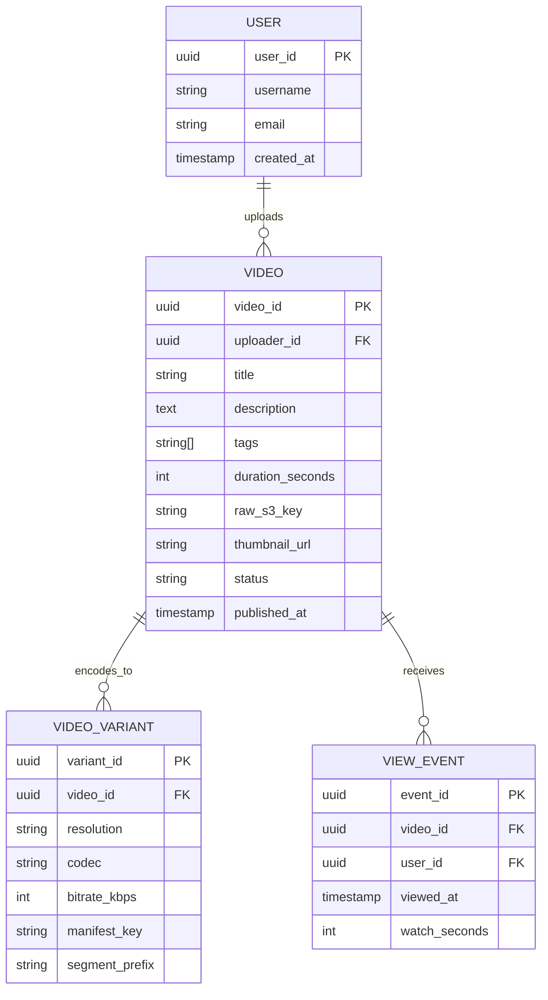
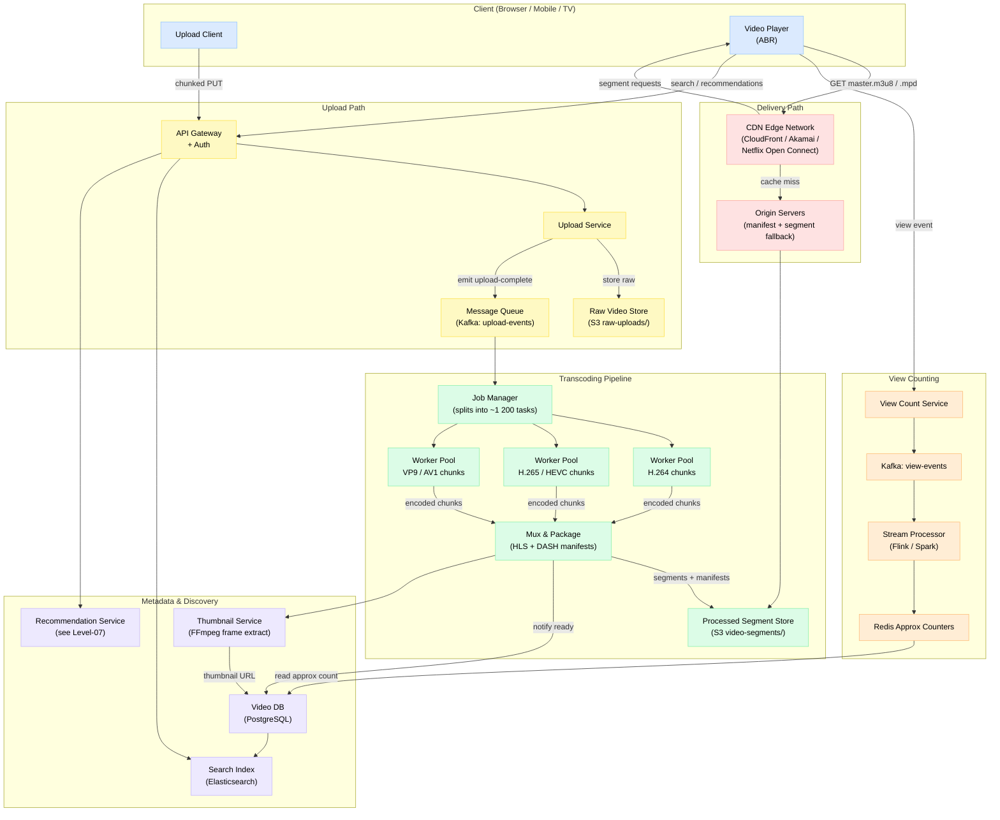
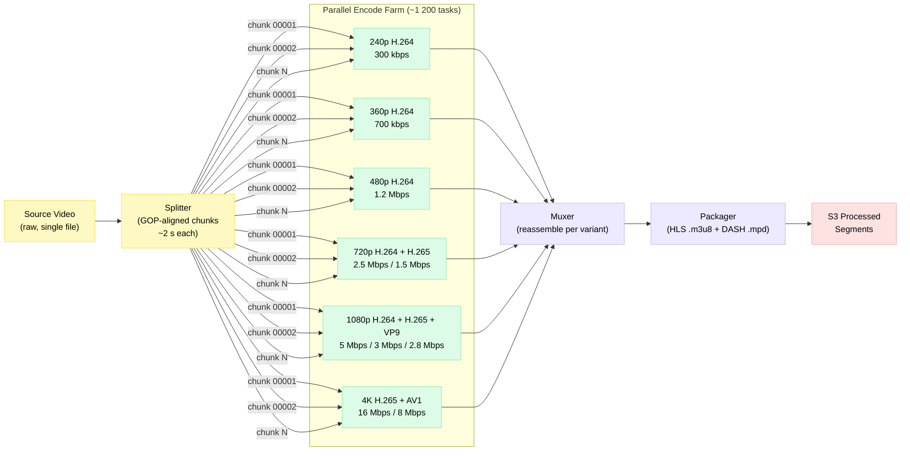

# Design YouTube / Netflix

> A planet-scale video streaming platform that ingests, transcodes, stores, and delivers billions of hours of video to hundreds of millions of concurrent viewers worldwide.

**Difficulty:** ⭐⭐⭐ · **Builds on:**
[Level 03 – Replication & Consistency](../../Level-02-Data-Layer/01-Database-Replication/README.md) ·
[Level 05 – Caching](../../Level-01-Building-Blocks/03-Caching/README.md) ·
[Level 06 – CDN & Load Balancing](../../Level-01-Building-Blocks/06-CDN/README.md) ·
[Level 07 – ML & Recommendations](../../Level-07-Big-Data-and-Specialized/05-Recommendation-and-ML-Systems/README.md) ·
[08 – WhatsApp Chat](../08-WhatsApp-Chat/README.md) ·
[10 – Typeahead Autocomplete](../10-Typeahead-Autocomplete/README.md)

---

## 1. 🎯 Problem & Scope

You're designing the backend for a platform like YouTube or Netflix. The two platforms share a core challenge — store vast libraries of video and stream them globally at low latency — but differ in upload model (user-generated vs. studio-licensed), content catalog size, and monetisation.

**In scope:**
- Video upload pipeline (chunked → raw storage → transcoding queue)
- Transcoding & packaging (multi-resolution, multi-codec, ABR segments)
- CDN strategy and Netflix Open Connect
- Adaptive Bitrate Streaming (HLS / DASH)
- Metadata storage (titles, thumbnails, view counts)
- Recommendation hook (see Level-07 link above)

**Out of scope:** auth, payments, ads, live streaming, comments at depth.

---

## 2. 📋 Requirements

### Functional
1. Users can upload videos (up to several GB) from any device.
2. Uploaded video is transcoded to multiple resolutions (240p → 4K) and codecs.
3. Users can stream video on any device; quality adapts automatically to bandwidth.
4. Search by title/tag; browse recommendations.
5. View counts visible on every video (eventual consistency OK).
6. Thumbnail auto-generated for every video.

### Non-Functional
| Property | Target |
|---|---|
| Availability | 99.99 % (< 1 h downtime / year) |
| Upload latency | Chunked upload starts within seconds; transcoding complete within minutes |
| Playback latency (time-to-first-frame) | < 2 s on broadband |
| Read/write ratio | ~10 000 : 1 (reads dominate massively) |
| Durability | 11 nines on stored video (S3-class) |
| Throughput | Netflix ≈ 37 % of downstream internet traffic at peak |

---

## 3. 🧮 Capacity Estimation

### Upload (YouTube numbers)
- **500 hours** of video uploaded every minute
- Average raw bitrate: ~10 Mbps → 10 MB/s per minute of video
- 500 × 60 min × 10 MB/s = **300 GB raw video per minute** = **5 GB/s ingest**

### Transcoding jobs
- Each source video produces ~1 200 encoding jobs (Netflix's actual number)
- 7 resolutions × 6 codec/bitrate variants × ~30 chunk shards ≈ 1 260 tasks per video
- At 500 hours/min upload, that is **~8 000 transcode tasks/second**

### Storage
- Raw video retained for 30 days (re-encode if codec improves): 300 GB/min × 60 × 24 × 30 ≈ **~13 PB raw/month**
- Processed segments (all variants): roughly 3× storage expansion after transcoding → **~40 PB processed/month** (cumulative library grows without bound; YouTube total is estimated at **1 exabyte+**)

### Streaming (Netflix numbers)
- **200 M+** paid subscribers; ~70 M concurrent streams at peak
- Average stream ≈ 5 Mbps → 70 M × 5 Mbps = **350 Tbps** downstream bandwidth
- CDN cache-hit ratio target: > 95 % (only 5 % of requests touch origin)

### Metadata
- 800 M videos × ~2 KB metadata per video = **~1.6 TB** — fits in a sharded relational or document DB
- View count events: 500 M views/day = ~6 000 events/second (write side)

---

## 4. 🔌 API Design

```
# Upload
POST /v1/uploads/initiate
  Body: { filename, size_bytes, duration_seconds, title, description, tags[] }
  → { upload_id, chunk_urls: [ presigned S3 PUT URLs ] }

PUT  /v1/uploads/{upload_id}/chunks/{chunk_index}
  Body: binary chunk (5–10 MB each)
  → 200 OK

POST /v1/uploads/{upload_id}/complete
  Body: { etags[] }         # S3 multipart finalisation
  → { video_id, status: "processing" }

# Playback
GET  /v1/videos/{video_id}/manifest
  Query: ?format=hls|dash&max_resolution=1080p
  → 302 redirect to CDN manifest URL (e.g. https://cdn.example.com/v/{id}/master.m3u8)

# Metadata
GET  /v1/videos/{video_id}
  → { video_id, title, description, uploader_id, duration_s,
      view_count_approx, thumbnail_url, publish_time, tags[] }

GET  /v1/search?q=cat+videos&page=1&limit=20
  → { items: [ VideoCard ], next_cursor }

GET  /v1/feed/recommendations?user_id=…&limit=20
  → { items: [ VideoCard ] }
```

---

## 5. 🗄️ Data Model



### Storage Justification

| Store | What | Why |
|---|---|---|
| **Object Storage (S3 / GCS)** | Raw video, transcoded segments, thumbnails | Infinite scale, 11-nines durability, native CDN integration |
| **PostgreSQL (sharded by uploader_id)** | VIDEO, USER | ACID, rich queries, easy to shard |
| **Cassandra / DynamoDB** | VIDEO_VARIANT lookup by video_id | Wide-column, high read throughput, scales horizontally |
| **Redis** | View-count counters, hot manifest cache | Sub-millisecond reads; approximate counters with INCR |
| **Elasticsearch** | Full-text search on title/tags | Inverted index, faceting, typo-tolerance |
| **Kafka** | VIEW_EVENT stream, upload events | Durable, replayable event log for Lambda/Kappa analytics |

**Naming convention for segments:**
```
s3://video-segments/{video_id}/{resolution}_{codec}/{chunk_index:05d}.ts
# e.g. s3://video-segments/abc123/1080p_h264/00001.ts

Manifest:
s3://video-segments/{video_id}/master.m3u8       (HLS)
s3://video-segments/{video_id}/manifest.mpd      (DASH)
```

---

## 6. 🏗️ High-Level Architecture



### Walk-Through

1. **Upload** — Client initiates a multipart upload. The Upload Service returns pre-signed S3 URLs; the client PUTs chunks directly to S3 (bypasses app servers). On completion, an `upload-complete` event lands on Kafka.

2. **Job fanout** — The Job Manager consumes the event, reads video metadata, and creates ~1 200 encoding tasks spread across GPU/CPU worker pools — one task per (chunk × codec × resolution) combination.

3. **Parallel transcoding** — Worker pools run FFmpeg in containers. Each worker pulls a raw chunk, encodes it to the target resolution/codec/bitrate, and writes the output segment to S3.

4. **Mux & Package** — After all chunks for a variant are done, the Mux service assembles DASH and HLS manifests and writes them to S3. It also triggers the Thumbnail Service (extracts a keyframe at t=10 s).

5. **Metadata update** — Video DB is updated with `status=published`, CDN URLs, and thumbnail URL. Elasticsearch is updated for search.

6. **Playback** — Player requests the master manifest from the CDN. The CDN serves it from edge cache (cache-hit) or fetches from origin (miss). Player parses the manifest, estimates bandwidth, selects the right variant playlist, and begins fetching segments.

7. **View counting** — Every 30-second heartbeat the player sends a view event. The View Count Service publishes to Kafka. Flink aggregates counts in a tumbling window and flushes to Redis. Redis counters are periodically written back to the Video DB.

---

## 7. 🔬 Deep Dives

### 7.1 Transcoding Pipeline (the hardest part)



**Key insight:** Splitting on GOP (Group of Pictures) boundaries is critical — you cannot start decoding a chunk mid-GOP. The Splitter finds I-frames and cuts there, so each chunk is independently decodable. This enables true parallelism across thousands of encode workers.

Netflix uses **per-title encoding**: a slow-motion cooking show can be compressed far more than a high-motion action movie. Their encoder first runs a complexity analysis pass, then picks optimal bitrate ladders per title — saving ~20 % bandwidth for the same perceived quality.

---

### 7.2 Adaptive Bitrate Streaming (HLS / DASH)

**How the manifest looks (HLS):**
```
# master.m3u8
#EXTM3U
#EXT-X-STREAM-INF:BANDWIDTH=500000,RESOLUTION=640x360,CODECS="avc1.64001E"
/v/abc123/360p.m3u8
#EXT-X-STREAM-INF:BANDWIDTH=2500000,RESOLUTION=1280x720,CODECS="avc1.64001F"
/v/abc123/720p.m3u8
#EXT-X-STREAM-INF:BANDWIDTH=5000000,RESOLUTION=1920x1080,CODECS="avc1.640028"
/v/abc123/1080p.m3u8

# 720p.m3u8  (variant playlist)
#EXT-X-TARGETDURATION:2
#EXTINF:2.0,
/v/abc123/720p/00001.ts
#EXTINF:2.0,
/v/abc123/720p/00002.ts
...
```

**How the player picks quality:**
1. **Bandwidth estimation** — measure download speed of the last N segments (EWMA).
2. **Buffer health** — if buffer > 30 s, allow stepping up; if buffer < 5 s, step down immediately.
3. **Quality selection** — pick the highest variant whose bitrate < 80 % of estimated bandwidth (leave headroom).
4. **Segment prefetch** — request segments 2–3 ahead of playback head to smooth over transient drops.

The player never contacts the origin directly for segments — everything goes through the CDN edge. The manifest URL itself resolves to the nearest CDN PoP via anycast DNS.

---

### 7.3 Netflix Open Connect (ISP-Level CDN)

Netflix places **Open Connect Appliances (OCAs)** — physical servers loaded with popular content — inside ISP data centres, sometimes just a single rack away from the subscriber's last-mile connection. This means:

- Popular titles are pre-positioned on ISP hardware **before** subscribers request them.
- Netflix's backbone carries only **cache-fill** traffic, not stream traffic.
- Result: Netflix's own WAN carries < 5 % of the bits actually watched; the rest never leaves the ISP's network.

OCA selection algorithm: Netflix's control plane (running in AWS) tells each player which OCA cluster to connect to based on geolocation, real-time capacity, and BGP routing intelligence.

---

### 7.4 Approximate View Count (Lambda Architecture)

Exact counting at 6 000 events/second with strong consistency is impractical and unnecessary. The industry solution:

```
View Event → Kafka topic
                 ↓
        ┌────────┴────────┐
        │                 │
   Speed Layer        Batch Layer
 (Flink, 10 s window) (Spark/Hadoop, hourly)
        │                 │
  Redis INCR          PostgreSQL
  (approx realtime)   (reconciled total)
        │                 │
        └────────┬────────┘
              Serve Layer
         (read Redis first;
          fall back to DB)
```

**Sampling:** For very high-traffic videos, count only 1-in-10 events and multiply. This reduces write load by 10× with negligible accuracy loss for counts in the millions.

**Why not exact?** At YouTube scale, a single viral video might receive 100 000 concurrent view events/second. An exact distributed counter requires distributed locking or a CAS loop — that's a bottleneck. Approximation with < 1 % error is fine for social proof; the advertiser billing system uses a separate, exact reconciliation pipeline.

---

## 8. 📈 Scaling, Bottlenecks & Failure Modes

| Bottleneck | Mitigation |
|---|---|
| **Upload ingest bandwidth** | Clients PUT directly to S3 via pre-signed URLs; app servers never touch bytes |
| **Transcoding queue backlog** | Auto-scale GPU worker pool on Kubernetes; prioritise shorter videos |
| **Metadata DB hot rows** (viral video) | Redis cache in front; read replicas; cache view count separately |
| **CDN cold cache** (new video) | Warm CDN by pushing popular segments proactively to edges |
| **Search index lag** | Elasticsearch updated asynchronously via Kafka; eventual consistency acceptable |
| **Single-region failure** | Multi-region active-active; manifest URLs fail over via DNS health checks |
| **Transcoding worker crash** | Idempotent tasks — each chunk has a unique key; retry from Kafka offset |
| **S3 eventual consistency** | Use strong-read consistency (S3 now offers this) or wait for replication before updating DB |

**Failure scenario — transcoding stuck:** If a worker crashes mid-job, the Job Manager's heartbeat timer fires after 5 minutes and requeues that chunk. Because each task writes to a unique S3 key, retries are safe and idempotent.

---

## 9. ⚖️ Trade-offs & Alternatives

### HLS vs. DASH
- **HLS** is Apple's standard; required for iOS and Safari. Uses `.m3u8` + `.ts` or `.fmp4` segments.
- **DASH** is codec-agnostic and open standard; preferred on Android and web.
- **In practice:** Encode once (fMP4 segments), serve both HLS and DASH manifests pointing to the same segments (CMAF — Common Media Application Format). This avoids storing segments twice.

### Codec ladder
| Codec | Compression | Device support | Encode cost |
|---|---|---|---|
| H.264 (AVC) | Baseline | Universal | Low |
| H.265 (HEVC) | ~40 % better than H.264 | Wide (not all Android) | Medium |
| VP9 | ~30 % better than H.264 | Chrome, Android | Medium |
| AV1 | ~50 % better than H.264 | Modern Chrome/Firefox/Android | Very high (10–20× slower) |

**Trade-off:** AV1 saves massive bandwidth (critical at Netflix's scale) but encode time is huge. Netflix uses AV1 only for popular titles where the upfront cost amortises over millions of streams.

### Pull CDN vs. Push CDN
- **Pull CDN** (YouTube model): edge fetches from origin on first miss, then caches. Simple to operate; cold-start latency on new videos.
- **Push CDN** (Netflix Open Connect): content pre-loaded on ISP hardware. Zero cold-start; requires sophisticated pre-positioning logic.

### Storage cost vs. re-encode flexibility
- Keeping raw video forever allows re-transcoding when better codecs emerge (Netflix does this).
- YouTube reportedly discards some raw uploads to manage storage costs, relying on already-transcoded copies.

---

## 10. 🌐 How It's Actually Done

### YouTube
- Runs on Google's global infrastructure (GCP) with Colossus distributed file system for video storage.
- Uses **VP9** and **AV1** heavily (Google owns both); early adopter of AV1 on YouTube mobile.
- Search powered by Google's proprietary indexing; recommendations via a two-tower neural retrieval model (candidate generation) + ranking model (see [Level-07](../../Level-07-Big-Data-and-Specialized/05-Recommendation-and-ML-Systems/README.md)).
- **Vitess** (MySQL sharding layer) used for metadata; Bigtable for event data.
- **500 hours of video per minute** is the canonical public stat (as of 2022).

### Netflix
- Migrated entirely to AWS (three regions: us-east-1 primary, eu-west-1, us-west-2).
- **1 source video → ~1 200 encoding jobs** — this is their published engineering figure.
- Pioneered **per-title encoding** (2015) and **per-shot encoding** (2018) — encoding complexity varies shot by shot.
- **Open Connect** CDN: ~17 000 OCA servers inside 1 000+ ISPs globally; handles > 95 % of Netflix traffic.
- **Chaos Monkey / Chaos Engineering** originated at Netflix — they routinely kill production instances to prove resilience.
- **37 % of North American downstream internet traffic** at peak (Sandvine report, 2022).
- Uses **EVS (Encoded Video Store)** — a purpose-built system for managing the asset graph of all encoding variants.
- Recommendation system is a multi-stage ML pipeline (candidate generation → ranking → diversity filters); outputs are cached per user; explained at [Level-07](../../Level-07-Big-Data-and-Specialized/05-Recommendation-and-ML-Systems/README.md).

---

## 11. 📝 Summary

| Layer | Key Design Choice | Why |
|---|---|---|
| Upload | Client → S3 direct (pre-signed URL) | App servers never bottleneck on bytes |
| Transcoding | ~1 200 parallel tasks per video | Reduce wall-clock time from hours to minutes |
| Codec ladder | H.264 + H.265 + VP9 + AV1 | Balance compatibility vs. bandwidth savings |
| Segments | GOP-aligned 2 s chunks | Independent decodability + fine-grained ABR |
| Manifests | HLS + DASH over CMAF segments | One set of bytes, two protocol views |
| CDN | Pull CDN (YouTube) / Push OCA (Netflix) | Netflix's ISP co-location eliminates WAN cost |
| ABR player | EWMA bandwidth + buffer health heuristic | Smooth experience under network variability |
| Metadata | PostgreSQL (sharded) + Elasticsearch | Relational integrity + full-text search |
| View counts | Kafka → Flink (speed) + Spark (batch) + Redis | Approximate counting scales to billions/day |
| Thumbnails | FFmpeg keyframe at t=10 s, async post-transcode | No upload friction; always available at publish |

**The single most important insight:** video streaming is a **read-dominated, bandwidth-dominated problem**. Every major architectural decision — chunked uploads, parallel transcoding, CDN edge caching, ABR streaming, per-title encoding — exists to make the read path faster and cheaper, because reads outnumber writes by 10 000 : 1 and bandwidth is the dominant cost.
