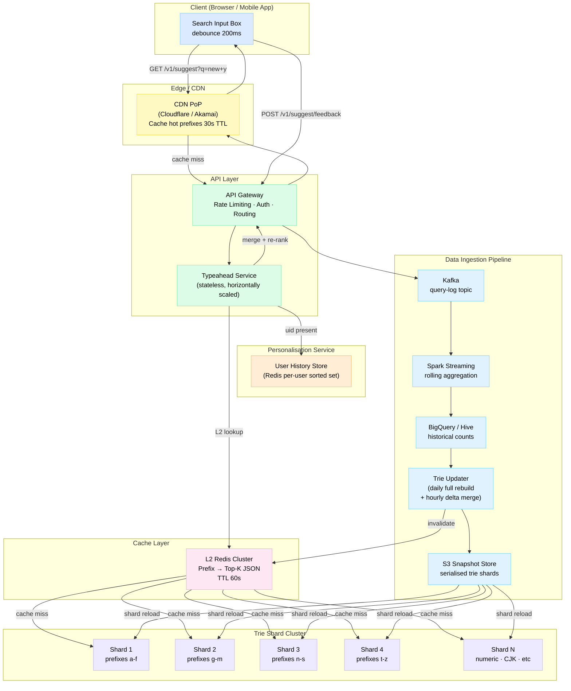
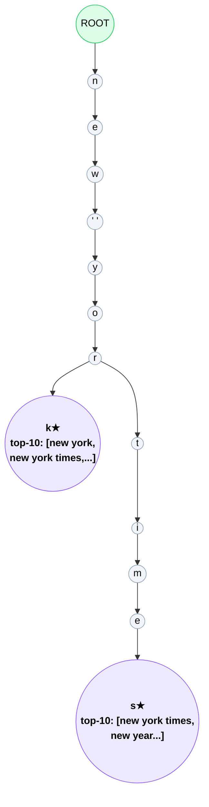
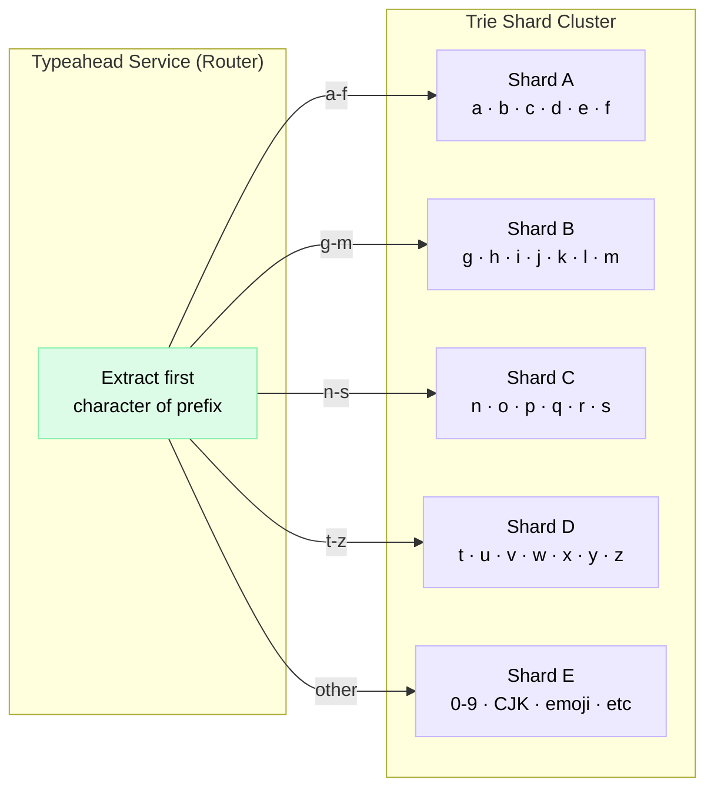

# Design Typeahead / Autocomplete

> A real-time search suggestion system that predicts and surfaces relevant completions as the user types — typically returning results in under 100 ms.

**Difficulty:** ⭐⭐⭐ · **Builds on:**
[Caching](../../Level-01-Building-Blocks/03-Caching/README.md) ·
[Sharding & Partitioning](../../Level-02-Data-Layer/02-Sharding-and-Partitioning/README.md) ·
[Indexing](../../Level-02-Data-Layer/03-Indexing/README.md) ·
[API Gateway](../../Level-05-Architecture-Patterns/05-API-Gateway/README.md) ·
[Scalability](../../Level-01-Building-Blocks/01-Scalability/README.md)

---

## 1. 🎯 Problem & Scope

Every time you type "new y" into Google and see "new york", "new york times", and "new york weather" appear instantly, that is typeahead at work. The feature is so tightly coupled with the perceived quality of a search experience that Google's own research showed autocomplete saves users about 25% of their keystrokes.

**What we are building:**
- A backend service that accepts a partial query string (prefix) and returns the top-K matching suggestions in ranked order.
- An ingestion pipeline that learns from real user queries over time so popular searches surface first.
- A caching layer that keeps hot prefixes blazing fast.

**Out of scope for this design:**
- Spell correction / fuzzy matching (a separate ML problem)
- Contextual or semantic search (embedding-based retrieval)
- Full-text document search (covered separately in a search design)

---

## 2. 📋 Requirements

### Functional
1. Given a prefix string typed by the user, return the top-10 suggested completions ranked by global popularity.
2. Suggestions should reflect recent query trends — the index refreshes at least hourly.
3. Support optional personalisation: blend user-specific history with global rankings.
4. The API must handle all Unicode prefixes (support languages other than English).

### Non-Functional
| Concern | Target |
|---|---|
| P99 end-to-end latency | < 100 ms |
| Availability | 99.99 % (four nines) |
| Freshness | Suggestions updated within 1 hour of trend shift |
| Scale | Support 575 K suggestion QPS at peak (see §3) |
| Storage | Hold ~100 million unique query strings |
| Read:Write ratio | ~1000 : 1 (mostly reads, writes from aggregation pipeline) |

---

## 3. 🧮 Capacity Estimation

**Starting from Google-scale numbers and working down:**

```
Google total searches per day  : ~5.6 B
Fraction typed character-by-character: ~20 %
Queries that trigger typeahead  : 5.6 B × 0.20 = 1.12 B typeahead requests/day

Average prefix length before submitting: 5 characters
→ Each final query generates ~5 typeahead requests

Typeahead requests/day          : 1.12 B × 5 = 5.6 B requests/day
Average QPS                     : 5.6 B / 86,400 ≈ 64,800 QPS
Peak multiplier                  : ~3× (morning commute, breaking news)
Peak QPS to typeahead service   : ~195,000 QPS

For a hypothetical 10 B searches/day product:
  Base typeahead QPS            : 10 B × 0.20 × 5 / 86,400 ≈ 115,700 QPS
  Peak (3×)                     : ~347,000 QPS
  With caching offloading 60 %  : ~139,000 QPS reaches backend
```

**Trie memory estimation:**

```
Unique query strings            : 100 M
Average query length            : 20 characters
Trie nodes (internal + leaves)  : ~500 M (each shared prefix collapses nodes)

Per trie node:
  - Character key               : 1 byte
  - Pointer map (26 children)   : 26 × 8 bytes = 208 bytes (dense array)
  - Top-10 suggestion list      : 10 × (20 chars + 8-byte score) = 280 bytes
  - Total per node              : ~500 bytes

Total trie memory               : 500 M × 500 B ≈ 250 GB

Split across 50 shards          : ~5 GB per shard (fits comfortably in RAM)
```

**Bandwidth:**

```
Payload per response: 10 suggestions × 30 bytes avg = 300 bytes
Peak egress: 347,000 QPS × 300 B ≈ 104 MB/s ≈ 832 Mbps  (well within 10 GbE)
```

---

## 4. 🔌 API Design

### Suggestion Endpoint

```
GET /v1/suggest?q={prefix}&limit={k}&lang={locale}&uid={user_id}
```

| Parameter | Type | Required | Notes |
|---|---|---|---|
| `q` | string | yes | UTF-8 encoded prefix, max 100 chars |
| `limit` | int | no | Default 10, max 20 |
| `lang` | string | no | BCP-47 locale, e.g. `en-US` |
| `uid` | string | no | Opaque user ID for personalisation; omit for anonymous |

**Response (200 OK):**

```json
{
  "prefix": "new y",
  "suggestions": [
    { "text": "new york",       "score": 9823145, "type": "global"   },
    { "text": "new york times", "score": 4102387, "type": "global"   },
    { "text": "new year 2026",  "score":  812044, "type": "trending" },
    { "text": "new york city",  "score":  401233, "type": "personal" }
  ],
  "request_id": "a1b2c3d4",
  "latency_ms": 18
}
```

**Error responses:**
- `400` — prefix exceeds 100 characters or contains invalid encoding
- `429` — rate limit exceeded (per-IP: 200 RPS, per-UID: 50 RPS)
- `503` — trie shard temporarily unavailable (client should degrade gracefully)

### Feedback / Click-Through Endpoint

```
POST /v1/suggest/feedback
{ "prefix": "new y", "selected": "new york", "uid": "u123", "ts": 1750000000 }
```

This feeds the click-through signal into the ranking pipeline.

---

## 5. 🗄️ Data Model

### Trie Node (in-memory, per shard)

```
erDiagram
    TRIE_NODE {
        string   char_key        "single character"
        int64    node_id
        int64    parent_id
        map      children        "char -> node_id"
        TopKList top_suggestions "pre-computed top-K"
        int64    subtree_count   "total queries under this prefix"
    }
    TOP_K_ENTRY {
        string text
        int64  global_score      "query count over rolling 30-day window"
        float  trending_boost    "recency multiplier"
        float  personal_score    "per-user affinity (optional)"
    }
    TRIE_NODE ||--o{ TOP_K_ENTRY : "stores"
    TRIE_NODE ||--o{ TRIE_NODE   : "children"
```

### Query Log (append-only, Kafka → data warehouse)

| Column | Type | Notes |
|---|---|---|
| `query_text` | string | Normalised (lowercase, trimmed) |
| `user_id` | string | Hashed for privacy |
| `session_id` | string | Groups a typing session |
| `submitted` | bool | True = user pressed Enter |
| `selected_suggestion` | string | Null if user typed it themselves |
| `timestamp` | int64 | Unix ms |
| `locale` | string | BCP-47 |

### Aggregated Scores (updated by batch/streaming pipeline)

| Column | Type | Notes |
|---|---|---|
| `query_text` | string | PK |
| `count_7d` | int64 | Rolling 7-day submit count |
| `count_30d` | int64 | Rolling 30-day submit count |
| `count_1h` | int64 | Last-hour count for trending detection |
| `last_seen_ts` | int64 | Recency signal |

**Storage choices:**
- **Trie shards** → in-memory (each shard server loads its slice on startup from a serialised snapshot stored in S3)
- **Query logs** → Kafka (durable, high-throughput append) → BigQuery / Hive (historical aggregation)
- **Aggregated scores** → Redis sorted sets (for fast top-K retrieval during incremental updates) + S3 snapshots

---

## 6. 🏗️ High-Level Architecture



**Request walk-through (hot path — numbered):**

1. **Debounce** — user types "new y"; the client waits 200 ms of inactivity before firing a request (saves ~30 % of unnecessary requests).
2. **CDN hit** — the CDN PoP checks its local cache for `suggest:new+y`. On a hit the response is returned in <5 ms with zero backend load.
3. **API Gateway** — on a CDN miss, the request reaches the Gateway which enforces rate limits and forwards to a Typeahead Service pod.
4. **L2 Redis** — the Typeahead Service checks Redis. If it finds the key (TTL = 60 s), it returns immediately without hitting the trie. Typical latency: 2–5 ms.
5. **Trie shard lookup** — on an L2 miss, the service routes to the correct shard by first character of the prefix (e.g. "n" → Shard 3). The shard walks the trie in O(prefix\_length) steps and returns the pre-computed Top-K list.
6. **Personalisation blend** — if a `uid` is present, the service fetches user-specific query history from Redis, merges those scores (typically 30 % weight) with global scores, and re-ranks in memory.
7. **Populate caches** — the result is written to L2 Redis and the CDN cache on the way out.
8. **Feedback loop** — when the user submits a query or clicks a suggestion, a lightweight POST goes to Kafka, feeding the ranking pipeline.

---

## 7. 🔬 Deep Dives

### 7.1 The Trie Data Structure

A trie (prefix tree) is the core data structure. Each node represents a single character; a path from the root spells out a prefix.



**Key design choices:**

- **Pre-compute top-K at every node.** Storing the top-10 suggestions at each node means a query only traverses `len(prefix)` nodes, then reads a pre-built list — O(prefix\_length) total, not O(trie\_size). The trade-off is higher memory and slower writes (you must update ancestors when a score changes).
- **Score = weighted blend of frequency + recency.** `score = count_30d × 0.7 + count_7d × 0.2 + count_1h × 0.1`. This smooths out spikes while still surfacing trends.
- **Children as hash map, not 26-element array.** For Unicode support, use a `map[rune]nodeID` rather than a fixed-size array. Memory overhead is proportional to actual branching factor (~3–5 per node in practice for natural language).

### 7.2 Prefix Sharding Strategy



**Range-based sharding (first character) — pros:**
- Deterministic routing with no lookup table — the router is a simple range map.
- Shard boundaries are stable; a new shard can absorb a range without global reshuffling.
- Predictable memory per shard (character frequency in natural language is well-studied).

**Cons:**
- **Hot shards.** In English, `s` and `c` are far more common starting characters than `x` and `z`. You may need sub-sharding (split `s*` across two shards) for load balance.
- **Cross-shard queries.** If the product supports "contains" search or mid-word matching, a single request may fan out to every shard.
- **Rebalancing is manual.** Moving a prefix range means rebuilding two shards.

**Alternative — consistent hashing on the full prefix string.** Distributes load more evenly but loses data locality (a single typing session may span many shards).

### 7.3 Trie Update Pipeline

Updating a trie naively on every query would require acquiring a write lock on every ancestor node — too slow at 100 K+ QPS.

**Two-phase strategy:**

| Phase | Frequency | Mechanism |
|---|---|---|
| Full rebuild | Daily (off-peak) | Spark reads all 30-day query logs, recomputes all scores, serialises entire trie to S3, shards reload atomically |
| Delta merge | Hourly | Spark Streaming computes score deltas for the top-1 M queries; Trie Updater sends targeted node patches; each shard applies them under a brief write lock |

**Atomic shard reload (zero-downtime):**
1. The shard server loads the new snapshot into a second in-memory trie instance.
2. After the load completes (seconds to low minutes), it flips an atomic pointer from old to new.
3. In-flight requests complete against the old trie; new requests use the new one.
4. The old trie is dereferenced and garbage collected.

### 7.4 Caching & Latency Budget

**Where does the 100 ms go?**

```
Client debounce / wait      :  200 ms (before request fires — not in our budget)
Network (client → CDN PoP)  :   5–20 ms  (geography dependent)
CDN hit                     :   0–2  ms  → total round-trip ≤ 25 ms  ✅
CDN miss, Redis hit         :   2–5  ms  → total ≤ 35 ms             ✅
CDN miss, Redis miss,
  trie lookup + serialise   :  10–30 ms  → total ≤ 65 ms             ✅
  + personalisation blend   :   5–15 ms  → total ≤ 80 ms             ✅
Network return (CDN → client):  5–20 ms
━━━━━━━━━━━━━━━━━━━━━━━━━━━━━━━━━━━━━━━━━━━━━━━━━━━━━━━━━
Worst case uncached         :  80 + 20 = 100 ms  (exactly at budget)
```

**Cache invalidation strategy:**
- When the hourly delta merge finishes, the Trie Updater publishes a set of changed prefixes to a Redis Pub/Sub channel.
- Each Typeahead Service pod subscribes and evicts only the affected L2 keys — no full cache flush.
- CDN TTL is kept short (30 s) so stale CDN entries self-expire without an active purge call.

**L1 in-process cache:**
- Each Typeahead Service pod maintains a small (50 MB) LRU cache of the 100 K most recently served prefixes.
- This absorbs repeated requests within a single pod without hitting Redis.
- TTL: 10 s (short enough that a trending query appears within seconds of the Redis update).

---

## 8. 📈 Scaling, Bottlenecks & Failure Modes

### Scaling

| Layer | Scaling mechanism |
|---|---|
| CDN | Geographically distributed PoPs, auto-scale by provider |
| API Gateway / Typeahead Service | Horizontal pod autoscaler on CPU; target 60 % utilisation |
| L2 Redis | Redis Cluster with 6 nodes (3 primary, 3 replica); add shards when memory > 70 % |
| Trie shards | Add shard servers; split hot prefix ranges; reload takes <2 min |
| Kafka ingestion | Increase partition count; consumer lag is the SLA metric to watch |

### Bottlenecks

1. **Hot prefix bursts** — a breaking news event causes 100× spike on one prefix (e.g. "earthquake"). The CDN and L1 cache absorb most of this, but the first shard request can still cause thundering-herd to Redis. Mitigate with a per-key Bloom filter + request coalescing (only one backend request in flight per prefix).
2. **Shard reload latency** — during the daily full rebuild, loading a 5 GB shard takes 60–90 s. During this window, that shard serves slightly stale data. Mitigate by pre-warming the new instance before switching the pointer.
3. **Serialisation cost** — converting the top-10 list to JSON for every uncached response costs ~0.5 ms. Pre-serialise the top-K list at write time so reads just copy bytes.

### Failure Modes

| Failure | Impact | Mitigation |
|---|---|---|
| Single trie shard crash | Prefixes in that range return empty results | Each shard has a hot standby replica; failover < 5 s via health-check |
| Redis cluster partition | L2 cache disabled; all traffic hits trie | Circuit breaker: fall back gracefully; trie alone can handle reduced load |
| Ingestion pipeline lag | Suggestions go stale | Monitor Kafka consumer lag; alert at > 2 × normal; pipeline is non-critical to read path |
| CDN PoP outage | Regional latency spike | Anycast routing; traffic shifts to next-nearest PoP automatically |

---

## 9. ⚖️ Trade-offs & Alternatives

### Trie vs. Inverted Index

| Dimension | Trie | Inverted Index (Elasticsearch) |
|---|---|---|
| Prefix lookup speed | O(prefix\_length) — very fast | O(log N) or O(1) with edge n-gram index |
| Memory efficiency | High (shared prefixes compress storage) | Lower (n-gram explosion increases index size) |
| Fuzzy matching | Does not support natively | Excellent (Levenshtein automaton) |
| Operational complexity | Custom implementation required | Battle-tested OSS tooling |
| Write latency | Expensive (update ancestors) | Cheaper (standard index update) |

**Verdict:** Use a trie when latency is paramount and queries are strictly prefix-based. Use Elasticsearch if you also need fuzzy matching, multi-field ranking, or substring search.

### Ranked Trie vs. Flat Sorted Set per Prefix

An alternative to storing the trie in memory is to store, for every possible prefix, a Redis sorted set of suggestions keyed by score. This is simpler to implement and update but uses significantly more memory (every prefix is stored independently, no structure sharing). At 100 M unique queries × average 5-character prefixes = 500 M prefix keys — impractical for Redis alone.

### Real-Time Counts vs. Batch Aggregation

Counting queries in real time (e.g., with a streaming counter in Redis) gives fresher rankings but creates write amplification: every submitted query must update O(prefix\_length) sorted sets. At 115 K QPS that is ~575 K writes/s to Redis — feasible but expensive. Hourly batch aggregation is a better trade-off for most systems; true real-time is reserved for "trending now" features.

---

## 10. 🌐 How It's Actually Done

**Google Search Suggest** (public research):
- Uses a variant of the trie with pruning: low-count nodes below a threshold are dropped to keep memory tractable.
- Applies a personalised ranking layer on top of global popularity; your recent searches and location influence what appears.
- The system accounts for search seasonality — "christmas gifts" ranks higher in December even though its 30-day count is lower in July.
- Google debounces on the server side too: requests within 40 ms of each other for the same session are coalesced.

**Bing Autosuggest API:**
- Exposes the underlying infrastructure as a paid API, so third-party apps can use the same suggestion engine.
- Adds a `SafeSearch` parameter to filter adult content from suggestions.

**Elasticsearch Completion Suggester:**
- A production-grade open-source implementation using an in-memory FST (Finite State Transducer) — a compressed form of a trie that can be 10× smaller in RAM.
- Weights can be set per document at index time; re-ranking requires a re-index.
- Used by LinkedIn, Airbnb, and Wikipedia for their search boxes.

**Key industry lessons:**
- **Latency wins over freshness.** Most companies accept hourly-stale suggestions rather than pay the write-amplification cost of real-time updates.
- **The top 1 % of prefixes account for 50 %+ of traffic.** A small, warm in-process cache covers the vast majority of load.
- **Client-side debouncing is not optional.** Without it, a fast typist generates 10× more requests than necessary, and the system cannot be right-sized efficiently.

---

## 11. 📝 Summary

| Decision | Choice | Why |
|---|---|---|
| Core data structure | Trie with pre-computed top-K per node | O(prefix\_length) reads, predictable memory |
| Sharding | Range-based on first character | Deterministic routing, no lookup table |
| Cache hierarchy | L1 in-process LRU → L2 Redis → CDN | Minimise backend hits; satisfy < 100 ms budget |
| Update strategy | Daily full rebuild + hourly delta merge | Freshness without write-amplification |
| Ranking signal | Count\_30d × 0.7 + count\_7d × 0.2 + count\_1h × 0.1 | Balances popularity, trend velocity, and recency |
| Client behaviour | 200 ms debounce before firing request | Reduces unnecessary QPS by ~30 % |
| Personalisation | 30 % personal / 70 % global blend | Relevant without sacrificing discoverability |
| Failure isolation | Hot standby per shard + Redis circuit breaker | No single point of failure on the read path |

**The core insight:** typeahead is a read-heavy, latency-sensitive system where you trade write complexity (expensive pre-computation of top-K at every node, batch aggregation pipelines, cache invalidation) for blazing-fast reads. Get the caching hierarchy right, pre-compute aggressively, and the trie itself becomes almost a formality at query time.
