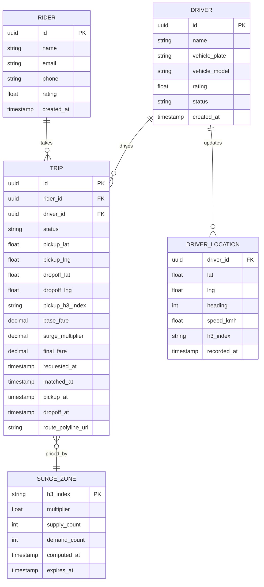
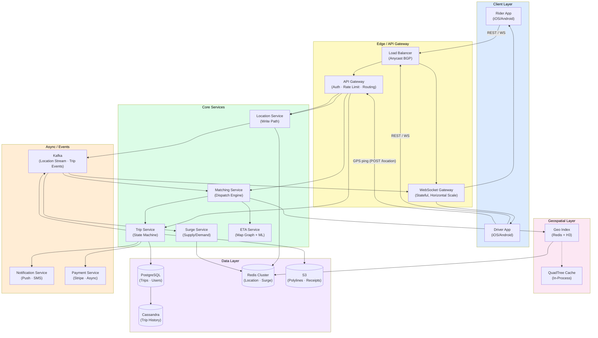
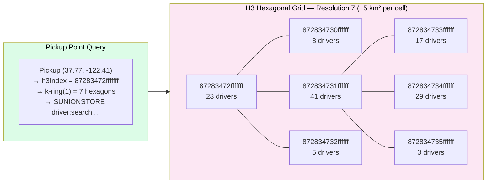
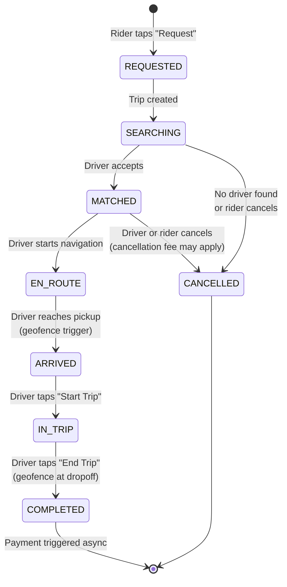

# Design Uber Ride-Sharing

> A real-time, geospatial ride-matching platform that connects riders and drivers at massive scale, handling millions of location updates per second and sub-second dispatch decisions globally.

**Difficulty:** ⭐⭐⭐⭐ · **Builds on:** [CAP Theorem](../../Level-04-Distributed-Systems/01-CAP-Theorem/README.md), [Consistent Hashing](../../Level-02-Data-Layer/08-Consistent-Hashing/README.md), [WebSockets](../../Level-03-Communication/06-WebSockets-and-Realtime/README.md)

---

## 1. 🎯 Problem & Scope

You're designing the core of a ride-sharing platform like Uber. At its heart, the problem sounds simple: a rider requests a trip, you find a nearby driver, they pick the rider up, and everyone pays. But at Uber's actual scale — 5 million trips per day, 100+ countries, 5 million active drivers — nearly every piece of that flow becomes a hard distributed systems problem.

**What we're building:**
- Rider requests a trip from location A to B
- System finds available drivers in the area using geospatial indexing
- Matching algorithm dispatches the best driver
- Real-time location tracking streams driver position to rider over WebSockets
- Trip state machine transitions from `REQUESTED` → `MATCHED` → `EN_ROUTE` → `ARRIVED` → `IN_TRIP` → `COMPLETED`
- Surge pricing adjusts fares based on supply/demand imbalance

**Out of scope:** payments processing, driver onboarding, fraud detection, in-app messaging (though we'll mention where they plug in).

**Related systems:** [Food Delivery](../12-Food-Delivery/README.md) shares the same geospatial + dispatch core — read that after this one to see how the problem changes when you add restaurant prep time and multi-order batching.

---

## 2. 📋 Requirements

### Functional

- Rider can request a ride by providing pickup and dropoff location
- System matches rider with an available nearby driver within seconds
- Driver receives trip request and can accept or decline
- Both rider and driver see each other's real-time location on a map
- System calculates ETA and fare estimate before trip confirmation
- Trip progresses through defined states with notifications at each step
- Surge pricing activates when demand exceeds driver supply in an area
- Rider and driver can cancel trips (with cancellation fee logic)
- Trip history and receipts available after completion

### Non-Functional

- **Matching latency:** driver assigned within 3 seconds of request (P99)
- **Location update latency:** driver position refreshes on rider's map within 1 second
- **Availability:** 99.99% uptime — a 1-hour outage in a city is a headline incident
- **Consistency:** a driver must never be matched to two riders simultaneously (critical correctness requirement)
- **Scale:** 5 million trips/day, 1 million active drivers sending location updates every 4 seconds
- **Geo-distribution:** latency-sensitive; ride requests must be handled by a regional cluster, not routed to another continent
- **Durability:** trip records never lost; payment events must be exactly-once

---

## 3. 🧮 Capacity Estimation

Let's anchor everything in real numbers.

**Traffic:**
```
5,000,000 trips/day
→ ~58 trips/second (average)
→ ~350 trips/second at peak (6x multiplier during rush hour)

1,000,000 active drivers at any moment
Each driver sends GPS ping every 4 seconds
→ 1,000,000 / 4 = 250,000 location writes/second (average)
→ ~1,000,000 location writes/second at peak city surges

Riders polling driver position every 2 seconds during trip
  At peak: 300,000 active trips × 1 read / 2s = 150,000 location reads/second
```

**Storage:**
```
Trip record: ~1 KB (metadata, timestamps, route polyline reference)
5M trips/day × 1 KB = 5 GB/day → ~1.8 TB/year (trips table)

Driver location: lat/lng/timestamp/driver_id = ~50 bytes
Retain last 24h for replay/debugging:
  1,000,000 drivers × (86,400s / 4s pings) × 50 bytes = ~1 TB/day
  → Use TTL; don't keep forever

Route polylines (for trip history):
  ~10 KB per trip × 5M trips/day = 50 GB/day → object storage (S3)
```

**Bandwidth:**
```
Location update write: 50 bytes × 250,000/s = ~12.5 MB/s inbound
Location update read (fan-out to rider): 100 bytes × 150,000/s = 15 MB/s outbound
WebSocket connections: ~600,000 concurrent (active trips × 2 participants)
  → Each WS connection ~10 KB RAM → 6 GB RAM just for connection state
  → Need horizontally scaled WebSocket gateway
```

**Key insight:** The write-heavy location update stream (~1M/s at peak) is your dominant scaling challenge — not matching, not reads. Your location store must be an in-memory write-optimized system, not a relational DB.

---

## 4. 🔌 API Design

### REST Endpoints

**Request a ride:**
```
POST /v1/rides
Authorization: Bearer <rider_token>

{
  "pickup": { "lat": 37.7749, "lng": -122.4194 },
  "dropoff": { "lat": 37.3382, "lng": -121.8863 },
  "ride_type": "UBER_X",
  "payment_method_id": "pm_abc123"
}

Response 202 Accepted:
{
  "ride_id": "ride_xyz789",
  "status": "SEARCHING",
  "estimated_fare": { "min": 18.50, "max": 24.00, "currency": "USD" },
  "estimated_pickup_minutes": 4,
  "surge_multiplier": 1.4,
  "ws_token": "wst_ephemeral_abc"   // short-lived token for WebSocket auth
}
```

**Update driver location** (called by driver app):
```
POST /v1/driver/location
Authorization: Bearer <driver_token>

{
  "lat": 37.7751,
  "lng": -122.4180,
  "heading": 245,
  "speed_kmh": 32,
  "timestamp": "2026-06-24T10:15:30.123Z"
}

Response 204 No Content
```

**Accept/decline ride request** (driver):
```
PUT /v1/rides/{ride_id}/assignment
Authorization: Bearer <driver_token>

{ "action": "ACCEPT" | "DECLINE" }

Response 200 OK:
{ "ride_id": "ride_xyz789", "status": "MATCHED" }
```

**Get ride status:**
```
GET /v1/rides/{ride_id}

Response 200 OK:
{
  "ride_id": "ride_xyz789",
  "status": "EN_ROUTE",
  "driver": {
    "id": "drv_456",
    "name": "Marcus T.",
    "rating": 4.87,
    "vehicle": "Toyota Prius · Silver · 7ABC123",
    "current_location": { "lat": 37.7750, "lng": -122.4185 },
    "eta_seconds": 180
  }
}
```

### WebSocket API

Both rider and driver connect to a WebSocket gateway after trip creation. The server pushes events; clients don't need to poll.

**Connection:**
```
WS wss://realtime.uber.com/v1/trips/{ride_id}?token=wst_ephemeral_abc
```

**Server → Client events:**
```jsonc
// Driver location update (pushed every 2s to rider)
{ "type": "DRIVER_LOCATION", "lat": 37.7750, "lng": -122.4185, "eta_seconds": 165 }

// Trip state changes
{ "type": "TRIP_STATE", "status": "ARRIVED", "message": "Your driver has arrived" }

// Surge pricing change
{ "type": "SURGE_UPDATE", "multiplier": 1.8, "expires_at": "2026-06-24T10:30:00Z" }
```

---

## 5. 🗄️ Data Model



**Storage choices:**

| Entity | Store | Why |
|---|---|---|
| RIDER, DRIVER | PostgreSQL | Relational, ACID, rarely write-heavy |
| TRIP | PostgreSQL + Cassandra (history) | Hot trips in Postgres, completed → Cassandra for write-scaled history |
| DRIVER_LOCATION | Redis Sorted Sets + H3 index | Sub-millisecond reads, geospatial queries, TTL eviction |
| SURGE_ZONE | Redis | Computed every 30s, purely hot data |
| Route polylines | S3 | Large blobs, cheap, no query needs |

---

## 6. 🏗️ High-Level Architecture



**Walk-through — what happens when you tap "Request Uber":**

1. **Rider app** sends `POST /v1/rides` → hits the **API Gateway** (auth, rate limiting, region routing).
2. **Trip Service** creates a trip record in PostgreSQL with status `SEARCHING`, returns a `ride_id` and a short-lived WebSocket token.
3. Rider app opens a **WebSocket connection** to the WS Gateway using that token.
4. **Matching Service** queries the **Geo Index** (Redis + H3) to find all `AVAILABLE` drivers within, say, 5 km of the pickup point.
5. Matching Service scores candidates (ETA, driver rating, acceptance rate) and dispatches the top candidate via push notification through the **Notification Service**.
6. Driver app receives push, driver taps Accept → `PUT /v1/rides/{id}/assignment` → Trip Service transitions state to `MATCHED`.
7. Trip Service publishes a `TRIP_MATCHED` event to **Kafka**. WebSocket Gateway consumes it and pushes a `TRIP_STATE` event to both rider and driver WebSockets.
8. Meanwhile, every 4 seconds, the driver app sends a GPS ping. **Location Service** writes to Redis and publishes to Kafka. The WS Gateway consumes location events for active trips and pushes `DRIVER_LOCATION` updates to the rider every 2 seconds.
9. At dropoff, Trip Service transitions to `COMPLETED`, triggers async payment via **Payment Service**, stores the route polyline to S3, and archives the trip to **Cassandra**.

---

## 7. 🔬 Deep Dives

### 7.1 Geospatial Indexing: Geohash vs QuadTree vs Uber H3

The single most important design question: how do you answer "find all available drivers within 3 km of this point" at 350 queries/second with sub-50ms latency?

**Option A — Geohash**

Encode any (lat, lng) into a base-32 string where prefix length controls precision.

```
Precision 6 chars → ~1.2 km × 0.6 km cell
Precision 5 chars → ~4.9 km × 4.9 km cell

San Francisco downtown: 9q8yy (precision 5)
```

Store driver locations as `HSET driver:{id} lat lng geohash 9q8yy`.
Query: `KEYS geohash:9q8yy:*` — but edge effects mean you must also query 8 neighbors.

**Pros:** Simple, fits naturally in Redis sorted sets. **Cons:** Cells are rectangles (distortion near poles), 8-neighbor lookups at cell boundaries are fiddly, poor for radius queries.

**Option B — QuadTree**

Recursively subdivide the world into 4 quadrants. Each node tracks driver count; leaf nodes store driver IDs. Dynamic depth: sparse suburbs stay coarse, dense Manhattan subdivides deep.

**Pros:** Adapts to driver density, great for range queries. **Cons:** Hard to distribute across machines (tree structure is stateful), rebalancing under high write load is expensive, not a Redis primitive.

**Option C — Uber H3 (what Uber actually uses)**

Uber open-sourced H3 in 2018. It tiles the sphere in hexagons (with 12 pentagons at icosahedron vertices). Key properties:

- **Equal area:** every hexagon at a given resolution is roughly the same size — no polar distortion
- **Hierarchical:** 16 resolution levels; a resolution-9 hexagon is ~0.1 km², resolution-7 is ~5.16 km²
- **Fixed neighbors:** each hexagon has exactly 6 neighbors — disk queries (k-ring) are clean and symmetric
- **Compact IDs:** each cell is a 64-bit integer — tiny storage, fast hashing



**Implementation in Redis:**

```
// Driver comes online / updates location
h3Index = h3.latLngToCell(37.7749, -122.4194, resolution=9)  // ~0.1 km²
SADD geo:h3:{h3Index} driver_id_456
EXPIRE geo:h3:{h3Index} 30  // auto-expire if driver goes offline

// Query drivers near pickup — k-ring(2) covers ~2 km radius at res-9
neighbors = h3.gridDisk(pickupH3Index, k=2)  // returns ~19 hex IDs
SUNIONSTORE temp:search:{requestId} geo:h3:{hex1} geo:h3:{hex2} ... geo:h3:{hex19}
```

**Winner:** H3. Equal-area hexagons with 6-neighbor symmetry make k-ring queries cleaner than geohash's 8-neighbor rectangle queries, and simpler to distribute than a QuadTree. You can shard the Redis cluster by H3 index prefix.

---

### 7.2 High-Frequency Driver Location Updates

**The problem:** 1 million drivers × 1 ping / 4 seconds = 250,000 writes/second average, 1M/sec peak. This is pure write pressure, and you need both low latency (driver must appear "live" on the map) and high throughput.

**Write path:**

```
Driver App
  → POST /v1/driver/location (HTTP/2, keep-alive)
  → Location Service (stateless, 50+ instances)
    → Redis WRITE: HSET driver:{id} lat lng h3_9 {index} ts {epoch}
                   SADD geo:h3:{h3Index} {driverId}
                   EXPIRE driver:{id}:loc 30
    → Kafka PUBLISH: topic=driver-locations, key={driverId}, value={lat,lng,h3,ts}
```

**Why Redis before Kafka?** Matching Service needs the current position now, not after a Kafka consumer lag. Redis is the source of truth for live location. Kafka is the fan-out bus for everything else (WS gateway, analytics, ETA re-computation).

**Why not write directly to PostgreSQL?** PostgreSQL at 1M writes/second is not a thing. Even with connection pooling and bulk inserts you'd need a cluster the size of a small country. Redis AOF + periodic snapshot gives you durability guarantees that are good enough for location data (if you lose 4 seconds of GPS pings you've lost nothing important).

**Redis cluster sharding:** Shard by `{driverId}` using consistent hashing. A single Redis node handles ~100K writes/second comfortably; 10 shards gives you comfortable headroom. Each shard also holds the H3 sets for the geographic cells assigned to it (co-located by H3 prefix hashing).

**Driver going offline:** Driver app sends a DISCONNECT or pings stop arriving. A TTL-based eviction (30s) removes the driver from all H3 sets automatically via a Lua script that runs on key expiry.

---

### 7.3 Matching & Dispatch Algorithm

When a rider requests a trip, the Matching Service must:

1. **Find candidates:** k-ring query on pickup H3 index, pull all `AVAILABLE` drivers
2. **Filter:** remove drivers beyond hard distance limit (e.g., 8 km), drivers who just declined the same rider, suspended accounts
3. **Score each candidate:**

```
score(driver) = w1 × (1 / eta_seconds)
              + w2 × driver_rating
              + w3 × driver_acceptance_rate
              + w4 × (is_preferred_driver ? 1 : 0)
              - w5 × (recent_declines_this_area)
```

4. **Dispatch sequentially** to top candidate(s). You don't broadcast to all at once — that causes thundering herd and double-acceptance races. Instead:
   - Offer to #1 with a 15-second timeout
   - If declined/timeout → offer to #2, and so on
   - If no match in 2 minutes → inform rider of longer wait or no availability

**Preventing double-booking (the critical correctness requirement):**

When dispatching to a driver, use a Redis distributed lock:

```
SET lock:driver:{driverId} {rideId} NX EX 20
// NX = only set if Not eXists → atomic claim
// EX 20 = auto-release after 20s if driver doesn't respond
```

Only the first `MATCHED` write to PostgreSQL commits the assignment. Use optimistic locking (`UPDATE trips SET driver_id=? WHERE id=? AND driver_id IS NULL`) — if another process already set it, the update returns 0 rows and you know you lost the race.

**ETA computation:** The ETA Service runs a modified Dijkstra on a road graph (like OSRM or Google Maps Platform), taking into account real-time traffic (fed from Kafka, updated every 30s per H3 cell). ETA is re-computed every 30 seconds for active trips and pushed to the rider via WebSocket.

---

### 7.4 Trip State Machine & Surge Pricing

**State machine:**



Each transition is a Kafka event. The Trip Service is the authority on state; it rejects any out-of-order transitions. The WebSocket Gateway subscribes to `trip-events` Kafka topic and relays state changes to connected clients in real time.

**Surge pricing:**

The Surge Service runs on a 30-second cycle:

```
For each H3 cell at resolution 7 (~5 km²):
  supply   = count of AVAILABLE drivers in cell + neighbors
  demand   = count of open ride requests in cell (last 5 min)
  ratio    = demand / supply

  if ratio < 0.5:   multiplier = 1.0   (no surge)
  elif ratio < 1.0: multiplier = 1.0 + (ratio × 0.8)
  elif ratio < 2.0: multiplier = 1.5 + ((ratio - 1.0) × 0.5)
  else:             multiplier = cap at 3.0 (regulatory + PR reasons)
```

Multipliers are stored in Redis with a 60-second TTL and baked into fare estimates at request time. Riders see surge warnings before confirming. Surge naturally resolves itself: high multipliers attract more drivers and reduce demand (price-sensitive riders wait).

---

## 8. 📈 Scaling, Bottlenecks & Failure Modes

| Concern | Bottleneck | Mitigation |
|---|---|---|
| Location writes | Redis write throughput | Cluster sharding (10+ shards), pipeline batching in Location Service, Lua scripts for atomic updates |
| Matching latency | H3 k-ring query + ETA | Pre-warm QuadTree in-process cache for top-50 cities; ETA service result cache with 30s TTL |
| WebSocket connections | RAM and file descriptors per server | 1 WS node handles ~50K connections; auto-scale horizontally; use a Kafka consumer per WS node keyed on ride_id |
| Trip DB writes | PostgreSQL under trip completion burst | PgBouncer connection pooling; completed trips async-archived to Cassandra; read replicas for status queries |
| Surge computation | CPU for H3 coverage computation | Pre-index all H3-7 cells in operating cities (SF has ~200 cells at res-7); surge batch runs on dedicated compute |
| Driver goes offline mid-trip | Location stream stops | WS gateway detects keepalive failure, Trip Service flags trip, ops alert if >60s no ping during IN_TRIP |
| Kafka lag during surge | Location events back up | Location topic has 64 partitions (by city); WS gateway consumers auto-scale via KEDA; drop stale location events (only latest per driver matters) |
| Region failover | Primary region outage | Multi-region active-active; rider requests are region-pinned via Anycast; trip state replicated cross-region with async replication lag acceptable for location (not for payments) |

---

## 9. ⚖️ Trade-offs & Alternatives

**Sequential dispatch vs. broadcast:**

Sequential (our design) eliminates the double-accept race but increases P99 matching latency when the first N drivers decline. Broadcast (offer to top 5 simultaneously) cuts latency but requires robust distributed lock and compensating logic when multiple drivers accept simultaneously. Uber uses sequential for most markets; broadcast with fast lock for high-surge scenarios.

**H3 vs. PostGIS:**

PostGIS with a GiST index on a `GEOGRAPHY` column can do `ST_DWithin` radius queries in ~10ms on millions of rows. That's fine for 100 QPS but breaks down at 350 ride requests/second × 100ms query = 35,000 DB QPS. Redis + H3 serves the same query in <1ms and scales horizontally. Use PostGIS for analytics and audit; Redis/H3 for the live dispatch path.

**WebSocket vs. SSE vs. Polling:**

Server-Sent Events (SSE) would work for rider (unidirectional), but drivers need bidirectional (receive dispatch requests). WebSocket is the right choice for both. Long-polling at 2s interval is a viable fallback for low-end devices or restrictive corporate networks, at the cost of 2x the server connections.

**Kafka vs. Redis Pub/Sub for WS fan-out:**

Redis Pub/Sub is simpler but loses messages if the WS server is down (no persistence). Kafka gives durability and replay — if a WebSocket server crashes and restarts, it can resume from the last committed offset and push any missed events to reconnecting clients.

**Monolith vs. microservices:**

At Uber's scale, microservices win. But the boundary matters: Location, Matching, and Trip services are tightly coupled in the hot path. Keep them in the same network segment (same VPC, same AZ when possible) to minimize cross-service latency. Payment, Notifications, and Analytics are naturally async and can live independently.

---

## 10. 🌐 How It's Actually Done

**Uber H3** (open-sourced 2018): Uber's hexagonal hierarchical geospatial indexing system, now used by Foursquare, Microsoft, and others. The library converts lat/lng to a 64-bit cell ID at any of 16 resolutions in microseconds. https://h3geo.org

**Ringpop:** Uber's consistent hash ring for distributing stateful services (like the Matching Service) across nodes without a central coordinator. Uses SWIM gossip protocol for membership. Replaced by a more evolved internal system but the concepts are public: https://github.com/uber/ringpop-go

**Schemaless (Uber's document store):** Uber built Schemaless on top of MySQL to handle trip data at scale — it's a sharded, append-only cell store where each "row" is a sparse map of columns. Described in detail in their 2016 blog post "Designing Schemaless, Uber Engineering's Scalable Datastore Using MySQL." The key insight: MySQL is used as a dumb byte store; the application layer handles all schema and querying logic.

**DOSA (Distributed Online Storage Abstraction):** Uber's ORM-like abstraction over multiple backends (Cassandra, MySQL, Redis), allowing services to switch storage engines without changing application code.

**Presto + Apache Pinot:** OLAP layer for surge pricing analytics and operational dashboards. Pinot handles real-time queries on the location event stream; Presto handles historical analysis.

**Engineering references:**
- "Engineering Uber's Self-Healing Infrastructure" (Uber Engineering Blog, 2016)
- "How Uber Manages a Million Writes Per Second Using Mesos and Cassandra" (InfoQ, 2016)
- "H3: Uber's Hexagonal Hierarchical Spatial Index" (Uber Engineering Blog, 2018)
- "Uber's Real-Time Push Platform" (Uber Engineering Blog, 2020) — describes the WebSocket gateway architecture

---

## 11. 📝 Summary

| Layer | Key Decision | Why |
|---|---|---|
| Geospatial indexing | Uber H3 hexagons in Redis | Equal-area cells, symmetric 6-neighbor k-ring, 64-bit IDs, sub-ms Redis queries |
| Location store | Redis Cluster (not PostgreSQL) | 1M writes/sec requires in-memory, horizontally sharded store with TTL eviction |
| Location fan-out | Kafka → WebSocket Gateway | Durable, replayable, decoupled from write path; WS servers scale independently |
| Matching correctness | Redis NX lock + optimistic SQL lock | Prevent double-booking without a distributed transaction |
| Trip state | Event-sourced state machine in PostgreSQL | Audit trail, replay, compensating transactions for cancellations |
| Surge pricing | H3-7 supply/demand ratio, 30s cycle | Coarse enough to be stable, fine enough to be geographically meaningful |
| Real-time comms | WebSocket (bidirectional) | Drivers need to receive dispatch requests; riders get location push — both need WS |
| Long-term storage | Cassandra for trip history | Write-scaled, time-series-friendly, geo-distributed |

The hardest parts of this system aren't the ones that sound hard. Payments, routing, and matching all have well-understood solutions. The genuinely tricky problems are: (1) handling 1M location writes/second without a hot Redis shard, (2) preventing the double-booking race without a slow distributed lock on every dispatch, and (3) keeping WebSocket fan-out consistent when a gateway node crashes mid-trip. Get those three right and the rest is engineering execution.

**Next steps:** Read [Food Delivery](../12-Food-Delivery/README.md) to see how this architecture evolves when you add restaurant prep time, multi-order batching for a single driver, and menu/inventory systems into the same real-time dispatch loop.
