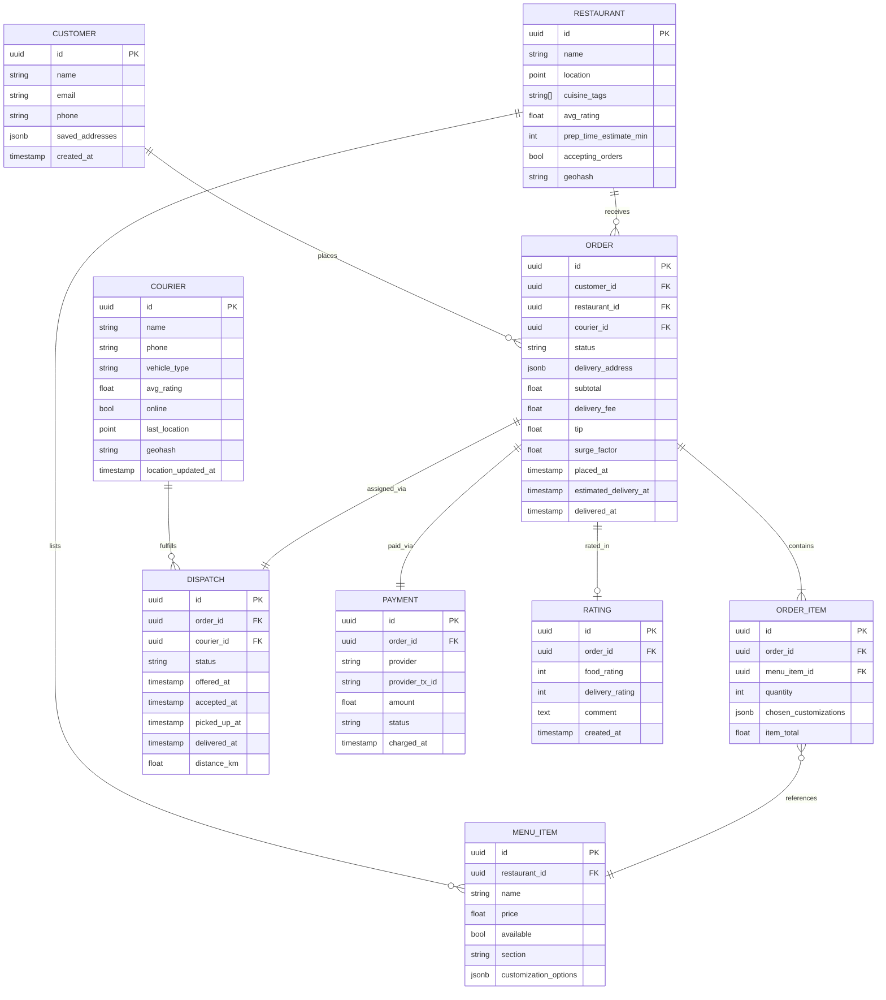
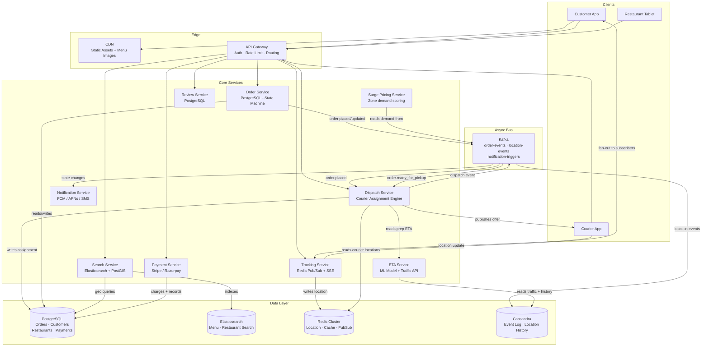
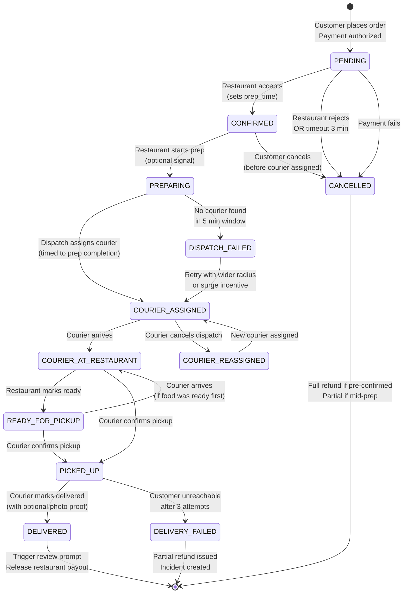

# Design Food Delivery (DoorDash / Swiggy)

> A three-sided marketplace that coordinates customers, restaurants, and couriers in real time — matching orders to drivers within seconds, predicting ETAs under uncertainty, and handling massive peak-hour surges without missing a beat.

**Difficulty:** ⭐⭐⭐⭐ · **Builds on:** [CAP Theorem](../../Level-04-Distributed-Systems/01-CAP-Theorem/README.md), [Message Queues](../../Level-03-Communication/04-Message-Queues/README.md), [Geospatial Indexing](../11-Uber-Ride-Sharing/README.md)

---

## 1. 🎯 Problem & Scope

Food delivery is harder than ride-sharing (see [Uber design](../11-Uber-Ride-Sharing/README.md)) for one key reason: **three parties must be coordinated simultaneously**, and each has its own unpredictable timeline.

- A **customer** places an order and wants a live ETA.
- A **restaurant** receives the order, prepares food (variable time), and signals "ready for pickup."
- A **courier** must be assigned, navigate to the restaurant, wait for food if early, then deliver to the customer.

Unlike Uber, the "product" (food) isn't ready instantly — the courier can't just pick up and go. The restaurant preparation time is the dominant uncertainty, and getting courier assignment timing wrong wastes driver time or lets food go cold.

**In scope:**
- Restaurant discovery, search, and menu browsing
- Cart management and order placement
- Order lifecycle: placement → restaurant acceptance → preparation → pickup → delivery
- Courier assignment and dispatch (including batching)
- Real-time order tracking for customers and couriers
- ETA prediction pipeline
- Payments (customer charge, restaurant payout, courier payout)
- Ratings and reviews
- Peak-hour surge pricing

**Out of scope:** Inventory management for restaurants, restaurant-facing POS systems, grocery delivery nuances, subscription (DashPass/Swiggy One) billing internals.

---

## 2. 📋 Requirements

### Functional

1. Customers can search restaurants by location, cuisine, rating, and delivery time.
2. Customers can browse menus, add items to cart, and place orders.
3. Restaurants receive new orders in real time and confirm or reject them.
4. The system assigns a courier to each order; courier is dispatched at the right moment (not too early, not too late).
5. Customers and couriers see live location tracking on a map.
6. Customers receive push notifications at every state transition (confirmed, preparing, courier assigned, picked up, delivered).
7. Customers can pay via card, wallet, UPI, or cash on delivery.
8. Ratings and reviews are submitted post-delivery.
9. Surge pricing applies during peak demand.

### Non-Functional

| Property | Target |
|---|---|
| Order placement latency | < 500 ms P99 |
| Courier assignment latency | < 5 seconds from restaurant acceptance |
| Location update freshness | ≤ 5 seconds |
| Search latency | < 200 ms P99 |
| Availability | 99.99% (< 53 min downtime/year) |
| Consistency | Order state machine: strong; location tracking: eventual |
| Peak throughput | 500K concurrent active orders (lunch/dinner rush) |
| ETA accuracy | ± 3 minutes for 80% of deliveries |

---

## 3. 🧮 Capacity Estimation

**Assumptions (DoorDash scale):**
- 40 million monthly active customers (MAU)
- Peak concurrent: ~2% active simultaneously → **800K concurrent users**
- Average 2 orders/customer/month → **80M orders/month**
- Peak orders: 10× average → **~30K orders/minute** at lunch/dinner peaks
- 1M active couriers globally, ~200K on shift during peak
- Average order: 35 min end-to-end, so each courier handles ~1.7 orders/hour
- 500K restaurants, average menu: 60 items

**Order Throughput:**
```
30,000 orders/min ÷ 60 = 500 orders/second (peak write rate)
```

**Location Updates (couriers):**
```
200,000 couriers × 1 update/5s = 40,000 location writes/second
```

**Search QPS:**
```
Each customer browses ~3 min before ordering.
800K concurrent users × (1 search / 30s) = 26,700 search QPS
```

**Storage:**

| Entity | Size/record | Records | Total |
|---|---|---|---|
| Orders | 2 KB | 80M/month × 12 = 960M | ~1.9 TB/year |
| Order items | 0.5 KB | 960M × 3 items avg | ~1.4 TB/year |
| Location events | 100 B | 40K writes/s × 86400 | ~345 GB/day (hot, TTL 24h) |
| Restaurant menus | 10 KB | 500K restaurants | 5 GB |
| Users | 1 KB | 40M | 40 GB |

**Bandwidth:**
```
Location updates: 40,000 writes/s × 100 B = 4 MB/s inbound
Push to customers tracking orders: 500K × 200 B = 100 MB/s outbound
```

> Key insight: location write throughput (40K/s) and fan-out to tracking subscribers are the dominant load patterns — not order writes.

---

## 4. 🔌 API Design

### Customer API

```
# Search restaurants
GET /v1/restaurants?lat=37.77&lon=-122.41&cuisine=indian&radius_km=5&page=1
→ { restaurants: [...], next_cursor: "..." }

# Get restaurant menu
GET /v1/restaurants/{restaurant_id}/menu
→ { sections: [{ name, items: [{ id, name, price, image_url, customizations }] }] }

# Place order
POST /v1/orders
Body: {
  restaurant_id, delivery_address, cart_items: [{item_id, qty, customizations}],
  payment_method_id, tip_amount
}
→ { order_id, estimated_delivery_at, total_amount }

# Track order (polling or subscribe to SSE)
GET /v1/orders/{order_id}/track
→ { status, courier_location: {lat, lon}, eta_minutes, steps_remaining }

# SSE stream for live tracking
GET /v1/orders/{order_id}/track/stream   (text/event-stream)
```

### Restaurant API

```
# List incoming orders
GET /v1/restaurant/orders?status=pending
→ { orders: [...] }

# Accept or reject order
PATCH /v1/restaurant/orders/{order_id}/status
Body: { action: "accept" | "reject", prep_time_minutes: 15, reason?: "..." }

# Mark order ready for pickup
PATCH /v1/restaurant/orders/{order_id}/status
Body: { action: "ready_for_pickup" }

# Update availability (busy mode / item 86'd)
PATCH /v1/restaurant/me
Body: { accepting_orders: false } | { item_id: "xyz", available: false }
```

### Courier API

```
# Go online / offline
PUT /v1/courier/availability
Body: { online: true, current_location: {lat, lon} }

# Report location (every 5s)
POST /v1/courier/location
Body: { lat, lon, heading, speed }

# Accept / reject dispatch offer
PATCH /v1/courier/dispatches/{dispatch_id}
Body: { action: "accept" | "reject" }

# Update delivery status
PATCH /v1/courier/orders/{order_id}/status
Body: { action: "arrived_at_restaurant" | "picked_up" | "arrived_at_customer" | "delivered" }
Body (delivered): { proof_of_delivery_photo_url? }
```

### Internal APIs (service-to-service)

```
POST /internal/dispatch/assign   — Dispatch service assigns courier to order
POST /internal/eta/predict       — ETA service returns predicted delivery time
POST /internal/surge/factor      — Returns surge multiplier for a zone at current time
```

---

## 5. 🗄️ Data Model



**Storage justification:**

| Store | What | Why |
|---|---|---|
| PostgreSQL | Orders, customers, restaurants, payments | ACID transactions; order state machine needs strong consistency |
| PostGIS / pgvector | Restaurant geospatial search | Radius queries on `point` columns with spatial indexes |
| Redis (Cluster) | Courier locations, active order state cache, rate limiting, session tokens | Sub-millisecond reads; location data has 24h TTL; pub/sub for tracking |
| Elasticsearch | Menu search, restaurant full-text + faceted search | Tokenized cuisine/dish search; relevance scoring |
| Cassandra | Order event log, location history | Append-heavy, time-series; high write throughput; wide rows by order_id |
| S3 | Menu item images, proof-of-delivery photos | Blob storage |
| Kafka | Order events, location events, notification triggers | Durable event bus; decouples services; replay on failure |

---

## 6. 🏗️ High-Level Architecture



**Walk-through of a complete order:**

1. **Customer searches** → API Gateway → Search Service queries Elasticsearch for restaurant name/cuisine and PostGIS for proximity. Results ranked by rating × distance × surge ETA.
2. **Customer places order** → Order Service creates the order record in PostgreSQL (status: `pending`), charges payment via Payment Service, publishes `order.placed` to Kafka.
3. **Restaurant notified** → Notification Service consumes `order.placed`, pushes to restaurant tablet via FCM. Restaurant confirms with estimated prep time (e.g., 15 min).
4. **Dispatch Service** listens for `order.accepted`. It queries Redis for nearby online couriers (geohash lookup), calls ETA Service to predict travel time from each courier to restaurant, and picks the best candidate — dispatching them so they arrive just as food is ready. Offer is pushed to the courier app.
5. **Courier accepts** → Dispatch Service records assignment, Order Service transitions status to `courier_assigned`, Kafka event triggers customer notification.
6. **Courier en route** → Courier App sends location updates every 5s → Tracking Service writes to Redis and fans out to the customer's SSE stream.
7. **Restaurant marks ready** → Order Service transitions to `ready_for_pickup`. If courier is already there, they pick up immediately. If courier is still in transit, food waits (this is where bad timing hurts quality).
8. **Courier picks up** → Status → `picked_up`. ETA Service recalculates final delivery ETA using real-time traffic.
9. **Courier delivers** → Status → `delivered`. Payment Service releases restaurant payout. Review Service prompts customer rating after 1 hour.

---

## 7. 🔬 Deep Dives

### 7.1 Three-Sided Marketplace Design

Food delivery is fundamentally different from a two-sided marketplace (buyer + seller) or ride-sharing (rider + driver). You have **three independent parties** whose actions are interdependent:

```
Customer decision time  →  Restaurant prep time  →  Courier travel time
   (1-10 minutes)            (8-30 minutes)           (5-20 minutes)
```

Each side has its own SLA, failure mode, and incentive:
- **Customers** abandon if ETA is too long; they're price-sensitive to delivery fees.
- **Restaurants** hate order cancellations (food wasted) and couriers who arrive 10 min late (food cold).
- **Couriers** hate long wait times at restaurants (dead time); they want to maximize orders per hour.

**Key design decisions that balance all three sides:**

1. **Delayed dispatch:** Don't assign a courier immediately when the order is placed. Assign at `T_pickup - courier_travel_time`. This minimizes restaurant wait time and courier idle time at the door.

2. **Prep time as a first-class input:** The restaurant's confirmed prep time drives the dispatch trigger. If a restaurant says "20 min," the Dispatch Service waits `20 - estimated_courier_travel` minutes before sending the offer.

3. **Surge pricing feeds back to all three:** Higher demand → higher delivery fee for customers → more couriers come online → shorter wait times → higher conversion. The Surge Pricing Service scores each geographic zone every 60 seconds using a sliding window of order demand vs. online courier count.

4. **Courier batching (stacked orders):** Assign a courier two orders from nearby restaurants when the math works out. This improves courier earnings per hour but adds risk of one order going cold. Batching is only applied when both restaurants are within 0.5 km and prep times align within 5 minutes.

### 7.2 Order Lifecycle State Machine

The order is the central entity and must transition through states atomically. PostgreSQL handles this with optimistic locking (version column + `WHERE version = ?` on every update).



**State transition rules:**
- Every transition publishes a Kafka event (`order.{new_state}`).
- Idempotency keys prevent double-processing if a service retries.
- Transitions are guarded: you can't go from `PENDING` directly to `PICKED_UP`.
- Cancellations after `PREPARING` trigger a penalty fee (food cost is sunk for the restaurant).

### 7.3 Courier Assignment & Dispatch Optimization

This is the hardest algorithmic problem in food delivery. Bad assignment decisions waste food or waste courier time.

**Step 1 — Find candidate couriers:**
- Couriers publish location to Redis every 5 seconds.
- Each location write also updates a geohash key: `couriers:geohash:{hash}` → sorted set by courier ID.
- At dispatch time, expand geohash radius outward (precision 6 → 5 → 4) until you have ≥ 5 online couriers without an active order or with a compatible stacked batch.

**Step 2 — Score each candidate:**
```
score(courier) = w1 × eta_to_restaurant
              + w2 × estimated_wait_at_restaurant
              + w3 × courier_acceptance_rate_penalty
              - w4 × batch_bonus (if batching opportunity exists)
```

- `eta_to_restaurant`: route ETA from courier's current location (from Maps/traffic API).
- `estimated_wait_at_restaurant`: `max(0, restaurant_ready_time - courier_arrival_time)`. Lower is better.
- `acceptance_rate_penalty`: couriers with low acceptance rates get ranked down (they waste dispatch slots).
- `batch_bonus`: if this courier can also pick up a nearby second order, lower their effective cost.

**Step 3 — Offer and timeout:**
- Send dispatch offer to top-ranked courier. They have **30 seconds** to accept.
- If rejected or timed out, move to the next candidate. After 3 rejections in a row, increase offered pay incentive.
- If no courier accepts within 5 minutes, trigger `DISPATCH_FAILED`, alert on-call, and optionally raise surge in that zone.

**Batching (stacked orders):**
Couriers can carry up to 2 orders simultaneously. Batching is evaluated when:
1. Restaurant A and Restaurant B are within 0.5 km of each other.
2. Both orders' customers are in compatible directions from the restaurants.
3. Order B's total ETA increase for its customer is < 8 minutes vs. single delivery.
DoorDash reports that ~30% of deliveries are batched during peak hours, which significantly improves courier utilization.

### 7.4 ETA Prediction Pipeline

ETA is the single metric customers care most about — and the hardest to get right.

**Two components: Restaurant ETA + Delivery ETA**

**Restaurant ready time prediction:**
- Input features: restaurant's historical prep time for this item category, current order queue depth at restaurant, time of day, day of week.
- Model: Gradient Boosted Trees trained on historical order data.
- Served via a feature store (Redis + offline model artifacts in S3).
- Refreshed online: when restaurant accepts with a manual prep time, that overrides the model for this specific order.

**Delivery (courier travel) ETA prediction:**
- Input features: real-time traffic (Google Maps API / HERE Maps), courier's vehicle type, distance, historical delivery time for this route corridor, weather.
- Model: XGBoost regression. Re-predicted every 2 minutes once courier is en route.
- Displayed to customer with ± confidence interval collapsed into a single "window" (e.g., "35-45 min").

**ETA update triggers:**
1. Order placed → initial estimate (restaurant prep + courier travel).
2. Restaurant confirms with manual prep time → refine.
3. Courier assigned → recalculate with actual courier starting point.
4. Courier picks up → recalculate delivery leg only with current traffic.
5. Every 2 minutes while courier is in transit → live refresh.

**Accuracy targets:**
- 80% of deliveries within ±3 minutes of final ETA displayed at pickup.
- Early is better than late (customers prefer food arriving 2 min early over 2 min late).

---

## 8. 📈 Scaling, Bottlenecks & Failure Modes

### Scaling Strategies

**Order Service (PostgreSQL bottleneck):**
- Orders are sharded by `order_id` (UUID, random distribution) across 16 PostgreSQL shards.
- Read replicas handle tracking reads (status checks) — they can tolerate slight lag.
- Connection pooling via PgBouncer in transaction mode — prevents connection exhaustion at peak.

**Location Tracking (Redis bottleneck):**
- Redis Cluster with 8 shards, each holding a geographic region's courier keys.
- Pub/sub channel per active order: `tracking:order:{order_id}`. The customer's SSE connection subscribes; the courier's location updates publish.
- Location history (for analytics, ETA model retraining) written async to Cassandra via Kafka.

**Search (Elasticsearch):**
- Restaurant index is small (500K docs) — fits in a single ES cluster.
- Hot cache in Redis for popular search queries (city-level top 50 restaurants by cuisine).
- Menu search indexed by restaurant but filtered at query time by `accepting_orders: true` and computed `estimated_delivery_time` bucket.

**Peak hour surge handling:**
- Pre-scale: predictive autoscaling based on historical demand curves (Tuesdays 7pm is always busy).
- Circuit breakers on third-party APIs (Maps, payment gateway) with fallbacks (cached ETA, retry queue).
- Shed non-critical work: review prompts, analytics events, and recommendation refreshes are dequeued after peak.

### Failure Modes

| Failure | Impact | Mitigation |
|---|---|---|
| Payment gateway down | Orders can't be placed | Retry with exponential backoff; show user error immediately if 3 retries fail; never double-charge (idempotency key) |
| Courier location Redis shard down | Tracking frozen; dispatch blind | Redis Cluster auto-failover (< 30s); Dispatch Service falls back to last-known location with stale marker |
| Restaurant tablet offline | Order stuck in PENDING | Timeout after 3 min → auto-cancel + notify customer; alert restaurant support team |
| Kafka lag spike | Notifications delayed; dispatch slow | Increase consumer group parallelism; priority lane for `dispatch` topic separate from `analytics` |
| Courier no-shows after acceptance | Customer waits; food gets cold | Courier SLA monitoring: if courier doesn't reach restaurant in 2× ETA, trigger automatic reassignment; compensate customer |
| ETA model stale | Wrong predictions | Shadow-deploy new model alongside; A/B test ETA accuracy; fallback to simple distance ÷ speed heuristic if model serving fails |

---

## 9. ⚖️ Trade-offs & Alternatives

### Push vs. Pull for Order Notifications (Restaurant)

- **Chosen:** Kafka → FCM push to restaurant tablet.
- **Alternative:** Restaurant tablet polls `/orders?status=pending` every 10s.
- **Why push wins:** Polling adds 10s average lag on order receipt. During a 5-restaurant cluster, 5 pollers × 10s = restaurant may miss a time-sensitive window. Push is near-instant, but you need to handle FCM delivery failures (tablet offline, network drop) with a fallback: restaurant can always pull on reconnect.

### Eventual vs. Strong Consistency for Order State

- **Chosen:** Strong consistency (PostgreSQL, single shard per order) for all state transitions.
- **Alternative:** Eventual consistency via event sourcing (Cassandra event log as source of truth).
- **Why strong wins here:** The order state machine has too many guard conditions to be safe with eventual reads. "Has a courier been assigned yet?" must be answered correctly to avoid double-dispatch. Unlike location tracking (where eventual is fine), order state errors have real money/food consequences.

### Dedicated Dispatch Service vs. Embedded in Order Service

- **Chosen:** Separate Dispatch Service.
- **Alternative:** Dispatch logic inside Order Service.
- **Why separate wins:** Dispatch is algorithmically complex (optimization, geospatial queries, ML ETA calls) and needs to scale independently of order writes. During a courier shortage incident, you want to be able to hotfix and redeploy dispatch logic without touching the order write path.

### Monolith vs. Microservices

At startup scale (< 10K orders/day), a monolith (Rails / Django) is fine. The microservice split is justified at scale because:
- **Search** needs Elasticsearch, which is read-heavy and stateless — scales independently.
- **Dispatch** is CPU-heavy (optimization) and needs different SLAs from payment.
- **Tracking** is I/O bound (Redis pub/sub fan-out) — scales differently from order writes.

Compare to [Airbnb Booking](../13-Airbnb-Booking/README.md), which has far lower write throughput and can afford a simpler split.

---

## 10. 🌐 How It's Actually Done

### DoorDash Engineering

- **Dispatch engine** uses a custom optimization model they call "Dispatch Brain" — a global assignment optimizer that considers all unassigned orders and available Dashers simultaneously (not just greedy nearest-first). Published as "Optimizing the DoorDash Marketplace" (2020).
- **Batching:** DoorDash introduced "Double Dash" — offering two deliveries to a single Dasher when routes are compatible. Evaluated continuously by their dispatch optimizer.
- **ETA prediction:** Uses XGBoost models with 100+ features, retrained daily. They found that restaurant-specific prep time features (not generic category averages) cut prediction error by 30%.
- **Real-time data platform:** Kafka + Apache Flink for stream processing. Flink jobs compute per-zone demand/supply ratio in 60-second windows, feeding the surge pricing system.
- DoorDash Engineering Blog: https://doordash.engineering/

### Swiggy Engineering

- **Hyperlocal search:** Swiggy introduced a custom ranking model that combines restaurant rating, distance, price range, and cuisine affinity (from user history) into a single score. A/B tested against pure proximity ranking — 18% lift in order conversion.
- **Courier assignment:** Uses a variant of the Hungarian Algorithm (linear assignment problem) when demand spikes — globally optimal assignment across all open orders and available delivery partners in a city, solved every 30 seconds.
- **ETA for Indian traffic conditions:** Standard map APIs significantly underestimate ETA in dense urban areas. Swiggy trains correction models on historical delivery data per city corridor. Traffic data is augmented with their own historical delivery-path time series.
- Swiggy Engineering Blog: https://bytes.swiggy.com/

### Relevant Papers & References

- "Real-Time Dispatch and Routing for Same-Day Delivery" — MIT Operations Research (2019).
- "ETA Prediction with Graph Neural Networks in Google Maps" — Google (2021) — similar multi-factor ETA approach.
- "Optimal Delivery Route Assignments at Uber Eats" — Uber Engineering (2018).
- Apache Kafka documentation on pub/sub patterns: https://kafka.apache.org/documentation/
- PostGIS geospatial indexing: https://postgis.net/documentation/

---

## 11. 📝 Summary

Here is what you should be able to walk through in a senior system design interview:

**The core insight** is that food delivery is a three-sided marketplace where **timing is everything**. Unlike Uber (see [Uber design](../11-Uber-Ride-Sharing/README.md)) where the "product" (the ride) begins at pickup, in food delivery the product (the food) is being created asynchronously by the restaurant. The entire system is designed to synchronize these three independent timelines.

**Key decisions to defend:**
1. **Delayed dispatch** — assign couriers timed to restaurant completion, not to order placement. This is the single biggest quality and efficiency lever.
2. **Strong consistency for orders** — PostgreSQL with version-locked state transitions. Eventual consistency here causes double-dispatch, double-charges, and chaos.
3. **Redis pub/sub for real-time tracking** — separate from the order state store. Location is high-volume, low-durability, eventual-is-fine data. Don't put it in your OLTP database.
4. **ETA as a two-stage model** — restaurant prep ETA (ML on historical kitchen data) + delivery ETA (traffic-aware routing). Combining them into one prediction loses the ability to update each independently as the order progresses.
5. **Kafka as the event bus** — decouples notification, dispatch, analytics, and payout systems. A state transition in Order Service shouldn't need to synchronously call six downstream services.

**Numbers to remember:**
- 500 orders/second at peak
- 40K courier location writes/second
- < 5 seconds for courier assignment
- ± 3 minute ETA accuracy target
- 30% of deliveries batched (stacked) during peak

**Next:** [Airbnb Booking System](../13-Airbnb-Booking/README.md) — another marketplace problem, but with much lower write throughput, longer booking windows, and a very different consistency model (preventing double-booking of the same property).
