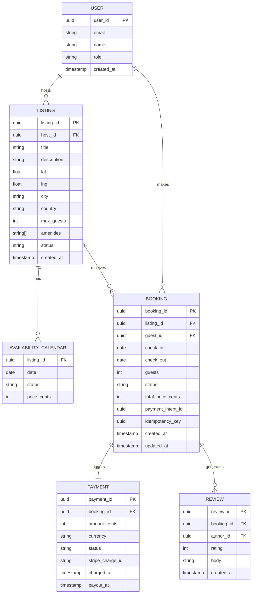
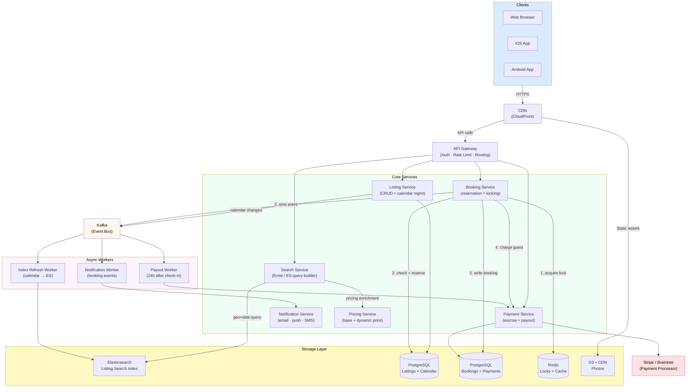
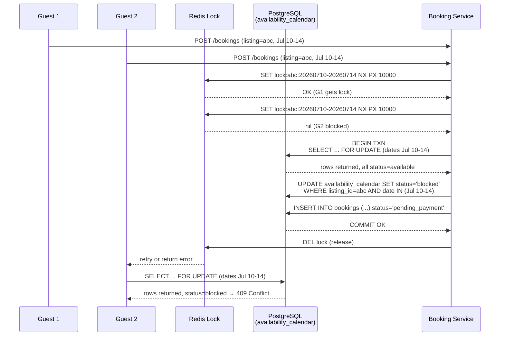

# Design Airbnb Booking

> A platform where guests search listings by location, dates, and filters, then book and pay for short-term stays — all without double-bookings, stale availability, or payment failures.

**Difficulty:** ⭐⭐⭐⭐ · **Builds on:** [Transactions & Consistency](../../Level-04-Distributed-Systems/README.md), [SQL vs NoSQL](../../Level-02-Data-Layer/README.md), [CAP Theorem](../../Level-04-Distributed-Systems/01-CAP-Theorem/README.md)

---

## 1. 🎯 Problem & Scope

Airbnb is a two-sided marketplace: **hosts** list properties, **guests** discover and book them. The hardest engineering problems are not the CRUD around listings — they are:

1. **Search** — find relevant listings by geo-proximity, available date ranges, guest count, amenities, and price, ranked by relevance and conversion probability, at low latency.
2. **Double-booking prevention** — two guests must never successfully book the same listing for overlapping dates. This is a classic concurrency problem under high write contention.
3. **Availability calendar** — hosts set nightly availability and pricing; the system must reflect this in real time and block dates atomically on booking.
4. **Payment escrow & payout** — collect money from guests at booking, hold it in escrow, then release to hosts after check-in, with idempotency so retries never double-charge.

**Out of scope:** messaging, reviews display, host onboarding, photo storage, fraud scoring, dynamic pricing ML model training (but we'll mention the read path).

---

## 2. 📋 Requirements

### Functional

- Guests can **search** listings by location (city, map bounds), check-in / check-out dates, guest count, price range, and amenities.
- Guests can **view** a listing detail page with photos, description, availability calendar, and nightly price.
- Guests can **create a booking** (instant-book or request-to-approve), which reserves the dates and initiates payment.
- Hosts can **manage availability** — block or open dates, set per-night prices, set minimum/maximum stay.
- Guests and hosts can **cancel** bookings per the cancellation policy; refunds are handled accordingly.
- The system sends **email/push notifications** on booking confirmation, cancellation, check-in reminders.
- Hosts receive a **payout** 24 hours after guest check-in.

### Non-Functional

| Attribute | Target |
|---|---|
| Search latency (p99) | < 200 ms |
| Booking creation latency (p99) | < 1 s |
| Availability freshness | Near-real-time (< 5 s after update) |
| Double-booking probability | Zero — strong consistency required |
| Uptime (booking + payment) | 99.99% |
| Read/write ratio (search) | ~1000:1 |
| Peak load | 500k concurrent searches, 10k bookings/min |

---

## 3. 🧮 Capacity Estimation

**Users and listings**

- 150M registered users, 7M active listings globally.
- Average listing has 365 availability dates × ~30 price points = modest data per listing.

**Search traffic**

- Assume 100M search queries/day → ~1,150 QPS average, ~10,000 QPS peak (10× multiplier for prime seasons).
- Each search result page returns 20 listings with thumbnails. Search payload: ~50 KB JSON per response.
- Peak search bandwidth: 10,000 × 50 KB = **500 MB/s outbound from search tier**.

**Bookings**

- 1M bookings/day → ~11.5 bookings/second average, ~100 bookings/second peak.
- Each booking involves: 1 DB write (reservation row), 1 availability update (mark N dates blocked), 1 payment API call.

**Storage**

- Listings table: 7M rows × 5 KB avg = **35 GB** (fits in memory on a few replicas).
- Availability/calendar: 7M listings × 365 days × 8 bytes (date + price + status) = **~20 GB** per year of calendar data.
- Bookings: 1M/day × 365 days × 2 KB = **~730 GB/year** — manageable on partitioned Postgres.
- Search index (Elasticsearch): listings + geo + amenity fields ≈ **2 KB/listing × 7M = 14 GB** index (easily replicated 3×).

**Availability writes**

- Hosts update calendar: ~10M calendar changes/day → ~115 writes/second — low, but must propagate to search index within seconds.

---

## 4. 🔌 API Design

All endpoints are REST/JSON over HTTPS, authenticated via JWT (guests/hosts) or service tokens (internal).

### Search Listings

```
GET /v2/listings/search
  ?location=lat,lng          # or ?bounds=ne_lat,ne_lng,sw_lat,sw_lng
  &check_in=2026-07-01
  &check_out=2026-07-07
  &guests=2
  &min_price=50
  &max_price=300
  &amenities=wifi,pool
  &sort=relevance            # relevance | price_asc | price_desc
  &page_token=<cursor>
  &limit=20

Response 200:
{
  "listings": [
    {
      "listing_id": "abc123",
      "title": "Cozy Studio in Paris",
      "location": { "lat": 48.8566, "lng": 2.3522 },
      "price_per_night": 95,
      "total_price": 570,       # includes fees
      "thumbnail_url": "...",
      "rating": 4.87,
      "review_count": 312,
      "available": true
    }
  ],
  "next_page_token": "..."
}
```

### Get Availability Calendar

```
GET /v2/listings/{listing_id}/availability
  ?start=2026-07-01
  &end=2026-07-31

Response 200:
{
  "listing_id": "abc123",
  "calendar": [
    { "date": "2026-07-01", "status": "available", "price": 95 },
    { "date": "2026-07-02", "status": "blocked",   "price": null },
    ...
  ]
}
```

### Create Booking (Instant Book)

```
POST /v2/bookings
{
  "listing_id": "abc123",
  "check_in":   "2026-07-10",
  "check_out":  "2026-07-14",
  "guests":     2,
  "payment_method_id": "pm_xyz",
  "idempotency_key": "<uuid-v4>"    # client-generated, prevents duplicate charges
}

Response 201:
{
  "booking_id":   "bk_9f8e7d",
  "status":       "confirmed",
  "total_charged": 38000,           # cents
  "check_in":     "2026-07-10",
  "check_out":    "2026-07-14",
  "confirmation_code": "HMX3BQ"
}

Response 409 Conflict:
{ "error": "DATES_UNAVAILABLE", "message": "One or more dates are no longer available." }
```

### Cancel Booking

```
DELETE /v2/bookings/{booking_id}
  ?initiated_by=guest          # or host

Response 200:
{ "booking_id": "bk_9f8e7d", "status": "cancelled", "refund_amount": 19000 }
```

---

## 5. 🗄️ Data Model



**Storage justification**

| Store | What lives there | Why |
|---|---|---|
| **PostgreSQL** (sharded) | `bookings`, `payments`, `users` | ACID transactions are mandatory for booking + payment atomicity; row-level locking for double-booking prevention |
| **PostgreSQL** (separate cluster) | `listings`, `availability_calendar` | Relational integrity with host; `availability_calendar` uses composite PK `(listing_id, date)` — perfect for point lookups and range scans |
| **Elasticsearch** | Listing search index (geo, text, amenities, price, availability bitmap) | Geo-distance queries, full-text search, aggregations, and availability-filtered date range queries at <100 ms |
| **Redis** | Pessimistic lock tokens (booking reservation), session cache, rate limiting | Sub-millisecond distributed locking via `SET NX PX`; listing metadata cache for detail pages |
| **S3 + CDN** | Listing photos, user avatars | Blob storage with global CDN for low-latency photo delivery |
| **Kafka** | Booking events, calendar change events, payment events | Decouples booking flow from search index refresh, notification fan-out, analytics |

---

## 6. 🏗️ High-Level Architecture



**Numbered walk-through**

1. **Guest searches** — request hits the CDN (static assets cached), then API Gateway which routes to **Search Service**. Search Service builds an Elasticsearch query combining `geo_distance`, `range` on price, `terms` on amenities, and a custom availability filter. Results are enriched with dynamic pricing from **Pricing Service** and returned in < 200 ms.

2. **Guest views listing** — detail page fetched from **Listing Service** (cached in Redis for hot listings). Availability calendar loaded from **PostgreSQL** `availability_calendar` table.

3. **Guest creates booking** (the critical path):
   - Client sends `POST /v2/bookings` with an **idempotency key**.
   - **Booking Service** acquires a **distributed lock** in Redis on `(listing_id, date_range)`.
   - Inside the lock, it opens a DB transaction on **PostgreSQL Listings**: reads `availability_calendar` rows for the requested dates — if any row is `blocked` → return 409.
   - If all dates are `available`, updates those rows to `blocked` (reservation row pattern).
   - Writes the `booking` row to **PostgreSQL Bookings** with status `pending_payment`.
   - Calls **Payment Service** (idempotency key forwarded to Stripe).
   - On payment success, updates booking status to `confirmed` and commits.
   - Releases the Redis lock.
   - Emits a `booking.confirmed` event to **Kafka**.

4. **Async fan-out** — Kafka consumers:
   - **Index Refresh Worker** updates Elasticsearch availability bitmap so the listing disappears from searches for those dates.
   - **Notification Worker** sends confirmation emails/push to guest and host.
   - **Payout Worker** schedules a delayed job for 24 h after check-in to release escrow to the host.

---

## 7. 🔬 Deep Dives

### 7.1 Geo + Date Availability Search with Elasticsearch

The search query is the most complex read in the system. You need to combine **three orthogonal filter dimensions** simultaneously:

- **Geo**: find listings within a map bounding box or within X km of a point.
- **Dates**: only show listings available for *all* nights in the requested range.
- **Filters**: price, guests, amenities, listing type.

**Availability in the search index**

You cannot query the `availability_calendar` Postgres table at search time (7M listings × 365 days = too slow). Instead, each listing document in Elasticsearch carries a compact representation of its availability:

```json
{
  "listing_id": "abc123",
  "geo": { "lat": 48.8566, "lon": 2.3522 },
  "price_min":  60,
  "price_max": 150,
  "amenities": ["wifi", "pool", "kitchen"],
  "max_guests": 4,
  "blocked_dates": ["2026-07-02", "2026-07-03", "2026-07-10"]
}
```

The ES query uses a `bool` filter:

```json
{
  "bool": {
    "filter": [
      { "geo_bounding_box": { "geo": { "top_left": [...], "bottom_right": [...] } } },
      { "range": { "price_min": { "lte": 300 } } },
      { "terms": { "amenities": ["wifi"] } },
      {
        "bool": {
          "must_not": {
            "terms": {
              "blocked_dates": ["2026-07-10", "2026-07-11", "2026-07-12", "2026-07-13"]
            }
          }
        }
      }
    ]
  }
}
```

This `must_not terms` filter eliminates listings where *any* requested night is blocked. It runs in memory on the inverted index — extremely fast.

**Keeping the index fresh**: whenever a booking is confirmed or a host blocks/unblocks dates, a Kafka event is consumed by the **Index Refresh Worker** which does a partial update (`update_by_query` or document `update`) to the ES document. Target: index lag < 5 seconds.

**Ranking**: after filtering, results are scored by a combination of host acceptance rate, review score, photo quality score, and a geo-decay function (closer listings ranked higher, all else equal). This is a `function_score` query in ES.

---

### 7.2 The Double-Booking Problem: Concurrency Control

This is the exam-critical section. Two guests simultaneously viewing an available listing and hitting "Book Now" must result in exactly one successful booking — not two.

#### Option A: Pessimistic Locking (chosen for instant-book)



**How it works**:
1. Redis distributed lock (`SET NX PX`) ensures only one booking request for a given listing+date-range enters the critical section at a time. TTL (10 s) auto-releases the lock if the service crashes.
2. Inside the lock, a PostgreSQL transaction selects the `availability_calendar` rows `FOR UPDATE` — this is a row-level DB lock as a second guard.
3. If all dates are `available`, they are set to `blocked` and the booking row is inserted atomically.
4. The transaction commits, the Redis lock is released.
5. The second guest's request either waits and retries (polling Redis), or immediately gets a 409.

**Why Redis + Postgres double-locking?** Redis is fast but "best effort" — a Redis crash between the lock acquisition and the DB write could leave a stale lock. The `SELECT FOR UPDATE` in Postgres is the authoritative guard; Redis just reduces DB contention by serialising most requests before they even reach Postgres.

#### Option B: Optimistic Locking (used for host-only calendar updates)

When a host updates their availability (no concurrent guest competition), use a `version` column on each `availability_calendar` row. The update increments `version` and fails with `0 rows updated` if another writer changed it first — the caller retries. This avoids lock overhead for low-contention writes.

#### The Reservation Row Pattern

An intermediate state `reserved` (held for 10 minutes while a guest fills out payment details) exists between `available` and `blocked`:

| State | Meaning |
|---|---|
| `available` | Open for booking |
| `reserved` | Held for an in-progress booking session (TTL: 10 min) |
| `blocked` | Booked or host-blocked |

A background job (or Redis TTL + expiry callback) sweeps expired `reserved` rows back to `available`. This prevents abandoned checkout sessions from permanently blocking dates.

---

### 7.3 Availability Calendar Design

The `availability_calendar` table uses the composite primary key `(listing_id, date)`. This gives:

- O(1) point lookup for a single date.
- O(N) range scan for `WHERE listing_id = X AND date BETWEEN A AND B` using the index efficiently (dates are stored in order).
- Atomic multi-row updates inside a single transaction.

**Host calendar update flow**:
1. Host saves availability changes via `PATCH /v2/listings/{id}/availability`.
2. **Listing Service** runs a DB transaction: deletes existing rows for the modified date range, inserts new rows with the new status and price.
3. Emits a `calendar.updated` Kafka event.
4. **Index Refresh Worker** reads the event and issues a partial update to Elasticsearch to refresh `blocked_dates`.

**Pricing per night**: each row stores `price_cents`. Hosts can set seasonal pricing, weekend pricing, or last-minute discounts. The **Pricing Service** can override this with a dynamic ML price suggestion (read path only — hosts accept or reject).

---

### 7.4 Payment Escrow, Payout & Idempotency

**Booking payment flow**:

```
Guest card → Stripe PaymentIntent (authorized, not captured)
         ↓ booking confirmed
Stripe captures charge → funds held in Airbnb escrow account
         ↓ guest checks in (+ 24 h)
Payout Worker → Stripe Transfer → Host bank account
```

**Why escrow?** Airbnb holds funds so it can mediate disputes and enforce cancellation refunds without depending on the host to return money they may have already spent.

**Idempotency**: the client generates a UUID `idempotency_key` per booking attempt. The Booking Service:
1. Checks `bookings` table for an existing row with this key → if found, return the stored result (no duplicate processing).
2. Forwards the same key to Stripe (`Idempotency-Key` HTTP header) → Stripe deduplicates the charge on their side.
3. Inserts the booking row with `idempotency_key` as a unique index column.

This means a client can safely retry `POST /v2/bookings` on network timeout without double-charging the guest.

**Payout Worker** (Kafka consumer + scheduler):
- Consumes `booking.confirmed` events.
- Inserts a delayed task: "execute payout at `check_in + 24h`".
- At execution time, calls `PaymentSvc.payout(booking_id)` which issues a Stripe Transfer.
- Idempotent: payout records stored with unique `(booking_id, payout_type)` — retry-safe.

**Cancellation refunds** follow the listing's cancellation policy (flexible / moderate / strict). The refund percentage is computed at cancel time and a Stripe Refund is issued immediately; the payout job is cancelled if it hasn't fired yet.

---

## 8. 📈 Scaling, Bottlenecks & Failure Modes

### Scaling

| Component | Strategy |
|---|---|
| Search (ES) | Horizontal sharding (7M docs → trivial for ES); geo-aware shard routing; replica reads |
| Listing Service | Stateless; scale horizontally; Redis caches hot listing metadata (TTL 60 s) |
| Booking Service | Stateless; horizontal scale; all state in Redis + Postgres |
| PostgreSQL (bookings) | Range-shard by `listing_id`; read replicas for booking history queries |
| PostgreSQL (calendar) | Range-shard by `listing_id`; hot listings (Eiffel Tower Airbnb) get dedicated shard |
| Payment Service | Stateless proxy to Stripe; Stripe handles scale on their end |
| Kafka | Partition by `listing_id` → ordered per-listing event processing in workers |

### Bottlenecks

- **Hot listings**: a famous listing with millions of concurrent viewers on a holiday weekend hammers its calendar shard. Mitigate with Redis caching of the calendar read (detail page), and the Redis lock (booking writes are serialised anyway).
- **Elasticsearch index lag**: calendar changes take up to 5 seconds to propagate. A guest could see a listing as available in search, click in, and only discover it's gone at booking time → 409 response. This is acceptable (eventual consistency for search, strong consistency at booking).
- **Payment gateway timeouts**: Stripe can be slow or error. Booking Service uses idempotency keys + async retry: mark booking `pending_payment`, retry in background, update status to `confirmed` or `payment_failed`.

### Failure Modes

| Failure | Effect | Mitigation |
|---|---|---|
| Redis lock node crashes mid-booking | Stale lock held for TTL (10 s); then auto-released; Postgres `FOR UPDATE` is the final guard | Redis Sentinel / Cluster; short TTL |
| Kafka consumer lag | ES index stale → stale search results | Monitor consumer lag; scale consumers; alert at >30 s lag |
| Stripe outage | New bookings fail payment | Queue payment retries; surface friendly error; avoid overbooking by holding `reserved` state |
| Calendar DB shard failure | Reads and writes for affected listings fail | Multi-AZ Postgres with automatic failover (RDS Multi-AZ); bookings for affected listings return 503 |
| Double-booking despite locking | Theoretical: two processes both read `available`, both write before commit | `SELECT FOR UPDATE` inside a serializable or repeatable-read transaction prevents this; unique constraint on `(listing_id, date, status='blocked')` as safety net |

---

## 9. ⚖️ Trade-offs & Alternatives

### Pessimistic vs. Optimistic Locking for Bookings

You chose pessimistic (Redis lock + `SELECT FOR UPDATE`) because booking contention for popular listings on peak dates is *high* — the Eiffel Tower Airbnb on New Year's Eve gets hundreds of simultaneous booking attempts. Optimistic locking with version numbers would cause high retry rates and bad UX. For low-contention writes (host calendar edits), optimistic locking is fine.

### Elasticsearch vs. PostgreSQL for Search

A pure Postgres geo-search with `PostGIS` and an availability join would work at small scale but degrades badly at 7M listings and 10k QPS peak — you'd need the entire filtered result set to come from a single index scan. Elasticsearch's inverted index handles multi-dimensional filtering (geo + dates + amenities) in parallel, making it the right tool.

### Synchronous vs. Asynchronous Booking Confirmation

Some booking systems confirm asynchronously (accept the request, process in background, notify later). Airbnb instant-book should be **synchronous** — guests expect immediate confirmation or rejection. Asynchronous is appropriate only for "request to book" listings where the host must manually approve within 24 h.

### Per-night row vs. Bitmask for Availability Calendar

Storing one row per `(listing_id, date)` is simple, correct, and queryable. An alternative is a bitmask (one row per listing per month, 31-bit integer for date availability). Bitmasks are more compact and faster to read but harder to update atomically for individual dates and harder to store per-night prices. Stick with one row per date.

### Monolith vs. Microservices

At Airbnb's scale, the services described (Search, Listing, Booking, Payment) are separate deployable units. At early-stage startup scale, a well-structured monolith with the same logical separation is cheaper to operate and just as correct. Split when operational independence becomes worth the complexity.

---

## 10. 🌐 How It's Actually Done

Airbnb has published extensively on their engineering blog:

- **Ernie** — Airbnb's search ranking system, built on Elasticsearch with custom ML re-ranking. They use a `function_score` query to blend textual relevance, geo-proximity, and a neural network score computed offline and stored as a field. Blog: *"Scaling Airbnb's Experimentation Platform"* (2021).
- **Chronos** — Airbnb's internal task scheduling system (similar to Quartz but distributed), used to schedule payout jobs with retry semantics. Blog: *"Chronos: A Fault-Tolerant Distributed Job Scheduler"* (2013).
- **Payment System** — Airbnb processes payments in 190+ countries with multiple currency conversion, VAT, and regulatory complexity. They built an internal payment orchestration layer on top of Stripe/Braintree/Adyen that handles idempotency, retries, and reconciliation. Blog: *"Building Airbnb's Payment System"* (2019).
- **Availability Calendar** — They store availability as event-sourced records: a `calendar_event` log (blocked, unblocked, booked) from which the current state is derived. This gives a full audit trail and makes cancellations straightforward (add an "unblocked" event).
- **Dynamic Pricing (Aerosolve)** — Airbnb open-sourced their ML pricing model. Hosts see a suggested nightly price based on demand signals; the search service reads the accepted price from the calendar row.

---

## 11. 📝 Summary

| Concern | Solution |
|---|---|
| Geo + date search at scale | Elasticsearch with `geo_bounding_box`, `terms` filter on `blocked_dates`, `function_score` ranking |
| Double-booking | Redis distributed lock + PostgreSQL `SELECT FOR UPDATE` + `reserved` state with TTL |
| Availability freshness | Kafka event → Index Refresh Worker → ES partial update (< 5 s lag) |
| Payment safety | Idempotency keys (client UUID → Stripe header); escrow hold; async payout worker |
| Scalability | Sharded Postgres per domain; horizontal stateless services; ES horizontal shard |
| Failure resilience | Multi-AZ DB, Kafka retry, Redis Sentinel, Stripe idempotency |

The single most important thing to nail in an interview: **the booking critical path** — Redis lock → `SELECT FOR UPDATE` → update calendar → insert booking → charge payment → commit → release lock. Draw this sequence on the whiteboard. Get the order right. Know *why* you need both the Redis lock and the DB lock, and what happens if either fails.

---

**See also**

- Previous: [Food Delivery (DoorDash/Uber Eats)](../12-Food-Delivery/README.md) — another geo-search + real-time dispatch system with similar availability and double-assignment problems.
- Next: [Google Drive / Dropbox](../14-Google-Drive-Dropbox/README.md) — distributed file storage, chunking, deduplication, and sync protocols.
