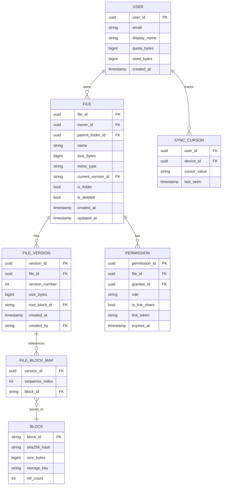
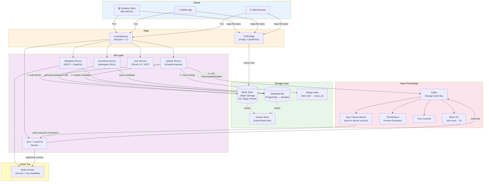
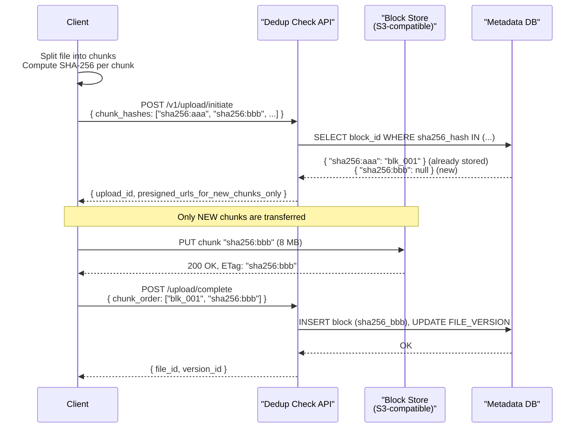
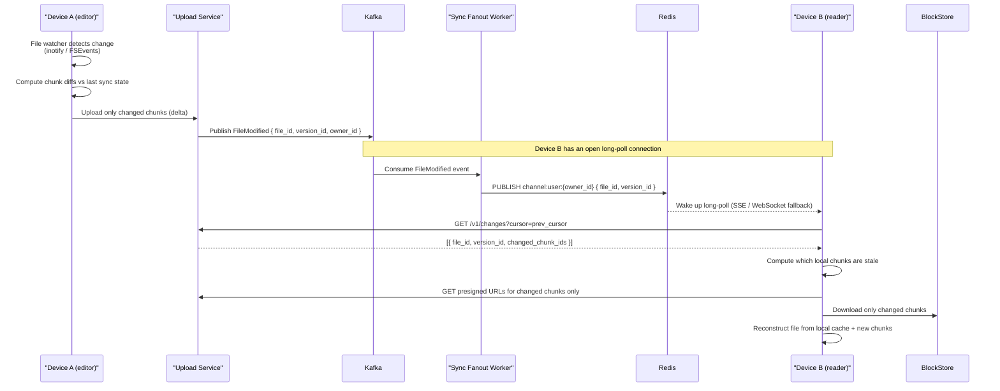

# Design Google Drive / Dropbox

> A distributed file storage and synchronization service that lets users store, sync, and share files across devices and collaborators — reliably at petabyte scale.

**Difficulty:** ⭐⭐⭐⭐ · **Builds on:** [Object Storage](../../Level-02-Data-Layer/README.md), [CDN](../../Level-06-Scale-and-Reliability/README.md), [Consistent Hashing](../../Level-02-Data-Layer/08-Consistent-Hashing/README.md)

---

## 1. 🎯 Problem & Scope

You are designing a cloud file storage and sync service — think Google Drive or Dropbox. Users can upload any file from any device, and that file should appear on all their other devices within seconds. They can also share files with others, collaboratively edit documents, and never lose data even if a device is lost or destroyed.

**In scope:**
- File upload, download, delete, rename, move
- Multi-device sync (desktop, mobile, web)
- File sharing with granular permissions (view / comment / edit)
- Version history and file restore
- Conflict detection and resolution
- Deduplication (don't store the same bytes twice)

**Out of scope:**
- Real-time collaborative editing (Google Docs mode — that's a separate CRDT/OT problem)
- Video streaming with adaptive bitrate
- Full-text search inside documents

---

## 2. 📋 Requirements

### Functional

1. **Upload** files of any size (up to ~5 TB per file) from web, desktop, or mobile clients.
2. **Download** files on any authenticated device.
3. **Sync** — changes made on one device propagate to all other connected devices automatically.
4. **Share** — generate a shareable link or invite a specific user with view/edit permissions.
5. **Version history** — retain the last N versions of every file; restore any previous version.
6. **Conflict resolution** — when two devices modify the same file offline, surface a conflict copy rather than silently overwriting.
7. **Folder organization** — nested directories, move/rename without re-uploading content.

### Non-Functional

| Requirement | Target |
|---|---|
| Availability | 99.99% (< 53 min downtime/year) |
| Durability | 99.999999999% (11 nines) — no data loss |
| Upload latency | First byte acknowledged < 200 ms; large file via chunked background upload |
| Sync latency | Change visible on other devices within 5 seconds (P95) |
| Consistency | Eventual consistency for sync; strong consistency for metadata (who owns what) |
| Scale | 1 billion users; 2 billion files uploaded per day |
| Security | Encryption at rest (AES-256) and in transit (TLS 1.3); per-file access control |

---

## 3. 🧮 Capacity Estimation

### Users & Files

- **1 billion** registered users; **200 million** daily active users (DAU)
- Average storage per user: **15 GB** (free tier)
- **Total storage:** 1B × 15 GB = **15 exabytes (EB)**

### Daily Upload Traffic

- Each DAU uploads ~2 files/day, average size 5 MB
- **Daily uploads:** 200M × 2 × 5 MB = **2,000 TB/day** ≈ **23 GB/s** raw ingress

With **block-level dedup** across all users (identical chunks are stored once):
- Dedup ratio conservatively ~2×, so actual new bytes written ≈ **11.5 GB/s**

### Metadata

- Each file record: ~500 bytes (name, path, owner, size, checksum, timestamps, version pointer)
- 2B new files/day → **1 TB/day** of new metadata rows
- Total metadata at 10 years: ~3.6 PB — fits comfortably in a sharded relational DB

### Bandwidth

- Downloads assume 3× read:write ratio → **34.5 GB/s** egress
- CDN offloads ~80% of downloads → **origin egress: ~7 GB/s**

### Block Store Sizing

- Chunk size: **4–8 MB** (we'll use 8 MB for large files, 1 MB for small files)
- A 100 GB file splits into ~12,500 chunks
- SHA-256 fingerprint per chunk: 32 bytes → negligible overhead

---

## 4. 🔌 API Design

All endpoints require `Authorization: Bearer <token>` (OAuth 2.0).

### Upload a Chunk (resumable, content-addressable)

```
POST /v1/upload/initiate
Body: { "file_name": "report.pdf", "total_size": 524288000, "chunk_count": 64, "checksum": "sha256:abc..." }
Response: { "upload_id": "ulid_xxx", "chunk_urls": ["https://upload.drive.example.com/chunk/ulid_xxx/0", ...] }
```

```
PUT /v1/upload/{upload_id}/chunk/{index}
Body: <raw bytes, 8 MB>
Headers: Content-SHA256: <hex>
Response: 200 OK  |  409 Conflict (checksum mismatch)
```

```
POST /v1/upload/{upload_id}/complete
Body: { "part_checksums": ["sha256:...", ...] }
Response: { "file_id": "fid_yyy", "version_id": "vid_001" }
```

### Download

```
GET /v1/files/{file_id}/content?version_id=vid_001
Response: 302 redirect to CDN-signed URL (expires in 15 min)
```

### Share

```
POST /v1/files/{file_id}/permissions
Body: { "type": "user", "email": "bob@example.com", "role": "viewer" }
Response: { "permission_id": "perm_zzz" }
```

```
POST /v1/files/{file_id}/share-link
Body: { "role": "viewer", "expires_at": "2026-12-31T00:00:00Z" }
Response: { "url": "https://drive.example.com/s/TOKEN" }
```

### List Changes (sync protocol)

```
GET /v1/changes?cursor=<opaque_cursor>&timeout=30
Response: {
  "changes": [{ "file_id": "fid_yyy", "type": "modified", "version_id": "vid_002", "delta_url": "..." }],
  "next_cursor": "cursor_abc",
  "has_more": false
}
```

The `timeout` parameter enables **long-polling**: the server holds the connection for up to 30 seconds and returns immediately when a change arrives.

---

## 5. 🗄️ Data Model



### Storage Justification

| Layer | Technology | Why |
|---|---|---|
| **Metadata DB** | PostgreSQL (sharded by `user_id`) | ACID transactions for permission checks, version pointers, quota tracking. Strong consistency required. |
| **Block Store** | Object storage (S3-compatible, or Dropbox's Magic Pocket / Google's Colossus) | Designed for massive binary blobs. Content-addressed by SHA-256 so dedup is trivial. Cheap at scale. |
| **Change Log / Event Stream** | Kafka | Durable, ordered log of every file mutation. Drives sync fanout to devices. |
| **Sync Cursor Cache** | Redis | Millisecond-latency cursor lookups for long-poll connections. |
| **CDN** | Cloudfront / Fastly | Cache static/large downloads near users; reduce origin load by 80%+. |

---

## 6. 🏗️ High-Level Architecture



### Numbered Walk-Through

1. **Client authenticates** via Auth Service → receives a short-lived JWT.
2. **Desktop client file watcher** detects a local change (inotify / FSEvents / ReadDirectoryChangesW).
3. Client calls `POST /v1/upload/initiate` on Upload Service; receives per-chunk presigned PUT URLs.
4. Client splits the file into 8 MB chunks, computes SHA-256 for each, and **deduplicates**: for any chunk whose hash is already in the Dedup Index, the client signals "already uploaded" — zero bytes transferred.
5. New chunks are PUT directly to the Block Store (bypasses app servers for efficiency).
6. Client calls `POST /upload/{id}/complete`; Upload Service atomically writes a new `FILE_VERSION` row and updates `FILE.current_version_id` in the Metadata DB.
7. Upload Service publishes a `FileModified` event to Kafka.
8. **Sync Fanout Worker** reads the event, looks up all devices belonging to the file's collaborators, and wakes their long-poll connections via Redis pub/sub.
9. **Other devices** receive the change notification through their `/v1/changes?cursor=...` long-poll and download only the changed chunks.
10. **Download path**: Metadata Service issues a CDN-signed URL; the client fetches bytes directly from CDN edge (Block Store as origin fallback).

---

## 7. 🔬 Deep Dives

### 7.1 File Chunking + Content-Addressable Storage + Block-Level Dedup

This is the heart of the system. Instead of uploading a file as a single blob, the client slices it into fixed-size chunks (typically **4–8 MB**).



**Why content-addressable?**
- Two users uploading the same 8 MB chunk of a popular PDF → stored once, referenced twice. Global dedup ratio at Dropbox has historically been reported at ~70%+ bytes saved.
- Chunk identity is its SHA-256 hash. If a user renames a 10 GB video file, zero bytes move — only the metadata row changes.
- Makes **delta sync** trivial: for a 1 GB file where you edit page 2, only the 1–2 chunks covering that page region are re-uploaded.

**Chunk size trade-offs:**

| Chunk Size | Pro | Con |
|---|---|---|
| 1 MB | Better dedup granularity | More metadata rows; more round-trips |
| 4 MB | Good balance (Dropbox default) | Moderate metadata overhead |
| 8 MB | Fewer HTTP requests for large files | Wasted transfer if only a byte changed within chunk |

In practice, use a **variable chunking algorithm** (content-defined chunking, e.g., Rabin fingerprinting) for maximum dedup — chunk boundaries align with content, not byte offsets, so inserting a paragraph doesn't shift every downstream chunk.

---

### 7.2 Metadata Service vs Block Storage Split

These are fundamentally different workloads — mixing them kills you.

| Concern | Metadata Service | Block Store |
|---|---|---|
| Data shape | Structured rows (file trees, permissions, versions) | Opaque binary blobs |
| Consistency | Strong (ACID — you never want "file exists" and "no chunks" to be simultaneously true) | Eventual (S3-style PUT eventually consistent is fine) |
| Query patterns | Rich queries: "list all files in folder X shared with user Y, sorted by modified date" | Key-value: GET /blk/sha256:abc → bytes |
| Scaling axis | Shard by user_id; read replicas for list queries | Distributed object store; erasure coding across AZs |
| Failure mode | Unavailable metadata → nothing works | Unavailable block → can still read metadata, queue download retry |

The Metadata DB owns the **source of truth for the file tree**. Block Store is content-only. A file is only "complete" once the Metadata DB has a committed version row pointing to all its block IDs.

---

### 7.3 Sync Protocol: Client Watcher → Upload Changed Chunks → Notify Other Devices



**Key design choices:**
- **Long-polling** over persistent WebSockets: simpler to load balance; a 30-second timeout means a client re-connects ~2× per minute — perfectly fine at scale.
- **Cursor-based change feed**: each device tracks an opaque cursor (backed by a Kafka offset). The server returns all changes since that cursor. Devices that go offline for a week catch up automatically.
- **Client-side file watcher** uses OS primitives (inotify on Linux, FSEvents on macOS, ReadDirectoryChangesW on Windows) with a **debounce delay** (~2 seconds) to avoid uploading every intermediate keystroke during active editing.

---

### 7.4 Conflict Resolution + Delta Sync

**Conflict detection:** The client includes the `base_version_id` it started with in the upload request. If the server's `current_version_id` for that file differs by the time the upload completes, a conflict is detected.

**Resolution strategy** (Dropbox model — simple and user-friendly):
1. The **latest-writer wins** for the canonical file.
2. The server **materializes a conflict copy**: `"report (Bob's conflicted copy 2026-06-24).pdf"` alongside the original.
3. The user manually decides which to keep. No silent data loss.

**Why not auto-merge?** For binary files (photos, PDFs, executables) there is no meaningful merge. For plain text, Git-style 3-way merge works, but surfacing it in a general consumer product creates support hell. The conflict-copy approach is safe and transparent.

**Delta sync** (bandwidth optimization):
- Client computes a **rolling hash** (rsync algorithm) of the current remote file.
- Client sends a signature of 128-byte blocks to the server.
- Server (or client itself with local cache) computes which of its new chunks match existing remote blocks.
- Only the **diff** — new or changed 8 MB chunks — is uploaded.
- A typical "edit one section of a 500 MB Premiere project" uploads ~8 MB instead of 500 MB.

---

## 8. 📈 Scaling, Bottlenecks & Failure Modes

### Upload Service Hotspots

A viral file (e.g., a 50 GB dataset shared with 10,000 users simultaneously downloading) can overwhelm a single Block Store key. Mitigate with:
- CDN caching for read-heavy content
- Multiple Block Store regions with replication
- Presigned URLs bypass the Upload Service entirely for large transfers

### Metadata DB Contention

Folder renames and moves require updating many child rows atomically. Use:
- **Materialized path** or **closure table** pattern for folder trees (avoid recursive CTEs on hot paths)
- Shard by `user_id` to keep user's file tree on one shard — moves within a user's tree are single-shard transactions

### Sync Fanout for Heavily-Shared Folders

A file shared with 100,000 users and modified frequently triggers 100,000 long-poll wakeups per change.
- **Fan-out-on-read**: Don't precompute all recipients. The Sync Service queries "who has this folder in their watched list?" lazily.
- Use **tiered delivery**: urgent/online devices notified via Redis pub/sub; offline devices catch up via cursor on reconnect.

### Block GC

Deleting a file version reduces chunk ref counts. A **background GC worker** runs periodically:
1. Scan `FILE_VERSION` rows marked deleted older than 30 days.
2. For each referenced `block_id`, decrement `ref_count`.
3. Any block with `ref_count = 0` gets a DELETE from Block Store.
4. Must be idempotent — GC crashes and restarts must not double-decrement.

### Failure Modes

| Failure | Impact | Mitigation |
|---|---|---|
| Metadata DB primary failure | Uploads stall; downloads via cached metadata still work | Multi-AZ with automatic failover; ~30s RTO |
| Block Store regional outage | Reads fail for that region | Erasure coding across regions; read from replica |
| Kafka lag spike | Sync notifications delayed | Consumer group auto-scaling; alert on consumer lag > 10s |
| Upload Service OOM on large file | Chunks are already in Block Store; client retries `complete` | Stateless service; completion is idempotent (same block IDs) |
| Client dedup index corruption | Over-uploads (correctness unaffected) | Server re-validates checksums; client rebuilds index on startup |

---

## 9. ⚖️ Trade-offs & Alternatives

### Chunking Strategy: Fixed vs Content-Defined

| | Fixed Size | Content-Defined (Rabin) |
|---|---|---|
| Dedup quality | Good for identical files | Excellent — works across insertions |
| Implementation complexity | Low | Medium (need rolling hash) |
| Who uses it | Simple implementations | Dropbox (since ~2013), Restic, Bup |

**Verdict:** For interview purposes, start with fixed 4–8 MB chunks. Mention content-defined chunking as an optimization for document editing workloads.

### Sync Transport: Long-Poll vs SSE vs WebSocket

| | Long-Poll | Server-Sent Events | WebSocket |
|---|---|---|---|
| Load balancer friendly | Yes (HTTP/1.1) | Yes | Requires sticky sessions or proxy support |
| Firewall/proxy compatibility | Excellent | Good | Sometimes blocked |
| Bi-directional | No | No | Yes |
| Implementation complexity | Low | Low | Medium |

**Verdict:** Long-poll is the pragmatic default. SSE is cleaner (no polling overhead). WebSockets for real-time collaborative editing only.

### Metadata Storage: Relational vs Document Store

- **Relational (PostgreSQL):** ACID, rich joins for permission checks, well-understood. Slightly harder to shard.
- **Document (DynamoDB):** Near-infinite scale, but no joins — permission checks require denormalization or secondary indexes. More operational complexity for complex queries.

**Verdict:** Start relational. Dropbox uses MySQL at scale; Google uses Spanner (globally distributed SQL).

---

## 10. 🌐 How It's Actually Done

### Dropbox

- **Magic Pocket** (2016): Dropbox moved exabytes off AWS S3 onto its own in-house distributed block store. Cells of ~50 machines each hold ~1 EB of data with erasure coding (14+6 RS codes = ~43% overhead vs ~200% for 3-replica). Reduced storage cost by ~40%.
- **Nucleus**: Dropbox's internal metadata store — a custom distributed MySQL cluster with Raft replication for the file tree.
- **Block chunking**: 4 MB fixed-size blocks, SHA-256 fingerprinted, globally deduped. A block is immutable once written.
- **Sync engine** (2019 rewrite): Rewritten from Python to Rust for performance. The client-side sync engine computes diffs locally and communicates changed block lists, not file bytes, to the server.

### Google Drive

- **Colossus**: Google's second-generation distributed file system (successor to GFS). Drive's blob content sits on Colossus; metadata lives in Spanner.
- **Google Workspace integration**: Drive leverages Google's internal RPC framework (gRPC / Stubby) and pub/sub infrastructure (built on top of Chubby / Bigtable) for real-time change propagation.
- **Chunk size**: Google Drive uses a variable chunk size depending on file type; Docs/Sheets/Slides use their own operational transform engine and don't go through the file chunking pipeline at all.
- **Global dedup**: Applied within a user's storage quota calculation, and in some cases cross-user for identical blocks (policy varies by product tier).

---

## 11. 📝 Summary

| Design Decision | Choice | Why |
|---|---|---|
| Chunking | 4–8 MB fixed (content-defined as upgrade) | Balance between dedup ratio and metadata overhead |
| Content addressing | SHA-256 per chunk | Identity = hash; dedup is a free lookup |
| Storage split | Metadata DB (PostgreSQL) + Block Store (S3-like) | Different consistency, query, and scaling requirements |
| Sync protocol | Long-poll on `/v1/changes` + Kafka fanout | Load-balancer friendly; handles offline catchup via cursor |
| Conflict resolution | Conflict copy materialization | Safe, transparent; avoids silent data loss for binary files |
| Dedup | Client-side hash check + server-side dedup index | Avoids uploading bytes the server already has |
| Download path | Presigned CDN URLs | Offloads 80%+ of bandwidth from origin; low latency |
| Availability | Multi-AZ metadata DB + erasure-coded block store | 99.99% uptime; 11-nines durability |

The key insight that makes this system work is the **separation of metadata from content**. The file tree and permission model are strongly consistent relational data. The actual bytes are immutable, content-addressed blobs that can be replicated and cached aggressively. Together with a cursor-based sync protocol, you get a system that handles offline edits, massive files, and billions of users without flinching.

---

**Related designs:**
- Previous: [Airbnb Booking System](../13-Airbnb-Booking/README.md)
- Next: [Google Maps](../15-Google-Maps/README.md)
