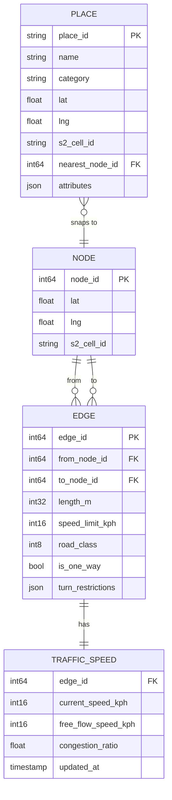
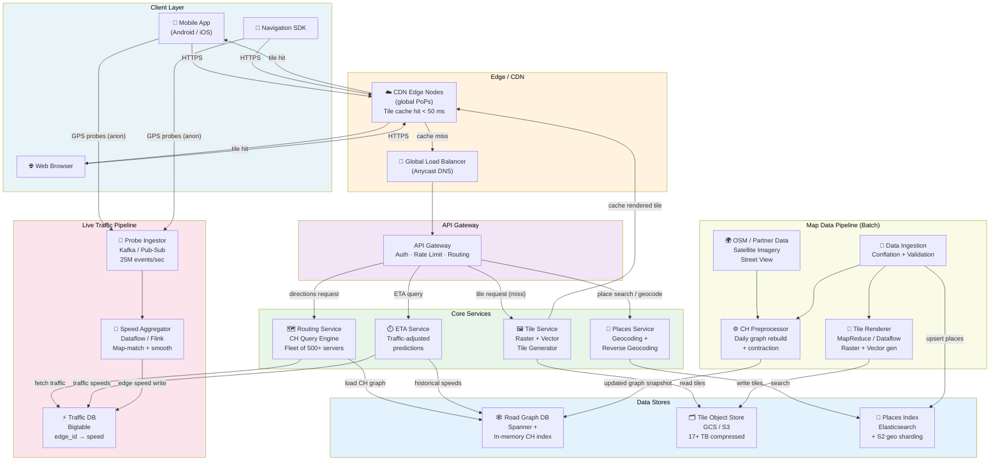
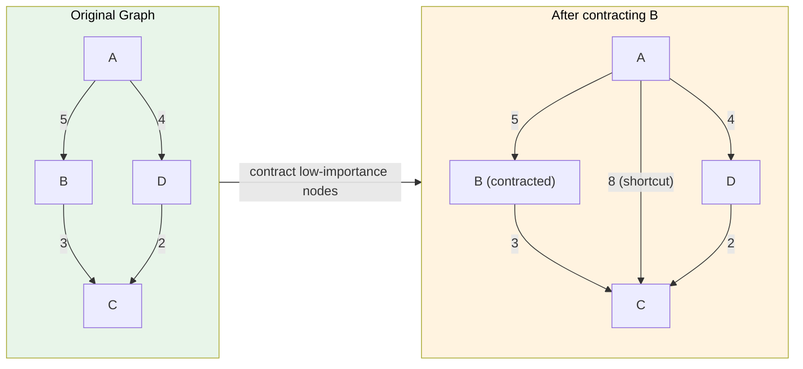
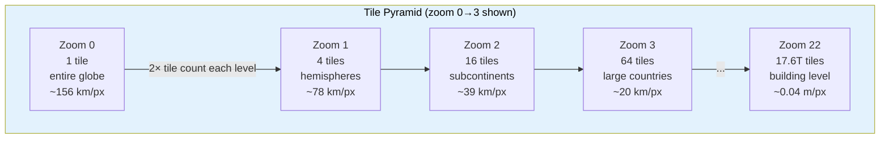

# Design Google Maps

> A planetary-scale geospatial platform that stores the entire road network as a weighted graph, serves billions of map tiles via CDN, computes real-time routes using precomputed Contraction Hierarchies, and derives live traffic ETAs from anonymized GPS probes.

**Difficulty:** ⭐⭐⭐⭐ · **Builds on:** [Geospatial Indexing](../11-Uber-Ride-Sharing/README.md), [CDN & Caching](../../Level-01-Building-Blocks/06-CDN/README.md), [Graph Algorithms](../../Level-02-Data-Layer/README.md)

---

## 1. 🎯 Problem & Scope

Google Maps has to solve five fundamentally different problems under one roof:

1. **Routing** — given an origin and destination anywhere on Earth, find the fastest (or shortest, or least-toll) path through a road network with hundreds of millions of nodes.
2. **Map rendering** — serve billions of pre-sliced map tiles so users can pan and zoom with sub-second latency.
3. **Live traffic** — continuously aggregate anonymized GPS speed probes from hundreds of millions of Android/iOS devices and feed the results back into routing ETAs.
4. **Places & geocoding** — translate "1600 Amphitheatre Pkwy" ↔ (37.422, -122.084) and let users search "pizza near me."
5. **Data pipeline** — ingest, validate, conflate, and version the underlying map data (road geometry, speed limits, turn restrictions, POI attributes) from satellite imagery, Street View, partners, and user edits.

You are designing a system that handles **~1 billion** active users, **~5 billion** direction requests per day, **~20 million** concurrent map tile views at peak, and a continuous stream of GPS probes from hundreds of millions of opted-in devices.

---

## 2. 📋 Requirements

### Functional

- **Turn-by-turn routing** between any two points on Earth for driving, walking, cycling, and transit.
- **Map tile serving** at zoom levels 0–22 for the entire globe.
- **Live traffic overlay** updated every 1–2 minutes using probe data.
- **ETA** that accounts for current and predicted traffic conditions.
- **Geocoding** (address → lat/lng) and **reverse geocoding** (lat/lng → address).
- **Place search** — text and category search with ranking by relevance and distance.
- **Alternative routes** — return up to 3 ranked options.
- **Recalculation** — detect off-route events and re-route in < 1 second on device.

### Non-Functional

- **Routing latency** < 200 ms P99 for typical in-country queries; < 2 s for cross-continental.
- **Tile latency** < 50 ms P99 cache hit; < 500 ms cache miss.
- **Availability** 99.99% (< 52 min downtime/year).
- **Probe ingestion** throughput: sustain 500 k GPS events/second globally.
- **Consistency** for map data: eventual is fine; stale-map reads up to 24 h are acceptable; fresh traffic data must be < 2 min old.
- **Map data storage**: the system must store the road network, tile pyramid, and places at petabyte scale.
- **Privacy**: GPS probes must be anonymized before aggregation; raw location histories must never leave the device unencrypted.

---

## 3. 🧮 Capacity Estimation

### Map Tile Storage

The world at zoom-22 has **2^44 ≈ 17.6 trillion** possible tiles, but land covers only ~30% of Earth and useful map data exists for far less.

```
Zoom levels 0–15 (overview + city):  ~20 million tiles  ×  50 KB avg  =   1 TB
Zoom levels 16–19 (street level):   ~500 million tiles  ×  20 KB avg  =  10 TB
Zoom levels 20–22 (building level): ~1 billion tiles    ×   5 KB avg  =   5 TB
Vector tile index (smaller):                                            ~ 1 TB
Total raster tile corpus:   ≈ 17 TB compressed (Brotli ~3:1 from 50 TB raw)
Vector tile corpus:         ≈  3 TB  (much smaller — geometry + style rules only)
```

With replication × 3 across regions + CDN caching, total storage footprint ~ **150 TB** (object store + CDN edge).

### Routing Queries

```
5 billion direction requests / day
= 5,000,000,000 / 86,400
≈ 57,870 requests/sec average
Peak (5×): ≈ 290,000 routing queries/sec
```

Each routing query runs Contraction Hierarchies (CH) on a precomputed graph. A single server can process ~500–2,000 CH queries/sec depending on query distance. At 290 k/s you need **~200–500 routing servers** behind an anycast load balancer, with the graph partitioned by geographic region (see Deep Dive 1).

### GPS Probe Ingestion

```
500 million opted-in Android devices
Probe interval: ~5 seconds while navigating, ~30 seconds background
Assume 10% actively navigating at peak: 50 million devices @ 1 probe/5 s
= 10,000,000 probes/sec peak navigating
+ 450 million background @ 1/30 s = 15,000,000 probes/sec
= ~25,000,000 probes/sec peak
```

That is **25 million events/sec**. Each probe is ~100 bytes (lat, lng, speed, heading, timestamp, road-segment ID, device anon-token).

```
25M × 100 bytes = 2.5 GB/sec raw ingest bandwidth
Per day: 2.5 × 86,400 ≈ 216 TB/day raw (before aggregation/discard)
```

Aggregated traffic speed per road segment is stored; raw probes are discarded after aggregation.

---

## 4. 🔌 API Design

### Directions

```
GET /maps/api/directions/json
    ?origin=37.4219,-122.0841
    &destination=37.7749,-122.4194
    &mode=driving
    &departure_time=now
    &alternatives=true
    &key=API_KEY

Response:
{
  "routes": [{
    "summary": "US-101 N",
    "legs": [{ "distance": {"text":"48.3 mi"}, "duration": {"text":"52 mins", "value":3120},
               "duration_in_traffic": {"text":"1 hr 8 mins", "value":4080},
               "steps": [{ "html_instructions": "Head north...", "polyline": {...} }] }],
    "overview_polyline": { "points": "encoded_polyline_string" },
    "warnings": [], "waypoint_order": []
  }],
  "status": "OK"
}
```

### Geocoding

```
GET /maps/api/geocode/json?address=1600+Amphitheatre+Pkwy,+Mountain+View,+CA&key=...

Response: { "results": [{ "geometry": { "location": { "lat": 37.4224, "lng": -122.0841 } }, ... }] }
```

### Reverse Geocoding

```
GET /maps/api/geocode/json?latlng=37.4224,-122.0841&key=...
```

### Map Tiles (Raster)

```
GET /maps/vt?lyrs=m&x={x}&y={y}&z={zoom}
```

### Map Tiles (Vector)

```
GET /maps/vt?pb=!1m5!1m4!1i{zoom}!2i{x}!3i{y}!4i256&key=...
Content-Type: application/x-protobuf
```

### Place Search (Nearby)

```
GET /maps/api/place/nearbysearch/json
    ?location=37.7749,-122.4194&radius=500&type=restaurant&key=...
```

---

## 5. 🗄️ Data Model

### Road Network Graph

The road network is modeled as a **directed weighted multigraph**:

- **Node** = intersection or shape point on a road (lat, lng, node_id)
- **Edge** = directed road segment (from_node, to_node, length_m, speed_limit_kph, road_class, turn_restrictions, current_speed_kph)
- **Weight** = travel time in seconds = length_m / current_speed_kph × 3.6



### Map Tile Pyramid

Tiles follow the **Slippy Map** (Web Mercator / EPSG:3857) convention:

| Zoom | Tiles (total) | Tile coverage | Use case |
|------|--------------|---------------|----------|
| 0    | 1            | Entire globe  | World overview |
| 5    | 1,024        | Continent     | Country level |
| 10   | 1,048,576    | Metro area    | City view |
| 15   | ~1 billion   | Neighborhood  | Street level |
| 19   | ~274 billion | Building      | Walking nav |

**Storage choice:** Google Cloud Storage (object store) for the full tile corpus; Bigtable for hot tile metadata; Memorystore (Redis) + CDN edge caches for low-latency serving.

**Road network graph:** Spanner (globally consistent relational) for the authoritative topology; in-memory graph loaded on routing servers from a daily snapshot + incremental CH rebuild.

**Traffic speeds:** Bigtable (wide-column) — edge_id as row key, time-bucketed speed columns. Writes at 25 M events/sec aggregated; reads by routing servers every 60 seconds.

**Places & geocoding index:** Elasticsearch with geo_point fields + S2 cell sharding; updated from a batch pipeline hourly.

---

## 6. 🏗️ High-Level Architecture



**Walk-through (numbered):**

1. **Tile cache hit** — The mobile app requests tile z=15/x=5242/y=12665. The CDN edge node (nearest PoP) returns it in < 50 ms from edge cache. ~90% of tile requests never reach origin.
2. **Tile cache miss** — The CDN forwards to the Tile Service, which reads the pre-rendered tile from GCS, returns it, and instructs the CDN to cache it with a 24-hour TTL.
3. **Directions request** — The client sends origin + destination to the API Gateway. The Routing Service loads the relevant CH partition from the in-memory graph, runs a bidirectional CH query, overlays current traffic speeds from Bigtable, and returns an encoded polyline with step-by-step instructions.
4. **GPS probe pipeline** — Every opted-in device emits a probe (lat, lng, speed, heading, timestamp) to the Probe Ingestor. Kafka absorbs the burst. Dataflow (Flink) map-matches probes to road segments, filters outliers, computes a rolling median speed per segment, and writes to Bigtable. Routing servers refresh their traffic overlay every 60 seconds.
5. **ETA** — The ETA Service blends current speeds (Bigtable), historical speed patterns (time-of-day / day-of-week from GRAPH), and a gradient-boosted ML model trained on historical ETA accuracy to produce a confidence-interval ETA.
6. **Place search** — Query goes to Places Service → Elasticsearch with a geo_distance filter + BM25 relevance score. Results are snapped to the road graph for "snap-to-road" accuracy.
7. **Map data pipeline (async)** — OSM dumps, partner data feeds, and Street View imagery are ingested nightly. A conflation pipeline merges sources, validates topology, and writes the new graph to Spanner. A CH Preprocessor runs a full contraction on the updated graph (takes ~4 hours for the full planet), producing a new CH overlay that routing servers hot-reload atomically.

---

## 7. 🔬 Deep Dives

### Deep Dive 1: Road Network Graph + Shortest-Path Algorithm Evolution

The road network is a **directed graph** G = (V, E) where:
- V ≈ 800 million nodes (intersections and road shape points globally)
- E ≈ 2 billion directed edges (road segments)
- Weight w(e) = travel time in seconds (updated continuously from traffic)

**Algorithm evolution:**

| Algorithm | Time complexity | Works at planet scale? | Notes |
|-----------|----------------|------------------------|-------|
| Dijkstra  | O((V + E) log V) | No — too slow at ~800M nodes | Baseline, textbook |
| Bidirectional Dijkstra | O(V^0.5 log V) empirically | Borderline | Meet-in-middle halves search space |
| A* with geo heuristic | Better in practice | Partially | Heuristic h(v) = straight-line dist / max_speed; inadmissible heuristics break optimality |
| Contraction Hierarchies (CH) | O(V^0.5) query, heavy precompute | Yes | Gold standard for road routing |

**Contraction Hierarchies — how it works:**



**Preprocessing (offline, ~4 hrs for planet):**
1. Rank all nodes by "importance" (fewer neighbors = less important = contracted first).
2. Iteratively remove (contract) each node, adding **shortcut edges** to preserve shortest-path distances between its neighbors.
3. The result is a hierarchy of shortcuts. High-importance nodes (motorway junctions, city centers) sit at the top.

**Query (online, < 10 ms for most queries):**
1. Run bidirectional Dijkstra upward in the hierarchy from source and target simultaneously.
2. Only relax edges going up the hierarchy — the search space shrinks dramatically.
3. The meeting point in the hierarchy gives the optimal path; unpack shortcuts to get the actual turn-by-turn route.

**Graph partitioning for distribution:** The planet graph is partitioned into ~10,000 tiles using a space-filling curve (Hilbert curve / S2 cells). Each routing server loads a geographic partition + its "boundary" nodes. Cross-partition queries are handled by a hierarchical overlay that connects partition boundary nodes.

---

### Deep Dive 2: Map Tile Pyramid + Serving (Vector vs. Raster)

**Tile coordinate system (Slippy Map / XYZ):**



**Raster tiles (PNG/JPEG/WebP):**
- Pre-rendered at all zoom levels by a MapReduce pipeline.
- Stored in GCS keyed by `{zoom}/{x}/{y}.webp`.
- Served via CDN with long TTL (24 h typical, shorter for areas with recent map edits).
- Size: ~20–100 KB per tile compressed.
- Con: style changes require re-rendering billions of tiles.

**Vector tiles (Protobuf / MVT format):**
- Contain raw geometry + attribute data (road class, name, POI type).
- Client-side rendering with WebGL (Google Maps JS API v3, MapLibre).
- Much smaller (~5–20 KB) and enable dynamic styling, smooth zoom, night mode, traffic overlays on the fly.
- Modern Google Maps uses vector tiles by default on supported clients.

**CDN cache key strategy:**

```
Cache-Key: {tile_type}/{zoom}/{x}/{y}/{style_version}/{traffic_version}
Cache-TTL: zoom < 10 → 7 days (world geography rarely changes)
           zoom 10–15 → 24 h
           zoom 16+ → 1 h (street-level changes, construction)
           traffic overlay tiles → 2 min
```

---

### Deep Dive 3: Live Traffic ETA from Anonymized GPS Probe Aggregation

**Privacy model:** Raw GPS coordinates never leave the device unencrypted. The device locally map-matches its location to a road segment ID (not raw lat/lng), strips the route context, adds random noise to the timestamp, and emits only `{segment_id, speed_kph, heading, anonymous_token}`.

**Pipeline steps:**

```
Device → [local map-match] → probe {seg_id, speed, ts}
  → Kafka topic (partitioned by geo-hash)
  → Dataflow streaming job:
      1. Outlier filter  (speed > 200 kph or < 0? discard)
      2. Map-match validation (does speed match road class max speed? flag)
      3. Rolling 2-min median speed per segment
      4. Bayesian smoothing with historical free-flow speed
      5. Write speed record to Bigtable
  → Routing servers poll Bigtable every 60 s
  → ETA Service blends live speed + historical patterns + ML model
```

**ETA model inputs:**
- Current segment speeds (Bigtable)
- Historical speed by hour-of-day + day-of-week (precomputed in Spanner)
- Incident reports (accidents, road closures — manual + automatic detection)
- Departure time (predict future traffic, not just current)
- Route type (motorway vs. residential)

**Traffic speed color thresholds (for overlay rendering):**

| Color | Speed vs. free flow | Meaning |
|-------|-------------------|---------|
| Green | > 90% | Free flow |
| Yellow | 60–90% | Light traffic |
| Orange | 30–60% | Moderate |
| Red | < 30% | Heavy congestion |
| Dark red | < 10% | Stop-and-go |

---

### Deep Dive 4: Place Search & Geocoding Pipeline

**Geocoding (address → lat/lng):**
1. Parse address into structured components (street number, street name, city, country) using a trained NLP model.
2. Hierarchical lookup: country → state → city → postal code → street → number.
3. Elasticsearch geo query against the places index returns candidate matches.
4. A scoring model ranks by address completeness, geocoding confidence, and geographic plausibility.
5. Snap result to nearest road node for routing.

**Reverse geocoding (lat/lng → address):**
1. Use S2 cell hierarchy to find candidate road segments and parcels within radius.
2. Project point onto nearest road segment.
3. Interpolate address number from segment start/end address range.
4. Walk up the administrative hierarchy (neighborhood → city → state → country).

**Place search ("pizza near me"):**
1. GPS location used to define a search center + radius (dynamic based on density).
2. Elasticsearch `geo_distance` filter narrows to candidates.
3. BM25 text relevance scores against name, category, and review text.
4. Re-rank with a learning-to-rank model: distance, rating, opening hours, search-click history.
5. Return top 20 with place details, photos (served from GCS), and "snap to road" for navigation start.

**Data freshness:** The places index is updated from a batch pipeline every 1–4 hours using feeds from Google Business Profile, trusted partners, and automated extraction from Street View imagery.

---

## 8. 📈 Scaling, Bottlenecks & Failure Modes

### Routing Server Graph Size

The entire planet CH graph is ~50 GB in memory. You cannot load this on a single machine per shard economically. **Solution:** partition by S2 cell. Each routing server loads one or more geographic partitions (e.g., "US West") plus a thin global "highway overlay" for long-distance queries. Cross-shard queries stitch partition results at the boundary nodes.

### CH Rebuild Latency

A full planet CH rebuild takes ~4 hours. During this window, routing servers run on the stale graph. **Solution:** incremental CH updates for small edits (single road changes rebuild only the affected local hierarchy). Full rebuilds happen nightly during low-traffic windows.

### Tile CDN Invalidation

When a road changes or a map error is corrected, you need to invalidate affected tiles across zoom levels. A single road segment at zoom 22 → propagates to ~20 parent tiles up the pyramid. **Solution:** tag tiles with a `style_version` and `map_version` hash. Increment the version on edit, serve new tiles from origin, and let CDN caches expire naturally for low-zoom tiles (7 days) while high-zoom tiles refresh quickly (1 h).

### Probe Ingestor Backpressure

At 25 M events/sec, a Kafka cluster needs ~25 GB/sec of write throughput. **Solution:** Kafka partitioned by `geo_hash % 1000`. Each partition serves one Dataflow worker. Probes older than 5 minutes are dropped — stale traffic data is worse than no traffic data.

### Failure Modes

| Failure | Impact | Mitigation |
|---------|--------|-----------|
| Routing server crash | Region loses routing capacity | Auto-scaling group, health checks, failover to neighbor region |
| Bigtable traffic DB slow | ETAs use stale or historical speeds only | Fall back to historical-only ETA with warning to user |
| CDN PoP outage | Tile latency spikes for that region | Anycast re-routes to next nearest PoP; origin can serve directly |
| CH graph corruption | Routing returns wrong paths | Canary deploy of new CH graph; rollback in < 5 min |
| Place index failure | Search returns no results | Cache last-good search results; degrade gracefully |

---

## 9. ⚖️ Trade-offs & Alternatives

### Raster vs. Vector Tiles

| | Raster | Vector |
|--|--------|--------|
| Rendering | Server-side (pre-rendered) | Client-side (WebGL) |
| Style changes | Requires re-render of all tiles | Just update style sheet, no re-render |
| File size | Larger (PNG ~50 KB) | Smaller (MVT ~10 KB) |
| Smooth zoom | No (jumps between zoom levels) | Yes (continuous zoom) |
| Offline support | Bulky to cache | Lightweight to cache |
| Old device support | Works everywhere | Requires modern GPU |

**Decision:** Google Maps uses vector tiles for modern clients and falls back to raster for legacy. The tile pipeline generates both.

### Dijkstra vs. Contraction Hierarchies

Pure Dijkstra on the 800 M node planet graph takes ~minutes per query — completely impractical. A* helps but depends on a good heuristic and doesn't scale to cross-continental routes. CH with precomputation reduces query time to **< 10 ms** at the cost of 4-hour preprocessing and ~50 GB memory per geographic partition. For a real-time system at 290 k queries/sec, CH is the only viable choice.

### Probe Aggregation: Median vs. Mean

Speed distributions are highly skewed (a few cars parked cause near-zero readings). Median is more robust than mean. However, you need > 5 probes per segment per 2-minute window for a reliable median; sparse segments fall back to historical averages.

### Monolith vs. Microservices

Google Maps is inherently decomposed: routing, tile serving, traffic, and places have completely different scaling properties (tile serving is read-heavy and CDN-friendly; routing is compute-heavy; probe ingestion is write-heavy). Separate services with well-defined APIs is the right call here — this is one of the canonical examples where microservices pay off.

---

## 10. 🌐 How It's Actually Done

**Google S2 Geometry Library:** Google uses the [S2 library](https://s2geometry.io/) for all geospatial indexing. S2 subdivides the sphere into a hierarchy of cells using a Hilbert space-filling curve, enabling efficient range queries, containment tests, and geo-sharding. You can index a region as a union of S2 cells and run geo queries as cell range lookups. Used for tile sharding, place indexing, and probe routing.

**Contraction Hierarchies in practice:** Google's routing engine (internally called "Pathfinder") uses CH as its base algorithm, augmented with time-dependent edge weights (to model rush-hour speed patterns) and turn-cost modeling (left turns at intersections add time). The open-source equivalent is [OSRM](http://project-osrm.org/) which also uses CH on OpenStreetMap data.

**OpenStreetMap & HERE Maps:** While Google has its own proprietary map database built from Street View, satellite imagery, partner feeds, and user contributions, many competitors (Apple Maps historically, Bing Maps, DuckDuckGo Maps) use [HERE Maps](https://www.here.com/) as a data source. [OpenStreetMap](https://www.openstreetmap.org/) is the open-source alternative that powers Mapbox, OsmAnd, and Organic Maps.

**Google Cloud Spanner for geo data:** The authoritative road graph topology is stored in Spanner — a globally distributed, strongly consistent, horizontally scalable SQL database — because road network edits need to be consistent (you don't want half the routing servers seeing a new one-way street and the other half not). Spanner's external consistency gives you this guarantee across regions.

**Bigtable for traffic:** Bigtable's wide-column model maps perfectly to traffic data: row key = `segment_id#time_bucket`, columns = speed readings from different probe batches. It handles the 25 M writes/sec with horizontal scaling across tablet servers.

**ETA ML model:** Google published research on using gradient-boosted trees (then moving to deep learning / Graph Neural Networks) to improve ETA accuracy beyond what speed-based estimates alone can achieve. GNNs can model how congestion at one intersection propagates to adjacent edges — something a purely local model misses.

**Valhalla & GraphHopper:** Open-source routing engines built on OSM data. Valhalla uses a hierarchical tiles approach conceptually similar to CH partitioning. GraphHopper supports CH natively. Both are used by companies building routing on top of OSM.

For more on how distributed storage underpins this, see the companion write-up on [Google Drive / Dropbox](../14-Google-Drive-Dropbox/README.md) which covers large-scale object storage patterns used by both systems.

---

## 11. 📝 Summary

Google Maps is a masterclass in applying classical computer science to planetary scale:

| Problem | Core idea |
|---------|-----------|
| Routing at scale | Model roads as a directed weighted graph; precompute Contraction Hierarchies to reduce query time from minutes to milliseconds |
| Map rendering | Pre-slice the world into a zoom-level tile pyramid; serve via CDN edge caches; use vector tiles for dynamic styling |
| Live traffic | Ingest anonymized GPS probes at 25 M events/sec; map-match and aggregate to per-segment speeds; refresh routing weights every 60 seconds |
| ETA accuracy | Blend real-time speeds + historical patterns + ML model trained on past prediction errors |
| Place search | Elasticsearch with S2 geo sharding + learning-to-rank re-ranking |
| Scalability | Geographic partitioning of the graph, tiered caching (device → CDN → origin), streaming probe pipeline with Kafka + Dataflow |

**Key interview takeaways:**

- The road network is a **graph** — nodes are intersections, edges are road segments, weights are travel time (not distance).
- **Dijkstra doesn't scale** to planet-sized graphs at production QPS. You need precomputed shortcuts (Contraction Hierarchies).
- Map **tiles are pre-computed** and served almost entirely from CDN cache (~90% hit rate). The origin never sees most tile requests.
- **Privacy for traffic data** is achieved by map-matching on-device and transmitting segment IDs + speeds, not raw GPS tracks.
- **Eventual consistency** is fine for map data (roads don't change by the second), but **routing must reflect traffic within ~2 minutes** to be useful for navigation.
- At this scale, every component is independently scalable: routing servers, tile origin, probe ingestors, and the places index all scale on different axes.
