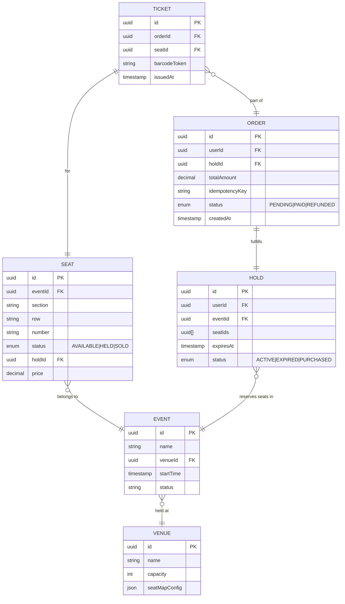
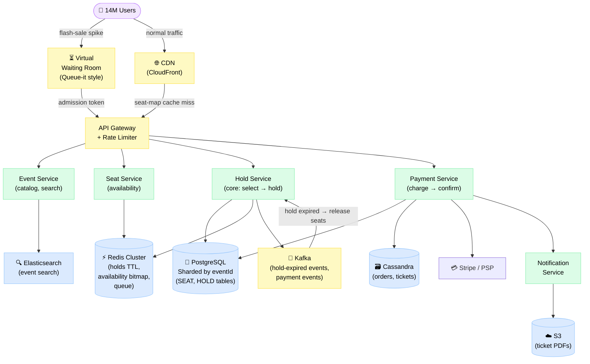
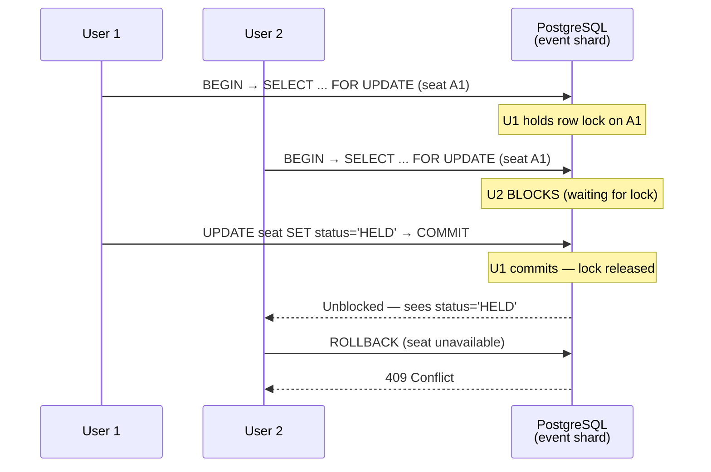
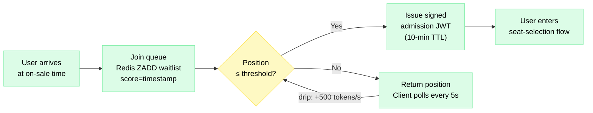

# Design Ticketmaster

> A concert/event ticketing platform that lets millions of fans browse events, select seats, and purchase tickets — without double-booking a single seat.

**Difficulty:** ⭐⭐⭐⭐ · **Builds on:**
[Distributed Systems](../../Level-04-Distributed-Systems/README.md) ·
[Idempotency & Exactly-Once](../../Level-04-Distributed-Systems/07-Idempotency-and-Exactly-Once/README.md) ·
[Caching](../../Level-01-Building-Blocks/03-Caching/README.md)

---

## 1. 🎯 Problem & Scope

Ticketmaster sells tickets to concerts, sports, and theatre events. The core challenge is deceptively simple: **show a seat map → let a user pick seats → charge them → mark seats sold**. At scale this becomes one of the hardest concurrency problems in consumer software.

During a Taylor Swift on-sale, 14 million people simultaneously try to buy from a pool of 60 000 seats. Every seat must be sold **exactly once**. A seat cannot appear available to two buyers and result in two charges. A held seat must be released if payment never completes.

**In scope:** event/venue catalog, seat-map browsing, seat selection & hold, payment processing, ticket delivery (PDF/mobile), waiting room for flash sales.

**Out of scope:** artist management, promoter tools, resale/secondary market (StubHub), streaming events.

---

## 2. 📋 Requirements

### Functional
- Browse events by city / date / category
- View interactive seat map with real-time availability
- Select 1–8 seats → place a **temporary hold** (10-minute TTL)
- Complete purchase (payment) → hold becomes confirmed booking
- If payment fails or times out → hold is released, seats return to pool
- Email + mobile ticket delivery
- Virtual waiting room during flash-sale on-sales

### Non-Functional
- **Consistency over availability** for seat booking (no double-sells)
- Seat hold must be acquired in **< 500 ms** p99
- Seat-map page load **< 1 s** p99 under normal load
- Support **50 000 concurrent checkout sessions** per major event
- On-sale spike: **500 000 req/s** arriving in the first 30 seconds
- 99.99% uptime for booking paths; 99.9% for browsing

---

## 3. 🧮 Capacity Estimation

**Events & catalog (steady state)**
- 100 000 active events × 20 000 seats avg = 2 billion seat-state rows
- Each seat row ≈ 64 bytes → **~128 GB** of seat state in DB
- Reads dominate: 1 000 users browse per seat purchased → read:write ≈ 1000:1

**Flash-sale on-sale spike**
- 14 M users × 3 req (seat-map poll, hold attempt, pay) = 42 M requests in ~60 s
- Peak ingress: **~700 000 req/s** at the spike tip
- 60 000 seats → at most 60 000 hold operations succeed; rest get queued/rejected

**Hold storage**
- 1 M concurrent holds × 256 bytes = **256 MB** — fits in Redis

**Tickets issued**
- 500 M tickets/year → **~16 tickets/s** average; 200 000/s peak on-sale day
- Ticket PDF ≈ 200 KB → 100 TB/year object storage

**Throughput target (checkout service)**
- 60 000 seat holds × 2 retries avg = 120 000 DB writes/on-sale event
- Per-event DB shard handles ≤ 100 000 writes/minute → one shard per hot event

---

## 4. 🔌 API Design

```http
# Browse events
GET /v1/events?city=NYC&date=2025-08-01&category=music
→ 200 { events: [...] }

# Get seat map (cached aggressively)
GET /v1/events/{eventId}/seat-map
→ 200 { sections: [...], availableCount: 52340 }

# Hold seats (core transactional endpoint)
POST /v1/events/{eventId}/holds
Body: { seatIds: ["A1","A2"], userId: "u_123" }
→ 201 { holdId: "h_abc", expiresAt: "2025-08-01T20:10:00Z", seats: [...] }
→ 409 { error: "SEATS_UNAVAILABLE", unavailable: ["A1"] }

# Complete purchase (idempotent via holdId)
POST /v1/holds/{holdId}/purchase
Body: { paymentMethodId: "pm_xyz", idempotencyKey: "h_abc-u_123-1" }
→ 200 { orderId: "ord_999", tickets: [...] }

# Release hold early (user backs out)
DELETE /v1/holds/{holdId}

# Waiting room — client polls for admission token
GET /v1/events/{eventId}/queue-position
→ 200 { position: 14823, estimatedWait: 420 }
```

---

## 5. 🗄️ Data Model



**Storage choices:**
- **PostgreSQL (sharded by eventId)** — seat & hold tables; row-level locking guarantees no double-booking; ACID transactions
- **Redis** — hold TTL timers (`EXPIREAT`), seat-availability bitmap per event, waiting-room queue (sorted set by join time)
- **Cassandra** — order history, ticket records (append-only, high read throughput)
- **S3** — ticket PDF/passbook files

---

## 6. 🏗️ High-Level Architecture



**Walk-through (happy path during flash sale):**
1. **Traffic enters the waiting room** — users are queued in Redis sorted set ordered by arrival time. Tokens are drip-released at a rate the system can handle (e.g., 500 tokens/s).
2. **Admitted users hit API Gateway** — per-user rate limiting (1 hold attempt/s); DDoS protection.
3. **Seat-map request** — Seat Service reads availability bitmap from Redis (updated via DB change events); stale by ≤ 2 s, that's fine for browsing.
4. **Hold request** — Hold Service opens a transaction in the PostgreSQL shard for that `eventId`, issues `SELECT ... FOR UPDATE` on the requested seat rows, sets `status = HELD`, writes a HOLD record with `expiresAt = now + 10 min`, commits. Simultaneously writes hold to Redis with `EXPIREAT` for expiry signals.
5. **Payment** — Payment Service charges the PSP with an idempotency key derived from `holdId`. On success, HOLD → PURCHASED, ORDER created, seats set to SOLD.
6. **Hold expiry** — Redis keyspace notification fires when hold TTL expires; Kafka consumer instructs Hold Service to release seats back to AVAILABLE. Belt-and-suspenders: a cron also sweeps holds where `expiresAt < now AND status = ACTIVE`.
7. **Ticket delivery** — Notification Service generates a PDF, stores it in S3, emails a signed URL.

---

## 7. 🔬 Deep Dives

### 7.1 The Double-Booking Problem & Locking Strategy

The heart of Ticketmaster. Two users click "A1" at the same millisecond. Without coordination, both succeed and we've sold one seat twice.

**Option A — Pessimistic locking (chosen for seats)**

```sql
BEGIN;
SELECT id, status FROM seat
WHERE event_id = $1 AND id = ANY($2)
FOR UPDATE;               -- row-level exclusive lock

-- If any row status != 'AVAILABLE', ROLLBACK → return 409
UPDATE seat SET status='HELD', hold_id=$3 WHERE id = ANY($2);
INSERT INTO hold (...) VALUES (...);
COMMIT;
```

The `FOR UPDATE` lock means only one transaction can touch those rows at a time. The second concurrent request blocks until the first commits, then sees `status='HELD'` and returns 409. Correct, simple, proven.

**Option B — Optimistic locking (for low-contention sections)**

Add a `version` column. Read `version=5`, then `UPDATE seat SET status='HELD', version=6 WHERE id=$1 AND version=5`. If 0 rows updated → conflict → retry. Works well when contention is low (e.g., browsing obscure shows), but under flash-sale load the retry storm amplifies DB load.

**Decision: pessimistic locking per event shard.** Each event lives on its own PostgreSQL shard so lock contention is fully isolated. Hot events don't hurt cold events.



### 7.2 Seat Hold & TTL Release

Hold lifecycle: **AVAILABLE → HELD → (SOLD | AVAILABLE)**

The 10-minute hold timer must be enforced even if the Hold Service crashes.

**Dual-mechanism expiry (belt & suspenders):**
1. **Redis TTL** — when Hold Service creates a hold, it also does `SET hold:{holdId} 1 EX 600`. Redis keyspace notifications emit `expired` events; a Kafka consumer processes them and triggers seat release.
2. **Sweeper job** — every 60 s, a background job runs:
   ```sql
   UPDATE seat SET status='AVAILABLE', hold_id=NULL
   WHERE hold_id IN (
     SELECT id FROM hold
     WHERE status='ACTIVE' AND expires_at < NOW()
   );
   UPDATE hold SET status='EXPIRED'
   WHERE status='ACTIVE' AND expires_at < NOW();
   ```
   This catches any Redis notification that was lost during a failover.

**Why not just the sweeper?** The sweeper runs every 60 s; a user could see a ghost-held seat for up to 60 s after it should be free. Redis gives near-instant release.

### 7.3 Virtual Waiting Room (Flash-Sale Spike)

Without a waiting room, 14 M users hammer the Hold Service directly. The DB falls over. The waiting room acts as a **token-bucket / admission controller** at the edge.



- Queue stored in Redis sorted set: `ZADD event:{id}:queue <timestamp> <userId>`
- Admission controller drips tokens at a rate calibrated to backend capacity
- Signed JWT prevents users from bypassing the queue
- Position estimate: `(position / drip_rate) = estimated_wait_seconds`

### 7.4 Idempotent Payment

A user submits payment, the network times out, and they hit retry. Without idempotency they'd be charged twice.

Payment Service uses an **idempotency key** = `SHA256(holdId + userId + attemptNumber)`. On retry, the key is the same.

```
POST /v1/holds/{holdId}/purchase
Idempotency-Key: abc123...
```

On first receipt: write `idempotency_keys(key, status=PROCESSING, result=NULL)` — then charge PSP — then update to `status=COMPLETE, result={orderId}`.

On retry: look up key → return stored result immediately. No second charge.

See [Idempotency & Exactly-Once](../../Level-04-Distributed-Systems/07-Idempotency-and-Exactly-Once/README.md) for the full pattern.

---

## 8. 📈 Scaling, Bottlenecks & Failure Modes

| Bottleneck | Symptom | Mitigation |
|---|---|---|
| Hot event DB shard | Lock contention spikes latency | One PostgreSQL shard per active event; connection pooling via PgBouncer |
| Redis waiting-room queue | Single sorted set = hot key | Partition queue by user-id range; merge at read time |
| Seat-map polling | 14M users × 5s poll = 2.8M req/s | Cache seat-map HTML in CDN; push availability delta via SSE/WebSocket |
| Hold expiry storm | Thousands of holds expire simultaneously | Jitter expiry times ±30 s when creating holds |
| PSP timeout | Payment hangs, hold expires | Async PSP webhook + saga: extend hold if PSP ack received but result pending |
| Seat-map stale data | User picks already-held seat → 409 | Acceptable UX; retry with fresh map; 409 rate < 5% is fine |

**Failure modes:**
- **Hold Service crash mid-transaction** → PostgreSQL MVCC ensures partial transaction is rolled back; hold never written to DB; seat stays AVAILABLE.
- **Redis failure** → Fall back to sweeper-only expiry; hold release delayed up to 60 s; degrade gracefully.
- **PSP outage** → Queue payment intent in Kafka; retry with exponential backoff; hold auto-extended for PSP-acked orders.

---

## 9. ⚖️ Trade-offs & Alternatives

| Decision | Chosen | Alternative | Why chosen |
|---|---|---|---|
| Seat locking | Pessimistic (`SELECT FOR UPDATE`) | Optimistic (CAS version) | Correctness under extreme flash-sale contention; no retry storm |
| Hold enforcement | Redis TTL + DB sweeper | DB only | Near-instant release + crash resilience |
| Flash-sale throttling | Virtual waiting room (queue) | Hard rate-limit → HTTP 429 | Better UX; fair ordering by arrival time |
| Shard key | `eventId` | `userId` | All seat rows for an event co-located; single transaction |
| Seat-map updates | CDN cached + SSE delta | Full real-time WebSocket | Cost and scale; exact real-time not needed for browsing |

---

## 10. 🌐 How It's Actually Done

**Ticketmaster** encountered catastrophic failures during Taylor Swift's Eras Tour on-sale (Nov 2022): bots and genuine traffic overwhelmed their queue system, leading to degraded service for millions of users. Their post-incident response highlighted the need for better bot mitigation (CAPTCHA, device fingerprinting), more elastic capacity, and better waiting-room UX.

**Queue-it** and **Fastly** provide SaaS waiting-room solutions used by many ticketing platforms. They handle queue management externally, so the origin only sees admitted traffic.

**Seat locking at scale:** some platforms use a **Redis-based distributed lock** (SETNX with TTL) for the hold step to avoid DB lock contention entirely, but this requires careful crash-recovery logic. PostgreSQL row locks are simpler and correct.

**Virtual tickets (NFT-backed):** Ticketmaster has experimented with blockchain-based tickets (Ticketmaster Tokens) to prevent scalping and provide verifiable provenance.

---

## 11. 📝 Summary

| Aspect | Decision |
|---|---|
| Core guarantee | No double-booking via pessimistic row-level locks in per-event DB shards |
| Hold mechanism | 10-min TTL enforced by Redis expiry events + DB sweeper |
| Flash-sale traffic | Virtual waiting room (Redis sorted set) drip-releasing admission tokens |
| Payment safety | Idempotency key on every purchase; PSP webhook for async confirmation |
| Seat-map reads | CDN-cached + SSE delta pushes; Redis bitmap for fast availability checks |
| Scale target | 50 000 concurrent checkouts; 500 000 req/s spike handled by waiting room |

The key insight: **the waiting room turns an impossible spike into a manageable steady stream.** Everything downstream — the shard, the lock, the hold timer — is designed for correctness, not raw throughput, because 60 000 seats is a small number. The hard problem is letting 14 million people compete fairly for those seats without crashing the system.
