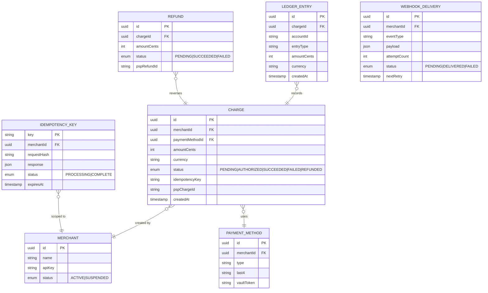
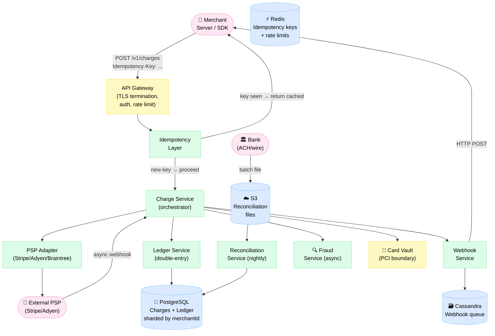
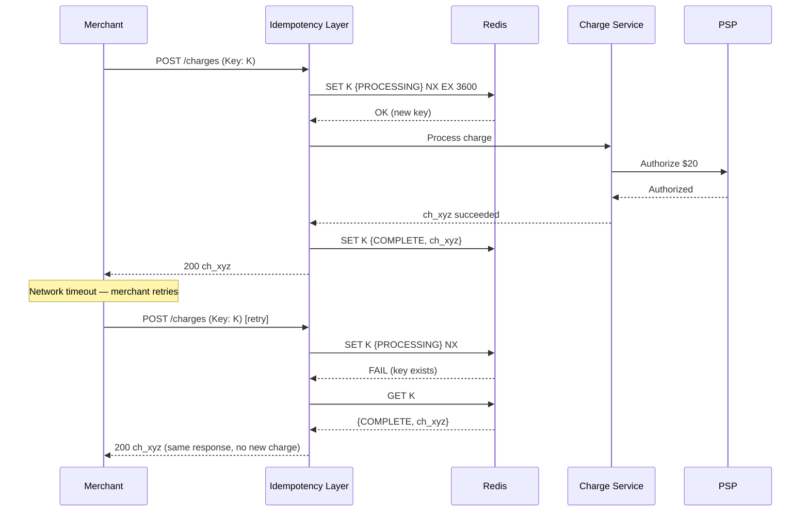
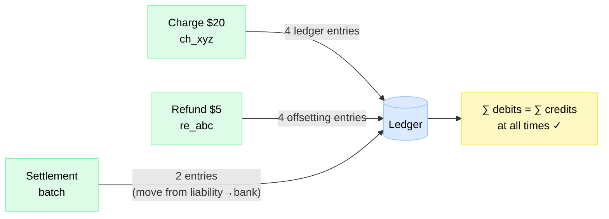

# Design Payment System

> A Stripe-like payments platform that charges cards, manages balances, and moves money between parties — with zero double-charges, an immutable audit trail, and exactly-once guarantees at every layer.

**Difficulty:** ⭐⭐⭐⭐⭐ · **Builds on:**
[Idempotency & Exactly-Once](../../Level-04-Distributed-Systems/07-Idempotency-and-Exactly-Once/README.md) ·
[Saga Pattern](../../Level-05-Architecture-Patterns/07-Saga-and-Orchestration/README.md) ·
[Distributed Systems](../../Level-04-Distributed-Systems/README.md)

---

## 1. 🎯 Problem & Scope

A payment system is the most correctness-critical software most engineers will ever touch. A bug that double-charges 0.01% of transactions at Stripe's volume (millions/day) means thousands of angry customers and regulatory consequences.

We're designing a **Stripe-like payment processing platform**: merchants integrate our SDK/API to accept card payments; we handle authorization, capture, settlement, and payouts. Money in → hold → capture → settle → payout.

**In scope:** charge creation, authorization, capture, refunds, idempotency, double-entry ledger, PSP/bank integration, webhook delivery, reconciliation.

**Out of scope:** card network infrastructure (Visa/Mastercard internals), fraud ML (treated as a black-box service), KYC/AML onboarding, crypto payments.

---

## 2. 📋 Requirements

### Functional
- Merchants create charges via API (card, ACH, wallet)
- Authorize → capture (two-step) or charge immediately (auth+capture)
- Issue refunds (full or partial)
- Receive webhook callbacks on payment events
- Query transaction history and balance
- Reconcile with external PSP/bank statements nightly

### Non-Functional
- **Zero double-charges** — retries must be idempotent
- **Exactly-once ledger entries** — every debit has a matching credit
- Charge API p99 latency **< 800 ms** (PSP round-trip dominates)
- **99.999% availability** (5 nines) for charge creation
- Financial data must be **strongly consistent** — no eventual consistency on money
- PCI-DSS Level 1 compliance; card data never touches merchant servers
- Audit log immutable, retained 7 years

---

## 3. 🧮 Capacity Estimation

**Transaction volume**
- 5 M charges/day → **58 charges/s** average
- Peak (Black Friday): 10× → **580 charges/s**
- Each charge triggers ≈4 ledger entries (debit customer, credit merchant, debit fee, credit revenue)
- → 2 300 ledger writes/s peak

**Storage**
- Charge record: 1 KB × 5 M/day × 365 × 7 years = **~13 TB** over retention window
- Ledger entries: 4× charge records = **~52 TB** (append-only, never updated)
- Idempotency key store: 5 M/day × 30-day window = 150 M active keys × 256 bytes = **~38 GB** (fits in Redis)

**Webhooks**
- 5 M charges × 3 events avg (created, succeeded, settled) = 15 M webhook deliveries/day → **175/s**
- Each webhook retried up to 5× with exponential backoff → 75 M HTTP calls/day peak

**Reconciliation**
- PSP sends batch file nightly: 5 M rows × 512 bytes = **2.5 GB** file — trivial

---

## 4. 🔌 API Design

```http
# Create a charge (idempotency key required)
POST /v1/charges
Idempotency-Key: merchant-order-abc-001
Body: {
  "amount": 2000,          // cents
  "currency": "usd",
  "payment_method": "pm_card_visa",
  "capture": true,
  "metadata": { "order_id": "ord_123" }
}
→ 200 { id: "ch_xyz", status: "succeeded", amount: 2000, ... }
→ 200 (on retry with same key — same response, no double charge)
→ 402 { error: "card_declined" }

# Two-step: authorize only
POST /v1/charges
Body: { ..., "capture": false }
→ 200 { id: "ch_abc", status: "authorized" }

# Capture authorized charge
POST /v1/charges/{chargeId}/capture
Body: { "amount": 1800 }   // can capture less than authorized
→ 200 { status: "succeeded" }

# Refund
POST /v1/refunds
Body: { "charge": "ch_xyz", "amount": 500 }
→ 200 { id: "re_zzz", status: "pending" }

# List charges
GET /v1/charges?limit=10&starting_after=ch_old
→ 200 { data: [...], has_more: true }

# Webhook endpoint (registered by merchant)
POST https://merchant.com/webhook
Body: { "type": "charge.succeeded", "data": { "object": { ... } } }
```

---

## 5. 🗄️ Data Model



**Storage choices:**
- **PostgreSQL** — CHARGE, LEDGER_ENTRY, REFUND: ACID transactions, row-level locks, strong consistency. Sharded by `merchantId` for write scale.
- **Redis** — IDEMPOTENCY_KEY store: TTL-based expiry, sub-millisecond lookup, ~38 GB fits comfortably
- **Cassandra** — WEBHOOK_DELIVERY: high write throughput, retry queue with TTL
- **Vault (HashiCorp)** — card PAN → vault token mapping (PCI scope isolation)

---

## 6. 🏗️ High-Level Architecture



**Walk-through (successful charge):**
1. Merchant POSTs `/v1/charges` with `Idempotency-Key: order-abc-001`.
2. **Idempotency layer** checks Redis: key not seen → insert `{key, status:PROCESSING}` and proceed.
3. **Charge Service** calls Fraud Service (async, non-blocking for low-risk scores).
4. Charge Service calls Card Vault to exchange payment method ID for a PSP token (card number never leaves PCI boundary).
5. **PSP Adapter** sends authorization request to the external PSP. PSP responds synchronously (or via webhook for async flows).
6. On authorization success, Charge Service writes CHARGE record (status=AUTHORIZED) in a DB transaction that also calls **Ledger Service** to write the four double-entry rows.
7. If `capture:true`, Charge Service immediately sends a capture request to PSP; CHARGE status → SUCCEEDED.
8. Idempotency layer updates Redis: `{key, status:COMPLETE, response: <charge_json>}`.
9. **Webhook Service** enqueues a `charge.succeeded` event; delivers with retries.

---

## 7. 🔬 Deep Dives

### 7.1 Idempotency Keys — No Double Charge on Retry

The internet is unreliable. A merchant's server times out waiting for a response and retries. Without idempotency, we'd charge the customer twice.

**The pattern** (see [Idempotency & Exactly-Once](../../Level-04-Distributed-Systems/07-Idempotency-and-Exactly-Once/README.md)):

```
1. Receive request with Idempotency-Key: K
2. ATOMIC: SET key K → {status: PROCESSING} NX (only if not exists)
   a. If SET succeeded → we are the first; proceed with charge
   b. If SET failed → key exists
      i.  status=COMPLETE → return stored response (deduplicated)
      ii. status=PROCESSING → 409 "request in flight" (ask client to wait and retry)
3. Execute charge (PSP call, ledger write)
4. Update Redis: key K → {status: COMPLETE, response: <result>}
```

The `NX` (only-if-not-exists) atomic Redis operation is the critical step. Between step 2 and 4, if the server crashes, the key is left in `PROCESSING`. A sweeper job after a timeout (e.g., 60 s) resets stuck `PROCESSING` keys so retries can proceed.



### 7.2 Double-Entry Ledger

Every financial transaction is recorded as **balanced debit/credit pairs**. This is a 500-year-old accounting principle that makes bugs visible: if debits ≠ credits, something is wrong.

**Example: $20 charge with $0.58 Stripe fee**

| account | entry_type | amount |
|---|---|---|
| customer:cust_abc | DEBIT | +$20.00 |
| merchant:merch_xyz | CREDIT | +$19.42 |
| revenue:fees | CREDIT | +$0.58 |
| liability:pending_settlement | DEBIT | +$20.00 |

Sum of debits = Sum of credits = $20.00. ✓

The ledger is **append-only** — entries are never updated or deleted. A refund is a new set of offsetting entries, not a deletion. This creates a complete audit trail.



**Implementation:** Ledger writes are **inside the same DB transaction** as the charge status update. You can't have a SUCCEEDED charge without ledger entries, and vice versa.

### 7.3 The Authorize → Capture Saga

For physical goods (e.g., hotel, car rental), merchants authorize at booking but capture at delivery. The authorize and capture are two separate PSP calls, separated by hours or days.

This is a **distributed saga** (see [Saga Pattern](../../Level-05-Architecture-Patterns/07-Saga-and-Orchestration/README.md)):

```
Step 1: Authorize   → CHARGE.status = AUTHORIZED, PSP holds funds
Step 2: Capture     → CHARGE.status = SUCCEEDED,  PSP settles
```

Compensating transactions:
- If capture fails → issue void (cancel authorization)
- If merchant never captures → authorization expires (typically 7 days), void automatically

Authorization expirations are tracked with a background job. Merchants who try to capture an expired auth get a clear error and must re-authorize.

### 7.4 Reconciliation — Trust but Verify

Even with correct code, discrepancies arise: network timeouts leave ambiguous PSP states, bank batches arrive late, clock skew causes ordering issues. **Nightly reconciliation** is the safety net.

```
1. PSP sends batch CSV: {psp_charge_id, amount, status, settled_at}
2. Reconciliation Service joins against our CHARGE table
3. Three buckets:
   a. MATCH — psp amount = our amount, statuses agree → OK
   b. MISSING_IN_PSP — we show SUCCEEDED, PSP doesn't have it → investigate
   c. MISSING_IN_US — PSP has a charge we don't → investigate (very rare)
4. Discrepancies → alert on-call + create DISCREPANCY records
5. Auto-resolve if PSP webhook arrives within 24h after batch shows it pending
```

Reconciliation runs on S3-stored batch files using a Spark job, joining ~5 M rows with our DB records. It's tolerant of ordering — we reconcile by `psp_charge_id`, not time.

---

## 8. 📈 Scaling, Bottlenecks & Failure Modes

| Bottleneck | Symptom | Mitigation |
|---|---|---|
| PSP latency | 95th percentile charge latency degrades | Circuit breaker; async capture with webhook; multiple PSP providers |
| Ledger write hot spots | High-revenue merchants → hot DB shard | Shard ledger by `accountId` hash, separate from charge shard |
| Idempotency key lookup | Redis becomes bottleneck | Redis Cluster; key scoped per merchant (data locality) |
| Webhook delivery | Slow merchant endpoint backs up queue | Per-merchant delivery queue; timeout after 10 s; max 5 retries |
| Reconciliation lag | Discrepancies undetected for 24h | Supplement batch with real-time PSP webhook events |

**Failure modes:**
- **PSP timeout during authorization** — CHARGE stays PENDING; idempotency key in PROCESSING; sweeper times out and marks FAILED; client gets clear error on retry.
- **Server crash after PSP auth, before ledger write** — On restart, CHARGE is PENDING with PSP shows AUTHORIZED; reconciliation detects this; manual remediation or automated void.
- **Idempotency Redis failure** — Fall back to DB-based idempotency table (slower, but correct). Pre-provision DB table as fallback.

---

## 9. ⚖️ Trade-offs & Alternatives

| Decision | Chosen | Alternative | Why chosen |
|---|---|---|---|
| Consistency model | Strong (PostgreSQL ACID) | Eventual (NoSQL) | Money requires correctness; CAP → CP |
| Ledger storage | Relational (PostgreSQL) | Append-only Kafka log | Relational joins needed for balance queries and reconciliation |
| Idempotency store | Redis (fast) | DB table | Sub-ms dedup check; DB fallback for Redis failure |
| PSP integration | Synchronous auth + async webhook | Fully async | Sync gives immediate user feedback; webhook for reliability |
| Shard key | `merchantId` | `chargeId` | All merchant data co-located for balance queries; hot merchant mitigated by DB routing layer |

---

## 10. 🌐 How It's Actually Done

**Stripe** uses a MySQL-based (InnoDB) system with a custom sharding layer called Vitess. Their idempotency implementation is exactly as described — idempotency keys stored with PROCESSING/COMPLETE states, scoped to the API version and endpoint.

**Stripe's ledger** is described in public talks as a double-entry bookkeeping system with append-only rows. They perform a "ledger check" where total debits must equal total credits; any imbalance triggers an immediate incident.

**PayPal** uses a similar saga pattern for their payment flows, with explicit compensation transactions for each failure mode codified in their order management system.

**Reconciliation at scale:** Stripe processes hundreds of billions of dollars and runs reconciliation against every card network and bank partner. They've published that they catch ~0.002% discrepancy rates, almost always due to network timeouts creating "phantom" transactions.

**PCI compliance:** Card numbers are tokenized at the edge (Stripe.js, Elements) — the raw PAN never reaches the merchant or the application server. Our "Card Vault" mirrors this design.

---

## 11. 📝 Summary

| Aspect | Decision |
|---|---|
| No double charges | Idempotency keys with atomic Redis NX + PROCESSING/COMPLETE state machine |
| Financial correctness | Double-entry ledger; append-only; written in same transaction as charge status |
| PSP integration | Sync auth + async capture webhook; circuit breaker; multiple PSPs |
| Auth→capture flow | Distributed saga with compensating void on failure/expiry |
| Reconciliation | Nightly batch join (PSP CSV vs. DB) + real-time webhook cross-check |
| PCI compliance | Card Vault tokenization at the TLS edge; PAN never in application layer |

The two non-negotiable pillars are **idempotency** (no double charges on retry) and **double-entry ledger** (every dollar has a matching debit and credit). Every other design decision flows from these two correctness requirements.
