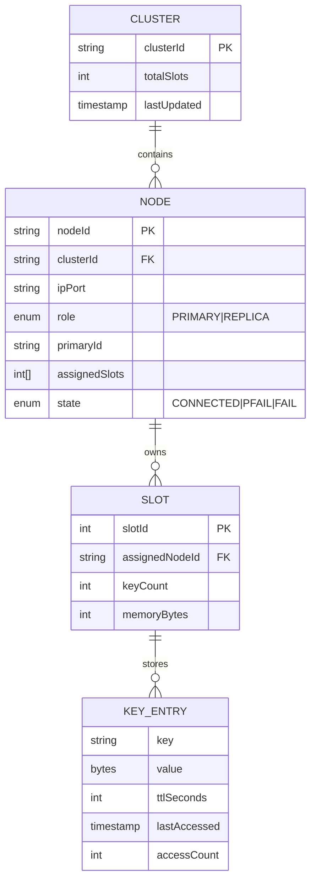
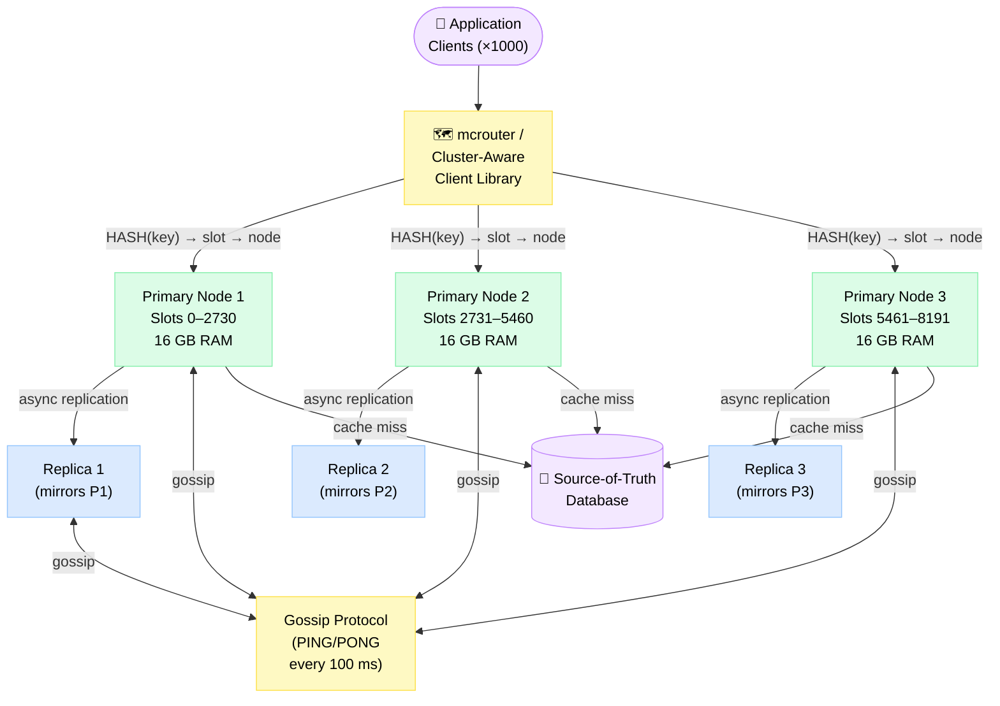
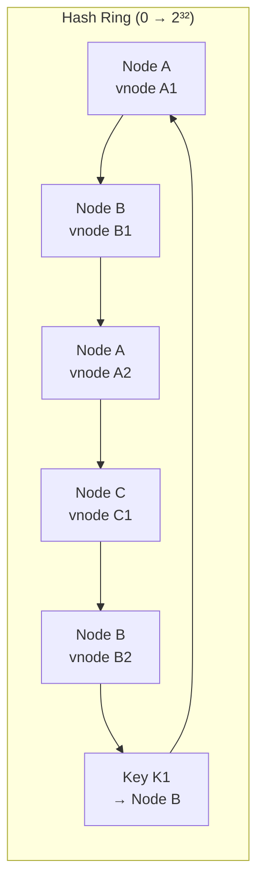
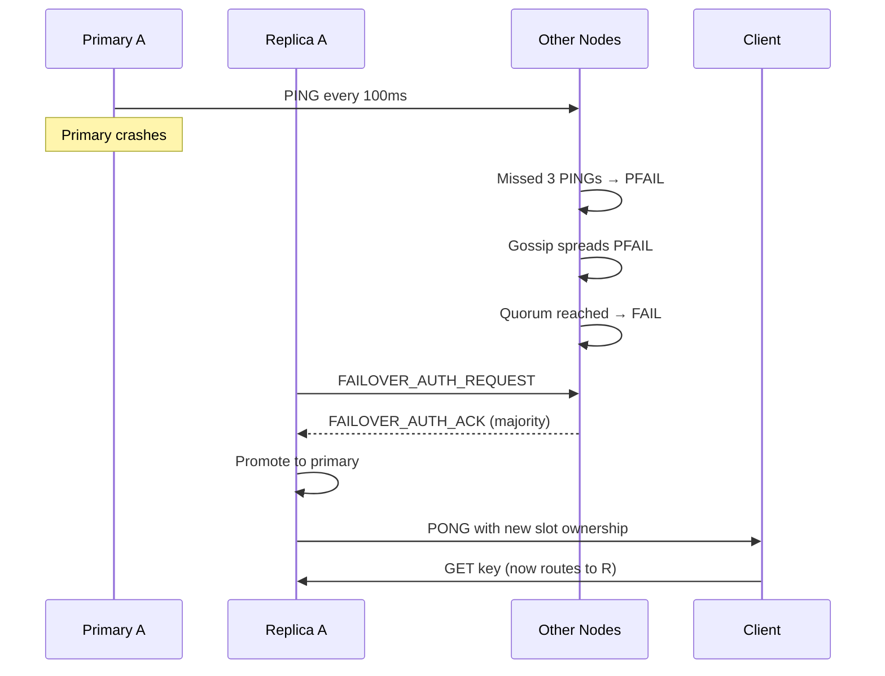
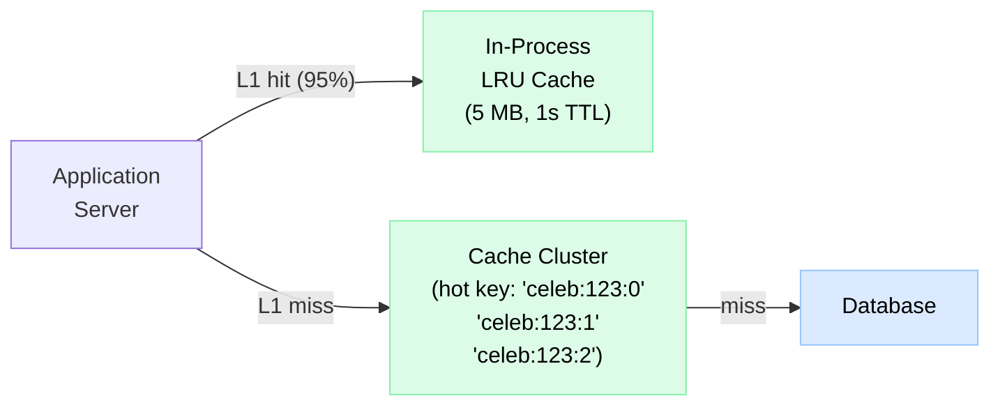

# Design Distributed Cache

> A Redis/Memcached-like in-memory cache cluster that partitions data across nodes, survives node failures, and serves reads in microseconds.

**Difficulty:** ⭐⭐⭐⭐⭐ · **Builds on:**
[Distributed Systems](../../Level-04-Distributed-Systems/README.md) ·
[Replication & Consistency](../../Level-04-Distributed-Systems/README.md) ·
[Consistent Hashing](../../Level-02-Data-Layer/08-Consistent-Hashing/README.md)

---

## 1. 🎯 Problem & Scope

Every high-traffic service puts a cache in front of its database. But a single-node cache becomes both a bottleneck and a single point of failure. A **distributed cache** spreads data across many nodes, keeps working when nodes fail, and scales horizontally by adding nodes.

We're designing the internals of a system like **Redis Cluster** or **Facebook's Memcached + mcrouter**: multiple cache nodes, automatic sharding, primary/replica replication, and self-healing cluster membership.

**In scope:** partitioning strategy (consistent hashing), replication & failover, eviction policies, hot-key mitigation, cache invalidation & write policies, cluster membership/gossip.

**Out of scope:** persistence (Redis AOF/RDB are orthogonal), pub/sub, Lua scripting, client SDK internals.

---

## 2. 📋 Requirements

### Functional
- GET / SET / DELETE for string key-value pairs
- Optional TTL per key
- Atomic operations: INCR, SETNX (compare-and-set)
- Cluster scales horizontally by adding/removing nodes
- Data automatically rebalances on cluster change (minimizing movement)
- Reads can be served from replicas (optional consistency trade-off)

### Non-Functional
- GET/SET latency **p99 < 1 ms** (in-memory, same data center)
- Support **1 M operations/s** per cluster
- Survive loss of up to 1 node per shard without data loss (1 replica per shard)
- **Hot key** single shard should not bottleneck the cluster
- Cluster membership changes (add/remove node) should not require downtime
- Cache hit rate ≥ 95% assumed; design to maximize this

---

## 3. 🧮 Capacity Estimation

**Data size**
- 100 GB of cached data across cluster
- Average key-value: 1 KB → 100 M entries
- 16 GB RAM per node → need **≥ 7 data nodes** (with 10% overhead)
- With 1 replica per shard: **14 nodes** minimum (7 primary + 7 replica)

**Throughput**
- 1 M ops/s total → **~140 000 ops/s per primary node** (7 nodes)
- Each node: 1 CPU core ≈ 100 000 simple ops/s → need ~2 cores per node for ops + 1 for networking
- Network: 1 M ops × 1 KB avg value = **1 GB/s** cluster egress → 10 GbE per node

**Replication lag**
- Async replication: ~0.5 ms within same AZ
- If primary fails before replica syncs: potential loss of last ~0.5 ms of writes (acceptable for cache; not a source of truth)

**Consistent hashing ring**
- 360° ring; 1000 virtual nodes per physical node (7 × 1000 = 7000 ring slots)
- Node addition: only 1/8 of keys migrate (vs. 7/8 in modular hashing)

---

## 4. 🔌 API Design

```
# Core RESP protocol commands (Redis wire protocol)

SET key value [EX seconds] [NX]
→ "OK" | nil (NX — only if not exists)

GET key
→ value | nil

DEL key [key ...]
→ (integer) count of deleted keys

INCR key
→ (integer) new value   # atomic

MGET key [key ...]
→ array of values       # multi-get, single round-trip

TTL key
→ (integer) seconds remaining | -1 (no TTL) | -2 (not found)

# Cluster-level operations (admin)
CLUSTER NODES          → membership list with slots
CLUSTER INFO           → health, slot coverage
CLUSTER ADDSLOTS ...   → assign hash slots to this node
```

Client libraries implement **cluster-aware routing**: on first connection, fetch slot map from any node, cache it locally, send each command directly to the correct node. On `MOVED` redirect error, refresh slot map and retry.

---

## 5. 🗄️ Data Model



**Per-node storage (in-memory hash table):**
- Redis uses a **dict** (open-addressing hash table) with incremental rehashing — never pauses for a full rehash; migrates 1 bucket per request.
- Each key-value pair has metadata: LRU clock tick (24 bits), reference count, encoding type, TTL timestamp.
- Encoding optimization: small integers stored as actual integers (not strings); short strings use embedded string encoding (no malloc).

---

## 6. 🏗️ High-Level Architecture



**Walk-through (GET request):**
1. Client library computes `HASH(key)` → maps to one of 16 384 slots.
2. Client's local slot table maps slot → node IP:port → sends GET directly to correct node.
3. Node checks in-memory hash table. **Hit** → return value, update LRU clock. **Miss** → application falls back to DB, writes result to cache.
4. If client gets `MOVED 3999 192.168.1.4:6380` → slot has migrated; refresh slot table; retry on new node.

---

## 7. 🔬 Deep Dives

### 7.1 Consistent Hashing Ring + Virtual Nodes

Naive modular hashing: `node = hash(key) % N`. Add a node → `N+1` → **almost every key maps to a different node** → cache invalidation wave → thundering herd on DB.

**Consistent hashing** places both nodes and keys on a ring [0, 2^32). A key is assigned to the **first node clockwise** from its position.



**Virtual nodes (vnodes):** Each physical node owns multiple points on the ring (e.g., 150 vnodes). Benefits:
- **Even distribution** — without vnodes, random node placement can create hot arcs; vnodes smooth this out.
- **Minimal reshuffling on add/remove** — adding Node D takes ~1/N of keys from each existing node (not all from one neighbor).
- **Weighted assignment** — larger nodes get more vnodes; smaller nodes fewer.

**Redis Cluster** uses a slightly different approach: 16 384 fixed **hash slots**, assigned to nodes. `slot = CRC16(key) % 16384`. This is equivalent to consistent hashing with 16 384 vnodes.

### 7.2 Replication & Failover

Each primary has 1+ replicas. Replication is **asynchronous**: primary writes to memory and responds to client, then propagates to replicas.

**Failover flow (using gossip):**
1. Node A (primary) stops responding.
2. Other nodes mark A as `PFAIL` (probable fail) after missed PINGs.
3. Once a **quorum** of nodes mark A as PFAIL → promote to `FAIL`.
4. A's replicas detect FAIL state; hold an **election**: replica with the most up-to-date replication offset wins.
5. Winning replica sends `FAILOVER_AUTH_REQUEST` to primaries; needs majority vote.
6. Elected replica promotes itself: sends `PONG` with new role, updates slot ownership.
7. Cluster-aware clients receive slot table update → redirect to new primary.

Typical failover time: **1–5 seconds**.



### 7.3 Eviction Policies & Memory Management

When memory fills up, the cache must evict keys. Choosing the wrong policy wastes hit rate.

| Policy | Description | Best for |
|---|---|---|
| `allkeys-lru` | Evict least-recently-used across all keys | General purpose; maximize hit rate |
| `volatile-lru` | LRU only among keys with TTL | Mixed TTL/no-TTL workloads |
| `allkeys-lfu` | Least-frequently-used (Redis 4+) | Skewed access (popular keys kept longer) |
| `volatile-ttl` | Evict keys expiring soonest | TTL-heavy workloads |
| `noeviction` | Return error when full | Guaranteed persistence (use DB instead) |

**Redis LRU implementation:** Redis does not maintain a true LRU linked list (too much memory). Instead, each key stores a 24-bit LRU clock (seconds resolution). On eviction, Redis **samples N random keys** (default N=5) and evicts the one with the oldest clock. Increasing N improves approximation quality at the cost of CPU.

**LFU** uses a probabilistic counter (Morris counter) that increments with decreasing probability as the count grows — fits in 8 bits, approximates true frequency.

### 7.4 Hot-Key Problem

A single key (e.g., a celebrity's profile, a product on launch day) receives 100 000 req/s. This overwhelms one node even though the cluster has plenty of capacity.

**Mitigations:**

1. **Local in-process cache** — client-side L1 cache (a small LRU in the application process). Serves hot reads without hitting the cache cluster at all. Invalidation via cache-aside TTL (1–5 s staleness acceptable).

2. **Key replication / read replicas** — for very hot read keys, create `N` copies: `key:0`, `key:1`, ..., `key:N-1`. Clients read `key:hash(clientId) % N`. Writes update all copies (small overhead since hot keys are usually read-heavy).

3. **Local shard splitting** — detect hot slots (if a slot's QPS > threshold) and split its key space across virtual nodes manually.

4. **mcrouter / proxy fan-out** — Facebook's mcrouter detects hot keys and fans out reads to multiple replicas, distributing load.



---

## 8. 📈 Scaling, Bottlenecks & Failure Modes

| Bottleneck | Symptom | Mitigation |
|---|---|---|
| Single hot key | One node CPU saturates; latency spikes | L1 local cache + key replication pattern |
| Node addition/removal | Key migration window causes miss spike | Migrate slots gradually; source node serves both old and new requests during migration |
| Network partition | Two cluster halves both believe they're primary | Majority quorum required for writes; minority partition returns errors (prefer correctness) |
| Memory fragmentation | RSS grows beyond maxmemory | `MEMORY PURGE` periodically; jemalloc with background defrag (Redis 4+) |
| Gossip overhead | N² messages in large cluster | Gossip is O(log N) messages/round (not O(N²)); each node contacts random subset |

**Failure modes:**
- **Network partition** → minority shard becomes read-only or returns errors; majority continues normally; resolves on partition heal.
- **Split-brain** → prevented by requiring majority quorum (≥ N/2+1 primaries) for a replica to be promoted. If quorum unavailable → no promotion → no split-brain.
- **Cache stampede (thundering herd)** → many cache misses hit DB simultaneously. Mitigate with **probabilistic early expiration**: randomly refresh a key before TTL expires for frequent readers.

---

## 9. ⚖️ Trade-offs & Alternatives

| Decision | Chosen | Alternative | Why chosen |
|---|---|---|---|
| Partitioning | Consistent hashing (16384 slots) | Modular hashing | Minimal key migration on cluster change |
| Replication | Async (primary ack before replica) | Sync (wait for replica ack) | Sync adds latency; cache is not source of truth; losing last 0.5 ms of cache writes is acceptable |
| Failover | Quorum election (gossip) | External coordinator (ZooKeeper) | No external dependency; simpler ops; slightly slower failover |
| Eviction | LFU (default recommendation) | LRU | LFU better handles scan resistance; LRU evicts popular keys accessed in a scan |
| Hot key | L1 local cache + key replication | Read replicas only | L1 removes network RTT entirely for hottest keys |

---

## 10. 🌐 How It's Actually Done

**Redis Cluster** (OSS): uses exactly 16 384 CRC16-based hash slots, gossip protocol (PING/PONG every 100 ms), automatic failover with quorum election. `CLUSTER MEET`, `CLUSTER ADDSLOTS`, and `CLUSTER REPLICATE` commands manage topology.

**Facebook Memcached + mcrouter**: described in the 2013 NSDI paper "Scaling Memcache at Facebook." Key insights: (1) **mcrouter** is a proxy that handles sharding, replication, and hot-key fan-out transparently to clients; (2) **lease mechanism** solves stale sets after invalidation (thundering herd prevention); (3) **regional pools** replicate hot data geographically.

**Pelikan** (Twitter): a cache framework that improves on Memcached's threading model by using a lock-free data structure per core, eliminating mutex contention.

**Dragonfly** (2022): claims 25× throughput vs Redis on same hardware by using a shared-nothing architecture with per-thread data partitioning and a novel lock-free hash table — no global lock for eviction.

---

## 11. 📝 Summary

| Aspect | Decision |
|---|---|
| Partitioning | Consistent hashing with 16 384 slots; virtual nodes for even distribution |
| Replication | Async primary→replica; 1 replica per shard minimum |
| Failover | Gossip-based quorum election; 1–5 s typical recovery |
| Eviction | LFU (approximated with Morris counter) as default; tunable per use case |
| Hot keys | L1 in-process cache + key replication (key:0 … key:N) |
| Write policy | Cache-aside (lazy population) for most; write-through for strong consistency |

The foundational insight is **consistent hashing with virtual nodes**: it's the reason you can add or remove a cache node without invalidating 85% of your cache. Everything else — replication, gossip, eviction — is layered on top of this core partitioning mechanism.
