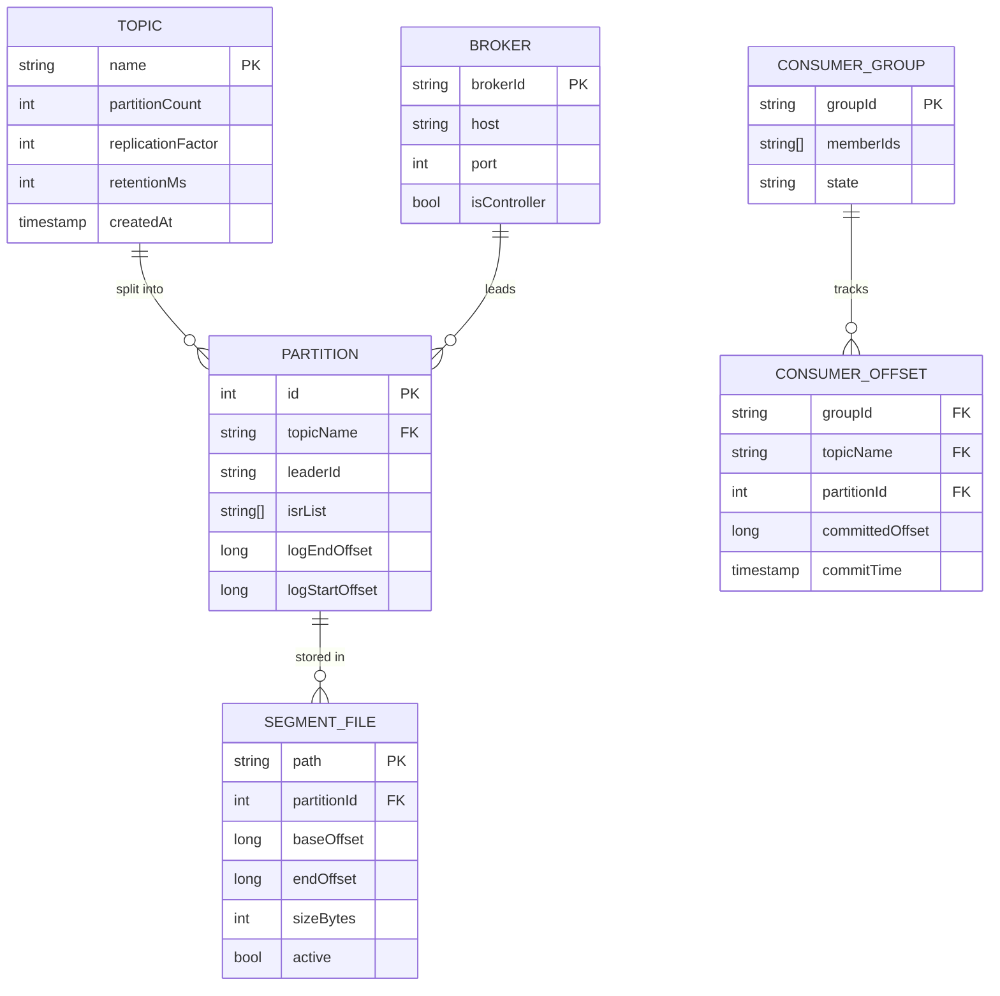
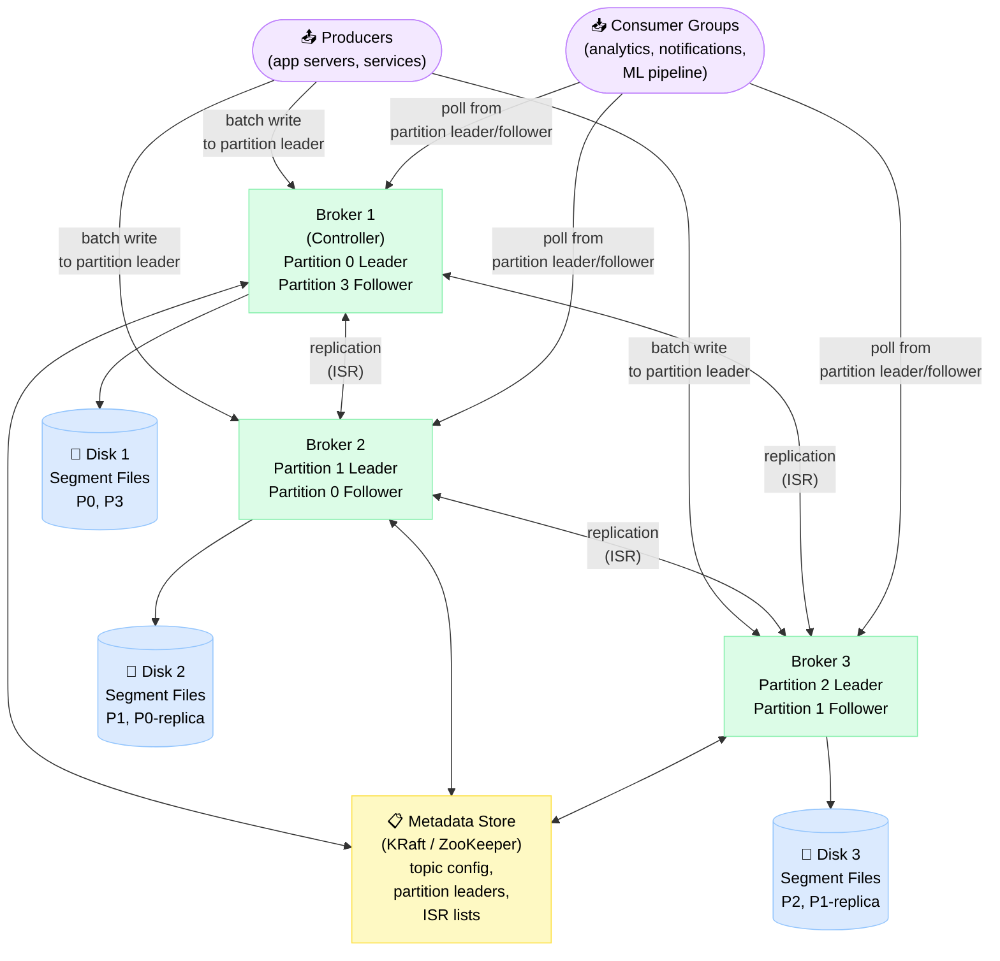
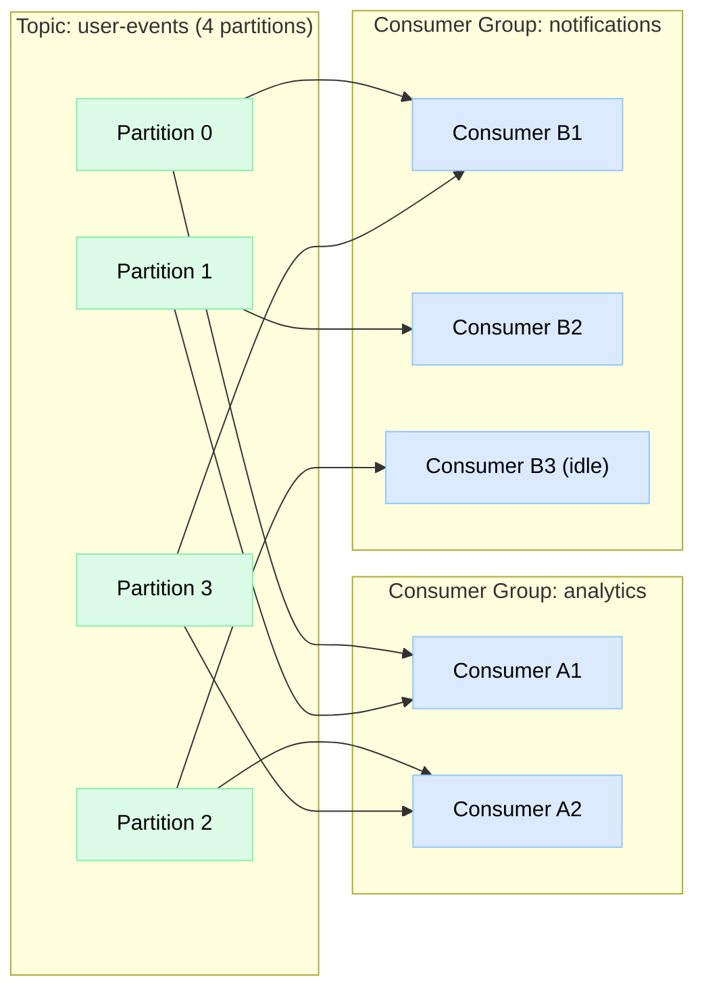

# Design Distributed Message Queue

> A Kafka-like distributed commit-log message queue that durably stores event streams, scales through partitioning, and supports multiple independent consumer groups replaying data at their own pace.

**Difficulty:** ⭐⭐⭐⭐⭐ · **Builds on:**
[Distributed Systems](../../Level-04-Distributed-Systems/README.md) ·
[Idempotency & Exactly-Once](../../Level-04-Distributed-Systems/07-Idempotency-and-Exactly-Once/README.md) ·
[Stream Processing](../../Level-07-Big-Data-and-Specialized/02-Stream-Processing/README.md)

---

## 1. 🎯 Problem & Scope

Traditional message queues (RabbitMQ) delete messages after delivery. A log-based message queue never deletes — it appends every message to an ordered, immutable log. Consumers track their own position (offset) and can replay from any point.

This enables **decoupling at scale**: producers don't know about consumers; consumers can join days later and catch up; different teams can consume the same event stream for entirely different purposes (analytics, notifications, ML training).

We're designing the internals of **Apache Kafka**: brokers, topics, partitions, replication with ISR, consumer groups, offset management, and delivery guarantees up to exactly-once.

**In scope:** message ingestion, partitioning, replication (ISR), consumer groups & offsets, retention, delivery semantics, controller & metadata.

**Out of scope:** Kafka Streams/ksqlDB (stream processing built on top), Schema Registry, Kafka Connect connectors.

---

## 2. 📋 Requirements

### Functional
- Producers publish messages to named **topics**
- Topics divided into **partitions** for parallelism
- Messages within a partition are **totally ordered** by offset
- Multiple **consumer groups** independently consume; each group tracks its own offsets
- Messages retained for configurable duration (default 7 days), regardless of consumption
- Consumers can **seek** to any offset (replay)
- Partition count and replication factor configurable per topic

### Non-Functional
- Write throughput: **1 M messages/s** per cluster (100-byte messages)
- End-to-end latency (producer → consumer): **< 10 ms** p99
- Durability: messages survive loss of up to `replication_factor - 1` brokers
- Ordering guarantee: **per-partition** total order
- Delivery semantics: at-least-once by default; exactly-once available
- Horizontal scale: add brokers without downtime

---

## 3. 🧮 Capacity Estimation

**Write throughput**
- 1 M messages/s × 1 KB avg = **1 GB/s** raw ingest
- With replication factor 3 → 3 GB/s total network writes across cluster
- Batch writes (producers batch 100 messages) → 10 000 batch writes/s per producer thread

**Storage**
- 1 GB/s × 7 days retention = **~600 TB** total cluster storage
- With 3× replication: **1.8 PB** raw disk
- Per broker (20 nodes): 1.8 PB / 20 = **90 TB** per broker → 10× 10 TB HDDs per broker
- Use sequential writes → HDDs are fine (sequential I/O ≈ 200 MB/s vs. random 2 MB/s)

**Partition count**
- 1 M msg/s; each partition handles ~50 000 msg/s → need **≥ 20 partitions per topic**
- Large topics: 1000+ partitions across 20 brokers = 50 partitions/broker

**Consumer groups**
- 10 consumer groups × 20 partitions = 200 consumer threads cluster-wide
- Each partition assigned to exactly 1 consumer per group → parallelism = min(consumers, partitions)

---

## 4. 🔌 API Design

```java
// Producer API
ProducerRecord<String, String> record = new ProducerRecord<>(
    "user-events",           // topic
    "user:123",              // key (determines partition via hash)
    "{\"event\":\"login\"}"  // value
);
producer.send(record, (metadata, ex) -> {
    // metadata.offset(), metadata.partition(), metadata.timestamp()
});

// Producer config for exactly-once
props.put("enable.idempotence", "true");
props.put("acks", "all");           // wait for all ISR replicas
props.put("retries", Integer.MAX_VALUE);

// Consumer API
consumer.subscribe(Arrays.asList("user-events"));
while (true) {
    ConsumerRecords<String, String> records = consumer.poll(Duration.ofMs(100));
    for (ConsumerRecord<String, String> record : records) {
        process(record.value());
    }
    consumer.commitSync();           // commit offsets after processing
}

// Seek to specific offset (replay)
consumer.seek(new TopicPartition("user-events", 0), 1_000_000L);

// Admin API (HTTP/CLI)
POST /v1/topics         { name: "user-events", partitions: 100, replicationFactor: 3 }
GET  /v1/topics/{name}  → { partitions: [...], configs: {...} }
GET  /v1/consumer-groups/{group}/offsets
```

---

## 5. 🗄️ Data Model



**Storage on broker disk:**
- Each partition = directory of **segment files** (default 1 GB each)
- Active segment is append-only; older segments immutable
- `.index` file alongside each `.log`: sparse offset-to-byte-position index (every 4096 bytes)
- `.timeindex`: sparse timestamp-to-offset index (for time-based seeks)
- Consumer offsets stored in special topic `__consumer_offsets` (Kafka internal topic, 50 partitions)

---

## 6. 🏗️ High-Level Architecture



**Walk-through (producer write):**
1. Producer fetches metadata (once, cached): learns Partition 0's leader is Broker 1.
2. Producer batches messages locally (up to `batch.size` bytes or `linger.ms` time).
3. Sends `ProduceRequest` to Broker 1 (leader of Partition 0).
4. Broker 1 appends to the active segment on disk (sequential write).
5. Followers (Broker 2, 3) fetch via `FetchRequest` (pull model) and append to their replicas.
6. Once all **ISR** replicas have the message, leader advances the **High Watermark (HW)**.
7. Broker 1 responds to producer with offset.
8. Consumer polls Broker 1 (or any ISR replica for `acks=all` messages up to HW).

---

## 7. 🔬 Deep Dives

### 7.1 The Append-Only Commit Log

The core abstraction is beautiful: a partition is just a **directory of files**, each a sequential byte stream of encoded messages.

```
/data/topics/user-events/partition-0/
    00000000000000000000.log    (segment: offsets 0 – 999 999)
    00000000000000000000.index
    00000000001000000000.log    (segment: offsets 1M – 1.999 999M)
    00000000001000000000.index
    00000000002000000000.log    (active segment, append-only)
    00000000002000000000.index
```

**Why sequential writes?** A modern HDD does **200 MB/s sequential** but only **~100 random writes/s** (7200 RPM). By only ever appending, Kafka saturates HDD throughput without SSDs.

**Log compaction (vs. time-based retention):** For topics that represent the latest state of a key (e.g., user settings), Kafka can run **log compaction** instead of time-based deletion: keep only the most recent message per key. The result is a compacted log that represents a full snapshot.

**Zero-copy reads:** When consumers read, Kafka uses the Linux `sendfile()` syscall to transfer data from the page cache directly to the network socket — no user-space copy. This saturates 10 GbE at ~1.2 GB/s with near-zero CPU.

### 7.2 Partitions, Consumer Groups & Offset Management

Partitions are the unit of parallelism. Within a consumer group, each partition is owned by exactly one consumer.



**Offset management:** Consumers commit their offsets to `__consumer_offsets` topic after processing. This enables:
- **At-most-once**: commit before processing (may lose messages if crash after commit, before process)
- **At-least-once**: commit after processing (may reprocess messages if crash after process, before commit)
- **Exactly-once**: write output and commit offset in a single atomic transaction

**Rebalancing:** When a consumer joins/leaves a group, the **group coordinator** (a broker) triggers a rebalance: all consumers rejoin, partitions re-assigned. During rebalance, consumption pauses. Kafka 2.4+ introduced **incremental cooperative rebalancing** to minimize pause time.

### 7.3 ISR Replication & Leader Election

**In-Sync Replicas (ISR)** = the set of replicas that are "caught up" with the leader (within `replica.lag.time.max.ms = 10 s`).

```
ISR for Partition 0: [Broker1 (leader), Broker2, Broker3]

Producer acks=all: message committed only when all ISR replicas have it
Producer acks=1:   message committed when leader writes it (may lose on leader crash)
Producer acks=0:   fire-and-forget (best throughput, possible loss)
```

**Leader failure → election:**
1. Controller (the broker elected as cluster controller via KRaft/ZooKeeper) detects broker death.
2. Controller picks the **first broker in ISR list** as new leader (ISR = guaranteed to have all committed messages).
3. Controller updates partition metadata in the metadata store.
4. All brokers refresh metadata; producers reconnect to new leader.

**Out-of-sync replica:** If Broker 3 lags > `replica.lag.time.max.ms`, it's removed from ISR. Writes proceed with ISR = [Broker1, Broker2]. When Broker 3 catches up, it rejoins ISR. This prevents a slow replica from blocking producers.

**Unclean leader election:** If all ISR replicas die, Kafka can optionally elect an out-of-ISR replica (`unclean.leader.election.enable=true`). This trades durability for availability — the elected replica may be missing committed messages. Default is `false` (prefer correctness).

### 7.4 Delivery Semantics & Exactly-Once

| Semantic | Config | Guarantee | Use case |
|---|---|---|---|
| At-most-once | acks=0 or commit-before-process | May lose messages | Metrics, best-effort logs |
| At-least-once | acks=all, commit-after-process | May duplicate | Most pipelines (deduplicate downstream) |
| Exactly-once | Idempotent producer + transactional API | No loss, no duplication | Payments, ledgers |

**Idempotent producer** (enables at-least-once → effectively-once for producer):
- Producer is assigned a `ProducerId (PID)` and sends a monotonically increasing `sequenceNumber` per partition.
- Broker deduplicates: if `sequenceNumber` already seen → ack success without re-writing.
- Handles network retries transparently.

**Transactional API** (full exactly-once across partitions and consumer offsets):
```java
producer.initTransactions();
producer.beginTransaction();
producer.send(new ProducerRecord<>("output-topic", key, value));
producer.sendOffsetsToTransaction(offsets, consumerGroup);
producer.commitTransaction();   // atomic: output written + offsets committed
```
Consumers with `isolation.level=read_committed` only see messages from committed transactions.

---

## 8. 📈 Scaling, Bottlenecks & Failure Modes

| Bottleneck | Symptom | Mitigation |
|---|---|---|
| Hot partition | One partition receives 90% of writes | Use message keys with better cardinality; custom partitioner; increase partition count |
| Controller overload | Slow leader elections; metadata delays | KRaft removes ZooKeeper bottleneck; controller is now a Raft group of 3+ brokers |
| Consumer lag | Consumer group falls behind producer | Add consumers (up to partition count); optimize consumer processing; scale downstream |
| Disk full | Broker stops accepting writes | Monitor disk; increase retention on hot topics to auto-delete; expand cluster |
| Rebalance storm | Slow consumer triggers frequent rebalances | Increase `session.timeout.ms`; use incremental cooperative rebalancing; optimize consumer poll loop |

**Failure modes:**
- **Broker crash (not controller)** → ISR replicas elect new leader in ~30 s (configurable); producer retries transparently; consumers lag temporarily.
- **Controller crash** → KRaft Raft group elects new controller in ~5 s; no data loss.
- **Network partition** → minority brokers become followers only; writes go to majority shard; heals on partition resolve.
- **Full ISR loss (all replicas dead)** → topic partition unavailable until a broker restarts; unclean election possible if configured.

---

## 9. ⚖️ Trade-offs & Alternatives

| Decision | Chosen | Alternative | Why chosen |
|---|---|---|---|
| Log model | Append-only commit log (pull) | Traditional queue (push, delete on ack) | Multiple consumers; replay capability; sequential I/O performance |
| Partition assignment | Producer-side (hash of key) | Broker-side round-robin | Key-based ordering; related messages co-located |
| Replication | ISR pull-based (followers pull from leader) | Synchronous push (leader pushes) | Pull handles slow followers gracefully; leader not blocked |
| Offset storage | `__consumer_offsets` topic (Kafka itself) | External DB (Redis, ZooKeeper) | Atomic commits; eliminates external dependency |
| Controller | KRaft (built-in Raft, Kafka 3.3+) | ZooKeeper | Eliminates ZooKeeper operational overhead; faster metadata propagation |

---

## 10. 🌐 How It's Actually Done

**Apache Kafka** (LinkedIn, 2011): the original paper "Kafka: a Distributed Messaging System for Log Processing" described the append-only log and pull-based consumer model. LinkedIn uses Kafka for >7 trillion messages/day.

**KRaft mode (Kafka 3.3+):** removes the ZooKeeper dependency entirely. The controller quorum is 3 brokers running Raft consensus. Metadata is stored in a dedicated `__cluster_metadata` topic, enabling much faster controller failover (~milliseconds vs. 30+ seconds with ZooKeeper).

**Confluent** (commercial Kafka): adds schema registry, Kafka Streams, ksqlDB, and Tiered Storage (offload old segments to S3, store only recent data on local disk).

**AWS Kinesis** takes a similar partition (shard) + offset approach but limits shard throughput to 1 MB/s write / 2 MB/s read and manages infrastructure for you.

**Redpanda** (2021): reimplements Kafka protocol compatibility from scratch in C++, using the Seastar framework (per-core threading, no mutexes). Benchmarks show 10× lower latency and simpler ops (no JVM tuning, no ZooKeeper).

---

## 11. 📝 Summary

| Aspect | Decision |
|---|---|
| Core abstraction | Append-only commit log per partition; immutable, sequential, zero-copy reads |
| Parallelism | Topics split into N partitions; each partition has exactly one leader at a time |
| Ordering | Total order per partition; no cross-partition ordering guarantee |
| Replication | ISR pull-based; leader advances HW only when all ISR members ack |
| Consumers | Pull model; consumer groups each track their own offsets independently |
| Exactly-once | Idempotent producer (dedup by PID+seq) + transactional atomic commit |
| Controller | KRaft Raft group (3 brokers); no ZooKeeper in Kafka 3.3+ |

The genius of Kafka is that an **append-only log** — the simplest possible durable data structure — turns out to be exactly the right abstraction for event streaming: it's fast (sequential I/O), replayable (seek to any offset), multi-consumer (each group tracks its own position), and naturally ordered within a partition.
