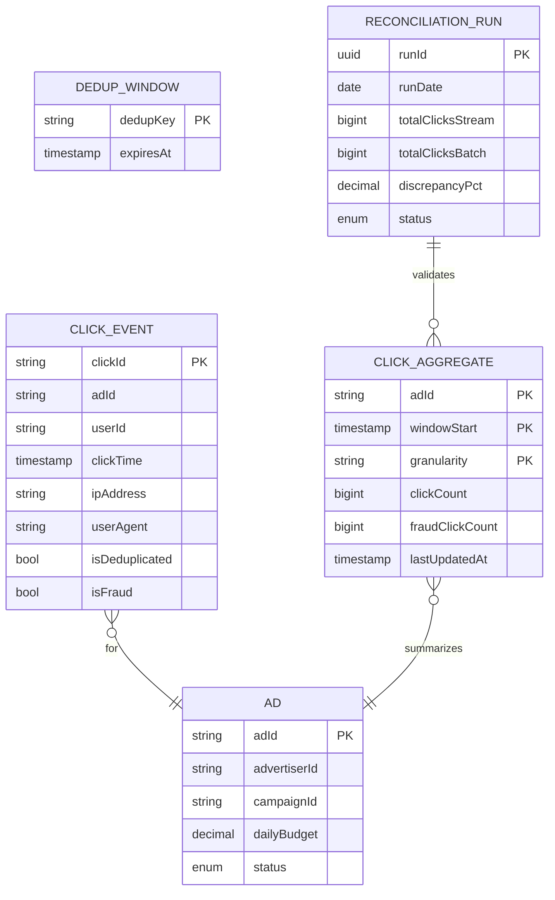
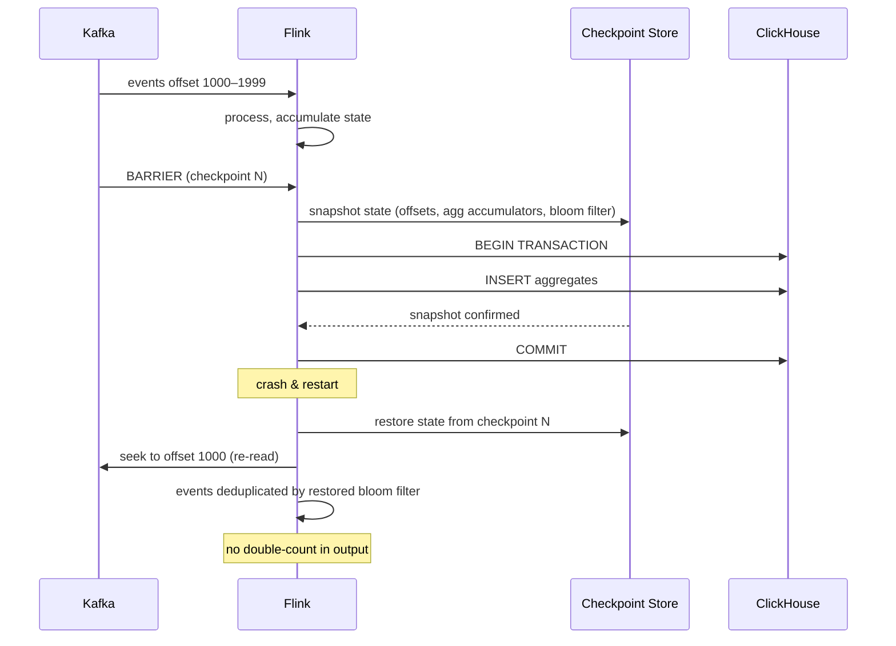
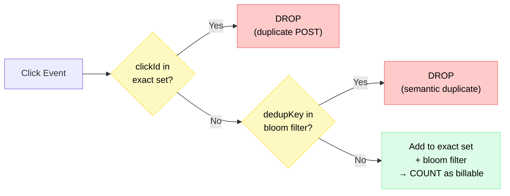
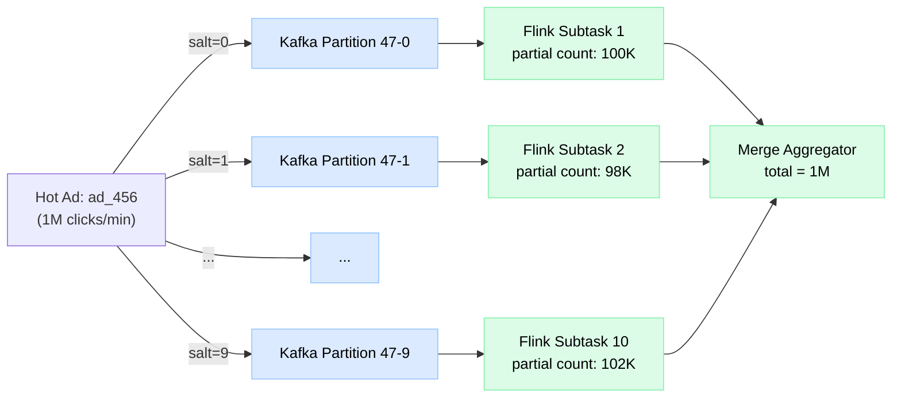
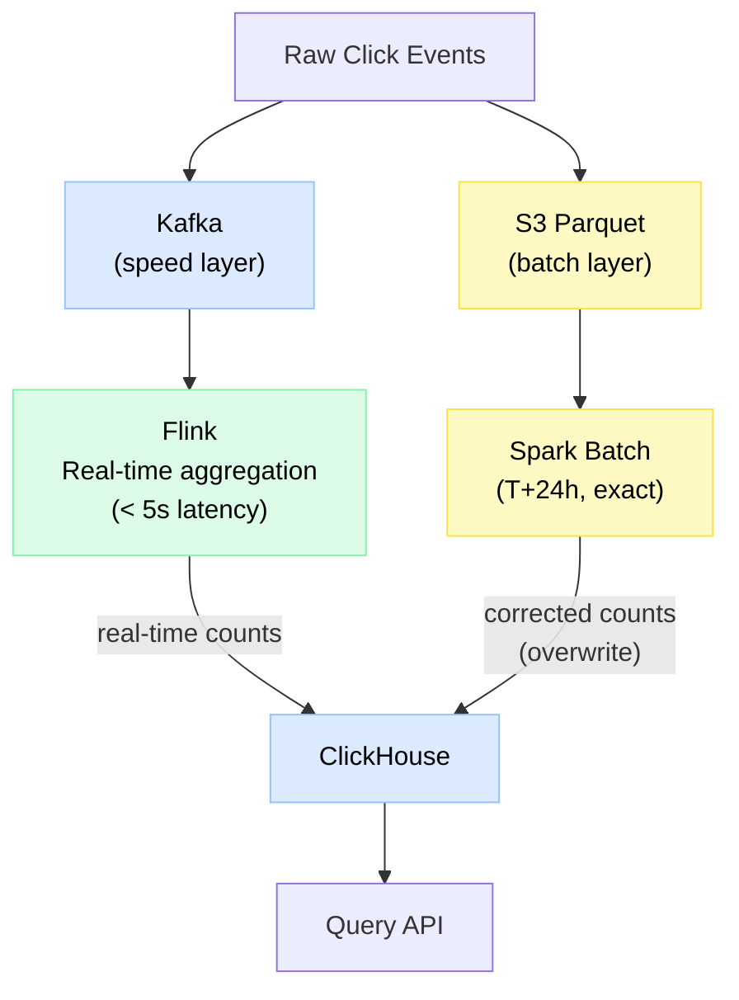

# Design Ad Click Aggregator

> A real-time system that ingests billions of ad click events per day, deduplicates them accurately (it's money!), and surfaces per-minute click counts to advertisers within seconds.

**Difficulty:** ⭐⭐⭐⭐⭐ · **Builds on:**
[Stream Processing](../../Level-07-Big-Data-and-Specialized/02-Stream-Processing/README.md) ·
[Idempotency & Exactly-Once](../../Level-04-Distributed-Systems/07-Idempotency-and-Exactly-Once/README.md) ·
[Distributed Message Queue](../19-Distributed-Message-Queue/README.md)

---

## 1. 🎯 Problem & Scope

Ad click counting is deceptively simple ("just count clicks") but is one of the most financially critical data pipelines in tech. Google and Meta's revenue depends on it. A 1% overcount means advertisers overpay by millions. A crash means refunds and contract violations.

The three hard problems:
1. **Volume** — billions of clicks/day arrive in bursty spikes (a viral post triggers a celebrity-ad click storm).
2. **Accuracy** — click deduplication (bots, double-clicks, page refreshes all generate duplicate events).
3. **Latency** — advertisers want to see spend and click counts within seconds, not hours.

**In scope:** click ingestion, deduplication/fraud filtering, windowed aggregation (per minute/hour/day), real-time query API, batch reconciliation (lambda architecture).

**Out of scope:** ad serving/ranking, bid management, view-through attribution, offline ML training pipelines.

---

## 2. 📋 Requirements

### Functional
- Ingest click events: `{clickId, adId, userId, timestamp, ipAddress, userAgent}`
- Deduplicate: same user clicking same ad within 1 minute = 1 billable click
- Aggregate click counts per `(adId, minute)` window
- Query API: "How many clicks did ad X get in the last 5 minutes?"
- Dashboard: real-time chart (≤ 5 s latency from click to visible count)
- Nightly batch reconciliation to correct any real-time inaccuracies
- Fraud filtering: filter bot clicks before billing

### Non-Functional
- **10 B clicks/day** → ~115 000 clicks/s average; **500 000 clicks/s** peak (viral event)
- End-to-end latency from click to aggregated count visible: **< 5 s** p99
- Aggregation accuracy: **< 0.1% error** vs. batch ground truth
- Exactly-once counting — no double-billing
- Query API p99: **< 100 ms**
- 99.99% availability for ingestion; 99.9% for query

---

## 3. 🧮 Capacity Estimation

**Click ingestion**
- 10 B clicks/day ÷ 86 400 s = **115 000 clicks/s** average
- Peak (Super Bowl ad): 4× → **460 000 clicks/s**
- Each click event: 200 bytes → **23 MB/s** average, **92 MB/s** peak

**Kafka sizing**
- 92 MB/s × 3× replication = **276 MB/s** Kafka write throughput
- At 200 MB/s/broker → **2 Kafka brokers** minimum; use 6 for headroom
- 10 B events × 200 bytes × 7-day retention = **14 TB** Kafka storage

**Deduplication window**
- Dedup key = `hash(adId + userId + floor(timestamp / 60s))`
- Active dedup keys: 115 000 clicks/s × 60 s window × 10% unique = ~690 000 keys
- Each key: 32 bytes → **~22 MB** for dedup bloom filter — fits in Flink operator state

**Aggregation output**
- 100 000 active ads × 1 440 minutes/day = **144 M rows/day** in time-series store
- Each row: 64 bytes → **9.2 GB/day** — trivial for ClickHouse/Druid

**Nightly batch**
- 10 B rows × 200 bytes = 2 TB raw; Parquet compressed ≈ **200 GB** → S3

---

## 4. 🔌 API Design

```http
# Click event ingestion (fire-and-forget from ad SDK)
POST /v1/clicks
Body: {
  "clickId": "c_abc123",
  "adId": "ad_456",
  "userId": "u_789",        // hashed/anonymized for privacy
  "timestamp": 1722470400,
  "ipAddress": "203.0.113.1",
  "userAgent": "Mozilla/5.0 ...",
  "pageUrl": "https://example.com/article"
}
→ 202 Accepted   (async — no sync processing)

# Query: click counts for an ad
GET /v1/ads/{adId}/clicks?start=2025-08-01T10:00:00Z&end=2025-08-01T11:00:00Z&granularity=minute
→ 200 {
    "adId": "ad_456",
    "granularity": "minute",
    "data": [
      { "window": "2025-08-01T10:00:00Z", "clicks": 1423 },
      { "window": "2025-08-01T10:01:00Z", "clicks": 1891 },
      ...
    ]
  }

# Real-time: last N minutes (served from cache)
GET /v1/ads/{adId}/clicks/realtime?minutes=5
→ 200 { "clicks": 8234, "updatedAt": "2025-08-01T10:05:02Z" }

# Budget alert threshold
PUT /v1/ads/{adId}/alert
Body: { "clickThreshold": 10000, "windowMinutes": 60 }
→ 200 OK
```

---

## 5. 🗄️ Data Model



**Storage choices:**
- **Kafka** — raw click event stream (7-day retention); source of truth for replay
- **Redis (Bloom filter / Set per window)** — deduplication within 1-minute window
- **Apache Flink** — stateful stream processor; manages dedup state, windowed aggregates
- **ClickHouse** — columnar OLAP store for aggregated counts; sub-100ms analytical queries
- **Redis (aggregation cache)** — latest 1-hour aggregates cached for low-latency API
- **S3 + Parquet** — raw click events for nightly batch reconciliation (Spark job)

---

## 6. 🏗️ High-Level Architecture

```mermaid
flowchart TD
    Browsers(["🌐 Ad SDKs<br/>in Browsers / Apps"])
    LB["Load Balancer<br/>(anycast, geo-routed)"]
    IS["Ingestion Service<br/>(stateless, ×100 nodes)"]
    Kafka["📨 Kafka Cluster<br/>Topic: raw-clicks<br/>100 partitions<br/>(keyed by adId)"]
    Flink["⚡ Apache Flink<br/>Stream Processor<br/>1. Dedup filter<br/>2. Fraud filter<br/>3. Windowed aggregation<br/>4. Exactly-once sink"]
    CH["🏛️ ClickHouse<br/>click_aggregates table<br/>(OLAP, columnar)"]
    Redis["⚡ Redis<br/>Realtime agg cache<br/>+ dedup bloom filter"]
    QueryAPI["Query API<br/>Service"]
    Alert["Alert<br/>Service"]
    S3[("☁️ S3<br/>raw-clicks/year=.../month=.../"))]
    Spark["🔥 Spark Batch<br/>(nightly reconciliation)"]
    Dashboard(["📊 Advertiser<br/>Dashboard"])

    Browsers -->|"POST /v1/clicks<br/>fire-and-forget"| LB
    LB --> IS
    IS -->|"produce to partition<br/>= hash(adId)"| Kafka
    IS -->|"async copy"| S3
    Kafka --> Flink
    Flink -->|"clean aggregates<br/>exactly-once"| CH
    Flink -->|"live counts<br/>(last 5 min)"| Redis
    Flink -->|"budget alerts"| Alert
    CH --> QueryAPI
    Redis --> QueryAPI
    S3 --> Spark
    Spark -->|"corrected aggregates<br/>(T+1 day)"| CH
    QueryAPI --> Dashboard

    classDef store fill:#dbeafe,stroke:#93c5fd,color:#000
    classDef svc fill:#dcfce7,stroke:#86efac,color:#000
    classDef infra fill:#fef9c3,stroke:#fde047,color:#000
    classDef ext fill:#f3e8ff,stroke:#c084fc,color:#000

    class CH,Redis,S3 store
    class IS,Flink,Spark,QueryAPI,Alert svc
    class LB,Kafka infra
    class Browsers,Dashboard ext
```

**Walk-through (click event, hot ad):**
1. Browser SDK fires `POST /v1/clicks` immediately on click; `202 Accepted` in < 5 ms (no sync processing).
2. Ingestion Service writes to Kafka partition `hash(adId) % 100` — all clicks for the same ad go to the same partition (preserves order, simplifies dedup).
3. Flink consumer group reads from Kafka. For each event:
   a. **Dedup filter**: check Flink operator state (bloom filter keyed by `hash(adId+userId+minuteBucket)`). If seen → discard. Else → mark and pass through.
   b. **Fraud filter**: rule-based checks (IP rate limit, user-agent blacklist, click velocity). ML model score (async, < 1 ms via embedded model).
   c. **Windowed aggregator**: tumbling 1-minute window, keyed by `adId`. Accumulate count.
4. At window close (every 60 s), Flink writes aggregate to ClickHouse and updates Redis with latest 5-minute rolling count.
5. Query API serves dashboard from Redis (< 1 ms) for real-time views; from ClickHouse for historical queries.

---

## 7. 🔬 Deep Dives

### 7.1 Exactly-Once Counting — No Double-Billing

The stream processor may crash and restart, replaying events from the last Kafka checkpoint. Without exactly-once semantics, reprocessed events would double-count clicks — an overcharge to advertisers.

**Flink's exactly-once mechanism:**
- Flink periodically **checkpoints** its operator state (dedup bloom filter, aggregation accumulators) to S3.
- Checkpoint is triggered by injecting a **barrier** into every Kafka partition simultaneously.
- When all operators have seen the barrier → checkpoint is complete → Flink commits Kafka offsets.
- On recovery: restore state from last checkpoint; re-read Kafka from the checkpointed offset (at-least-once re-delivery). But since aggregation state is also restored, re-read events are deduplicated by the restored bloom filter.
- Output to ClickHouse uses **two-phase commit (2PC)**: Flink writes to a staging table within a transaction; commits only after checkpoint succeeds.



See [Idempotency & Exactly-Once](../../Level-04-Distributed-Systems/07-Idempotency-and-Exactly-Once/README.md) for the general pattern.

### 7.2 Click Deduplication

A user who double-clicks, refreshes, or has a buggy SDK fires multiple `clickId`s for what should be one billable event. Bots fire thousands.

**Deduplication key:** `SHA256(adId + userId + floor(timestamp / 60))` — same user, same ad, same minute = same key.

**Bloom filter for efficiency:**
- A Bloom filter says "definitely not seen" or "probably seen" — no false negatives, some false positives.
- Size: for 1 M dedup keys/minute and 0.1% false positive rate → **~14 MB** per 1-minute window.
- Flink maintains a rolling window of 3 bloom filters (current minute, previous minute, two minutes ago). Events checked against all three.
- On minute rollover: discard oldest, create fresh filter.

**clickId dedup (exact):** For the exact same `clickId` (e.g., SDK retried the POST), maintain an exact set in Flink's RocksDB-backed state store with 5-minute TTL. Bloom filter handles approximate semantic dedup; exact clickId set handles protocol-level dedup.



### 7.3 Hot Partition / Celebrity Ad Problem

A celebrity posts a sponsored story. 5 million people click in 60 seconds. All clicks route to the same Kafka partition (`hash(adId) % 100` = partition 47). Partition 47's consumer is overwhelmed.

**Mitigations:**

1. **Partition key salting:** for hot ads, append a random suffix to the partition key: `hash(adId + random(0,9))` → 10× parallelism. The Flink aggregation layer reduces across all 10 sub-partitions at window close.

2. **Dynamic repartitioning:** Ingestion Service detects hot ads (> threshold clicks/s) and switches to salted key at runtime. A separate Kafka topic `hot-ads-repartitioned` receives their events.

3. **Flink operator chaining:** the aggregation operator is co-located with the dedup operator on the same task slot for hot ad partitions, eliminating network shuffle.



### 7.4 Lambda Architecture — Real-Time + Batch Reconciliation

Real-time stream processing is fast but can have subtle bugs: a Flink operator state corruption, a network glitch that skips Kafka messages, a bloom filter false positive that drops valid clicks. At billing scale, even 0.01% error matters.

**Lambda architecture** runs two parallel pipelines:
- **Speed layer** (Flink): low latency, approximate, used for dashboards and real-time alerts
- **Batch layer** (Spark on S3): runs nightly, processes raw clicks from S3 (written in parallel by Ingestion Service), produces ground-truth aggregates
- **Serving layer** (ClickHouse): serves both; batch results overwrite stream results for historical windows



**Reconciliation flow:**
1. Spark reads all clicks for `date=T` from S3.
2. Applies same dedup logic (exact, using full day's clickId set — no bloom filter false positives).
3. Computes exact per-(adId, minute) counts.
4. Compares with Flink stream counts already in ClickHouse.
5. Discrepancy > 0.1% → overwrite with Spark counts; alert on-call.
6. Advertiser invoices generated from **Spark counts** (ground truth), never from stream.

---

## 8. 📈 Scaling, Bottlenecks & Failure Modes

| Bottleneck | Symptom | Mitigation |
|---|---|---|
| Hot Kafka partition | One consumer thread maxed out | Key salting for hot ads; increase partition count |
| Flink state size | Dedup bloom filter grows unbounded | Rolling 3-window filter; RocksDB-backed state with TTL |
| ClickHouse write throughput | Aggregation inserts back up | Batch inserts; async insert mode; OLAP tuned for bulk writes |
| Redis hot key (ad realtime) | Single key for top ad hammered | Fan out: cache per ad at different TTLs; local L1 in Query API |
| S3 small files | Millions of tiny Parquet files → slow Spark | Ingestor batches by time window; Spark merge job compacts daily |

**Failure modes:**
- **Flink job crash** → restores from last checkpoint (every 60 s); replays Kafka from checkpoint offset; dedup state restored → no double-count.
- **Kafka broker failure** → ISR replication; leader election in ~30 s; producer retries; possible duplicate events during retry → deduplicated by Flink.
- **ClickHouse node failure** → ClickHouse replica serves reads; writes queued; eventual consistency within seconds.
- **S3 unavailable** → Ingestion Service buffers in local disk (bounded); Spark batch delayed; stream aggregates still available.

---

## 9. ⚖️ Trade-offs & Alternatives

| Decision | Chosen | Alternative | Why chosen |
|---|---|---|---|
| Partition key | `adId` (with salting for hot ads) | Random (round-robin) | Same-ad events co-located for efficient windowed aggregation |
| Dedup | Bloom filter (approximate) + exact clickId set | Only exact (Redis SET) | Bloom filter scales to billions of events; exact set for protocol dedup |
| Stream processor | Apache Flink | Spark Structured Streaming | Flink has lower latency (true streaming vs. micro-batch); better state management |
| Ground truth | Spark batch on S3 (lambda) | Flink exactly-once only | Batch provides true correctness; Flink exactly-once is complex and hard to audit |
| Time-series store | ClickHouse | Druid, TimescaleDB | ClickHouse: excellent compression, fast aggregation queries, easy ops |

---

## 10. 🌐 How It's Actually Done

**Google Ads** uses a system called **Dremel** (now BigQuery) for offline reconciliation of ad metrics. Their real-time pipeline uses **Pub/Sub → Dataflow (Flink-equivalent) → Bigtable** for low-latency counts.

**Meta (Facebook Ads):** Described in "Scuba: Diving into Data at Facebook" — a real-time aggregation store that ingests ~1 M events/s per table. Their counting pipeline uses approximate counting (HyperLogLog for unique users) alongside exact dedup for billing.

**Twitter** (pre-acquisition) published details of their **EventBus** system — a Kafka-like infrastructure that powers their analytics pipeline, including ad click counting for Twitter Ads.

**ClickHouse** is widely used in ad tech for aggregation queries. Companies like Cloudflare, Contentsquare, and many DSPs use it specifically for its exceptional performance on `GROUP BY adId, windowStart` queries — the exact pattern of this system.

**Flink exactly-once** was introduced in Flink 1.4 (2017) with two-phase commit sinks. Production deployments at Alibaba (using Flink for Double 11 Singles' Day at 1 B+ events/s) validate the approach at the highest scales.

---

## 11. 📝 Summary

| Aspect | Decision |
|---|---|
| Ingestion | Stateless ingestion → Kafka (partitioned by adId) + S3 (raw for batch) |
| Dedup | Bloom filter (semantic, per minute window) + exact clickId set (protocol dedup) |
| Stream processing | Flink with exactly-once checkpointing + 2PC sink to ClickHouse |
| Hot ad | Key salting → N parallel Kafka partitions → Flink merge at window close |
| Real-time API | Flink → Redis (≤ 5s lag); ClickHouse for historical queries |
| Ground truth | Nightly Spark batch on S3 Parquet → overwrites stream aggregates in ClickHouse |
| Billing | Always billed from Spark batch counts (exact); stream counts are advisory only |

The decisive architectural choice is the **lambda architecture**: accept that real-time is fast-but-approximate, batch is slow-but-exact, and bill from the exact number. This separates the product requirement (advertisers see near-real-time data) from the financial requirement (they're charged the right amount), letting you optimize each path independently.
