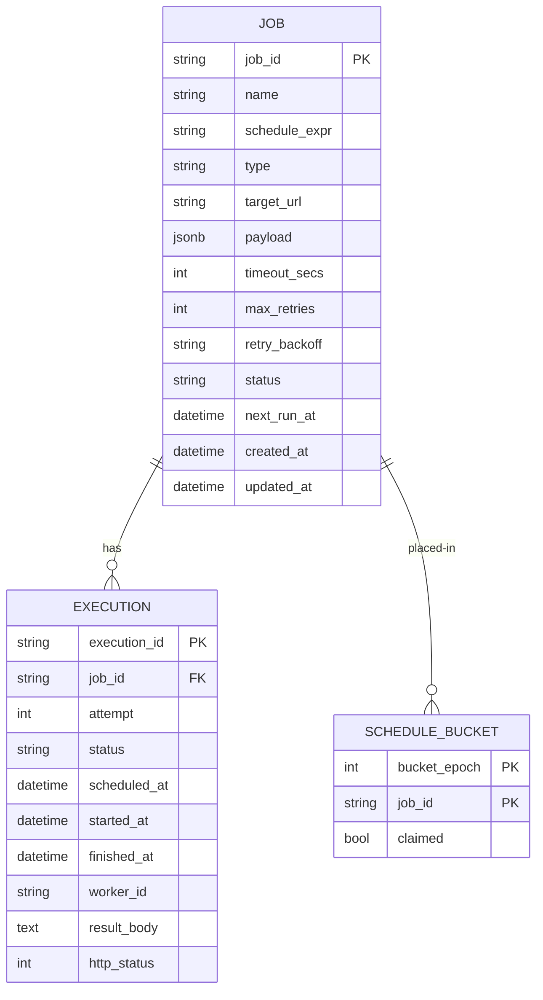
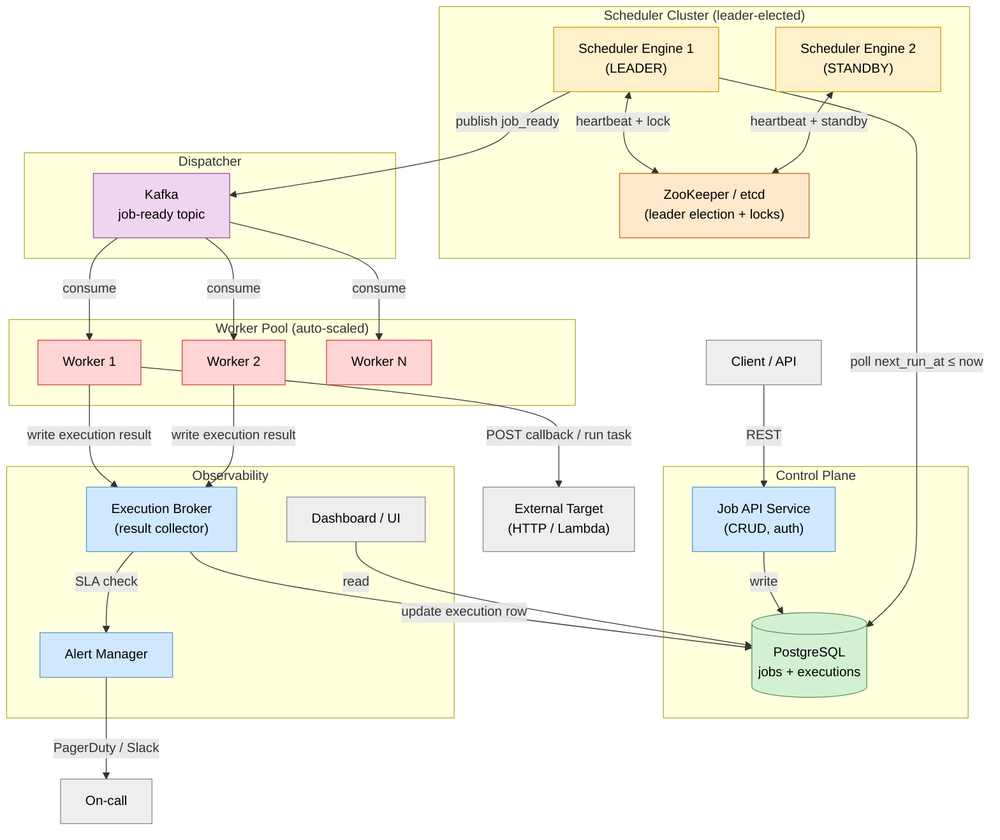
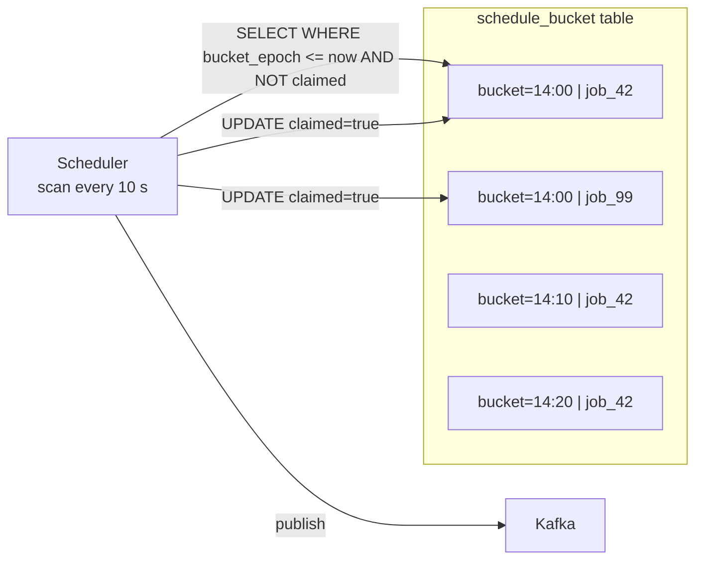
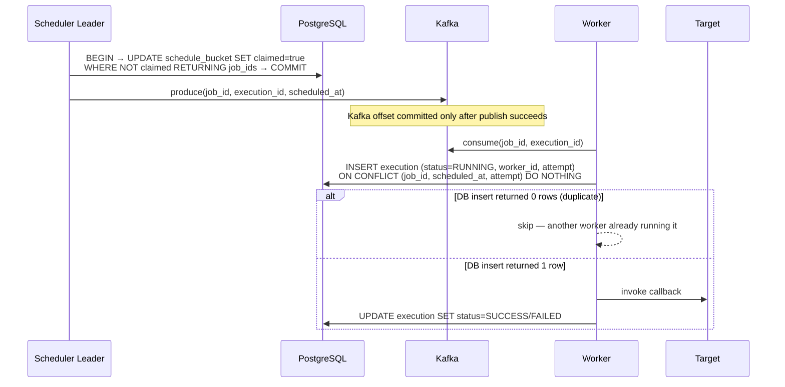
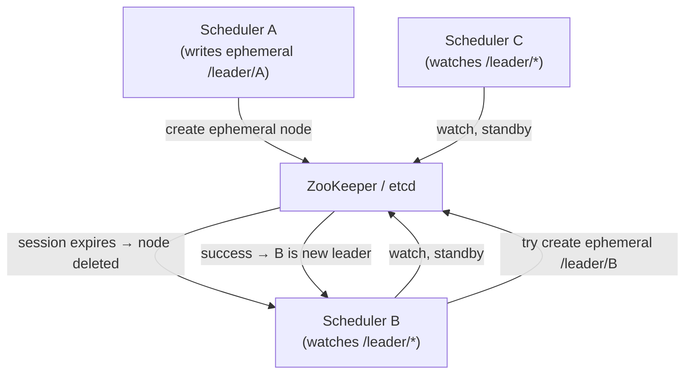

# Design Distributed Job Scheduler

> A fault-tolerant, horizontally scalable system that executes one-time and recurring (cron) jobs reliably across a worker pool — exactly once, on time, every time.

**Difficulty:** ⭐⭐⭐⭐⭐ · **Builds on:**
[Distributed Transactions](../../Level-04-Distributed-Systems/04-Distributed-Transactions/README.md) ·
[Leader Election](../../Level-04-Distributed-Systems/05-Leader-Election/README.md) ·
[Idempotency & Exactly-Once](../../Level-04-Distributed-Systems/07-Idempotency-and-Exactly-Once/README.md) ·
[Message Queues](../../Level-03-Communication/04-Message-Queues/README.md) ·
[Stream Processing](../../Level-07-Big-Data-and-Specialized/02-Stream-Processing/README.md)

---

## 1. 🎯 Problem & Scope

Every non-trivial system needs scheduled work: send a weekly digest email, charge a subscription at renewal time, purge expired sessions nightly, retry a failed payment in 30 minutes. A distributed job scheduler replaces Unix cron on a single machine with a cluster-wide service that:

- Accepts **one-time** jobs (run at epoch T) and **recurring** jobs (run every cron expression).
- **Guarantees** each job fires **at least once**, and with idempotency guards — effectively **exactly once** from the business perspective.
- Scales to **millions of registered schedules** and **hundreds of thousands of executions/day**.
- Gives operators **visibility**: execution history, logs, retries, alerting on missed jobs.

Real analogues: **Apache Airflow**, **Quartz Scheduler**, **Google Cloud Scheduler**, **Uber Cadence / Temporal**, **Amazon EventBridge Scheduler**.

---

## 2. 📋 Requirements

### Functional
- Register a job: name, cron expression or ISO-8601 timestamp, HTTP callback or worker task type, payload, max retries, timeout.
- Update / delete / pause / resume a job.
- Trigger a job manually.
- Retrieve job history and execution status.
- Support recurring jobs (cron-style, down to 1-minute granularity) and one-time delayed jobs.

### Non-Functional
- **Scale:** 10 million registered jobs, peak 50,000 executions per minute.
- **Timeliness:** fire within ≤5 s of scheduled time (p99).
- **Reliability:** zero missed fires during scheduler node failures; at-least-once delivery.
- **Durability:** job definitions and execution records survive full cluster restarts.
- **Availability:** 99.99 % uptime; no SPOF.
- **Observability:** per-job history, alerting on SLA violations.

---

## 3. 🧮 Capacity Estimation

```
Registered jobs:     10,000,000
Avg executions/day:  20 per job  →  200,000,000 executions/day
Peak:                200M / 86,400 s  ≈  2,315 exec/s  →  round to 50,000 exec/min (bursty)

Schedule scan interval: 10 s buckets
Jobs due per 10 s:  50,000 / 6  ≈  8,333 jobs per tick

Storage — job definitions:
  1 row ≈ 500 B (schedule, payload, metadata)
  10M × 500 B = 5 GB   → fits in a modern DB, well-indexed

Storage — execution history:
  200M rows/day, retain 90 days = 18 B rows
  1 row ≈ 200 B  →  18 B × 200 B = 3.6 TB  (partitioned by day, archived to cold storage)

Throughput to workers:
  50,000 exec/min  →  833 exec/s
  Assuming avg job payload 2 KB  →  1.7 MB/s  (trivial for a message broker)
```

---

## 4. 🔌 API Design

```http
# Register a job
POST /v1/jobs
{
  "name": "weekly-digest",
  "schedule": "0 9 * * MON",          // cron expression OR
  "run_at": "2025-09-01T14:00:00Z",   // one-time
  "type": "HTTP_CALLBACK",
  "target": "https://api.example.com/send-digest",
  "payload": { "template": "weekly" },
  "timeout_secs": 30,
  "max_retries": 3,
  "retry_backoff": "EXPONENTIAL"
}
→ 201 { "job_id": "job_9f3a...", "next_run_at": "2025-09-01T09:00:00Z" }

# Retrieve job
GET /v1/jobs/{job_id}
→ 200 { "job_id", "name", "schedule", "status": "ACTIVE", "next_run_at", ... }

# List executions
GET /v1/jobs/{job_id}/executions?limit=50&cursor=<token>
→ 200 { "executions": [ { "execution_id", "status", "started_at", "finished_at", "attempt" } ] }

# Manually trigger
POST /v1/jobs/{job_id}/trigger
→ 202 { "execution_id": "exec_7c2b..." }

# Pause / Resume / Delete
PATCH /v1/jobs/{job_id}   { "action": "PAUSE" | "RESUME" }
DELETE /v1/jobs/{job_id}
```

---

## 5. 🗄️ Data Model



**Storage choices:**
- **Job definitions** — PostgreSQL (strong consistency, ACID, rich queries). Indexed on `(status, next_run_at)`.
- **Schedule buckets** — PostgreSQL (same DB, row-level locking for claim).
- **Execution history** — PostgreSQL time-partitioned table (partition by day); offload partitions > 30 days to S3/Parquet for analytics.
- **Distributed locks** — Redis (`SET NX PX`) or ZooKeeper ephemeral nodes.
- **Work queue** — Kafka or SQS (durable, replay-safe).

---

## 6. 🏗️ High-Level Architecture



**Walk-through:**
1. **Register** — client POSTs to Job API; row written to PostgreSQL with computed `next_run_at`.
2. **Pre-populate buckets** — the Scheduler Engine (leader only) periodically scans jobs and inserts rows into `schedule_bucket` for the next N minutes (a "look-ahead window").
3. **Tick loop** — every 10 s, the leader scans `schedule_bucket` for `bucket_epoch ≤ now AND claimed = false`, atomically claims rows (UPDATE … WHERE claimed = false RETURNING …), and publishes one Kafka message per job to the `job-ready` topic.
4. **Worker consumption** — workers pull from Kafka, invoke the target (HTTP callback, Lambda, gRPC), write result to the Execution Broker.
5. **Result collection** — Execution Broker updates the execution row; on failure schedules a retry message with exponential backoff.
6. **Leader failover** — if the leader misses its ZooKeeper heartbeat, a standby promotes itself in <30 s; unclaimed bucket rows are picked up on the next tick.

---

## 7. 🔬 Deep Dives

### 7.1 Efficient Due-Job Discovery — Timing Wheel vs. DB Scan

A naive `SELECT * FROM jobs WHERE next_run_at <= NOW()` on 10 M rows every second is a disaster. Two better approaches:

**Approach A — Time-Bucketed DB (used here)**
Pre-materialise `schedule_bucket` rows for a 15-minute look-ahead. Each bucket is keyed on `(bucket_epoch, job_id)`. The scanner only touches future rows within the window — a tiny index scan on `bucket_epoch`.



**Approach B — Hierarchical Timing Wheel (in-memory, used by Netty, Kafka)**
A ring buffer of 512 slots, each representing a 100 ms tick. Jobs are inserted into `slot = (fire_time / tick) % slots`. On each tick, drain the current slot. For delays > ring size, cascade through higher-order wheels (minutes → hours). This achieves O(1) insert and O(1) expiry but requires durable state elsewhere.

**Winner for this design:** Time-bucketed DB wins for correctness and durability; timing wheel can augment as an in-memory acceleration layer.

---

### 7.2 Exactly-Once Execution with Distributed Locks

AT-LEAST-ONCE is easy (just retry). EXACTLY-ONCE across crashes requires:



The `(job_id, scheduled_at, attempt)` unique constraint is the idempotency key. If the worker crashes after starting but before writing SUCCESS, the Execution Broker detects the RUNNING row has exceeded `timeout_secs` and enqueues a retry with `attempt+1`.

**Visibility timeout pattern (similar to SQS):** Kafka consumer commits offset only after the job result is persisted. If the worker crashes mid-execution, Kafka re-delivers to another worker; the DB unique constraint prevents double execution.

---

### 7.3 Leader Election & Scheduler High Availability



- Each scheduler node creates an ephemeral node in ZooKeeper on startup.
- The node with the **lowest sequence number** (or whichever wins the CREATE race) is leader.
- If the leader crashes, its session expires in `session_timeout` (typically 10–30 s), triggering automatic standby promotion.
- To prevent two leaders ("split-brain"), the DB `claimed` flag plus a **fencing token** (monotonically increasing term from ZooKeeper) ensures stale leaders' writes are rejected.

---

### 7.4 Retry, Backoff, and Dead-Letter Handling

```
Attempt 1: immediate
Attempt 2: +30 s (base_delay × 2^0)
Attempt 3: +60 s (base_delay × 2^1)
Attempt 4: +120 s + jitter
...
Max attempts reached → move to Dead-Letter Queue (DLQ)
```

- Jitter (random 0–30 %) avoids thundering-herd retries.
- DLQ is a separate Kafka topic; on-call is alerted; operator can replay from DLQ after root-cause fix.
- Hard timeout (wall-clock deadline) overrides retries — jobs past their deadline are not retried even if under max attempts.

---

## 8. 📈 Scaling, Bottlenecks & Failure Modes

| Bottleneck | Mitigation |
|---|---|
| DB scan on 10 M jobs | `schedule_bucket` look-ahead + index on `(claimed, bucket_epoch)` |
| Single scheduler leader throughput | Partition jobs by `job_id % N` — N schedulers each own a partition shard |
| Kafka consumer lag during spike | Auto-scale worker pods; Kafka partition count = 100 to allow parallel consumers |
| Worker HTTP callback timeouts | Per-job configurable timeout; worker releases Kafka offset only on completion |
| Missed fires during DB failover | `schedule_bucket` rows persist; after failover, new leader re-scans and picks up unclaimed rows |
| Clock skew between nodes | Use DB server time (`NOW()`) as the reference clock, never local system time |
| Hot partitions (many jobs at :00) | Add sub-second jitter at registration time to spread load |

**Failure modes checklist:**
- Scheduler leader crash → ZK session expires, standby promotes in <30 s, at most one missed 10-s tick.
- Worker crash mid-job → Kafka re-delivers; idempotency key prevents double execution.
- DB primary failure → PostgreSQL failover (Patroni), ~30 s downtime; scheduler stalls but resumes.
- Target unreachable → retry with backoff → DLQ after max_retries.
- Runaway job (infinite loop) → `timeout_secs` triggers SIGKILL on worker; execution recorded as TIMEOUT.

---

## 9. ⚖️ Trade-offs & Alternatives

| Decision | Chosen | Alternative | Why chosen |
|---|---|---|---|
| Schedule store | PostgreSQL + bucket table | Redis sorted set (ZADD job score=fire_time) | DB gives ACID; Redis is faster but needs separate persistence |
| Queue | Kafka | SQS / RabbitMQ | Kafka replay is key for debugging; higher throughput |
| Leader election | ZooKeeper | etcd / DB-based advisory lock | ZooKeeper is battle-tested; etcd is a modern alternative with similar guarantees |
| Worker isolation | Kubernetes pods | Threads in same process | Pod isolation prevents one runaway job from starving others |
| Cron parsing | Server-side next_run_at | Store raw cron, evaluate per tick | Pre-computed `next_run_at` makes DB queries trivial |

---

## 10. 🌐 How It's Actually Done

**Apache Airflow** uses a Python-based scheduler that polls a PostgreSQL/MySQL metadata DB. Airflow 2.x introduced a HA scheduler using optimistic locking on a `dag_run` table — multiple schedulers race to claim DAG runs.

**Quartz Scheduler** (Java) uses a `QRTZ_TRIGGERS` table with a DB advisory lock (`LOCK TABLE`) to claim triggers. Every scheduler node runs the same SQL; the one that wins the lock fires the job.

**Google Cloud Scheduler** is a fully managed service backed by an internal globally distributed cron system. Jobs are stored in Spanner (for global consistency). The scheduler uses Google's Chubby (similar to ZooKeeper) for leader election per region.

**Uber Cadence / Temporal** goes further: instead of plain job scheduling, it implements *durable workflows* — long-running code that survives process restarts by replaying an event log. Job state is captured as a Workflow History, enabling exactly-once semantics natively. This is the gold standard for complex retry/compensation logic.

**Amazon EventBridge Scheduler** stores schedules in DynamoDB, uses kinesis streams internally to distribute triggers to workers, and guarantees at-least-once delivery with SQS-backed retry.

---

## 11. 📝 Summary

A production-grade distributed job scheduler rests on four pillars:

1. **Durable schedule store** with efficient due-job discovery (time-bucketed look-ahead or timing wheel).
2. **Leader-elected scheduler** (ZooKeeper/etcd) that claims and enqueues jobs — preventing double-fire at the scheduling layer.
3. **Idempotent workers** with a unique execution key (job + scheduled_at + attempt) — preventing double-execution at the worker layer.
4. **Observability and retry pipeline** — execution history, DLQ, SLA alerting, and operator replay capability.

In a senior interview, nail the distinction: **at-least-once** (Kafka re-delivery) + **idempotency key** (DB unique constraint) = **effective exactly-once** from the business perspective. That combination is the core insight.
