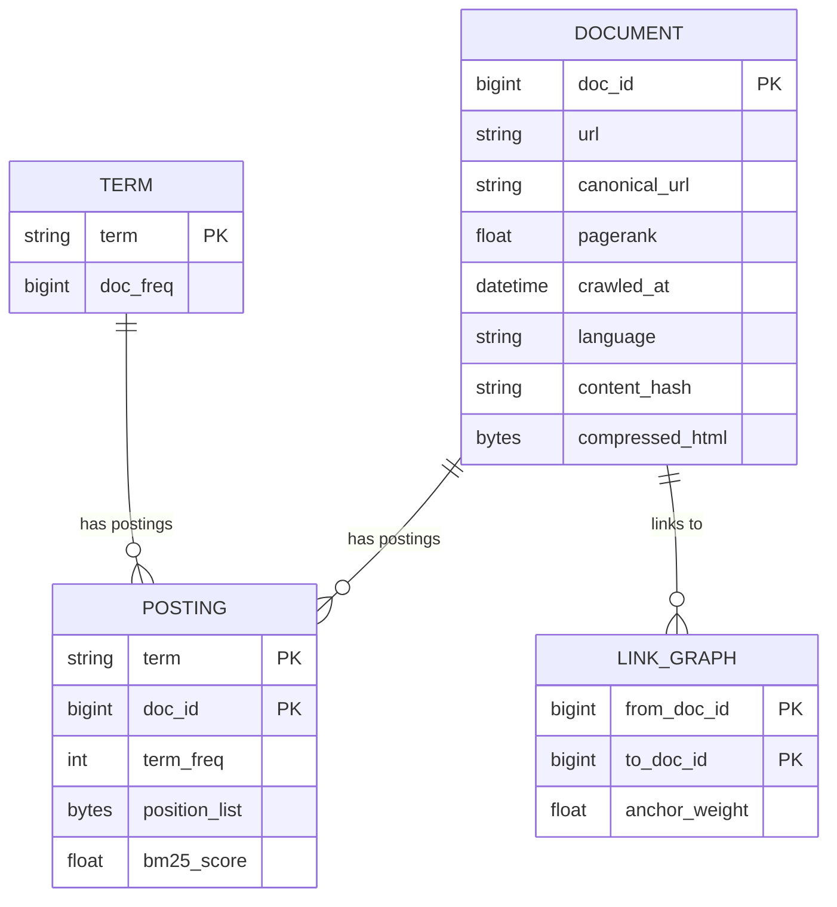
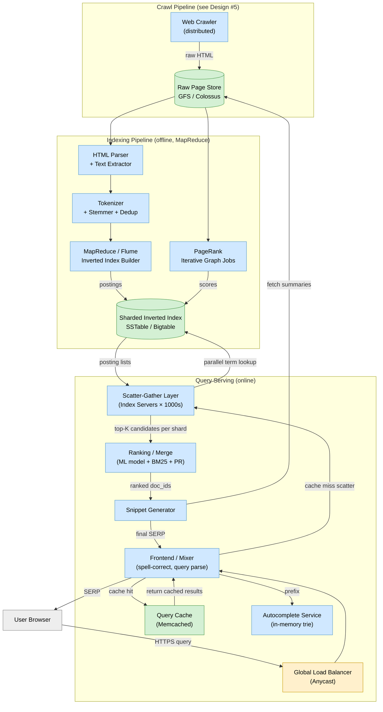
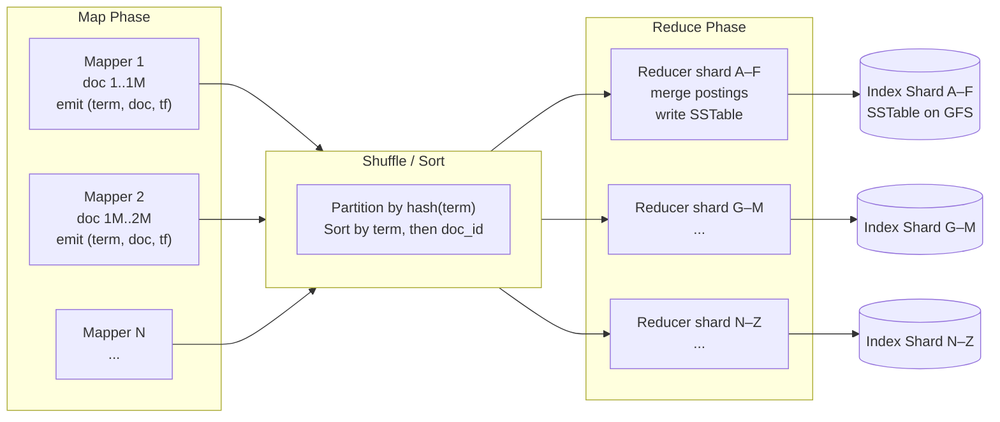
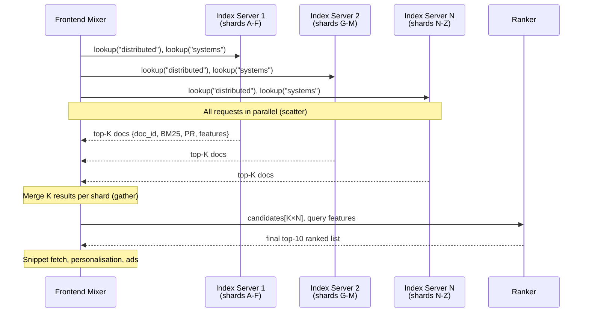

# Design Google Search

> A planetary-scale web search engine that crawls billions of pages, builds a distributed inverted index, ranks results across hundreds of signals, and serves queries in under 200 ms.

**Difficulty:** ⭐⭐⭐⭐⭐ · **Builds on:**
[Search Systems](../../Level-07-Big-Data-and-Specialized/04-Search-Systems/README.md) ·
[Batch Processing](../../Level-07-Big-Data-and-Specialized/01-Batch-Processing/README.md) ·
[Stream Processing](../../Level-07-Big-Data-and-Specialized/02-Stream-Processing/README.md) ·
[Caching](../../Level-01-Building-Blocks/03-Caching/README.md) ·
[CDN](../../Level-01-Building-Blocks/06-CDN/README.md) ·
[Sharding & Partitioning](../../Level-02-Data-Layer/02-Sharding-and-Partitioning/README.md)

---

## 1. 🎯 Problem & Scope

Google processes **8.5 billion searches per day** (~100,000 queries per second) against an index of **hundreds of billions of pages**. The system must:

- **Discover** pages continuously (the web grows by millions of pages daily).
- **Parse, index, and rank** pages so the most relevant result for any query rises to the top.
- **Serve** queries at p99 < 500 ms globally with 99.999 % availability.
- Handle **spam, low-quality content, duplicate pages**, and adversarial SEO.

This design focuses on: crawling → indexing → ranking → query serving. We link the web-crawler design for crawling detail and go deep on the indexing and serving pipeline.

---

## 2. 📋 Requirements

### Functional
- Accept keyword queries (single terms, phrases, boolean) and return a ranked list of URLs with snippets.
- Support freshness: breaking-news pages appear in results within minutes.
- Autocomplete / spell-correction at query time.
- SafeSearch filtering, language detection, geo-personalisation.

### Non-Functional
- **Scale:** index 500 billion pages, serve 100,000 QPS globally.
- **Latency:** p50 < 100 ms, p99 < 500 ms for query serving.
- **Freshness:** important pages re-indexed within hours, breaking news within minutes.
- **Availability:** 99.999 % (< 5 min/year downtime per region).
- **Storage:** petabyte-scale index distributed across thousands of machines.

---

## 3. 🧮 Capacity Estimation

```
Web size:           500 billion pages
Avg page size:      100 KB raw HTML → after compression ~20 KB stored
Raw page store:     500 B × 20 KB = 10 PB

Inverted index:
  Avg tokens/page:  ~1,000 unique terms
  Index entry:      term → list of (doc_id, TF, positions)  ≈ 50 bytes per posting
  Total postings:   500 B pages × 1,000 terms  = 500 trillion postings
  Index size:       500 T × 50 B  = 25 PB (before compression)
  With delta/varint compression:  ≈ 5–8 PB

Query throughput:   100,000 QPS
Avg query latency budget: 200 ms end-to-end
  - Network to nearest PoP: 20 ms
  - Cache lookup: 2 ms
  - Scatter-gather across index shards: 50 ms
  - Ranking merge: 30 ms
  - Snippet generation: 20 ms
  - Response serialisation + network back: 30 ms

Crawl rate (to keep index fresh):
  500 B pages, avg refresh every 10 days  →  500 B / 864,000 s  ≈  580,000 pages/s
```

---

## 4. 🔌 API Design

```http
# Search query (external)
GET /search?q=distributed+systems&hl=en&gl=US&num=10&start=0
→ 200
{
  "query": "distributed systems",
  "corrected_query": null,
  "total_results": "About 4,210,000,000 results",
  "results": [
    {
      "url": "https://en.wikipedia.org/wiki/Distributed_computing",
      "title": "Distributed computing - Wikipedia",
      "snippet": "Distributed computing is a field of computer science...",
      "date": "2024-11-01"
    }, ...
  ],
  "autocomplete": ["distributed systems book", "distributed systems mit", ...]
}

# Internal index write (Indexer → Index Store)
POST /internal/v1/index
{
  "doc_id": 9823741,
  "url": "https://example.com/page",
  "terms": [ { "term": "distributed", "tf": 12, "positions": [4,19,88] }, ... ],
  "pagerank": 0.0043,
  "crawled_at": "2025-06-23T10:00:00Z"
}

# Autocomplete (internal, latency-critical)
GET /suggest?q=distrib&limit=8
→ 200 { "suggestions": ["distributed systems", "distributed computing", ...] }
```

---

## 5. 🗄️ Data Model



**Storage choices:**
- **Document store** — Bigtable / Colossus (GFS) — content-addressed, key = doc_id, cheap at-rest compression.
- **Inverted index** — custom SSTable format on GFS (same as Bigtable internals); sharded by term hash.
- **Link graph** — distributed graph DB / custom adjacency store for PageRank computation.
- **Query cache** — Memcached cluster keyed by normalised query string.
- **Autocomplete trie** — in-memory prefix trie, replicated to all serving nodes.

---

## 6. 🏗️ High-Level Architecture



**Walk-through:**
1. **Crawl** — distributed crawler fetches URLs, stores raw HTML in GFS.
2. **Parse & analyze** — HTML is parsed, text extracted, tokenised, stemmed, and deduplicated. Near-duplicate pages (SimHash) are collapsed to a canonical URL.
3. **Inverted index build** — MapReduce job emits `(term, doc_id, tf, positions)` records; the Reduce phase merges and sorts posting lists per term, writes SSTable shards.
4. **PageRank** — iterative graph computation over the link graph, run periodically; scores annotate the index.
5. **Query serving** — user query hits the nearest PoP, is spell-corrected, parsed, and checked in the query cache. On cache miss, the Mixer fans out to thousands of Index Servers (scatter), each returning its local top-K; the Merger merges candidate lists and re-ranks with a full ML feature vector; Snippet Generator fetches stored summaries for the top 10.

---

## 7. 🔬 Deep Dives

### 7.1 Building the Distributed Inverted Index

The inverted index maps **term → sorted posting list** where each posting is `(doc_id, term_frequency, position_list)`. At Google's scale this is a multi-petabyte structure rebuilt continuously.



Posting lists are **delta-encoded and varint-compressed** (Elias-Gamma / VByte). The list for "the" contains billions of doc_ids but compresses to a fraction of naive storage. Skip pointers every 128 entries allow O(log N) intersection without scanning the full list.

---

### 7.2 PageRank at Web Scale

PageRank is an iterative algorithm. At 500 B nodes it cannot fit on a single machine; Google uses a distributed graph computation framework (similar to Pregel):

```
PR(A) = (1 - d) + d × Σ [ PR(B) / OutLinks(B) ]   for all B linking to A
d = 0.85 (damping factor)
```

- Each iteration: each page distributes its current PR evenly to its out-links; receivers sum contributions.
- Convergence: ~50–100 iterations for the full web graph.
- In practice Google runs **topic-sensitive PageRank** (separate scores per topic category) and combines them with query context at serving time.
- Modern ranking uses **hundreds of signals** beyond PageRank: anchor text, click-through rates, page freshness, mobile-friendliness, HTTPS, Core Web Vitals, and learned neural ranking models (BERT, MUM).

---

### 7.3 Scatter-Gather Query Serving



Each Index Server loads its portion of the inverted index entirely **in RAM** (hot tier). A shard typically holds ~1 % of the corpus. The Mixer enforces a **deadline**: any shard that doesn't respond in 50 ms is dropped from this query — hedged requests cover slow replicas.

---

### 7.4 Freshness — Real-Time Indexing

The batch rebuild cycle takes hours/days. For freshness:

- **Caffeine** (Google's real-time indexing system): high-priority pages (news sites, Twitter, Wikipedia) are re-crawled within seconds and fed through a **streaming indexing pipeline** (Cloud Dataflow / Flume in streaming mode).
- The serving layer maintains a **base index** (batch rebuilt) and a **freshness index** (streaming updated, smaller, held in memory). Results are merged at query time.
- The freshness index trades completeness for recency: it only covers the ~0.1 % of the web that changes fast.

---

## 8. 📈 Scaling, Bottlenecks & Failure Modes

| Bottleneck | Mitigation |
|---|---|
| Index size (petabytes) | Horizontal sharding by term hash; SSTable on GFS with replication factor 3 |
| Query latency | Entire hot index in RAM per shard; scatter deadline + hedged requests |
| Query cache hit rate | ~40–60 % of queries are repeated; Memcached cluster normalises queries before lookup |
| Long posting list intersection | Skip pointers, WAND (Weak AND) for early termination, BM25 upper-bound pruning |
| Index server failures | Each shard has 3 replicas; Mixer retries on next replica within 5 ms |
| Crawl freshness lag | Separate real-time streaming pipeline for high-priority URLs |
| Ranking model latency | ML inference runs on dedicated accelerators; simplified model at serving latency tier |

---

## 9. ⚖️ Trade-offs & Alternatives

| Decision | Chosen | Alternative | Why chosen |
|---|---|---|---|
| Index sharding | By term (each server owns all docs for its terms) | By document (each server owns all terms for its docs) | Term sharding allows parallel posting-list intersection per shard |
| Serving freshness | Separate freshness index merged at serving time | Full index rebuild on every update | Full rebuild takes too long; two-tier approach balances freshness and coverage |
| Ranking | Offline PageRank + online BM25 + ML re-rank | Pure neural retrieval (dense embeddings) | Hybrid is more interpretable; dense retrieval added as an additional signal |
| Query cache | Cache normalised query → SERP | Cache individual posting lists | SERP cache handles 40 % of traffic with simple key; posting cache has lower hit rate |

---

## 10. 🌐 How It's Actually Done

**Google's founding papers** are essential reading:
- **The Anatomy of a Large-Scale Hypertextual Web Search Engine** (Brin & Page, 1998) — describes the original bigram inverted index, PageRank, and the two-phase serving pipeline.
- **MapReduce** (Dean & Ghemawat, 2004) — the batch computation backbone for index builds.
- **Bigtable** (Chang et al., 2006) — the storage layer for the crawl repository and parts of the index.
- **Pregel** (Malewicz et al., 2010) — distributed graph processing for PageRank at web scale.

Modern Google search uses **neural ranking** (BERT for query understanding since 2019, MUM since 2021), **passage indexing** (indexing sub-page passages for long-tail queries), and **multisearch** (image + text combined queries). The inverted index remains the core retrieval structure, augmented by dense vector retrieval (ANN search over BERT embeddings) for semantic matching.

**Bing and other engines** follow the same broad architecture. Bing's Cosmos (their GFS equivalent) and their Scope (MapReduce equivalent) serve the same roles. DuckDuckGo licenses index data from Bing and adds its own crawler for freshness.

---

## 11. 📝 Summary

Building a search engine at Google's scale is the ultimate distributed systems challenge:

1. **Crawl** — massively parallel, polite, dedup-aware (see [Web Crawler design](../05-Web-Crawler/README.md) if present).
2. **Index** — MapReduce builds a distributed inverted index; PageRank iterates over the link graph; both live in sharded SSTable/Bigtable.
3. **Serve** — scatter-gather across thousands of in-memory index shards, merge, re-rank with ML, generate snippets — all within 200 ms.
4. **Freshness** — a real-time streaming index overlays the batch index for breaking news.
5. **Reliability** — every component is replicated; hedged requests + deadlines prevent tail latency from killing the SLA.

In an interview, the key insight is the **two-level architecture**: offline batch indexing for coverage/correctness and online streaming indexing for freshness, unified at query-serving time.
