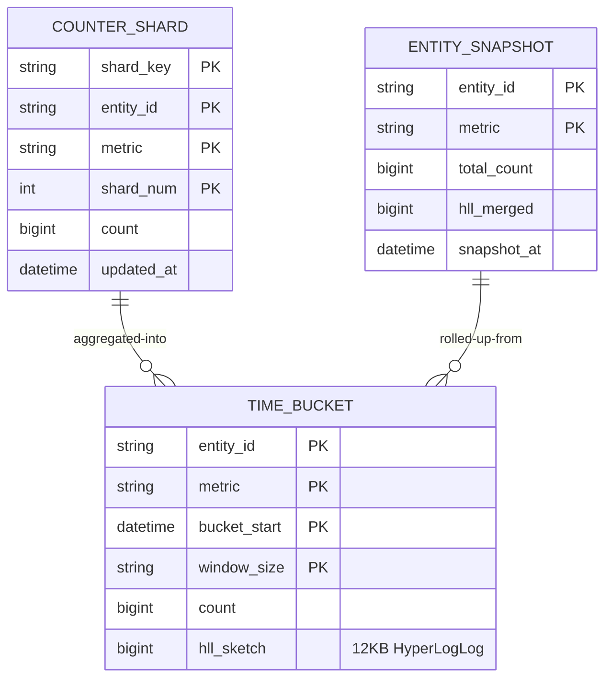
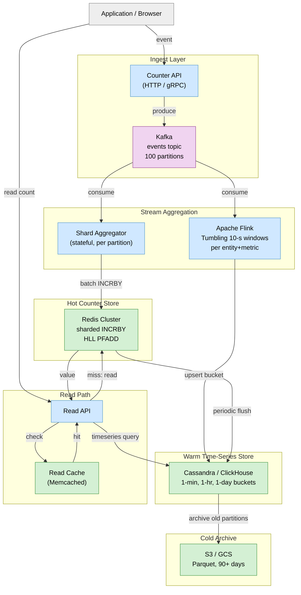
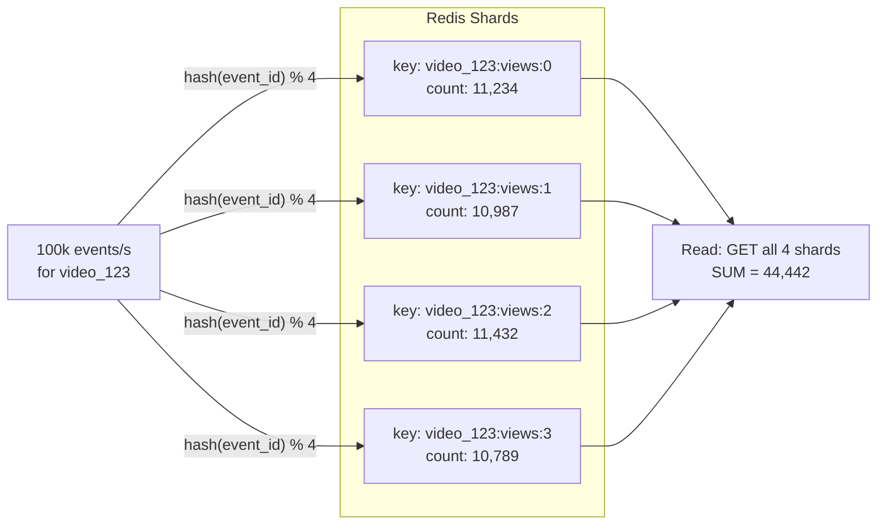
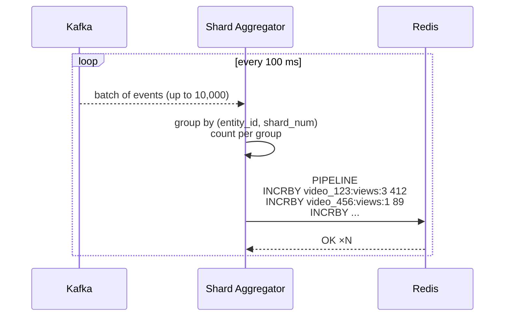

# Design Distributed Counter & Analytics

> Count views, likes, and unique visitors at massive scale — in near-real-time — without melting your database under hot-key write storms.

**Difficulty:** ⭐⭐⭐⭐⭐ · **Builds on:**
[Probabilistic Data Structures](../../Level-07-Big-Data-and-Specialized/06-Probabilistic-Data-Structures/README.md) ·
[Stream Processing](../../Level-07-Big-Data-and-Specialized/02-Stream-Processing/README.md) ·
[Sharding & Partitioning](../../Level-02-Data-Layer/02-Sharding-and-Partitioning/README.md) ·
[Caching](../../Level-01-Building-Blocks/03-Caching/README.md) ·
[Consistency Models](../../Level-04-Distributed-Systems/02-Consistency-Models/README.md) ·
[Multi-Region & Geo-Distribution](../../Level-06-Scale-and-Reliability/06-Multi-Region-and-Geo-Distribution/README.md)

---

## 1. 🎯 Problem & Scope

"How many views does this YouTube video have?" sounds trivial. At scale it becomes one of the hardest write-amplification problems in distributed systems:

- A viral video receives **1 million views per minute** — that's ~17,000 writes per second to a **single counter key**.
- You need **exact counts** for billing and compliance, but **approximate counts** (with < 1 % error) are acceptable for the display UI.
- Analytics teams want **time-windowed rollups**: views per minute, per hour, per day.
- You must count **unique** visitors without storing billions of user IDs.

Real analogues: **YouTube view counts**, **Twitter/X like counts**, **Redis counters at Instagram**, **Facebook's Gorilla TSDB**, **Stripe's metrics pipeline**, **Cloudflare Analytics**.

---

## 2. 📋 Requirements

### Functional
- Increment a counter when an event occurs (view, like, share, click).
- Read the current counter value for any entity (video, post, ad).
- Query time-series rollups: `count(video_id, window=1h, from=T1, to=T2)`.
- Count unique users who interacted with an entity (UV — unique visitors).
- Support counter reset and historical backfill.

### Non-Functional
- **Scale:** 1 million writes/s across all counters; 100,000 read QPS.
- **Hot keys:** single counters may receive up to 100,000 increments/s.
- **Latency:** write acknowledged < 50 ms; read returned < 20 ms.
- **Accuracy:** exact count for billing (< 0.01 % error); approximate (< 1 % error) for display.
- **Freshness:** display count lags reality by < 10 s.
- **Durability:** no count data lost on node failure.

---

## 3. 🧮 Capacity Estimation

```
Total write throughput:       1,000,000 events/s
Peak single counter:          100,000 increments/s (viral content)
Counter entities:             1 billion (every video, post, ad)
Read QPS:                     100,000 reads/s
Time-series retention:        1-minute buckets, 90 days = 129,600 buckets/entity
Storage per entity (counts):  129,600 × 8 bytes = ~1 MB
Total time-series storage:    1 B entities × 1 MB = 1 PB (tiered: hot 7 days SSD, cold S3)

Unique visitor (UV) storage using HyperLogLog:
  HLL per entity per day:     12 KB  (HLL with 0.8 % std error)
  1 B entities × 365 days:    4.4 PB / year  →  compress and archive aggressively

Event ingestion (Kafka):
  1M events/s × avg 200 bytes = 200 MB/s ingest
  Kafka: 100 partitions × 2 MB/s each  →  200 MB/s write, 10 Gbps replication
```

---

## 4. 🔌 API Design

```http
# Increment counter (fire-and-forget acceptable)
POST /v1/counters/increment
{
  "entity_type": "video",
  "entity_id": "vid_7f3a",
  "metric": "views",
  "user_id": "usr_9b12",        // for UV counting
  "timestamp": "2025-06-24T10:00:00Z",
  "region": "us-east"
}
→ 202 Accepted

# Read current counter (approximate, cached)
GET /v1/counters?entity_type=video&entity_id=vid_7f3a&metric=views
→ 200 { "count": 42391847, "approximate": true, "as_of": "2025-06-24T10:00:05Z" }

# Time-series rollup
GET /v1/counters/timeseries?entity_type=video&entity_id=vid_7f3a
  &metric=views&window=1h&from=2025-06-24T00:00:00Z&to=2025-06-24T10:00:00Z
→ 200 { "buckets": [ { "start": "2025-06-24T00:00:00Z", "count": 183421 }, ... ] }

# Unique visitor count (HyperLogLog estimate)
GET /v1/counters/unique?entity_type=video&entity_id=vid_7f3a
  &metric=unique_viewers&from=2025-06-24T00:00:00Z&to=2025-06-24T23:59:59Z
→ 200 { "estimate": 2819344, "std_error_pct": 0.8 }
```

---

## 5. 🗄️ Data Model



**Storage choices:**
- **Hot counters** — Redis cluster with `INCRBY` on sharded keys; sub-millisecond writes.
- **Time-series buckets** — Apache Cassandra (wide-column, time-ordered) or ClickHouse (columnar, fast aggregation).
- **HyperLogLog sketches** — Redis `PFADD`/`PFCOUNT` natively; or store raw HLL bytes in Cassandra.
- **Snapshots / exact counts** — PostgreSQL for billing-grade exact counters (low-frequency, not hot-path).
- **Event stream** — Kafka as the durable source of truth; allows replay and backfill.

---

## 6. 🏗️ High-Level Architecture



**Walk-through:**
1. Events hit the Counter API, which produces to Kafka (fire-and-forget; 202 Accepted to caller).
2. The Shard Aggregator consumes from Kafka and batches increments — instead of one Redis write per event, it accumulates over 100 ms and issues one `INCRBY N` per shard key.
3. Flink consumes the same Kafka topic, maintains tumbling 10-second windows per (entity, metric), and writes bucket rows to Cassandra.
4. Redis holds the live running total; Cassandra holds historical buckets. Every 60 s, Redis flushes deltas to Cassandra to persist the hot values.
5. Read path: cache first (Memcached, TTL 5 s), then Redis for live count, then Cassandra for historical rollups.

---

## 7. 🔬 Deep Dives

### 7.1 The Hot-Key Problem & Sharded Counters

A single Redis key receiving 100,000 INCRBY calls per second is a write hotspot — even Redis starts to struggle as a single-threaded process beyond ~500,000 ops/s when you factor in cluster routing.

**Solution: Write to N sub-shards, sum on read.**



- **Write:** route each event to `shard = hash(user_id or random) % N`. Each shard receives ~1/N of the traffic.
- **Read:** pipeline GET across all N shards, sum the results. N=16 is typical; at N=16 reads require 16 round-trips (pipelined — ~0.5 ms extra).
- **N is configurable per entity:** viral entities get N=64; low-traffic entities share shard 0.

---

### 7.2 Write Batching in the Shard Aggregator



This collapses **10,000 Kafka events into ~200 Redis commands** per 100 ms flush, reducing Redis write amplification by 50×. The aggregator is stateful (holds in-memory accumulator per group) but the accumulator is ephemeral — if it crashes, Kafka re-delivers from the last committed offset; we re-aggregate from there. Since we only lose the in-memory batch (100 ms of events), the counter error is bounded.

---

### 7.3 Counting Uniques with HyperLogLog

Storing every user_id who viewed a video would require billions of 8-byte user IDs per entity per day — petabytes of storage. **HyperLogLog (HLL)** estimates cardinality with < 1 % error using only 12 KB of memory per counter.

```
Standard HLL algorithm:
  For each element x: hash(x) → binary string
  Find position of leftmost 1 bit (leading zeros + 1) → k
  Maintain M registers, each holding max(k) seen for that hash prefix
  Estimate = α × M² × harmonic_mean(2^(-register_values))

Redis commands:
  PFADD  video_123:unique_viewers  user_id_abc   → O(1)
  PFCOUNT video_123:unique_viewers               → O(M) = O(16384) ≈ O(1)
  PFMERGE daily_uv  hour_1_uv hour_2_uv ...     → merge HLLs for any time range
```

**PFMERGE** is the superpower: you can merge per-hour HLLs into a per-day estimate without replaying raw events. This enables efficient UV computation for arbitrary time windows at O(M × windows) cost.

---

### 7.4 CRDTs for Multi-Region Counter Merging

When running across multiple regions (US, EU, APAC), counters in each region must eventually merge without coordination:

- Use a **G-Counter CRDT** (Grow-only Counter): each region maintains a vector `[us: 10M, eu: 5M, apac: 3M]`.
- **Local write:** increment only the local slot.
- **Merge:** take the element-wise maximum of all known vectors.
- **Read:** sum all slots.

```
Region US:    [us: 12M, eu: 5M,  apac: 3M]  → total = 20M
Region EU:    [us: 10M, eu: 7M,  apac: 3M]  → total = 20M
After merge:  [us: 12M, eu: 7M,  apac: 3M]  → total = 22M  ✓ correct
```

G-Counters are **eventually consistent** and require no cross-region coordination for writes — each region runs at full local speed. Convergence propagates via async gossip every few seconds.

---

## 8. 📈 Scaling, Bottlenecks & Failure Modes

| Bottleneck | Mitigation |
|---|---|
| Single hot counter key | Sharded counters (N=16–64 sub-keys per entity) |
| Redis write throughput | Shard Aggregator batches 10k events → 200 Redis commands per 100 ms |
| Redis memory (1 B counters) | Only hot entities (accessed recently) in Redis; cold entities fetched from Cassandra |
| Cassandra write hotspots | Partition key = (entity_id, metric, bucket_start); spread across ring |
| HLL accuracy vs. storage | 12 KB per entity per day is acceptable; merge across time windows for free |
| Cross-region consistency | G-Counter CRDT; no distributed transactions needed |
| Kafka consumer lag | Auto-scale Flink parallelism; increase Kafka partition count to 200 |
| Read latency on rollup | Pre-materialise 1h and 1d rollups; serve from Cassandra not on-the-fly |

**Failure modes:**
- Redis node failure → read path falls back to Cassandra snapshot (slightly stale); writes continue to surviving shards; Redis cluster reshards automatically.
- Flink job restart → re-process from Kafka offset; Cassandra upserts are idempotent (counter+HLL bucket rows).
- Cassandra node failure → RF=3, QUORUM reads/writes; < 1 s impact.
- Count drift (batching crash) → at most 100 ms of events lost; counter under-counts by < 0.01 %.

---

## 9. ⚖️ Trade-offs & Alternatives

| Decision | Chosen | Alternative | Why chosen |
|---|---|---|---|
| Hot counter store | Redis INCRBY + sharding | DynamoDB atomic counter | Redis is 10× faster; sharding solves hot-key better than single-item conditional writes |
| Unique counting | HyperLogLog | Exact set (Bloom filter + DB) | HLL uses 12 KB vs. gigabytes; < 1 % error acceptable for UV display |
| Cross-region writes | G-Counter CRDT | Synchronous global counter | CRDTs avoid cross-region latency (50–150 ms); acceptable for analytics |
| Time-series store | Cassandra | InfluxDB / TimescaleDB | Cassandra scales wider; ClickHouse is an excellent alternative for analytical queries |
| Event source | Kafka | Kinesis / Pulsar | Kafka provides replay, compaction, and offset-based re-aggregation |
| Exact billing counter | PostgreSQL SERIALIZABLE | Kafka exactly-once semantics | PG SERIALIZABLE for low-frequency billing; Kafka EOS for high-throughput metering |

---

## 10. 🌐 How It's Actually Done

**YouTube view counts** historically used a simple MySQL counter, which became infamous when Gangnam Style exceeded the int32 maximum (2.1 billion). They now use a distributed counter pipeline with in-memory aggregation and periodic flush.

**Instagram** uses Redis `INCRBY` for likes and views, with a background job rolling up to PostgreSQL every few minutes. They published on using Redis Cluster with 50+ shards for their highest-traffic counters.

**Twitter/X** uses a custom **Manhattan** distributed key-value store for counters, with client-side fan-out for high-traffic entities and a Finagle-based aggregation layer.

**Cloudflare Analytics** built a custom **CRDT-based** analytics system that runs at every PoP independently and merges results eventually — avoiding any cross-datacenter coordination for their billions of requests/day counting workload.

**Facebook Gorilla** is their in-memory time-series DB that compresses time-series data 10× using XOR delta-of-delta encoding — directly applicable to the time-bucket storage layer.

**Redis** natively supports HyperLogLog (`PFADD`, `PFCOUNT`, `PFMERGE`), making it the go-to choice for UV counting without any custom sketch implementation.

---

## 11. 📝 Summary

Distributed counting at scale requires solving three distinct problems:

1. **Write amplification on hot keys** — solved with N sub-shards (write 1/N load per shard, sum on read) plus upstream batching in the Shard Aggregator.
2. **Unique counting at petabyte scale** — solved with HyperLogLog (12 KB per counter, < 1 % error, free time-range merging via PFMERGE).
3. **Multi-region consistency without coordination** — solved with G-Counter CRDTs (grow-only, eventual convergence, no cross-region writes needed).

The golden rule: **separate the write path from the read path**. Write events into Kafka (durable, async), aggregate in Flink/stream processor, materialise into Redis (hot) and Cassandra (warm). Reads hit cache → Redis → Cassandra — never the raw event stream.
