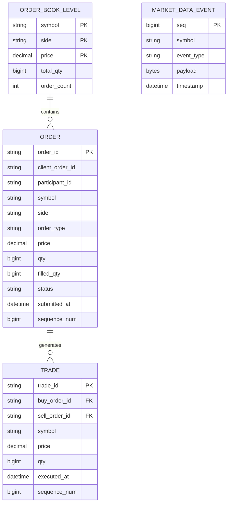
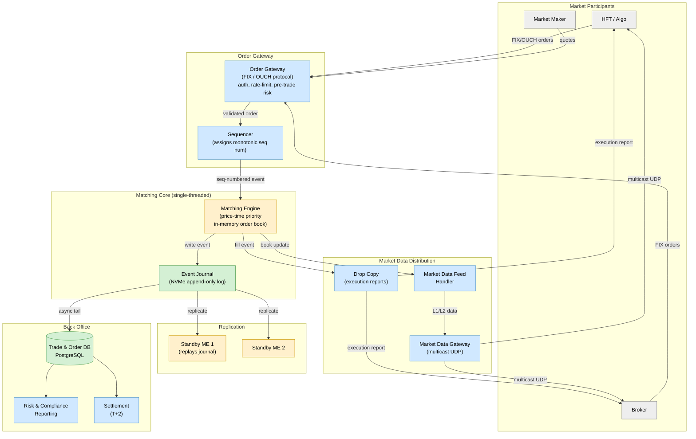
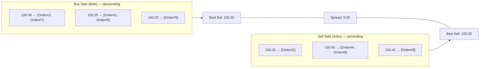
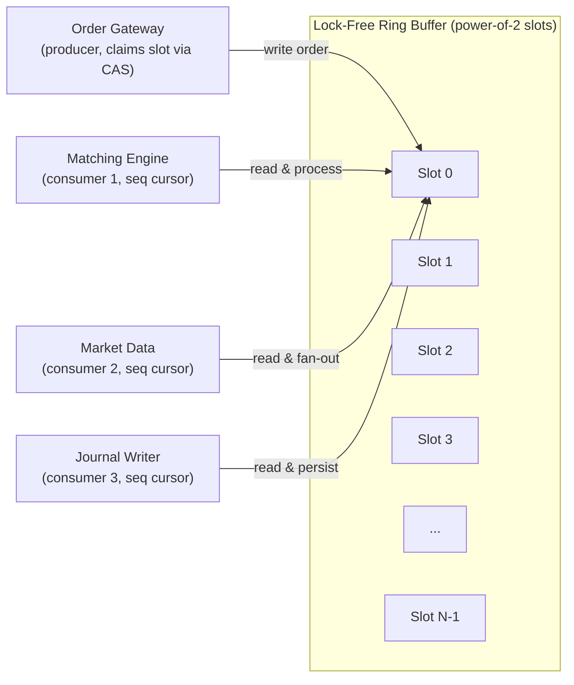
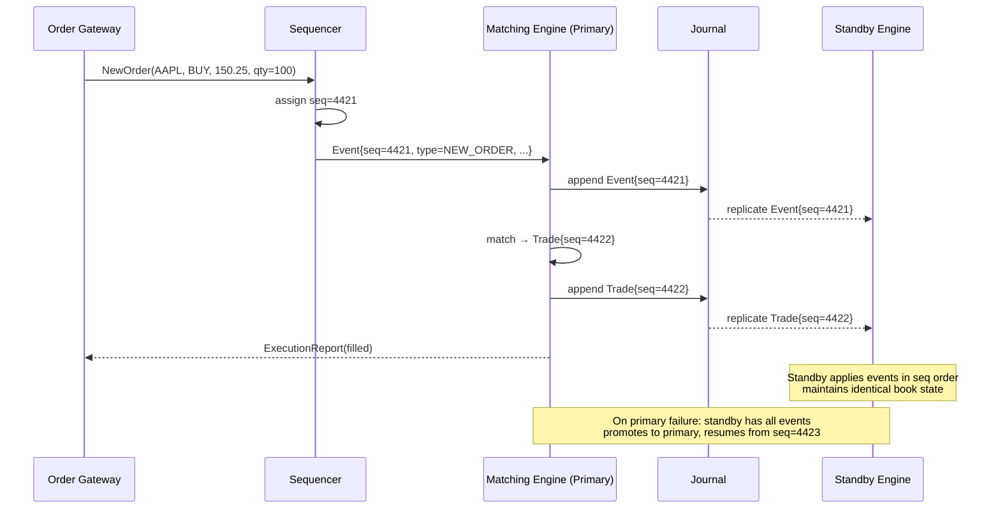
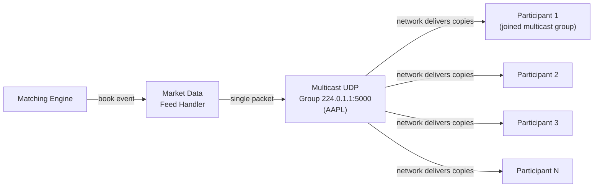

# Design Stock Exchange

> An ultra-low-latency electronic trading venue that matches buy and sell orders with microsecond precision, deterministic fairness, and zero tolerance for correctness errors.

**Difficulty:** ⭐⭐⭐⭐⭐ · **Builds on:**
[CQRS & Event Sourcing](../../Level-05-Architecture-Patterns/03-CQRS-and-Event-Sourcing/README.md) ·
[Consensus: Paxos & Raft](../../Level-04-Distributed-Systems/03-Consensus-Paxos-Raft/README.md) ·
[Idempotency & Exactly-Once](../../Level-04-Distributed-Systems/07-Idempotency-and-Exactly-Once/README.md) ·
[Clocks & Ordering](../../Level-04-Distributed-Systems/06-Clocks-and-Ordering/README.md) ·
[Message Queues](../../Level-03-Communication/04-Message-Queues/README.md)

---

## 1. 🎯 Problem & Scope

A stock exchange is the most demanding correctness-and-latency combination in software engineering:

- Every order must be processed in **strict time-priority** order (price-time priority).
- A matching error — a trade reported but not executed, or executed twice — is a regulatory violation with real financial consequences.
- Latency is a competitive moat: major exchanges (NASDAQ, NYSE, LSE) advertise **nanosecond-to-microsecond** order-to-acknowledgment times.
- Thousands of market participants (brokers, HFTs, market makers) connect simultaneously and receive real-time **market data feeds**.

We design the core matching engine and supporting systems used by an exchange like **NASDAQ**, **LMAX**, or **Cboe**.

---

## 2. 📋 Requirements

### Functional
- Accept **Limit** orders (buy/sell at a specific price or better) and **Market** orders (execute immediately at best available price).
- Match orders using **price-time priority**: best price first; among equal prices, earlier orders first.
- Publish **execution reports** (fills) back to the submitting participant.
- Broadcast **market data**: Level 1 (best bid/ask), Level 2 (full order book depth), and **trade tape** (last trade price/size).
- Cancel / modify outstanding orders.
- Support **order types**: limit, market, stop, iceberg (hidden quantity).
- Maintain a complete **audit trail** for regulatory compliance.

### Non-Functional
- **Latency:** order-to-acknowledgment p99 < 1 ms (software matching); LMAX achieves < 1 µs for hardware-accelerated paths.
- **Throughput:** 1,000,000 orders/s per instrument; 10,000+ instruments simultaneously.
- **Correctness:** zero double-fills, zero missed matches, strict price-time priority.
- **Availability:** 99.999 % during market hours; planned maintenance only during off-hours.
- **Durability:** every order and trade persisted to replicated storage before acknowledgment.
- **Determinism:** given the same sequence of input events, the matching engine must produce identical output on any replica.

---

## 3. 🧮 Capacity Estimation

```
Instruments (ticker symbols):  10,000 (equities + ETFs + options)
Orders per second (peak):      1,000,000 total across all instruments
                                = 100 orders/s per instrument average
                                Busy instruments (AAPL, SPY): 50,000 orders/s

Order message size:             ~200 bytes (FIX protocol fields)
Inbound throughput:             1M × 200 B = 200 MB/s ingest

Market data fan-out:
  10,000 instruments × 10 book updates/order ≈ 100,000 book events/s
  5,000 connected market-data subscribers
  Total fan-out: 100,000 × 5,000 = 500 M messages/s  (use multicast UDP)

Audit log:
  1M orders/s + 500k trades/s = 1.5M records/s × 500 bytes = 750 MB/s
  Daily: 750 MB/s × 6.5 trading hours = ~17 TB/day

Order book memory (per instrument):
  ~10,000 price levels × 2 sides × 100 orders/level × 200 bytes = 400 MB/instrument
  In practice: hot instruments use 50–100 MB; 10k × 50 MB = 500 GB total RAM
```

---

## 4. 🔌 API Design

```
// FIX 4.4 / FIXT 1.1 over TCP (industry standard)
// New Order – Single (D)
8=FIX.4.4|35=D|49=BROKER1|56=EXCHANGE|
11=ORD-0001|55=AAPL|54=1|    // ClOrdID, Symbol, Side (Buy)
38=100|40=2|44=150.25|        // OrderQty, OrdType (Limit), Price
59=0|60=20250624-14:30:00.000 // TimeInForce (Day), TransactTime

// Execution Report (8) – Fill
8=FIX.4.4|35=8|49=EXCHANGE|56=BROKER1|
11=ORD-0001|37=EX-789|39=2|  // ClOrdID, OrderID, OrdStatus (Filled)
31=150.25|32=100|14=100|      // LastPx, LastQty, CumQty
17=TRADE-4421|                // ExecID (unique per fill)

// Internal REST for risk/ops (low-frequency)
GET  /v1/instruments/{symbol}/orderbook
→ { "bids": [ {"price": 150.25, "qty": 500} ], "asks": [...] }

POST /v1/orders/cancel  { "order_id": "EX-789", "symbol": "AAPL" }
→ { "status": "CANCELLED" }

GET  /v1/trades?symbol=AAPL&from=2025-06-24T14:30:00Z&limit=100
→ { "trades": [ { "trade_id", "price", "qty", "buyer_order", "seller_order", "timestamp" } ] }
```

---

## 5. 🗄️ Data Model



**Storage choices:**
- **Order book (in-memory)** — custom C++ `std::map<price, queue<Order>>` per instrument per side; never touches disk on the hot path.
- **Event log (journal)** — append-only file on NVMe RAID (fsync per entry); replicated to standby via Raft/Paxos. This is the source of truth.
- **Trade & order history** — Apache Kafka → relational DB (PostgreSQL / Oracle) for T+2 settlement and regulatory reporting.
- **Market data** — Aeron / custom multicast UDP ring buffer; low-latency fan-out to subscribers.

---

## 6. 🏗️ High-Level Architecture



**Walk-through:**
1. A broker sends a FIX `NewOrderSingle` to the **Order Gateway**, which authenticates, validates risk limits, and forwards to the **Sequencer**.
2. The **Sequencer** assigns a monotonically increasing sequence number and writes the event to the **Matching Engine** input queue — this is the total ordering point.
3. The **Matching Engine** (single-threaded, in-memory) applies the event to the order book, generates fills if matched, and writes all resulting events to the **Journal** before acknowledging.
4. The Journal replicates to standby engines. Standbys replay the log identically, maintaining a hot copy of the order book.
5. **Market Data Feed Handler** receives book update events from the ME and fans out via **multicast UDP** to all subscribed participants.
6. **Drop Copy** sends private execution reports back to the originating participant.
7. The journal is tailed asynchronously into the **Trade DB** for back-office processing, settlement, and regulatory audit.

---

## 7. 🔬 Deep Dives

### 7.1 The Matching Engine & Order Book

The order book is the core data structure. It must support O(log N) insert/cancel and O(1) best-price lookup:



**Implementation (C++):**
- Buy side: `std::map<Price, std::deque<Order>, std::greater<Price>>` — highest price first.
- Sell side: `std::map<Price, std::deque<Order>>` — lowest price first.
- Price-time priority: within each price level, orders are FIFO (deque = queue).
- **Matching algorithm:** when a new order arrives, compare its price against the opposite book's best:
  - Limit buy at P: match against asks ≤ P, consuming from front of each price level's queue.
  - Market buy: match against best ask regardless of price until filled.
  - After matching, any remainder rests in the book at the limit price.

**Iceberg (hidden) orders:** book shows only a "peak" quantity; when the peak is consumed, refill from the hidden reserve and re-timestamp (goes to back of the queue at that price level).

---

### 7.2 Ultra-Low Latency — LMAX Disruptor Pattern

Traditional architectures use lock-based queues between components, adding microseconds of contention. **LMAX Disruptor** eliminates this:



Key properties:
- **Single writer principle:** the Matching Engine is the only thread that mutates the order book. No locks needed.
- **Ring buffer:** pre-allocated, cache-line padded slots prevent false sharing. Producers claim slots with a CAS on a sequence counter.
- **Consumers** each maintain their own cursor; they busy-spin on the producer cursor — eliminating condition-variable wake-up latency (~10 µs → ~50 ns).
- **Cache locality:** the ring buffer fits in L3 cache; sequential access patterns maximise CPU cache hit rates.

Additional latency techniques:
- **Kernel bypass networking:** DPDK or Solarflare OpenOnload — skip kernel TCP stack, save 5–10 µs.
- **CPU pinning:** matching engine thread pinned to an isolated core; OS scheduler never interrupts it.
- **Busy-wait / spin-wait** instead of `epoll`/`select`.
- **FPGA offload** (NASDAQ, Cboe): order parsing and simple matching in hardware for sub-microsecond paths.

---

### 7.3 Deterministic Sequencing & Fault Tolerance via Event Sourcing



**Event Sourcing is the bedrock:** the journal is the system. The in-memory order book is just a projection. On any crash, rebuild the book by replaying the journal from the beginning (or from the last checkpoint). This guarantees:
- **Exactly-once trades:** a trade event written to the journal once is the single authoritative record.
- **Auditability:** every state change is in the append-only log, immutable.
- **Determinism:** given the same journal, any number of replicas reconstruct identical state.

**Checkpoint:** periodically (e.g., every 15 min) snapshot the full book state to disk so replay starts from the snapshot, not from the beginning of the day.

---

### 7.4 Market Data Fan-out at Scale

5,000+ participants each need sub-millisecond delivery of book updates. TCP unicast to 5,000 connections from a single server is unmanageable.

**Solution: multicast UDP**



- One UDP packet → network replicates to all subscribers (L2/L3 multicast).
- Packet loss is handled by **sequence numbers + retransmission channel** (participants detect gaps, request retransmit from a snapshot server).
- **FAST protocol** (FIX Adapted for Streaming) or **SBE** (Simple Binary Encoding) — binary, zero-copy serialisation for minimum CPU overhead.
- Private execution reports (fills) go via TCP unicast Drop Copy channels — these are low volume (only to the filled participant) and require reliability.

---

## 8. 📈 Scaling, Bottlenecks & Failure Modes

| Bottleneck | Mitigation |
|---|---|
| Single-threaded ME throughput | Partition by instrument — each instrument gets its own ME thread/process; no inter-instrument coordination needed |
| Market data fan-out | Multicast UDP; hierarchical feed handlers in colo facilities |
| Journal write latency | NVMe SSD with battery-backed write cache; fdatasync per event (not fsync) |
| Standby lag during replication | Synchronous replication to one standby; async to second; primary acks after sync write |
| Sequencer as SPOF | Active-active sequencer with Raft consensus on sequence allocation |
| Memory for 10k instruments | 500 GB total; use NUMA-aware allocation; each ME pinned to its NUMA node |
| Order validation latency | Pre-trade risk checks on the gateway (not the ME); ME is a pure matching machine |

**Failure modes:**
- ME crashes mid-trade: journal guarantees the trade event either exists (committed) or doesn't (no ack sent); gateway retries; idempotency key (sequence num) prevents double execution.
- Journal disk failure: RAID-1 on NVMe + synchronous replication to standby; no data loss.
- Network partition between primary and standby: Raft ensures only the partition with quorum promotes to primary (no split-brain).
- Sequencer failure: Raft election of new sequencer in < 1 s; brief order rejection during election.

---

## 9. ⚖️ Trade-offs & Alternatives

| Decision | Chosen | Alternative | Why chosen |
|---|---|---|---|
| ME threading model | Single-threaded (LMAX Disruptor) | Multi-threaded with fine-grained locking | Single-threaded eliminates all lock contention; deterministic; easier to audit |
| Order book structure | `std::map` (red-black tree) | Skip list / array of price levels | `std::map` O(log N) insert/delete; skip list has better cache performance; array fastest if price range bounded |
| Replication | Synchronous to 1 standby | Async (performance) / Synchronous to all (durability) | 1 sync + 1 async balances latency and durability |
| Market data | Multicast UDP | Kafka / pub-sub | Multicast achieves fan-out in < 1 µs vs. Kafka's milliseconds; no broker bottleneck |
| Protocol | FIX / OUCH / SBE | REST / gRPC | FIX is the industry standard; OUCH/SBE are exchange-proprietary for lowest latency |

---

## 10. 🌐 How It's Actually Done

**NASDAQ** uses a custom Linux-based matching engine written in C++, with FPGA-based order parsing at the network layer. They publish latency statistics showing median order acknowledgment times of ~74 µs.

**LMAX Exchange** published the Disruptor pattern (2011) and demonstrated a Java-based exchange achieving 6 million TPS at < 1 ms latency using lock-free ring buffers, mechanical sympathy, and single-writer principle. Their white paper is required reading.

**London Stock Exchange (MillenniumIT)** migrated from a legacy system to a Linux/C++ matching engine in 2011, reducing latency from ~40 ms to < 125 µs. The MillenniumIT platform now powers 40+ exchanges worldwide.

**CME Globex** handles futures and derivatives, processing 3+ billion messages per day. They use a centralised matching engine with co-location facilities where HFT firms pay to place servers within meters of the exchange's matching hardware.

**Cboe** and **BATS** run FPGA-based order matching for their fastest paths, bypassing software entirely for simple limit order matching. Software matching is reserved for complex order types.

**Event sourcing** is universal: every major exchange maintains an immutable audit log (often called the "trade report" or "order audit trail") required by regulators (SEC Rule 17a-4, ESMA MiFID II).

---

## 11. 📝 Summary

A stock exchange is event sourcing taken to its extreme — where correctness is non-negotiable and microseconds matter. The key architectural pillars:

1. **Total ordering** via a Sequencer — every event has a globally monotonic sequence number; this is the foundation of fairness.
2. **Single-threaded Matching Engine** (LMAX Disruptor) — no locks, no contention, deterministic, auditable.
3. **Event journal as source of truth** — the in-memory order book is a derived projection; crash recovery is journal replay.
4. **Synchronous replication** before acknowledgment — no trade is confirmed until it's durable on at least two nodes.
5. **Multicast UDP** for market data — the only way to fan out to thousands of subscribers at microsecond latency.

In a senior interview, the single most important insight is: **the Matching Engine must be single-threaded and deterministic**. Any attempt to parallelise it introduces non-determinism that breaks price-time priority and auditability.
