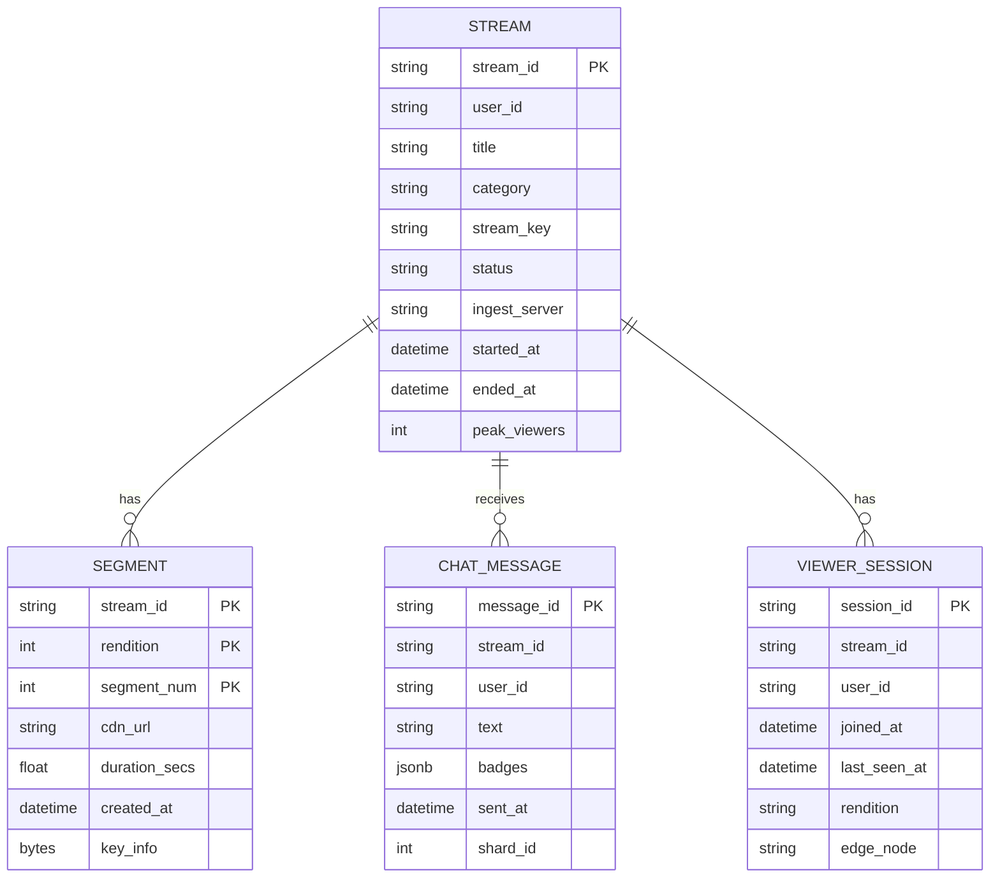
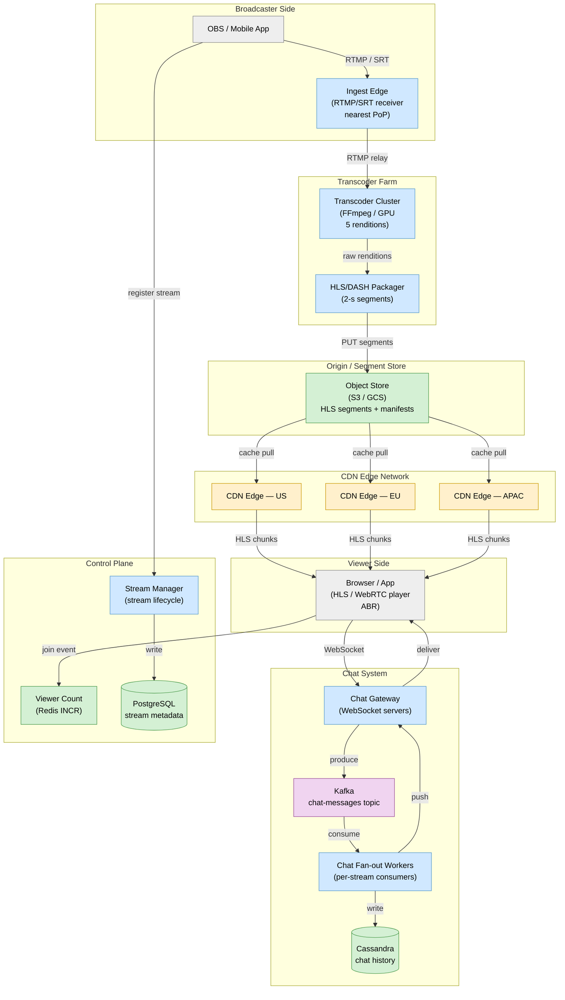
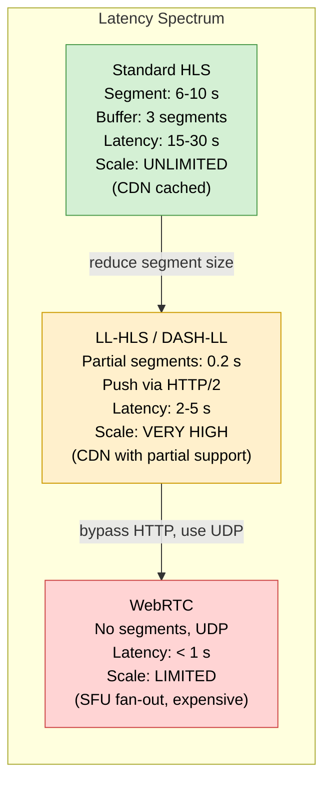
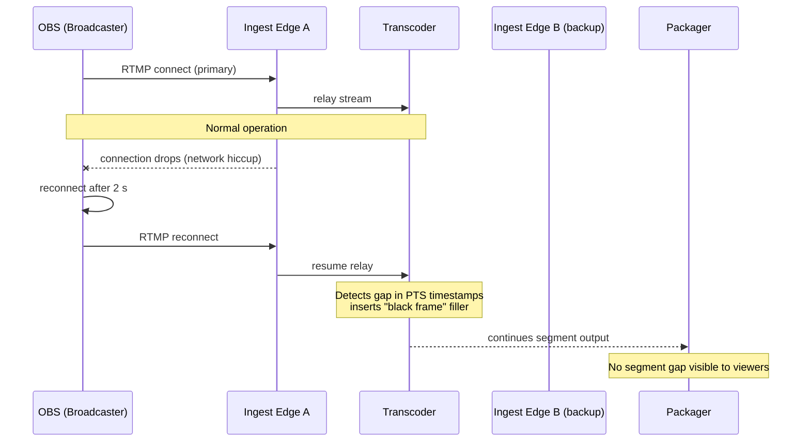
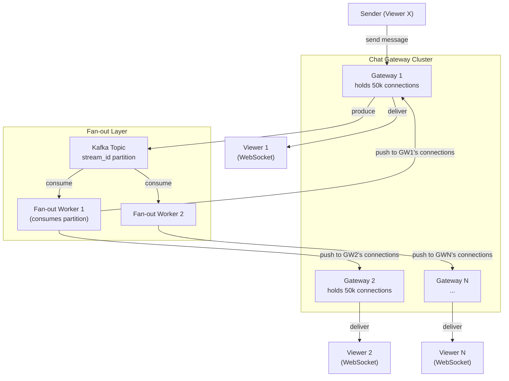
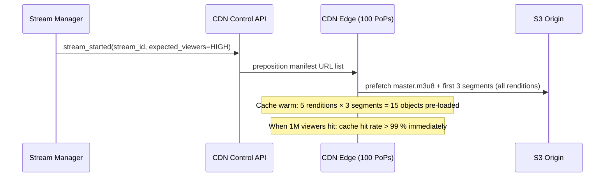

# Design Live Streaming (Twitch / YouTube Live)

> A global platform that ingests a live video signal from a broadcaster, transcodes it into multiple quality renditions, and delivers it in near-real-time to millions of concurrent viewers — while running a massive live chat alongside.

**Difficulty:** ⭐⭐⭐⭐⭐ · **Builds on:**
[CDN](../../Level-01-Building-Blocks/06-CDN/README.md) ·
[Stream Processing](../../Level-07-Big-Data-and-Specialized/02-Stream-Processing/README.md) ·
[Pub-Sub](../../Level-03-Communication/05-Pub-Sub/README.md) ·
[WebSockets & Realtime](../../Level-03-Communication/06-WebSockets-and-Realtime/README.md) ·
[High Availability & DR](../../Level-06-Scale-and-Reliability/03-High-Availability-and-DR/README.md) ·
[Multi-Region & Geo-Distribution](../../Level-06-Scale-and-Reliability/06-Multi-Region-and-Geo-Distribution/README.md)

---

## 1. 🎯 Problem & Scope

Live streaming is fundamentally different from video-on-demand (VOD):

- The video **does not exist before the stream starts** — you can't pre-cache it.
- Latency matters: a 30-second delay means viewers see chat reactions before the event that caused them.
- Viewer counts swing from 0 to **millions in seconds** when a popular streamer goes live.
- You must solve **three concurrent fan-out problems**: video (GB/s to millions), live chat (millions of messages to millions of viewers), and viewer presence/counts.

Real analogues: **Twitch** (130M+ monthly viewers, peak 6M+ concurrent), **YouTube Live**, **Facebook Live**, **Kick**, **TikTok Live**.

We contrast the latency vs. scale spectrum: HLS (~10–30 s latency, massive scale) vs. LL-HLS/DASH-LL (~2–5 s) vs. WebRTC (< 1 s, harder to scale).

---

## 2. 📋 Requirements

### Functional
- Broadcaster publishes a live video stream (RTMP/SRT from OBS or mobile).
- Platform transcodes to multiple bitrate/resolution renditions (1080p60, 720p, 480p, 360p, 160p).
- Viewers watch via adaptive bitrate (ABR) player in browser or mobile app.
- Live chat: viewers send messages; all viewers see them in near-real-time.
- Stream recording: archive to VOD after stream ends.
- Viewer count and analytics (concurrent viewers, peak, chat rate).

### Non-Functional
- **Scale:** 10 million concurrent viewers across 100,000 simultaneous streams.
- **Ingest latency (broadcaster → CDN edge):** < 2 s.
- **Playback latency (broadcaster → viewer):** 3–30 s depending on protocol tier.
- **Availability:** 99.99 %; broadcaster reconnect heals in < 5 s.
- **Video quality:** adaptive bitrate — viewers degrade gracefully on poor connections.
- **Chat scale:** peak 100,000 messages/minute on a single viral stream; delivered to 5M concurrent chat viewers within 1 s.

---

## 3. 🧮 Capacity Estimation

```
Concurrent streams (broadcasters): 100,000
Concurrent viewers:                10,000,000
Avg viewers per stream:            100 (median); top streams: 5M

Ingest bandwidth per stream:
  1080p60 source:  8–12 Mbps  →  assume 8 Mbps
  100,000 streams × 8 Mbps = 800 Gbps ingest to transcoder farm

Transcoder output per stream:
  1080p: 6 Mbps  +  720p: 3 Mbps  +  480p: 1.5 Mbps  +  360p: 0.8 Mbps  +  160p: 0.4 Mbps
  ≈ 12 Mbps per stream × 100,000 streams = 1.2 Tbps to CDN origin

CDN egress to viewers:
  10M viewers × avg 3 Mbps (mixed renditions) = 30 Tbps CDN egress

HLS segment storage:
  Segment duration: 2 s  →  segments per hour: 1,800
  Segments per stream: 1,800 × 5 renditions = 9,000 segments/hour
  Size per segment: 2 s × 6 Mbps / 8 = 1.5 MB (1080p), avg 750 KB across renditions
  Active segment window (live window = last 30 segments = 60 s):
  100,000 streams × 30 segments × 5 renditions × 750 KB = ~11 TB hot storage

Chat:
  Top stream: 100,000 messages/min = 1,667 msg/s
  Fan-out to 5M viewers:  5M × 1,667 = 8.3 B message deliveries/s  → must use efficient pub/sub
```

---

## 4. 🔌 API Design

```http
# Broadcaster: get stream key and RTMP endpoint
POST /v1/streams/start
Authorization: Bearer <user_token>
→ 200 {
  "stream_key": "live_a9f3...",
  "rtmp_url": "rtmp://ingest.example.com/live",
  "srt_url": "srt://ingest-srt.example.com:9000?streamid=live_a9f3..."
}

# Viewer: get playback URL (HLS master playlist)
GET /v1/streams/{stream_id}/playback
→ 200 {
  "hls_url": "https://cdn.example.com/live/stream_abc/master.m3u8",
  "webrtc_url": "wss://edge-webrtc.example.com/live/stream_abc",
  "latency_mode": "normal" | "low" | "ultra-low",
  "viewer_count": 41832
}

# Chat: WebSocket connection for chat room
WS  wss://chat.example.com/live/{stream_id}
→ Client sends:  { "type": "message", "text": "LUL LUL Pog" }
→ Server pushes: { "type": "message", "user": "JohnDoe", "text": "LUL LUL Pog",
                   "badges": ["sub/12"], "timestamp": "2025-06-24T14:00:00.123Z" }

# VOD: after stream ends, retrieve recording
GET /v1/vods/{stream_id}
→ 200 { "vod_url": "https://cdn.example.com/vod/stream_abc/index.m3u8",
         "duration_secs": 7200 }
```

---

## 5. 🗄️ Data Model



**Storage choices:**
- **Stream metadata** — PostgreSQL (structured, low write rate).
- **HLS segments** — S3 / GCS / CDN origin store (immutable objects, aggressively cached at edge).
- **Chat messages** — Apache Cassandra (wide-column, write-heavy, time-ordered per stream) + Kafka for fan-out.
- **Viewer sessions / presence** — Redis (TTL-based, ephemeral, INCR for viewer counts).
- **VOD archive** — Object storage (S3) with a CDN layer; transcoded to MP4/HLS for VOD playback.

---

## 6. 🏗️ High-Level Architecture



**Walk-through:**
1. **Ingest** — OBS connects via RTMP/SRT to the nearest ingest edge PoP; the signal is relayed to the transcoder farm.
2. **Transcode** — FFmpeg on GPU nodes produces 5 renditions in parallel; takes 1–2 s per segment.
3. **Package** — the Packager slices each rendition into 2-second HLS segments and writes them to S3 + updates the `.m3u8` manifest.
4. **CDN delivery** — the first viewer at an edge PoP triggers a cache miss → pulls from S3; subsequent viewers within seconds hit the warm cache. Segment duration (2 s) sets the base latency floor.
5. **Viewer playback** — the ABR player fetches the manifest every 1–2 s, selects the highest rendition that fits the bandwidth budget, downloads segments sequentially.
6. **Chat** — viewers connect via WebSocket to Chat Gateway; messages flow through Kafka; fan-out workers push to all connected sockets for that stream.

---

## 7. 🔬 Deep Dives

### 7.1 Latency vs. Scale Trade-off: HLS → LL-HLS → WebRTC



**Standard HLS** is the workhorse for massive scale: segments are normal HTTP files cached at CDN edges. Adding 1 million viewers is just adding CDN cache nodes — the origin serves the same 5 segment files regardless.

**LL-HLS** (Apple, 2019) introduces "partial segments" (0.2 s chunks) delivered via HTTP/2 push or `_HLS_msn` blocking playlist requests. Latency drops to 2–5 s. CDN support is improving but not universal.

**WebRTC** achieves sub-second latency but requires a **Selective Forwarding Unit (SFU)** — a server that receives one upstream and forwards to N viewers as individual UDP streams. SFUs do NOT cache; each viewer is a separate connection. Scaling to millions requires a cascade of SFUs, each adding latency. Practical ceiling: ~100,000 viewers per stream before cost becomes prohibitive. Twitch uses WebRTC for "co-streams" and creator previews; their main stream is LL-HLS.

**Twitch's choice:** LL-HLS at ~3 s for standard streams; WebRTC-based "ultra-low latency" mode (< 1 s) for small audiences via a tiered SFU mesh.

---

### 7.2 Ingest Resilience and RTMP/SRT



**SRT (Secure Reliable Transport)** is increasingly preferred over RTMP for ingest:
- Built-in ARQ (automatic repeat request) over UDP: handles packet loss without disconnecting.
- Encrypted by default.
- Lower latency than RTMP over lossy connections.
- Supported by OBS, vMix, and all modern encoders.

**Ingest redundancy:** broadcasters can send to two ingest PoPs simultaneously; the transcoder takes the primary feed and switches to the secondary within 2 s if the primary drops.

---

### 7.3 Live Chat Fan-out to Millions



The fan-out worker knows which Chat Gateway holds each connection (via Redis pub/sub or a consistent-hash routing table). For a stream with 5M viewers:

- 5M WebSocket connections spread across 100 gateway servers (50k connections each).
- A single incoming message fans out to 100 gateway servers → each delivers to its 50k connections.
- This is an **O(viewers)** fan-out per message — at 1,667 msg/s that's 1,667 × 5M = 8.3B pushes/s.

**Mitigation for extreme chat rates:**
- **Rate limiting:** max 1 message/s per user; moderator-speed 20 msg/s.
- **Sub-sampling display:** for large chats, show only a random 20 % of messages in the viewer's client (client-side filtering). Users see "fast chat" mode.
- **Slow mode:** force a per-user cooldown (e.g., 30 s between messages) for streams with > 10,000 concurrent chatters.
- **Emote-only mode:** restrict to short emote strings — reduces payload size 10×.

---

### 7.4 Viewer Spike Handling and CDN Warm-up

When a celebrity goes live, viewer count can jump from 0 to 1M in under 60 seconds. The first segment must already be cached at CDN edges before viewers arrive — or the origin gets hammered.

**Pre-warming strategy:**



Additional tactics:
- **Manifest TTL = 1 s** (live window updates every 2 s; clients poll every 1–2 s).
- **Segment TTL = forever** (segments are immutable once written; aggressive CDN caching).
- **Tiered CDN:** edge PoPs pull from regional aggregation nodes (mid-tier), which pull from origin. Origin serves only 100 mid-tier nodes, not 10M clients.
- **Bandwidth metering:** CDN capacity is pre-provisioned based on viewer count signals; auto-scale CDN bandwidth contracts are triggered by stream launch events.

---

## 8. 📈 Scaling, Bottlenecks & Failure Modes

| Bottleneck | Mitigation |
|---|---|
| Transcoder CPU at 100k streams | GPU-accelerated FFmpeg (NVENC/VAAPI); scale out transcoder fleet; containers per stream |
| CDN egress cost (30 Tbps) | Segment caching at edge; tiered CDN; viewer-side buffering (larger buffer = fewer requests) |
| Chat fan-out at 5M viewers | Gateway cluster; Kafka partitioned by stream; sub-sampling for extreme chat rates |
| Ingest origin spike on stream start | CDN pre-warm API; manifest served from Edge with low TTL |
| Viewer count accuracy | Redis INCR/DECR on join/leave with TTL; HyperLogLog for unique counts; periodic reconciliation |
| Transcoder single point of failure | Active-standby transcoders per stream; if primary fails, secondary picks up from last segment |
| VOD recording gap | Transcoder writes segments to S3 regardless of CDN state; VOD is built from S3 at end of stream |

**Failure modes:**
- Ingest edge failure → broadcaster disconnects, reconnects to next-closest PoP in < 5 s; viewer sees brief buffering.
- Transcoder crash → standby takes over; 1–2 segment gap covered by player buffer.
- CDN PoP failure → DNS Anycast reroutes viewers to next-nearest PoP; slight latency increase.
- Kafka outage → chat messages dropped (acceptable — chat is best-effort); video unaffected (separate pipeline).
- S3 origin slow → CDN serves stale segments (up to 30 s live window); viewers experience slight delay but no outage.

---

## 9. ⚖️ Trade-offs & Alternatives

| Decision | Chosen | Alternative | Why chosen |
|---|---|---|---|
| Delivery protocol | LL-HLS (default) + WebRTC (ultra-low) | RTSP, SRT to viewer | HLS is universally supported in browsers; RTSP requires native app; SRT is ingest-only |
| Segment duration | 2 s (LL-HLS partial 0.2 s) | 6 s (standard HLS) | Shorter segments reduce latency; partial segments reduce further at same CDN compatibility |
| Chat fan-out | Kafka + stateful WebSocket gateways | Server-sent events / polling | WebSockets enable push without poll overhead; Kafka decouples ingest from delivery |
| Transcoder placement | Cloud GPU fleet (elastically scaled) | On-prem fixed capacity | Elasticity handles viewer spikes and stream burst; cloud GPU is cost-effective at burst scale |
| Viewer count | Redis INCR (approximate) | Exact DB count | Redis handles millions of join/leave events per second; DB cannot |
| VOD storage | S3 → repackage | Store raw transcoder output | S3 segments double as live + VOD; repackaging into a single MP4 improves seek performance for VOD |

**Live vs. VOD contrast:**
VOD (see [Design #9 if present]) stores the full video before any viewer arrives — cache warm-up is trivial, full CDN pre-positioning is possible, and latency doesn't matter. Live streaming has the opposite problem: content appears only seconds before viewers need it, cache miss on the first segment at each edge is unavoidable, and every second of latency is a user-experience degradation.

---

## 10. 🌐 How It's Actually Done

**Twitch** uses RTMP for broadcaster ingest and a custom media pipeline they call **Video Ingestion** (published at AWS re:Invent). They transcode with FFmpeg on EC2 GPU instances, deliver via HLS to S3 origins, and use a multi-tier CDN (Twitch's own CDN nodes + third-party CDN). Chat runs on a custom Erlang/Elixir pubsub system (IRC-based protocol) capable of millions of concurrent connections. They open-sourced their **go-pion WebRTC** library for ultra-low latency experiments.

**YouTube Live** uses a proprietary ingest protocol (RTMP-compatible) feeding into their **Transcode Farm** (borg-managed), delivers via DASH and HLS from Google's own CDN (GGC — Google Global Cache nodes in ISP networks). YouTube Live recording is seamless: the same segments served live become the VOD archive.

**Facebook Live** published their use of **SRT** for ingest and their RTMP-to-DASH pipeline. For massive events (concerts, sports) they use a pre-warming API to push the first few segments to 150+ CDN PoPs before the stream goes public.

**Mux** (the video infrastructure startup) documented their segment pipeline architecture: RTMP → SRT ingest → FFmpeg transcode → HLS packaging → S3 → CDN, with per-stream monitoring for segment delivery and viewer quality-of-experience (QoE) metrics.

**Apple LL-HLS** (RFC draft 2019, finalised 2021) is now supported by major CDNs (Akamai, Cloudfront, Fastly) and enables 2–3 s latency at full CDN scale — closing the gap with WebRTC for many use cases.

---

## 11. 📝 Summary

Live streaming requires solving four simultaneous challenges that each demand different architectural approaches:

1. **Low-latency ingest** (RTMP/SRT, nearest PoP, < 2 s) — reliability over last-mile lossy connections.
2. **Scalable transcoding** (GPU fleet, 5 renditions in parallel, < 2 s per segment) — elastic to handle 100k simultaneous streams.
3. **Massive viewer fan-out** (CDN delivery, HLS segments as cached HTTP objects, 30 Tbps) — CDN caching is the only thing that makes millions of concurrent viewers economically feasible.
4. **Live chat at scale** (Kafka + stateful WebSocket gateways + sub-sampling) — pub/sub fan-out with graceful degradation.

The central tension is **latency vs. scale**: WebRTC achieves < 1 s but cannot scale beyond ~100k viewers per stream economically; HLS scales to unlimited viewers but adds 15–30 s latency. LL-HLS is the pragmatic middle ground at 2–5 s latency with full CDN scale. Pick your trade-off based on the use case: sports betting needs sub-second; casual gaming streams are fine at 10 s.
