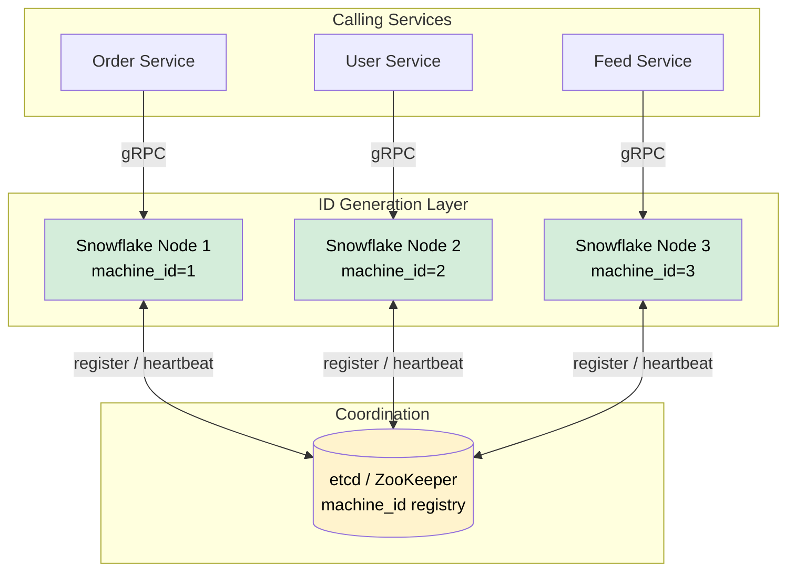
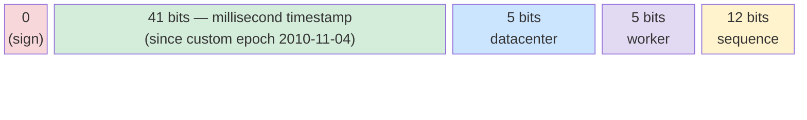
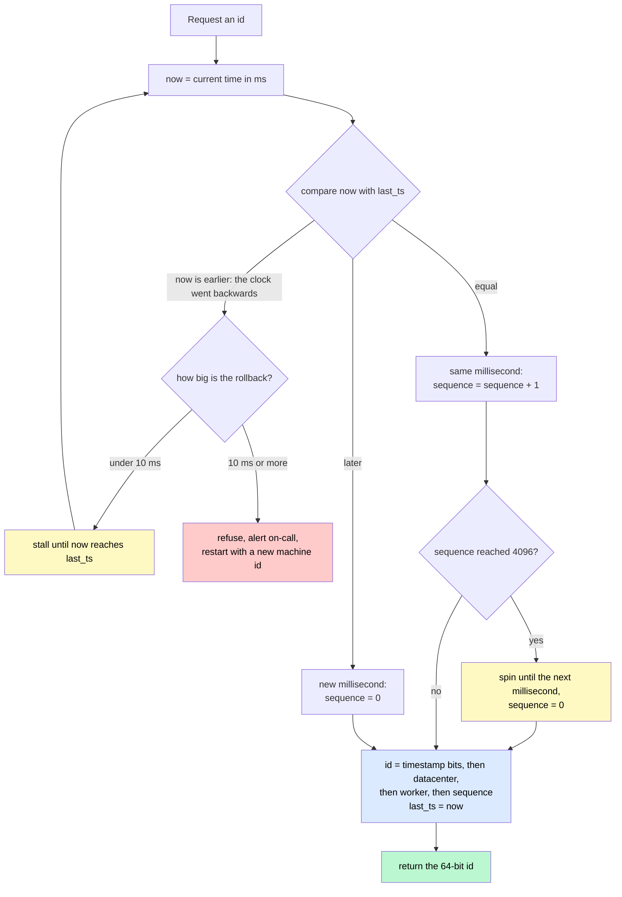
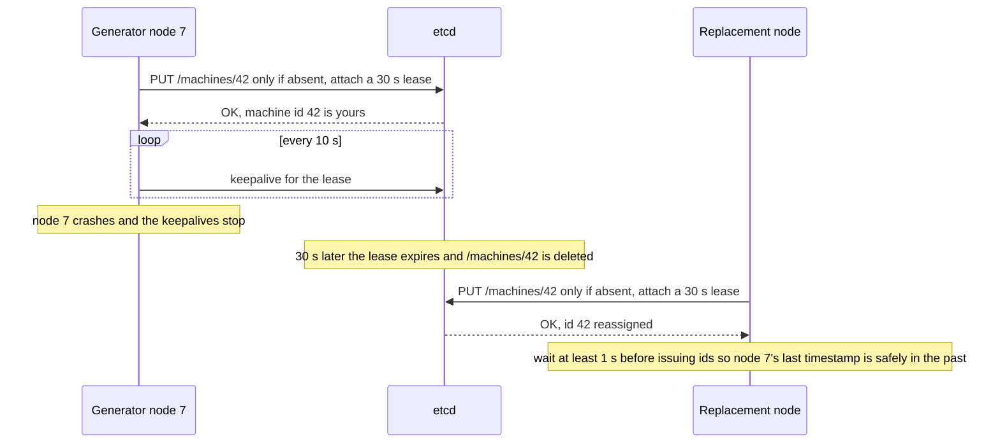

# Design Unique ID Generator

> A distributed service that produces globally unique, roughly time-sortable 64-bit IDs at high throughput with no single point of failure.

**Difficulty:** ⭐⭐ · **Builds on:**
[Sharding & Partitioning](../../Level-02-Data-Layer/02-Sharding-and-Partitioning/README.md) ·
[Leader Election](../../Level-04-Distributed-Systems/05-Leader-Election/README.md)

---

## 1. 🎯 Problem & Scope

Almost every large-scale system needs to assign unique identifiers to rows, events, or objects across many databases, microservices, and data centres. The naive solution — a single auto-incrementing database column — breaks the moment you shard your data or want high availability.

**What we're building:** a lightweight, horizontally scalable ID generation service that any microservice can call (or run in-process) to get a guaranteed-unique, 64-bit integer ID.

**In scope:**
- Globally unique IDs across all nodes and data centres
- IDs are roughly time-sortable (useful for pagination, debugging, and compressing B-tree indexes)
- 64-bit integers (fits in a `BIGINT`, friendly for URLs and JavaScript)
- High throughput: ≥ 10 000 IDs / second per node, millions/second cluster-wide
- High availability — no SPOF

**Out of scope:**
- Cryptographically secure random tokens (use UUID v4 or a CSPRNG for those)
- Human-readable slug generation
- Sequential IDs with zero gaps

---

## 2. 📋 Requirements

### Functional
- Generate a unique 64-bit integer ID on request
- IDs must be monotonically increasing within a single generator node
- IDs generated later should (almost always) be numerically greater than IDs generated earlier, even across nodes

### Non-Functional
- **Throughput:** ≥ 10 000 IDs/s per node; cluster target ≥ 1 000 000 IDs/s
- **Latency:** p99 < 1 ms (in-process generation), p99 < 5 ms (network call)
- **Availability:** 99.99 %+ — survive the loss of any single node
- **Uniqueness guarantee:** zero duplicates, ever
- **ID length:** exactly 64 bits (fits `BIGINT UNSIGNED`)

---

## 3. 🧮 Capacity Estimation

```
Target: 100 000 IDs / second cluster-wide

Twitter Snowflake bit layout (explained in §6):
  - 12-bit sequence counter → 2^12 = 4 096 IDs / ms / node
  - 10-bit machine ID      → 2^10 = 1 024 nodes max

Per-node ceiling: 4 096 IDs/ms = ~4 000 000 IDs/s
Cluster ceiling:  4 096 × 1 024 nodes = ~4 billion IDs/second

For 100 000 IDs/s we need:
  100 000 / 4 096 ≈ 25 nodes — very comfortable headroom.

Timestamp field (41 bits, milliseconds since custom epoch):
  2^41 ms ≈ 69 years of IDs before overflow
  Custom epoch 2010-11-04 → exhausts ~2080
```

Storage is irrelevant — IDs are generated on the fly and stored only by the calling service.

---

## 4. 🔌 API Design

### Option A — HTTP service

```
POST /v1/id
Response 200 OK
{
  "id": "7061564782964695040",   // 64-bit integer as string (JS safe)
  "id_int": 7061564782964695040
}

POST /v1/ids?count=100
Response 200 OK
{ "ids": ["706156...", "706156...", ...] }
```

### Option B — gRPC (preferred for low latency)

```protobuf
service IdService {
  rpc NextId(NextIdRequest)     returns (NextIdResponse);
  rpc NextIds(NextIdsRequest)   returns (NextIdsResponse);
}
message NextIdRequest  {}
message NextIdResponse { uint64 id = 1; }
message NextIdsRequest { uint32 count = 1; }
message NextIdsResponse { repeated uint64 ids = 1; }
```

### Option C — in-process library (zero network hop)

```python
from snowflake import SnowflakeGenerator
gen = SnowflakeGenerator(machine_id=42)
id = gen.next_id()   # returns int
```

In-process is fastest and removes network as a failure domain. Twitter, Discord, and Instagram all embed generation in the application process.

---

## 5. 🗄️ Data Model

There is no persistent data model — IDs are stateless by design. The only persistent state is:

| Store | Content | Why |
|-------|---------|-----|
| Config service (ZooKeeper / etcd) | `machine_id` assignment per node | Avoids two nodes sharing the same ID prefix |
| Application DB (caller's) | The generated IDs as primary keys | Normal row storage |

**Machine ID registry (etcd example):**

```
Key:   /snowflake/machines/<hostname>
Value: { "machine_id": 42, "allocated_at": "2024-01-15T10:00:00Z" }
TTL:   none (permanent until decommissioned)
```

---

## 6. 🏗️ High-Level Architecture



**Walk-through:**
1. On startup each Snowflake node claims a unique `machine_id` from etcd via a compare-and-swap (CAS) write.
2. A calling service picks any healthy node via client-side load balancing (or embeds the library in-process).
3. The node generates the next ID in microseconds by combining timestamp + machine_id + sequence (see §7.1).
4. If a node dies, callers transparently route to a different node. No state is lost because each node's IDs are independent.

---

## 7. 🔬 Deep Dives

### 7.1 Approach Comparison

Before committing to Snowflake, you should know all the options — interviewers love asking why you rejected alternatives.

| Approach | Unique? | Sortable? | 64-bit? | SPOF? | Notes |
|----------|---------|-----------|---------|-------|-------|
| UUID v4 | ✅ | ❌ | ❌ (128-bit) | ✅ | Random; poor index locality; 128 bits bloats indexes |
| DB auto-increment | ✅ | ✅ | ✅ | ❌ | Single DB = bottleneck & SPOF; can't shard |
| Flickr ticket server | ✅ | ✅ | ✅ | Partial | Two DBs (odd/even) reduce SPOF; still low throughput |
| Range/segment allocation | ✅ | ✅ | ✅ | ✅ | Each node pre-grabs a block (e.g. 1 000–1 999); gaps on crash |
| **Twitter Snowflake** | ✅ | ✅ | ✅ | ✅ | Best overall; see below |

**Flickr ticket server** uses two MySQL servers, one for odd IDs and one for even:
```sql
-- Server A (odd)
REPLACE INTO Tickets64 (stub) VALUES ('a');
SELECT LAST_INSERT_ID();   -- 1, 3, 5, ...

-- Server B (even) with auto_increment_increment=2, auto_increment_offset=2
-- 2, 4, 6, ...
```
Simple but limited to ~1 000 IDs/s and still needs a load balancer in front.

**Range allocation** is simpler than Snowflake and has no clock dependency, but gaps appear whenever a node crashes mid-range and the IDs within a segment aren't truly time-sorted globally.

### 7.2 Twitter Snowflake — Bit Layout



| Field | Bits | Max value | Purpose |
|-------|------|-----------|---------|
| Unused sign bit | 1 | 0 | Keep ID positive in signed 64-bit langs |
| Timestamp (ms) | 41 | 2^41 − 1 ≈ 69 years | Milliseconds since epoch 2010-11-04 |
| Datacenter ID | 5 | 31 | Identify data centre |
| Worker/Machine ID | 5 | 31 | Identify node within DC |
| Sequence | 12 | 4 095 | Counter reset each millisecond |

**Generation algorithm (pseudo-code):**

```python
def next_id():
    ts = current_ms() - EPOCH          # 41-bit timestamp
    if ts < last_ts:
        raise ClockRollbackError()
    if ts == last_ts:
        seq = (seq + 1) & 0xFFF        # 12-bit mask; wraps at 4096
        if seq == 0:
            ts = wait_next_ms(last_ts) # sequence exhausted; stall 1 ms
    else:
        seq = 0                        # new millisecond, reset sequence
    last_ts = ts
    return (ts << 22) | (datacenter_id << 17) | (worker_id << 12) | seq
```

No locks needed beyond a single thread (or one goroutine) per generator instance — the sequence counter is local state.

### 7.3 Clock Skew & Clock Rollback

This is the hardest part of Snowflake-style generation. System clocks drift and NTP can step a clock backwards.

**Problems:**
- If `current_ms()` returns a value less than `last_ts`, we'd re-issue IDs already given out (duplicates!).
- Leap seconds can cause clocks to repeat a second.

**Mitigations:**

| Problem | Mitigation |
|---------|-----------|
| Small rollback (< 10 ms) | Stall the generator until `current_ms() >= last_ts` |
| Large rollback (≥ 10 ms) | Refuse to generate; alert on-call; restart with a new `machine_id` |
| NTP leap second smearing | Use Google/AWS leap-second smearing (spreads the correction over hours) |
| Clock drift between nodes | Use PTP (Precision Time Protocol) hardware timestamping in the DC |

**Sonyflake** (Sony's variant) uses 39-bit timestamps in 10 ms units to reduce clock sensitivity and supports 65 536 machines via a 16-bit machine field.

**Instagram IDs** use a similar layout but embed the shard ID rather than a machine ID, which lets them later migrate data between shards while keeping IDs stable.

*The generator's decision path on every call, with the clock-rollback and sequence-overflow branches that the naive version forgets.*



*Caption: Only two things can produce a duplicate — a clock that goes backwards and a sequence that wraps within one millisecond. Both branches exist purely to make that impossible.*

### 7.4 Machine ID Assignment

Two safe strategies:

**Strategy 1 — etcd CAS (recommended):**
```
PUT /machines/<id>?prevExist=false  →  claim machine_id atomically
Renew heartbeat every 30 s
On death TTL expires; another node may reuse the id ONLY after
  the original node's last_ts is safely in the past (wait ≥ 1 s)
```



*Caption: The lease turns "is node 7 still alive?" into something etcd decides, and the compare-and-set on `absent` guarantees two nodes can never hold the same machine ID at once.*

**Strategy 2 — Embed in deployment config:**
Each pod/VM has `MACHINE_ID=42` set by the orchestrator. Kubernetes StatefulSets give stable ordinal indices (pod-0, pod-1, …) which map directly to machine IDs. Simple, no runtime coordination needed.

---

## 8. 📈 Scaling, Bottlenecks & Failure Modes

| Scenario | Impact | Mitigation |
|----------|--------|-----------|
| Generator node dies | Callers retry another node; ~100 ms blip | Multiple nodes + client retry |
| Clock rollback > 10 ms | Node stops issuing IDs | Alert + failover; smear clocks |
| etcd outage | New nodes can't register; existing nodes keep running | Cache machine_id locally; read-only etcd fallback |
| Sequence exhaustion (> 4 096 IDs in 1 ms) | Generator stalls until next ms | Add more nodes; each has its own sequence |
| Machine ID collision | Duplicate IDs — catastrophic | Enforce atomic CAS registration; never reuse IDs without safety window |

**Throughput scaling:** since each node is fully independent, you scale throughput by adding nodes. 10 nodes × 4 096 IDs/ms = 40 million IDs/second — far beyond any realistic need.

---

## 9. ⚖️ Trade-offs & Alternatives

| Decision | Trade-off |
|----------|-----------|
| 64-bit vs 128-bit (UUID) | 64-bit is half the storage, better index locality, fits JS `Number` safely (up to 2^53 — so transmit as string); UUID needs no coordination |
| Snowflake vs range allocation | Snowflake gives true time-sort and no gaps; range allocation has no clock dependency |
| In-process vs network service | In-process: zero latency, no extra infra; network service: centralises machine_id management, easier to audit |
| Custom epoch | Maximises timestamp bits; must document the epoch or IDs become uninterpretable in 20 years |

---

## 10. 🌐 How It's Actually Done

- **Twitter Snowflake** — open-sourced in 2010; the reference implementation. Scala service with ZooKeeper machine_id registration.
- **Discord Snowflakes** — same layout but epoch is 2015-01-01. Stored as 64-bit ints in PostgreSQL; sent as strings in the REST API.
- **Instagram IDs** — 41-bit time + 13-bit shard ID + 10-bit sequence, generated inside PostgreSQL via a stored procedure. The shard ID is embedded so IDs route back to their origin shard.
- **Flickr Ticket Servers** — two MySQL servers with `auto_increment_increment=2` and different offsets; survived years of Flickr's scale.
- **Sonyflake** — 39-bit time (10 ms units) + 8-bit sequence + 16-bit machine ID; trades per-ms throughput for longer machine-ID space.
- **MongoDB ObjectId** — 12 bytes (96 bits): 4-byte timestamp + 5-byte random + 3-byte counter. Not 64-bit but widely used.
- **AWS, Google, Stripe** — all use some variant of time-prefix + random-suffix for their resource IDs (e.g. `stripe_1abc…`).

---

## 11. 📝 Summary

| Requirement | Solution |
|-------------|---------|
| Global uniqueness | Machine ID in every ID guarantees no two nodes ever produce the same number |
| Time-sortability | 41-bit millisecond timestamp in the most-significant bits |
| 64-bit | Exactly 1 + 41 + 10 + 12 = 64 bits |
| High throughput | 4 096 IDs/ms per node; scale by adding nodes |
| No SPOF | Nodes are independent; etcd for coordination is optional at runtime |
| Clock safety | Stall on small rollbacks; refuse + alert on large ones; use NTP smearing |

The Snowflake pattern is elegant because it pushes all the work into a 64-bit integer: you get ordering, sharding hints, and uniqueness guarantees with a single integer comparison. The only real operational risk is clock management — invest in good NTP/PTP infrastructure and you'll never have a duplicate.
