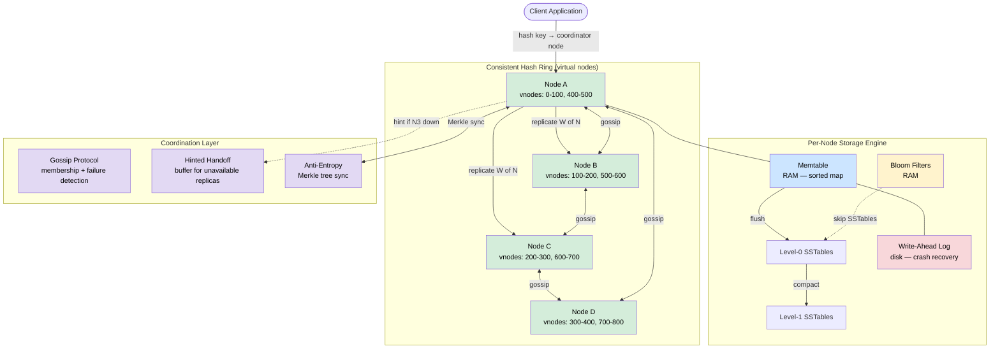
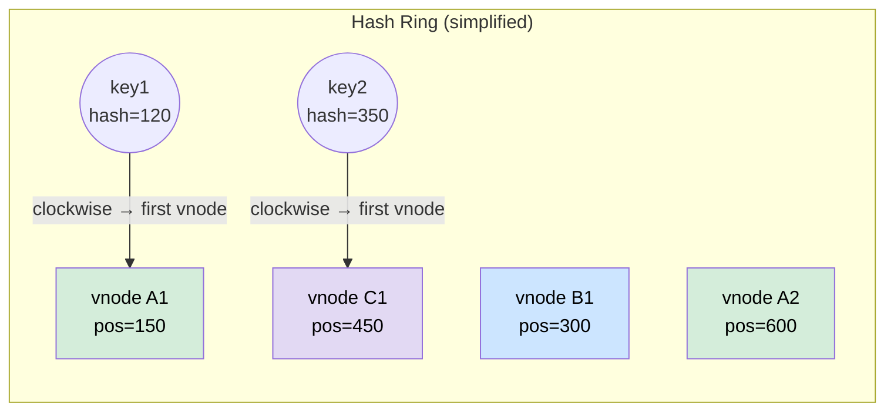
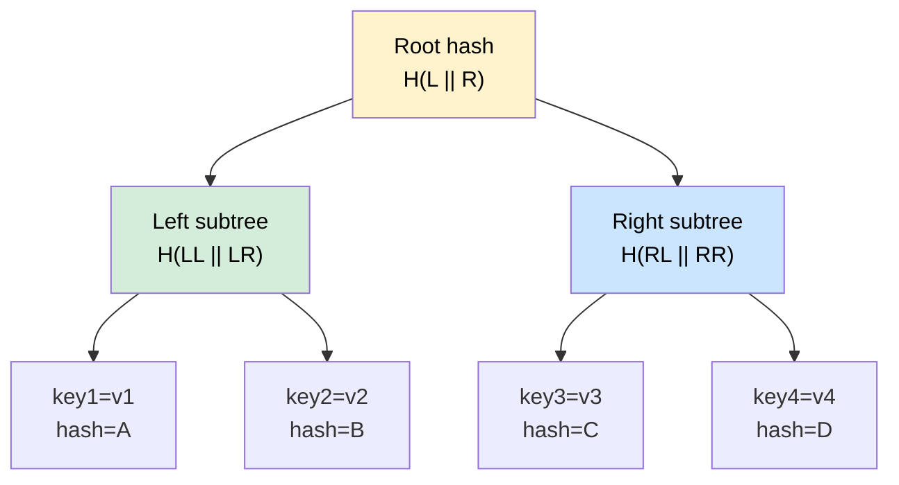
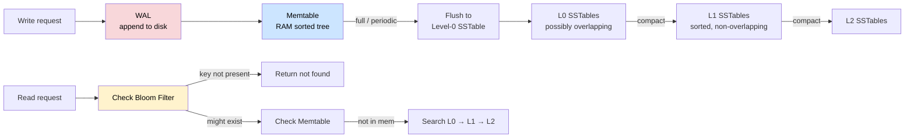

# Design Distributed Key-Value Store

> A persistent, durable, horizontally scalable key-value store with tunable consistency — think DynamoDB or Apache Cassandra.

**Difficulty:** ⭐⭐⭐⭐⭐ · **Builds on:**
[Consistent Hashing](../../Level-02-Data-Layer/08-Consistent-Hashing/README.md) ·
[Replication](../../Level-02-Data-Layer/01-Database-Replication/README.md) ·
[CAP Theorem](../../Level-04-Distributed-Systems/01-CAP-Theorem/README.md) ·
[Consistency Models](../../Level-04-Distributed-Systems/02-Consistency-Models/README.md) ·
[Clocks & Ordering](../../Level-04-Distributed-Systems/06-Clocks-and-Ordering/README.md) ·
[Distributed Cache](../18-Distributed-Cache/README.md)

---

## 1. 🎯 Problem & Scope

> **Key distinction from Design #18 (Distributed Cache):** A cache is ephemeral — data lives in RAM, eviction is expected, and losing data is tolerable. A distributed key-value store is **persistent** and **durable**. Every write survives process crashes, machine failures, and datacenter outages. You'd use it to store user profiles, shopping carts, or financial records — not cached query results.

**What we're building:** a system that:
- Stores arbitrary byte-string values under byte-string keys
- Replicates data across multiple nodes for fault tolerance
- Lets operators tune the consistency/availability trade-off per request
- Scales horizontally by adding nodes with automatic data rebalancing

**Inspiration:** Amazon Dynamo (2007 paper), Apache Cassandra, Riak KV.

**In scope:**
- `GET(key)`, `PUT(key, value)`, `DELETE(key)`
- Horizontal scaling via consistent hashing
- Replication across N nodes
- Tunable consistency (quorum reads/writes)
- Conflict resolution (vector clocks / LWW)
- Membership & failure detection via gossip
- Durable on-disk storage engine (LSM-tree)

**Out of scope:**
- Secondary indexes, range queries (that's a wide-column store like Cassandra)
- Transactions across multiple keys
- SQL / relational features

---

## 2. 📋 Requirements

### Functional
- `PUT(key, value)` — upsert a key-value pair; value up to 1 MB
- `GET(key)` → `value | not_found`
- `DELETE(key)`
- Keys up to 256 bytes; values up to 1 MB

### Non-Functional
- **Durability:** zero data loss on single-node failure; survive loss of any minority of nodes
- **Availability:** system remains readable/writable even during node failures (AP-leaning, tunable)
- **Throughput:** 100 000 reads/s + 100 000 writes/s per cluster
- **Latency:** p99 GET < 10 ms, p99 PUT < 20 ms
- **Scalability:** linear scale-out by adding nodes
- **Partition tolerance:** required (network partitions happen; we choose A over C by default, with tuning knobs)

---

## 3. 🧮 Capacity Estimation

```
Cluster: 10 nodes, each 16-core, 64 GB RAM, 4 TB SSD

Data volume:
  1 billion keys × avg 1 KB value = ~1 TB total
  With replication factor N=3: 3 TB raw storage
  Per node: 3 TB / 10 = 300 GB per node  ← fits in 4 TB SSD easily

Write throughput:
  100 000 writes/s cluster-wide
  Each write hits N=3 replicas → 300 000 write IOPS cluster-wide
  Per node: 30 000 IOPS (well within modern NVMe SSDs at 500k IOPS)

Memory (LSM-tree memtable + bloom filters):
  Memtable: 256 MB per node (flushes to disk when full)
  Bloom filters: ~10 bits/key → 1B keys × 10 bits = 1.25 GB per node
    (fits in RAM — critical for read performance)

Network:
  Write: 100k writes/s × 1 KB × 3 replicas = 300 MB/s cluster total
  Per node receives: ~30 MB/s — fine for 10 Gbps NICs
```

---

## 4. 🔌 API Design

### External (client-facing)

```
PUT /v1/keys/{key}
  Body: raw bytes (value)
  Headers: X-Consistency: quorum | one | all  (default: quorum)
  Response: 204 No Content
  ETag: <version-vector>

GET /v1/keys/{key}
  Headers: X-Consistency: quorum | one
  Response: 200 OK  +  raw bytes
            404 Not Found
  Headers: ETag: <version-vector>

DELETE /v1/keys/{key}
  Headers: X-Consistency: quorum | one | all
  Response: 204 No Content
```

### Internal (node-to-node replication)

```
PUT  /internal/replicate/{key}       # coordinator → replica
GET  /internal/replicate/{key}       # read-repair fetch
POST /internal/anti-entropy/merkle   # exchange Merkle tree roots
POST /internal/gossip                # membership state exchange
POST /internal/hint/{target_node}    # hinted handoff delivery
```

---

## 5. 🗄️ Data Model

### Logical record (per key)

| Field | Type | Description |
|-------|------|-------------|
| `key` | bytes(256) | Primary lookup key |
| `value` | bytes(1 MB) | Opaque payload |
| `version_vector` | map[node_id → counter] | Causality tracking (vector clock) |
| `timestamp` | int64 (ms) | Wall-clock for LWW fallback |
| `tombstone` | bool | True if deleted (logical delete) |
| `checksum` | uint32 | CRC32 of value for corruption detection |

### On-disk layout (LSM-tree, per node)

```
memtable (in RAM, ~256 MB)
    ↓ flush when full
Level-0 SSTables (multiple small files, potentially overlapping keys)
    ↓ compaction
Level-1 SSTables (sorted, non-overlapping within level, ~10× larger)
    ↓ compaction
Level-2 SSTables (~100× larger)
    ...
```

**Why LSM-tree over B-tree?**
- Writes always go to memtable first → sequential disk I/O on flush → much higher write throughput than random B-tree updates
- Read amplification is managed with Bloom filters (skip SSTables that can't contain the key) and block caches
- Compaction runs in the background to merge and GC tombstones

---

## 6. 🏗️ High-Level Architecture



**Walk-through (PUT request):**
1. Client sends `PUT(key, value)` to any node (or a dedicated coordinator).
2. Coordinator hashes the key → finds the N=3 nodes responsible (the key's "preference list" on the ring).
3. Coordinator writes to its own memtable + WAL, then sends replication RPCs to the other N−1 replicas in parallel.
4. With W=2 (quorum), coordinator returns success as soon as 2 of 3 replicas acknowledge.
5. If a replica is down, coordinator stores a **hinted handoff** — the write is buffered and replayed when the replica recovers.
6. Background: gossip propagates membership changes; Merkle-tree anti-entropy catches any replicas that diverged.

---

## 7. 🔬 Deep Dives

### 7.1 Partitioning via Consistent Hashing

See [Consistent Hashing deep-dive](../../Level-02-Data-Layer/08-Consistent-Hashing/README.md) for the full treatment. Summary for this system:

- Hash each key with MD5/SHA-1 → 128-bit hash → map to position on a 2^32 ring.
- Each physical node owns **V = 150 virtual nodes** (vnodes) distributed randomly around the ring.
- A key's coordinator is the first vnode clockwise from the key's hash position.
- **Why vnodes?** Adding a new physical node moves only 1/N of the data on average. Without vnodes, a new node only takes from its immediate predecessor, causing uneven load if nodes have different capacities.



**Replication:** after finding the coordinator vnode, replicate to the next N−1 distinct physical nodes clockwise. This ensures replicas are on different machines (and ideally different racks/AZs).

### 7.2 Tunable Consistency with Quorums

The system is parameterised by **N** (replication factor), **R** (reads to wait for), **W** (writes to wait for).

**Strong consistency:** R + W > N  
For N=3: W=2, R=2 → 2+2 > 3 ✅ — at least one node in every read set overlaps with every write set.

**High availability (eventual consistency):** W=1, R=1 — fastest but may return stale data.

| Setting | Latency | Consistency | Use case |
|---------|---------|-------------|---------|
| W=3, R=1 | Slow writes | Strong | Audit logs |
| W=2, R=2 | Balanced | Strong (quorum) | General purpose |
| W=1, R=3 | Slow reads | Strong | Rarely-written config |
| W=1, R=1 | Fast | Eventual | Shopping cart, session |

**Read repair:** during a quorum read, if responses disagree, the coordinator reconciles versions and asynchronously writes the winner back to lagging replicas. This converges stale replicas without needing a full anti-entropy scan.

### 7.3 Conflict Resolution — Vector Clocks & Last-Write-Wins

When two clients update the same key concurrently (before either write has been replicated), you get **conflicting versions**.

**Vector clocks** track causality: each node maintains a counter per key, incremented on each write. A version `V1` causally precedes `V2` if every counter in V1 ≤ the corresponding counter in V2.

```
Initial:    key="cart"  vc={}

Client A writes  →  vc={A:1}   value=["book"]
Client B writes  →  vc={B:1}   value=["pen"]
         (concurrent — neither saw the other)

Replica receives both:
  {A:1} and {B:1}  →  neither dominates  →  CONFLICT

Resolution strategies:
  1. Last-Write-Wins (LWW): use wall-clock timestamp; discard lower ts
     Simple but loses data if clocks skew
  2. Return both to client: client merges (Amazon "shopping cart" paper)
     Correct but complex client logic
  3. CRDT value type: use a data structure that merges automatically
     (see Design #28 for CRDTs)
```

**Dynamo's approach:** return both conflicting versions as a "sibling" list; the next client write must include a reconciled vector clock. Works well for shopping carts (union of items) but awkward for counters (use a separate CRDT counter instead).

**Cassandra's approach:** pure LWW — last timestamp wins. Simple, but requires tightly synchronised clocks. Cassandra uses hybrid logical clocks (HLC) to reduce the risk.

### 7.4 Anti-Entropy via Merkle Trees

Over time, replicas can diverge due to node restarts, network partitions, or hinted handoffs that partially failed. Anti-entropy runs in the background to detect and fix inconsistencies.

**Merkle tree:** a binary tree where each leaf is a hash of a key-value pair, and each internal node is a hash of its children. Two nodes exchange only root hashes first; if equal, everything is in sync. If different, they recurse into subtrees to find the differing leaves. This minimises data transferred.



If Node A and Node B have the same root hash → done. If they differ, compare left children, then right children, and recurse until the differing keys are found. For 1 billion keys, sync only the diverged subset — typically O(log N) messages to find mismatches.

**In Cassandra** each token range gets its own Merkle tree, rebuilt nightly during a `nodetool repair` pass. In Riak, anti-entropy runs continuously in the background.

### 7.5 Gossip-Based Membership & Failure Detection

There is no central master. Nodes use **gossip (epidemic protocol)** to share membership state:

1. Every second, each node picks a random peer and exchanges its view of the cluster (node states: alive / suspect / dead).
2. On receiving a message, a node merges the peer's state with its own using **SWIM failure detection**: if a node hasn't been heard from in T seconds, it is marked suspect; if still silent after another interval, it's declared dead.
3. Dead nodes are removed from the preference list; hinted handoffs for their data are queued for delivery when they recover.

This approach scales to thousands of nodes with O(log N) convergence time and no single coordinator to fail.

### 7.6 Hinted Handoff

When a replica node is temporarily unavailable during a write:

1. The coordinator (or another available node) stores the write locally with a **hint**: "this data belongs to node X."
2. When node X recovers and rejoins the cluster (detected via gossip), the hinting node delivers the queued writes.
3. The hint is deleted after successful delivery.

**Limits:** hints are bounded (e.g., stored for max 1 hour / 100 MB). If a node is down too long, only anti-entropy (Merkle sync) can bring it back to consistency. This is why DynamoDB recommends keeping R+W>N even with hinted handoff enabled.

### 7.7 LSM-Tree Storage Engine



**Write path:** WAL first (crash safety) → memtable (fast RAM write) → flush to SSTable when memtable is full.

**Read path:** check memtable → check Bloom filter for each SSTable level (skip if key definitely absent) → binary search in SSTable file.

**Bloom filter miss rate:** at 10 bits/key, false-positive rate ≈ 0.8%. Means only ~1% of SSTables are read unnecessarily per GET — huge read amplification savings.

**Compaction** merges SSTables, removes tombstones, and reclaims space. Leveled compaction (LevelDB/RocksDB style) is best for read-heavy workloads; size-tiered compaction (Cassandra default) is better for write-heavy workloads.

---

## 8. 📈 Scaling, Bottlenecks & Failure Modes

| Scenario | Impact | Mitigation |
|----------|--------|-----------|
| Node failure (< N/2+1) | Reduced replication until recovery | Hinted handoff + Merkle anti-entropy on return |
| Network partition | Writes succeed on partition with quorum; minority partition serves stale reads | Tunable R/W; clients handle `not_quorum` errors |
| Hot key (celebrity problem) | One set of N nodes overwhelmed | Key-level rate limiting; read-your-own-writes caching layer |
| Compaction I/O spike | Latency spikes during compaction | Rate-limit compaction; schedule during off-peak; add I/O capacity |
| Vector clock growth | VC entries accumulate per conflicting writer | Prune VCs after a fixed number of entries (Dynamo prunes at 10) |
| Clock skew (LWW) | Writes with earlier timestamps silently dropped | Use HLC; monitor NTP offset; alert on skew > 100 ms |
| Gossip storm on large cluster | O(N²) messages on sudden mass failure | Limit fan-out; use hierarchical gossip; bound membership state size |

**Scaling write throughput:** add nodes → consistent hashing redistributes ~1/N of keys to the new node automatically (with rebalancing traffic). For 2× throughput, add 2× nodes.

**Hotspot mitigation:** if a specific key is extremely hot, the solution is to de-normalise the value into multiple keys (e.g., `cart:user:1:shard:0` … `:shard:9`) and aggregate on read.

---

## 9. ⚖️ Trade-offs & Alternatives

| Decision | Chosen | Alternative | Why chosen |
|----------|--------|-------------|-----------|
| Consistent hashing | ✅ | Range-based partitioning | CH avoids full reshuffle on node add/remove |
| AP (availability + partition tolerance) | ✅ | CP (consistency + partition tolerance) | Most KV use cases tolerate brief staleness; availability is critical |
| LSM-tree | ✅ | B-tree (InnoDB) | LSM has far higher write throughput; reads still fast with Bloom filters |
| Gossip membership | ✅ | ZooKeeper/etcd consensus | Gossip has no SPOF and scales to thousands of nodes; consensus is simpler but limited to ~100 nodes |
| Vector clocks | ✅ | LWW | VC preserves causality; LWW silently discards concurrent writes |
| Quorum consistency | ✅ | Single-master replication | Quorum allows all nodes to serve writes (no bottleneck master) |

---

## 10. 🌐 How It's Actually Done

- **Amazon Dynamo** (2007 paper by DeCandia et al.) — the blueprint for this design. Uses consistent hashing, N/R/W quorums, vector clocks with client-side reconciliation, gossip, Merkle anti-entropy, and hinted handoff. Dynamo runs under Amazon's shopping cart and session storage. The paper is required reading.
- **Apache Cassandra** — merges Dynamo's distribution model with Google Bigtable's column-family data model. Uses LWW (no vector clocks) with tunable quorums. CQL (Cassandra Query Language) adds secondary indexes and range queries on top.
- **Riak KV** — open-source Dynamo clone. Supports both LWW and vector-clock siblings. Has a rich anti-entropy system with active background repair. Used by Riot Games and GitHub at scale.
- **Amazon DynamoDB** (the managed service, distinct from the 2007 Dynamo paper) — single-digit-millisecond reads/writes via a fully managed API. Internally uses log-structured storage, global secondary indexes, and transparent partitioning.
- **ScyllaDB** — Cassandra-compatible but rewritten in C++ with a share-nothing architecture (one core per shard). Achieves much lower p99 latency than Java-based Cassandra.
- **FoundationDB** — takes the opposite trade-off: CP (strict serializability) using a distributed log + MVCC. Powers Apple iCloud and Snowflake's metadata layer. Proves CP KV stores are viable at scale when you need it.

---

## 11. 📝 Summary

| Component | Design choice |
|-----------|--------------|
| Partitioning | Consistent hashing with 150 vnodes per physical node |
| Replication | N=3 replicas; next N−1 distinct nodes clockwise on ring |
| Consistency | Tunable R + W; default W=2 R=2 (quorum, strong) |
| Conflict resolution | Vector clocks with client merge (or LWW with HLC) |
| Anti-entropy | Merkle tree reconciliation between replica pairs |
| Membership | SWIM gossip protocol; no central coordinator |
| Failure handling | Hinted handoff (temporary) + Merkle repair (long-term) |
| Storage engine | LSM-tree: WAL → memtable → SSTables + Bloom filters + compaction |

The fundamental insight from the Dynamo paper is that **availability and consistency are a dial, not a switch**. By exposing N, R, and W as tunable parameters, the system can serve both use cases that need strong consistency (financial counters: W=3 R=2) and use cases that need maximum availability (shopping carts: W=1 R=1) — often within the same cluster. The engineering challenge is making the "eventually consistent" path truly converge reliably, which is exactly what Merkle anti-entropy, hinted handoff, and vector clocks are designed to do.
