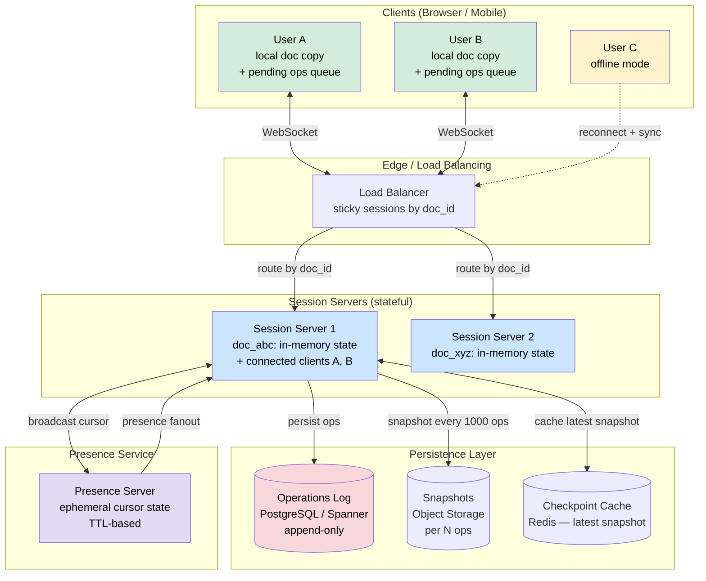
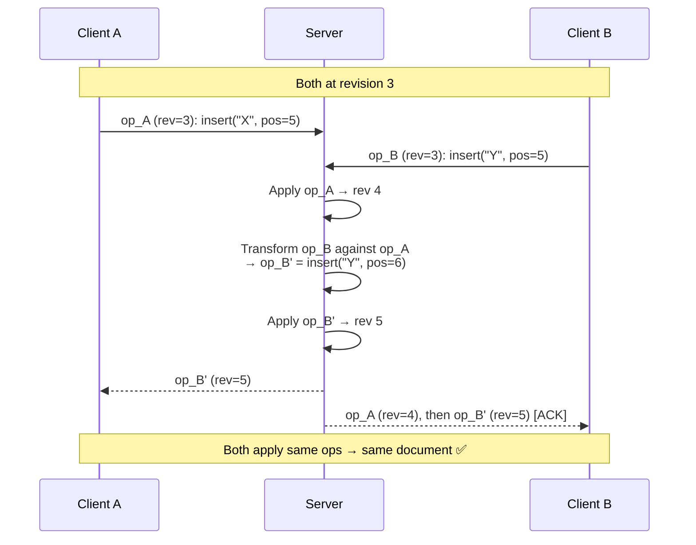
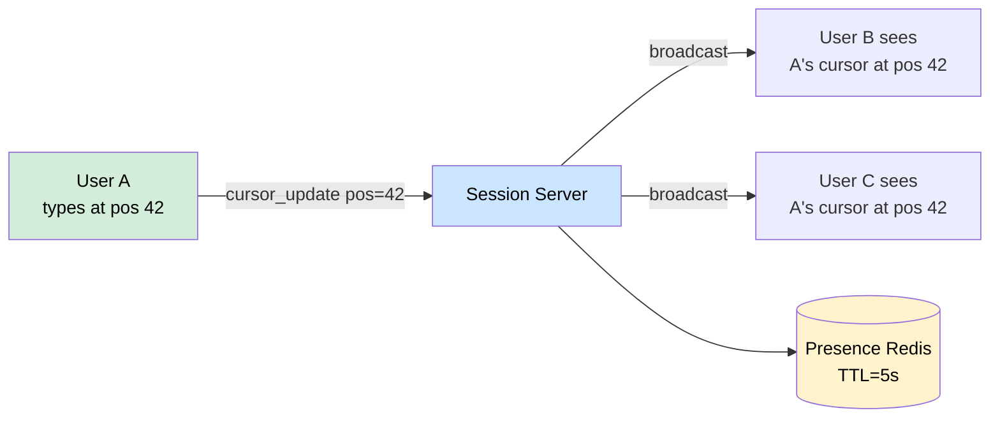
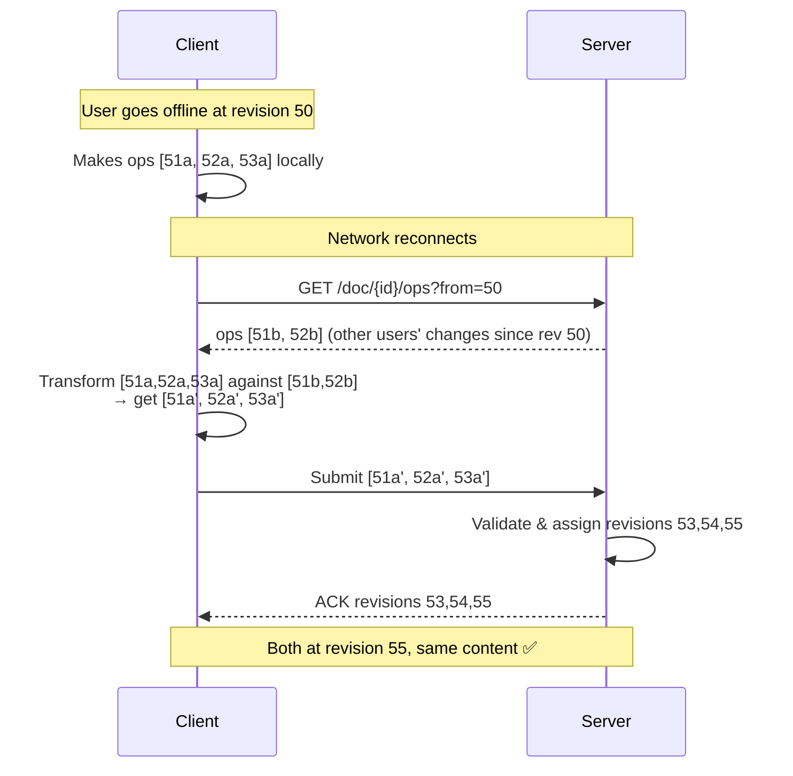

# Design Google Docs Collaborative Editing

> Real-time collaborative document editing where multiple users see each other's changes instantly and conflicts are resolved automatically.

**Difficulty:** ⭐⭐⭐⭐⭐ · **Builds on:**
[WebSockets & Realtime](../../Level-03-Communication/06-WebSockets-and-Realtime/README.md) ·
[Idempotency](../../Level-04-Distributed-Systems/07-Idempotency-and-Exactly-Once/README.md) ·
[Distributed Counter & Analytics (CRDTs)](../23-Distributed-Counter-Analytics/README.md) ·
[Consistency Models](../../Level-04-Distributed-Systems/02-Consistency-Models/README.md)

---

## 1. 🎯 Problem & Scope

Google Docs is the canonical example of a system where **the hardest engineering problem is not storage or throughput — it is correctness**. When two people type at the same position in a document simultaneously, whose change wins? More importantly, can you make it so that both changes are preserved and the document converges to the same state on every user's screen?

**What we're building:** a real-time collaborative text editor where:
- Multiple users edit the same document simultaneously
- Changes propagate to all collaborators within ~100 ms
- No edit is ever silently discarded
- Users see each other's cursors and selections
- Documents are durably persisted and have full version history
- Users can work offline and reconcile when reconnected

**In scope:**
- Rich-text document editing (bold, italic, paragraphs, lists)
- Real-time sync via WebSockets
- Presence (cursor positions, user avatars)
- Persistent storage + version history
- Offline editing + reconciliation

**Out of scope:**
- Comments and suggestions
- Spreadsheets or slide decks (different data model)
- Access control / sharing (important but orthogonal)
- Full-text search

---

## 2. 📋 Requirements

### Functional
- Multiple users can edit the same document concurrently
- All users see the same final document state (convergence)
- No valid edit is silently dropped
- Cursor and selection presence visible to all collaborators
- Version history: view or restore any past version
- Offline editing: queue changes, sync on reconnect

### Non-Functional
- **Latency:** local keystrokes appear immediately (optimistic local apply); remote changes arrive within 100 ms on same continent
- **Consistency:** strong eventual consistency — all clients converge to the same state after receiving the same set of operations
- **Availability:** document readable/writable even if some backend nodes are down
- **Scale:** 10 million simultaneous collaborative sessions; average 5 collaborators per session
- **Durability:** zero document data loss; 30-day version history
- **Document size:** up to 10 MB of rich text per document

---

## 3. 🧮 Capacity Estimation

```
Active sessions: 10M documents × 5 users avg = 50M connected WebSocket clients

Keystroke rate:
  Average typist: 5 keystrokes/second
  50M users × 5 keys/s = 250M operations/second peak
  But: not all users type simultaneously; active typing ~20% of session time
  Realistic: 50M × 5 × 0.2 = 50M ops/s
  Each op: ~50 bytes (JSON operation payload)
  Network: 50M × 50B = 2.5 GB/s outbound from servers

Storage:
  Op log: 50M ops/s × 50 bytes × 86400 s/day = ~216 TB/day of op logs
  Compaction: store checkpoints every 1000 ops → keep only recent ops
  Checkpointed documents: 10M docs × avg 100 KB = 1 TB
  30-day op logs (compressed): ~5 TB/day → 150 TB total

WebSocket connections:
  50M connections / 10k connections per server = 5000 servers
  These are long-lived, mostly idle connections — cheap per server
```

---

## 4. 🔌 API Design

### Client → Server (over WebSocket)

```json
// Submit an operation
{
  "type": "op",
  "doc_id": "doc_abc123",
  "client_id": "client_xyz",
  "op": {
    "type": "insert",
    "position": 42,
    "text": "Hello",
    "attributes": { "bold": true }
  },
  "revision": 157
}

// Acknowledge a received operation
{ "type": "ack", "revision": 158 }

// Presence update
{
  "type": "cursor",
  "position": 42,
  "selection_end": 47,
  "user_id": "user_123"
}
```

### Server → Client (broadcast)

```json
// Transformed operation for client to apply
{
  "type": "op",
  "revision": 158,
  "op": { "type": "insert", "position": 45, "text": "World" },
  "author": "user_456"
}

// Presence broadcast
{
  "type": "presence",
  "cursors": [
    { "user_id": "user_456", "position": 45, "color": "#FF5733" }
  ]
}
```

### REST (document management)

```
GET  /v1/docs/{doc_id}                 → current snapshot + revision number
GET  /v1/docs/{doc_id}/history?from=100&to=200  → op log slice
POST /v1/docs/{doc_id}/checkpoint      → force snapshot (admin)
POST /v1/docs                          → create new document
```

---

## 5. 🗄️ Data Model

### Documents table

| Column | Type | Description |
|--------|------|-------------|
| `doc_id` | UUID | Primary key |
| `title` | text | Document title |
| `owner_id` | UUID | Creator |
| `created_at` | timestamp | |
| `snapshot` | JSONB | Current document content (rich-text AST) |
| `snapshot_revision` | int | Revision number of the snapshot |

### Operations log (append-only)

| Column | Type | Description |
|--------|------|-------------|
| `doc_id` | UUID | FK to documents |
| `revision` | int | Global revision for this doc (monotonic) |
| `client_id` | UUID | Which client sent this op |
| `user_id` | UUID | Author |
| `op_data` | JSONB | The (transformed) operation |
| `created_at` | timestamp | Server receipt time |
| PRIMARY KEY | (doc_id, revision) | |

**Storage justification:**
- Operations log in PostgreSQL (or Spanner for global scale): append-only, never updated → excellent write throughput; JSONB for flexible op schemas
- Snapshots written every N operations so that loading a document only replays the last few hundred ops, not millions
- Version history: keep all rows in the operations log forever (or archive to object storage after 30 days)
- In-memory: each document session server holds the current document state + a pending-op buffer in RAM for fast OT/CRDT processing

---

## 6. 🏗️ High-Level Architecture



**Walk-through (online edit):**
1. User A types a character. The client **optimistically applies** the op locally (instant feedback) and sends it to the session server over WebSocket.
2. The session server (S1) holds the authoritative in-memory state for that document. It assigns the next global revision number to the op, transforms it against any concurrent ops it knows about (OT) or merges it (CRDT), and appends it to the operations log.
3. S1 broadcasts the (possibly transformed) op + its revision to all other connected clients (B, C if online).
4. Each client applies the incoming op using its local OT/CRDT algorithm to reconcile with its own pending ops.
5. All clients converge to the same document state.

---

## 7. 🔬 Deep Dives

### 7.1 The Core Conflict Problem

Imagine the document contains the text `"Hello"` and two users act simultaneously:

```
User A (at position 5): inserts " World"   → expects "Hello World"
User B (at position 0): inserts "Say: "    → expects "Say: Hello"
```

Both ops are created against revision N. The server receives A's op first. If B's op is then naively applied at position 0 — fine, it's before the insertion. But if B instead had inserted after position 3 and A inserted at position 3 too, the positions shift underneath each other and you get garbled text.

**The invariant you need:** given any two concurrent operations O1 and O2, applying O1 then transform(O2, O1) must yield the same final document as applying O2 then transform(O1, O2). This is called the **convergence property** (also: CC1 in OT literature).

### 7.2 Operational Transformation (OT)

**How it works:** when the server receives an op from a client, it knows which revision the client was at when it generated the op. If the server's document is now at a later revision (because other ops came in), it **transforms** the incoming op against each intermediate op to adjust positions.

```
Server state: "Hello World"  (revision 5)
Client A was at revision 4: "Hello"
Client A's op: insert(" World", pos=5)   at revision=4

Server transforms insert(" World", pos=5) against the ops between rev4 and rev5:
  Intermediate op: insert("Say: ", pos=0)
  Transform: position 5 shifts right by 5 → new position = 10
  Transformed op: insert(" World", pos=10)

Server applies transformed op:
  "Say: Hello" → "Say: Hello World"  ✅
```

**The transform function** for basic text operations (insert/delete) is relatively simple. For rich-text attributes (bold, heading level), transforms become more complex and subtle.

**OT limitations:**
- The transform function must handle all pairs of operation types — complex to implement correctly
- The classic "TP2" property (needed for peer-to-peer OT without a central server) is extremely hard to implement without bugs
- A **central server** that serialises all operations sidesteps TP2: clients only need to transform against the server's linear history, not against each other directly

**Google Docs uses OT** (specifically the Jupiter protocol, described in the 1995 Xerox PARC paper). All clients funnel through a central server that assigns a total order to operations. This is simpler and correct, at the cost of requiring a central authority.



### 7.3 CRDTs — The Alternative

**Conflict-free Replicated Data Types** take a fundamentally different approach: rather than transforming operations, design the data structure so that concurrent operations **commute** — order doesn't matter.

**CRDT text approaches:**

**Logoot / LSEQ:** assign each character a unique fractional position between 0 and 1. Insertions are always at new fractional positions that don't conflict with existing ones:
```
Initial: [(0.25, "H"), (0.5, "i")]  →  "Hi"
User A inserts "!" between them: position = (0.25+0.5)/2 = 0.375
User B inserts "?" between them: position = 0.376 (different random sub-position)
Merge: [(0.25,"H"), (0.375,"!"), (0.376,"?"), (0.5,"i")]  →  "H!?i"
No conflict — just sort by position.
```

**RGA (Replicated Growable Array):** each character has a unique ID (timestamp + site). Insertions reference the ID of the character they come after. Deletions mark a character as a tombstone (keeps its position in the sequence).

**Yjs** (JavaScript CRDT library) implements a highly optimised variant called YATA. It achieves O(1) amortised insert/delete by representing the document as a linked list of items with unique IDs.

**CRDT advantages over OT:**
- No central server required — peers can sync directly (peer-to-peer collaboration, offline merges)
- Simpler reasoning: commutativity is provable; no subtle transform bugs
- Natural support for offline editing — changes merge on reconnect without server coordination

**CRDT disadvantages:**
- Tombstones accumulate (deleted characters remain in the data structure forever, just hidden) → memory growth
- Fractional positions can require arbitrary precision over time (Logoot degrades)
- More complex to implement for rich text attributes (not just character positions)
- Historical: OT was invented first (1989), CRDTs came later (2006), and many mature systems (Google Docs) are deeply invested in OT

| Property | OT (central) | CRDT |
|----------|-------------|------|
| Central server needed | Yes | No |
| Offline-first | Hard | Natural |
| Memory growth | Clean (op log compacted) | Tombstones accumulate |
| Implementation complexity | Medium (transform functions) | Medium (data structure) |
| Who uses it | Google Docs, Office Online | Figma, Notion (hybrid), Yjs/Automerge ecosystems |

**Figma uses CRDTs** for its multiplayer design canvas. Since design objects (shapes, layers) are more amenable to CRDT semantics than linear text, CRDTs are a natural fit.

### 7.4 Cursor Presence & Awareness

Cursors are **ephemeral** — they don't need to be stored in the operations log. The presence system is a separate lightweight path:

1. Client sends cursor position with every keystroke (or on a 50 ms throttle).
2. Session server broadcasts cursor positions to all other clients in the session.
3. Cursor positions are stored in Redis with a short TTL (5 seconds). If a client disconnects, its cursor disappears automatically.
4. When a remote op arrives, the client adjusts remote cursors using the same OT/CRDT position logic: if someone inserts text before my cursor, my cursor position shifts right.



### 7.5 Document Persistence & Version History

**Every write is an append to the operations log**, not an update to the document. The document's current state is always derivable by replaying ops from the last snapshot.

**Snapshotting strategy:**
- Every 1 000 operations (or every 5 minutes), the session server writes a full document snapshot to object storage (S3 / GCS).
- On document load: fetch latest snapshot from cache → replay only ops after the snapshot's revision.
- This bounds load time regardless of document history length.

**Version history UI:**
- Show snapshots as named versions
- Between snapshots, show per-operation diffs
- "Restore" creates a new op that replaces document state (doesn't delete history)

**Retention:** keep all ops for 30 days (for version history); archive older ops to cold storage (Glacier/Coldline). Snapshots are kept indefinitely (small compared to op logs).

### 7.6 Offline Editing & Reconciliation



The client is essentially running the same OT algorithm it uses online — it just batches the pending ops and submits them as a group. The server transforms the batch against whatever ops arrived during the offline period.

For **long offline periods** (days), the conflict resolution can be complex. Google Docs handles this by prompting the user: "You've been offline for a long time. Here are the changes you made offline — do you want to merge them?" — gracefully degrading to a human-in-the-loop resolution.

---

## 8. 📈 Scaling, Bottlenecks & Failure Modes

| Scenario | Impact | Mitigation |
|----------|--------|-----------|
| Session server crash | All clients in that doc session lose WebSocket; must reconnect | Clients reconnect (exponential backoff); new session server loads doc from latest snapshot + ops log |
| Hot document (1M concurrent editors) | One session server overwhelmed | Shard by cursors / sections; hierarchical OT with sub-document servers |
| Operations log write bottleneck | High-throughput docs hit DB write limits | Batch op writes; use Spanner or Cassandra for op log; async persistence with WAL buffer |
| Client sends gigantic op batch | Server OOM during transform | Cap batch size; reject batches > 1 000 ops; require incremental sync |
| Presence fanout storm | 10 000 users × 50M updates/s | Throttle presence updates (50 ms); use pub/sub fan-out tree; don't send presence to inactive tabs |
| CRDT tombstone explosion | Memory grows unboundedly in long-lived documents | Periodic GC: rebuild document from scratch, assign new IDs, discard tombstones |
| Network partition between session servers | Split-brain: two servers both think they're authoritative | Use only ONE session server per document (strong leader); use distributed lock on doc_id via etcd |

**The key scaling insight:** the bottleneck is not the OT computation (that's O(n) in concurrent ops, typically tiny) — it's the **fan-out**. Broadcasting a single op to 1 000 connected clients takes 1 000 WebSocket sends. Use a pub/sub layer (Redis Pub/Sub, Kafka, or a custom multicast) to decouple the session server from the fan-out.

---

## 9. ⚖️ Trade-offs & Alternatives

| Decision | Chosen | Alternative | Why |
|----------|--------|-------------|-----|
| OT (central server) | For text | Peer-to-peer OT | Central server avoids TP2 complexity; simpler correctness proof |
| CRDT | For object/canvas (Figma) | OT | CRDTs are naturally P2P; better for non-linear structures |
| WebSocket (persistent) | ✅ | HTTP long-poll / SSE | WebSocket is bidirectional; lower latency; better for high-frequency ops |
| Op log as source of truth | ✅ | Mutable document store | Append-only log is immutable, auditable, and enables version history for free |
| Snapshot + replay | ✅ | Full document replication on every change | Snapshot bounds load time; replaying 100 ops is fast |
| Single session server per doc | ✅ | Distributed multi-master per doc | Avoids multi-master conflict; session server is lightweight (stateless on restart) |

---

## 10. 🌐 How It's Actually Done

- **Google Docs — Jupiter protocol (OT):** the original 1995 Jupiter paper (Nichols et al., Xerox PARC) described the central-server OT model Google later adopted. Each client maintains a two-state machine: "sent but unacknowledged" ops and "applied" ops. On receiving a server op, the client transforms it against its pending ops. Google extended this to handle rich text attributes. The server-side is a single process per document (with failover), not a distributed cluster.

- **Microsoft Office Online** uses a similar OT approach (they call it "co-authoring") with SharePoint / OneDrive as the persistence layer. PowerPoint Online and Word Online have different conflict models because presentations have independent slides (less likely to conflict).

- **Figma (CRDTs):** Figma's 2019 blog post "How Figma's multiplayer technology works" explains their CRDT-based system. Design objects are represented as a map of property → last-write-wins value. Shapes rarely have two users editing the same pixel simultaneously, so LWW CRDTs work well. Figma uses a central server for ordering but the data structure is CRDT (no transform logic needed).

- **Notion** uses a hybrid approach: block-level OT (each document block is independently OT-managed), plus CRDTs for block structure (block tree, page hierarchy). This lets them handle both text editing (OT) and page structure changes (CRDT) cleanly.

- **Yjs / Automerge** are open-source CRDT libraries. Yjs is used in production by many startups (JupyterLab collaborative mode, various editors). Automerge (from Ink & Switch) is more research-oriented but has production deployments. Both support offline-first editing natively.

- **Quill.js + ShareDB (OpeNational Transforms):** the open-source stack for OT-based collaborative editing. ShareDB is a Node.js real-time database built on OT; Quill is the rich-text editor. This is the "self-hosted Google Docs" stack used by many companies.

---

## 11. 📝 Summary

| Component | Design choice |
|-----------|--------------|
| Conflict algorithm | OT (central server, Jupiter model) for text; CRDT option for object graphs |
| Transport | WebSocket (persistent, bidirectional, low latency) |
| Session management | One authoritative session server per document; stateless on restart (loads from snapshot + op log) |
| Persistence | Append-only operations log (PostgreSQL/Spanner) + periodic snapshots (S3/GCS) |
| Presence | Ephemeral Redis (TTL 5s); position-adjusted by OT on remote ops |
| Offline support | Client queues ops locally; on reconnect, fetches missed ops and transforms pending batch |
| Version history | Replay ops from any snapshot forward; retain 30 days |
| Scaling | Session server fan-out via pub/sub; one server per doc; shard by doc_id for hot docs |

The hardest insight in collaborative editing is that **the problem isn't storage or networking — it's maintaining the invariant that every client converges to the same document**. OT solves this with transform functions and a central authority. CRDTs solve it by designing data structures where concurrent edits commute. Both approaches work; choose OT when you have a central server and need battle-tested text editing semantics, choose CRDTs when you need peer-to-peer or offline-first semantics with non-linear data structures.
