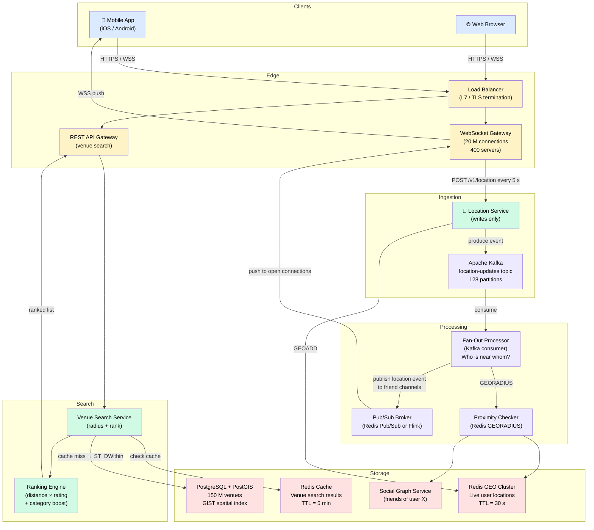
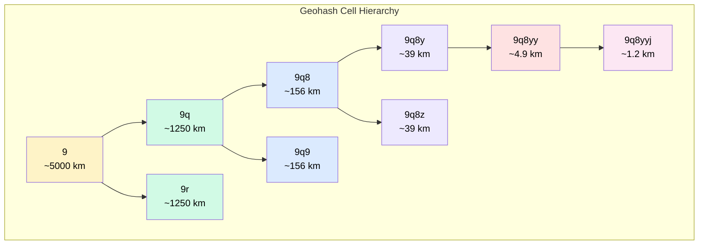
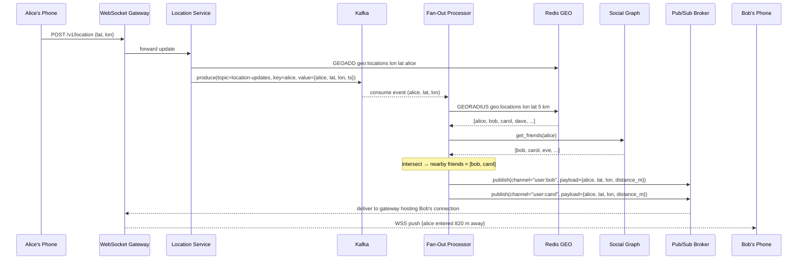
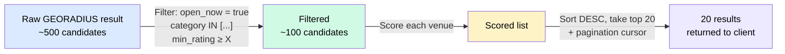

# Design Nearby Friends / Proximity

> Find nearby friends and places — static venue search (Yelp-style) and dynamic real-time friend location (Snap Map / Find My Friends)

**Difficulty:** ⭐⭐⭐⭐ · **Builds on:**
[Geospatial Indexing](../../Level-07-Big-Data-and-Specialized/07-Geospatial-Indexing/README.md) ·
[Pub/Sub](../../Level-03-Communication/05-Pub-Sub/README.md) ·
[WebSockets & Realtime](../../Level-03-Communication/06-WebSockets-and-Realtime/README.md)

---

## 1. 🎯 Problem & Scope

"Nearby" is deceptively simple. Type it into your phone and you could be asking two completely different things:

- **"Find me nearby coffee shops"** — you want a ranked list of static places from a fixed dataset. The coffee shops don't move. This is the **Yelp / Google Places** model: a search problem over a large but stable geospatial dataset.
- **"Where are my friends right now?"** — your friends are moving continuously. You need their *live* locations pushed to you, and your location pushed to them, in near-real time. This is the **Snap Map / Find My Friends** model: a stream-processing and fan-out problem.

These two problems *look* similar but require fundamentally different architectures. This case study covers both, makes the distinction explicit, and shows you how to handle the hard parts: geospatial indexing for radius queries, a dynamic location pipeline with pub/sub fan-out, Redis GEO commands, and how real companies like Yelp, Snap, Tinder, and Uber solve this in production.

**In scope:**
- Search nearby static venues (restaurants, shops, landmarks) with ranking by distance/rating/category
- Track and broadcast real-time friend locations
- Radius queries: "show everything within N km"
- Privacy controls (opt-in, friend-only visibility)

**Out of scope:**
- Directions / turn-by-turn navigation
- Social graph management (assume a friends service exists)
- Payments for venue ads (though we note the hook — see [Payment System](../17-Payment-System/README.md))

---

## 2. 📋 Requirements

### Functional

**Static venue search (Yelp-style)**
- Search venues within a radius (1 km – 50 km) of a GPS coordinate
- Filter by category (food, coffee, bars, parks…)
- Rank results by distance, rating, or relevance
- Return venue details: name, address, rating, hours, photos

**Dynamic friend proximity (Snap Map / Find My Friends)**
- Users share their live GPS location (updated every few seconds while active)
- See a list/map of which friends are "nearby" (within a configurable radius — say 5 km)
- Receive near-real-time pushes when a friend enters or leaves your radius
- Respect privacy: users can pause sharing; only visible to accepted friends

### Non-Functional

| Property | Target |
|---|---|
| Venue search latency | < 200 ms p99 |
| Friend location freshness | < 5 s end-to-end |
| Availability | 99.99 % (friend location), 99.9 % (venue search) |
| Location update write throughput | 2 M writes/s (peak) |
| Concurrent WebSocket connections | 50 M |
| Data durability | Location is ephemeral; venue data durable |
| Privacy | Friend location never exposed outside friendship graph |

---

## 3. 🧮 Capacity Estimation

### Users and activity

```
Total registered users:      500 M
Daily active users (DAU):    100 M
Peak concurrent (20 % DAU):   20 M sharing location
Active users sending updates: 10 M  (50 % of concurrent are "active-foreground")
```

### Location update write throughput

Active users send a GPS ping every **5 seconds**:

```
Write QPS  = 10 M users ÷ 5 s  = 2,000,000 writes/s  (2 M/s peak)
```

Each location record: `user_id (8 B) + lat (8 B) + lon (8 B) + timestamp (8 B)` = **32 bytes**

```
Write bandwidth = 2 M/s × 32 B  ≈ 64 MB/s  ≈ 512 Mbps
```

This is very achievable with a Redis cluster or Kafka, but it means a naive SQL `UPDATE users SET lat=…` at 2 M/s would be catastrophic — we need a dedicated location store.

### Fan-out read load

When you receive a location update, you must check: "who are this user's nearby friends?" and push to them.

Assume each active user has **50 active friends**, and **5 %** of those are in proximity at any moment:

```
Fan-out events/s = 2 M writes/s × (50 × 0.05) = 2 M × 2.5 = 5 M push events/s
```

### Venue dataset

```
Venues globally (Yelp-scale): ~150 M
Average record size:            1 KB (name, address, coords, category, rating)
Total venue storage:           ~150 GB  → fits comfortably in a distributed cache
```

### WebSocket connections

```
20 M concurrent users × 1 WebSocket each = 20 M connections
At 50 k connections per WebSocket server  = 400 WebSocket servers
```

---

## 4. 🔌 API Design

### Venue search (REST)

```
GET /v1/venues/nearby
  ?lat=37.7749&lon=-122.4194
  &radius_km=5
  &category=restaurant
  &sort=distance          # distance | rating | relevance
  &limit=20
  &cursor=<opaque>

Response 200:
{
  "venues": [
    {
      "venue_id": "v_abc123",
      "name": "Tartine Bakery",
      "category": "bakery",
      "distance_m": 340,
      "rating": 4.7,
      "review_count": 8200,
      "address": "600 Guerrero St, SF",
      "lat": 37.7614,
      "lon": -122.4241,
      "open_now": true
    }, ...
  ],
  "next_cursor": "eyJvZmZzZXQiOjIwfQ=="
}
```

### Friend location (WebSocket + REST)

```
# Open a persistent connection
WS wss://proximity.example.com/v1/friends/live
  → server pushes location updates for friends in real time

# One-shot snapshot (for cold start or background refresh)
GET /v1/friends/nearby
  ?radius_km=5
  &limit=50

Response:
{
  "friends": [
    {
      "user_id": "u_xyz",
      "display_name": "Alex",
      "avatar_url": "...",
      "distance_m": 820,
      "last_updated_at": "2026-06-24T10:05:01Z",
      "bearing_deg": 42        # optional compass direction
    }, ...
  ]
}

# Update your own location (called by the mobile client every 5 s)
POST /v1/location
{
  "lat": 37.7749,
  "lon": -122.4194,
  "accuracy_m": 10,
  "timestamp": "2026-06-24T10:05:00Z"
}
```

### Privacy toggle

```
PATCH /v1/location/sharing
{
  "mode": "friends"     # friends | nobody | everyone (venue check-in context)
}
```

---

## 5. 🗄️ Data Model

### Venue table (PostgreSQL with PostGIS)

| Column | Type | Notes |
|---|---|---|
| venue_id | UUID PK | |
| name | VARCHAR(255) | |
| category | VARCHAR(64) | indexed |
| lat | DOUBLE | |
| lon | DOUBLE | |
| geohash | VARCHAR(12) | derived, indexed |
| location | GEOMETRY(Point, 4326) | PostGIS column |
| rating | FLOAT | |
| review_count | INT | |
| address | TEXT | |
| open_hours | JSONB | keyed by day |
| is_active | BOOL | soft delete |
| created_at | TIMESTAMPTZ | |

**Index:** `CREATE INDEX venues_location_idx ON venues USING GIST(location);`
This gives O(log N) radius queries via PostGIS `ST_DWithin`.

### User location (Redis — ephemeral, not persisted to SQL)

Redis GEO sorted set per shard:

```
Key:    "geo:locations"          (or geo:locations:<shard_id>)
Type:   Sorted Set (geohash score)
Value:  GEOADD geo:locations <lon> <lat> <user_id>
Query:  GEORADIUS geo:locations <lon> <lat> 5 km ASC COUNT 200
TTL:    Auto-expire entries older than 30 s (sliding window via separate TTL key)
```

### Friend graph (read-only reference — owned by Social Graph service)

```
friendship(user_a UUID, user_b UUID, created_at TIMESTAMPTZ)
PK: (min(a,b), max(a,b))  — canonical ordering avoids duplicates
```

### Location event log (Kafka — transient)

```
Topic: location-updates
Key:   user_id           (ensures ordering per user)
Value: { user_id, lat, lon, timestamp, accuracy_m }
Partitions: 128 (for 2 M/s ingestion)
Retention: 1 hour (ephemeral stream, not long-term storage)
```

**Storage justification:**

- **PostgreSQL + PostGIS** for venues: durable, queryable, well-understood; GiST spatial index handles radius queries. Fits in memory on a large instance (150 GB).
- **Redis GEO** for live user locations: in-memory for sub-millisecond reads; GEORADIUS is a native O(N+log M) operation; data is ephemeral (stale after 30 s anyway).
- **Kafka** as the location update bus: decouples mobile clients from the fan-out processing; absorbs write spikes; replayable for debugging.

---

## 6. 🏗️ High-Level Architecture



### Numbered walk-through

1. **Mobile client sends location ping** every 5 s via the persistent WebSocket connection (same socket used to receive pushes — avoids re-establishing connections). The WebSocket Gateway forwards location updates to the **Location Service**.
2. **Location Service** does two things atomically-ish: writes `GEOADD geo:locations <lon> <lat> <user_id>` to **Redis GEO** (immediate read availability), and produces an event to **Kafka** (durable bus for fan-out processing).
3. **Fan-Out Processor** consumes from Kafka. For each location update it calls `GEORADIUS` on Redis GEO to find all users within N km, then intersects with the user's friend list from the **Social Graph Service** to find nearby *friends*.
4. **Fan-Out Processor** publishes a `location_update` event to the **Pub/Sub Broker** on a per-user channel (e.g., channel `user:<friend_id>`).
5. **WebSocket Gateway** is subscribed to channels for all users it currently hosts. It receives the pub/sub message and pushes it over the open WebSocket to that friend's mobile app.
6. **Venue search** is completely separate. The **REST API Gateway** routes `GET /venues/nearby` to the **Venue Search Service**, which checks **Redis Cache** first (popular geohash cells cached for 5 min), then falls back to a PostGIS `ST_DWithin` query, applies the **Ranking Engine**, and returns results.

---

## 7. 🔬 Deep Dives

### 7.1 Geospatial Indexing: Geohash vs Quadtree

Both geohash and quadtrees solve the same problem: how do you efficiently find all points within a radius? A naive approach scanning every record is O(N) — unacceptable at 150 M venues or 10 M live users.

See [Geospatial Indexing deep dive](../../Level-07-Big-Data-and-Specialized/07-Geospatial-Indexing/README.md) for the full treatment. Here's the key intuition:

**Geohash** divides the world into a grid of cells using a base-32 string. Longer strings = smaller cells. Cells that share a prefix are geographically close (mostly — there are edge artifacts at boundaries).

```
Geohash precision table:
  Precision 1 → ~5,000 km × 5,000 km   (e.g. "9")
  Precision 2 → ~1,250 km × 625 km     (e.g. "9q")
  Precision 3 → ~156 km × 156 km       (e.g. "9q8")
  Precision 4 → ~39 km × 19 km         (e.g. "9q8y")
  Precision 5 → ~4.9 km × 4.9 km       (e.g. "9q8yy")   ← good for 5 km radius
  Precision 6 → ~1.2 km × 0.6 km       (e.g. "9q8yyj")  ← good for 1 km radius
```



**Radius query with geohash:** To find venues within 5 km of a point, you compute the geohash at precision 5 for that point, then query the cell *and its 8 neighbors* (the cell could be near an edge). You index venues on their geohash string — this becomes a `WHERE geohash LIKE '9q8yy%'` or an IN-list of 9 cells. Fast B-tree index lookup.

**Quadtree** recursively subdivides space into 4 quadrants. Each leaf node holds a bounded number of points; when it overflows, it splits. Good for non-uniform distributions (cities have many venues; oceans have none). Used by Tinder's geoshard approach and by PostGIS internally. More adaptive than geohash but harder to shard.

**Redis GEO** uses geohash internally: `GEOADD` stores the coordinate as a geohash score in a sorted set. `GEORADIUS` computes the relevant geohash cells and does a sorted-set range scan — pure in-memory, sub-millisecond.

**For venues (Yelp-style):** Use **PostGIS GiST index** (`ST_DWithin`) on the primary store, backed by **geohash-indexed Redis cache** for popular cells. Venues are static; cache them aggressively.

**For live users (Snap Map):** Use **Redis GEO** exclusively. The dataset is in-memory anyway (32 bytes × 10 M users = 320 MB — trivial). No disk needed.

---

### 7.2 Dynamic Location Pipeline: From GPS Ping to Friend's Screen

This is the hardest part of the dynamic proximity problem. Let's trace through it carefully.



**Key design decisions in this pipeline:**

**Kafka partitioning by user_id** ensures all updates for a given user arrive in order to the same Fan-Out Processor instance. You don't want two processors racing to fan-out the same user's update.

**Fan-out cap:** If Alice has 500 friends and all are nearby (festival scenario), you'd send 500 pub/sub messages per update. At 2 M updates/s this is untenable. Apply a cap: only fan-out to the **closest 50 friends** in the radius, or only fan-out when location *meaningfully changes* (> 50 m from last known position). This "delta threshold" check cuts fan-out by ~80 % in practice.

**"Ghost" presence problem:** If Alice closes the app without sending a "stop sharing" event, Bob keeps seeing her last known location. Fix: TTL the Redis GEO entry (30 s). After 30 s of no updates, `GEORADIUS` will no longer return Alice. The mobile client sends a heartbeat if the user has the app open; no heartbeat = location expires.

**Pub/Sub broker options:**
- **Redis Pub/Sub** — simplest, in-memory, fan-out is O(subscribers). Works at 5 M events/s with a Redis cluster. No persistence; messages lost if a subscriber disconnects mid-delivery (OK for live location — the next update will arrive in 5 s).
- **Apache Flink / Kafka Streams** — for more complex CEP (e.g., "alert when friend enters a geofence"), replace simple pub/sub with a streaming job.

---

### 7.3 Redis GEO Commands in Practice

Redis GEO is a thin wrapper over its sorted-set data structure, using a 52-bit geohash as the score. Here's how you use it:

```bash
# Add / update a user's location
GEOADD geo:locations -122.4194 37.7749 "user:alice"
GEOADD geo:locations -122.4181 37.7750 "user:bob"

# Find all users within 5 km of a point, sorted by distance
GEORADIUS geo:locations -122.4194 37.7749 5 km ASC COUNT 200 WITHCOORD WITHDIST

# Result:
# 1) 1) "user:alice"
#    2) "0.0000"           ← distance in km
#    3) 1) "-122.41940"    ← lon
#       2) "37.77490"      ← lat
# 2) 1) "user:bob"
#    2) "0.1200"
#    ...

# Get distance between two users
GEODIST geo:locations user:alice user:bob km

# Get the geohash string of a user (for debugging / caching)
GEOHASH geo:locations user:alice
# → "9q8yymzx3e0"

# Expire a user's entry after inactivity
# (Redis GEO doesn't support per-member TTL, so use a companion key)
SET geo:ttl:user:alice 1 EX 30    # expire this sentinel after 30 s
# A background job checks for expired sentinels and calls:
ZREM geo:locations user:alice
```

**Sharding Redis GEO:** A single Redis node can hold ~10 M members in a sorted set comfortably. For 50 M concurrent users you shard by geohash prefix (e.g., 32 shards, one per first geohash character). Each shard holds users in one geographic region. A radius query that crosses shard boundaries requires querying 2–4 shards and merging results — acceptable since GEORADIUS is fast.

---

### 7.4 Ranking and Filtering for Venue Search

Raw radius results need to be ranked. A simple distance sort works for "nearest first," but users care about quality too. Real systems use a composite score:

```
score(venue) = α × (1 / distance_km)
             + β × rating_normalized        # rating / 5.0
             + γ × log(review_count + 1)    # popularity dampened
             + category_boost               # +0.3 if category matches intent
             + recency_boost               # recently added venues get a bump
```

Weights (α, β, γ) are tuned via A/B testing on click-through rate (CTR) and session conversion. Yelp and Google both run ML ranking models (LambdaRank / GBDT) over these features in production.

**Filtering pipeline:**



**Caching strategy:** Cache results keyed by `(geohash_prefix_5, category, sort)` with a 5-minute TTL. Two users 200 m apart asking for "coffee near me" get the same cached result from the same geohash-5 cell. Cache hit rate > 80 % in dense urban areas.

---

## 8. 📈 Scaling, Bottlenecks & Failure Modes

### Bottleneck: Fan-out at high write QPS

At 2 M location updates/s × 2.5 average fan-out = **5 M pub/sub pushes/s**. Redis Pub/Sub can handle this across a cluster, but the WebSocket Gateway becomes the delivery bottleneck.

**Solution:** Batch updates. Instead of pushing each location update individually over WebSocket, the gateway buffers 1–2 seconds of updates per connection and sends a batch frame. This trades freshness for throughput. For a 5-second location update interval, a 1-second batch is imperceptible.

### Bottleneck: GEORADIUS fan-out intersected with friend graph

For each location update, you hit Redis GEO (fast) AND the Social Graph service (potentially slow if uncached). Cache the friend list per user with a TTL of 60 s. Friend relationships don't change frequently — a stale friend list for 60 s is fine.

### Bottleneck: WebSocket connection affinity

A single user's open WebSocket is on one gateway server. Pub/Sub messages for that user must reach that specific server. Solutions:
- **Redis Pub/Sub:** Every gateway subscribes to channels for all its connected users. Redis delivers to all subscribers — the right gateway gets the message.
- **Sticky routing table:** A lightweight map of `user_id → gateway_host_id` in Redis. Fan-out Processor looks up the host and sends directly (fewer hops, but the routing table becomes hot).

### Failure mode: Redis GEO node failure

Redis GEO data is ephemeral — loss means we lose the current location of all users on that shard. Recovery: within 5–10 seconds, active users will re-send their location and re-populate the store. No durable data is lost. Use Redis Sentinel or Redis Cluster for fast failover.

### Failure mode: Kafka consumer lag

If Fan-Out Processors fall behind, Kafka buffers the backlog. Users see stale locations until the lag clears. Since location data is time-sensitive, add a **staleness check**: if the event timestamp is > 30 s old by the time it's processed, discard it — don't fan-out stale location data. This keeps the system self-healing rather than compounding lag.

### Failure mode: Celebrity problem (Yelp)

A single famous venue (e.g., a Michelin-starred restaurant) gets queried millions of times per day. Cache the venue record in Redis with a long TTL (1 hour). Use a **cache-aside** pattern: serve from cache; on miss, one thread populates the cache (mutex / probabilistic early expiration to prevent stampede).

---

## 9. ⚖️ Trade-offs & Alternatives

### Geohash vs Quadtree vs PostGIS

| Approach | Pros | Cons | Use when |
|---|---|---|---|
| Geohash + Redis GEO | Sub-ms, simple sharding, native Redis support | Edge artifacts at cell boundaries; fixed cell sizes | Live user locations (dynamic, in-memory) |
| PostGIS GiST index | Exact results, flexible queries, handles polygons | Disk-bound, slower than in-memory | Static venues, complex shapes |
| Quadtree | Adaptive density, no boundary artifacts | Complex to implement, harder to shard | Custom geo engines (Tinder's approach) |
| S2 Geometry (Google) | Exact spherical geometry, no edge cases | More complex; Go/C++ libraries | High-precision global apps |

### Push vs Pull for friend locations

**Push (our choice):** Server pushes updates via WebSocket when a friend moves. Freshness is excellent (< 5 s). Cost: maintaining millions of WebSocket connections and a fan-out pipeline.

**Pull (polling):** Client polls `GET /friends/nearby` every N seconds. Simpler server-side, but each poll is a full radius query. At 20 M users polling every 5 s = 4 M reads/s on your geo store. Also introduces up to N seconds of staleness. Fine for batch location sharing (e.g., Find My iPhone when you're not actively watching the map); bad for live Snap Map.

**Hybrid:** Push when client has the map open (active foreground mode); fall back to pull on a 30-second interval when the app is backgrounded. This is what Snap Map does.

### This vs Uber's matching

[Uber's architecture](../11-Uber-Ride-Sharing/README.md) solves a related but different problem: match a *specific requesting rider* to the *nearest available driver* with minimum latency. It's a **matching problem** with a single winner. Nearby Friends is a **broadcast problem** — you want to show all nearby friends, not select one.

Uber uses a geosharded in-memory grid (similar concept to Redis GEO) but the fan-out direction is reversed: when a rider requests a trip, you push *outward* to nearby drivers. Here, when a friend moves, you push *inward* to all friends watching that person.

### Paid venue listings

Yelp and Google monetize by letting venues pay for priority placement — a "sponsored" badge and score boost. This integrates cleanly with our ranking engine: add a `paid_boost` feature that elevates a venue within its category. Billing and campaign management would route through something like the [Payment System](../17-Payment-System/README.md) for bid management, billing cycles, and spend caps.

---

## 10. 🌐 How It's Actually Done

**Yelp (static venues)**
- Built on PostgreSQL + PostGIS for the core venue index, with Elasticsearch layered on for full-text + faceted search.
- Geohash-based caching in Memcached for popular city/category combinations.
- Ranking is a hand-tuned + ML hybrid — human editors set category weights; an XGBoost model personalizes ordering by user history.

**Snap Map (dynamic friends)**
- Snap processes billions of location updates per day. They built a custom geospatial service in Go on top of a geosharded in-memory grid.
- WebSocket farm of thousands of servers; pub/sub via internal message bus.
- Location data is ephemeral by design (Snap's privacy philosophy): no persistent location history stored server-side.

**Find My Friends / Apple**
- Uses end-to-end encrypted location sharing. Apple's servers relay encrypted blobs — they cannot read your location. Your friend's device decrypts it.
- Update frequency adapts to movement speed: faster updates when driving, slower when stationary.

**Tinder (proximity matching for people)**
- Originally used a quadtree partitioned by geoshard. Each shard owns a geographic region; matches are local to the shard.
- Migrated toward a system similar to Redis GEO with geohash-based partitioning as scale grew.
- A key difference from friend proximity: Tinder's "nearby" is asymmetric (you don't need to be in *their* nearby to see them) and filtered by preference, so the intersection logic is different.

**Uber (for contrast)**
- Maintains a spatial index of driver locations updated every 4 s.
- When a rider requests, the dispatch system does a geohash radius lookup to find candidate drivers, then applies supply/demand matching and ETA ranking.
- See [Uber case study](../11-Uber-Ride-Sharing/README.md) for the full driver-dispatch deep dive.

---

## 11. 📝 Summary

Here's your mental model for interviews:

**Split the problem first.** Static venues (Yelp) = search problem on a fixed dataset; cache aggressively, use PostGIS for the source of truth. Dynamic users (Snap Map) = stream-processing + fan-out problem; use Redis GEO for in-memory geo queries, Kafka to absorb write spikes, WebSockets to push results.

**Geospatial indexing is the foundation.** Geohash gives you cheap prefix-based partitioning and is what Redis GEO uses under the hood. For exact queries or complex polygons, PostGIS GiST beats geohash. For fully custom engines at Tinder/Uber scale, quadtrees win on density-adaptiveness.

**The hard numbers:**
- 10 M active users × 1 update/5 s = **2 M writes/s** — don't touch SQL for this
- Fan-out multiplier of 2–3× → **5 M pub/sub pushes/s** — batch and cap fan-out
- 50 M WebSocket connections → **400+ gateway servers** at 50 k connections each

**The key tricks:**
1. Redis GEO (`GEOADD`, `GEORADIUS`) for live user locations — sub-millisecond, naturally shardable by geohash prefix
2. Delta threshold (only fan-out when user moves > 50 m) cuts fan-out by ~80 %
3. TTL-based ghost presence expiry (30 s) instead of explicit "stop sharing" events
4. Cache friend lists (60 s TTL) to avoid hammering the social graph on every location update
5. Geohash-cell caching for venue search results (5 min TTL, > 80 % hit rate in cities)

**Contrast with Uber:** Uber does 1-to-1 matching (nearest driver wins); proximity does 1-to-many broadcast (all nearby friends see you). Same geo primitives, opposite fan-out direction.

When an interviewer asks "how do you scale this?", your answer should flow: Redis GEO cluster (sharded by geohash prefix) → Kafka for write absorption → Fan-Out Processor with delta threshold and friend-list caching → Redis Pub/Sub → WebSocket batch delivery. That end-to-end is what separates a good answer from a great one.
