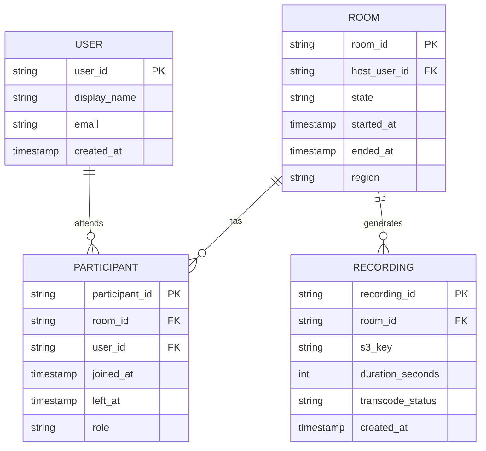
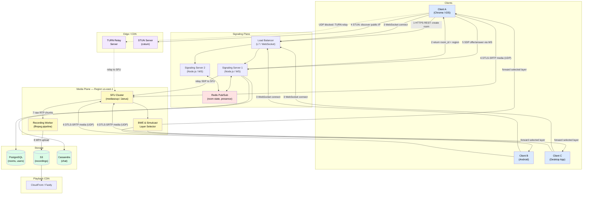
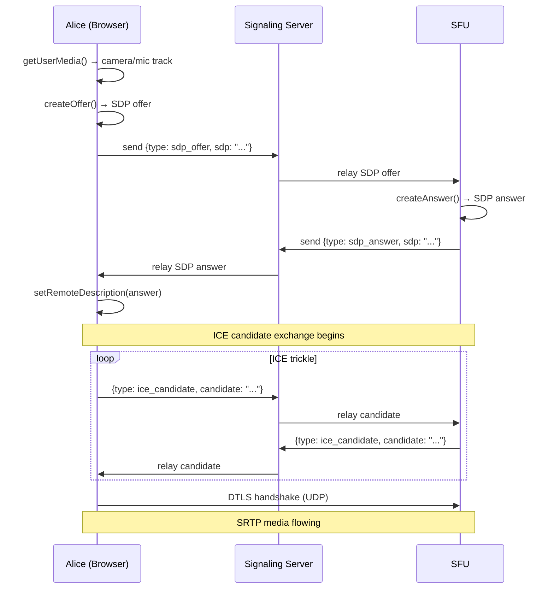
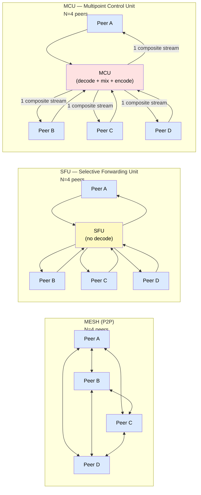
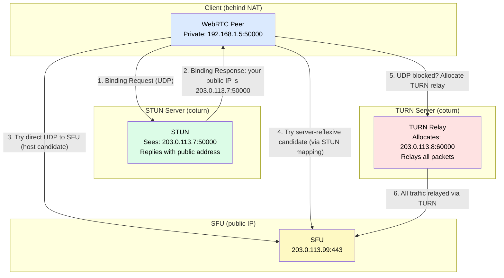
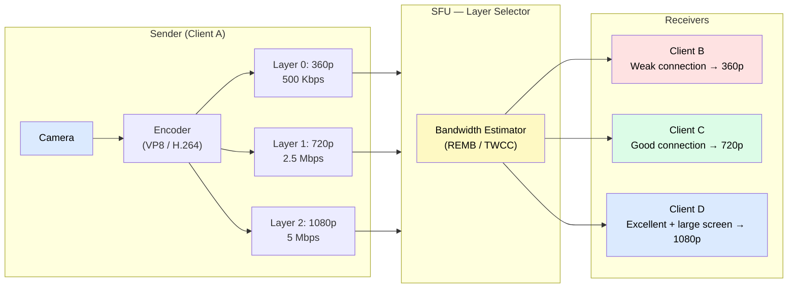

# Design 30 — Video Conferencing

> Real-time group video calling — the architecture behind Zoom and Google Meet

**Difficulty:** ⭐⭐⭐⭐⭐ · **Builds on:** [WebSockets & Real-Time](../../Level-03-Communication/06-WebSockets-and-Realtime/README.md), [Network Protocols](../../Level-00-Foundations/04-Network-Protocols/README.md)

---

## 1. 🎯 Problem & Scope

Video conferencing is one of the hardest distributed systems problems in consumer software. Unlike [one-way live streaming](../25-Live-Streaming/README.md) where a broadcaster pushes to many passive viewers, a video call is fully bidirectional — every participant is simultaneously a sender and a receiver. Add in NAT firewalls, heterogeneous devices (mobile, desktop, browser), wildly varying network conditions, and the brutal requirement of sub-150 ms latency, and you have a genuinely difficult engineering challenge.

**What we are designing:**

- Group video and audio calls with up to 50 active participants
- Screen sharing
- Chat messages within a call
- Recording and playback
- Works across browsers (via WebRTC), native iOS/Android, and desktop apps

**What we are NOT designing:**

- Webinar-style broadcasts with thousands of viewers (that is closer to live streaming)
- End-to-end encrypted enterprise compliance features (Zoom for Government, etc.)
- AI features like real-time transcription (interesting but a separate deep dive)

---

## 2. 📋 Requirements

### Functional

1. Users can create or join a meeting room with a unique room ID
2. Participants can send and receive audio/video in real time
3. Any participant can share their screen
4. Text chat within a meeting
5. Host controls — mute others, remove participants, lock the room
6. Record a meeting to cloud storage; recordings available for playback within minutes of the call ending
7. Works in modern browsers without plugins, plus native iOS/Android/desktop clients

### Non-Functional

| Property | Target |
|---|---|
| Latency (glass-to-glass) | < 150 ms |
| Audio/video uptime | 99.99% |
| Max active senders per room | 50 (viewers can be up to 500 in webinar mode) |
| Packet loss resilience | Graceful degradation up to 5% loss |
| Startup time (join to first frame) | < 2 s |
| Security | DTLS-SRTP encryption for all media |

---

## 3. 🧮 Capacity Estimation

**Scale anchor:** Zoom reported 300 million daily meeting participants at peak (April 2020).

### Bandwidth per call

A single HD (720p) video stream at typical encoding:

```
720p video:  ~2.5 Mbps
Audio:       ~50 Kbps
Total/stream: ~2.55 Mbps ≈ 2.5 Mbps (rounded)
```

For a **10-person call** using an SFU topology (each sender uploads once, SFU forwards):

```
Each participant uploads:  1 stream × 2.5 Mbps  =  2.5 Mbps  (upload)
Each participant receives:  9 streams × 2.5 Mbps = 22.5 Mbps  (download)

SFU ingress  (from all 10): 10 × 2.5 Mbps = 25 Mbps
SFU egress   (to all 10):   10 × 9 × 2.5 Mbps = 225 Mbps
Total SFU bandwidth for this one call: 250 Mbps
```

With simulcast (three quality layers: 360p / 720p / 1080p), a sender uploads roughly:

```
360p:  ~0.5 Mbps
720p:  ~2.5 Mbps
1080p: ~5.0 Mbps
Total upload per sender: ~8 Mbps
```

The SFU only forwards the layer each subscriber's bandwidth can sustain — so most subscribers still only receive 2.5 Mbps.

### Daily traffic

```
300 M daily participants
Average meeting: 45 min = 0.75 h
Average participants per meeting: 5
Unique meetings/day: 300M / 5 = 60 M

Peak concurrency (assume 10% of daily meetings overlap at peak):
  60 M × 0.1 = 6 M concurrent meetings
  6 M meetings × 5 participants × 25 Mbps SFU ingress = 750 Tbps peak ingress

That is an enormous number — hence Zoom and Google operate
their own global media server fleets and colocation.
```

### Storage (recordings)

```
1 recording/hr at 720p ≈ 1.5 GB
If 5% of meetings are recorded: 60 M × 0.05 = 3 M recordings/day
3 M × 1.5 GB = 4.5 PB/day  →  needs S3-scale object storage + aggressive tiering
```

---

## 4. 🔌 API Design

### Signaling REST endpoints

```http
POST /v1/rooms
Body: { "host_user_id": "u_123", "settings": { "max_participants": 20 } }
Response: { "room_id": "r_abc", "join_token": "jwt...", "region": "us-east-1" }

GET /v1/rooms/{room_id}
Response: { "room_id": "r_abc", "participant_count": 4, "state": "active" }

DELETE /v1/rooms/{room_id}/participants/{user_id}   # host kick
```

### WebSocket signaling messages (JSON over WS)

```jsonc
// Client → Server: join a room
{ "type": "join", "room_id": "r_abc", "token": "jwt..." }

// Client → Server: SDP offer (WebRTC negotiation)
{ "type": "sdp_offer", "to": "sfu", "sdp": "v=0\r\no=- ..." }

// Server → Client: SDP answer from SFU
{ "type": "sdp_answer", "sdp": "v=0\r\no=- ..." }

// Client → Server: ICE candidate
{ "type": "ice_candidate", "candidate": "candidate:... udp ..." }

// Server → Client: participant joined/left events
{ "type": "participant_joined", "user_id": "u_456", "display_name": "Alice" }
{ "type": "participant_left",   "user_id": "u_456" }

// Client → Server: chat message
{ "type": "chat", "body": "Hello everyone!" }
```

---

## 5. 🗄️ Data Model



**Storage justifications:**

| Store | What | Why |
|---|---|---|
| PostgreSQL | Users, Rooms, Participants, Recordings metadata | Relational integrity, low write rate, needs ACID |
| Redis | Active room state, participant presence, ICE candidate relay | Sub-millisecond reads, TTL-based cleanup |
| S3 / GCS | Raw recording chunks, transcoded MP4 files | Cheap at petabyte scale, CDN-friendly |
| Cassandra / DynamoDB | Chat messages (append-only, high write volume) | Wide-column scales horizontally for time-series writes |
| InfluxDB / Prometheus | Per-stream QoS metrics (jitter, loss, bitrate) | Time-series purpose-built, not relational |

**Media is never stored in a database.** It flows through SFU memory buffers and is written directly to object storage during recording.

---

## 6. 🏗️ High-Level Architecture



**Numbered walk-through:**

1. **Room creation** — Client A calls `POST /v1/rooms` via HTTPS. The signaling service picks the closest media region (lowest RTT) and stores the room in PostgreSQL. Returns a `room_id` and a short-lived JWT.
2. **Region assignment** — The JWT encodes which SFU cluster to connect to. All participants in the same meeting are routed to the same regional SFU cluster.
3. **WebSocket connection** — Every client opens a persistent WebSocket to the signaling load balancer. Signaling servers are stateless; room state and participant lists live in Redis Pub/Sub so any signaling server can handle any client.
4. **NAT discovery** — Before connecting to the SFU, each client does a STUN binding request to learn its public IP:port.
5. **WebRTC negotiation (SDP)** — Clients send SDP offers through the WebSocket signaling channel. The signaling server relays them to the SFU, which responds with an SDP answer. ICE candidate exchange follows.
6. **Media flows** — Once ICE completes, encrypted RTP/RTCP flows directly over UDP between each client and the SFU. The SFU's bandwidth estimator selects the right simulcast layer for each subscriber. If UDP is blocked, the TURN relay kicks in as fallback.
7. **Recording capture** — A recording worker taps the RTP stream on the SFU side, segments it, and muxes audio+video into MP4 using ffmpeg.
8. **Playback** — Completed recordings are uploaded to S3 and served via a CDN for low-latency playback worldwide.

---

## 7. 🔬 Deep Dives

### 7.1 WebRTC — Offer/Answer and ICE

WebRTC is the open standard that makes browser-based video calling possible without plugins. It handles codec negotiation, encryption, and transport — but not signaling (that is your WebSocket channel).

**SDP offer/answer exchange:**



**SDP** (Session Description Protocol) is a text blob that describes codecs (VP8, H.264, Opus), encryption fingerprints, and candidate transport addresses. You do not parse SDP yourself — the browser's WebRTC engine does.

**ICE** (Interactive Connectivity Establishment) gathers a list of candidate address pairs and tries them in priority order: host → server-reflexive (via STUN) → relayed (via TURN). The first pair that succeeds wins.

### 7.2 Topology Trade-offs — Mesh vs SFU vs MCU

This is the most architecturally important decision in video conferencing.



| | Mesh (P2P) | SFU | MCU |
|---|---|---|---|
| Server compute | None | Low (forward packets, no decode) | Very High (decode + mix + encode) |
| Client upload bandwidth | Send N-1 copies | Send once | Send once |
| Client download bandwidth | Receive N-1 streams | Receive N-1 streams | Receive 1 composite stream |
| Latency | Lowest (direct) | Low (one server hop) | Higher (encode delay) |
| Scales to 50+ users? | No — O(N²) connections | Yes | Limited by CPU cost |
| Bandwidth-adaptive per subscriber | Hard | Easy (simulcast layer swap) | No (re-encode needed) |

**Why SFU wins for group calls:**

- Each sender uploads one set of simulcast layers — regardless of how many subscribers there are.
- The SFU forwards RTP packets without decoding them, so the computational cost is proportional to throughput, not to participant count squared.
- The SFU can swap which simulcast layer it forwards to each subscriber instantly based on their bandwidth estimate — no re-encoding required.
- Mesh breaks down above 3–4 participants because client upload bandwidth is finite and you cannot upload separate streams to 49 other peers.
- MCU can support low-bandwidth receivers (they get one pre-mixed stream) but at enormous CPU cost per room. A 1080p MCU encode easily takes a full CPU core per room. At 6 million concurrent rooms, that is impractical.

**Open-source SFU implementations:** mediasoup (Node.js / C++), Janus Gateway, Pion (Go). Commercial: Twilio Programmable Video, Daily.co, Agora.

### 7.3 NAT Traversal — STUN, TURN, and ICE

Most devices sit behind NAT routers and do not have a public IP. WebRTC solves this with a layered approach:



- **STUN** (Session Traversal Utilities for NAT): A tiny stateless server. Your client sends a UDP packet, STUN echoes back the source IP:port as seen from the internet. Cost: nearly zero.
- **TURN** (Traversal Using Relays around NAT): A relay server. When symmetric NAT or corporate firewalls block all direct UDP, TURN relays every packet. Cost: full media bandwidth on the TURN server. Typically 10–15% of calls need TURN.
- **ICE** (Interactive Connectivity Establishment): The orchestration layer. Gathers all candidate address pairs, pairs them with the remote, runs a connectivity check for each, and selects the best working pair (lowest latency wins). Trickle ICE sends candidates as they are gathered rather than waiting for all of them, which speeds up connection setup.

### 7.4 Simulcast and Bandwidth Adaptation



The sender publishes three RTP streams simultaneously (same SSRC space, different spatial layers). The SFU uses RTCP feedback — specifically **REMB** (Receiver Estimated Maximum Bitrate) or **Transport-Wide Congestion Control (TWCC)** — to know each subscriber's available bandwidth, then switches which layer it forwards. A layer switch is just forwarding different packets; no transcoding occurs. The SFU can also pause a layer entirely if a participant's window is minimized or their tile is not visible (SVC/simulcast layer suspension).

### 7.5 Recording Pipeline

```mermaid
flowchart LR
    SFU2["SFU"] -- "RTP tap (per track)" --> RECW["Recording Worker<br/>(Go / ffmpeg)"]
    RECW -- "segments: 10s chunks" --> TMPSTORE["Temp Local Disk<br/>NVMe"]
    TMPSTORE -- "S3 multipart upload" --> S3RAW["S3 Raw Bucket<br/>(opus + vp8 tracks)"]
    S3RAW -- "event trigger" --> TRANSCODE["Transcoding Farm<br/>(AWS MediaConvert / ffmpeg fleet)"]
    TRANSCODE -- "MP4 (H.264 + AAC)" --> S3FINAL["S3 Final Bucket<br/>(MP4)"]
    S3FINAL --> CDN3["CDN<br/>(CloudFront)"]
    CDN3 --> PLAYER["Playback Client"]

    style SFU2 fill:#fef9c3,color:#000
    style RECW fill:#f3e8ff,color:#000
    style TRANSCODE fill:#fee2e2,color:#000
    style S3RAW fill:#dcfce7,color:#000
    style S3FINAL fill:#dcfce7,color:#000
```



The recording worker receives raw RTP audio (Opus) and video (VP8/H.264) from the SFU by joining the room as a special internal participant. It writes time-stamped chunks to local NVMe, then uploads them to S3 continuously using multipart upload. When the meeting ends, a transcoding job merges and re-encodes everything into a single H.264/AAC MP4 — which is the format most video players expect. Transcoding is the slow, CPU-intensive step; it typically completes in roughly real-time (1 hour meeting → ~1 hour to transcode at 1× speed, or ~10 minutes on a GPU-accelerated instance).

### 7.6 Latency Budget — Glass-to-Glass < 150 ms

The target of 150 ms end-to-end (camera → display on the other side) breaks down roughly as follows:

| Stage | Budget |
|---|---|
| Camera capture + encoding | 15–30 ms |
| Network (sender → SFU, ~20ms RTT/2) | 10–20 ms |
| SFU processing (forward packet) | < 1 ms |
| Network (SFU → receiver) | 10–20 ms |
| Jitter buffer (absorbs ~1–2 frames) | 30–50 ms |
| Decoding + render | 10–20 ms |
| **Total** | **75–141 ms** |

Key levers: keep the jitter buffer small (requires stable networks), choose media servers close to participants (regional SFU clusters), use hardware encoding/decoding on devices, and prefer Opus for audio (Opus at 20 ms frame size keeps audio latency minimal).

Audio latency matters more perceptually than video latency. Conversations become unnatural above 200 ms one-way delay, so audio processing is always prioritized — lower bitrate, smaller buffers, hardware codec paths.

---

## 8. 📈 Scaling, Bottlenecks & Failure Modes

### Horizontal SFU scaling

A single SFU process (mediasoup) can handle roughly 500–1,000 concurrent streams on a 16-core server, depending on packet rate. You scale by running many SFU processes and assigning rooms to them. Within a very large room (say, 500 attendees in a webinar), you can cascade SFUs: one "ingress" SFU receives all senders, and multiple "egress" SFUs forward to subsets of receivers.

### Signaling server scaling

Signaling servers are stateless HTTP/WebSocket processes. They communicate via Redis Pub/Sub for room events. You can run hundreds of them behind an L7 load balancer. The WebSocket sticky-session requirement is handled at the load balancer level (consistent hashing on connection ID).

### Failure modes and mitigations

| Failure | Impact | Mitigation |
|---|---|---|
| SFU process crash | Entire room drops | Process supervision (systemd/k8s), client reconnects within 2–3 s, session state in Redis survives |
| Signaling server crash | WS connection drops | Client auto-reconnects; room state is in Redis, not in-process |
| TURN server overload | 10–15% of calls degrade | TURN clusters behind DNS load balancing; geographic distribution |
| Region outage | All meetings in region drop | DNS failover to another region; active-active multi-region SFU deployment |
| Network congestion | Video quality degrades | Simulcast layer down-switch, bitrate adaptation via REMB/TWCC, audio continues at lower bitrate |
| Recording worker crash | Recording lost | Write chunks to S3 continuously; replay RTP from SFU buffer on restart (limited window) |

### Packet loss resilience

RTP uses sequence numbers. Receivers send RTCP NACK (negative acknowledgement) for missing packets. The SFU or sender retransmits. For audio, FEC (Forward Error Correction) — specifically RED and ULPFEC — adds redundancy packets so a single lost packet can be reconstructed without a retransmit round trip. Video uses FIR (Full Intra Request) to request a keyframe when loss is severe enough that the decoder can no longer reconstruct frames.

---

## 9. ⚖️ Trade-offs & Alternatives

### SFU vs MCU revisited

You might still choose MCU for very specific cases: a participant on an extremely low-bandwidth mobile connection (2G) who can only receive one 100 Kbps stream benefits from a mixed composite stream. Some systems use a hybrid — SFU for most participants, MCU for low-bandwidth fallback subscribers.

### End-to-end encryption (E2EE)

Standard SFU architecture cannot support E2EE because the SFU must read RTP headers to forward packets correctly — but headers contain routing metadata, not media payloads. WebRTC's **Insertable Streams** API (Chrome/Edge) allows JavaScript to encrypt the media payload in the browser before it hits the WebRTC engine. The SFU can still forward packets (it only sees encrypted payloads), but it cannot record, transcode, or do server-side processing. This is what Zoom's E2EE mode does — recording and some features are disabled.

### Codec choices

| Codec | Pros | Cons |
|---|---|---|
| VP8 | Universal WebRTC support, open | Older, lower efficiency than VP9 |
| VP9 | Better compression than VP8 | Encoding is slower, Safari support was late |
| H.264 | Hardware acceleration everywhere | Patent-encumbered, licensing cost |
| AV1 | Best compression, royalty-free | Encoding is very slow without hardware |
| Opus (audio) | Excellent quality, built into WebRTC | — |

Most production systems use H.264 or VP8 for broadest device compatibility, with AV1 being rolled out for recording/archival where encoding speed is less critical.

### Self-hosted vs cloud WebRTC infrastructure

Running your own SFU (mediasoup, Janus) gives you full control over data locality, costs, and customization. Using a cloud provider (Twilio, Agora, Daily.co) trades control for operational simplicity — they handle TURN, global SFU infrastructure, and SDK maintenance. For a startup, cloud WebRTC is almost always the right first choice. At Zoom's scale, you build your own.

---

## 10. 🌐 How It's Actually Done

**Zoom** runs its own proprietary media servers globally, optimized for their specific codec pipeline. They use Zoom's own UDP-based transport (ZTP) in some paths rather than raw WebRTC, allowing tighter control over congestion control. Their client apps encode video on-device with hardware H.264 acceleration.

**Google Meet** is built on WebRTC from the ground up (Google helped create the WebRTC standard). They run SFU infrastructure inside Google's global network, giving them extremely low latency because SFUs are placed inside the same PoPs as Google's CDN. Meet uses VP8/VP9 and has recently added AV1 support for screen sharing.

**Microsoft Teams** uses a similar SFU architecture but integrates deeply with Azure's global network. Teams added "Together Mode" using AI-based background segmentation — a good example of ML running client-side on the decoded frames.

**Janus Gateway** and **mediasoup** are the dominant open-source SFU implementations. Janus is written in C and is extremely performant; mediasoup is a C++ native module exposed via Node.js, making it easy to integrate into JavaScript server stacks. Both are production-ready and used at scale by startups and mid-sized companies.

**Twilio Programmable Video** (now Twilio Video) was a major commercial SFU-as-a-service. Twilio announced deprecation of Programmable Video in 2023, which drove many customers to Daily.co, Agora, Livekit (open-source SFU + hosted offering), and Mux.

**Livekit** is worth mentioning — it is a modern open-source SFU written in Go, with excellent Kubernetes-native deployment support, and is rapidly gaining adoption as the successor to the older generation of open-source SFUs.

---

## 11. 📝 Summary

| Decision | Choice | Reason |
|---|---|---|
| Media routing topology | SFU | Best balance of scale and compute cost for group calls |
| Transport protocol | WebRTC (RTP over DTLS-SRTP / UDP) | Open standard, browser-native, encrypted |
| Codec (video) | H.264 / VP8 (hardware) | Universal client support, hardware acceleration |
| Codec (audio) | Opus | Built into WebRTC, excellent at low bitrates |
| NAT traversal | STUN + TURN + ICE | Covers 100% of network topologies |
| Bandwidth adaptation | Simulcast + REMB/TWCC | Layer switching without re-encoding |
| Signaling | WebSocket + Redis Pub/Sub | Low latency, horizontally scalable, stateless servers |
| Recording | RTP tap → ffmpeg → S3 → transcode | Decoupled from real-time path, cost-efficient |
| Metadata storage | PostgreSQL + Redis + Cassandra | Right tool per access pattern |
| Scale | Regional SFU clusters, cascaded for large rooms | Puts compute close to participants |

**Key interview takeaways:**

1. The hardest part of video conferencing is not video — it is NAT traversal and making WebRTC work reliably across every possible network topology.
2. SFU is the right answer for group calls. Know why (no transcoding, simulcast layer switching, one upload per sender).
3. Simulcast is what makes per-subscriber quality adaptation possible without per-subscriber encoding — a critical insight.
4. The signaling plane (WebSocket, SDP relay) and the media plane (RTP, SFU) are completely separate concerns. Design them independently.
5. Latency budget thinking: know where each millisecond goes and which levers you can pull to bring end-to-end latency under 150 ms.
6. Recording is a separate pipeline that taps the SFU — it does not affect the real-time path and should be designed for fault tolerance independently.
