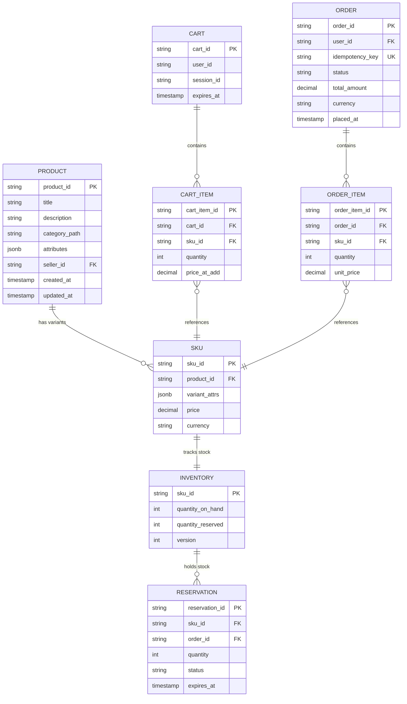
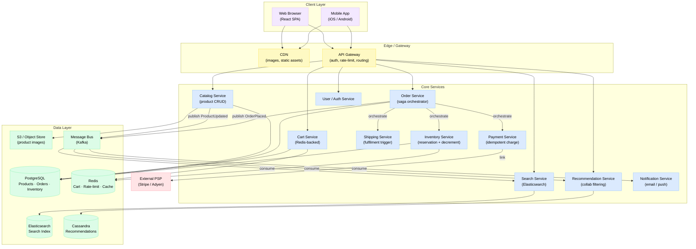
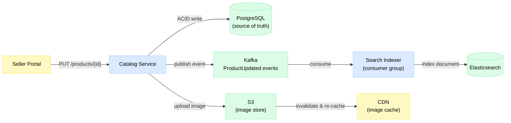
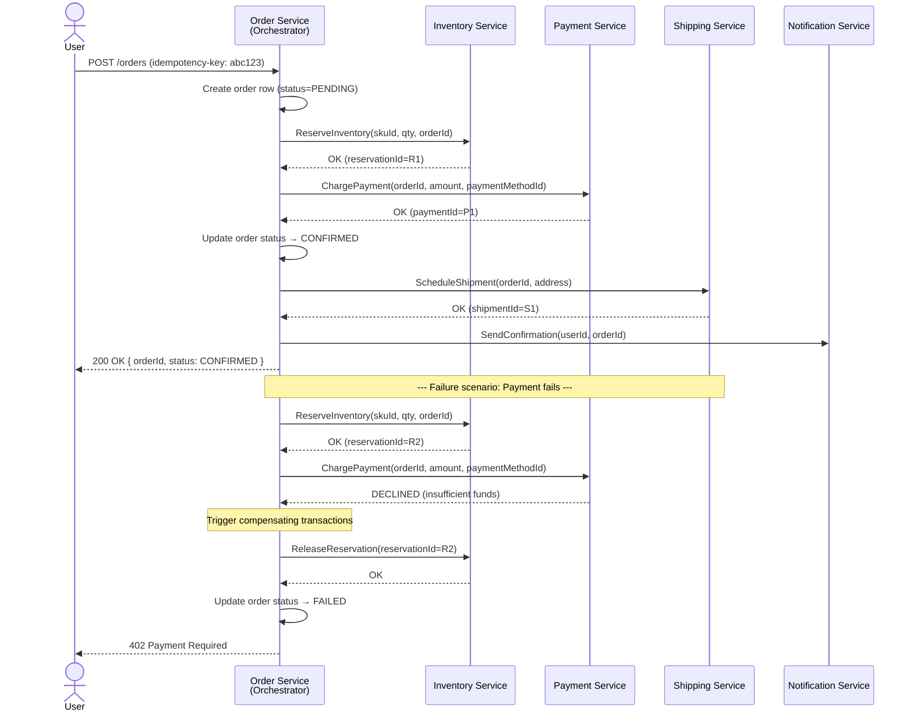

# Design 31 — E-Commerce Platform

> Amazon-style storefront — catalog, cart, inventory, checkout saga, and recommendations at scale

**Difficulty:** ⭐⭐⭐⭐ · **Builds on:** [Saga & Orchestration](../../Level-05-Architecture-Patterns/07-Saga-and-Orchestration/README.md), [Distributed Transactions](../../Level-04-Distributed-Systems/04-Distributed-Transactions/README.md), [Payment System](../17-Payment-System/README.md)

---

## 1. 🎯 Problem & Scope

You are designing an Amazon-scale e-commerce platform. A customer visits the site, searches for a product, adds it to their cart, and completes checkout — payment is charged, inventory is decremented, an order confirmation lands in their inbox, and a warehouse is notified to ship. Each of those steps is a distributed operation across independent services that can fail independently.

The interesting problems are:

- **Catalog at scale**: 350 million products, each with rich attributes, images, and reviews. Reads vastly outpace writes (~100:1). Search must be fast, faceted, and typo-tolerant.
- **Cart**: Stateful, ephemeral, needs to survive session loss, and must merge seamlessly when a guest user logs in.
- **Inventory + oversell**: During a flash sale, 100 000 users hit the same SKU simultaneously. You must never sell more than you have.
- **Checkout as a distributed transaction**: Money moves, stock moves, and an order is created — across three different services. Any step can fail. You need a way to roll back cleanly.
- **Recommendations**: "Customers also bought" personalisation drives a significant fraction of revenue.

**In scope:** product catalog, search, cart, inventory, checkout/order flow (saga), payment integration, recommendations.

**Out of scope:** warehouse management internals, seller onboarding, fraud ML pipeline, returns/refunds (mentioned briefly as compensating transactions).

---

## 2. 📋 Requirements

### Functional

- Browse and search products (keyword, facets, sort)
- View product detail pages (price, stock status, images, reviews)
- Add/remove items from cart; merge guest cart on login
- Place an order: reserve inventory → charge payment → confirm order → trigger shipping
- Receive order confirmation
- See personalised product recommendations (collaborative filtering + cross-sell)
- Sellers can create/update product listings

### Non-Functional

- **Availability:** 99.99% for checkout (four nines); 99.9% acceptable for catalog/browse
- **Latency:** Product page < 200 ms p99; search < 300 ms p99; checkout < 3 s p99
- **Consistency:** Strong for inventory and payment; eventual for catalog search index and recommendations
- **Durability:** Zero order loss; payment events are idempotent
- **Scale:** 350 M SKUs, peak 66 000 orders/minute (Amazon Prime Day benchmark), 100 M daily active users

---

## 3. 🧮 Capacity Estimation

**Traffic (peak Prime-Day-like load):**

```
Daily Active Users (DAU):    100 M
Peak concurrent users:        10 M   (10% of DAU at the same moment)
Page views per user/day:      20
Total daily page views:        2 B
Peak RPS (page views):       ~50 000 rps  (2B / 86 400 s × 2× peak factor)

Orders per minute (peak):    66 000  (Amazon public figure)
Orders per second (peak):    ~1 100 ops/s
```

**Catalog read vs write:**

```
Catalog reads:   ~5 000 000 product-page views/min  (100:1 read:write ratio)
Catalog writes:  ~50 000 listing updates/min         (sellers, price changes, stock sync)
```

**Storage:**

```
Products:          350 M × 10 KB average metadata   = 3.5 TB   (relational / document store)
Product images:    350 M × 5 images × 500 KB avg    = 875 TB   (object store; CDN-cached)
Search index:      350 M docs × ~5 KB indexed fields = 1.75 TB  (Elasticsearch)
Orders (10 yr):    1 100 ops/s × 86 400 × 365 × 10 × 2 KB = ~620 TB
Cart sessions:     10 M active × 2 KB               = 20 GB    (Redis; fits in RAM)
```

**Inventory write contention (flash sale):**

```
Flash SKU:        100 000 concurrent users → burst of 100 000 "add to cart" + 10 000 "checkout" rps
Stock available:  1 000 units
Problem:          Without coordination, 10 000 concurrent decrements may succeed for 1 000 units
```

---

## 4. 🔌 API Design

```http
# Catalog
GET  /v1/products/{productId}
GET  /v1/search?q=shoes&category=footwear&brand=Nike&price_max=200&sort=relevance&page=1

# Cart
GET    /v1/cart                          # returns current cart (guest or authed)
POST   /v1/cart/items                    # body: { productId, quantity }
PATCH  /v1/cart/items/{itemId}           # body: { quantity }
DELETE /v1/cart/items/{itemId}
POST   /v1/cart/merge                    # merge guestCartId → authenticated cart on login

# Checkout
POST /v1/orders                          # idempotency-key header required
  body: { cartId, shippingAddressId, paymentMethodId }
  → returns: { orderId, status: "PENDING" }

GET  /v1/orders/{orderId}               # poll / webhook for status

# Inventory (internal)
POST /v1/inventory/reserve              # body: { skuId, quantity, holdDurationSecs }
POST /v1/inventory/release              # body: { reservationId }
POST /v1/inventory/commit               # body: { reservationId }  — final decrement

# Recommendations
GET  /v1/recommendations?userId=&productId=&limit=10
```

Key header: `Idempotency-Key: <uuid>` on `POST /v1/orders`. The server stores the response for 24 h — submitting the same key twice returns the cached response, never double-charges.

---

## 5. 🗄️ Data Model



**Storage justifications:**

| Data | Store | Reason |
|---|---|---|
| Products / SKUs | PostgreSQL (sharded by `product_id`) | ACID, rich queries, JSONB for flexible attributes |
| Inventory | PostgreSQL with `FOR UPDATE SKIP LOCKED` | Strong consistency; row-level locking |
| Cart sessions | Redis (TTL 30 days) | Sub-millisecond reads, automatic expiry, simple data structure |
| Orders | PostgreSQL (append-heavy, partitioned by month) | Durability, ACID, audit trail |
| Search index | Elasticsearch | Full-text + faceted search, near-real-time indexing |
| Product images | S3-compatible object store + CDN | Blob storage at petabyte scale; CDN reduces latency globally |
| Recommendations | Apache Cassandra + in-memory cache | Wide-column model suits user→product affinity; high write throughput |

---

## 6. 🏗️ High-Level Architecture



**Numbered walk-through:**

1. **Browse/search** — Browser hits CDN for static assets; API Gateway routes `GET /search` to Search Service, which queries Elasticsearch. Product images are served directly from CDN (pre-warmed via cache-control headers from S3).
2. **Product detail page** — Catalog Service reads from PostgreSQL (or Redis read-through cache for hot products). Stock status comes from Inventory Service (Redis-cached, eventual).
3. **Add to cart** — Cart Service writes the item to Redis with a TTL. Price is snapshotted at add-time to avoid stale prices at checkout.
4. **Checkout initiated** — Order Service receives `POST /v1/orders` with an idempotency key. It becomes the saga orchestrator and calls each downstream service in sequence.
5. **Saga steps** — Inventory reserve → Payment charge → Order confirm → Shipping schedule. If any step fails, compensating transactions run in reverse.
6. **Events** — `OrderPlaced` event is published to Kafka. Notification Service sends confirmation email; Recommendation Service updates affinity model.

---

## 7. 🔬 Deep Dives

### 7.1 Product Catalog + Search

The catalog is a classic read-heavy system. You have ~350 M products but writes (seller updates, price changes) are relatively rare. The trick is to decouple your authoritative store from your search index.

**Flow: seller update → search index**



**Caching strategy:**
- Hot product metadata (top 1 M SKUs by traffic) is cached in Redis with a 5-minute TTL. Cache-aside pattern — on miss, read from PG, populate cache.
- Product images are served exclusively from CDN. S3 is the origin; CDN edge nodes cache for 24 h with `Cache-Control: public, max-age=86400`.
- Search results for common queries (e.g., "red Nike shoes size 10") are cached in Redis with a 30-second TTL. Acceptable for eventual consistency.

**Faceted search in Elasticsearch:**
Each product document contains flattened, indexable fields — `category`, `brand`, `price`, `rating`, `in_stock`. Elasticsearch aggregations (`terms`, `range`) power the sidebar filters without extra queries. You store denormalised variant data in the document so a single Elasticsearch query returns everything the product listing page needs.

### 7.2 Shopping Cart

The cart has two personas: **guest** (before login) and **authenticated** (after login).

**Guest cart** lives in Redis under a `cart:{sessionId}` key (Hash type). Session ID is stored in a cookie. TTL: 30 days. No DB row needed — Redis handles expiry automatically.

**Authenticated cart** lives in Redis under `cart:{userId}`. On login, you call `POST /v1/cart/merge`:

```
1. Load guest cart items (cart:{sessionId})
2. Load user cart items (cart:{userId})
3. For each guest item:
     if sku already in user cart → take max(quantity) or add quantities (business decision)
     else → add item to user cart
4. Delete cart:{sessionId}
5. Reassign cookie to cart:{userId}
```

**Idempotency of add/remove:**
- `POST /v1/cart/items` is idempotent via a `clientRequestId` field. Cart Service stores a set of seen request IDs per cart (Redis SET, TTL 1 h). Duplicate requests return the same response.
- `DELETE /v1/cart/items/{itemId}` is naturally idempotent — deleting a non-existent item returns 200/204.

**Price snapshot:** when you add a SKU to the cart you record `price_at_add`. At checkout, if the current price differs by > X%, you surface a "price has changed" warning before confirming. This avoids stale prices silently being charged.

**Persistence fallback:** if Redis is unavailable, a write-through path persists cart items to PostgreSQL (`cart_items` table). This is the "cold path" — slower but durable. On Redis recovery, the cart is replayed from PG.

### 7.3 Inventory Management & the Oversell Problem

This is the hardest part of the system. You have `quantity_on_hand = 1000` and 100 000 users simultaneously add the same SKU to their cart and start checking out. Without coordination, you could decrement `quantity` 10 000 times and ship 1 000× what you have.

**Three-phase inventory model:**

```
quantity_on_hand     = total physical stock
quantity_reserved    = held by active checkouts (not yet paid)
quantity_available   = quantity_on_hand - quantity_reserved   ← what buyers see
```

**Phase 1 — Reserve (during checkout window):**
When a user starts checkout, Inventory Service creates a `RESERVATION` row and increments `quantity_reserved`. The reservation has a 15-minute TTL. If the user doesn't complete payment, a background job releases the reservation.

```sql
-- Optimistic concurrency with version column
UPDATE inventory
SET    quantity_reserved = quantity_reserved + :qty,
       version           = version + 1
WHERE  sku_id = :sku
  AND  version = :expected_version
  AND  (quantity_on_hand - quantity_reserved) >= :qty;
-- If 0 rows affected → version conflict → retry or fail
```

**Phase 2 — Commit (after payment succeeds):**
`quantity_on_hand` is decremented and the reservation is closed. Now the stock is truly gone.

**Phase 3 — Release (on timeout or payment failure):**
`quantity_reserved` is decremented. Stock becomes available again.

**Flash sale: 100 K users, 1 K units, same SKU**

| Approach | Throughput | Safety | Notes |
|---|---|---|---|
| DB row lock (`SELECT FOR UPDATE`) | Low (~500 rps) | Highest | Serialises writes; correct but bottlenecks |
| Optimistic concurrency (version CAS) | Medium | High | Many retries under contention; suits moderate bursts |
| Redis `DECR` + Lua script | Very high (>50 K rps) | Medium | Fast but Redis is AP — needs async reconciliation with DB |
| Pre-allocated inventory tokens in Redis | Very high | High | Seed Redis with N tokens; each checkout POPs one; DB is source of truth reconciled async |

**Recommended approach for flash sales:** seed a Redis counter with the exact stock count using `SET inventory:{skuId} 1000`. Each checkout does:

```lua
-- Atomic Lua script (runs on single Redis node)
local count = redis.call('GET', KEYS[1])
if count == nil or tonumber(count) <= 0 then
  return -1  -- out of stock
end
return redis.call('DECR', KEYS[1])
```

If DECR returns >= 0, proceed to place a DB-level reservation. If Redis and DB diverge (Redis crash scenario), a reconciliation job compares `redis.GET` vs DB `quantity_available` and reseeds Redis. You accept a brief window of over/under selling during reconciliation — the financial impact is bounded because the DB reservation is the contractual commitment.

### 7.4 Checkout as a Distributed Saga

The checkout flow touches Inventory, Payment, Order, and Shipping — four services that don't share a database. You can't wrap them in a single ACID transaction. You use the **Saga pattern** instead, with Order Service as the **orchestrator**.

See: [Saga & Orchestration](../../Level-05-Architecture-Patterns/07-Saga-and-Orchestration/README.md) · [Distributed Transactions](../../Level-04-Distributed-Systems/04-Distributed-Transactions/README.md) · [Payment System](../17-Payment-System/README.md)

**Happy path + compensating transactions:**



**Choreography vs Orchestration:**

- **Orchestration** (used here): Order Service calls each downstream service directly and manages state. Easier to reason about, easier to debug (single place to inspect saga state), but Order Service becomes a central bottleneck.
- **Choreography**: Each service publishes events and the next service reacts. More decoupled, but the saga state is distributed — debugging a failed saga means correlating events across services via a correlation ID.

For checkout you choose orchestration because: (1) the flow is linear, (2) you need a clear owner for compensation logic, (3) partial order state needs to be tracked in one place.

**Idempotent orders:**
The `Idempotency-Key` header (a UUID generated client-side) is stored in the `orders.idempotency_key` column with a UNIQUE constraint. If the client retries due to a network timeout, the server returns the cached response from the first attempt — the payment is never charged twice. Keys expire after 24 h.

### 7.5 Recommendations

**Collaborative filtering** ("customers who bought X also bought Y") is computed offline:

1. Spark job runs nightly on the OrderPlaced event stream in Kafka (or S3-backed data lake).
2. Co-purchase matrix is computed: `co_purchase[A][B] = count of orders containing both A and B`.
3. Top-K recommendations per product are written to Cassandra: `(product_id, rank) → recommended_product_id, score`.
4. Recommendation Service reads from Cassandra at request time (< 5 ms with the partition key).

**Real-time cross-sell** ("frequently bought together" on the product page): served from the Cassandra table populated above, enriched with current inventory status from a Redis cache lookup.

**Personalisation layer**: for logged-in users, session events (views, clicks, adds-to-cart) are streamed to Kafka. A stream-processing job (Flink) updates a user affinity vector in Cassandra. The recommendation service blends the user vector with the co-purchase signal using a simple weighted scoring function.

---

## 8. 📈 Scaling, Bottlenecks & Failure Modes

**Catalog Service reads:**
- Read replicas for PostgreSQL (5–10 replicas). Route all reads to replicas via PgBouncer connection pool.
- Redis read-through cache for hot products. At peak, >99% of product-page requests should be served from cache.
- Elasticsearch handles all search traffic — never hit PostgreSQL for search queries.

**Cart Service:**
- Redis Cluster with consistent hashing. Each cart lives on one shard, so cart reads/writes are single-node operations.
- If a Redis node dies, the guest cart is lost (user must re-add items). Authenticated carts can be reconstructed from the PostgreSQL cold-path table within a few seconds.

**Inventory Service (the hot spot):**
- Partition inventory rows across PostgreSQL shards by `sku_id % N`. This distributes write load.
- For flash-sale SKUs, use the Redis counter approach described in 7.3. Apply rate limiting at the API Gateway (e.g., max 500 rps per SKU to checkout).
- Circuit breaker: if Inventory Service latency exceeds 500 ms, Order Service returns a 503 and asks the user to retry rather than queueing unboundedly.

**Order Service (saga orchestrator):**
- Order Service is stateless. Saga state is persisted in the `orders` table (each step updates `saga_state` JSON column).
- On restart, the Order Service reads in-progress sagas from the DB and resumes from the last committed step. This requires each downstream call to be idempotent (inventory service checks if a reservation already exists for `orderId` before creating a new one).

**Payment Service failures:**
- PSP (Stripe/Adyen) is external and has its own SLA. Wrap calls with a 5-second timeout and exponential backoff (max 3 retries).
- If retries are exhausted, trigger the compensation path (release inventory reservation).
- Dead-letter queue (DLQ) for permanently failed payment events — human review queue for edge cases.

**Kafka consumer lag:**
- Search indexer and recommendation updater are async consumers. If they lag, search results are stale but orders still process. This is acceptable — search is eventually consistent by design.
- Monitor consumer lag. Alert if lag > 5 minutes.

**Database failover:**
- PostgreSQL primary-replica with automatic failover (Patroni or RDS Multi-AZ). RPO < 30 s, RTO < 60 s.
- During failover, the checkout endpoint returns 503. Retry logic on the client surfaces "system busy, try again" rather than a hard error.

---

## 9. ⚖️ Trade-offs & Alternatives

| Decision | Choice Made | Alternative | Why not |
|---|---|---|---|
| Cart storage | Redis (primary) + PG (cold fallback) | DB-only | PG would be 10–100× slower for high-frequency reads; Redis TTL handles expiry naturally |
| Inventory synchronisation | Redis counter + DB reservation | DB-only locking | DB locking serialises flash-sale traffic; Redis handles burst at the cost of added reconciliation complexity |
| Saga pattern | Orchestration | Choreography | Orchestration is easier to debug and compensate; choreography preferred for loosely coupled, many-participant sagas |
| Search | Elasticsearch | Algolia (managed), PostgreSQL full-text | PG full-text lacks faceted aggregations at scale; Algolia is excellent but costly at 350 M docs; ES gives full control |
| Recommendations | Offline Spark + Cassandra | Real-time ML model server | Real-time inference adds 50–200 ms latency on every page load; nightly batch is 80% as effective for 10% of the complexity |
| Checkout idempotency | Client-generated UUID in header | Server-assigned token (two-round-trip) | Single-round-trip is simpler for clients; server-assigned token adds a pre-checkout round-trip |

---

## 10. 🌐 How It's Actually Done

**Amazon** pioneered the transition from monolith to microservices for exactly this problem. Their "two-pizza team" principle maps directly to service ownership: the Cart team owns cart, the Inventory team owns inventory. Amazon also developed DynamoDB to handle the cart's key-value access pattern at extreme scale — their public paper explicitly cites the shopping cart as the motivating use case.

**Shopify** takes a different architectural stance: a **multi-tenant SaaS model**. A single Rails monolith (now modularised into "components") serves millions of merchants. Shopify uses MySQL with aggressive sharding by shop ID, plus Redis for caching and Kafka for event streaming. Their approach shows that a well-optimised monolith can scale to $200 B+ in annual GMV before you need full microservices decomposition. The key insight: shard first, decompose second.

**Flash sale handling in the wild:** Taobao (Alibaba) runs "Double 11" (Singles Day) at peak loads of ~540 000 orders per second. Their approach: pre-warm every cache layer 24 h in advance, pre-allocate inventory tokens in Redis Cluster, rate-limit checkout at the CDN edge (return "sold out" page from edge cache when stock = 0), and use an asynchronous order pipeline where the user gets an optimistic "order placed" before all downstream steps complete.

**Idempotency at Stripe:** Stripe's idempotency key implementation is a well-documented public reference. They store `(key, user_id) → (response_body, http_status, created_at)` in a Redis cluster with a 24-hour TTL. On conflict, they lock the key with a distributed mutex to prevent two concurrent requests with the same key from both proceeding.

---

## 11. 📝 Summary

| Layer | Key Decision | Why |
|---|---|---|
| Catalog | PostgreSQL + Redis cache + Elasticsearch | Separate read/write path; search is not a DB query |
| Images | S3 + CDN | Blob at scale; CDN eliminates origin load for static assets |
| Cart | Redis-first, PG fallback | Sub-millisecond reads; TTL-based expiry; merge on login |
| Inventory | Three-phase reserve/commit/release + Redis counter for flash sales | Prevents oversell without serialising all writes through a single lock |
| Checkout | Saga orchestration with idempotency keys | Distributed ACID equivalent; safe retries; clean compensation |
| Recommendations | Offline Spark batch → Cassandra | 80% quality at 10% the complexity vs real-time ML |

The e-commerce platform is the canonical distributed systems interview because it combines **every major pattern in one system**: read-heavy caching, write-heavy inventory coordination, distributed transactions (saga), event-driven async processing, and personalisation. The oversell problem and the checkout saga are the two questions you are most likely to be asked to deep-dive. Know them cold.

If you take one thing away: **the checkout flow is a saga, not a transaction**. Design every step to be idempotent, every failure to have a compensating action, and every orchestrator restart to resume from durable state. The rest is caching and sharding.
