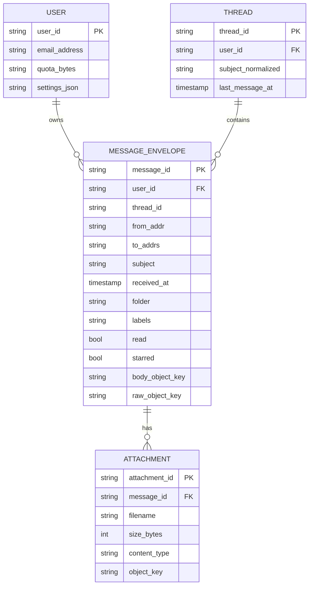
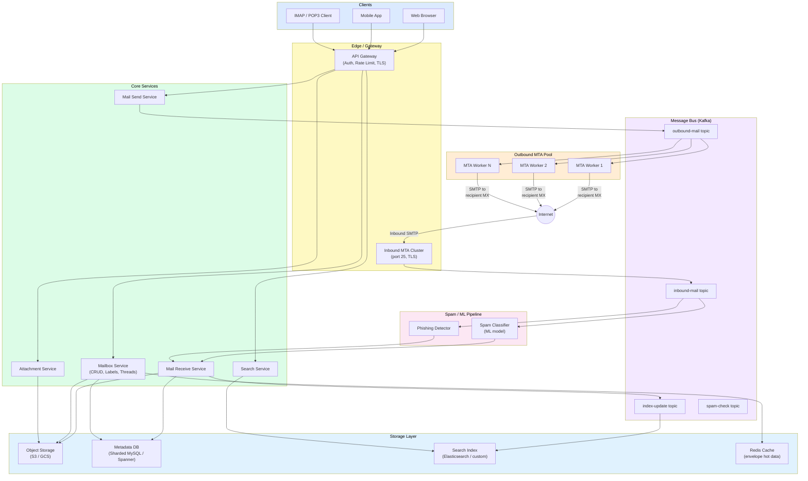
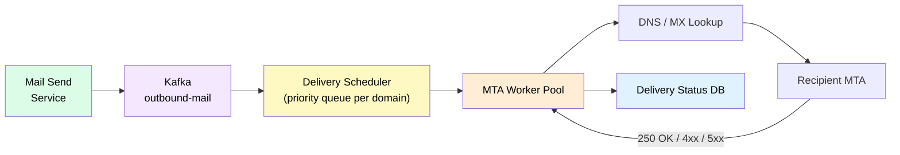
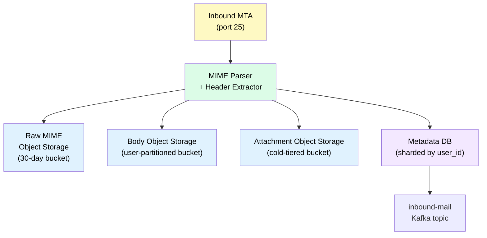
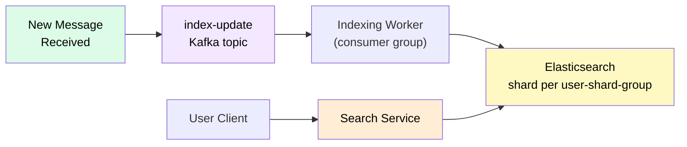
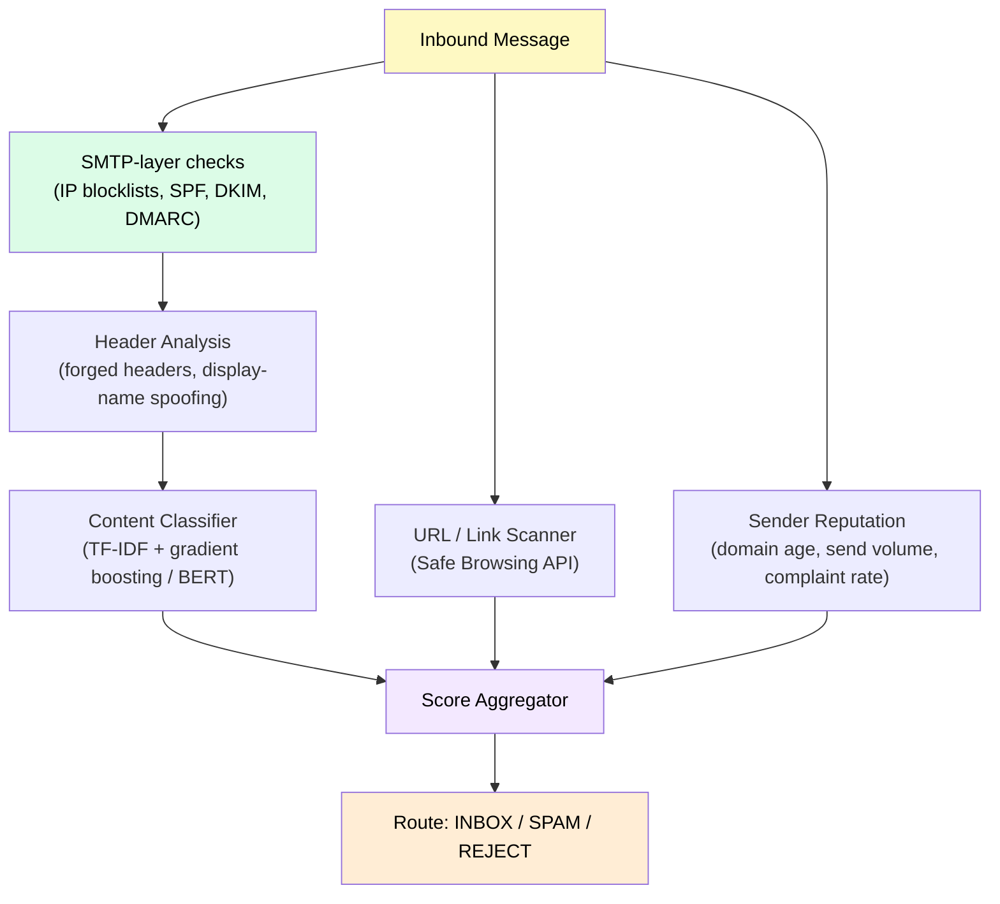

# Design Gmail-Style Email Service

> A globally distributed email platform that sends, receives, stores, and searches billions of messages per day with high deliverability, spam protection, and per-user search.

**Difficulty:** ⭐⭐⭐⭐ · **Builds on:**
[Object Storage](../../Level-02-Data-Layer/09-Object-Storage/README.md) ·
[Search Systems](../../Level-07-Big-Data-and-Specialized/04-Search-Systems/README.md) ·
[Stream Processing](../../Level-07-Big-Data-and-Specialized/02-Stream-Processing/README.md) ·
[Distributed Message Queue](../19-Distributed-Message-Queue/README.md)

---

## 1. 🎯 Problem & Scope

You're designing the backend for a Gmail-scale email service — one that hundreds of millions of users rely on every day for both personal and business communication. The system must:

- **Send** email reliably to any address on the internet via SMTP.
- **Receive** inbound email from external senders and route it to the right mailbox.
- **Store** messages (headers, body, attachments) durably and cost-effectively, potentially for years.
- Let users **search** their own mailbox quickly, even with millions of messages.
- **Filter spam** and phishing before messages ever reach an inbox.
- Present a coherent **conversation/thread** view.

We are **not** designing a mail client UI or calendar — just the backend that drives a product like Gmail or Outlook 365.

---

## 2. 📋 Requirements

### Functional
- Send email to external domains via SMTP; support CC/BCC, attachments up to 50 MB.
- Receive inbound email; deliver to local mailboxes or forward.
- Organize mail into folders/labels; support conversation threading.
- Full-text search within a user's mailbox (subject, body, sender, date).
- Spam / phishing detection; quarantine or reject.
- Read receipts, delivery status notifications (DSN).
- Support IMAP/POP3 and a REST API for the web client.

### Non-Functional
- **Scale:** 1 B active users, 5 B messages/day sent + received.
- **Availability:** 99.99% for read access; 99.9% for send (SMTP retries make strict 5-nines unnecessary).
- **Latency:** Inbox load < 200 ms p99; search < 500 ms p99; outbound delivery best-effort < 30 s.
- **Durability:** Zero message loss once accepted; replicated across ≥3 AZs.
- **Storage:** Efficient; attachment bytes on object storage, not hot databases.
- **Deliverability:** SPF/DKIM/DMARC compliant; low spam-sender reputation score.

---

## 3. 🧮 Capacity Estimation

**Traffic (send + receive)**

| Metric | Value |
|--------|-------|
| Active users | 1 B |
| Messages/day | 5 B (≈ 58 K/s peak) |
| Avg message size (headers + body) | 75 KB |
| Avg attachment size (when present) | 2 MB; 20% of messages have attachments |

**Storage per day**

```
Text bodies:   5 B msgs × 75 KB  = 375 TB/day
Attachments:   5 B × 20% × 2 MB  = 2 PB/day
Total raw:     ~2.4 PB/day
With 3× replication: ~7.2 PB/day
```

At 5-year retention with compression (≈3:1) and tiered cold storage:
```
Compressed data/year: 2.4 PB × 365 / 3  ≈ 290 PB/year (net)
```

That's roughly the scale of Gmail's actual storage footprint.

**Metadata (indexes, envelopes)**

- Envelope per message: ~1 KB (from/to/date/subject/flags/folder)
- 5 B msgs/day × 1 KB = 5 TB/day of metadata
- Hosted in a horizontally sharded relational/NoSQL store; feasible.

**Search index**

- Inverted index per user; tokens ≈ 10× message count
- Index growth: ~50 GB/user at 1 M messages (very active user)
- Average user: ~50 K messages → ~2.5 GB index; median much smaller

**Outbound SMTP connections**

- 58 K msgs/s → need a pool of outbound MTA workers
- Each MTA handles ~200 concurrent SMTP connections → 300 MTA servers

---

## 4. 🔌 API Design

```
# Client-facing REST (internal, behind auth gateway)

POST   /v1/messages/send
       Body: { to, cc, bcc, subject, body, attachmentIds[] }
       → { messageId, accepted: true }

GET    /v1/mailbox/{userId}/messages?folder=INBOX&page=1&limit=50
       → { messages: [{id, from, subject, snippet, date, read, labels}], total }

GET    /v1/mailbox/{userId}/messages/{messageId}
       → { headers, bodyHtml, bodyText, attachments: [{name, size, url}] }

GET    /v1/mailbox/{userId}/search?q=from:boss@acme.com+has:attachment&page=1
       → { messages: [...], total }

POST   /v1/mailbox/{userId}/messages/{messageId}/labels
       Body: { add: ["STARRED"], remove: ["INBOX"] }

DELETE /v1/mailbox/{userId}/messages/{messageId}   (soft-delete → Trash)

# Attachment upload (pre-signed, direct to object storage)
POST   /v1/attachments/upload-url
       → { uploadUrl, attachmentId }   # client PUTs directly to object store

# Internal SMTP ingress endpoint (not public REST):
# port 25 — raw SMTP; handled by inbound MTA cluster
```

---

## 5. 🗄️ Data Model



**Storage justification:**

| Data | Store | Why |
|------|-------|-----|
| Message envelopes & metadata | Sharded MySQL / Spanner / Cassandra | Structured queries, per-user sharding, strong consistency for flags |
| Message bodies (text) | [Object Storage](../../Level-02-Data-Layer/09-Object-Storage/README.md) (S3-compatible) | Immutable blobs, cheap, durable; fetched by key |
| Attachments | Object Storage (separate bucket, lifecycle to cold tier) | Large binary, infrequently accessed |
| Raw MIME (inbound) | Object Storage (temporary bucket, 30-day TTL) | Needed for re-parsing, legal hold |
| Search indexes | Custom inverted index per user (Lucene / Elasticsearch shard per user) | Per-mailbox isolation; see Deep Dives |
| Session / auth tokens | Redis | Fast lookup, TTL-based expiry |

---

## 6. 🏗️ High-Level Architecture



**Walk-through — sending a message:**

1. User's web client calls `POST /v1/messages/send` through the **API Gateway**.
2. **Mail Send Service** validates the request, stores body + attachments in **Object Storage**, writes the envelope to **Metadata DB**, then publishes to the `outbound-mail` Kafka topic.
3. An **Outbound MTA Worker** consumes the job, performs DNS MX lookup for the recipient domain, opens an SMTP/TLS connection, and delivers the message. It retries with exponential back-off (up to 4 days per RFC 5321).
4. Delivery status (success / bounce / defer) is written back to the Metadata DB.

**Walk-through — receiving a message:**

1. External MTA connects to our **Inbound MTA Cluster** on port 25.
2. MTA performs initial checks (IP reputation, DMARC/SPF/DKIM), rejects obvious junk at SMTP time.
3. Raw MIME is stored in Object Storage; envelope is published to the `inbound-mail` Kafka topic.
4. **Spam Classifier** and **Phishing Detector** score the message in parallel (consuming the same topic with different consumer groups).
5. **Mail Receive Service** waits for scores, routes to INBOX or SPAM folder, writes envelope to Metadata DB, publishes an index-update event to `index-update` topic.
6. **Search Service** consumers update the per-user inverted index in Elasticsearch.

---

## 7. 🔬 Deep Dives

### 7.1 Outbound Delivery, Retries & Deliverability

Deliverability is the hardest operational problem — getting your mail *accepted* by Yahoo, Outlook, and Gmail is non-trivial.



**SMTP retry logic:**

- `2xx` → success, mark delivered.
- `4xx` (transient) → schedule retry: 5 min → 30 min → 2 h → 6 h → 24 h → 4 days, then bounce.
- `5xx` (permanent) → bounce immediately; send NDR to sender.

**Deliverability stack:**

| Mechanism | What it does |
|-----------|-------------|
| **SPF** | Publishes DNS TXT listing which IPs may send for your domain |
| **DKIM** | Signs every outbound message with a private key; recipients verify via DNS public key |
| **DMARC** | Policy record telling recipients what to do with SPF/DKIM failures |
| **Dedicated IPs per tenant segment** | Isolates reputation: newsletter IPs vs transactional IPs vs personal mail |
| **Feedback Loop (FBL)** | ISPs forward spam complaints back; suppress flagged senders |
| **Bounce processing** | Hard bounces → suppress address; soft bounces → track & limit |

Each MTA worker maintains a **per-domain connection pool** and respects recipient MTA's rate limits (MX servers often advertise limits or throttle connections).

---

### 7.2 Receiving & Storage at Scale

The guiding principle: **metadata is hot; message bodies are cold.**



**Why object storage for bodies?**
See [Object Storage deep dive](../../Level-02-Data-Layer/09-Object-Storage/README.md). Message bodies are immutable blobs that fit perfectly into an object store: written once, read occasionally, stored cheaply for years. Storing them in a relational DB would bloat row sizes and make backups unwieldy.

**Lifecycle tiers (S3-compatible):**

| Age | Tier | Cost |
|-----|------|------|
| 0–90 days | Standard (SSD-backed) | ~$23/TB/month |
| 90 days – 2 years | Infrequent Access | ~$12/TB/month |
| 2–7 years | Glacier / Coldline | ~$4/TB/month |
| 7+ years | Deep Archive | ~$1/TB/month |

**Metadata DB sharding:** shard by `user_id % N` so all a user's envelopes land on the same shard — enabling efficient `SELECT * FROM envelopes WHERE user_id = X ORDER BY received_at DESC LIMIT 50` without cross-shard joins.

**Deduplication:** SHA-256 content-addressed storage for attachment bytes. If 100 users receive the same 10 MB PDF, store it once and reference the same object key → huge storage savings for popular newsletters and corporate announcements.

---

### 7.3 Per-User Search

Full-text search over one mailbox is fundamentally different from web search — you need per-user isolation and near-real-time index updates.



**Index design:**

- One Elasticsearch index per *user-shard-group* (e.g., group users by `user_id % 1000`) to avoid millions of tiny indexes.
- Each document = one message envelope + extracted body text. Body fetched from object storage at index time.
- Fields indexed: `from`, `to`, `subject`, `body_text`, `labels`, `received_at`, `has_attachment`.
- Query-time routing: all search requests for `user_id = X` hit the shard group that contains X → no scatter-gather needed.

**Query syntax support:**
`from:alice@example.com`, `has:attachment`, `larger:5MB`, `after:2024-01-01`, free-text AND/OR — all translated to Elasticsearch DSL at the search service.

**Latency target:** index updates within 5 seconds of delivery (near-real-time); search queries < 500 ms p99.

---

### 7.4 Spam Filtering Pipeline



**Layers (defense in depth):**

1. **SMTP-layer rejection** — reject at `RCPT TO` for known-bad IPs (no message stored, cheapest).
2. **Header analysis** — look for forged `From:` display names, suspicious reply-to addresses.
3. **Content ML model** — trained on billions of labeled messages; outputs a spam probability score.
4. **URL scanner** — extract all URLs, check against Google Safe Browsing and internal phishing DB.
5. **Sender reputation** — score based on domain age, volume trends, user complaint rate (via FBL).
6. **Aggregate score** → threshold routing: > 0.9 = REJECT/QUARANTINE, 0.5–0.9 = SPAM folder, < 0.5 = INBOX.

The ML model is retrained daily on fresh labeled data (user "Report Spam" / "Not Spam" actions are gold labels). Inference is served via a model-serving cluster (TensorFlow Serving / TorchServe) behind the Kafka consumer.

---

## 8. 📈 Scaling, Bottlenecks & Failure Modes

| Concern | Mitigation |
|---------|-----------|
| **Outbound IP reputation degradation** | Dedicate IP ranges per traffic type; auto-rotate IPs; monitor complaint rates; pause sending on high bounce rates |
| **Inbound MTA overload (spam storms)** | Rate-limit at TCP layer per source IP; auto-scale MTA cluster; Kafka absorbs spikes |
| **Metadata DB hot shards** | Consistent hashing + virtual nodes for shard rebalancing; read replicas for envelope list queries |
| **Object storage costs** | Content-addressed dedup; aggressive lifecycle tiering; compress text bodies (gzip saves 70%) |
| **Search index lag** | Kafka backpressure + auto-scale indexing workers; SLA 5 s; pre-warm for new user signups |
| **MTA grey-listing** | Detect 451 responses (greylisting) → retry after minimum interval without burning retry budget |
| **Large attachment delivery** | Stream directly from object storage to recipient; never load full attachment into app memory |
| **Zone failure** | Metadata DB with synchronous cross-AZ replication; object storage is inherently multi-AZ |

---

## 9. ⚖️ Trade-offs & Alternatives

| Decision | Choice Made | Alternative & Why Rejected |
|----------|-------------|---------------------------|
| Body storage | Object storage (S3-style) | BLOB columns in DB — too expensive, makes DB backups huge |
| Search | Per-user Elasticsearch shards | Global index — leaks cross-user data; complex ACL filtering |
| Spam pipeline | Async (Kafka consumer) | Synchronous during SMTP — adds latency to delivery, harder to scale |
| Metadata DB | Sharded MySQL / Spanner | MongoDB — joins are complex; Cassandra is good alternative for pure write throughput |
| Thread detection | Subject normalization + In-Reply-To header | ML-based clustering — heavier, but Gmail actually uses both |
| SMTP retry queue | Kafka + scheduled retry | RabbitMQ delayed queues — Kafka provides better durability and replay |

---

## 10. 🌐 How It's Actually Done

**Gmail (Google):** Uses Bigtable for message metadata, Colossus (Google's distributed file system, successor to GFS) for message bodies, and a custom SMTP infrastructure. Spam filtering uses a combination of rules + deep learning (TensorFlow). Gmail's threading uses a mix of `Message-ID`/`In-Reply-To` headers and subject-line normalization.

**Outlook / Microsoft 365:** Uses a massive Exchange Online infrastructure built on top of Azure, with custom MTA clusters ("Receive Connectors"), Exchange mailbox databases, and Azure Blob Storage for attachments. Spam is handled by Microsoft Defender for Office 365 (formerly EOP — Exchange Online Protection), which combines reputation, content filtering, and ML.

**Fastmail / Proton Mail:** Smaller scale but architecturally similar — open-source components like Dovecot (IMAP server), Postfix (MTA), and SpamAssassin for spam at smaller deployments. Proton adds end-to-end encryption (messages encrypted client-side before storage, which means server-side search isn't possible — they use client-side search index synced to device).

Key real-world lessons:
- Deliverability is an ongoing operational effort, not a one-time configuration.
- Deduplication of attachment content can save 30–50% of storage costs.
- "Report Spam" user signals are your highest-quality training labels.

---

## 11. 📝 Summary

| Aspect | Key Decision |
|--------|-------------|
| **Sending** | Kafka-backed outbound MTA pool; SPF/DKIM/DMARC; per-domain retry scheduler |
| **Receiving** | Inbound MTA → Kafka → async spam scoring → Metadata DB + Object Storage |
| **Storage** | Envelopes in sharded relational DB; bodies + attachments in object storage with lifecycle tiers |
| **Search** | Per-user-shard Elasticsearch; indexed within 5 s of delivery |
| **Spam** | Multi-layer: SMTP reject → header analysis → ML content model → URL scan → reputation score |
| **Threading** | `In-Reply-To` / `References` headers + subject normalization |
| **Scale** | 5 B msgs/day; ~2.4 PB raw data/day; handled via partitioned storage + async pipelines |

The key insight is the **separation of hot metadata from cold body blobs**: keeping a lean, indexed envelope in a fast database while offloading immutable byte blobs to cheap object storage gives you both fast inbox loading and economical long-term retention — exactly the pattern Gmail, Outlook, and every large-scale email provider uses.

---

*Siblings: [Google Drive/Dropbox](../14-Google-Drive-Dropbox/README.md) · [Notification Service](../04-Notification-Service/README.md) · [Distributed Message Queue](../19-Distributed-Message-Queue/README.md)*
