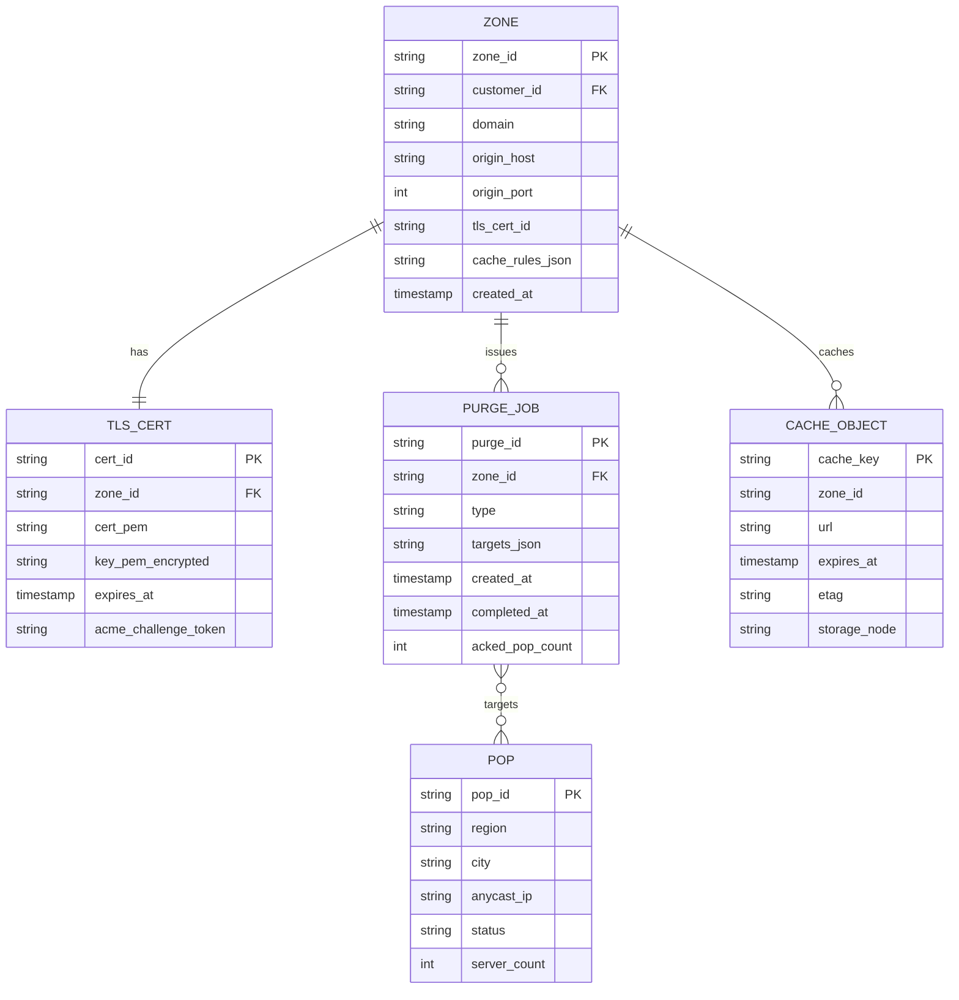
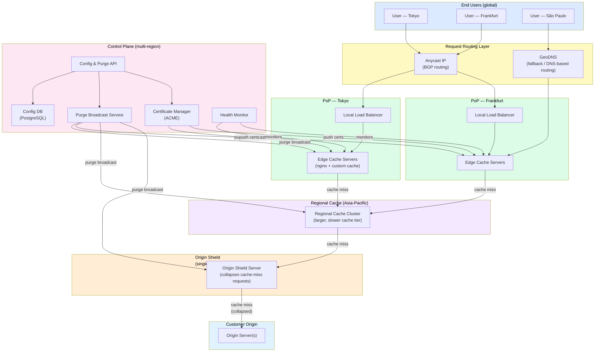
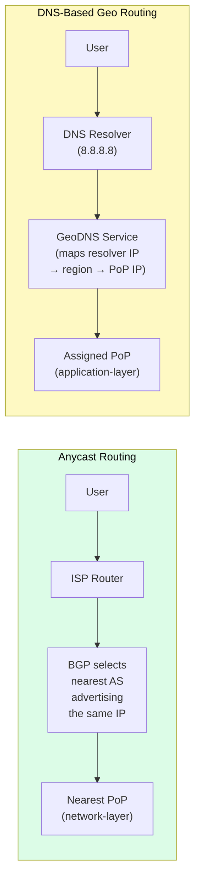
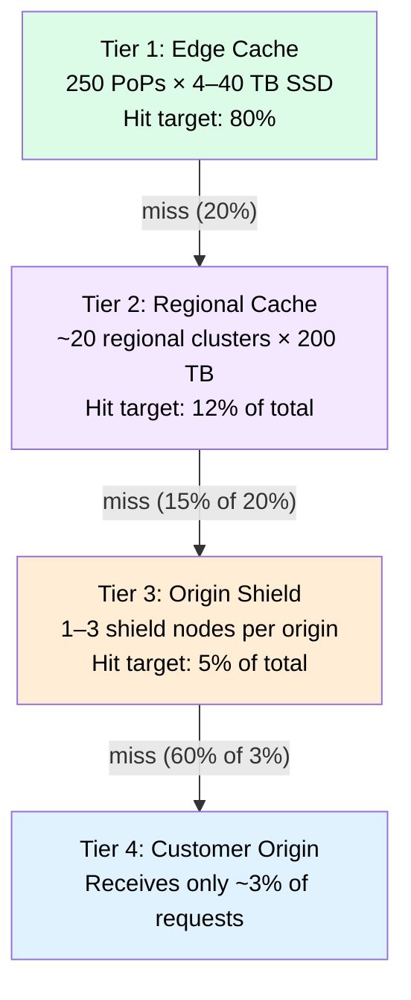
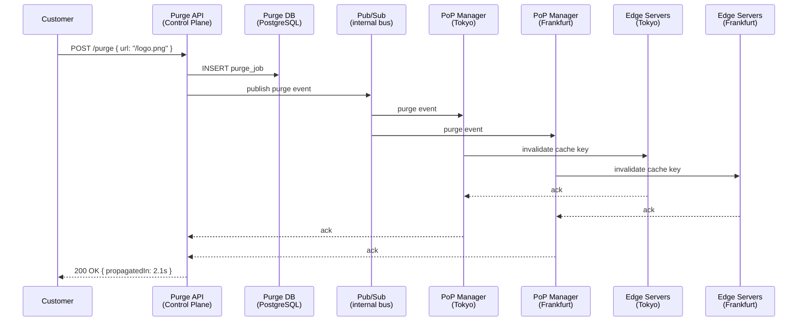
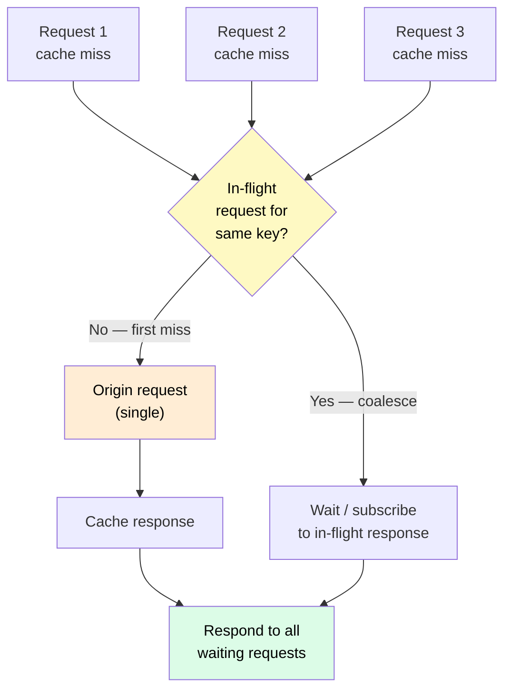

# Design a Content Delivery Network (CDN)

> Design the CDN infrastructure itself — the globally distributed edge-server network, request routing, cache hierarchy, and origin-offload mechanisms that power Cloudflare, Akamai, and Netflix Open Connect.

**Difficulty:** ⭐⭐⭐⭐ · **Builds on:**
[CDN Concept](../../Level-01-Building-Blocks/06-CDN/README.md) ·
[Consistent Hashing](../../Level-02-Data-Layer/08-Consistent-Hashing/README.md) ·
[Distributed Cache](../18-Distributed-Cache/README.md) ·
[Observability](../../Level-06-Scale-and-Reliability/01-Observability/README.md)

---

## 1. 🎯 Problem & Scope

A CDN solves a physics problem: the speed of light is finite, and end users are geographically far from origin servers. By caching content at hundreds of **Points of Presence (PoPs)** near users, a CDN dramatically reduces latency, absorbs traffic that would otherwise hit the origin, and provides resilience against origin failures.

You are designing the CDN infrastructure itself — not a service that uses a CDN, but the platform that companies like Cloudflare, Akamai, Fastly, and Netflix Open Connect operate.

Scope:
- A global network of **edge servers** (PoPs) that cache and serve HTTP/HTTPS content.
- **Request routing** that directs each user to the nearest healthy edge.
- A **cache hierarchy**: edge → regional cache → origin shield → origin.
- **Cache invalidation and purge** propagated globally within seconds.
- **TLS termination** at the edge (with SNI support for multi-tenant CDN).
- **Thundering herd protection** on cache misses.
- **Analytics and observability** for CDN operators.

Out of scope: application-layer features (WAF, DDoS mitigation, Workers/edge-compute) — those are separate services that sit in front of the CDN layer.

---

## 2. 📋 Requirements

### Functional
- Serve cached HTTP/HTTPS responses from the nearest PoP for any configured domain.
- Configurable cache rules per origin (TTL, Vary headers, query-string normalization).
- Cache purge API: purge by URL, by tag, or by prefix — propagated globally within 5 seconds.
- Support for streaming (range requests, chunked transfer, HLS/DASH video segments).
- TLS termination at edge; automatic certificate provisioning (ACME / Let's Encrypt).
- Health-check-aware routing: bypass unhealthy edges automatically.

### Non-Functional
- **Scale:** 100 Tbps aggregate throughput; 10 M requests/second globally.
- **PoP count:** 250+ PoPs across 100+ countries.
- **Cache hit ratio:** > 95% for static assets; > 80% overall.
- **Latency:** First-byte from edge < 20 ms p95 for cached content.
- **Purge propagation:** < 5 seconds globally.
- **Availability:** 99.99% from the edge; graceful fallback to origin on full PoP failure.

---

## 3. 🧮 Capacity Estimation

**Global traffic**

| Metric | Value |
|--------|-------|
| Peak requests/second | 10 M RPS globally |
| Avg response size | 100 KB (mix of HTML, images, video segments) |
| Peak throughput | 10 M × 100 KB = 1 Tbps per PoP tier; 100 Tbps aggregate |
| PoPs worldwide | 250 |
| Avg RPS per PoP | 40 K RPS (non-uniform; top PoPs: 500 K+ RPS) |

**Per-PoP hardware (top-tier PoP)**

```
Target: 500 K RPS, 400 Gbps throughput
Server NIC:  100 Gbps
Servers needed for bandwidth: 400 / 100 = 4 servers (bandwidth-bound)
RPS per server: ~50 K (reasonable for nginx/cache layer with keep-alive)
Servers for RPS: 500 K / 50 K = 10 servers
Take max → 10 cache servers + 2 spare = 12 servers per top-tier PoP
```

**Cache storage per PoP**

```
Working set (hot content): top 1 M objects × avg 500 KB = 500 GB
With 4 TB SSD per server, 10 servers = 40 TB raw cache per PoP
Cache eviction: LRU; overflow spills to regional cache tier
```

**Purge propagation**

```
250 PoPs × 1 purge message = 250 small control-plane messages
Target: < 5 s; control plane uses anycast routing to all PoPs → ~1–2 s typical
```

---

## 4. 🔌 API Design

```
# Customer-facing CDN configuration API

POST   /v1/zones
       Body: { domain: "example.com", originHost: "origin.example.com" }
       → { zoneId, nameservers: ["ns1.cdn.io", "ns2.cdn.io"] }

PUT    /v1/zones/{zoneId}/cache-rules
       Body: { rules: [{ match: "/static/*", ttl: 86400, stale_while_revalidate: 3600 }] }

POST   /v1/zones/{zoneId}/purge
       Body: { urls: ["https://example.com/logo.png"] }
       OR    { tags: ["product-images"] }
       OR    { prefix: "https://example.com/assets/" }
       → { purgeId, estimatedPropagationMs: 3000 }

GET    /v1/zones/{zoneId}/analytics?from=2024-01-01&to=2024-01-02
       → { requests, bandwidth, cacheHitRatio, topUrls, edgeRpsTimeseries }

# Internal control-plane APIs (edge ↔ control plane)

POST   /internal/purge-broadcast        # control plane → all PoP managers
GET    /internal/config/{zoneId}        # edge pulls zone config on startup
GET    /internal/health                 # health check endpoint on each edge server
```

---

## 5. 🗄️ Data Model



**Storage notes:**

| Data | Store | Why |
|------|-------|-----|
| Zone configs, TLS certs | PostgreSQL (control plane) | Strongly consistent, infrequently written |
| Cache objects (actual bytes) | Local SSD on each edge server | Sub-millisecond read; no network hop |
| Cache metadata (TTL, ETag) | In-memory hash table on edge (redis-like) | Lookup without disk I/O for cache-hit decision |
| Purge jobs | PostgreSQL + pub/sub broadcast | Durable record + real-time fan-out |
| Analytics events | Append-only log → ClickHouse | High-volume write; columnar aggregation queries |

---

## 6. 🏗️ High-Level Architecture



**Walk-through for a cached response:**

1. User in Tokyo sends `GET https://example.com/logo.png`.
2. DNS resolves `example.com` to a CDN Anycast IP. BGP routes the TCP SYN to the **Tokyo PoP** (closest BGP peer).
3. Tokyo PoP terminates TLS using the cached certificate for `example.com`. Edge server checks its in-memory + SSD cache: **HIT** → respond with `200 OK`, set `Age` header. Done in < 5 ms.

**Walk-through for a cache miss:**

3. (continued) Cache **MISS** → edge checks **Regional Cache** (same continent). HIT there → fetch and cache locally, serve.
4. Regional cache miss → request goes to **Origin Shield** — a single designated PoP that all edges funnel cache-miss requests through, collapsing the thundering herd.
5. Origin Shield checks its own cache: HIT → serve. MISS → forward single request to customer's **Origin Server**.
6. Origin responds; Origin Shield caches the response, serves it back. Tokyo edge caches it locally. Future requests: HIT at edge.

---

## 7. 🔬 Deep Dives

### 7.1 Request Routing — Anycast vs DNS-Based Geo Routing

Getting users to the *right* PoP is the CDN's most critical routing decision. Two main approaches:



| | Anycast | DNS Geo Routing |
|--|---------|-----------------|
| **How it works** | All PoPs advertise the same IP via BGP; routers pick shortest AS path | DNS returns different IP per geographic region of the resolver |
| **Routing latency** | Zero (packet-level) | Add one DNS RTT, but TTL can be 30–60 s |
| **Failover speed** | BGP convergence: 30–180 s | DNS TTL expiry: 30–300 s |
| **Granularity** | Network topology (AS hops), not geography | Geographic (can route by country/city) |
| **Real usage** | Cloudflare, Google (primary) | Akamai, AWS CloudFront (primary) |
| **Combination** | Cloudflare uses Anycast as primary + DNS as customer-visible hostname | Most CDNs combine both |

**Health-aware routing:** the control plane health monitor pings each PoP every 5 seconds. If a PoP fails, it withdraws its BGP announcement (Anycast) or GeoDNS removes it from the answer pool within one TTL. Traffic automatically reroutes to the next-nearest PoP.

---

### 7.2 Cache Hierarchy & Consistent Hashing for Content Placement

The cache hierarchy has four tiers, each larger and slower than the previous:



**Consistent hashing for edge cache placement:**
See [Consistent Hashing](../../Level-02-Data-Layer/08-Consistent-Hashing/README.md) for the core concept. Within a multi-server PoP, you need to decide which cache server stores which object. Using a consistent hash of the cache key (URL + normalized query string) ensures:

1. The same URL always maps to the same server → no duplicate copies across servers in the same PoP.
2. Adding or removing a server only remaps `1/N` of keys (instead of all keys with modulo hashing).
3. "Virtual nodes" (150+ per server) ensure even distribution even with heterogeneous server capacities.

```
cache_server = consistent_hash(normalize_url(url)) % ring_slots
```

For a 10-server PoP with 150 virtual nodes each: each URL maps deterministically to one server, maximizing cache utilization per byte of SSD.

**Negative caching:** cache 404 and error responses too (for short TTLs: 5–30 s), so origin errors don't cascade into thundering herds of miss traffic.

---

### 7.3 Cache Invalidation & Global Purge

Purge is the hardest operational problem in CDN design — "there are only two hard problems in computer science: cache invalidation and naming things."



**Purge strategies:**

| Strategy | Mechanism | Use case |
|----------|-----------|----------|
| **Hard purge** | Delete object from all caches immediately | Content that must never be served stale (security patches, pulled products) |
| **Soft purge / surrogate keys (cache tags)** | Mark object as stale; serve stale while revalidating in background | Marketing updates where 1–2 s of stale is acceptable |
| **TTL-based expiry** | Just set a short `Cache-Control: max-age` | Low-stakes content that changes predictably |
| **Versioned URLs** | `logo.v42.png` — never purge, just change URL | Best practice for static assets with build pipelines |

**Propagation speed:** Cloudflare claims < 150 ms worldwide for purge propagation (using their anycast network as a broadcast bus). A typical design achieves < 5 s using a pub/sub fan-out to all PoP managers.

---

### 7.4 Thundering Herd on Cache Miss

When a popular object expires, hundreds of concurrent requests may all miss the cache simultaneously and all race to the origin — a **thundering herd**.



**Request coalescing (also called "request collapsing"):**

- Edge server uses an in-memory map: `url → in-flight promise`.
- First request for a missing key creates the entry and fires the origin request.
- Subsequent requests for the same key see the in-flight promise and subscribe to it.
- When the origin responds, all subscribers are served simultaneously.
- Implemented in nginx with `proxy_cache_lock` or in Varnish with "grace + stampede protection."

**Stale-while-revalidate:** serve the stale cached copy immediately while refreshing asynchronously in the background. Zero thundering herd, zero user-visible latency spike at TTL expiry. Configured via `Cache-Control: stale-while-revalidate=60`.

---

## 8. 📈 Scaling, Bottlenecks & Failure Modes

| Concern | Mitigation |
|---------|-----------|
| **PoP overload (flash crowd)** | Auto-scale edge servers (cloud PoPs); shed load with 503 + `Retry-After`; route overflow to adjacent PoP |
| **BGP hijacking / route leaks** | RPKI (Resource Public Key Infrastructure) route origin validation; NOC monitoring |
| **TLS certificate expiry** | Automated ACME renewal 30 days before expiry; alert at 14 days; emergency manual renewal runbook |
| **Cache poisoning** | Normalize cache keys (strip irrelevant headers); validate `Vary` headers; never cache authenticated responses |
| **Long-tail cache misses** | Origin Shield collapses all edge misses; consistent hashing minimizes duplicate fetches within a PoP |
| **Control plane outage** | Edge servers continue serving cached content indefinitely from local cache; only new content or purges are affected |
| **SSD failure on edge server** | Consistent hashing redistributes that server's keys to neighbors; slight hit-rate drop, not an outage |
| **Large object streaming** | Range-request support; cache in fixed-size chunks (1 MB) independently; prevents one huge object evicting many small ones |

---

## 9. ⚖️ Trade-offs & Alternatives

| Decision | Choice Made | Alternative & Why Not |
|----------|-------------|----------------------|
| Routing mechanism | Anycast (primary) + GeoDNS (fallback) | Pure DNS only — slower failover; pure Anycast — harder to do city-level routing |
| Cache placement within PoP | Consistent hashing | Simple modulo — poor when servers added/removed; random — duplicate copies |
| Purge propagation | Pub/sub fan-out from control plane | Gossip protocol — hard to get < 5 s SLA; polling — too slow |
| Thundering herd | Request coalescing + stale-while-revalidate | No protection — origin gets hammered; mutex-only — all requests queue and wait |
| TLS cert management | ACME (Let's Encrypt / ZeroSSL) per zone | Manual cert upload — operationally expensive at CDN scale |
| Cache hierarchy depth | 3 tiers (edge → regional → shield) | 2 tiers only — worse origin offload; 4 tiers — added latency on misses |

---

## 10. 🌐 How It's Actually Done

**Cloudflare:** Operates 300+ PoPs using Anycast exclusively. Every PoP advertises the same IP space via BGP. Uses a custom HTTP proxy (written in Rust, called Pingora) replacing nginx for better connection reuse and performance. Cache storage uses a custom "Tiered Cache" product. Purge propagates via the same anycast network in ~150 ms.

**Akamai:** The original CDN (founded 1998). Uses DNS-based geo routing as the primary mechanism, with a massive global map of IP-to-geography derived from BGP data. Their "SureRoute" product computes real-time optimal paths through their backbone. They have over 4,000 PoPs (many very small).

**Netflix Open Connect:** Netflix's private CDN, embedded directly inside ISP networks (they give ISPs free hardware to host Netflix boxes — "Open Connect Appliances" or OCAs). Uses a combination of DNS routing and BGP peering. OCAs pre-load popular content overnight during off-peak hours via a "proactive caching" system, achieving near-100% cache hit rates for the top 10 titles.

**Fastly:** Uses Varnish Cache as the HTTP cache engine (with heavy customization) and exposes VCL (Varnish Configuration Language) to customers for fine-grained cache control. Their "Instant Purge" product achieves global purge in ~150 ms using their backbone.

---

## 11. 📝 Summary

| Aspect | Key Decision |
|--------|-------------|
| **Routing** | Anycast (BGP) for network-layer proximity + GeoDNS for fallback and geographic control |
| **Cache hierarchy** | 4 tiers: edge SSD → regional cluster → origin shield → origin; 95%+ hit rate |
| **Content placement** | Consistent hashing within each PoP to maximize per-server cache efficiency |
| **Cache invalidation** | Pub/sub broadcast to all PoPs; < 5 s propagation; soft-purge with stale-while-revalidate |
| **Thundering herd** | Request coalescing (one origin fetch, all waiters served) + stale-while-revalidate |
| **TLS** | Terminated at edge; ACME auto-renewal; wildcard certs for multi-tenant domains |
| **Failure handling** | BGP withdrawal for PoP failure; control-plane outage doesn't affect cached content serving |

The central insight: a CDN is fundamentally a **massive, globally distributed cache** with smart routing. The hard engineering problems are all about the cache: how to route users to the closest copy, how to keep copies consistent when content changes, how to avoid stampeding the origin when many users want something not yet cached, and how to store content efficiently across thousands of servers.

---

*Siblings: [Distributed Cache](../18-Distributed-Cache/README.md) · [YouTube/Netflix Streaming](../09-YouTube-Netflix-Streaming/README.md) · [Google Drive/Dropbox](../14-Google-Drive-Dropbox/README.md)*
