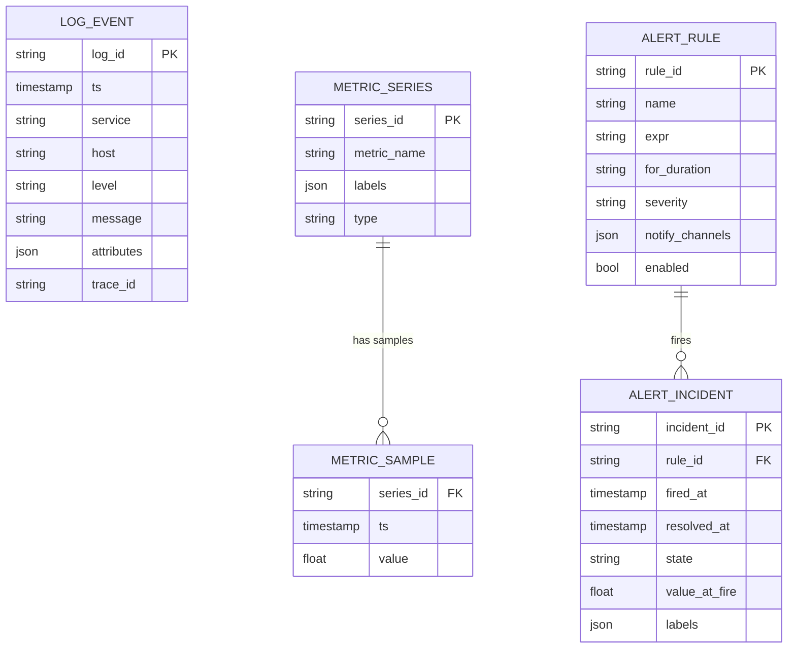
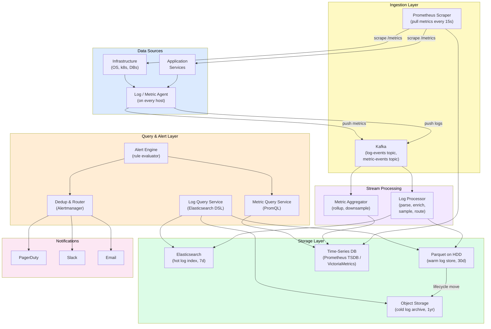
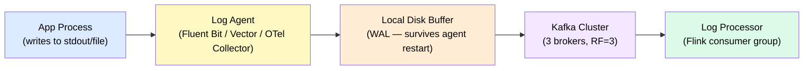
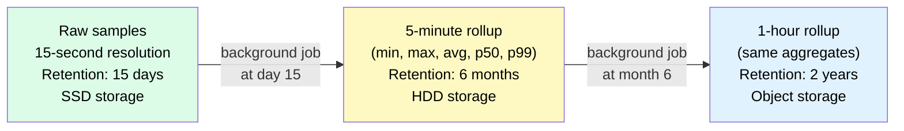
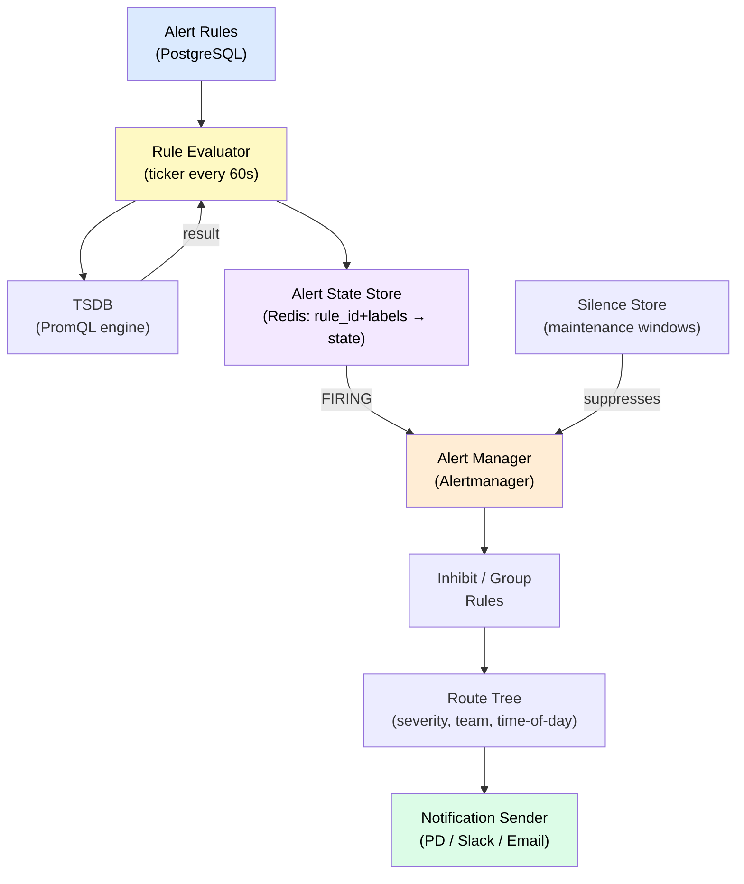

# Design Distributed Logging & Monitoring

> A centralized observability platform — ingesting logs, metrics, and traces from thousands of hosts, storing them efficiently, querying them at scale, and firing alerts — as seen in Datadog, the ELK + Prometheus stack, and Honeycomb.

**Difficulty:** ⭐⭐⭐⭐ · **Builds on:**
[Observability](../../Level-06-Scale-and-Reliability/01-Observability/README.md) ·
[Stream Processing](../../Level-07-Big-Data-and-Specialized/02-Stream-Processing/README.md) ·
[Distributed Message Queue](../19-Distributed-Message-Queue/README.md) ·
[Ad-Click Aggregator](../20-Ad-Click-Aggregator/README.md)

---

## 1. 🎯 Problem & Scope

Every production system emits three types of telemetry:

- **Logs** — timestamped, structured (or semi-structured) text events from every service.
- **Metrics** — numeric measurements over time: CPU%, request latency histograms, error rates.
- **Traces** — distributed request traces spanning multiple services (the "three pillars of observability").

At scale — think 10,000 microservices, each on 50 hosts, emitting 10 K events/second — you're looking at 5 billion log lines and hundreds of millions of metric data points per minute. You need to ingest all of it, store it reliably but cheaply, make it queryable in seconds, and fire accurate alerts with minimal noise.

We're designing a platform like **Datadog**, **the ELK Stack** (Elasticsearch + Logstash + Kibana), the **Prometheus + Grafana + Loki** stack, or **Honeycomb**.

Scope:
- High-throughput **log ingestion** from agents on every host.
- **Time-series metrics** collection, storage, and aggregation.
- **Alerting engine** with deduplication and routing.
- **Query interface** for ad-hoc log search and metric dashboards.
- The **cardinality explosion** problem and **sampling** strategies.

Out of scope: distributed tracing internals (a separate design), the UI/dashboarding layer.

---

## 2. 📋 Requirements

### Functional
- Collect logs (structured JSON preferred; raw text also supported) from agents on every host.
- Collect metrics (counters, gauges, histograms) via pull (Prometheus scrape) or push (StatsD, OTLP).
- Store logs with full-text search; retain for configurable periods (7 days → 1 year).
- Store metrics with configurable downsampling and retention tiers.
- Query logs by time range + filter expressions (`service="payments" level="error"`).
- Query metrics with aggregation functions (sum, avg, p99, rate over time).
- Define alert rules (threshold, anomaly, no-data); notify via PagerDuty, Slack, email.
- Deduplication: same alert firing repeatedly → single notification until resolved.

### Non-Functional
- **Ingest:** 10 M log lines/second globally; 1 M metric data points/second.
- **Query latency:** log search < 5 s p99; metric query < 2 s p99.
- **Alert latency:** alert fires within 60 s of condition being true.
- **Availability:** ingestion 99.9%; query/alert 99.95%.
- **Durability:** no data loss after acknowledgment; replicate across ≥3 AZs.
- **Retention:** hot logs 7 days on SSD; warm 30 days on HDD; cold 1 year on object storage.

---

## 3. 🧮 Capacity Estimation

**Log ingestion**

| Metric | Value |
|--------|-------|
| Hosts emitting logs | 500 K hosts |
| Log lines per host per second | 20 lines/s |
| Total log lines/second | 10 M/s |
| Avg log line size | 500 bytes (JSON) |
| Raw ingest bandwidth | 5 GB/s = 18 TB/hour |
| After compression (4:1 for JSON) | 4.5 TB/hour compressed |
| 7-day hot storage | 4.5 TB/hr × 24 × 7 ≈ **756 TB** |

**Metric ingest**

| Metric | Value |
|--------|-------|
| Metric series (time series) | 50 M unique series |
| Scrape interval | 15 s per series → 3.3 M data points/s |
| Bytes per data point (raw) | 16 bytes (timestamp + value) |
| Raw bandwidth | 53 MB/s |
| After compression (delta + XOR, à la Gorilla) | ~1.3 MB/s compressed |
| 15-day hot storage (no downsampling) | ~1.7 TB |

**Cardinality problem preview:**
50 M unique time series is already large. If each series has labels like `{service, host, endpoint, status_code, customer_id}` and `customer_id` has 10 M values, you can easily blow up to **billions** of series. We'll address this in Deep Dives.

**Alert engine**
- 100 K alert rules evaluated every 60 s = 1,667 rule evaluations/second
- Each evaluation = a metric query → must be fast

---

## 4. 🔌 API Design

```
# Agent → Ingestion API (log push)
POST /v1/logs/ingest
     Body: [{ timestamp, service, level, message, attributes: {} }, ...]
     → { accepted: 9999, dropped: 1 }  # dropped if rate-limited

# Prometheus-compatible metric scrape (pull model)
GET  /metrics   # on each monitored host; Prometheus server scrapes this

# OTLP push (OpenTelemetry standard)
POST /v1/metrics (protobuf OTLP payload)

# Query API — logs
POST /v1/logs/query
     Body: { query: "service=payments AND level=error",
             from: "2024-01-15T10:00:00Z",
             to:   "2024-01-15T10:05:00Z",
             limit: 100 }
     → { logs: [...], total: 42371, truncated: true }

# Query API — metrics
POST /v1/metrics/query
     Body: { expr: "rate(http_requests_total{status='5xx'}[5m])",
             start: "2024-01-15T10:00:00Z",
             end:   "2024-01-15T10:30:00Z",
             step: "30s" }
     → { data: { resultType: "matrix", result: [...] } }

# Alert management
POST /v1/alerts/rules
     Body: { name: "High Error Rate",
             expr: "rate(errors[5m]) > 0.05",
             for:  "2m",
             severity: "critical",
             notify: ["pagerduty:team-ops"] }

GET  /v1/alerts/firing
     → { alerts: [{ name, labels, state, firedAt, value }] }
```

---

## 5. 🗄️ Data Model



**Storage justification:**

| Data | Store | Why |
|------|-------|-----|
| Log events (hot, 7 days) | Elasticsearch / OpenSearch | Full-text inverted index; structured field filtering |
| Log events (warm, 30 days) | Compressed columnar files on HDD (Parquet) | Cheaper storage; batch query via Presto/Trino |
| Log events (cold, 1 year) | Object storage (S3/GCS) | Cheapest; accessed rarely; Athena-style ad-hoc query |
| Metric samples | Custom TSDB (Prometheus TSDB / Thanos / Cortex / VictoriaMetrics) | Time-series optimized storage; Gorilla compression |
| Metric series labels | Inverted index in TSDB | Fast label-set lookup: `{service="payments"}` |
| Alert rules | PostgreSQL | Small, structured, strongly consistent |
| Alert incidents | PostgreSQL + Redis (active state) | Durable history + fast in-memory state for dedup |

---

## 6. 🏗️ High-Level Architecture



**Walk-through — a log line's journey:**

1. A service emits a structured JSON log event; the **Agent** on the host buffers and batches it (100 ms or 1,000 lines, whichever comes first).
2. Agent publishes the batch to the **Kafka `log-events` topic**. Kafka provides durability and back-pressure handling.
3. **Log Processor** (Flink / Kafka Streams consumer) parses, enriches (adds geo-IP, resolves hostnames), applies sampling rules, and indexes into **Elasticsearch** (hot tier).
4. A parallel Kafka consumer streams log batches to **Parquet files on HDD** (warm tier). An S3 lifecycle rule moves files older than 30 days to **cold object storage**.
5. User queries hit the **Log Query Service**, which fans out to ES (recent) or Trino/Athena (older) depending on the time range.

**Walk-through — an alert firing:**

1. **Alert Engine** evaluates every alert rule on a 60-second tick by issuing PromQL queries to the **Metric Query Service**.
2. Rule `rate(errors[5m]) > 0.05` returns a value of 0.12 — threshold crossed.
3. Alert Engine records the incident as `PENDING`; after `for: 2m` it transitions to `FIRING`.
4. **Dedup & Router (Alertmanager)** checks: is there an existing open incident for this rule + label set? If yes, suppress the duplicate. If no, route to PagerDuty based on severity and time-of-day routing rules.

---

## 7. 🔬 Deep Dives

### 7.1 High-Volume Log Ingestion — Agents, Buffering, and Back-pressure



**Agent design (Fluent Bit / Vector):**
- Runs as a DaemonSet on each k8s node (one agent per host).
- Tails log files or reads from journald.
- Local disk buffer (WAL): if Kafka is slow, the agent buffers to disk (up to X GB) rather than dropping logs. Survives agent restarts.
- Batch compression: gzip or zstd batches before network send → 4–8× bandwidth reduction.
- Back-pressure propagation: if Kafka consumer offset lag exceeds a threshold, the agent's Kafka producer slows ingestion → back-pressure signals to upstream log writers (they may start dropping at the application layer if fully backed up).

**Kafka partitioning strategy:**
- Partition key: `service` + `host` → logs from the same host arrive in order within a partition.
- Partition count: sized to match peak throughput / (producer throughput per partition). At 5 GB/s compressed, with 200 MB/s per partition → 25 partitions minimum; use 64 for headroom.
- Retention: 24–48 hours on Kafka (allows reprocessing after processor bugs).

**Log enrichment in the processor:**
Add fields the application doesn't know at emit time: `cluster`, `region`, `kubernetes_namespace`, `datacenter`. Look up slow fields (geo-IP) from a local cached DB (MaxMind GeoLite, refreshed daily).

---

### 7.2 Time-Series Storage — Compression, Downsampling & Retention

Raw metric storage without compression would require:
```
50 M series × 1 sample/15s × 86400 s/day × 16 bytes = 46 TB/day
```
That's unsustainable. Two techniques bring it down dramatically:

**Gorilla / delta-XOR compression (used by Prometheus, InfluxDB, Gorilla paper from Facebook):**

```
Timestamps:  delta-of-delta encoding (most series scrape at fixed intervals,
             so Δ is nearly constant → encodes in 1–2 bits)
Values:      XOR with previous value — if a CPU metric barely changes,
             most bits are zero → Fibonacci/variable-length encoding
Result:      ~1.37 bytes per sample (vs 16 bytes raw) → 12:1 compression
```

At 12:1 compression: 46 TB/day → **3.8 TB/day**.

**Downsampling tiers:**



Query routing: when a query asks for 30-day trends, the query engine automatically selects the 5-minute rollup tier (much faster to read than raw 15-second samples). For recent 1-hour windows, it uses raw data.

**Thanos / Cortex / VictoriaMetrics** solve the Prometheus scaling problem by sharding time-series storage horizontally and providing a global query layer that federates across shards.

---

### 7.3 The Alerting Engine — Rule Evaluation, Dedup & Routing



**Rule evaluator lifecycle:**
1. Load all enabled rules from PostgreSQL at startup; re-read on change events.
2. Every 60 seconds: for each rule, fire a PromQL query against TSDB.
3. Compare result to threshold. If breached: look up current state in Redis.
4. **State machine:** `INACTIVE → PENDING → FIRING → RESOLVED`.
   - `PENDING` = condition is true but `for:` duration not yet elapsed (avoids alerting on 1-second spikes).
   - `FIRING` = condition has been true for the full `for:` duration.
   - `RESOLVED` = condition no longer true.
5. State transitions generate events sent to Alertmanager.

**Deduplication in Alertmanager:**
- Group alerts by label set (e.g., `{service, severity}`) — 100 microservices all returning errors → one group notification, not 100 pages.
- **Inhibition:** a "service completely down" alert suppresses individual endpoint alerts from the same service (less noise when the root cause is obvious).
- **Silences:** maintenance windows suppress alerts matching a label selector for a time range.
- **Repeat interval:** FIRING alerts re-notify every N hours if not resolved (configurable by severity).

---

### 7.4 Cardinality Explosion & Sampling

**The cardinality problem:**

```
metric: http_requests_total
labels: {service, endpoint, status_code, customer_id, user_agent}

If customer_id ∈ {1 ... 10M} and endpoint ∈ {1 ... 500}:
Unique time series = 10M × 500 × 5 × ~10 = 250 BILLION series
```

This is catastrophically large. A single high-cardinality label like `customer_id` or `request_id` turns a manageable metric into a storage disaster.

**Mitigations:**

| Technique | Mechanism | Trade-off |
|-----------|-----------|-----------|
| **Label cardinality limits** | Reject metric series exceeding N unique values per label | Some granularity lost |
| **Drop high-cardinality labels** | Strip `customer_id` from metrics; use logs for per-customer debugging | Metrics become aggregate-only |
| **Adaptive sampling** | For high-volume, low-value events (DEBUG logs), sample 1 in 100; for ERROR logs, keep 100% | Some events lost; head-based sampling loses tail detail |
| **Tail-based sampling** | Buffer all spans for a trace; decide to keep or drop after seeing the full trace | More memory; complex; Honeycomb's approach |
| **Metric aggregation at source** | Agent pre-aggregates: instead of per-request histogram sample, emit histogram buckets every 15s | Loses individual request data; fine for SLOs |
| **Exemplars** | Attach one sample trace ID to each histogram bucket | Links metrics to traces without exploding cardinality |

**Log sampling strategies:**

```
head-based sampling:   sample the first N% of all log lines (simple, cheap,
                       but may drop important rare events)

tail-based sampling:   buffer all events for a request; if the request had
                       errors or was slow, keep 100%; otherwise sample at 1%
                       (preserves important traces, expensive in memory)

adaptive rate limiting: if a service emits > 10K log lines/second, start
                        dropping low-priority (DEBUG/INFO) lines dynamically
```

Honeycomb's key insight: if you store all events and use columnar storage with good compression, you can afford much higher cardinality than traditional TSDBs — shifting the problem from "reduce cardinality" to "store and query efficiently."

---

## 8. 📈 Scaling, Bottlenecks & Failure Modes

| Concern | Mitigation |
|---------|-----------|
| **Kafka consumer lag during traffic spikes** | Auto-scale processor consumer group; increase partition count; alert on lag > 5 min |
| **Elasticsearch hot shards** | Route logs by `service` hash to different shards; use ILM (Index Lifecycle Management) to roll over large indexes daily |
| **TSDB ingestion overload** | VictoriaMetrics / Cortex horizontal sharding; separate write and read paths |
| **Alert rule evaluation taking > 60 s** | Pre-compute expensive queries as recording rules; parallelize rule evaluation across workers |
| **Log query timeouts on large time ranges** | Limit time range by default; async query with polling for large ranges; warn users |
| **Storage cost explosion** | Aggressive downsampling; lifecycle policies; cardinality limits; per-team quotas |
| **Agent memory leak causing OOM** | Buffer size caps; back-pressure drops old DEBUG logs first (priority-based dropping) |
| **Control plane outage (alert engine down)** | Agents continue buffering to local disk; metrics continue being scraped; only alerting is affected |

---

## 9. ⚖️ Trade-offs & Alternatives

| Decision | Choice Made | Alternative & Why Not |
|----------|-------------|----------------------|
| Log transport | Kafka (pull-model buffer) | Direct HTTP push to Elasticsearch — overloads ES during spikes; no replay |
| Log hot storage | Elasticsearch | ClickHouse — better compression, faster aggregation; weaker full-text search |
| Metric storage | Prometheus TSDB / VictoriaMetrics | InfluxDB — similar; TimescaleDB (Postgres extension) — worse compression at scale |
| Metric collection | Pull (Prometheus scrape) + Push (OTLP) | Pure push — easier for short-lived jobs; pure pull — simpler but misses ephemeral containers |
| Alert evaluation | Server-side PromQL evaluation | Client-side in agent — can't aggregate across hosts |
| Sampling | Tail-based (for traces), head-based (for logs) | No sampling — storage costs become prohibitive at 10 M lines/sec |
| Retention policy | Hot → warm → cold tiering | Keep everything in ES — 100x more expensive; keep nothing old — no historical analysis |

---

## 10. 🌐 How It's Actually Done

**Datadog:** Uses a custom time-series database ("DDSketch" for quantile sketches), with Kafka for ingestion and a proprietary indexed log storage. Their agent is "dd-agent" (now the Datadog Agent, open-source). They process petabytes of data daily. Alert evaluation uses a distributed rule engine. Their "Live Tail" feature streams logs in real-time using server-sent events.

**Prometheus + Grafana + Loki (the OSS stack):**
- **Prometheus** is the de-facto standard for metric collection (pull model, PromQL). At scale, **Thanos** or **Cortex** provide long-term storage and global federation.
- **Grafana Loki** is a log aggregation system inspired by Prometheus — logs are indexed only by labels (not full-text inverted index), making storage much cheaper. Full-text search requires scanning compressed chunks. Trade-off: cheaper, but slower for ad-hoc text search.
- **Grafana** provides the UI for both.

**ELK Stack (Elasticsearch + Logstash + Kibana):** The original centralized logging stack. Logstash (or the lighter Filebeat) ships logs; Elasticsearch provides full-text indexing; Kibana is the dashboard. At very large scale, Elasticsearch's memory and storage costs become significant — many teams move warm/cold data to object storage via Elasticsearch's ILM.

**Honeycomb:** Takes a different philosophical approach — rather than metrics (aggregated) + logs (unstructured text), they store all events as wide structured rows (100+ columns) and let you slice/dice at query time using column-store techniques (like Parquet + vectorized execution). This trades storage cost for flexibility and eliminates the cardinality problem by design.

**Vector.dev:** A modern, high-performance open-source agent that unifies log, metric, and trace collection in one binary. Much lower memory and CPU footprint than Logstash. Written in Rust.

---

## 11. 📝 Summary

| Aspect | Key Decision |
|--------|-------------|
| **Log ingestion** | Agent (Fluent Bit / Vector) → local WAL buffer → Kafka → stream processor → Elasticsearch |
| **Metric collection** | Prometheus pull scrape + OTLP push → Prometheus TSDB / VictoriaMetrics |
| **Log storage** | Hot (Elasticsearch, 7d SSD) → warm (Parquet/HDD, 30d) → cold (object storage, 1yr) |
| **Metric storage** | Gorilla-compressed TSDB; 3-tier downsampling (15s → 5min → 1hr) |
| **Alerting** | 60-second evaluation ticks on PromQL; PENDING → FIRING state machine; Alertmanager dedup + routing |
| **Cardinality** | Hard limits per label; drop `request_id`-style labels from metrics; tail-based sampling for traces |
| **Query performance** | Elasticsearch for log full-text; PromQL engine for metrics; recording rules for expensive pre-aggregations |
| **Scale** | 10 M log lines/sec, 50 M metric series; Kafka absorption + horizontal sharding handles the load |

The key insight: **observability data has radically different access patterns at different ages.** New data is queried constantly (dashboards, active incidents); data a week old is queried only for post-mortems; data a year old is queried for trend analysis. Tiered storage that matches the storage medium to the access frequency — SSD → HDD → object storage — is what makes petabyte-scale observability economically viable.

---

*Siblings: [Distributed Message Queue](../19-Distributed-Message-Queue/README.md) · [Ad-Click Aggregator](../20-Ad-Click-Aggregator/README.md) · [Google Search](../22-Google-Search/README.md)*
