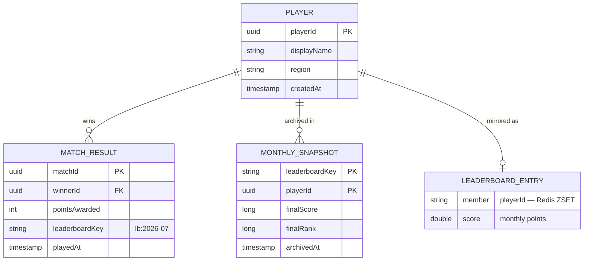
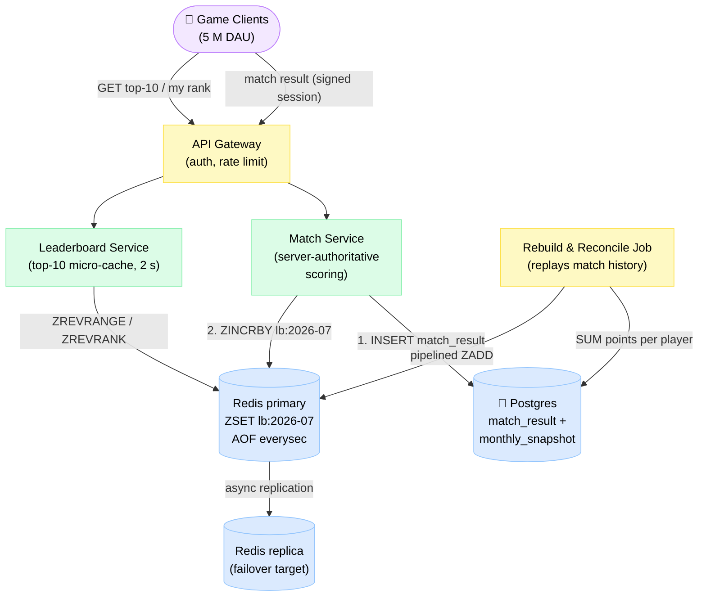
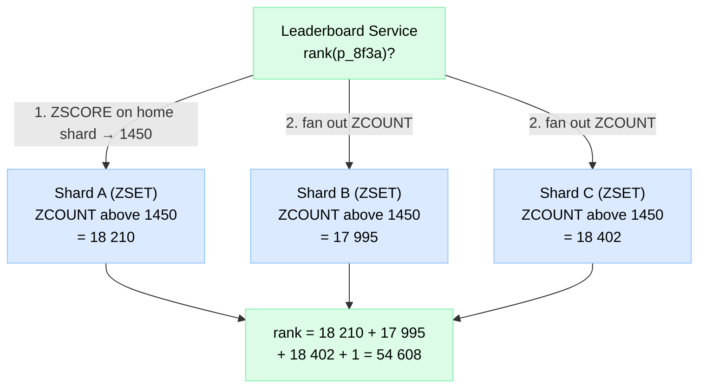

# Design a Gaming Leaderboard

> A real-time ranking system for a mobile game with millions of players — instant score updates, top-10, and "where do I stand?" — the classic warm-up problem that teaches you exactly why Redis Sorted Sets exist.

**Difficulty:** ⭐⭐ · **Builds on:**
[Caching](../../Level-01-Building-Blocks/03-Caching/README.md) ·
[Sharding & Partitioning](../../Level-02-Data-Layer/02-Sharding-and-Partitioning/README.md) ·
[Distributed Cache](../18-Distributed-Cache/README.md)

---

## 1. 🎯 Problem & Scope

You're building the leaderboard for a mobile game. When a player wins a match they earn points; the leaderboard must reflect that immediately. Players obsess over two screens: the **global top-10** and the **"rank around me"** view (my rank, plus the 4 players above and 4 below — the ones I can realistically overtake). Every month a new tournament starts and everyone resets to zero.

The naive answer — `SELECT ... ORDER BY score DESC` — works beautifully at 10,000 players and collapses at 25 million. This problem is a warm-up because the *right tool* (a sorted set) makes it almost easy; the interesting parts are durability, monthly resets, and what happens when even the right tool runs out of headroom.

**In scope:** score updates on match win, top-10 query, rank-around-me query, monthly tournament reset, durability of scores, cheat resistance basics.

**Out of scope:** matchmaking/skill rating (Elo, TrueSkill), friends-only leaderboards, prize payout, live push of rank changes (that's a [WebSockets & Realtime](../../Level-03-Communication/06-WebSockets-and-Realtime/README.md) problem — here clients poll).

---

## 2. 📋 Requirements

### Functional
- On match win, add points to the winner's monthly score (server decides the points, not the client)
- `GET top-10` — the global podium, freshest data
- `GET my rank` — absolute rank + score, plus 4 players above and 4 below
- Monthly tournament: scores reset on the 1st; last month's final standings stay viewable
- A player's total score is never lost (survives cache restarts)

### Non-Functional
- **p99 read latency < 50 ms** (leaderboard screen opens constantly)
- **p99 write latency < 100 ms** (score visible before the post-match screen finishes animating)
- Scale: 25 M MAU, 5 M DAU; handle 10× traffic spikes (tournament final day)
- Availability > 99.9% for reads; a stale-by-seconds leaderboard is acceptable, a wrong score is not
- Rank freshness: updates visible within ~1 s (near-real-time, not transactional)

---

## 3. 🧮 Capacity Estimation

**Writes (score updates)**
- 5 M DAU × 10 matches/day = **50 M score updates/day**
- 50 M ÷ 86 400 s ≈ **~580 writes/s average**, **~5 800/s at 10× peak**
- A single Redis node does ~100 000 simple ops/s → peak writes use **< 6%** of one node

**Reads**
- Each DAU opens the leaderboard ~5×/day → 25 M views/day ≈ **290 reads/s avg, ~2 900/s peak**
- Each view ≈ 3 Redis commands (rank + range + total) → **< 10 000 ops/s peak**. Still trivial.

**Storage (Redis, per monthly board)**
- One entry = member string (~30 B player ID) + 8 B score + skip-list/hash overhead ≈ **~150 B**
- 25 M MAU × 150 B ≈ **~4 GB per month's sorted set** — fits comfortably on one 16 GB node, even keeping the previous month live too (~8 GB)

**Storage (source of truth, Postgres)**
- One `match_result` row ≈ 100 B × 50 M/day ≈ **5 GB/day → ~150 GB/month** → partition by month, archive old partitions to object storage

The punchline of the math: **this workload fits on one Redis primary + one replica.** The design effort goes into durability and the monthly lifecycle, not raw throughput.

---

## 4. 🔌 API Design

```
# Write path — called by the Match Service ONLY (never by the game client)
POST /v1/leaderboards/{season}/scores
Body: { "playerId": "p_8f3a", "matchId": "m_991", "points": 25 }
→ 200 { "newScore": 1450, "rank": 78432 }

# Global podium
GET /v1/leaderboards/2026-07/top?limit=10
→ 200 { "entries": [ { "rank": 1, "playerId": "p_c21", "name": "elle", "score": 98210 }, ... ] }

# Rank around me (4 above + me + 4 below)
GET /v1/leaderboards/2026-07/players/p_8f3a/rank?around=4
→ 200 { "rank": 78432, "score": 1450, "neighbors": [ ...9 entries... ] }
```

Each endpoint maps to one or two Redis commands:

```
ZINCRBY  lb:2026-07 25 p_8f3a              # add points            O(log N)
ZREVRANGE lb:2026-07 0 9 WITHSCORES        # top-10                O(log N + 10)
ZREVRANK lb:2026-07 p_8f3a                 # my rank (0-based)     O(log N)
ZREVRANGE lb:2026-07 78428 78436 WITHSCORES # 4 above + me + 4 below
ZSCORE   lb:2026-07 p_8f3a                 # my score              O(1)
```

**Tie-breaking:** two players with equal scores are ordered lexicographically by member — arbitrary. If "first to reach the score ranks higher" matters, pack a composite score: `score × 2^20 + (2^20 − seconds_into_month)`. Same commands, deterministic ties.

---

## 5. 🗄️ Data Model

Two stores, two jobs: **Redis is the ranking engine** (fast, derived, rebuildable), **Postgres is the source of truth** (every match, append-only).



*Postgres holds players, match history, and frozen monthly snapshots; the Redis sorted set is a derived, rebuildable view.*

### Why a Redis Sorted Set? (the internals, briefly)

A ZSET is **two data structures glued together**:

1. A **hash table**: `member → score`. That's why `ZSCORE` is O(1).
2. A **skip list**: entries sorted by score, with "express lanes" — each node appears in level 1, and with probability ~25% also in level 2, ~6% in level 3, and so on. Searching starts at the top lane and drops down, skipping huge runs of nodes: **O(log N)** for insert, delete, and range lookup.

```mermaid
flowchart TB
    subgraph HT["Hash part — member → score, O(1) ZSCORE"]
        direction LR
        HK["'ava'→1450 · 'bob'→3100 · 'dan'→5100 · 'carol'→7200 · 'elle'→9800"]
    end
    subgraph L3["Skip list level 3 — fastest express lane"]
        direction LR
        H3["HEAD"] -->|"span 4"| C3["carol · 7200"] --> N3["NIL"]
    end
    subgraph L2["Level 2"]
        direction LR
        H2["HEAD"] -->|"span 2"| B2["bob · 3100"] -->|"span 2"| C2["carol · 7200"] --> N2["NIL"]
    end
    subgraph L1["Level 1 — every entry, sorted by score"]
        direction LR
        H1["HEAD"] --> A1["ava · 1450"] --> B1["bob · 3100"] --> D1["dan · 5100"] --> C1["carol · 7200"] --> E1["elle · 9800"] --> N1["NIL"]
    end

    classDef hash fill:#fef9c3,stroke:#fde047,color:#000
    classDef lane fill:#dbeafe,stroke:#93c5fd,color:#000
    classDef base fill:#dcfce7,stroke:#86efac,color:#000
    class HK hash
    class H3,C3,N3,H2,B2,C2,N2 lane
    class H1,A1,B1,D1,C1,E1,N1 base
```



*One sorted set = hash table (instant score lookup) + skip list (sorted order). Each skip-list link stores a **span** — how many level-1 nodes it jumps over — so Redis computes your exact rank by summing spans on the way down. That's the secret behind O(log N) `ZREVRANK`.*

For N = 25 M: log₂(25 M) ≈ 25 hops. Every leaderboard operation touches ~25 nodes. That's the entire trick.

---

## 6. 🏗️ High-Level Architecture



*Writes land in Postgres first (truth), then Redis (ranking). Reads never touch Postgres for the live month.*

**Write path (match win):**
1. Client reports the match via a signed session; the **Match Service recomputes the outcome server-side** — the client never says "give me 25 points."
2. Match Service inserts an append-only `match_result` row in Postgres. This is the durable moment.
3. Match Service calls `ZINCRBY lb:2026-07 25 p_8f3a`. Total: one insert + one O(log 25M) memory op → p99 well under 100 ms.
4. If the Redis call fails, the row is already safe — a retry queue re-applies it, and the nightly reconcile job catches anything missed.

**Read path (rank around me):**
1. Leaderboard Service runs `ZREVRANK` (my rank r), then `ZREVRANGE r−4 r+4 WITHSCORES` — two O(log N) ops, single pipeline, ~1 ms inside Redis.
2. Player IDs are hydrated to display names via a profile cache.
3. The top-10 is requested by *everyone*, so it's micro-cached in the service for 1–2 s — turning millions of identical reads into a handful.

---

## 7. 🔬 Deep Dives

### 7.1 Durability — the leaderboard lives in RAM

Redis restart with no persistence = every score gone and 25 M players filing support tickets. Three layers of defense, cheapest first:

1. **Source of truth in Postgres (the real answer).** Scores are *derived* data: `SUM(pointsAwarded) GROUP BY winnerId` for the month. The **rebuild job** replays that aggregate into a fresh sorted set with pipelined `ZADD` (~10 000 entries per pipeline → 25 M entries in a few minutes). Because writes go DB-first, rebuild loses nothing.
2. **Redis AOF (`appendfsync everysec`)** — on crash-restart, Redis replays its own log and loses at most ~1 s of increments. Turns most incidents into non-events; the rebuild job becomes the fallback, not the first responder.
3. **Replica + failover** — a warm replica takes over in seconds ([exactly the machinery from the Distributed Cache design](../18-Distributed-Cache/README.md)); reads continue during a primary failure.

The subtle bug: **dual writes drift.** DB insert succeeds, `ZINCRBY` times out but actually applied, retry applies it again → double count. Fix: make the Redis update idempotent — a tiny Lua script that records `matchId` in a companion set (`SADD lb:2026-07:applied`) and only increments if it wasn't already present. Reconcile nightly by comparing `ZSCORE` against the SQL aggregate.

### 7.2 Scaling beyond one node — sharding a sorted set

One node handled our numbers. But at 500 M players, or with per-country boards multiplying keys, one ZSET no longer fits. A sorted set is **one key = one shard slot** — Redis Cluster can't split it for you. Two classic strategies:

**Option A — shard by score range.** Shard 1 holds 0–9 999 points, shard 2 holds 10 000–19 999, etc. Rank = (players in higher shards, a pre-summed counter) + (my rank within my shard). Top-10 hits only the top shard.
- ✅ Rank queries touch ~1 shard. ❌ Players *migrate between shards* as scores grow, and popular score bands make hot spots. Rebalancing is manual and painful.

**Option B — hash players across shards + scatter-gather.** Player→shard by `hash(playerId)`; each shard holds a ZSET of its ~1/K of players.
- Top-10: ask every shard for its top-10, merge K×10 candidates, take 10.
- My rank: `ZSCORE` on my shard, then ask **every** shard `ZCOUNT (myScore, +inf)` and sum.



*Scatter-gather rank: every shard counts players above my score; the sum (+1) is my global rank.*

- ✅ Uniform load, no migration between shards, trivial to add shards next season. ❌ Every rank query fans out to K shards (latency = slowest shard), and exact rank costs K × O(log N).

**Verdict:** hash + scatter-gather (Option B) is what most teams pick — predictable and boring — often with a third trick layered on: keep a small **"top-K only" ZSET replicated everywhere** for the podium, so the hottest query never fans out. General partitioning trade-offs live in [Sharding & Partitioning](../../Level-02-Data-Layer/02-Sharding-and-Partitioning/README.md).

### 7.3 Approximate rank at huge scale

Here's the liberating observation: rank #54 608 vs #54 611 — **nobody can tell**. Exact rank matters at the top (podium, prize cutoffs); in the long tail, "≈ top 12%" is the actual product requirement. So stop paying for exactness:

- **Bucket histogram:** keep an array of counters, one per score band (e.g., 1 000 buckets of 100 points). On `ZINCRBY`, also `HINCRBY` the old bucket −1 and new bucket +1. Approximate rank = sum of counters above my bucket + interpolated position inside it. O(#buckets) per query, O(1) per update, kilobytes of memory — works for a *billion* players.
- **Quantile sketches (t-digest & friends):** the production-grade version of the same idea — a probabilistic structure that answers "what fraction of values exceed X?" within a small error, in constant space. Same spirit as a count-min sketch: accept ~1% error, get orders-of-magnitude cheaper. RedisBloom ships t-digest natively.

The hybrid everyone converges on: **exact ZSET for the top 1 000 + buckets/sketch for everyone else.** Full tour of these structures in [Probabilistic Data Structures](../../Level-07-Big-Data-and-Specialized/06-Probabilistic-Data-Structures/README.md).

### 7.4 Monthly tournaments — key-per-month + TTL

Never "reset" a leaderboard by deleting members — a `DEL` on a 4 GB key blocks Redis, and a crash mid-reset is a nightmare. Instead, **the month is baked into the key**:

- Writes derive the key from the match timestamp: `lb:2026-07`. At midnight on the 1st, new writes simply *land in a new key* that `ZINCRBY` creates on first touch. No flip ceremony, no race — a match played at 23:59:58 still counts for June.
- On creation, set `EXPIRE lb:2026-07 <45 days>` — old boards clean themselves up after a grace window. (Redis 7's `EXPIRE ... NX` makes "set TTL only if absent" one command.)
- An **archiver job** runs after month-end: `ZREVRANGE lb:2026-06 0 -1 WITHSCORES` in chunks → writes `monthly_snapshot` rows in Postgres → last month's standings are served forever from SQL, and the TTL quietly reaps the Redis key. (Bonus: an "all-time" board falls out for free — one extra `ZINCRBY` into `lb:alltime` per win.)

### 7.5 Cheat prevention (brief, but non-optional)

- **Server-authoritative scoring:** the client reports *match events*, the server computes the points. The score-update endpoint is internal-only — no client can call it.
- **Anomaly detection:** flag impossible deltas (500 points from one match when max is 50), impossible cadence (40 wins/hour), and statistical outliers vs. the player's history. Flagged players go to a **shadow board** — they see themselves ranked; nobody else does — pending review.
- **Top-N scrutiny:** prize ranks (top 100) get replay validation before payout. Cheap, because N is tiny.

---

## 8. 📈 Scaling, Bottlenecks & Failure Modes

| Bottleneck / failure | Symptom | Mitigation |
|---|---|---|
| Top-10 read storm | Everyone's home screen hits the same query | 1–2 s micro-cache in Leaderboard Service ([caching basics](../../Level-01-Building-Blocks/03-Caching/README.md)); one Redis read serves millions |
| Redis primary crash | Writes fail, ranks frozen | Replica failover (seconds) + AOF replay; worst case rebuild from Postgres in minutes |
| Dual-write drift | Redis score ≠ SQL sum | Idempotent Lua update keyed by `matchId`; nightly reconcile job |
| Tournament final-day spike (10×) | Write bursts to ~6 000/s | Still < 10% of one node; API Gateway rate-limits per player as backstop |
| ZSET outgrows one node (500 M+) | Memory pressure, slow rebuilds | Hash-shard + scatter-gather; replicated top-K set; approximate rank for the tail (deep dives 7.2–7.3) |
| Month rollover | Mixed writes at midnight | Key derived from match timestamp — both keys live side by side; no flip step to get wrong |
| Postgres write pressure | 50 M inserts/day bloat | Monthly partitions; append-only writes; archive old partitions to object storage |

---

## 9. ⚖️ Trade-offs & Alternatives

| Approach | How it works | Where it breaks | Verdict |
|---|---|---|---|
| **Redis Sorted Set** (chosen) | Skip list + hash; `ZINCRBY`/`ZREVRANK`, all O(log N) | RAM-only → needs the durability story of 7.1 | ✅ Purpose-built; every query in µs |
| SQL `ORDER BY score DESC` | `SELECT ... LIMIT 10`; rank = `COUNT(*) WHERE score > mine` | Rank query scans/aggregates millions of rows *per request*; index helps top-10 but not rank-around-me; writes fight reads for locks. Dies ~10⁵–10⁶ players | ❌ Fine for a launch weekend, not for 25 M |
| In-memory heap per app server | Each API server keeps a top-K heap | Only answers top-K — no arbitrary rank; every server has a *different* board (no shared state); vanishes on deploy | ❌ Not even consistent, let alone complete |
| DynamoDB + GSI on score | GSI partition per board, sort key = score; top-10 = one `Query` descending | Top-10 works; **rank-around-me doesn't** — no O(log N) rank in a B-tree-style API without scanning; single-partition boards throttle at ~1 000 WCU | ⚠️ Viable if serverless is mandatory: DynamoDB as truth + Redis/ElastiCache for ranks — which is just our design with different labels |

Other forks in the road: **DB-first vs Redis-first writes** (we chose DB-first — never lose a score; cost: rank lags a failed Redis call by seconds) and **exact vs approximate rank** (exact while one node suffices; approximate is the planned exit, not a rewrite).

---

## 10. 🌐 How It's *Actually* Done

**Redis itself** documents leaderboards as *the* canonical sorted-set use case — the pattern in this chapter (`ZINCRBY` + `ZREVRANGE` + `ZREVRANK`, key-per-period) comes straight from Redis's own docs and Redis Labs' gaming-leaderboard reference builds.

**Mobile game studios (Supercell-style):** at Clash-of-Clans scale, global exact rank is deliberately avoided — players compete in **leagues and buckets** (Legend League ranks the top slice exactly; everyone else sees tiers). That's deep dive 7.3 as product design: exact at the top, coarse in the tail.

**Steam leaderboards:** the Steamworks API exposes exactly our read patterns — `DownloadLeaderboardEntries` with `GlobalAroundUser` (rank-around-me) and paged global ranges — validating those as *the* two queries worth optimizing. Boards are per-game, per-period, with server-side score submission for trusted titles.

**Xbox Live:** leaderboards are a first-class platform service fed by the stats system; ranks are eventually consistent (seconds), scores are only writable through authenticated title services — server-authoritative scoring at platform scale.

---

## 11. 📝 Summary

| Aspect | Decision |
|---|---|
| Ranking engine | Redis Sorted Set — skip list + hash, every op O(log N) |
| Core commands | `ZINCRBY` (write), `ZREVRANGE 0 9` (top-10), `ZREVRANK` + range (rank around me) |
| Source of truth | Postgres append-only `match_result`; Redis is a rebuildable derived view |
| Durability | DB-first writes + AOF everysec + replica; idempotent updates + nightly reconcile |
| Monthly reset | Key-per-month `lb:2026-07` derived from match timestamp + TTL + snapshot-to-SQL archiver |
| Scale exit plan | Hash-shard + scatter-gather; replicated top-K; bucket/sketch approximate rank for the tail |
| Anti-cheat | Server-authoritative scoring, anomaly detection, shadow boards, top-100 replay validation |

The 30-second recap: **a leaderboard is a solved problem if you pick the data structure built for it.** One Redis sorted set gives you O(log N) updates, top-10, and rank-around-me for 25 M players on a single node — so the real engineering is everything *around* it: DB-first durability with idempotent replay, month-in-the-key tournament resets, and knowing that when you finally outgrow one node, approximate rank is the graceful exit.

[← Back to all real-world architectures](../README.md)
