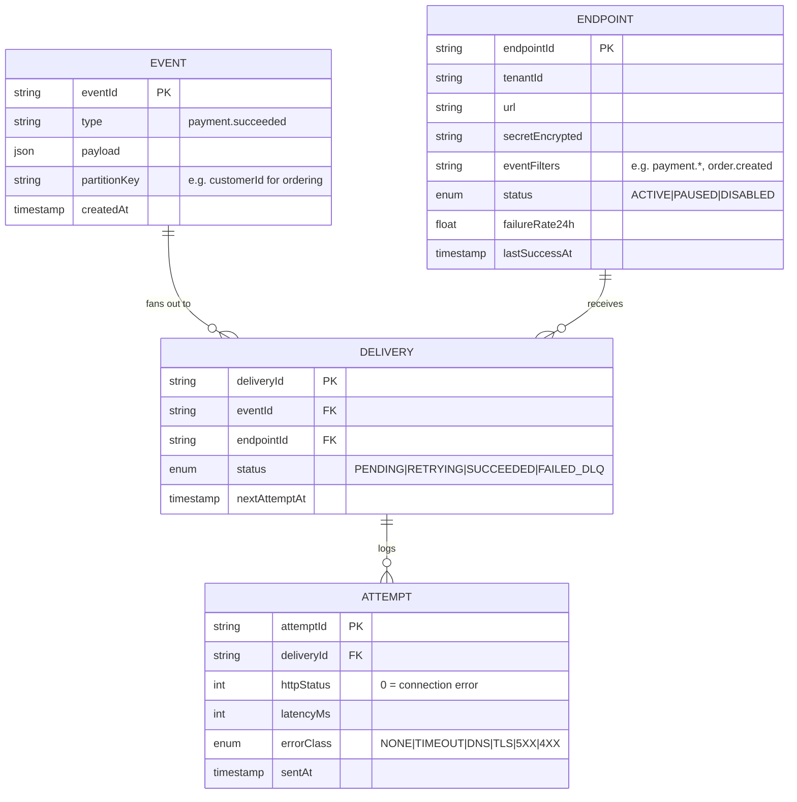
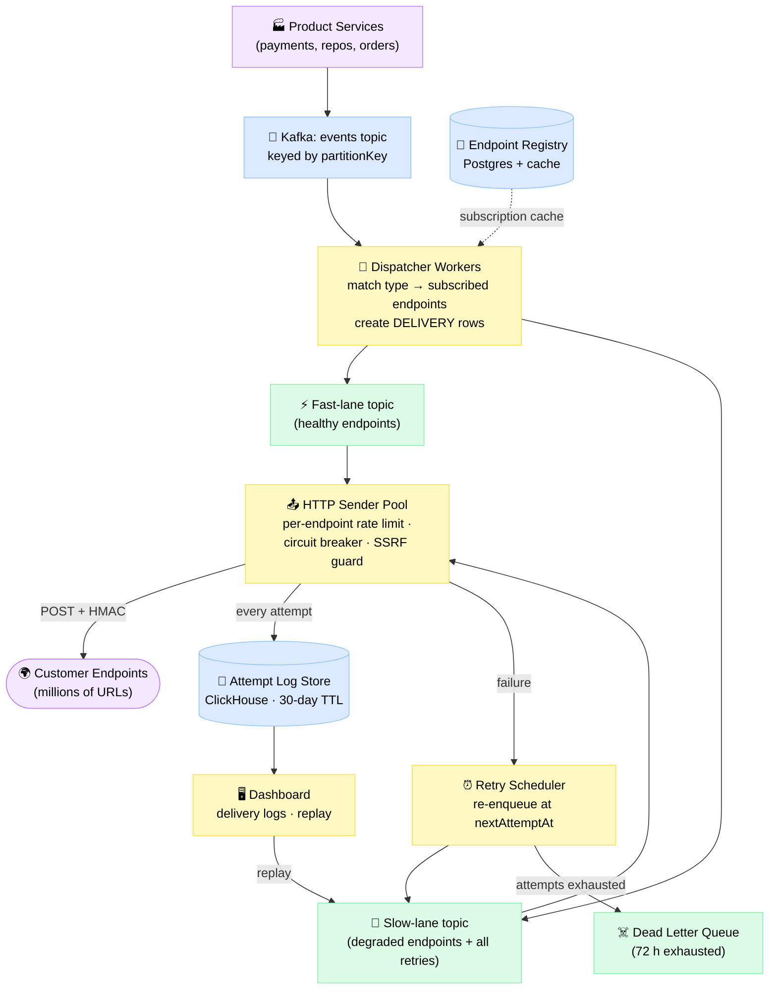
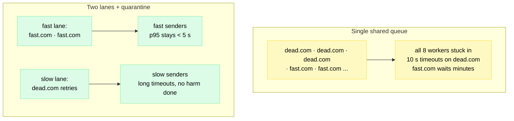
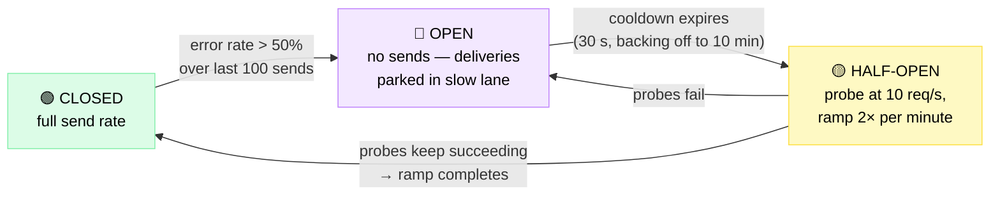

# Design a Webhook Delivery Service

> The outbound-events backbone behind Stripe, GitHub, and Shopify: reliably POSTing millions of "something happened" messages to customer servers that are slow, flaky, misconfigured, or outright hostile.

**Difficulty:** ⭐⭐⭐ · **Builds on:**
[Message Queues](../../Level-03-Communication/04-Message-Queues/README.md) ·
[Event-Driven Architecture](../../Level-05-Architecture-Patterns/02-Event-Driven-Architecture/README.md) ·
[Resilience Patterns](../../Level-05-Architecture-Patterns/06-Resilience-Patterns/README.md)

---

## 1. 🎯 Problem & Scope

Your platform generates events — `payment.succeeded`, `push`, `order.created` — and thousands of customers want to be told the moment they happen. Polling your API is wasteful, so you push: an HTTP POST to a URL the customer registered. Simple, until you remember that you **don't control the receiving end**. Customer endpoints time out, return 500s for weeks, go down for maintenance, or point at `http://169.254.169.254` hoping you'll leak your cloud credentials.

This is the mirror image of a [Notification Service](../04-Notification-Service/README.md): instead of delivering to devices you integrate with (APNs, FCM), you deliver to **arbitrary internet URLs** owned by strangers.

**In scope:** endpoint registration with event filters, at-least-once delivery with 72-hour retries, HMAC signatures, per-endpoint isolation (fast/slow lanes), delivery logs + replay UI, endpoint health tracking and auto-disabling, SSRF protection.

**Out of scope:** the products producing events, inbound webhooks (receiving), consumer-side frameworks, billing/quotas.

---

## 2. 📋 Requirements

### Functional
- Customers register endpoints: URL + signing secret (every request signed with **HMAC-SHA256**) + event-type filters (e.g., `payment.*`)
- **At-least-once** delivery of every matching event to every subscribed endpoint
- Retries with exponential backoff + jitter for up to **72 hours**, then dead-letter
- **Best-effort per-endpoint ordering** (no strict guarantee — see Deep Dive 7.4)
- Delivery log (30 days) with per-attempt detail; manual + bulk **replay**
- Endpoint health tracking; automatically disable endpoints that fail for days

### Non-Functional
- **100 000 events/s peak** ingest; delivery p95 **< 5 s** to healthy endpoints
- **Isolation:** one dead endpoint must never delay deliveries to others — even a top-10 customer being down for 3 days causes no cluster-wide impact
- Durability: once an event is accepted, it is never lost (even across crashes)
- Security: signed payloads, replay-attack resistance, SSRF-proof egress

---

## 3. 🧮 Capacity Estimation

**Throughput**
- Events: 100 k/s peak, ~25 k/s average (peak = 4× average)
- **Fan-out factor:** avg 2 subscribed endpoints per event → 50 k deliveries/s avg, **200 k/s peak**
- **Retry amplification:** ~95% succeed on attempt 1; failures average 5 more attempts → multiplier ≈ 1.25×. During a big-customer outage it spikes, so provision **1.5×** → **~300 k HTTP sends/s peak**
- Sender fleet: avg endpoint latency 300 ms, 2 000 concurrent connections per sender ≈ 6.6 k req/s each → **~45 sender instances** at peak

**Bandwidth & queueing**
- 2 KB avg payload × 300 k sends/s ≈ **600 MB/s (~5 Gbps)** egress at peak
- Kafka ingest: 200 k msgs/s × 2.2 KB ≈ 440 MB/s; ×3 replication ≈ 1.3 GB/s cluster writes; ~256 partitions keyed by `endpoint_id`

**Storage (30-day logs)**
- Event bodies: 25 k/s × 86 400 ≈ 2.2 B events/day × 2 KB ≈ 4.4 TB/day → **~130 TB/30 d** raw (~35 TB compressed in object storage; stored once per event, not per attempt)
- Attempt records: 50 k del/s × 1.25 ≈ 5.4 B attempts/day × 350 B ≈ 1.9 TB/day → **~57 TB/30 d** raw (~12 TB in a columnar store)

---

## 4. 🔌 API Design

**Management API (customer-facing):**

```
POST   /v1/endpoints                          # {url, event_types[], description}
→ {id, secret: "whsec_...", status: "ACTIVE"} # secret shown ONCE
PATCH  /v1/endpoints/{id}                     # change URL/filters; re-enable
POST   /v1/endpoints/{id}/rotate_secret      # old secret stays valid 24 h
GET    /v1/endpoints/{id}/deliveries?status=failed&since=...   # delivery log + health
POST   /v1/deliveries/{id}/replay             # re-send one delivery
POST   /v1/endpoints/{id}/recover?since=T     # bulk replay after an outage
```

**The delivery itself (what we send to the customer):**

```
POST /webhooks HTTP/1.1
Host: api.customer.com
Webhook-Id: evt_8f3kq29d                      # idempotency key — same on every retry
Webhook-Timestamp: 1782950400
Webhook-Signature: v1=5257a869e7ecebeda32...  # HMAC-SHA256(secret, ts + "." + body)

{"id":"evt_8f3kq29d","type":"payment.succeeded","created":1782950400,"data":{...}}
```

Rules of the road for receivers: respond **2xx within 10 s** (do real work async), verify the signature on the **raw** body, dedupe on `Webhook-Id`.

---

## 5. 🗄️ Data Model



One `EVENT` fans out into one `DELIVERY` per subscribed endpoint; each `DELIVERY` accumulates `ATTEMPT` rows until it succeeds or hits 72 h.

**Storage choices:**
- `ENDPOINT` → **Postgres** (low volume, transactional secret rotation), cached in dispatcher memory with pub/sub invalidation.
- `EVENT` → **Kafka** in transit + **object storage (S3)** for the 30-day replay archive. Payload stored **once per event**, referenced by deliveries — a 10 000-endpoint fan-out must not copy the body 10 000 times.
- `DELIVERY` / `ATTEMPT` → **ClickHouse** (or Cassandra), append-heavy, TTL 30 days, partitioned by `(endpointId, day)` — exactly the shape of the dashboard query "show me failed deliveries for my endpoint this week."

---

## 6. 🏗️ High-Level Architecture



The pipeline: durable ingest → fan-out → lane-based dispatch → signed HTTP send, with failures looping through the scheduler back into the slow lane.

**Walk-through (`payment.succeeded` for tenant T):**
1. Payments service publishes the event to Kafka. Ack from Kafka = event is durable; we now owe at-least-once delivery.
2. A dispatcher consumes it, looks up T's endpoints in the cached registry — 3 endpoints match the `payment.*` filter — and writes 3 `DELIVERY` rows (payload stored once, referenced 3×).
3. Each delivery is routed by endpoint health: healthy → **fast lane**, degraded/recovering → **slow lane**.
4. A sender leases the delivery, runs the SSRF check on the resolved IP, signs `timestamp.body` with the endpoint's secret, and POSTs with a 10 s timeout, respecting the per-endpoint rate limit (see [Rate Limiting](../../Level-03-Communication/07-Rate-Limiting/README.md)).
5. **2xx** → mark `SUCCEEDED`, log the attempt. **Anything else** (timeout, 5xx, 429) → log it, compute the next backoff, hand to the retry scheduler.
6. The scheduler (a specialized [distributed job scheduler](../21-Distributed-Job-Scheduler/README.md) — a Redis sorted set on `nextAttemptAt` works) re-enqueues into the slow lane when due.
7. After ~72 h of failures the delivery lands in the DLQ and the endpoint's health record takes the hit. The customer watches all of this in the dashboard and can replay any delivery — replays are new attempts with the **same `Webhook-Id`**.

### 6.1 Head-of-line blocking — why two lanes?

The classic failure: everything flows through one queue, one big endpoint dies, and every worker ends up parked in a 10-second timeout against the same dead host while fresh deliveries for healthy endpoints age behind them.



Three layers of defense, cheapest first:
- **Bounded per-endpoint concurrency** — max N in-flight requests per endpoint (say 32). Excess deliveries wait *for that endpoint only*, not in workers.
- **Two lanes** — first failure moves an endpoint's traffic to the slow lane; sustained success moves it back. Retries *always* ride the slow lane, so retry storms can't crowd out first attempts.
- **Per-endpoint queues** (the Svix approach) — perfect isolation, but millions of queues need careful management. The two-lane design gets ~95% of the benefit with two topics; add lanes (per-tenant, per-shard) only if noisy neighbors persist.

---

## 7. 🔬 Deep Dives

### 7.1 Retry policy: backoff, jitter, and giving up gracefully

Exponential backoff, base 30 s, ×4 growth, capped at 16 h, hard stop at 72 h:

| Attempt | Delay before it | Elapsed (approx) |
|---|---|---|
| 1 | — (on event) | 0 |
| 2 | 30 s | 30 s |
| 3 | 2 min | 2.5 min |
| 4 | 8 min | 11 min |
| 5 | 32 min | 43 min |
| 6 | 2 h | 2.8 h |
| 7 | 8 h | 11 h |
| 8–10 | 16 h each | 27 h / 43 h / 59 h |
| 11 | ~13 h | **72 h → DLQ** |

The early retries catch deploys and blips (most outages are minutes); the 16 h tail catches "we'll fix it Monday" without wasting requests.

- **Jitter is mandatory.** When a popular endpoint dies, 50 000 deliveries fail in the same second — without jitter they all retry in the same second, forever, as a synchronized wave. Use equal jitter: `sleep = delay/2 + random(0, delay/2)`.
- **Retry on:** timeouts, connection errors, 429 (honoring `Retry-After`, capped), 5xx. **Don't retry on:** most 4xx (`404` won't heal — though Stripe retries these anyway for simplicity).
- **Auto-disabling:** health tracker keeps consecutive-failure count + 24 h EWMA failure rate per endpoint. 100% failures for 24 h → `PAUSED` + email ("we're still queueing"). Sustained failure past the retry window (~3–7 days) → `DISABLED`: stop creating deliveries, final email, require manual re-enable (with optional bulk replay). Shopify is stricter: 19 consecutive failures over ~48 h and the subscription is deleted.

### 7.2 Security: signatures, replay windows, and SSRF

**Signing.** Every request carries `Webhook-Timestamp: ts` and `Webhook-Signature: v1=HMAC_SHA256(secret, ts + "." + rawBody)` (the headers in §4). The receiver recomputes the HMAC from the raw bytes and its copy of the secret, compares in constant time, and rejects requests where `|now − ts| > 5 min`. The timestamp inside the signed string defeats replay: a captured request can't be re-sent days later, and without the secret nobody can forge a fresh one. A plain HTTPS URL proves nothing about who's calling; the HMAC does.

- **Verify the RAW body.** If the receiver parses JSON and re-serializes before verifying, key order and whitespace change the bytes and the HMAC fails — the #1 webhook-integration bug. Verify first, parse second — and constant-time compare, or you've built a timing oracle.
- **Rotation:** during 24 h rotation, send multiple signatures (`v1=new,v1=old`); receiver accepts any match.
- **mTLS** as an option for banks/enterprises — cryptographic *transport* identity on top of the HMAC *message* identity. Also publish **static egress IPs** so customers can firewall-allowlist you (Stripe and GitHub both do).

**SSRF — the sleeper vulnerability.** You run a service that makes HTTP requests to *user-supplied URLs from inside your network*. Without controls, a customer registers `http://169.254.169.254/latest/meta-data/` (cloud metadata = credentials) or `http://10.0.3.7:8500` (your internal Consul) and reads the response from their delivery log:
- Resolve DNS, then reject private/internal ranges: `10/8`, `172.16/12`, `192.168/16`, `127/8`, `169.254/16`, `::1`, `fd00::/8`.
- **Pin the resolved IP** for the actual connection — re-resolving lets attackers pass the check with a public IP, then flip the DNS record to an internal one (DNS rebinding).
- Re-validate on redirects (or don't follow them). Run senders in an **egress-isolated network** that physically can't reach internal services — Stripe open-sourced Smokescreen, an egress proxy doing exactly this. Defense in depth: validate *and* isolate.

### 7.3 Idempotency: duplicates are a feature (of at-least-once)

At-least-once delivery *means* duplicates. Two unavoidable causes: (1) the endpoint processed the request but the 200 got lost in a timeout — we must retry; (2) a sender crashed after POSTing but before acking its queue lease — the delivery gets re-leased.

The contract: every attempt for a given delivery carries the **same `Webhook-Id`**; consumers dedupe on it (a processed-IDs table with a ~7-day TTL, or idempotent handlers — `UPSERT`, not `INSERT`). Exactly-once *processing* is achievable at the consumer even though exactly-once *delivery* is not — the full argument is in [Idempotency & Exactly-Once](../../Level-04-Distributed-Systems/07-Idempotency-and-Exactly-Once/README.md).

### 7.4 Ordering: why "best-effort" is the honest answer

Strict per-endpoint ordering means **one in-flight request per endpoint** and **stop on failure** (can't deliver #2 while #1 retries). Your throughput per endpoint becomes 1/latency (~3 req/s at 300 ms), and one failed delivery stalls the endpoint's entire stream for up to 72 h — strict ordering re-creates head-of-line blocking *by design*. That's why Stripe's docs say outright that order is not guaranteed.

What we do instead:
- **Partition by `partitionKey`** (e.g., customer ID) in Kafka → events for the same entity flow through one partition → *approximately* ordered in the common case.
- **Sequence hints in the payload** (`created` timestamp, per-object version) so consumers detect staleness and reorder or drop.
- **Thin payloads:** send `{"type":"order.updated","id":"ord_42"}` and let the consumer fetch current state from your API. Out-of-order thin events converge on the truth anyway — this is how many teams sidestep ordering entirely.

### 7.5 Thundering herd on recovery: the circuit breaker

A big endpoint dies for 6 hours; 5 million deliveries pile up. It comes back — and if you blast the full backlog, you knock it straight over again ([Resilience Patterns](../../Level-05-Architecture-Patterns/06-Resilience-Patterns/README.md) territory).



Per-endpoint circuit breaker: trip on sustained errors, probe gently, and only ramp back to full rate as the endpoint proves healthy.

Key choices: while OPEN, deliveries **park without burning attempts** (don't drain the 72 h budget against a known-dead host). In HALF-OPEN, drain the backlog via a token bucket starting tiny and doubling each clean minute — 5 M deliveries clear in hours without a second outage. And drain **oldest-first** for closer-to-ordered delivery, unless the tenant opts into newest-first freshness.

---

## 8. 📈 Scaling, Bottlenecks & Failure Modes

| Bottleneck / failure | Symptom | Mitigation |
|---|---|---|
| Mega fan-out (1 event → 50 k endpoints) | One dispatcher grinds; delivery-row write burst | Split fan-out into chunks of ~1 000 across workers; store payload once, reference everywhere |
| Hot endpoint key skews Kafka partition | One partition lags; unrelated endpoints on it suffer | More partitions + bounded per-endpoint concurrency; overflow hot endpoints to a dedicated lane |
| Slow endpoints exhaust sender sockets | Fleet-wide connect queuing at healthy concurrency | Strict timeouts; per-endpoint concurrency caps; async I/O senders (epoll, not thread-per-request) |
| Retry storm after regional outage | Sends spike 3–5× when thousands of endpoints recover at once | Jitter everywhere + per-endpoint breakers + slow-lane isolation; retries can never starve first attempts |
| Attempt-log write volume | 5 B+ rows/day overwhelm OLTP stores | Columnar store (ClickHouse), batched async inserts, 30-day TTL partitions dropped wholesale |
| Scheduler hot spot | Millions of timers due the same second (the 16 h cap aligns them) | Shard the scheduler's sorted set by `deliveryId`; jitter already smears due-times |
| Dispatcher crash mid-fan-out | Some deliveries created, some not | Idempotent delivery creation keyed on `(eventId, endpointId)`; Kafka offset commit only after all rows exist — duplicates impossible, gaps impossible |

---

## 9. ⚖️ Trade-offs & Alternatives

| Decision | Chosen | Alternative | Why chosen |
|---|---|---|---|
| Transport backbone | Kafka topics + lanes | SQS queue per endpoint | Millions of queues are painful to manage; Kafka gives replay + ordering per partition; lanes solve isolation |
| Isolation model | Two lanes + per-endpoint caps | Full per-endpoint queues (Svix-style) | 95% of the isolation for ~1% of the operational surface; revisit if noisy neighbors persist |
| Delivery semantics | At-least-once + consumer dedupe | Exactly-once delivery | Exactly-once to an arbitrary URL is impossible (ack loss); duplicates + idempotency keys are honest |
| Ordering | Best-effort per key | Strict per-endpoint FIFO | Strict = 1 in-flight + stop-on-failure = self-inflicted head-of-line blocking |
| Authentication | HMAC-SHA256 + timestamp | mTLS only / OAuth per call | HMAC is one function call for receivers; mTLS offered as an upgrade, not the default |
| Payload style | Fat payload (full object) | Thin "poke" + API fetch | Fat is one hop and works offline from our API; thin wins when staleness/ordering bite — offer both |
| Retry horizon | 72 h + auto-disable | Forever / no retries (GitHub) | 72 h covers a long weekend outage; retrying forever wastes capacity on dead endpoints |

---

## 10. 🌐 How It's Actually Done

**Stripe** — the reference implementation. `Stripe-Signature: t=...,v1=...` is HMAC-SHA256 over `timestamp.payload`; docs hammer on verifying the raw body and using constant-time comparison. Retries with exponential backoff for up to **72 hours** in live mode, notifies then disables endpoints after prolonged failure, publishes static webhook egress IPs, and built the **Smokescreen** egress proxy for SSRF defense. Dashboard shows every attempt with response codes and manual resend.

**GitHub** — signs with `X-Hub-Signature-256`, enforces a **10-second timeout**, and (surprisingly) does **not auto-retry** failed deliveries: the deliveries API + UI let you inspect and *redeliver* manually. A reminder that "at-least-once for 72 h" is a product choice, not a law.

**Shopify** — retries **19 times over ~48 hours**, then deletes the subscription after continued failures. Their engineering blog describes rearchitecting webhooks onto a Kafka-backed pipeline for exactly the reasons in this chapter: isolation and retry storms. Official guidance: return 200 fast, process async, expect duplicates.

**Svix** — webhooks-as-a-service (you publish events; they handle delivery, retries, logs, portal). Co-authors of the **Standard Webhooks** spec — the `webhook-id` / `webhook-timestamp` / `webhook-signature` headers used in this design. Uses per-endpoint queueing (Redis) for hard isolation.

**AWS-native designs** — a common pattern: EventBridge/SNS fan-out into SQS, with **visibility timeout as the retry timer** and redrive-to-DLQ after N receives; EventBridge **API Destinations** even does managed signed HTTP delivery with built-in rate limiting. Great for one product's webhooks; platform-scale multi-tenant isolation usually outgrows it.

---

## 11. 📝 Summary

| Aspect | Decision |
|---|---|
| Delivery guarantee | At-least-once; same `Webhook-Id` on every retry; consumers dedupe |
| Backbone | Kafka (durable ingest, keyed partitions) → dispatchers → fast/slow lanes → async HTTP senders |
| Isolation | Per-endpoint concurrency caps + two lanes + per-endpoint circuit breakers |
| Retries | Exponential backoff (30 s → 16 h cap) with equal jitter, ~11 attempts over 72 h, then DLQ |
| Endpoint health | EWMA failure rate; PAUSED at 24 h of failures, DISABLED after sustained failure + email trail |
| Security | HMAC-SHA256 over `timestamp.body`, ±5 min replay window, secret rotation, SSRF guard with IP pinning + egress isolation |
| Ordering | Best-effort via partition keys + sequence hints; strict ordering rejected as self-inflicted head-of-line blocking |
| Observability | Every attempt logged to ClickHouse (30 d), customer-facing log + replay UI |

The 30-second whiteboard pitch: sending an HTTP POST is trivial — the product is everything around it. Treat every customer endpoint as an independently failing system: quarantine the sick ones (lanes + breakers) so they can't hurt the healthy ones, retry with jitter and a deadline, sign everything, trust no URL (SSRF), and give customers the logs and replay button so *they* can debug their side. At-least-once plus idempotency keys beats chasing exactly-once — the network already made that decision for you.
