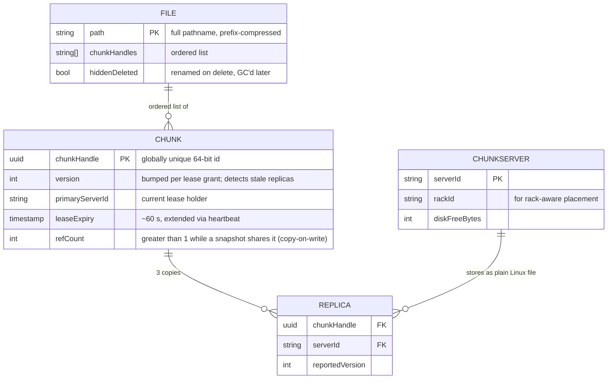
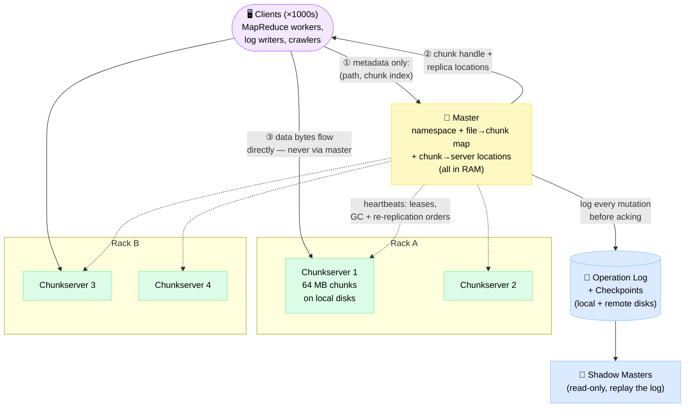
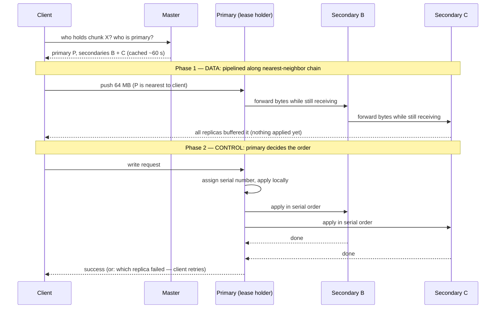
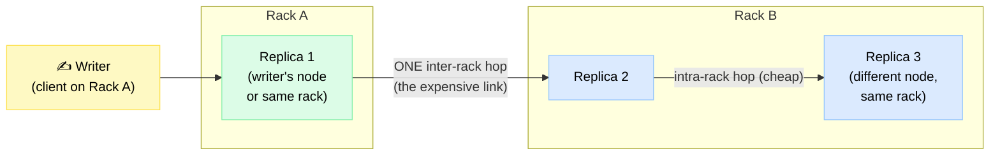

# Design a Distributed File System (GFS / HDFS)

> The storage layer the big-data era was built on: petabytes of huge, append-mostly files spread across thousands of commodity machines that fail daily — powered by one deliberately simple idea: a single master for metadata, while clients stream data straight to the disks.

**Difficulty:** ⭐⭐⭐⭐⭐ · **Builds on:**
[Object Storage](../../Level-02-Data-Layer/09-Object-Storage/README.md) ·
[Database Replication](../../Level-02-Data-Layer/01-Database-Replication/README.md) ·
[Leader Election](../../Level-04-Distributed-Systems/05-Leader-Election/README.md)

---

## 1. 🎯 Problem & Scope

It's 2003 at Google. Crawlers dump terabytes of web pages per day, and [batch jobs](../../Level-07-Big-Data-and-Specialized/01-Batch-Processing/README.md) read them back in giant sequential scans. Traditional filesystems assume disks that mostly work and files measured in kilobytes. Neither is true here: files are 100 MB to many GB, and with thousands of cheap machines, *something is always broken*.

We're designing a **GFS/HDFS-style distributed file system**: a cluster filesystem optimized for huge files, streaming reads, concurrent appends, and constant component failure — the substrate under MapReduce, Hadoop, and every modern data warehouse.

**In scope:** chunking & placement, the single-master architecture, read/write/append paths, the replication pipeline, master fault tolerance, the consistency model, failure recovery, garbage collection, erasure coding.

**Out of scope:** full POSIX semantics and byte-range locking, low-latency serving of billions of small objects (that's [Object Storage](../../Level-02-Data-Layer/09-Object-Storage/README.md)'s job), user-facing sync clients (see [Google Drive / Dropbox](../14-Google-Drive-Dropbox/README.md)), cross-datacenter geo-replication, encryption and quotas.

---

## 2. 📋 Requirements

### Functional
- Hierarchical namespace: `create`, `delete`, `open`, `read`, `write`, plus cheap copy-on-write **snapshot**
- Files are **huge**: 100 MB to multi-GB is the norm, multi-TB must work; billions of tiny files is a non-goal
- **Record append**: hundreds of producers concurrently append records to one file (log collection, crawl output) with per-record atomicity
- Large **sequential** reads dominate (megabytes at a time); small random reads work but aren't optimized
- Random overwrites supported but rare — the workload is write-once / append-forever, read-many

### Non-Functional
- **10 PB** of logical data; thousands of concurrent readers and writers
- **Throughput over latency**: tens of GB/s aggregate matters; an extra 50 ms on one read does not
- **Failure is the norm, not the exception**: at 1,000 commodity nodes expect ~3 machine deaths per day, plus constant disk, memory, and network faults — recovery must be automatic, not a pager duty
- No data loss from any single machine, disk, or rack failure
- A **relaxed but well-defined** consistency model is acceptable — clients are cooperating in-house applications, not arbitrary POSIX programs

---

## 3. 🧮 Capacity Estimation

**Cluster shape**
- 10 PB logical × 3 replicas = **30 PB raw**
- 1,000 chunkservers × 36 TB each (12 × 3 TB SATA disks) = 36 PB raw → ~83% full, acceptable

**Chunk count → master RAM (the famous ceiling)**
- 10 PB ÷ 64 MB = **~160 M logical chunks** (480 M replicas cluster-wide ≈ 480 K per server)
- Master metadata ≈ **64 B per chunk** in RAM (handle, version, lease, 3 locations) → 160 M × 64 B ≈ **10 GB**
- Namespace: ~10 M files × <64 B per prefix-compressed pathname ≈ 0.6 GB
- Total ≈ **11 GB** — fits one big-memory box comfortably. Now rerun the math with 1 **billion** 1 MB files: 1 B chunks → 64 GB+ for chunk metadata alone, and metadata **QPS** saturates a single machine long before RAM does. The single master is the scaling ceiling — exactly why HDFS Federation and Colossus shard metadata (§7.3).

**Throughput**
- 2,000 MapReduce workers × 30 MB/s sequential read = **60 GB/s aggregate** — no single server could carry this, so clients must stream from chunkservers directly
- The master sees only metadata: one lookup per 64 MB read ≈ **1–2 K RPCs/s**. That asymmetry — 60 GB/s of data vs. a trickle of metadata — is the entire design.

**Re-replication after a node death**
- One dead chunkserver = 30 TB of chunks suddenly at 2 replicas
- Recovery is **cluster-wide**: 999 survivors each copy a few chunks. Throttled to 40 MB/s per server (protect foreground traffic) → ~40 GB/s aggregate → 30 TB ÷ 40 GB/s ≈ **13 minutes** back to 3×
- Naive alternative — rebuild onto one hot spare at 100 MB/s — takes **~3.5 days** of double-failure exposure. Random placement doesn't just spread data; it spreads *recovery work*.

---

## 4. 🔌 API Design

```
# Client-facing file API (a library, not a kernel filesystem)
create(path)                         → handle          # new empty file
open(path, mode)                     → handle          # READ | WRITE | APPEND
read(handle, offset, length)         → bytes           # large sequential reads dominate
write(handle, offset, data)          → ok              # supported, rare, weak guarantees
record_append(handle, data)          → offset_written  # THE workhorse: atomic, at-least-once — the SYSTEM picks the offset
delete(path)                         → ok              # rename to hidden name; real GC is lazy
snapshot(src_path, dst_path)         → ok              # O(metadata) copy-on-write clone

# Client ↔ Master (control plane — tiny requests, aggressively cached;
#   the master also allocates new chunks + picks their 3 placement targets)
GetChunkLocations(path, chunk_index) → chunk_handle, version, [replica addrs], primary

# Master ↔ Chunkserver (piggybacked on heartbeats, every few seconds)
Heartbeat(server_id, chunk_report, disk_free)
                                     → lease grants/revokes, delete orders, re-replicate / rebalance commands

# Client ↔ Chunkserver (data plane — the heavy bytes)
PushData(data_id, bytes)             → ack             # daisy-chained to the next replica
Write(chunk_handle, data_id)         → ok              # sent to primary; primary orders it
Read(chunk_handle, byte_range)       → bytes + checksum
```

The client library computes `chunk_index = floor(offset / 64 MB)` itself, asks the master once, then caches chunk locations — so a multi-GB sequential scan touches the master a handful of times, and the chunkservers thousands of times.

---

## 5. 🗄️ Data Model

The master's entire world, held in RAM. One caption-worthy quirk: replica *locations* are never persisted — the chunkservers are the source of truth for what they hold.



**Storage choices, justified:**
- **Everything in the master's RAM** — metadata ops must be fast and support global scans (GC, re-replication, rebalancing). Durability comes from the **operation log + checkpoints** (§7.3), not from keeping state on disk.
- **`FILE → CHUNK` mapping and namespace are logged**; **`REPLICA` rows are not** — they're rebuilt from chunkserver heartbeats at startup. Trying to keep the master's view of 1,000 failing servers transactionally consistent on disk is a losing game; asking the servers is always correct.
- **Chunks on chunkservers are ordinary Linux files** with lazy allocation — a 1 MB file consumes 1 MB of disk, not 64 MB.

---

## 6. 🏗️ High-Level Architecture

The classic shape: one brain (metadata only), a thousand pairs of hands (data only), and clients smart enough to keep them separate.



**Walk-through (client reads 1 GB starting at byte 3,000,000,000):**
1. Client computes `chunk_index = 3,000,000,000 ÷ 64 MB = 44` and sends `(path, 44)` to the master — often batching requests for chunks 44–60 in one RPC.
2. Master answers from RAM: chunk handle, version, and the three replica locations. Client caches this with a TTL.
3. Client picks the **nearest** replica (same rack if possible, by IP distance) and streams 64 MB over one persistent TCP connection; the chunkserver verifies each 64 KB block against its checksum as it reads — corruption is caught here, never silently returned.
4. Next chunks come from the cache — the master isn't contacted again until the cache expires or a chunkserver stops answering.

---

## 7. 🔬 Deep Dives

### 7.1 The Write Path — Data Flows in a Chain, Control Flows to the Primary

Two separate flows, and the separation is the trick. **Data** is pushed along a daisy-chain of replicas; **control** (the commit) goes to the **primary** — the one replica holding a 60-second lease from the master, which assigns a serial number to every mutation so all replicas apply them in the same order.

Why a chain instead of the client fanning out to all 3 replicas? A star wastes the client's uplink 3× (each byte leaves the client three times). A chain uses **every machine's full duplex NIC exactly once**: each server forwards bytes downstream *while still receiving* — pushing 64 MB over 10 GbE takes ~50 ms regardless of replica count.



The lease is a cheap, safe form of [leader election](../../Level-04-Distributed-Systems/05-Leader-Election/README.md) per chunk: if the master loses contact with the primary, it simply **waits out the 60 s lease** before granting a new one — two primaries can never coexist, no consensus round needed on the data path.

### 7.2 Why 64 MB Chunks? (And the Small-File Problem)

A normal filesystem block is 4 KB. GFS chose **64 MB** — a 16,000× difference — because:
- **Metadata stays tiny**: 64 B per 64 MB is a 1:1,000,000 ratio; that's the only reason 10 PB fits in one master's RAM (§3).
- **One master RPC covers 64 MB of I/O**; clients cache locations for entire multi-GB working sets.
- **One persistent TCP connection** per chunk amortizes setup cost over huge sequential reads.

The costs:
- **Small files become hot spots.** A 1 MB file is one chunk on 3 servers; when 1,000 workers launch and all read the same job binary, those 3 servers melt. Fixes: bump the replication factor for hot small files, stagger job starts, or let clients fetch from each other (P2P).
- **A small-file *metadata* problem** you can't fix with chunk size: a billion tiny files kills the master regardless. That workload belongs in [Object Storage](../../Level-02-Data-Layer/09-Object-Storage/README.md) — or a sharded-metadata descendant (§7.3).

### 7.3 Master Fault Tolerance — and Escaping the Single Master

The master is a single point of failure holding everything in RAM. The defense, in layers:
1. **Operation log**: every namespace mutation is appended to a log flushed to local disk **and replicated to remote machines** before the client sees an ack — same pattern as a database WAL ([Database Replication](../../Level-02-Data-Layer/01-Database-Replication/README.md)). Writes are group-committed by batching.
2. **Checkpoints**: the log would take hours to replay, so the master periodically dumps its RAM state as a compact checkpoint — built in a background thread, no pause. Recovery = load last checkpoint + replay the log tail = **seconds to a minute**.
3. **Shadow masters** replay the log continuously and serve **read-only** metadata (lagging ~1 s) while the primary is down — a warm-standby pattern straight out of [High Availability & DR](../../Level-06-Scale-and-Reliability/03-High-Availability-and-DR/README.md).
4. **Who promotes a new master?** An external monitor using Chubby, Google's Paxos-backed lock service — the one place true [consensus](../../Level-04-Distributed-Systems/03-Consensus-Paxos-Raft/README.md) enters this design.

That handles *failure* — not *scale*. The single master's RAM and QPS ceiling led to generation two:
- **HDFS Federation**: several independent NameNodes, each owning a namespace slice (`/logs`, `/warehouse`); DataNodes serve blocks for all of them.
- **HDFS HA**: an active/standby NameNode pair sharing an edit log through a quorum of JournalNodes.
- **Google Colossus**: the elegant recursion — file metadata lives in **BigTable**, served by horizontally scalable **Curators**, while D-servers hold the data. BigTable itself runs *on* Colossus; the loop bottoms out in a small bootstrap layer. Result: metadata scales out, and "files" can now be small — Colossus backs everything from Gmail to YouTube.

### 7.4 Rack-Aware Replica Placement

Three replicas on three random servers could land in one rack — then a single switch failure or PDU trip loses all copies. But maximal spreading (3 racks) makes every write cross the oversubscribed inter-rack core twice. The classic compromise, still HDFS's default:



**The 2-in-rack + 1-remote trade-off:** the write pipeline crosses racks exactly **once** (vs. twice for 3 racks), yet *any* single rack failure still leaves at least one live replica. You give up a little read spreading and the ability to survive two simultaneous rack losses — a good trade, since whole-rack failures are far rarer than node failures. Reads go to the nearest replica, so most read traffic never leaves the rack at all.

### 7.5 Heartbeats, Re-replication Priority & Lazy Garbage Collection

- **Heartbeats** (every few seconds) carry the chunkserver's inventory and disk stats up, and lease grants, delete orders, and copy commands down. Miss enough heartbeats → the server is declared dead → every chunk it held is now under-replicated.
- **Re-replication is a priority queue**, not a stampede: chunks with only **1 live replica** go before those with 2; chunks of live files before recently-deleted ones; any chunk currently **blocking a client** jumps the line. Cluster-wide cloning is throttled per server so recovery never starves foreground reads.
- **Deletion is just a rename** to a hidden, timestamped name. After a ~3-day grace period the master erases the metadata; the chunks are now orphans. Chunkservers discover this lazily — each heartbeat reply flags chunks the master no longer knows — and delete them at leisure.

Why lazy? One uniform cleanup path also mops up half-created chunks from failed writes; accidental deletes are undoable for 3 days; and deletion cost folds into background scans. The cost: disk space returns slowly — annoying when storage is tight, so GFS added a per-directory "reclaim now" override.

### 7.6 The Relaxed Consistency Model (Defined vs. Consistent)

GFS's most interview-worthy idea: it *names* its weakness precisely instead of pretending to be POSIX.
- A file region is **consistent** if all clients see the same bytes on every replica.
- It is **defined** if it's consistent **and** contains exactly what one mutation wrote, un-interleaved.

| Mutation | Outcome |
|---|---|
| Serial `write`, success | **Defined** ✅ |
| Concurrent `write`s, success | Consistent but **undefined** — fragments of different writers mingled |
| `record_append`, success | **Defined**, interspersed with inconsistent padding/duplicate regions |
| Any failure | **Inconsistent** (replicas may differ) until retried |

`record_append` is **atomic, at-least-once**: the system guarantees your record lands as one contiguous blob at *some* offset — but a failed attempt (one replica missed it) forces a retry at a *new* offset, leaving a duplicate on the replicas that succeeded and padding on the ones that didn't.

Why don't applications break? Because they're written for this contract: records carry **checksums** (readers skip padding and torn fragments) and **unique IDs** (readers de-duplicate), and most consumers are idempotent [batch jobs](../../Level-07-Big-Data-and-Specialized/01-Batch-Processing/README.md) that re-run on failure anyway. GFS moved complexity out of the filesystem and into (Google-controlled) client libraries. HDFS chose an even simpler contract: single-writer files, append-only, no concurrent record append at all.

### 7.7 Erasure Coding vs. 3× Replication

Three full copies is simple and fast to repair — and burns 3 bytes of disk per byte stored. **Reed–Solomon (6, 3)** stripes a chunk into 6 data + 3 parity blocks on 9 servers; *any* 6 of the 9 reconstruct the data.

| Scheme | Storage overhead | Tolerates | Repairing one lost block costs | Best for |
|---|---|---|---|---|
| 3× replication | 3.0× | 2 losses | Copy 1 block from any replica | Hot data, small files, fast repair |
| RS(6,3) | **1.5×** | **3 losses** | Read **6 blocks** over the network + decode (≈6× I/O amplification) | Warm/cold, large, sealed data |

The catch is the repair (and degraded-read) cost: losing one EC block means reading six others — repair storms after a rack failure are 6× heavier, and CPU decodes on the read path. So real systems **tier**: hot, newly-written data lives at 3× (or more); once sealed and cooling, it's re-encoded to EC in the background. At 10 PB, moving from 3.0× to 1.5× frees **15 PB of raw disk** — this is why HDFS 3.0 shipped EC (the `RS-6-3-1024k` policy), and why Colossus and Meta's Tectonic erasure-code the overwhelming majority of their bytes.

---

## 8. 📈 Scaling, Bottlenecks & Failure Modes

| What breaks first | Symptom | Mitigation |
|---|---|---|
| Master RAM | Metadata for new chunks won't fit; file creates fail | Bigger box buys time → shard metadata (Federation / Colossus Curators) |
| Master QPS | Metadata ops queue up under small-file or `ls`-heavy workloads | Client caching, batched lookups, namespace sharding |
| Hot small file | 3 chunkservers saturate when 1,000 workers grab one binary | Raise replication factor for hot files; stagger starts; P2P fetch |
| Inter-rack core bandwidth | Write pipelines crawl at peak hours | 2+1 rack placement (one inter-rack hop); modern Clos fabrics |
| Recovery storm | Rack failure triggers cluster-wide cloning that starves reads | Per-server recovery throttles + strict priority (1-replica chunks first) |
| Stale replicas | A server missed mutations while partitioned, then serves old data | **Chunk version numbers** bumped at each lease grant; stale replicas detected via heartbeat and GC'd |
| Silent disk corruption | Reads return garbage that replication then *propagates* | 32-bit checksum per 64 KB block, verified on every read + idle-time scrubbing; bad block → re-replicate from a good copy |

**Failure drill-down:**
- **Master crashes** → a monitor restarts it (checkpoint + log-tail replay, seconds); if the whole machine dies, a standby is promoted from the remotely-replicated operation log (arbitrated via Chubby) while shadow masters serve stale reads during the gap.
- **Chunkserver dies** → the 13-minute cluster-wide re-replication from §3.
- **Whole rack dies** → 2+1 placement guarantees a surviving replica; those chunks re-replicate at top priority.
- **Client dies mid-append** → possibly padding/torn records — exactly what the §7.6 contract (checksums + record IDs) exists to absorb.

---

## 9. ⚖️ Trade-offs & Alternatives

| Decision | Chosen | Alternative | Why chosen |
|---|---|---|---|
| Metadata | **Single master**, all in RAM | Distributed metadata from day one (e.g., Ceph's MDS cluster) | A single brain with a global view makes placement, GC, and recovery *simple*; the ceiling was accepted, then engineered away later (Colossus) |
| Chunk size | **64 MB** | 4 KB–1 MB blocks | 1:1,000,000 metadata ratio; fewer master RPCs; costs small-file hot spots |
| Data push | **Daisy-chain pipeline** | Client fans out to all replicas (star) | Chain uses each NIC's full bandwidth once; star triples client egress |
| Mutation ordering | **Primary with 60 s lease** | Master orders every write, or Paxos per chunk | Keeps the master off the data path; per-chunk [consensus](../../Level-04-Distributed-Systems/03-Consensus-Paxos-Raft/README.md) would add latency and complexity for no workload benefit |
| Consistency | **Relaxed, at-least-once append** | POSIX / exactly-once | Enables hundreds of concurrent appenders at full throughput; in-house apps can de-dupe |
| Durability | **3× replication**, EC added later for cold data | Erasure coding everywhere | Replication repairs fast and reads cheap; EC's 1.5× overhead wins once data is sealed and cool |
| Deletion | **Lazy GC** via hidden rename | Eager synchronous delete | One uniform cleanup path, free undo window; costs slow space reclaim |

---

## 10. 🌐 How It's Actually Done

**The GFS paper (SOSP 2003)** — Ghemawat, Gobioff & Leung — is the origin of nearly everything above and one of the most-cited systems papers ever. Its stated design assumption, "component failures are the norm rather than the exception," became the industry's default mindset.

**HDFS** is the open-source re-implementation (via Yahoo!, 2006) that carried this design to the rest of the world. The terminology maps almost 1:1:

| GFS (2003) | HDFS | Notes |
|---|---|---|
| Master | NameNode | Same all-in-RAM metadata design |
| Chunkserver | DataNode | |
| 64 MB chunk | 128 MB block | Default doubled as disks and jobs grew |
| Operation log | EditLog | |
| Checkpoint | FSImage | Built by the Standby/Checkpoint node |
| Shadow master | Standby NameNode + JournalNode quorum | HDFS HA (Hadoop 2) |
| Record append (concurrent) | `append()` — single writer only | HDFS simplified the consistency contract |
| Lazy GC via hidden rename | `.Trash` directory | |

**Google Colossus** quietly replaced GFS around 2010: Curators store metadata in BigTable (sharded, horizontally scalable), D-servers hold data, and client-driven Reed–Solomon encoding replaced most 3× replication. The single-master ceiling and the 64 MB minimum both disappeared — which is what lets Colossus back small-file products like Gmail.

**Meta's Tectonic (FAST '21)** consolidated Haystack (photos), f4 (warm blobs), and HDFS-style warehouses into single exabyte-scale multitenant clusters: metadata is disaggregated into stateless Name/File/Block layers over a sharded key-value store (ZippyDB), with RS-encoding for large data.

**Azure Storage (SOSP 2011)** uses the same shape in its **stream layer**: append-only "extents" (≈ chunks) are replicated 3× while open, then **sealed** and lazily erasure-coded — the tiering strategy from §7.7 in production at exabyte scale.

---

## 11. 📝 Summary

| Aspect | Decision |
|---|---|
| Workload | Huge files (100 MB–multi-GB), sequential reads, concurrent appends |
| Chunking | 64 MB chunks, lazily allocated, stored as plain Linux files |
| Metadata | Single master, all in RAM; operation log + checkpoints; shadow read-only replicas |
| Data path | Client ↔ chunkserver direct; the master never touches file bytes |
| Writes | Data via daisy-chain pipeline; primary (60 s lease) assigns mutation order |
| Consistency | Relaxed: defined vs. undefined regions; `record_append` at-least-once + app-level de-dupe |
| Durability | 3 replicas, rack-aware 2+1 placement, chunk versions, per-64 KB checksums; EC (RS 6+3) for cold data |
| Recovery | Heartbeats → prioritized, throttled, cluster-wide re-replication in minutes |

The 30-second whiteboard recap: **separate the control plane from the data plane**. One master holds all metadata in RAM (durable via a replicated log) and hands out chunk locations and leases; thousands of chunkservers move the actual bytes; clients talk to the master rarely and the disks constantly. Accept a single master for simplicity, accept relaxed consistency for throughput, and make failure recovery an automatic background process — then, when you finally outgrow the one brain, shard the metadata (Colossus, Federation, Tectonic) while keeping the same shape. Twenty years on, nearly every large-scale storage system is still recognizably this diagram.
