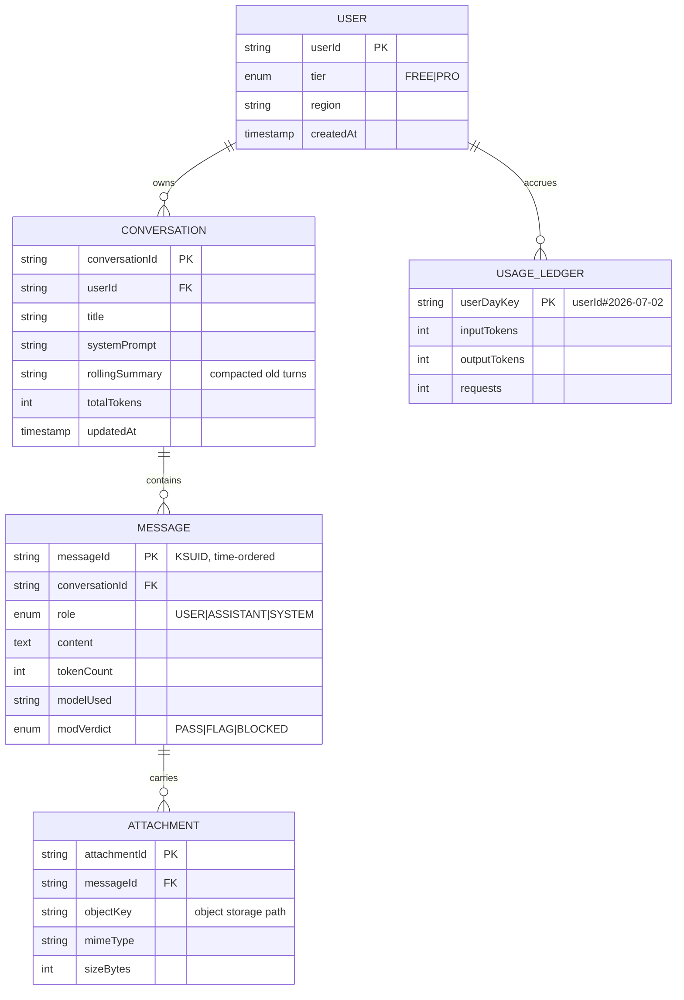
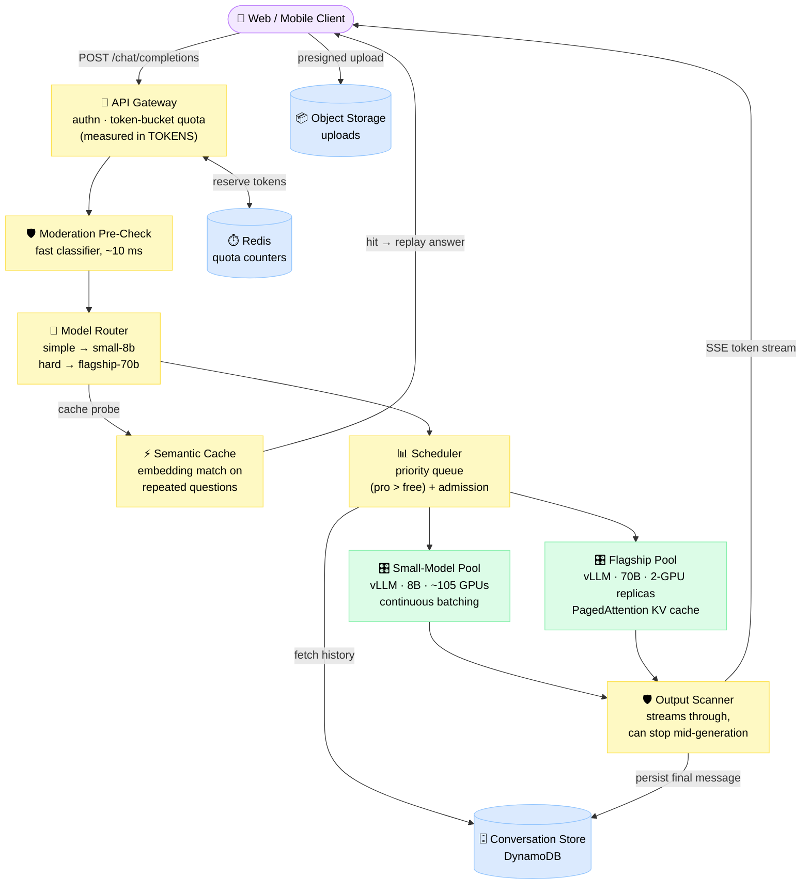
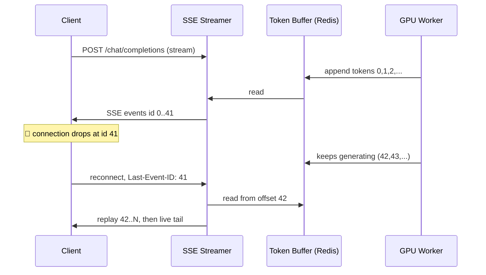
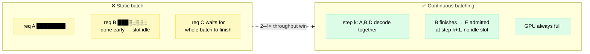
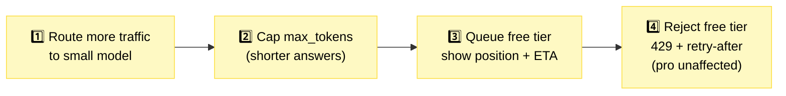

# Design an LLM Chat Service (ChatGPT)

> A conversational AI product serving 100M+ users token-by-token from a limited, eye-wateringly expensive GPU fleet — the flagship modern interview question, because the bottleneck isn't the database or the network: it's VRAM.

**Difficulty:** ⭐⭐⭐⭐⭐ · **Builds on:**
[AI & LLM Infrastructure](../../Level-07-Big-Data-and-Specialized/09-AI-and-LLM-Infrastructure/README.md) ·
[WebSockets & Realtime](../../Level-03-Communication/06-WebSockets-and-Realtime/README.md) ·
[Rate Limiting](../../Level-03-Communication/07-Rate-Limiting/README.md)

---

## 1. 🎯 Problem & Scope

We're building the serving side of a product like **ChatGPT / Claude.ai**: a user types a message, and a large language model streams back an answer word by word. Unlike a classic web service where a request costs microseconds of CPU, here every request occupies a slice of a GPU for **10–30 seconds**. Capacity is scarce, expensive, and can't be spun up on demand — H100s have waiting lists, not autoscaling groups.

**In scope:** streamed inference serving, conversation history, free/pro tiers with quotas, content moderation, model routing, multi-region capacity, graceful degradation.

**Out of scope:** model **training** and fine-tuning pipelines, RAG/tool use, image generation, billing/payments internals.

---

## 2. 📋 Requirements

### Functional
- Send a message in a conversation; receive the reply **streamed token by token**
- Conversations persist: list, resume, rename, delete; history replayed as model context
- File/image uploads attached to messages
- **Free vs Pro tiers**: different token quotas, model access, and queue priority
- Content moderation on both user input and model output
- Users can pin a model or let the system choose (`"model": "auto"`)

### Non-Functional
- **Time-to-first-token (TTFT) p90 < 1.5 s** — the moment the reply starts feeling "alive"
- Inter-token latency smooth enough to read along (~30–60 tokens/s per stream)
- **99.9% availability** for the chat path (degraded mode allowed: smaller model, queueing)
- Conversation history durable (no data loss on node failure)
- Quota enforcement accurate to the token — GPU seconds are the product
- A dropped connection must not lose a half-generated answer

---

## 3. 🧮 Capacity Estimation

This is where this problem diverges from every other design. Do the [back-of-the-envelope](../../Level-06-Scale-and-Reliability/02-Capacity-Planning-and-Estimation/README.md) in **tokens**, not requests.

**Traffic**
- 10 M DAU × 10 messages/day = **100 M messages/day** ≈ 1,200 msg/s average, **~3,500 msg/s peak** (×3)
- Average reply ≈ **500 output tokens**; average context (history + system prompt) ≈ **2,000 input tokens**
- Output volume: 100 M × 500 = **50 B output tokens/day**
- Steady-state generation demand at peak (Little's law): 3,500 msg/s × 500 tokens = **1.75 M output tokens/s**

**GPU memory — the real constraint**
- Flagship model: 70 B parameters × 2 bytes (FP16) = **140 GB of weights** → doesn't fit one 80 GB H100 → tensor-parallel across **2 GPUs** (160 GB), leaving ~20 GB for KV cache
- **KV cache** (the model's per-request "working memory"): ≈ 2 × 80 layers × 8 KV heads × 128 dims × 2 bytes ≈ **320 KB per token** → a 4,000-token conversation pins **~1.3 GB of VRAM** for its entire generation
- Naively: 20 GB ÷ 1.3 GB ≈ **15 concurrent requests per 2-GPU replica**. PagedAttention (near-zero fragmentation) + FP8 KV quantization pushes this to **~40**

**GPU count**
- A 2×H100 replica with continuous batching sustains ≈ **2,000 output tokens/s** (≈ 50 tok/s × 40 streams)
- All traffic on flagship: 1.75 M ÷ 2,000 = 875 replicas = **1,750 GPUs**; + prefill overhead and 20% headroom ≈ **2,200 H100s**
- At ~$2/GPU-hour: 2,200 × $2 × 730 h ≈ **$3.2 M/month** just for inference

**Why routing and caching are not optional**
- Cost per 1 M output tokens: flagship ≈ $4/h ÷ 7.2 M tok/h ≈ **$0.55**; an 8B small model on one GPU does ~10,000 tok/s ≈ **$0.06** — a **9× difference**
- Route 60% of (simple) traffic to the small model: flagship fleet shrinks to ~700 GPUs, small pool needs ~105 → **~1,000 GPUs total, half the bill**
- Storage: 100 M msgs/day × 2 KB ≈ 200 GB/day ≈ **73 TB/year** — trivial next to GPU cost
- Egress: 1.75 M tok/s × ~50 B per SSE event ≈ 90 MB/s ≈ **0.7 Gbps** — this system is compute-bound, not bandwidth-bound

---

## 4. 🔌 API Design

```
POST /v1/chat/completions                # the core endpoint
{
  "conversation_id": "conv_8f3a",        # omit → new conversation
  "message": { "role": "user", "content": "Explain the CAP theorem" },
  "model": "auto",                       # or pin: "small-8b" | "flagship-70b"
  "stream": true
}
→ 200, Content-Type: text/event-stream   # SSE

id: 0
data: {"type":"message_start","message_id":"msg_91c2","model":"flagship-70b"}
id: 1
data: {"type":"delta","content":"The CAP"}
id: 2
data: {"type":"delta","content":" theorem states"}
...
data: {"type":"usage","input_tokens":1840,"output_tokens":512}
data: [DONE]

# Conversation CRUD
POST   /v1/conversations                      → create (title, system_prompt)
GET    /v1/conversations?cursor=...&limit=20  → list, most recent first
GET    /v1/conversations/{id}/messages        → full history
PATCH  /v1/conversations/{id}                 → rename / archive
DELETE /v1/conversations/{id}                 → soft delete, purged after 30 days

GET    /v1/usage                              → tokens used / remaining today
POST   /v1/files                              → presigned URL for uploads
```

Every SSE event carries a monotonically increasing `id`. On disconnect, the client reconnects with the standard `Last-Event-ID` header and the server **replays from that offset** (see Deep Dive 7.1). `429` responses include `retry-after` and the quota reset time.

---

## 5. 🗄️ Data Model



**Storage choices:**
- **Conversations & messages → DynamoDB** (or partitioned Postgres): partition key `conversationId`, sort key `messageId` (KSUID = time-ordered). Fetching a whole conversation for model context is **one query on one partition**. A GSI on `userId + updatedAt` powers the sidebar list. Access pattern is pure key-value — no joins needed.
- **Attachments → [object storage](../../Level-02-Data-Layer/09-Object-Storage/README.md)** via presigned URLs; the DB stores only the key.
- **Live quota counters → Redis** (fast atomic decrements on the hot path), flushed asynchronously to `USAGE_LEDGER` for billing truth.

---

## 6. 🏗️ High-Level Architecture



**Walk-through (one user message):**
1. Gateway authenticates, counts the input tokens exactly, **reserves** output tokens (up to `max_tokens`) against the user's Redis token bucket — reject with `429` + reset time if empty.
2. Moderation pre-check classifies the input (~10 ms). Blocked → polite refusal, no GPU touched.
3. Router scores the query: short factual question → small model; long reasoning/code → flagship. Pro users can pin the flagship.
4. Semantic cache probe: near-identical recent question with no personal context → replay the stored answer as a stream. **$0.55 of GPU work becomes ~$0.**
5. Scheduler pulls conversation history from DynamoDB, assembles the prompt (system prompt + rolling summary + recent turns), and enqueues — pro queue drains first.
6. A vLLM replica with free KV-cache pages admits the request into its **running batch** (no waiting for a "batch window"), prefills the prompt, then decodes token by token.
7. Tokens flow through the output scanner and to the client as SSE events, each buffered briefly (Redis Stream) for resume-on-disconnect.
8. On completion: final message + token counts persisted, quota reservation settled to actual usage, usage ledger updated.

---

## 7. 🔬 Deep Dives

### 7.1 Token Streaming: SSE, Resumability, Backpressure

| | **SSE (chosen)** | WebSocket |
|---|---|---|
| Direction | Server → client (all we need) | Bidirectional (overkill here) |
| Transport | Plain HTTP → CDN/proxy/LB friendly | Upgrade handshake; some proxies interfere |
| Reconnect | **Built-in**: auto-retry + `Last-Event-ID` | Hand-rolled resume protocol |
| When it wins | Streamed replies, notifications | Chat *between humans*, typing indicators — see [WhatsApp](../08-WhatsApp-Chat/README.md) |

The user only receives; the next user message is just a new POST. So SSE wins on operational simplicity ([WebSockets & Realtime](../../Level-03-Communication/06-WebSockets-and-Realtime/README.md) covers the mechanics).

**The critical trick: decouple generation from the connection.** The GPU writes tokens to a short-lived buffer (a Redis Stream keyed by `message_id`, TTL ~10 min); a stateless streamer relays buffer → SSE. If the phone hops from Wi-Fi to 5G mid-answer, generation never notices:



**Backpressure:** one slow client must never stall a batch that 39 other requests share. The buffer absorbs the mismatch; if a client lags beyond the buffer cap, drop *that connection* and let the resume path recover. Never throttle the GPU.

### 7.2 Inference Serving Internals: Where the GPUs Actually Go

A generation has two phases with opposite personalities:

- **Prefill** — process the whole 2,000-token prompt in parallel. Compute-bound, ~hundreds of ms, produces the KV cache. Determines **TTFT**.
- **Decode** — produce one token per forward pass, re-reading the KV cache every step. **Memory-bandwidth-bound**; the GPU's arithmetic units are mostly idle. Determines tokens/s.

Decode wastes the GPU unless you batch many streams. **Static batching** (wait, collect N, run to completion) is terrible: short answers finish early and their slots sit dead. **Continuous (in-flight) batching** admits and retires requests at *every decode step*:



**KV cache is the real bottleneck.** Batch size is capped not by compute but by VRAM for KV (§3: ~1.3 GB per 4K-token request). Two fixes:
- **PagedAttention** (vLLM): store KV in fixed-size pages (e.g., 16 tokens) with a per-request page table — like virtual memory. Fragmentation drops from ~60% wasted to **< 4%**, roughly doubling concurrent batch size on the same hardware.
- **Prefix caching:** every conversation shares the same system prompt, and every follow-up turn shares the whole earlier conversation. Keep those KV pages resident and share them copy-on-write — a follow-up message only prefills the *new* turn. TTFT collapses from ~800 ms to ~150 ms, which is how we make the p90 < 1.5 s budget.

### 7.3 Context Window Management

A 200-message conversation exceeds any context budget. Options:

| Strategy | How | Cost | Risk |
|---|---|---|---|
| **Hard truncation** | Keep system prompt + last N turns | Free | Model "forgets" the user's name from turn 3 |
| **Rolling summarization (chosen)** | Small model compacts old turns into `rollingSummary` on the conversation row, refreshed every ~20 turns | One cheap 8B call, async | Lossy; subtle details vanish |

We assemble: `system prompt + rollingSummary + last ~10 turns`. Bonus: a shorter assembled prompt is cheaper to prefill and frees KV pages — context management is also a capacity lever.

### 7.4 Semantic Caching

Thousands of users ask "explain the CAP theorem" every day. Exact-match [caching](../../Level-01-Building-Blocks/03-Caching/README.md) never hits (wording varies); **semantic caching** embeds the normalized query and does a vector similarity lookup (cosine > 0.97, same language) against recently generated answers, then replays the hit as a synthetic stream.

Rules that keep it safe: only **first-turn** messages (no conversation context), never for personalized or time-sensitive queries, short TTL (hours), and sampled quality audits. Even a 10% hit rate deletes ~100 flagship GPUs from the bill.

### 7.5 Quotas & Fairness: Metering the Actual Resource

Rate-limiting by *requests* is wrong here — a 10-token "hi" and a 4,000-token essay differ 400× in GPU cost. The [token bucket](../../Level-03-Communication/07-Rate-Limiting/README.md) is denominated in **LLM tokens**: free = 50 K tokens/day, pro = 1 M. Admission reserves `input + max_tokens`, settlement refunds the unused remainder — otherwise users could fire parallel requests against the same near-empty bucket.

**Fairness under scarcity** is a scheduling problem: two queues (pro, free) with strict priority plus **aging** (a free job waiting > 30 s jumps ahead) so free users starve gracefully, not infinitely. When peak demand exceeds the fleet:



Each rung trades answer quality for availability — degraded service beats an error page, and pro (the revenue) degrades last. This is exactly ChatGPT's real behavior: free users silently fall back to a mini model when the flagship quota is exhausted.

### 7.6 Moderation Pipeline

Two checkpoints, because the *model's own output* can violate policy even on an innocent prompt:

1. **Pre-input:** a small fast classifier (~10 ms) on the user message → `PASS` / `FLAG` (proceed + log) / `BLOCK` (refusal template, zero GPU spend).
2. **Streamed-output scanning:** a sliding window over generated text is re-classified every ~50 tokens, *in parallel* with streaming. On violation: **stop generation mid-stream**, send a replacement event (`{"type":"content_filtered"}`), redact the persisted message.

**Fail-open or fail-closed when the moderation service is down?** Fail-closed (block all traffic) turns a classifier outage into a full product outage — hard to justify. Most consumer products fail-open for general traffic *with sampled async re-scanning*, but **fail-closed for high-risk surfaces** (minors, jurisdictions with legal exposure). Name this as a product/legal decision in the interview, not a purely technical one.

### 7.7 Multi-Region Capacity & Model Rollout

GPU supply dictates geography — you build where you *got* H100s, not where users are. That's fine: 80 ms of extra RTT is invisible inside a 15 s generation. So: **route to capacity, not proximity** — a global gateway sends requests to the region with queue headroom; conversation store uses global tables (conversations are single-writer per user, so conflicts are rare).

**Rolling out a new model** without burning users:
1. **Shadow traffic:** mirror ~1% of prompts to the candidate; users see only the old model's answer; compare quality offline (win-rate judged by a grader model).
2. **Canary 1% → 10% → 100%,** gated on regeneration rate, thumbs-down rate, TTFT, and refusal rate.
3. Router config is versioned and instantly revertible — model rollback must be one click, because a bad model is a *quality* incident invisible to health checks.

---

## 8. 📈 Scaling, Bottlenecks & Failure Modes

| Failure / bottleneck | Symptom | Mitigation |
|---|---|---|
| GPU node dies mid-stream | 40 streams freeze | Orchestrator re-enqueues each request with `already-generated prefix` appended to the prompt; prefix caching makes the replay prefill cheap; client sees a ~2 s stall, not an error |
| KV cache exhaustion | Admissions stall; TTFT p90 blows past 1.5 s | Admission control by *free KV pages* (not request count); shed to other replicas; preempt longest-idle stream to buffer if desperate |
| Moderation service down | Every request blocked or unscreened | Fail-open + sampled async re-scan for general traffic; fail-closed for high-risk surfaces (§7.6) |
| Viral spike (10× overnight) | Queue depth grows unboundedly — you cannot buy GPUs today | Queue-depth & token-demand alarms; degradation ladder (§7.5); semantic cache absorbs the duplicated viral prompt itself |
| Hot conversation partition | One power user hammers a DynamoDB partition | Per-conversation write rate is human-bounded (~1 msg/s) — naturally fine; cache the sidebar list |
| Quota Redis down | Can't meter tokens | Fail-open with short local (per-gateway) budgets, reconcile from ledger after — never take the product down over billing |

**What breaks first as you grow:** the flagship pool. Every growth lever therefore aims at protecting it — better routing (send less to it), prefix caching (spend less per request on it), semantic caching (skip it entirely), context compaction (shrink its prompts).

---

## 9. ⚖️ Trade-offs & Alternatives

| Decision | Chosen | Alternative | Why chosen |
|---|---|---|---|
| Stream transport | SSE | WebSocket | Unidirectional need; HTTP-native, proxy-friendly, built-in resume via `Last-Event-ID` |
| Quota unit | Tokens | Requests | Requests vary 400× in GPU cost; tokens meter the actual scarce resource |
| Model strategy | Router + 2 tiers | One flagship for everything | ~2× fleet cost reduction; most queries don't need 70 B params |
| History storage | DynamoDB (KV) | Postgres | Pure key-value access pattern, effortless horizontal scale; Postgres fine at smaller scale |
| Long conversations | Rolling summary + recent turns | Hard truncation | Keeps long-range memory for one cheap async 8B call |
| Batching | Continuous (vLLM-style) | Static batching | 2–4× throughput; no head-of-line blocking on long generations |
| Moderation outage | Fail-open + sampling | Fail-closed | Availability; classifier outage ≠ product outage (inverted for high-risk surfaces) |
| GPU strategy | Own/reserved fleet | Resell a provider API | At 50 B tokens/day, per-token API pricing costs multiples of a reserved fleet |

---

## 10. 🌐 How It's *Actually* Done

- **OpenAI / ChatGPT:** streams over SSE (visible in the API); free tier silently falls back to a mini model when flagship quota runs out — the degradation ladder in production; Plus/Pro buy priority capacity; "at capacity" queueing pages in early viral days were rung 3 of the ladder.
- **Anthropic:** the Claude API streams typed SSE events (`message_start`, `content_block_delta`, `message_stop`) — a clean public example of designing a resumable, structured token stream.
- **vLLM / PagedAttention (SOSP '23):** the paper behind §7.2 — paging the KV cache cut memory waste to < 4% and delivered 2–4× throughput over prior systems (up to 24× over naive serving). Now the de-facto open-source serving standard.
- **Character.AI:** published inference-optimization posts describing multi-query attention and int8 KV cache to shrink KV ~20×, and **cross-turn prefix caching with ~95% hit rate** — chat traffic is dominated by follow-up turns, so cached-prefix design reportedly cut their serving cost ~33× since launch.
- **Perplexity:** runs its own vLLM-derived stack on H100s and treats TTFT as the flagship product metric — for search-style queries, first-token latency *is* the UX.

---

## 11. 📝 Summary

| Aspect | Decision |
|---|---|
| Streaming | SSE + Redis token buffer; generation decoupled from connection; resume via `Last-Event-ID` |
| Serving | vLLM-style continuous batching + PagedAttention; prefix caching for system prompts & follow-up turns |
| Capacity | ~1,000 GPUs via model routing (60% → 8B small model) vs ~2,200 flagship-only |
| Quotas | Token-denominated buckets; reserve-then-settle; pro > free priority with aging |
| History | DynamoDB, partition per conversation; rolling summary + recent turns as context |
| Moderation | Fast pre-check + streamed-output scanning that can stop mid-generation |
| Degradation | Smaller model → shorter answers → queue with ETA → shed free tier |

The 30-second recap: **every design decision is a defense of the KV cache.** Meter tokens because tokens are GPU time; route so the flagship only sees queries that need it; batch continuously so decode never idles; page and share the KV cache so VRAM admits more streams; cache semantically so repeated questions cost nothing; and when demand still wins, degrade down a ladder instead of falling over.

*More designs: [Real-World Architectures index](../README.md)*
