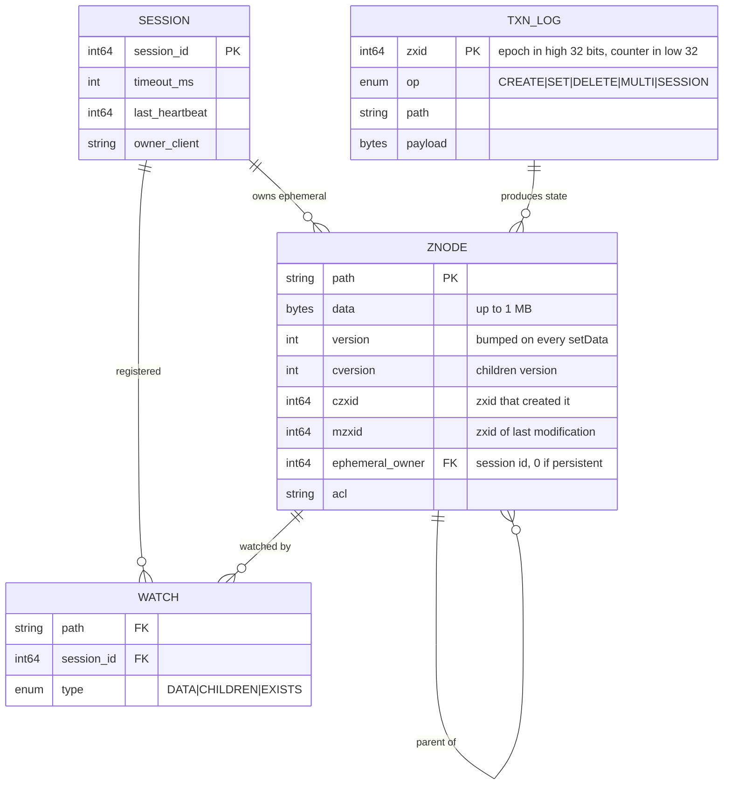
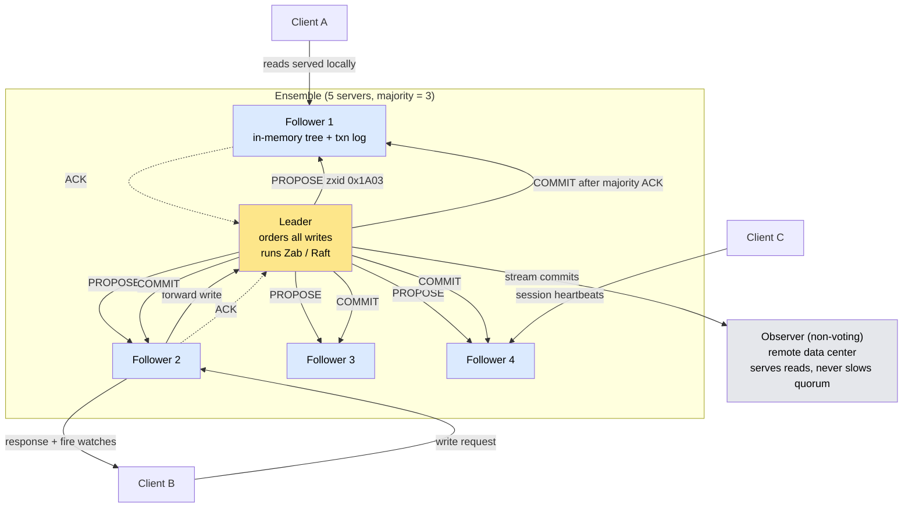
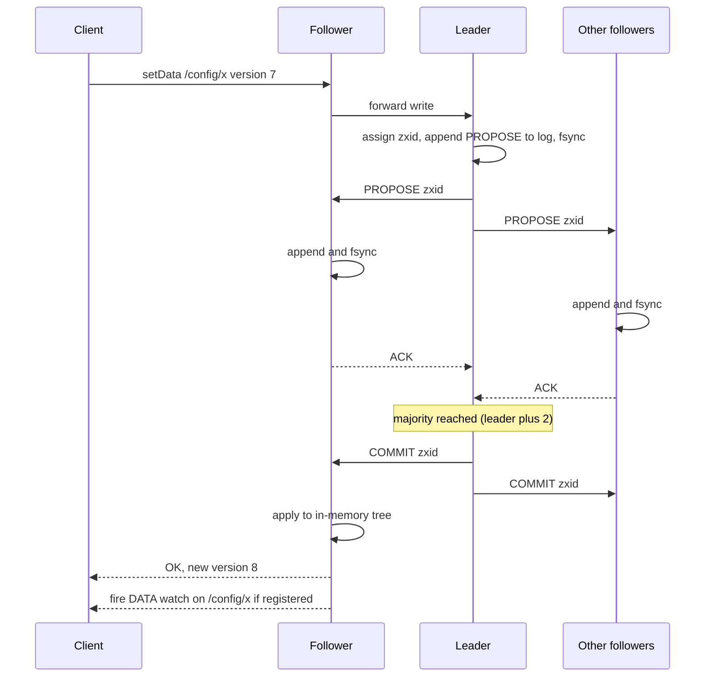

# Design a Distributed Coordination Service (ZooKeeper / etcd)

> The small, strongly consistent, highly available store that every *other* distributed system leans on for configuration, leader election, locks, and membership — the cluster's brain, which is allowed to be slow but never allowed to be wrong.

**Difficulty:** ⭐⭐⭐⭐⭐ · **Builds on:**
[Consensus — Paxos & Raft](../../Level-04-Distributed-Systems/03-Consensus-Paxos-Raft/README.md) ·
[Leader Election](../../Level-04-Distributed-Systems/05-Leader-Election/README.md) ·
[Distributed Locking](../../Level-04-Distributed-Systems/08-Distributed-Locking/README.md) ·
[Consistency Models](../../Level-04-Distributed-Systems/02-Consistency-Models/README.md)

---

## 1. 🎯 Problem & Scope

Kafka needs to know which broker is the controller. HBase needs to know which region server owns which region. Kubernetes needs a single source of truth for every object in the cluster. A job scheduler needs exactly one instance to be "the scheduler." Every one of these is the same problem: **many machines must agree on a small amount of critical state, and keep agreeing as machines fail.**

Solving consensus inside each application is error-prone, so the industry factored it out into a **coordination service**: a replicated key-value store with strict ordering, the ability to detect dead clients, and notifications when things change. ZooKeeper (Yahoo, 2008), Chubby (Google, 2006), etcd (CoreOS, 2013), and Consul all fill this role.

**In scope:** the hierarchical data model, consensus-based replication, sessions and ephemeral nodes, watches, the recipes built on top (leader election, locks, membership, config), read scaling, durability and recovery.

**Out of scope:** storing large data (this is not a database), general-purpose queries, cross-datacenter geo-replication with low latency.

---

## 2. 📋 Requirements

### Functional
- A **hierarchical namespace** of small nodes ("znodes"), each holding up to ~1 MB of data plus metadata (version, timestamps, owner).
- Create / read / update / delete with **versioned compare-and-set** — updates fail if the version changed.
- **Ephemeral nodes** that exist only while the creating client's session is alive.
- **Sequential nodes** — the server appends a monotonically increasing counter to the name.
- **Watches** — a client can ask to be notified once when a node's data or children change.
- **Multi-op** — several operations succeed or fail atomically.
- **Sessions** with heartbeats so the service can detect a client that died.

### Non-Functional
- **Linearizable writes**, totally ordered across the whole service.
- Reads that are at least **sequentially consistent** (a client never sees time go backwards), with an option to force a linearizable read.
- **Available while a majority of servers are up** — a 5-node ensemble survives 2 failures.
- Write latency of a **few milliseconds** within a data center; read throughput of **100K+/s** from the ensemble.
- Failure detection of a dead client within a **session timeout** (typically 2–30 s).
- Data set small enough to live **entirely in memory** on every server (hundreds of MB to a few GB).

---

## 3. 🧮 Capacity Estimation

**Ensemble**
- 5 servers (tolerates 2 failures). Every write must reach 3. Going to 7 buys one more failure but slows every write; almost nobody runs more than 7 voters.

**Data**
- 1 million znodes × ~1 KB average (data + metadata) → **~1 GB** in RAM per server. Plus the in-memory watch table: 100K watches × ~100 bytes = 10 MB.

**Writes**
- Coordination traffic is bursty but small: say **5,000 writes/s** peak (lock acquisitions, leader leases, config updates), ~1 KB each → 5 MB/s appended to the transaction log on the leader and replicated to followers. Each batch of writes is `fsync`ed before acknowledgment — **disk latency is write latency**, so the log lives on a dedicated SSD.

**Reads**
- 1,000 clients × 100 reads/s = **100K reads/s**, served locally from any server's in-memory copy with zero network round-trips to the leader. Reads scale with server count; writes do not.

**Sessions**
- 10,000 client sessions with a 6 s timeout and heartbeats every 2 s → ~5,000 heartbeat messages/s to the ensemble. Cheap, but a session-timeout storm (see failure modes) can delete tens of thousands of ephemeral nodes at once.

**Snapshots**
- A fuzzy snapshot of the 1 GB tree every ~100K transactions; recovery = load last snapshot + replay the log tail.

---

## 4. 🔌 API Design

ZooKeeper's API is deliberately tiny — a filesystem-like tree plus watches:

```
create(path, data, flags[EPHEMERAL | SEQUENTIAL], acl)  → actual path
getData(path, watch=true|false)                          → data, stat{version, mzxid, ephemeralOwner, ...}
setData(path, data, expectedVersion)                     → stat            # compare-and-set
delete(path, expectedVersion)
getChildren(path, watch)                                 → [names]
exists(path, watch)                                      → stat | null
multi([op, op, ...])                                     → all-or-nothing
sync(path)                                               # force this server to catch up before the next read

Session:  connect(servers, sessionTimeout) → sessionId, negotiated timeout
          client sends heartbeat every sessionTimeout/3
```

etcd exposes the same ideas with a flat key space and gRPC:

```
Put(key, value, lease?)             Range(key, rangeEnd, revision?)     DeleteRange(...)
Txn(compare[...], success[...], failure[...])                            # CAS across many keys
Watch(key or prefix, startRevision)  → stream of events                  # not one-shot
LeaseGrant(ttl) / LeaseKeepAlive(id) # keys attached to a lease vanish when it expires
```

The important design choice in both: **there is no "get me a lock" call.** The primitives (ephemeral + sequential + watch, or lease + CAS + watch) are enough to build locks, elections, queues, and barriers as client-side *recipes*.

---

## 5. 🗄️ Data Model



**Storage on each server:**
- The whole tree lives in an **in-memory hash map** keyed by path, with parent/child links.
- Every committed write is first appended to a **write-ahead transaction log** and `fsync`ed; the in-memory tree is applied from committed log entries (it's a replicated state machine).
- **zxid** is the global order: a 64-bit number whose high 32 bits are the leader's epoch and low 32 bits a counter. Every znode records the zxid that created and last modified it, which is what makes versions comparable across the cluster.
- Periodic **snapshots** bound recovery time; old logs are deleted after a snapshot covers them.

**Why a tree and not a flat key space?** Hierarchy gives cheap `getChildren` for membership lists and lock queues (`/locks/order-service/lock-0000000042`), and lets ACLs and watches apply to a subtree. etcd chose a flat space with prefix ranges, which achieves the same thing with `Range("/locks/order-service/", ...)`.

---

## 6. 🏗️ High-Level Architecture



**Walk-through (write):**
1. Client B, connected to Follower 2, calls `setData("/config/rate-limit", "500", version=7)`.
2. Follower 2 forwards the request to the **Leader** — only the leader orders writes.
3. The leader assigns the next **zxid**, appends a PROPOSE to its log, and broadcasts it.
4. Each follower appends the proposal to its own log, `fsync`s, and ACKs.
5. On ACKs from a **majority** (leader + 2 followers), the leader sends COMMIT. Every server applies the write to its in-memory tree in zxid order.
6. Follower 2 replies to Client B and **fires any watches** it holds on `/config/rate-limit` for its own connected clients.

**Walk-through (read):**
1. Client A calls `getData("/config/rate-limit")` on Follower 1.
2. Follower 1 answers from memory immediately — no leader involvement. It may be slightly behind the leader; ZooKeeper guarantees Client A will never see an *older* state than it has already seen (sequential consistency). If Client A needs the very latest value, it calls `sync()` first, which makes Follower 1 catch up to the leader before answering.

---

## 7. 🔬 Deep Dives

### 7.1 Consensus and total order (Zab vs Raft)

Both ZooKeeper's **Zab** (ZooKeeper Atomic Broadcast) and etcd's **Raft** are leader-based: one elected leader serializes every write into a single log; a write is committed once a majority has durably stored it. This gives two guarantees the recipes depend on:

- **Total order:** every server applies the same writes in the same zxid order.
- **Durability of committed writes:** a write acknowledged to a client has been `fsync`ed on a majority, so any *future* majority contains at least one server that has it.

When the leader dies, the survivors elect a new one. Zab elects the server with the **highest zxid** (the most up-to-date log), which guarantees no committed write is lost — a new leader with a shorter log is impossible because it couldn't win a majority vote against peers who saw more. The new leader starts a new **epoch** (high bits of zxid), so any stale proposal from the old leader is trivially rejected.

ZooKeeper additionally guarantees **FIFO client order**: a client's own requests are applied in the order it sent them, which lets a client fire off `create` then `setData` without waiting for each.



### 7.2 Sessions, ephemeral nodes, and failure detection

The service needs to know when a client is *gone*, because "who holds the lock" and "which workers are alive" are ephemeral facts. A **session** is created on connect with a negotiated timeout. The client heartbeats at a fraction of the timeout; the leader tracks the last heartbeat for every session (session tracking is itself replicated so it survives leader failover).

If the leader sees no heartbeat within the timeout, it **expires the session** as a committed transaction: every ephemeral node the session owned is deleted, and every watcher on those nodes is notified. This single mechanism is how membership lists shrink when a worker dies and how a leader's lock is released when the leader crashes.

The trade-off is the timeout itself. A **short** timeout detects failures fast but a long GC pause or a network hiccup expires a healthy client — its ephemeral nodes vanish, someone else becomes leader, and the paused client wakes up still believing it's leader. A **long** timeout avoids false positives but stretches how long a dead leader blocks progress. This is why any resource protected by a ZooKeeper lock should also check a **fencing token** (Deep Dive 7.3).

### 7.3 Watches, the herd effect, and correct locks

A watch is a **one-shot** trigger: set it on a read, get notified once on the next change, re-register if you still care. Watches are tracked by the server the client is connected to, and ZooKeeper guarantees a client sees the watch event **before** it sees any data from after the change — so a client never acts on stale data thinking it's fresh.

The naive lock recipe — everyone creates `/lock` and everyone watches `/lock` — causes a **herd effect**: when the holder releases, a thousand waiters wake up simultaneously and a thousand `create` calls hit the leader. The correct recipe:

1. Create an **ephemeral sequential** node: `/locks/db/lock-` → server returns `/locks/db/lock-0000000042`.
2. `getChildren("/locks/db")`. If your node has the **lowest** sequence number, you hold the lock.
3. Otherwise, set a watch on **only the node immediately before yours** (`lock-0000000041`).
4. When that node disappears (released or its session expired), go to step 2.

Each release wakes exactly one waiter. Ephemeral ownership means a crashed holder's lock evaporates with its session.

**Fencing:** because of the session-timeout race in 7.2, a lock alone can't make a resource safe. The lock's **zxid or sequence number is a monotonically increasing fencing token**; the client passes it to the storage system, which rejects any request carrying a token lower than one it has already seen. The stale ex-leader's writes are refused even though it still thinks it holds the lock.

### 7.4 Scaling reads without weakening writes

Writes are bounded by the leader's disk and the majority round-trip, and adding voters makes that *worse*. Reads are the easy dimension:

- Every server answers reads from memory, so read throughput scales linearly with servers.
- For clients that can't tolerate a stale read, `sync()` before `getData` (ZooKeeper) or a **linearizable read** via ReadIndex (etcd asks the leader to confirm it's still leader and waits for its own state to catch up) costs one round-trip.
- **Observers** (ZooKeeper) or **learners** (etcd) receive the commit stream but don't vote. They add read capacity — even in remote data centers — without adding to the quorum, so they can't slow down or destabilize writes.

### 7.5 Durability, recovery, and the disk on the critical path

Every proposal is `fsync`ed before it's acknowledged. That means a slow or shared disk turns directly into slow writes and, worse, missed heartbeats that trigger leader elections. Production ensembles put the transaction log on a **dedicated low-latency disk**, separate from snapshots and OS logs.

Recovery on restart: load the latest **snapshot**, replay the transaction log from the snapshot's zxid, rejoin the ensemble, and catch up on anything committed since. etcd keeps a **revision history** so watches can resume from a known revision; it must be **compacted** periodically or the backing store grows without bound, and defragmented to reclaim space.

### 7.6 Why it must stay small — and why it isn't a database

The entire tree lives in memory on every server, every write costs a majority `fsync`, and znodes are capped at ~1 MB. That's not a limitation to work around; it's the design. The service is fast and safe *because* it refuses to hold bulk data. Systems that store application data in ZooKeeper end up with multi-second GC pauses on the ensemble, and — since everything depends on it — a cluster-wide outage. Store the *pointer* (which node is leader, which config version is live), not the *payload*.

---

## 8. 📈 Scaling, Bottlenecks & Failure Modes

| Bottleneck / failure | Symptom | Mitigation |
|----------------------|---------|------------|
| Leader disk latency | Write p99 spikes, followers time out, spurious elections | Dedicated SSD for the txn log; monitor fsync latency |
| Too many voters | Every write waits on more ACKs | Keep 3–5 voters; add observers for reads |
| Session-timeout storm | A network blip expires thousands of sessions at once; a flood of ephemeral deletions and watch events; clients reconnect and rebuild state simultaneously | Longer timeouts for infra clients; jittered reconnect backoff; watch fan-out limits |
| Herd effect | One change wakes thousands of watchers | Watch the predecessor, not the root (7.3) |
| Large znodes / large data set | GC pauses, slow snapshots, slow recovery | Enforce the 1 MB limit; keep total data in the low GBs |
| Leader GC pause | Followers elect a new leader; old leader returns and steps down | Tune JVM heap; fencing tokens on protected resources |
| Loss of majority | Ensemble refuses writes (and, by default, reads) — correct CP behavior | Spread voters across failure domains; alert on quorum health |
| Cross-DC ensemble | Every write pays WAN latency | Keep voters in one region; observers elsewhere |

**Failure modes in brief:**
- **Network partition:** the side with a majority keeps serving; the minority side cannot elect a leader and stops accepting writes — no split brain by construction.
- **Slow follower:** doesn't block commits (majority is enough) but its local reads grow stale; `sync()` protects clients that care.
- **Client believes it's leader after its session expired:** the classic race; only fencing tokens make it safe.

---

## 9. ⚖️ Trade-offs & Alternatives

| Decision | Chosen | Alternative | Why |
|----------|--------|-------------|-----|
| Consistency vs availability | **CP** — refuse writes without a majority | AP (accept writes anywhere, reconcile later) | Coordination state that can diverge is worse than none |
| Replication protocol | Leader-based atomic broadcast (Zab / Raft) | Multi-Paxos, leaderless | Simpler to reason about; total order falls out naturally |
| Data model | Hierarchical znodes (ZK) | Flat keys with prefix ranges (etcd) | Both work; hierarchy makes membership and queues obvious; flat keys are simpler to shard the API |
| Watch semantics | One-shot (ZK) | Streaming from a revision (etcd) | One-shot is simpler to implement; streaming avoids missed events between re-registration |
| Liveness mechanism | Sessions with server-side heartbeats | Leases with TTLs (etcd) | Same idea; leases decouple liveness from the connection |
| Reads | Local, possibly stale; `sync()` for fresh | Linearizable by default | Local reads give the 100K/s throughput that makes the service usable |
| Ensemble size | 3–5 voters | 7+ | Every voter adds write latency; observers give read scale for free |

**Why Kafka removed ZooKeeper (KRaft):** operating a second distributed system alongside the first doubled the failure modes and on-call burden, and Kafka's metadata (millions of partitions) outgrew what a general coordination service handles gracefully. Kafka now runs its own Raft-based metadata quorum inside the brokers — the *pattern* survived, the *dependency* didn't.

---

## 10. 🌐 How It's Actually Done

**Google Chubby (2006):** the paper that started it all. Chubby is a Paxos-replicated lock service used by GFS and Bigtable for primary election and by nearly everything at Google for naming and config. Its key insight, stated in the paper: engineers adopt a *lock service* far more readily than a consensus *library*, because it fits into existing code as a few calls rather than a redesign. Chubby also introduced the idea that coarse-grained locks held for hours matter more than fine-grained ones held for milliseconds.

**Apache ZooKeeper (Yahoo, 2008):** the open-source realization, with Zab, ephemeral/sequential nodes, one-shot watches, and the recipes above. It became the coordination layer for Hadoop, HBase, Kafka, Solr, Storm, and countless in-house systems.

**etcd (CoreOS, 2013):** Raft-based, flat key space, gRPC, streaming watches, leases, and multi-key transactions. It is the storage backend of **Kubernetes** — every pod, service, and secret in a cluster is a key in etcd — which makes it arguably the most widely deployed coordination service on earth.

**HashiCorp Consul:** Raft for the key-value store and service catalog, plus a **gossip** protocol (Serf) for scalable failure detection across thousands of nodes — a reminder that consensus is for the small critical state and gossip is for the large eventually-consistent state.

**Kafka KRaft (2022+):** ZooKeeper removed in favor of an internal Raft quorum among brokers, cutting the metadata bottleneck and the operational overhead of a second system.

---

## 11. 📝 Summary

| Aspect | Decision |
|--------|----------|
| Role | Small, strongly consistent store for coordination state — not application data |
| Replication | Leader-based atomic broadcast (Zab / Raft); commit on majority `fsync` |
| Ordering | Global 64-bit zxid (epoch + counter); FIFO per client |
| Liveness | Sessions with heartbeats; ephemeral nodes vanish on expiry |
| Notifications | One-shot watches (ZK) or revision-based streams (etcd) |
| Recipes | Locks and elections via ephemeral + sequential + watch-your-predecessor; fencing tokens for safety |
| Read scaling | Local in-memory reads; `sync()` or ReadIndex for freshness; observers for more capacity |
| Sizing | 3–5 voters, dedicated log disk, data in the low GBs, znodes ≤ 1 MB |

The 30-second whiteboard pitch: a coordination service is a replicated state machine whose *only* job is to be right. A leader orders every write, a majority `fsync`s it, and every server applies it in the same order — that's what makes "who is leader" and "what is the config" unambiguous. Sessions and ephemeral nodes turn client death into a committed fact everyone can watch. Keep the data tiny so it lives in memory, scale reads with local serving and observers, never add voters for capacity, and pair every lock with a fencing token — because the one thing consensus can't fix is a client that doesn't yet know it lost.

---

[← Back to all real-world architectures](../README.md) · Related: [Distributed Job Scheduler](../21-Distributed-Job-Scheduler/README.md) · [Distributed Message Queue (Kafka)](../19-Distributed-Message-Queue/README.md) · [Distributed Locking](../../Level-04-Distributed-Systems/08-Distributed-Locking/README.md)
