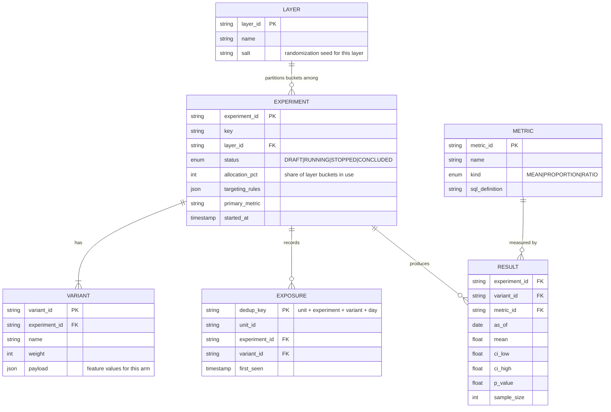

# Design an A/B Testing (Experimentation) Platform

> The system behind every "we tested it": deterministically assigning millions of users to variants across thousands of simultaneous experiments, logging what each user actually saw, and computing results that a statistician would trust — all without adding latency to the product.

**Difficulty:** ⭐⭐⭐⭐ · **Builds on:**
[Consistent Hashing](../../Level-02-Data-Layer/08-Consistent-Hashing/README.md) ·
[Stream Processing](../../Level-07-Big-Data-and-Specialized/02-Stream-Processing/README.md) ·
[Data Warehouses & Lakes](../../Level-07-Big-Data-and-Specialized/03-Data-Warehouses-and-Lakes/README.md) ·
[Deployment Strategies](../../Level-06-Scale-and-Reliability/04-Deployment-Strategies/README.md)

---

## 1. 🎯 Problem & Scope

A product with 50 million daily users wants to know whether a new checkout button increases purchases. The only trustworthy way to find out is a **randomized controlled experiment**: show the old button to a random half, the new one to the other half, and compare. Now multiply that by a thousand — every team runs experiments, many overlap on the same users, and a wrong answer ships a worse product with a confident-looking chart.

We're designing the platform that Booking.com, Netflix, Microsoft, and Airbnb each built in-house: experiment configuration, **deterministic and fast assignment** inside the request path, **exposure logging** at billions of events a day, a **metrics and statistics engine**, guardrails that shut down harmful experiments automatically, and a dashboard people can read without a PhD.

**In scope:** assignment (bucketing, layers, targeting, ramping), config distribution to SDKs, exposure logging and deduplication, metrics computation, the stats engine, guardrails and kill switches, holdouts.

**Out of scope:** marketing campaign tooling, multi-armed bandits (mentioned as an alternative), qualitative research.

---

## 2. 📋 Requirements

### Functional
- Create an experiment: population and targeting rules, variants with allocation weights, primary and guardrail metrics, start/end.
- **Assignment API:** `getVariant(experimentKey, unitId, attributes)` → variant, deterministic for the same unit forever.
- Independent randomization across experiments, plus **mutual exclusion groups** for experiments that must not overlap.
- **Exposure logging:** record when a user actually experienced a variant.
- **Ramping:** 1% → 10% → 50% without reshuffling already-assigned users; instant rollback.
- **Results:** per-metric lift, confidence intervals, p-values, sample sizes, and automatic sanity checks.
- **Guardrails:** automatically stop an experiment that degrades crashes, latency, or revenue.
- **Holdouts:** a small group excluded from all experiments to measure cumulative impact.

### Non-Functional
- Assignment adds **< 1 ms** to a request — evaluated locally in the SDK, no network call.
- **100K+ assignments/s** across the fleet; config changes propagate to every SDK in **< 60 s**; kill switches in **< 10 s**.
- **5 billion exposure events/day** ingested with at-most-once *effect* on results (deduplicated).
- Results refreshed **hourly**, with day-1 results available the next morning.
- Assignment must be **fail-safe**: any error → the user gets the control experience.
- Statistical correctness: no silent p-hacking, sample-ratio-mismatch detection, multiple-comparison awareness.

---

## 3. 🧮 Capacity Estimation

**Assignment**
- 50M DAU × ~10 sessions × ~20 experiments evaluated per session = **10B evaluations/day ≈ 115K/s average, ~500K/s peak**. Entirely local hashing in the SDK: microseconds of CPU, zero network.

**Config**
- 5,000 active experiments × ~5 KB = **25 MB** of config. Every SDK instance holds it in memory; distributed via CDN with ETag polling plus a streaming invalidation channel.

**Exposures**
- Only the *first* exposure per (user, experiment, variant, day) matters. 50M users × 20 experiments = **1B unique exposures/day**, ~200 bytes each → **200 GB/day** raw, ~40 GB compressed in columnar storage. Raw (pre-dedup) events are 5× that.

**Metrics**
- Joining 1B exposures/day against ~100B product events/day (purchases, clicks, crashes) is a warehouse-scale job. Precomputed daily per-(experiment, variant, metric) aggregates are tiny — 5,000 × 3 × 50 metrics = 750K rows/day — and that's what the dashboard reads.

**Bandwidth**
- Exposure ingestion: 5B × 200 B = 1 TB/day into Kafka ≈ **12 MB/s** average, 60 MB/s peak. Comfortable.

---

## 4. 🔌 API Design

**Management (experiment authors)**
```
POST   /experiments                      { key, layer, variants[{name, weight}], targeting, metrics, allocation }
PATCH  /experiments/{id}/allocation      { percent: 10 }        # ramp without reshuffle
POST   /experiments/{id}/start | /stop | /rollback
GET    /experiments/{id}/results?metric=conversion
```

**SDK (in every app server and client)**
```
getVariant(experimentKey, unitId, attributes) → { variant, reason }   # local, deterministic, < 1 ms
logExposure(experimentKey, unitId, variant)                          # call when the user actually sees it
```

**Config distribution**
```
GET /config?version=1234        → 304 Not Modified | full config + new version   (CDN-cached, polled every 30 s)
SSE /config/stream              → { type: "invalidate", version: 1235 }         (kill switches push immediately)
```

**Exposure ingestion**
```
POST /exposures  (batched, gzip)  [{ unit_id, experiment_id, variant, ts, sdk_version, dedup_key }]
```

`reason` in the assignment response (`"not_in_population"`, `"holdout"`, `"allocated:treatment"`) is what makes debugging "why did I see this?" possible.

---

## 5. 🗄️ Data Model



**Storage choices:**
- **Experiment config** in PostgreSQL (small, relational, needs transactions and history), published as an immutable versioned JSON blob to the CDN.
- **Exposures** flow through Kafka into a columnar warehouse (BigQuery / Snowflake / Iceberg tables) partitioned by day and experiment — write-heavy, append-only, scanned in bulk.
- **Results** are tiny and read constantly: warehouse tables mirrored into a serving cache.

---

## 6. 🏗️ High-Level Architecture

```mermaid
flowchart LR
    UI["Experiment UI / API"]
    CFG[("Config DB<br/>PostgreSQL")]
    PUB["Config publisher<br/>versioned JSON"]
    CDN["CDN + stream<br/>config.json v1235"]

    subgraph APP["Application fleet + clients"]
        SDK["SDK<br/>cached config<br/>hash(unit, salt) → bucket → variant<br/>fail-safe: control"]
    end

    K["Kafka<br/>exposures topic"]
    DEDUP["Stream job<br/>dedupe by (unit, exp, variant, day)<br/>SRM check"]
    WH[("Warehouse<br/>exposures + product events")]
    STATS["Stats engine (hourly)<br/>join, CUPED, sequential tests"]
    RES[("Results store")]
    DASH["Dashboard"]
    GUARD["Guardrail monitor<br/>crash rate, p99, revenue"]
    KILL["Kill switch"]

    UI --> CFG --> PUB --> CDN --> SDK
    SDK -->|"exposure events"| K --> DEDUP --> WH
    WH --> STATS --> RES --> DASH
    WH --> GUARD --> KILL --> PUB

    style SDK fill:#fef9c3,color:#000
    style CDN fill:#dbeafe,color:#000
    style K fill:#e5e7eb,color:#000
    style DEDUP fill:#dbeafe,color:#000
    style STATS fill:#fde68a,color:#000
    style GUARD fill:#fecaca,color:#000
    style KILL fill:#fecaca,color:#000
```



**Walk-through:**
1. A PM creates `checkout_button_v2` in layer `checkout`, 50/50 control vs treatment, 10% allocation, primary metric `purchase_conversion`, guardrail `crash_rate`.
2. The publisher renders config **v1235** and pushes it to the CDN; SDKs pick it up within 30 s (or instantly via the stream).
3. A request arrives. The SDK computes `hash("checkout" + user_42) % 10000 = 7311`; bucket 7311 falls in the experiment's 10% range and in the treatment half → returns `treatment`, reason `allocated`. Zero network calls.
4. The checkout page renders the new button and calls `logExposure` — *now*, not at assignment — so users who bounced before checkout don't dilute the result.
5. Exposures batch into Kafka; a stream job dedupes per user-experiment-day and runs a continuous **sample-ratio-mismatch** check.
6. Hourly, the stats engine joins exposures to purchase events in the warehouse, applies CUPED variance reduction, runs a sequential test, and writes results.
7. The guardrail monitor sees treatment crash rate up 40% with high confidence → flips the kill switch → config v1236 sets allocation to 0% → every SDK serves control within 10 s.

---

## 7. 🔬 Deep Dives

### 7.1 Deterministic bucketing and overlapping layers

Assignment must be **stable** (the same user sees the same variant across sessions and devices), **uniform**, and **independent** between experiments — and it must need no state. Hashing does all four:

```
bucket = murmur3(layer_salt + ":" + unit_id) % 10000
```

- **Stable:** same inputs, same bucket, forever — no assignment table to store or replicate.
- **Uniform:** a good hash spreads users evenly across 10,000 buckets.
- **Ramping without reshuffling:** an experiment owns a *range* of buckets (say 0–999 for 10%). Ramping to 50% extends the range to 0–4999; every user already in the experiment keeps their variant. Never re-randomize a running experiment.
- **Independence:** experiments in *different* layers use *different* salts, so a user's bucket in layer A is uncorrelated with their bucket in layer B. A user can be in one experiment per layer, and in many layers at once — this is the **overlapping experiments** design from Google's 2010 paper, and it's what lets thousands of experiments share the same users without interference.
- **Mutual exclusion:** experiments that *would* interfere (two checkout redesigns) go in the **same layer**, where they split the bucket range and can't overlap.

**The unit-ID problem:** hashing needs a stable identity. Logged-out users have a device or cookie ID; when they log in, they get a user ID — and may flip variants. Platforms either bucket on the ID that exists at first exposure and stitch identities in analysis, or restrict experiments on logged-out surfaces to device-level units and accept some noise.

### 7.2 Exposure logging done right

Logging at *assignment* time — every user the SDK evaluated — counts users who never reached the feature. The treatment effect on them is zero by definition, which **dilutes** the measured lift and can hide a real win. Log at **exposure**: the moment the variant affects what the user experiences.

Because SDKs retry and pages re-render, the raw stream has duplicates. A stream job keeps the **first** event per `(unit, experiment, variant, day)` key; late duplicates are dropped. Since the key is deterministic, at-least-once delivery from Kafka collapses to exactly-once *effect* on results.

**Sample-ratio mismatch (SRM):** a 50/50 experiment whose exposures come out 52/48 is not "close enough" — with a million users that's a p-value around 10⁻¹⁷, meaning the assignment or logging is biased (a redirect that fails more for treatment, a bot filter that's variant-dependent, a crash before the exposure log). Microsoft's experimentation team found SRM in roughly 6% of experiments. The platform runs a chi-square test continuously and **flags the experiment as invalid** before anyone reads its results.

### 7.3 The statistics engine

For each experiment, metric, and variant, the engine computes the difference from control with a confidence interval. The interesting engineering is in making that *trustworthy* and *fast*:

- **Metric kinds:** proportions (conversion), means (revenue per user), and **ratio metrics** (clicks per session) whose variance needs the delta method because the denominator is random too.
- **CUPED variance reduction** (Microsoft, 2013): use each user's *pre-experiment* value of the metric as a covariate. Users who bought a lot last month buy a lot this month regardless of variant; adjusting for that removes that noise and typically cuts variance by 30–50% — the same power with half the users, or half the runtime.
- **Peeking:** classic t-tests assume you look once at the end. Dashboards get looked at every hour, and stopping the moment p < 0.05 inflates false positives to 30%+. The fixes are **sequential tests / always-valid p-values** (Optimizely's stats engine, Netflix, Uber) or Bayesian reporting with explicit decision rules.
- **Multiple comparisons:** 50 metrics × 3 variants = 150 tests; at α = 0.05 you *expect* seven "significant" results by chance. Designate one primary metric, correct the rest, and label exploratory metrics as such.
- **Power and MDE:** before launch, compute the sample size needed to detect the minimum effect worth shipping; show "this experiment can detect a 1.5% lift after 9 days" so teams don't stop early or run forever.

Computation is batch SQL over the warehouse: incremental daily per-user aggregates (`user × experiment × metric`), then per-variant statistics on top. Hourly refresh is cheap once the per-user table is incremental.

### 7.4 Config propagation and fail-safe assignment

Assignment is on the request path of *every* page, so it can never depend on a network call succeeding:

- SDKs **cache** the last good config in memory and on disk; on startup with no config, every experiment returns control.
- Config is a versioned, immutable JSON blob on a CDN; SDKs poll with `If-None-Match` every 30 s and also subscribe to a lightweight stream for **invalidations**, which is how a kill switch reaches the fleet in seconds.
- Config *evaluation* (targeting rules, allocation, hashing) is pure and local. The only network I/O the SDK does is asynchronous exposure batching, which drops on the floor rather than blocking if the collector is down.

### 7.5 Guardrails, kill switches, and feature flags

Every experiment declares **guardrail metrics** — crash rate, p99 latency, error rate, revenue — with automatic stop conditions evaluated on a fast path (minutes, from streaming aggregates) rather than the hourly stats job. A tripped guardrail sets allocation to 0% and publishes config immediately.

Feature flags and experiments are the same delivery mechanism with different intent: a flag is a switch, an experiment is a switch plus randomization plus measurement. Mature platforms unify them so that a successful experiment is "promoted" by turning its treatment into a 100% flag, with no second deploy.

### 7.6 Holdouts and long-term effects

Individual experiments measure short-term lift; they can't see novelty effects wearing off or a dozen small wins interacting. A **global holdout** — 1–5% of users who receive *none* of the year's experiment winners — measures the cumulative effect of all shipped changes against a stable baseline. It costs a slice of revenue and is the only honest answer to "did all this experimentation actually help?"

---

## 8. 📈 Scaling, Bottlenecks & Failure Modes

| Bottleneck / failure | Symptom | Mitigation |
|----------------------|---------|------------|
| Config service outage | SDKs can't fetch updates | Cached config keeps working; new experiments simply wait; assignment never fails |
| Exposure collector down | Events dropped | Client-side buffering with bounded retry; results for that window flagged as incomplete |
| Kafka consumer lag | Results stale, guardrails late | Guardrails on a separate low-latency path; alert on lag |
| Sample-ratio mismatch | Biased assignment or logging | Automatic SRM test; experiment marked invalid |
| Identity change (device → user) | Users flip variants; noise | Bucket on first-exposure ID; identity stitching in analysis |
| Warehouse query cost | Hourly job scans 100B events | Incremental per-user aggregates; partition by day and experiment |
| Bad salt / hash collision | Correlated experiments | Unique salt per layer; hash-quality tests in CI |
| Peeking and p-hacking | False wins ship | Sequential testing; primary-metric discipline; pre-registration |
| Too many concurrent experiments per user | Interaction effects | Layers for known conflicts; holdout to measure the aggregate |

---

## 9. ⚖️ Trade-offs & Alternatives

| Decision | Chosen | Alternative | Why |
|----------|--------|-------------|-----|
| Where to evaluate | Local in SDK | Central assignment service | Zero latency, works when the service is down; a central service is easier to audit but on the critical path |
| When to log | At exposure | At assignment | Avoids dilution; requires SDK discipline about *where* to log |
| Randomization | Hash-based, stateless | Stored assignment table | No storage, no replication, trivially consistent across devices |
| Experiment isolation | Overlapping layers | One experiment per user at a time | Thousands of concurrent experiments become possible |
| Statistics | Frequentist with sequential tests + CUPED | Bayesian | Either works if peeking is handled; frequentist with always-valid p-values is easier to explain |
| Results freshness | Hourly batch | Real-time streaming stats | Statistics need full days anyway; streaming is reserved for guardrails |
| Adaptive allocation | Fixed weights | Multi-armed bandits | Bandits maximize reward during the test but weaken inference; use them for short-lived content ranking, not product decisions |
| Build vs buy | Build (at scale) | LaunchDarkly, Optimizely, Statsig, Eppo, GrowthBook | Below ~50 concurrent experiments, buy |

---

## 10. 🌐 How It's Actually Done

**Google — Overlapping Experiment Infrastructure (2010):** the paper that introduced layers, domains, and hash-based bucketing so that thousands of experiments could run simultaneously on Search without interfering. Nearly every platform since is a descendant.

**Microsoft ExP:** Ronny Kohavi's team ran tens of thousands of experiments across Bing and Office and published the field's reference practices — CUPED, sample-ratio-mismatch detection, the "twyman's law" skepticism of surprising results, and the book *Trustworthy Online Controlled Experiments*.

**Netflix:** treats experimentation as core infrastructure; their engineering blog series covers sequential testing to allow continuous monitoring, a metrics repository so every team measures "retention" identically, and quasi-experiments where randomization isn't possible.

**Airbnb — ERF:** the Experimentation Reporting Framework computes metrics from a shared warehouse with careful handling of ratio metrics and long-running experiments; Airbnb's posts on "the pitfalls of A/B testing" popularized the peeking problem.

**Booking.com:** runs over a thousand concurrent experiments and has written about making experimentation cheap enough that *every* change ships as a test, plus the democratization (and guardrails) that requires.

**Uber XP and LinkedIn XLNT:** both built layered assignment, sequential tests, and automated guardrails; LinkedIn's T-REX/XLNT papers detail running experiments on a social graph where users interfere with each other (network effects).

**Optimizely, Statsig, Eppo, GrowthBook:** the commercial and open-source options. Optimizely's Stats Engine paper is the accessible reference for always-valid p-values; Statsig's SDK design mirrors the local-evaluation, fail-safe pattern above.

---

## 11. 📝 Summary

| Aspect | Decision |
|--------|----------|
| Assignment | `hash(layer_salt + unit_id) % 10000` in the SDK; stable, stateless, < 1 ms |
| Isolation | Overlapping layers with independent salts; same layer for mutual exclusion |
| Ramping | Extend bucket ranges; never reshuffle |
| Logging | At exposure, deduped per (unit, experiment, variant, day) |
| Validity | Continuous sample-ratio-mismatch test; invalid experiments never show results |
| Statistics | Per-user incremental aggregates; CUPED; sequential tests; one primary metric |
| Safety | Guardrail metrics on a fast path; kill switch via config push in seconds; fail-safe to control |
| Long-term | Global holdout measures cumulative impact |

The 30-second whiteboard pitch: randomization is just hashing — a salt per layer and a stable unit ID give you deterministic, independent, reshuffle-free assignment with no state. The real system is everything around that hash: config that reaches every SDK in seconds and fails safe to control, exposure logging that records what users *actually saw* and dedupes itself, a sample-ratio check that refuses to show biased results, a stats engine that survives people looking at it every hour, and guardrails that pull the plug before a bad variant hurts anyone. Get those right and thousands of teams can experiment at once — and believe the answers.

---

[← Back to all real-world architectures](../README.md) · Related: [Ad Click Aggregator](../20-Ad-Click-Aggregator/README.md) · [Distributed Counter / Analytics](../23-Distributed-Counter-Analytics/README.md) · [Message Queues](../../Level-03-Communication/04-Message-Queues/README.md)
