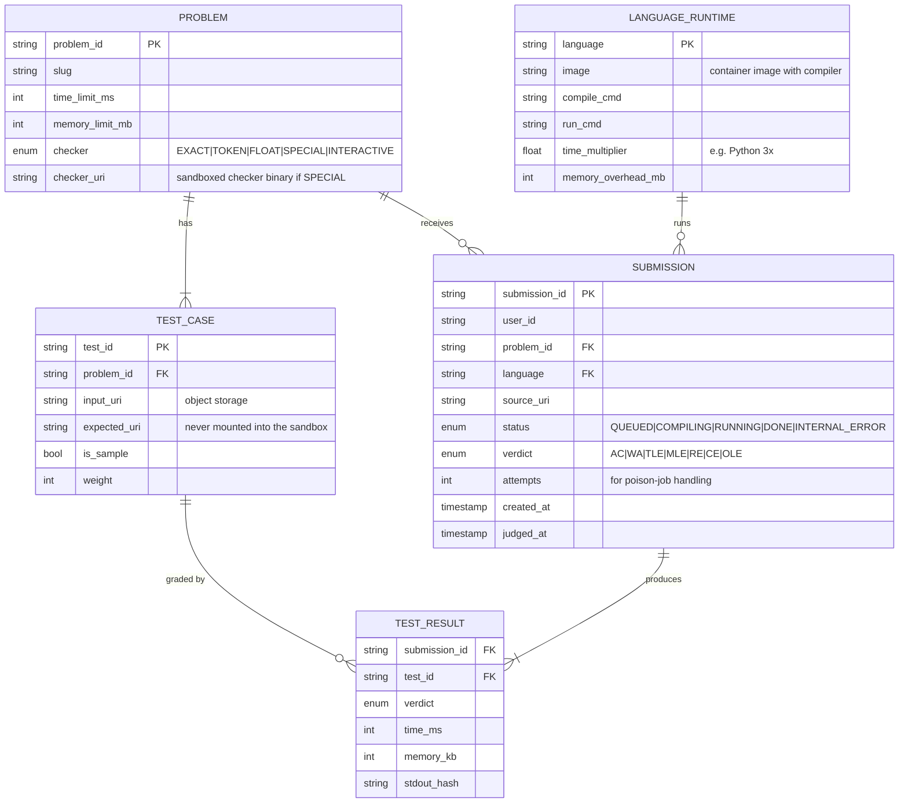
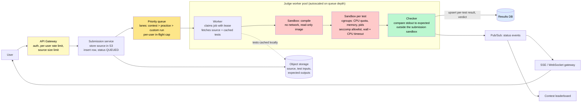
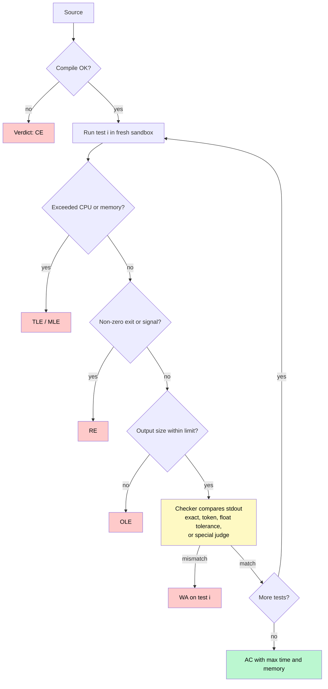

# Design an Online Code Judge (LeetCode / HackerRank)

> Run millions of **untrusted programs** a day — each compiled, executed against hidden test cases under strict time and memory limits, and graded in seconds — without letting any of them read the answers, escape the sandbox, or starve everyone else during a contest.

**Difficulty:** ⭐⭐⭐ · **Builds on:**
[Message Queues](../../Level-03-Communication/04-Message-Queues/README.md) ·
[Containers & Orchestration](../../Level-06-Scale-and-Reliability/07-Containers-and-Orchestration/README.md) ·
[Security at Scale](../../Level-06-Scale-and-Reliability/05-Security-at-Scale/README.md) ·
[Rate Limiting](../../Level-03-Communication/07-Rate-Limiting/README.md)

---

## 1. 🎯 Problem & Scope

A user pastes a solution in one of twenty languages and hits **Submit**. Within a few seconds they expect a verdict: Accepted, Wrong Answer on test 7, Time Limit Exceeded, Memory Limit Exceeded, Runtime Error, or Compilation Error — with the time and memory their code used.

Behind that button is a system that has to execute *arbitrary code written by strangers* — code that might fork-bomb the host, open a socket, read the expected outputs off disk, or simply loop forever — and do it fairly for thousands of people at once when a contest starts. Every property that makes normal services easy (trusted code, predictable resource use, smooth traffic) is inverted here.

**In scope:** the submission API and lifecycle, queueing and prioritization, the execution sandbox, resource limiting and fair measurement, the verdict pipeline and checkers, result delivery, contest spikes, abuse prevention.

**Out of scope:** the problem-authoring workflow, the in-browser editor, editorial content, and paid course features.

---

## 2. 📋 Requirements

### Functional
- `submit(problem, language, source)` → a submission ID, then a stream of status updates ending in a verdict.
- Run the submission against **N hidden test cases**, each with a time limit and memory limit; report per-test results.
- Support **custom input runs** ("test my code with this stdin") at lower priority.
- Support **20+ languages** with per-language compile and run commands and calibrated limits.
- **Special checkers** for problems with multiple valid answers, and **interactive problems** where the solution talks to a judge process.
- Contests: submissions during a window feed a live leaderboard (see [Gaming Leaderboard](../35-Gaming-Leaderboard/README.md)).

### Non-Functional
- **Isolation:** submitted code cannot access the network, the host filesystem, other submissions, or the expected outputs. A malicious submission harms nothing but its own verdict.
- **Determinism:** the same code gets the same verdict every time — measurement must not depend on which machine ran it or what else was running.
- **Latency:** p50 verdict < 5 s in normal operation; < 30 s during contest peaks.
- **Throughput:** 500 submissions/s at contest start; 60/s average.
- **Fairness:** one user cannot monopolize judging capacity; contest submissions outrank practice.
- **At-least-once execution with idempotent results** — a worker crash must not lose a submission or double-count it.
- 99.9% availability; cost-efficient (sandboxes are short-lived and dense).

---

## 3. 🧮 Capacity Estimation

**Submissions**
- 5 million/day ≈ **60/s average**. Contest starts: **500/s** for a few minutes.

**Compute**
- Average submission: compile (~1 s) + ~10 tests × ~0.2 s = **~3 CPU-seconds**. Worst case (TLE on every test at a 2 s limit): ~20 CPU-seconds.
- At 500/s × 3 CPU-s = **1,500 CPU-seconds per second → ~1,500 cores** busy during a contest peak; ~200 cores on average. The queue absorbs the burst so the fleet can be sized between the two, with autoscaling and a pre-warmed pool before scheduled contests.

**Storage**
- Source: 5M × ~5 KB = **25 GB/day** into object storage; metadata rows in the database.
- Test cases: 3,000 problems × ~50 files × ~1 MB = **150 GB**, immutable, cached on every worker's local disk.
- Results: 5M × 10 tests × ~100 bytes = 5 GB/day of per-test records.

**Sandbox churn**
- 500/s × 11 sandboxes (1 compile + 10 runs) = **5,500 sandbox creations/s** at peak. Sandbox startup cost is therefore a first-order design constraint (Deep Dive 7.1).

---

## 4. 🔌 API Design

```
POST /submissions
  { problem_id, language, source }                 → { submission_id, status: "QUEUED", queue_position }

GET  /submissions/{id}
  → { status: QUEUED|COMPILING|RUNNING|DONE, verdict, tests: [{ id, verdict, time_ms, memory_kb }] }

GET  /submissions/{id}/stream                      # SSE: status transitions as they happen

POST /run                                          # custom input, lower priority, no verdict
  { language, source, stdin }                      → { run_id }

Internal (workers):
  claim job from queue (lease / visibility timeout)
  PUT /internal/submissions/{id}/tests/{n}         # idempotent per-test result upsert
  PUT /internal/submissions/{id}/verdict
```

Two design notes: the response to `POST /submissions` returns immediately with a **queue position** so the UI can show progress; and per-test results are **upserted by (submission, test)** so a retried job never double-writes.

---

## 5. 🗄️ Data Model



**Storage choices:** submission and result metadata in a relational database (status transitions, queries by user and problem); source code and test files in **object storage** (immutable, cheap, cacheable); language images in a container registry, pinned by digest so a verdict is reproducible months later.

---

## 6. 🏗️ High-Level Architecture



**Walk-through:**
1. The gateway authenticates the user, enforces a rate limit (say 1 submission per 10 s) and a 64 KB source limit, and forwards to the submission service.
2. The source is written to object storage; a row is inserted with status `QUEUED`; a job is published to the **contest** or **practice** lane with the user's ID.
3. A worker with free capacity claims the job under a **lease** (visibility timeout). If the worker dies, the lease expires and another worker claims it; the `attempts` counter caps retries.
4. The worker pulls the language image (cached), fetches the source, and ensures the problem's test inputs are on local disk (cached from object storage on first use).
5. **Compile** in a sandbox with no network and a read-only filesystem. A failure → `CE`, done.
6. For each test, spin up a **fresh sandbox** with only that test's input mounted, run under CPU/memory/pid limits and a wall-clock timeout, and capture stdout (size-capped).
7. The **checker** runs *outside* the submission's sandbox — it's the only process that ever sees the expected output — and produces a per-test verdict, which is upserted to the database and published as a status event.
8. On the first failing test (or after all tests, for partial scoring), the final verdict is written; the pub/sub event reaches the user's open SSE connection and the contest leaderboard within milliseconds.

---

## 7. 🔬 Deep Dives

### 7.1 Sandboxing untrusted code

The sandbox is the product. Defense in layers, each stopping a different class of attack:

| Layer | Mechanism | Stops |
|-------|-----------|-------|
| **Namespaces** | Separate PID, mount, network (`none`), user, and IPC namespaces | Seeing other processes, the host filesystem, any network at all |
| **Read-only root + minimal mounts** | Language image mounted read-only; a tiny writable `/tmp`; only the current test's input file | Reading expected outputs or other submissions; filling the disk |
| **cgroups v2** | CPU quota (one core), memory limit with no swap, `pids.max` (e.g. 64) | CPU hogging, memory bombs, **fork bombs** |
| **seccomp-BPF** | Syscall allowlist: no `socket`, `ptrace`, `mount`, `kexec`, and so on | Kernel attack surface, network by any route, debugging other processes |
| **rlimits** | Max output size, max open files, core dumps off | Output floods (OLE), descriptor exhaustion |
| **Timeouts** | CPU-time limit *and* a wall-clock limit (sleep loops burn no CPU) | Infinite loops, deliberate stalls |
| **Non-root, unprivileged user** | Random UID, no capabilities | Privilege escalation inside the container |

Tooling: **isolate** (the sandbox used by the International Olympiad in Informatics and the CMS contest system) and **nsjail** wrap these primitives with a single command line and are the workhorses of most judges. For stronger isolation at higher cost, **gVisor** runs a user-space kernel that intercepts syscalls (used by Google and Replit), and **Firecracker** microVMs (what AWS Lambda runs on) give hardware-level isolation with ~125 ms boot times.

| Option | Isolation strength | Startup | Density | Typical use |
|--------|--------------------|---------|---------|-------------|
| Container + seccomp (isolate, nsjail) | Good — shares the host kernel | ~10 ms | Very high | Most judges |
| gVisor | Strong — syscalls never reach the host kernel directly | ~50–100 ms | High | Multi-tenant code execution |
| Firecracker microVM | Strongest — separate kernel | ~125 ms | Medium | Untrusted long-running workloads |

At 5,500 sandbox starts per second, tens of milliseconds matter; most judges use isolate-style containers and keep a **pool of pre-created sandboxes** per language to hide startup entirely.

The one non-negotiable rule: **the expected output never enters the sandbox.** The checker compares outside, so even a full escape of the runtime can't leak answers.

### 7.2 Fair and deterministic measurement

"Time Limit Exceeded" must mean the *algorithm* was too slow, not that the worker was busy:

- Measure **CPU time** (user + system) from the cgroup, not wall time; use wall time only as a safety net at ~3× the CPU limit.
- **Pin one dedicated core per sandbox** and leave headroom on the host; never oversubscribe judging cores. Disable frequency scaling variance where possible, or calibrate limits per hardware generation.
- Measure **peak memory** from the cgroup's high-water mark, which counts what the process actually touched.
- Apply **per-language multipliers** (a Python solution reasonably gets 3–5× a C++ limit) and per-language memory overhead (a JVM needs a baseline heap).
- **Compile once, run many:** the compiled binary is reused across tests; each test still gets a fresh sandbox so state can't leak between runs.
- Re-run borderline results: a test that finishes within a few percent of the limit is executed again and the best time kept, which removes most "judge flakiness" complaints.

### 7.3 Queueing, fairness, and contest spikes

A contest start is a thundering herd by design: thousands of people submit within the same minute.

- **Priority lanes:** contest submissions are judged before practice submissions, which are judged before custom runs. Within a lane, FIFO.
- **Per-user in-flight cap** (one or two submissions being judged at once) so a script submitting 500 times can't starve the lane.
- **Autoscaling on queue depth**, with a **pre-warmed pool** spun up ten minutes before a scheduled contest — reactive scaling is too slow for a spike that lasts three minutes.
- **Visible backpressure:** the queue position returned by the API turns a silent wait into an honest "you're 340th in line, ~25 s."
- **Leases and idempotency:** a job is claimed with a visibility timeout; a crashed worker's job is re-claimed; results are upserted by (submission, test) so partial progress is never duplicated.
- **Poison jobs:** a submission that crashes the *worker* (a sandbox bug, an unexpected kernel edge case) is retried once, then marked `INTERNAL_ERROR` and alerted — never allowed to take down the fleet one worker at a time.

### 7.4 The verdict pipeline and checkers



Checker types: **exact** (byte-for-byte after trailing-whitespace normalization), **token** (whitespace-insensitive), **float** with tolerance, and **special judge** — a problem-specific program that validates an answer when many are correct ("any valid path"). Special checkers are author-written code, so they run in a sandbox too, just a different one from the submission. **Interactive problems** wire the solution and a judge process together over pipes and score the conversation.

Fail-fast (stop at the first failed test) gives fast feedback and saves compute; partial-scoring contests run every test and sum weights. The choice is per problem.

### 7.5 Result delivery

Status transitions (`QUEUED → COMPILING → RUNNING test 3/10 → DONE`) are published to a pub/sub topic keyed by submission. The web tier holds an SSE or WebSocket connection per waiting user and forwards events; clients fall back to polling `GET /submissions/{id}` if the connection drops. Per-test details are stored for the user's feedback, but hidden test inputs are never returned — only the test number, verdict, and resource usage.

### 7.6 Abuse and integrity

- **Rate limits and size limits** at the gateway; per-user in-flight caps at the queue.
- Submissions that try to open sockets, read outside their mount, or spawn beyond the pid limit simply fail with `RE` — and are logged for review.
- **Timing side-channels** (guessing test contents by measuring) are blunted by capping output and not exposing inputs.
- **Plagiarism detection** runs offline over contest submissions using token-fingerprinting (the MOSS approach), comparing normalized token streams so renamed variables don't hide a copy.

---

## 8. 📈 Scaling, Bottlenecks & Failure Modes

| Bottleneck / failure | Symptom | Mitigation |
|----------------------|---------|------------|
| Contest start spike | Queue depth explodes, verdicts take minutes | Pre-warmed worker pool, priority lanes, visible queue position |
| Sandbox startup cost | 5K starts/s dominates CPU | Pool of pre-created sandboxes per language; reuse compiled binary |
| Test-case cache miss storm | Every worker fetches 150 GB from object storage after a deploy | Warm caches from a peer/regional mirror; pin popular problems |
| Worker crash mid-job | Submission stuck in RUNNING | Lease expiry re-queues; idempotent upserts; attempts cap |
| Sandbox escape attempt | Worker compromised | Layered isolation; non-root; immutable worker images re-provisioned frequently; no secrets on workers |
| Noisy measurement | Same code gets TLE on one run, AC on another | Dedicated cores, CPU-time limits, re-run borderline tests |
| Hot problem (new daily challenge) | One problem's tests requested by every worker | Local cache handles it; tests are immutable and small |
| Results DB write burst | 500 submissions/s × 10 tests | Batch per-test writes per submission; or write results to a fast KV and project to the DB |
| Output floods | A submission prints 10 GB | rlimit on output size → OLE |

---

## 9. ⚖️ Trade-offs & Alternatives

| Decision | Chosen | Alternative | Why |
|----------|--------|-------------|-----|
| Isolation technology | Containers + seccomp (isolate/nsjail), pooled | Firecracker microVMs | 10 ms vs 125 ms startup at thousands of starts/s; VMs reserved for long-running or higher-risk workloads |
| Time limit | CPU time with wall-clock safety net | Wall time only | Wall time punishes users for a busy host |
| Test execution | Fresh sandbox per test, shared compiled binary | One sandbox for all tests | Prevents state leaking between tests at modest cost |
| Test ordering | Fail-fast by default | Run all tests | Faster feedback and less compute; partial scoring opts out |
| Queue | Priority lanes + per-user cap | Single FIFO | Contests must not wait behind practice; one user must not starve others |
| Checker location | Outside the submission sandbox | Inside, for simplicity | Expected outputs must never be readable by user code |
| Result delivery | Pub/sub → SSE, polling fallback | Polling only | Sub-second updates during contests; polling at 500/s of anxious refreshers is wasteful |
| Compute model | Long-lived workers pulling from a queue | One serverless function per submission | Sandbox pooling and test caching need warm, stateful workers |

---

## 10. 🌐 How It's Actually Done

**IOI `isolate` and CMS:** the International Olympiad in Informatics runs on CMS, whose sandbox `isolate` (namespaces + cgroups + seccomp, written by Martin Mareš) is the reference implementation of the layered design above and is reused by many university and commercial judges.

**Judge0:** the most widely used open-source judge API, built on `isolate`, with a queue of workers, per-language images, and configurable CPU/wall/memory limits — essentially this architecture in a box.

**Codeforces:** invocation queues that visibly back up during rounds, per-problem checkers written in the testlib framework (the origin of standardized special judges), and hardware-calibrated limits; their "Polygon" system is the problem-authoring side.

**LeetCode and HackerRank:** containerized judging fleets with per-language time multipliers and pre-warmed capacity ahead of weekly contests; both publish the resource limits per language rather than pretending all languages are equal.

**Replit:** moved its code execution from gVisor toward Firecracker-style microVMs as workloads became long-running and multi-tenant — a good illustration of choosing isolation strength by threat model and runtime length.

**AWS Lambda / Firecracker:** the microVM technology that makes "run untrusted code for milliseconds with hardware isolation" economical was built for exactly this class of problem and is now open source.

---

## 11. 📝 Summary

| Aspect | Decision |
|--------|----------|
| Isolation | Namespaces + read-only image + cgroups + seccomp + rlimits; non-root; expected outputs never in the sandbox |
| Measurement | CPU time from cgroups, dedicated core, peak memory, per-language multipliers, re-run borderline |
| Queueing | Priority lanes (contest > practice > custom), per-user in-flight cap, leases + idempotent results |
| Spikes | Autoscale on depth + pre-warmed pool before contests; visible queue position |
| Verdicts | Compile → per-test fresh sandbox → external checker; fail-fast unless partial scoring |
| Delivery | Pub/sub status events → SSE/WebSocket, polling fallback |
| Storage | Metadata in RDBMS; source and tests in object storage, tests cached on workers |

The 30-second whiteboard pitch: an online judge is a job queue feeding a fleet of workers whose entire job is to run code they must assume is hostile. Isolate every run with namespaces, cgroups, and seccomp; measure CPU time on a dedicated core so verdicts are fair; keep the expected answers outside the sandbox so nothing can leak; and treat contests as the scheduled thundering herd they are — priority lanes, per-user caps, and a pre-warmed pool. Everything else — checkers, streaming status, leaderboards — is ordinary distributed-systems plumbing around that hostile core.

---

[← Back to all real-world architectures](../README.md) · Related: [Gaming Leaderboard](../35-Gaming-Leaderboard/README.md) · [Distributed Job Scheduler](../21-Distributed-Job-Scheduler/README.md) · [WebSockets & Real-Time](../../Level-03-Communication/06-WebSockets-and-Realtime/README.md)
