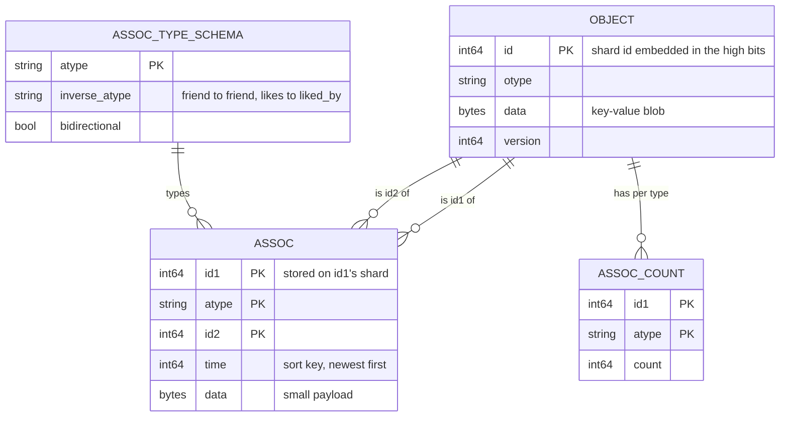
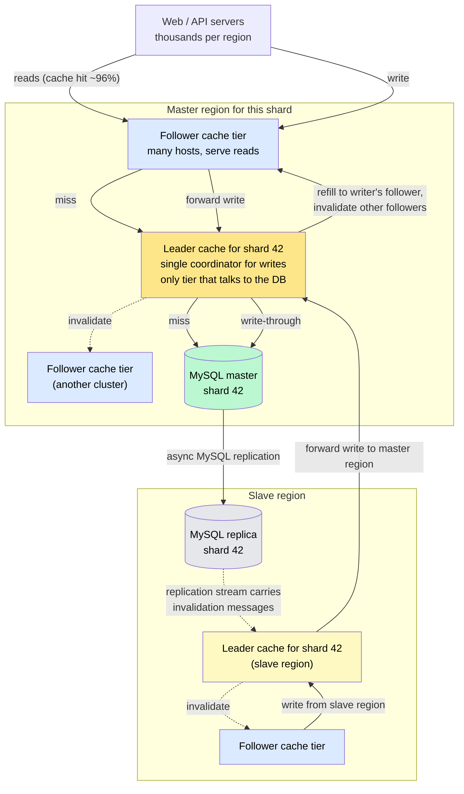
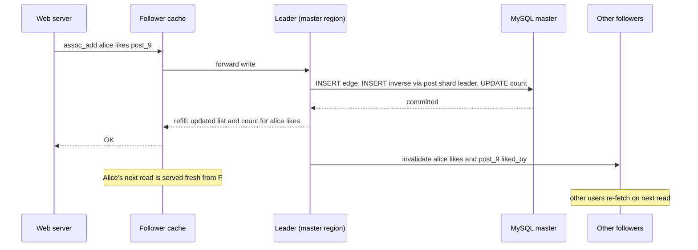

# Design a Social Graph Store (Facebook TAO)

> The read-optimized, geographically distributed store behind every "friends", "likes", and "comments" lookup — **billions of graph reads per second** served from cache, with writes consistent enough that you never watch your own comment vanish and reappear.

**Difficulty:** ⭐⭐⭐⭐⭐ · **Builds on:**
[Caching](../../Level-01-Building-Blocks/03-Caching/README.md) ·
[Sharding & Partitioning](../../Level-02-Data-Layer/02-Sharding-and-Partitioning/README.md) ·
[Database Replication](../../Level-02-Data-Layer/01-Database-Replication/README.md) ·
[Consistency Models](../../Level-04-Distributed-Systems/02-Consistency-Models/README.md)

---

## 1. 🎯 Problem & Scope

Rendering a single Facebook post touches the social graph dozens of times: fetch the post → its author → the author's name and photo → the like count → whether *you* liked it → the three most recent comments → each commenter → whether each commenter is your friend → the pages tagged in it. A news feed is a hundred posts. A home page load is **thousands of tiny graph reads**, and Facebook serves billions of such reads every second.

Before TAO, Facebook did this with PHP code reading MySQL through memcache: every product team invented its own cache keys, its own invalidation logic, and its own way of keeping "A likes B" and "B is liked by A" in sync. Cache inconsistencies were routine, thundering herds after invalidation were common, and every new feature re-solved the same problems.

TAO ("The Associations and Objects") replaced that with a **single graph-aware service**: a typed data model of objects and associations, a small API, a two-tier cache that understands the graph, and a replication design that keeps the writer's view consistent while everyone else converges within seconds.

**In scope:** the objects-and-associations data model, the API, the leader/follower cache architecture, sharding and ID design, the write path and its consistency guarantees, cross-region replication, hot objects, failure handling.

**Out of scope:** multi-hop graph queries and traversals (that's a graph database — see [Specialized Databases](../../Level-07-Big-Data-and-Specialized/08-Specialized-Databases/README.md)), feed ranking, and full-text search over the graph.

---

## 2. 📋 Requirements

### Functional
- **Objects:** typed nodes (user, post, photo, page, comment) with a 64-bit ID and a key-value data blob; create, read, update, delete by ID.
- **Associations:** typed, directed edges `(id1, type, id2)` with a timestamp and a small data blob — `friend`, `likes`, `authored`, `comment`, `tagged`.
- **Inverse associations** maintained automatically: adding `(alice, likes, post)` also creates `(post, liked_by, alice)`; `friend` is its own inverse.
- **Range queries** on an object's association list, newest first: "the 10 most recent comments on this post."
- **Counts:** "how many likes" without fetching the list.
- **Point checks:** "does Alice like this post?"

### Non-Functional
- **Read-dominated:** ~99.8% reads. Target **>1 billion reads/s**, **millions of writes/s** globally.
- Read latency of **single-digit milliseconds** from cache; **≥96% cache hit ratio** (the database cannot survive the misses otherwise).
- **Read-after-write for the writer:** a user always sees their own like, comment, or friend request immediately.
- **Eventual consistency for everyone else**, converging within seconds across regions.
- **Availability over strict consistency** — a stale like count is acceptable; an unavailable feed is not.
- Data partitioned across **thousands of MySQL shards**; the graph must grow without limit.

---

## 3. 🧮 Capacity Estimation

**Reads**
- 1B reads/s globally; assume 96% served by follower caches and most of the rest by leaders → **~40M/s of cache misses** reach leaders and at most a few million/s reach MySQL. This ratio is the whole reason for a two-tier cache.

**Writes**
- 2M/s. Every association write is two rows (edge + inverse) plus a count update → **~6M row writes/s** spread across thousands of shards, ~2–3K row writes/s per shard.

**Data**
- ~100 billion objects × ~1 KB = **100 TB**.
- Trillions of associations × ~64 bytes (ids, type, time, small data) = **hundreds of TB**, plus the `(id1, type, time)` index. Sharded MySQL with SSDs.

**Cache**
- Working set: the last few days of activity dominates. A region's follower tier holds **tens of TB** of RAM across thousands of cache hosts; leaders hold a similar amount per shard cluster.

**Sharding**
- ~10,000 logical shards. A user's outgoing edges (`friend`, `likes`) live on the user's shard; a post's incoming edges (`liked_by`, `comment`) live on the post's shard. Each association list is therefore **single-shard** and range queries never fan out.

---

## 4. 🔌 API Design

TAO's API is deliberately small — a graph primitive set, not a query language:

```
# Objects
obj_add(otype, data)                        → id
obj_get(id)                                 → (otype, data)
obj_update(id, data)
obj_delete(id)

# Associations
assoc_add(id1, atype, id2, time, data)      # also writes the inverse edge and bumps the count
assoc_delete(id1, atype, id2)
assoc_change_type(id1, atype, id2, newtype) # e.g. friend_request → friend

# Queries — all served from an association list sorted by time, newest first
assoc_get(id1, atype, id2set, high?, low?)  → the edges to the listed id2s (point checks: "does Alice like this?")
assoc_count(id1, atype)                     → int
assoc_range(id1, atype, pos, limit)         → newest edges from position pos ("latest 10 comments")
assoc_time_range(id1, atype, high, low, limit) → edges in a time window
```

Every call is keyed by a single `(id1, atype)` — the association list — which is exactly the unit the cache and the shard are organized around. There is no join, no traversal, no "friends of friends": those are composed in the application from many single-hop calls, all served from cache.

---

## 5. 🗄️ Data Model



**Design decisions:**
- **IDs embed the shard.** A 64-bit object ID carries its shard number, so any server can route a request for `id1` to the right shard with no lookup — and an object's association lists are stored on its own shard.
- **Associations are indexed by `(id1, atype, time DESC)`.** That single index serves `assoc_range`, `assoc_time_range`, and `assoc_get` for one list.
- **Counts are a separate row** because scanning a list of 40 million likes to count them is not an option; the count is updated in the same transaction as the edge.
- **Inverse types come from a schema**, so the storage layer — not each product team — knows that adding `likes` requires adding `liked_by` on the *other* object's shard. That cross-shard write is the one place TAO accepts non-atomicity: the forward edge commits first, the inverse follows, and a repair job reconciles any stragglers.

---

## 6. 🏗️ High-Level Architecture



**Walk-through (read, cache miss):**
1. A web server asks its local **follower** cache for `assoc_range(post_9, comment, 0, 10)`.
2. Miss. The follower forwards to the **leader** responsible for shard 42 (the post's shard). Many followers for the same shard share that one leader, so if a thousand followers miss at once, the leader **coalesces** them into one database read — no thundering herd.
3. Leader miss → one query to MySQL shard 42 → the leader caches the list and count, returns to the follower, which caches and returns to the web server.

**Walk-through (write):**
1. Alice likes post 9. Her web server sends `assoc_add(alice, likes, post_9)` to its follower.
2. The follower forwards to the leader for **Alice's shard** (the forward edge lives with `id1`). The leader writes through to MySQL synchronously.
3. The leader then asynchronously writes the **inverse** `(post_9, liked_by, alice)` via the leader of post 9's shard, and bumps the `likes` count.
4. The leader sends a **refill** to the follower that originated the write (so Alice's next read is served fresh — read-after-write) and **invalidations** to all other followers for those keys.
5. If Alice is in a slave region, her follower forwards to the *slave-region leader*, which forwards to the *master-region leader*; the master writes MySQL; the write rides the MySQL replication stream back to the slave region, whose leader emits invalidations when it arrives.

---

## 7. 🔬 Deep Dives

### 7.1 Why a typed graph API beats memcache-plus-conventions

With lookaside memcache, every team wrote code like "on like: update DB, then delete cache keys `post:9:likes`, `post:9:like_count`, `alice:likes`, and the inverse…" — and got it subtly wrong. TAO moves that knowledge into the service:

- The **schema** knows the inverse type, so one `assoc_add` maintains both directions and the count.
- The **cache** understands that an association *list* is the unit — a write to the list updates the cached list and count in place instead of blowing them away.
- **Invalidation and refill are server-driven**, so there is no client code to forget.

The price is a narrow API: no joins, no traversals. Facebook judged that a fast, correct single-hop API composed in the application beats a rich query language that can't be cached.

### 7.2 The two-tier cache and shard-aware placement

The leader/follower split solves two problems at once:

- **Read capacity:** followers are numerous and stateless with respect to correctness; add more to serve more reads. Each follower cluster is a full copy of the hot set for the shards it serves.
- **Coherence:** all followers for a shard funnel writes and misses through **one leader**, so there is exactly one place that knows the latest state of shard 42 and exactly one source of invalidations. Multiple followers can never disagree for long, and a miss storm becomes a single database read.

Leaders are themselves sharded — a leader tier is a consistent-hashing ring where each leader owns a range of shards — so the coordination point scales with shards, not with total traffic.

### 7.3 The write path and what "consistent" means here

TAO chose a precise, limited guarantee:

- **Writes are write-through** to the master region's MySQL before acknowledgment. A confirmed like is durable.
- **Read-after-write for the writer** is guaranteed by the **refill**: the leader pushes the new value to the follower the write came from *before* replying. Alice's next request hits that follower and sees her like.
- **Everyone else is eventually consistent.** Other followers receive an invalidation and re-fetch on the next read; other regions converge when the replication stream delivers the write and its invalidation — typically **within a second or two**.
- **Version numbers** on objects and lists let a follower reject a refill or replication-driven update that is older than what it already has, so out-of-order messages can't roll a value backwards.
- For the rare read that must be fresh across regions (a privacy check right after a setting change), the application can mark it **critical**, and the follower forwards it to the master region.

This is a deliberate trade: the person who acted sees the effect instantly, and the stale window for everyone else is short enough to be invisible — while the system never blocks a write on cross-region coordination.



### 7.4 Sharding, IDs, and the inverse-edge problem

Putting an object's association lists on the object's own shard makes every list query local — but an association has *two* ends. `(alice, likes, post_9)` lives on Alice's shard; the inverse `(post_9, liked_by, alice)` lives on the post's shard. TAO writes the forward edge synchronously and the inverse **asynchronously through the other shard's leader**, accepting a brief window where one direction exists without the other, and running a background **repair** that reconciles the two. In practice the window is milliseconds and the trade-off buys single-shard writes for the common path.

Shard assignment is stored in a small, replicated mapping so shards can be **moved** between database hosts (to rebalance or to split a hot shard) without changing any ID.

### 7.5 Hot objects and giant lists

A viral post gets 40 million likes and a million comments; a celebrity has 100 million followers. The design absorbs it because:

- The **count** is a single cached row — no list scan.
- **`assoc_range` only fetches the newest N** — the cache holds the head of the list, not all 40 million entries.
- **Followers replicate hot keys** naturally: every follower cluster that sees the post caches it, so a hot object's reads spread across the whole follower tier rather than hammering one host.
- The web tier adds a **short-TTL in-process cache** for the very hottest objects, and reads of a wildly hot key can be served slightly stale on purpose.

What the design does *not* do well is "give me the full list of 40 million likes" — and that is intentional; no product needs it.

### 7.6 Failures

- **Follower host down:** its clients hash to another follower; the only cost is cold-cache misses, which the leader coalesces.
- **Leader down:** followers for that shard temporarily route through a replacement leader or read the database directly with weaker consistency until the leader is back; writes for the shard queue briefly.
- **MySQL master down:** a replica is promoted. Because replication is asynchronous, the last moments of writes may be lost or delayed — acceptable for likes, and the reason financially significant data does not live in TAO.
- **Lost invalidation:** versioning plus a periodic refresh of long-lived cache entries bounds the staleness.
- **Region partition:** the slave region keeps serving reads from cache and its replica; writes that need the master region fail or queue, degrading gracefully instead of splitting the brain.

---

## 8. 📈 Scaling, Bottlenecks & Failure Modes

| Bottleneck / failure | Symptom | Mitigation |
|----------------------|---------|------------|
| Cache hit rate drops below ~95% | MySQL overload, latency spikes | More follower RAM; longer TTLs on immutable objects; leader coalescing |
| Hot shard (celebrity) | One leader and DB shard saturated | Split the shard; followers absorb reads; count and head-of-list caching |
| Cross-region write latency | Slave-region writes wait on the master region round-trip | Accept it (writes are 0.2%); place a shard's master region near its most active users |
| Inverse-edge lag | "Liked by" appears a moment after "likes" | Async inverse via leader plus repair job; UI reads the forward edge for the actor |
| Invalidation storm | A massive fan-out update (page rename) invalidates millions of keys | Rate-limit invalidations; favor refills for hot keys |
| Replication lag | Slave regions serve stale data longer | Monitor lag; critical reads go to master |
| Leader failure | Writes for a shard pause | Fast leader failover within the leader ring; queued writes drain |

---

## 9. ⚖️ Trade-offs & Alternatives

| Decision | Chosen | Alternative | Why |
|----------|--------|-------------|-----|
| Consistency | Eventual, with read-after-write for the writer | Strong everywhere | Billions of reads/s across regions cannot wait on coordination; the writer's view is what users notice |
| Cache strategy | Write-through with server-driven refill/invalidate | Lookaside memcache | Removes cache-management logic from every product team; fixes inconsistency at the source |
| Cache topology | Leaders per shard + many followers | Flat cache pool | Leaders give coherence and miss-coalescing; followers give capacity |
| API | Fixed graph primitives | Query language / traversal engine | Every call maps to one cacheable, single-shard list |
| Storage engine | Sharded MySQL | Native graph database | Operational maturity and existing sharding expertise; one-hop access needs no graph engine |
| Inverse edges | Async with repair | Two-phase commit across shards | Single-shard synchronous writes on the hot path; brief asymmetry is harmless |
| Cross-region | One master region per shard, async replication | Multi-master | Avoids write conflicts; writes are rare enough to forward |

---

## 10. 🌐 How It's Actually Done

**Facebook TAO (USENIX ATC 2013):** the paper reports the system serving over a billion reads and millions of writes per second across many data centers, with a 96%+ cache hit rate, replacing the memcache-lookaside pattern that preceded it. Everything above — objects/associations, the leader/follower tiers, write-through with refill, master/slave regions with invalidations carried by the replication stream — is the published design. Instagram adopted TAO after its acquisition, which is why "likes" behave identically on both apps.

**FlightTracker and RAMP-TAO (2020–2021):** later Facebook papers extend TAO's guarantees — FlightTracker tracks a user's recent writes so read-your-writes holds even across services and regions, and RAMP-TAO adds read atomicity so a page never sees half of a multi-key update — all while keeping the eventual-consistency fast path.

**Twitter FlockDB (2010):** a simpler MySQL-backed graph store for the follower graph, optimized for the same operations (adjacency lists, counts, set intersections), showing the pattern predates and generalizes beyond Facebook.

**LinkedIn's graph service:** keeps the member graph **in memory, partitioned**, because LinkedIn's signature feature — "2nd-degree connection" — needs multi-hop computation that a single-hop cache can't provide; a reminder that the right design depends on which queries dominate.

**Pinterest Zen:** a graph storage service on HBase with the same objects-and-edges API shape, built explicitly with TAO as the model.

---

## 11. 📝 Summary

| Aspect | Decision |
|--------|----------|
| Data model | Typed objects + typed, timestamped associations with automatic inverses and counts |
| API | Single-hop primitives: get, range, count, add, delete — every call keyed by one association list |
| Sharding | Shard ID embedded in the object ID; lists live with their `id1`; single-shard reads |
| Cache | Follower tier for capacity, one leader per shard for coherence and miss coalescing; ≥96% hit rate |
| Writes | Write-through to the master region; refill the writer's follower; invalidate the rest |
| Consistency | Read-after-write for the writer, eventual (seconds) for everyone else, critical reads to master |
| Regions | One master region per shard; async MySQL replication carries invalidations to slave regions |
| Hot objects | Cached counts and list heads; followers replicate hot keys; short in-process cache |

The 30-second whiteboard pitch: the social graph is billions of tiny, cacheable, single-hop reads and a trickle of writes — so build a typed graph API whose every call is one association list, put that list on its object's shard, and cache it in two tiers: many followers for throughput, one leader per shard for coherence. Write through to the master region, refill the writer's cache so they see their own action instantly, invalidate everyone else and let them converge in seconds. Don't try to be a graph database; be the world's most disciplined cache with a schema.

---

[← Back to all real-world architectures](../README.md) · Related: [News Feed (Twitter/X)](../06-News-Feed-Twitter/README.md) · [Instagram](../07-Instagram/README.md) · [Distributed Cache (Redis)](../18-Distributed-Cache/README.md)
