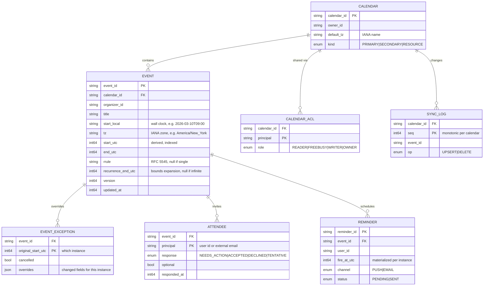
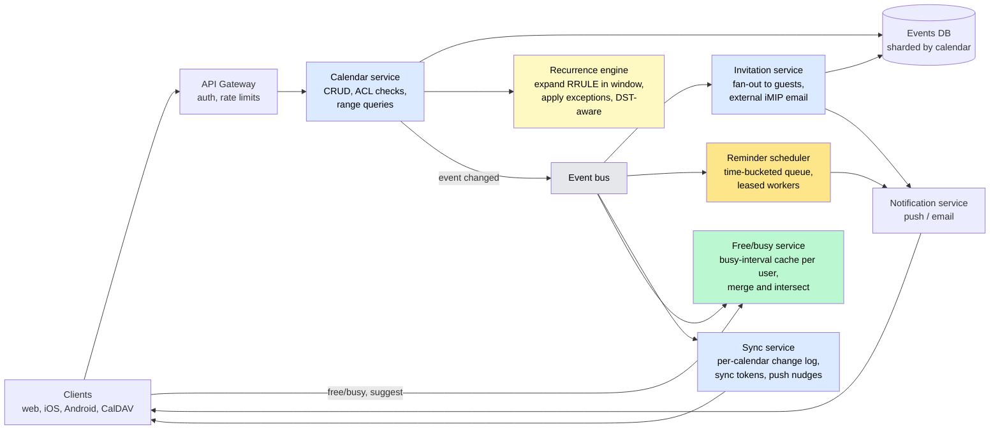
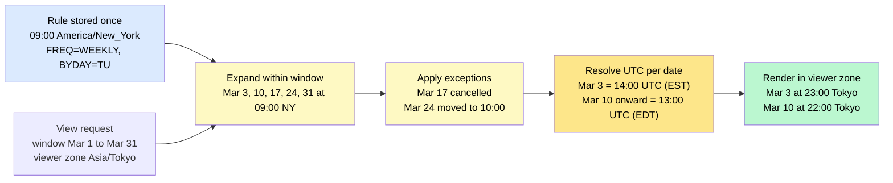
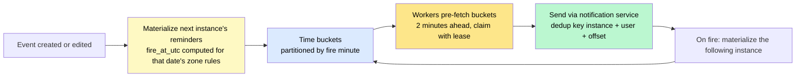

# Design a Calendar & Scheduling System (Google Calendar)

> Events, invitations, and reminders for a billion users — where "every Tuesday at 9" has to survive time zones and daylight-saving changes, a guest in Tokyo has to see the right hour, and "find a time that works for eight people" has to answer in milliseconds.

**Difficulty:** ⭐⭐⭐ · **Builds on:**
[Data Modeling](../../Level-02-Data-Layer/07-Data-Modeling/README.md) ·
[Indexing](../../Level-02-Data-Layer/03-Indexing/README.md) ·
[Notification Service](../04-Notification-Service/README.md) ·
[Distributed Job Scheduler](../21-Distributed-Job-Scheduler/README.md)

---

## 1. 🎯 Problem & Scope

A calendar looks like the simplest CRUD app imaginable: events with a start and an end. Then the requirements arrive. Events **recur** ("every other Wednesday until June, except the 14th"). They have **guests** on other accounts who can accept, decline, or propose a new time. They fire **reminders** at exact moments across a fleet of servers. They live in **time zones**, and twice a year an hour disappears or happens twice. Users edit them **offline on a phone** and expect the edits to merge. And the most valuable feature — "when are all eight of us free?" — is a query across eight people's calendars that must feel instant.

**In scope:** personal and shared calendars, single and recurring events with exceptions, cross-account invitations and RSVP, range views, free/busy and time suggestion, reminders, sharing permissions, multi-device sync.

**Out of scope:** video-conferencing integration internals, room-booking optimization (treated as just another calendar), and the email delivery pipeline (see [Email Service](../32-Email-Service/README.md)).

---

## 2. 📋 Requirements

### Functional
- Create, read, update, delete events on one or more calendars; recurring events with **rules and exceptions**; edit "this event / this and following / all."
- **Invite guests** (same provider or external email), track RSVPs, propagate organizer edits to every guest.
- **Views:** all events in a time range across several calendars (day/week/month).
- **Free/busy** lookup for a set of users and **suggest times** for a meeting of a given length.
- **Reminders** by push and email at configured offsets before an event.
- **Sharing:** per-calendar read/write permissions; secondary calendars (team, holidays, rooms).
- **Sync:** incremental changes to mobile and desktop clients, including offline edits.

### Non-Functional
- 500M monthly users; **read-heavy** (~50 views per write).
- View load **p99 < 200 ms**; free/busy for 10 people **< 300 ms**.
- Reminders delivered within **±30 s** of the scheduled instant — including across DST transitions.
- A user's own edits are **strongly consistent**; guests' views converge within seconds.
- Durable: an accepted meeting is never lost. **99.99%** availability.
- Correct for the ugly cases: recurring events with thousands of instances, non-existent and ambiguous local times, guests in different zones.

---

## 3. 🧮 Capacity Estimation

**Users and traffic**
- 500M MAU, ~150M DAU. ~10 view loads/day → **1.5B views/day ≈ 17K/s**, ~85K/s at the morning peak.
- ~2 event writes/user/day → 300M/day ≈ **3.5K/s**, plus RSVPs and edits.

**Storage**
- ~5B stored events × ~1 KB (fields + attendees) = **~5 TB**, plus indexes. Recurring events are stored as **one rule plus exceptions**, not expanded — a weekly meeting over five years is 1 row, not 260.
- Attendee rows: ~3 per event → 15B × 100 B = 1.5 TB.

**Reminders**
- ~300M reminders/day ≈ 3.5K/s average, but **massively bursty**: most meetings start at :00 or :30, so the 8:50 a.m. "10 minutes before" burst is **50–100× the average** in a single minute. The reminder system is designed around that spike, not the average.

**Free/busy**
- 20M lookups/day; each touches ~8 calendars → 160M calendar reads/day, served from precomputed busy-interval caches.

---

## 4. 🔌 API Design

```
POST  /calendars/{cal}/events
      { title, start: {dateTime, timeZone}, end: {...}, recurrence: ["RRULE:FREQ=WEEKLY;BYDAY=TU;UNTIL=20260630"],
        attendees: [{email, optional}], reminders: [{method, minutes}] }
PATCH /events/{id}?scope=this|following|all      # recurring edit scope
DELETE /events/{id}?scope=...

GET   /calendars/{cal}/events?timeMin&timeMax&expandRecurring=true   # instances materialized for the window
GET   /events/{id}/instances?timeMin&timeMax

POST  /freebusy   { attendees: [...], timeMin, timeMax }             → busy intervals per attendee
POST  /suggest    { attendees, durationMinutes, window, workingHoursOnly } → ranked candidate slots

POST  /events/{id}/rsvp   { status: accepted|declined|tentative, proposedTime? }

GET   /calendars/{cal}/sync?syncToken=...        → changed/deleted events since token + new token
```

Two conventions carry most of the weight: start/end carry an **explicit IANA time zone** alongside the wall-clock time, and recurrence is expressed in **RFC 5545 RRULE** — the standard every other calendar (Outlook, Apple, CalDAV) also speaks, which makes interoperability possible.

---

## 5. 🗄️ Data Model



**Storage choices:**
- A **relational store sharded by `calendar_id`** (Spanner, CockroachDB, or sharded PostgreSQL). A user's views are single-shard; invitations are the cross-shard case (Deep Dive 7.2).
- Indexes: `(calendar_id, start_utc)` for single events; `(calendar_id, recurrence_end_utc)` so recurring rules that could produce instances in a window are found without scanning every rule ever created.
- Reminders in a **time-bucketed table** partitioned by fire minute, because the access pattern is "everything due in the next 60 seconds."

---

## 6. 🏗️ High-Level Architecture



**Walk-through — creating "Team sync, weekly, Tuesdays 9:00 New York, 5 guests, remind 10 min before":**
1. The client sends the event with `start_local = 09:00`, `tz = America/New_York`, and the RRULE. The calendar service checks the user's write permission, stores **one row** plus five attendee rows, computes `start_utc` for the first instance and `recurrence_end_utc`, and publishes `EventCreated`.
2. The **invitation service** consumes it: for guests on the same provider it writes a lightweight reference on each guest's calendar shard; for external guests it sends an iCalendar invitation email.
3. The **reminder scheduler** materializes the reminder for the *next* instance only (10 minutes before next Tuesday 9:00 NY, converted to UTC at that date — so it's correct across DST) and re-materializes after each fire.
4. The **sync service** appends to each affected calendar's change log and pushes a "changes available" nudge to connected devices.
5. A guest in Tokyo opens next week's view. The calendar service finds the rule via the `recurrence_end_utc` index, the **recurrence engine** expands it inside the window, applies any exceptions, and the client renders the instance at **23:00 local** — computed from the organizer's wall time and zone, not from a frozen UTC value.

---

## 7. 🔬 Deep Dives

### 7.1 Time and recurrence, done right

The single most common calendar bug is storing recurring events in UTC. "9:00 New York every Tuesday" is **14:00 UTC in winter and 13:00 UTC in summer**. Store the **wall-clock time plus the IANA zone** as the source of truth, and compute UTC instants at expansion time for the specific date, using the zone's rules for that date.

The recurrence engine implements RFC 5545: `FREQ`, `INTERVAL`, `BYDAY`, `BYMONTHDAY`, `COUNT`, `UNTIL`, plus exclusions and overrides. Rules:

- **Store rules, expand on read**, and only inside the requested window. Never expand an infinite series; `recurrence_end_utc` is null and the expansion stops at the window edge.
- **Exceptions** come in two kinds: a **cancelled instance** and an **overridden instance** (moved, renamed). Both key on the instance's original start.
- **"This and following"** splits the series: the original rule gets `UNTIL = the instant before the split`, and a new event with a new rule starts at the split. The past stays untouched; the future gets the edit.
- **DST edge cases** are handled explicitly: a 02:30 local time on the spring-forward day **does not exist** (shift forward to 03:30); a 01:30 on fall-back day **exists twice** (pick the first occurrence, consistently). All-day and birthday events are **floating** — no zone at all — so they stay on the same calendar day everywhere.



### 7.2 Invitations across users

The organizer's event is the **single source of truth**; guests do not get full copies. Each guest's calendar holds a small **reference** (event ID, organizer's shard, the guest's own RSVP). Rendering a guest's week therefore needs the organizer's event data from another shard.

Two options, and real systems use both:
- **Join at read time** across shards, with the organizer's event cached aggressively (events change rarely, views are constant).
- **Denormalize a projection** of the event (title, time, rule) onto the guest's shard, updated asynchronously via the event bus. The guest sees an organizer's edit within seconds; the guest's *own* RSVP is written locally and is strongly consistent for them.

Conflicting updates — the organizer moves the meeting while a guest is accepting — are resolved with the event **version**: an RSVP carries the version it responded to, and a mismatch prompts "the time changed, respond again" rather than silently attaching an acceptance to a different slot.

External guests are handled with the **iTIP/iMIP** standards: an invitation is an iCalendar `REQUEST` sent by email; the reply is a `REPLY` parsed on the way back in. That is how a Google Calendar invite lands correctly in Outlook.

### 7.3 Free/busy and "find a time"

Free/busy must not leak titles or details, and it must be fast for many people. So each user gets a precomputed, **coarse busy-interval list** — merged, sorted `[start, end)` ranges with no other information — maintained on every write and cached.

A query for eight attendees over a two-week window:
1. Fetch eight busy lists from cache (misses read the calendar shard and rebuild).
2. **Merge** all intervals into one sorted list — O(n log n) — and take the complement inside the window: the free gaps.
3. Filter gaps to the requested duration, working hours in *each* attendee's zone, and optional-attendee rules.
4. Rank candidates (earliest, fewest optional conflicts, avoids lunch) and return the top few.

Rooms are just calendars with a `RESOURCE` kind, so "find a room too" is one more busy list in the merge. For very large groups (a 200-person all-hands) the service ranks slots by *attendance* rather than demanding a perfect intersection.

### 7.4 Reminders at scale — and at :00

The reminder system is a [distributed job scheduler](../21-Distributed-Job-Scheduler/README.md) with one twist: the load is concentrated in a few seconds around the hour and half-hour.

- **Materialize** a reminder row per (instance, user, offset) with its `fire_at_utc`, but only for the **next** upcoming instance of a recurring event; when it fires, materialize the following one. This keeps the table proportional to upcoming reminders, not to all future instances.
- Store reminders in **buckets by fire minute**. Workers claim whole buckets under a lease (visibility timeout), send via the notification service, mark `SENT`, and release.
- **Pre-fetch** the :00 and :30 buckets a couple of minutes early and spread sends across the preceding seconds; a reminder delivered 15 s early is fine, one delivered 3 minutes late is not.
- Event **edits invalidate** their pending reminders (delete and re-materialize); a **DST rule change** or a user changing their zone triggers re-materialization for affected events.
- Delivery is **at-least-once with a dedup key** `(instance, user, offset)` so a retried bucket never double-pings.



### 7.5 Sync and offline edits

Every calendar has a **monotonic change sequence**. A client holds a **sync token** (the last sequence it saw) and asks for everything after it; deletions appear as **tombstones** in the change log so a client can remove them. Servers push a lightweight "something changed" signal (WebSocket or mobile push) so clients sync promptly instead of polling. A token older than the log's retention forces a full resync.

Offline edits are sent with the event **version** the client last saw. If the server's version matches, the edit applies; if not, the server merges **field-by-field** where the fields don't overlap (client changed the title, someone else changed the room) and returns a conflict for the same-field case, which the client resolves by re-applying on the latest version. Titles, times, and attendee lists are treated as separate fields so that most real conflicts merge cleanly.

### 7.6 Range views and their queries

"Events overlapping [min, max]" is `end_utc > min AND start_utc < max` — a classic mistake is checking only `start` and missing an event that began before the window. Recurring rules need a **second query**: rules with `recurrence_end_utc >= min` (or null) and `start_utc < max`, then expansion. A week view across five calendars is ten small indexed queries, easily parallelized; the expanded window is cached per (calendar, window) and invalidated by the change log.

---

## 8. 📈 Scaling, Bottlenecks & Failure Modes

| Bottleneck / failure | Symptom | Mitigation |
|----------------------|---------|------------|
| Reminder burst at :00 | Minute-long backlog, late pings | Pre-fetch and smooth sends; scale workers by bucket size; prioritize by offset |
| Hot shared calendar (company holidays, 2M viewers) | One shard's reads saturate | Cache expanded windows; read replicas; treat as immutable and CDN-cache the JSON |
| All-hands invite to 20,000 guests | Fan-out storm on one write | Asynchronous, rate-limited fan-out; guests see the invite within seconds, not in the same request |
| Free/busy for very large groups | Merge of hundreds of lists | Attendance-ranked slots; cap attendees per query; cached busy lists |
| Recurring rule with no end and a small interval | Expansion explodes | Window-bounded expansion; instance caps per request |
| DST rule change (governments do this with weeks of notice) | Materialized UTC instants wrong | Zone database updates trigger re-materialization; store wall time as truth |
| Clock skew on reminder workers | Early or late fires | NTP; workers compare against DB time; leases prevent double-claims |
| Sync token too old | Client can't catch up | Full resync path; logs retained for ~30 days |
| Cross-shard guest reads | View latency | Denormalized projections or aggressive caching of organizer events |

---

## 9. ⚖️ Trade-offs & Alternatives

| Decision | Chosen | Alternative | Why |
|----------|--------|-------------|-----|
| Recurring storage | Rule + exceptions, expand on read | Pre-expanded instances | Rules are tiny and edits are one write; expansion inside a window is cheap |
| Time representation | Wall time + IANA zone (UTC derived) | UTC only | UTC-only silently breaks every recurring event across DST |
| Guest data | Reference + async projection | Full copy per guest | Single source of truth; edits propagate once |
| Invitation consistency | Organizer strong, guests eventual | Strong everywhere | Guests across shards can't block the organizer's write |
| Free/busy | Precomputed coarse intervals | Query raw events per lookup | Privacy by construction and O(n log n) merges instead of per-user scans |
| Reminders | Materialize next instance only | Materialize all future instances | Bounded table size; correctness after edits and DST changes |
| Conflict resolution | Versioned, field-level merge | Last writer wins | Most concurrent edits touch different fields; LWW loses data |
| Sync | Change log + sync token + push nudge | Client polling full ranges | Bandwidth and battery; correct deletion handling via tombstones |

---

## 10. 🌐 How It's Actually Done

**Google Calendar API:** the public API is a faithful reflection of this design — events carry `start.dateTime` with `start.timeZone`, recurrence is an RRULE array, `instances` expands a series inside a window, `freebusy` returns busy intervals only, and `syncToken` drives incremental sync with tombstones for deletions. Google has described migrating Calendar's storage to Spanner for cross-region consistency.

**The iCalendar standards (RFC 5545 / iTIP / iMIP) and CalDAV:** the shared language of the whole industry. RRULE semantics, exception handling via `EXDATE` and `RECURRENCE-ID`, and invitation `REQUEST`/`REPLY` messages are all standardized, which is why calendars from different vendors interoperate at all.

**Microsoft Exchange / Outlook and Microsoft Graph:** `findMeetingTimes` exposes the free/busy-plus-working-hours ranking directly, and Exchange's long history with recurring-event exceptions is why the "this/following/all" model is the universal one.

**Calendly and Cal.com:** scheduling links precompute a host's availability from their calendars, apply buffer and notice rules, and expose bookable slots — the free/busy engine turned into a product; Cal.com's open-source code is a readable reference for slot generation across zones.

**Fastmail / JMAP Calendars:** a modern re-thinking of CalDAV that keeps the same event and recurrence model but adds efficient, token-based sync — the same sync-log design in Deep Dive 7.5.

And the required reading for anyone touching this domain: **"Falsehoods programmers believe about time"** — nearly every item on that list corresponds to a real calendar outage.

---

## 11. 📝 Summary

| Aspect | Decision |
|--------|----------|
| Truth for time | Wall-clock time + IANA zone; UTC derived per date; floating for all-day events |
| Recurrence | RFC 5545 rules + exceptions; window-bounded expansion; series split for "this and following" |
| Storage | Relational, sharded by calendar; `(calendar, start_utc)` and `(calendar, recurrence_end)` indexes |
| Invitations | Organizer's event is the source of truth; guests hold references + async projections; versioned RSVPs; iMIP for external guests |
| Free/busy | Precomputed coarse busy intervals; merge + complement; working-hours and zone aware |
| Reminders | Materialize next instance; minute buckets; pre-fetched, leased workers; at-least-once with dedup |
| Sync | Per-calendar change log, sync tokens, tombstones, push nudges; versioned field-level merge for offline edits |

The 30-second whiteboard pitch: a calendar is easy until recurrence, guests, reminders, and time zones show up — and they always show up. Store recurring events as rules with wall-clock time and a zone, expand them only inside the window you're rendering, and compute UTC per date so DST can't bite. Keep one true copy of each event with the organizer and give guests references that converge asynchronously. Precompute busy intervals so "find a time" is an interval merge, not a scan. Treat reminders as a bursty job scheduler that materializes only the next occurrence. And sync with a change log and versions, because someone is always editing on a plane.

---

[← Back to all real-world architectures](../README.md) · Related: [Notification Service](../04-Notification-Service/README.md) · [Google Drive / Dropbox (sync)](../14-Google-Drive-Dropbox/README.md) · [Clocks & Event Ordering](../../Level-04-Distributed-Systems/06-Clocks-and-Ordering/README.md)
