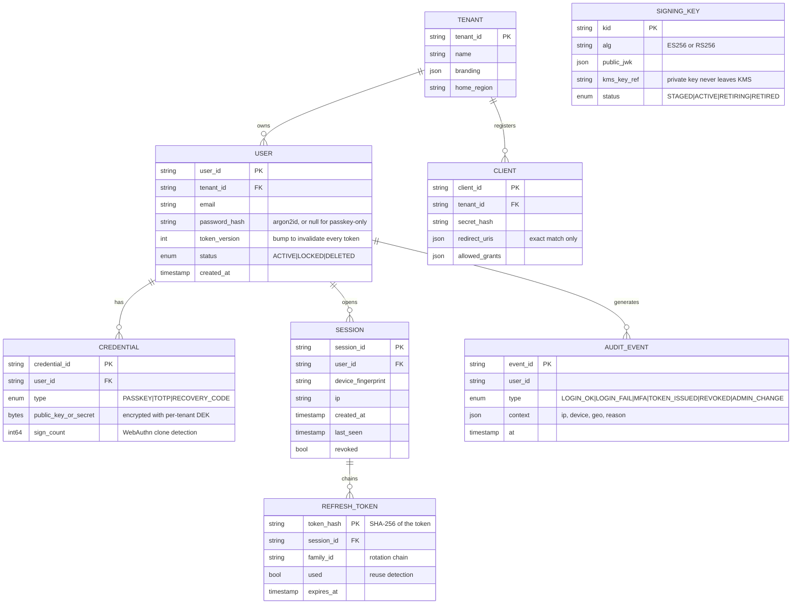
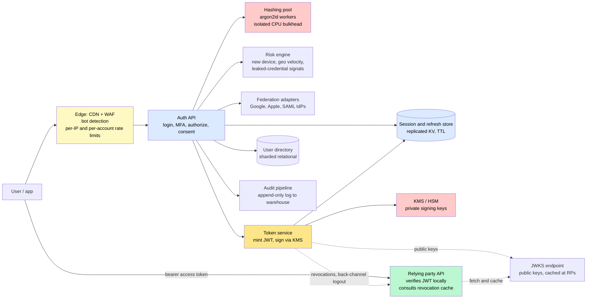
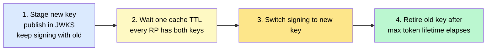

# Design an Identity & Access Management Service (Auth0 / Okta)

> The login box behind thousands of applications: issuing and verifying tokens billions of times a day, revoking access in seconds, surviving credential-stuffing floods — and staying up, because when the identity service goes down, everything that depends on it goes down with it.

**Difficulty:** ⭐⭐⭐⭐ · **Builds on:**
[Authentication & Authorization](../../Level-03-Communication/08-Authentication-and-Authorization/README.md) ·
[Rate Limiting](../../Level-03-Communication/07-Rate-Limiting/README.md) ·
[Security at Scale](../../Level-06-Scale-and-Reliability/05-Security-at-Scale/README.md) ·
[Multi-Tenancy](../../Level-05-Architecture-Patterns/10-Multi-Tenancy/README.md)

---

## 1. 🎯 Problem & Scope

Every product needs login, and almost none of them should build it. A central **identity provider (IdP)** — Auth0, Okta, Keycloak, Cognito, or the in-house one at any large company — takes on signup and login, passwords and passkeys, multi-factor authentication, social and enterprise federation, session management, OAuth 2.0 / OIDC token issuance, and the unglamorous parts: revocation, key rotation, brute-force defense, audit logs, and account recovery.

It has a property no other service has: it sits on the critical path of **every** request in every application that trusts it. A 10-minute outage at the IdP is a 10-minute outage everywhere. That shapes the design more than any feature.

**In scope:** registration and login flows; OIDC authorization-code + PKCE; access, ID, and refresh tokens; key management and JWKS; sessions and global logout/revocation; MFA and passkeys; federation (Google, SAML enterprise IdPs); brute-force and credential-stuffing defenses; multi-tenancy; audit; availability under failure.

**Out of scope:** fine-grained authorization engines (Google Zanzibar — mentioned), user-directory sync protocols (SCIM), and the relying applications themselves.

---

## 2. 📋 Requirements

### Functional
- Register and log in with password, **passkey (WebAuthn)**, social login (Google, Apple), or an enterprise IdP (SAML / OIDC federation).
- **OIDC authorization code flow with PKCE**; issue short-lived **access tokens (JWT)**, **ID tokens**, and rotating **refresh tokens**; client-credentials flow for services.
- Publish a **JWKS** endpoint so relying parties (RPs) verify tokens locally.
- **Sessions:** list, revoke one, revoke all ("log out everywhere"); back-channel logout to RPs.
- **MFA:** TOTP, push with number matching, WebAuthn; recovery codes; risk-based step-up.
- Password reset and account recovery; breached-password checks.
- Admin APIs: users, roles, tenants, clients; immutable **audit log** of every security event.

### Non-Functional
- **99.99%+ availability** — degrade gracefully, never fail closed for token *verification*.
- Login **p99 < 300 ms**; token refresh **p99 < 50 ms**; JWT verification at RPs: **zero calls to the IdP**.
- Peak **50K logins/s** and **150K refreshes/s**; revocation visible within **≤ 30 s** at gateways, instantly for sessions.
- Passwords hashed with **argon2id**; signing keys in **HSM/KMS**, never exported; secrets never logged.
- Withstand **credential stuffing** at millions of attempts/hour without locking out legitimate users.
- Multi-tenant isolation; GDPR deletion; SOC 2-grade auditability.

---

## 3. 🧮 Capacity Estimation

**Users and logins**
- 500M users, 100M DAU. Password/passkey logins ≈ 100M/day ≈ **1.2K/s average, ~20–50K/s at the morning peak**.

**The hashing bill** — the number that surprises people
- argon2id tuned for ~150 ms of CPU per verification. At 1.2K logins/s that's ~180 dedicated cores; at a 30K/s peak it's **~4,500 cores**. This is why (a) hashing runs in an **isolated worker pool** so a login flood can't starve token refresh, (b) rate limiting sits in front of hashing, and (c) passkeys — a cheap signature check — are attractive beyond their security benefits.

**Refresh and verification**
- Active sessions ~300M; access tokens live 15 minutes → ~300M × 4/hour ≈ **330K refreshes/s** if evenly spread; assume ~150K/s realistic peak. Refresh = one KV lookup + one signature: cheap, and it must stay cheap.
- **Verification** happens at RPs with a cached JWKS → effectively **zero** load on the IdP. JWKS fetches: cached for hours; a rotation causes one refetch per RP instance.

**Storage**
- Users: 500M × ~2 KB = **1 TB** (sharded relational).
- Sessions + refresh tokens: 300M × ~300 B = **90 GB** in a replicated KV store with TTLs.
- Audit events: ~2B/day × 300 B = **600 GB/day** to an append-only log → warehouse; hot 30 days searchable.

---

## 4. 🔌 API Design

Standard OIDC endpoints — the whole point is that clients already know how to speak them:

```
GET  /.well-known/openid-configuration          # discovery
GET  /.well-known/jwks.json                     # public signing keys, cache-control: max-age=3600

GET  /authorize?response_type=code&client_id&redirect_uri&scope=openid&code_challenge&state
POST /token   grant_type=authorization_code&code&code_verifier        → { access_token, id_token, refresh_token, expires_in }
POST /token   grant_type=refresh_token&refresh_token                   → new pair (old refresh token invalidated)
POST /token   grant_type=client_credentials                            → service-to-service access token
GET  /userinfo                                  # bearer access token
POST /revoke  token=...                         # RFC 7009
POST /logout                                    # RP-initiated; triggers back-channel logout to other RPs

POST /login              { email, password }   → session or MFA challenge
POST /mfa/challenge      { method }            /mfa/verify { code }
POST /passkeys/register  → WebAuthn challenge  /passkeys/authenticate

Admin:  /users, /users/{id}/sessions (DELETE = revoke all), /roles, /clients, /tenants, /audit?since=
```

Design notes: `authorize` returns a **single-use, short-lived code** bound to the PKCE challenge; `redirect_uri` must **exactly match** a registered value; every `/token` response includes `expires_in` so clients refresh proactively.

---

## 5. 🗄️ Data Model



**Storage choices:** users and credentials in a **sharded relational DB** (by tenant, then user) — transactions on signup and credential changes matter; sessions and refresh tokens in a **replicated KV store with TTLs** (Redis/DynamoDB) because they're hot, short-lived, and looked up by key; signing keys in **KMS/HSM** with only public JWKs in the database; audit events append-only to a log and a warehouse. Per-tenant data-encryption keys protect credential secrets ([Data Privacy & Encryption](../../Level-06-Scale-and-Reliability/09-Data-Privacy-and-Encryption/README.md)).

---

## 6. 🏗️ High-Level Architecture



**Walk-through — login and first API call:**
1. The app redirects the user to `/authorize` with a PKCE challenge. The edge applies rate limits and bot checks before anything touches the auth API.
2. The user submits a password. The auth API hands the hash comparison to the **isolated hashing pool**; meanwhile the **risk engine** scores the attempt (new device? impossible travel? credential seen in a breach?) and may demand MFA.
3. On success, a **session** is created in the KV store, an authorization **code** (single-use, bound to the PKCE challenge) is returned, and an audit event is written.
4. The app exchanges the code at `/token` (with the PKCE verifier). The **token service** mints a 15-minute JWT access token and an ID token, signs them **via KMS** (the private key never leaves it), and issues a **refresh token** stored by hash in the session store.
5. The app calls a relying party's API with the access token. The RP verifies the signature with the **cached JWKS** — no call to the IdP — checks `exp`, `aud`, and `iss`, consults a tiny local **revocation cache**, and serves the request.
6. Fifteen minutes later the app refreshes: one KV lookup, rotation of the refresh token, one KMS signature. The IdP's cost per active user is a few cheap operations per hour.

---

## 7. 🔬 Deep Dives

### 7.1 Stateless access tokens, stateful refresh tokens

The core architectural bargain: **access tokens are self-contained JWTs** so that the thousands of RPs never call the IdP on the request path — that's what makes 99.99% achievable, because RPs keep working through an IdP outage as long as their tokens haven't expired. The price is that a JWT can't be un-issued, so access tokens are **short-lived** (5–15 minutes).

**Refresh tokens** are the opposite: opaque, stored server-side (by hash), long-lived, and **rotated on every use** — each refresh returns a new token and invalidates the old one, all linked in a **family**. If an old refresh token is ever presented again, someone has a stolen copy: **revoke the whole family** and force re-authentication. Auth0 popularized this "reuse detection," and it's now the expected design.

### 7.2 Key management and rotation

- Sign with **asymmetric** keys (ES256 or RS256): RPs verify with the public key and can never mint tokens. Symmetric HS256 shared across RPs is a breach waiting to happen.
- Private keys live in **KMS/HSM**; the token service calls a *sign* API and never sees key bytes.
- Every token carries a `kid`; the **JWKS** lists the current and next keys. Rotation is a four-step dance so no RP ever sees an unknown key:



RPs cache the JWKS with the advertised TTL and **refetch on an unknown `kid`** (rate-limited, so an attacker can't force refetch storms). Keys rotate on a schedule and immediately on suspicion of compromise.

### 7.3 Revocation and "log out everywhere"

JWTs' weakness is that they're valid until they expire. The layered answer:

| Mechanism | Latency to take effect | Cost | Covers |
|-----------|------------------------|------|--------|
| Short access-token TTL | Up to 15 min | Free | Everything, eventually |
| Refresh-token revocation | Immediate for the next refresh | One KV delete | Prevents new access tokens |
| **Revocation list pushed to gateways** (session IDs, small and time-bounded) | Seconds | A few KB in memory per gateway | Kills live access tokens |
| **Token version** on the user record (bumped on "log out everywhere," password change) | Seconds, via a cached lookup at the RP | One cached read per request | All of a user's tokens |
| OIDC **back-channel logout** | Seconds | One webhook per RP per session | RP-side sessions |

The revocation list only needs to hold entries until the tokens they name would have expired anyway, so it stays tiny. Gateways refresh it every few seconds from the session store — see [Webhook Delivery](../36-Webhook-Delivery-Service/README.md) for the push side.

### 7.4 Passwords, hashing, and passkeys

- **argon2id** (memory-hard, tuned to ~100–250 ms), a **pepper** held in KMS, and **hash upgrading** on successful login when parameters change.
- **Breached-password screening** at signup and login via the k-anonymity range API (send the first 5 characters of the SHA-1, receive candidate suffixes) so the plaintext never leaves.
- The hashing pool is a **bulkhead**: its CPU is capped so a flood of bad passwords cannot degrade token refresh for everyone else.
- **Passkeys (WebAuthn):** the server stores only a public key; login is a signed challenge. No shared secret to steal or stuff, phishing-resistant by origin binding, and a signature check costs microseconds instead of 150 ms. Store the authenticator's **sign count** to detect cloned keys.

### 7.5 Credential stuffing, brute force, and lockout

Attackers replay billions of leaked email/password pairs. Defenses in layers:

1. **Edge rate limits** per IP, per ASN, and per *account*; progressive delays; CAPTCHA or device attestation escalation.
2. **Never rely on account lockout alone** — an attacker can lock any user out by guessing wrong on purpose. Prefer throttling and step-up over hard locks.
3. **Risk-based authentication:** score each attempt (new device, impossible travel, known-bad IP, credential in a breach corpus); require MFA above a threshold, block far above it.
4. **Device fingerprints and remembered devices** cut MFA friction for legitimate users.
5. **Signals to the audit pipeline** so a stuffing campaign is visible as a spike in failures per IP within a minute.

### 7.6 MFA and account recovery

TOTP (RFC 6238) with a small drift window and **last-used-counter** tracking to block replay; push with **number matching** to defeat prompt-bombing; WebAuthn as the strongest factor. **Recovery codes** are stored hashed like passwords. SMS OTP is offered only as a fallback because of SIM-swap attacks. The real weak point is **recovery**: support-desk resets are the favorite target of social engineers, so recovery is rate-limited, step-up-protected, delayed for high-value accounts, and always audited.

### 7.7 Federation and tenancy

The IdP is also a **client** of other IdPs: "Sign in with Google" (OIDC) and enterprise SAML. **Home-realm discovery** maps an email domain to a tenant's configured IdP; users are **just-in-time provisioned** on first federated login. Each tenant gets its own signing key, branding, and policies, and its data is isolated per the [multi-tenancy](../../Level-05-Architecture-Patterns/10-Multi-Tenancy/README.md) playbook — an IdP is the canonical case where a cross-tenant leak is catastrophic.

### 7.8 Availability: the service that must outlive everything

- **Multi-region active-active** for the token service: signing keys replicated across KMS regions; the session/refresh store replicated with conflict-free semantics (a user's set of sessions is an [OR-Set](../../Level-04-Distributed-Systems/09-CRDTs-and-Conflict-Resolution/README.md) — a session created in one region and revoked in another merges correctly).
- **Read-your-writes** for "I just logged in" via session-affinity to the issuing region for the first seconds.
- **Degraded modes:** if the user directory is unavailable, refresh tokens (KV store) still work; if the risk engine is down, fall back to static policy; if a federated IdP is down, show a clear error and offer password fallback where allowed.
- **No IdP dependency at verify time** is the single biggest availability lever — protect it by never adding a "call home" to the verification path.

---

## 8. 📈 Scaling, Bottlenecks & Failure Modes

| Bottleneck / failure | Symptom | Mitigation |
|----------------------|---------|------------|
| Hashing CPU saturation (login flood or attack) | Login latency spikes, refresh unaffected only if bulkheaded | Isolated hashing pool, edge rate limits, passkeys |
| JWKS refetch storm on rotation | Thousands of RPs fetch at once | Staged rotation, long cache TTL, CDN in front of JWKS |
| Revocation lag | Revoked user keeps access for minutes | Pushed revocation list + token version check at gateways |
| Session-store hot key | One account with 100K sessions (bot) | Per-user session cap, oldest-evicted |
| Federated IdP outage | Enterprise users can't log in | Clear error, cached discovery docs, password fallback per policy |
| Clock skew between IdP and RPs | Valid tokens rejected as not-yet-valid or expired | Allow 30–60 s leeway on `nbf`/`exp`; NTP everywhere |
| Authorization-code replay | Stolen code exchanged twice | Single-use codes bound to PKCE; revoke tokens if reuse detected |
| Open redirect via `redirect_uri` | Tokens sent to an attacker's site | Exact-match registered URIs, no wildcards |
| Token bloat | Huge JWTs with every role | Keep claims minimal; put permissions behind an authz service |
| Audit pipeline lag | Security team blind during an incident | Separate hot path for security-critical events |

---

## 9. ⚖️ Trade-offs & Alternatives

| Decision | Chosen | Alternative | Why |
|----------|--------|-------------|-----|
| Access token format | Self-contained JWT, 15 min | Opaque token + introspection call | Zero IdP dependency at verify time; introspection for highest-security APIs only |
| Refresh tokens | Opaque, rotating, family reuse detection | Long-lived static tokens | Theft becomes detectable and self-limiting |
| Signing algorithm | Asymmetric (ES256/RS256), keys in KMS | HS256 shared secret | RPs can verify but never mint |
| Revocation | Short TTL + pushed list + token version | Check IdP on every request | Availability and latency |
| Password hashing | argon2id with isolated pool | bcrypt in the API process | Memory-hardness and bulkheading |
| Lockout | Throttle + step-up | Hard account lock after N failures | Lockout is a denial-of-service vector |
| Sessions store | Replicated KV with CRDT semantics | Single-region relational | Global logins, region failure tolerance |
| Build vs buy | Buy for most companies (Auth0, Okta, Cognito, Keycloak, Ory) | Build | The failure modes above are expensive to learn firsthand |

---

## 10. 🌐 How It's Actually Done

**Auth0:** tenant-per-customer isolation, rotating refresh tokens with reuse detection (their documentation is the reference for the family model), staged JWKS rotation, and a rules/actions pipeline for risk-based step-up. Their status history is a reminder of how visible IdP outages are.

**Okta:** the enterprise universal directory with SAML/OIDC federation, sign-on policies, and device trust; the 2022–2023 support-system breaches are the canonical lesson that **recovery and support access** are part of the attack surface, not just login.

**Google Sign-In / Google Accounts:** OIDC at planet scale with short-lived tokens, risk-based challenges ("unusual sign-in"), and aggressive passkey adoption; Google's zero-trust "BeyondCorp" work made device state a first-class login signal.

**Keycloak, Ory Kratos + Hydra:** open-source implementations that show the internal split cleanly — an identity/session system (Kratos, Keycloak realms) and an OAuth/OIDC token server (Hydra) can be separate services.

**AWS Cognito and Cloudflare Access:** managed IdPs that lean on the same JWT + JWKS + short-TTL model, with Cloudflare adding edge-enforced access policies in front of applications.

**FIDO Alliance passkeys:** Apple, Google, and Microsoft shipped synced passkeys in 2022–2023; large sites report password-less logins are both faster and far less fraud-prone — the hashing-cost math in Section 3 is part of why IdPs push them.

**Google Zanzibar:** the reference design for the *authorization* half at scale (relationship tuples, consistent "zookies"), used by YouTube and Drive and cloned by SpiceDB and Ory Keto.

---

## 11. 📝 Summary

| Aspect | Decision |
|--------|----------|
| Protocol | OIDC authorization code + PKCE; standard endpoints and discovery |
| Access tokens | Short-lived JWTs, asymmetric signatures, verified locally at RPs via cached JWKS |
| Refresh tokens | Opaque, hashed at rest, rotated per use, family reuse detection |
| Keys | Private keys in KMS/HSM; staged four-step rotation; `kid` in every token |
| Revocation | Short TTL + pushed revocation list + per-user token version + back-channel logout |
| Passwords | argon2id in an isolated pool, pepper in KMS, breach screening; passkeys preferred |
| Abuse | Edge rate limits, risk-based MFA, throttling instead of lockout |
| Availability | Multi-region active-active tokens and sessions; degraded modes; no IdP call at verify time |

The 30-second whiteboard pitch: an identity service is two systems with opposite personalities. The **token path** must be stateless and boring — short JWTs signed by keys that live in an HSM, verified anywhere with a cached public key, so nothing depends on the IdP being up. The **login path** must be paranoid and stateful — hashing in its own bulkhead, rate limits and risk scoring in front, MFA and passkeys behind, rotating refresh tokens that betray their own thieves, and revocation pushed to the edge within seconds. Get the split right, and the service that everything depends on becomes the one that never seems to be there.

---

[← Back to all real-world architectures](../README.md) · Related: [Distributed Rate Limiter](../03-Rate-Limiter/README.md) · [Webhook Delivery Service](../36-Webhook-Delivery-Service/README.md) · [Data Privacy, Encryption & Compliance](../../Level-06-Scale-and-Reliability/09-Data-Privacy-and-Encryption/README.md)
