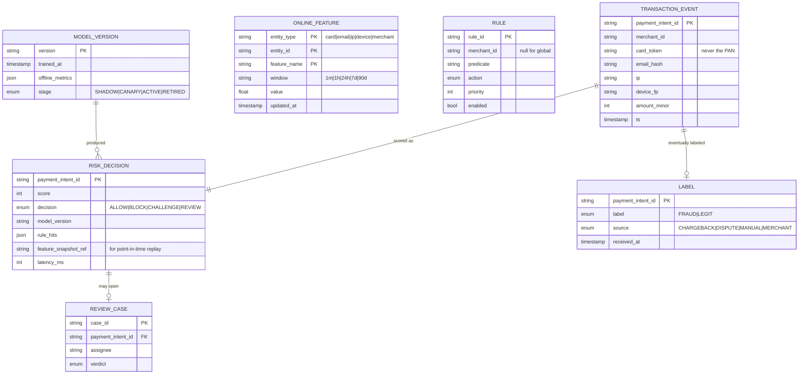
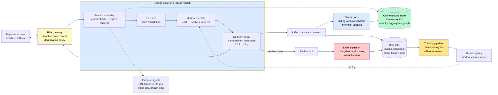
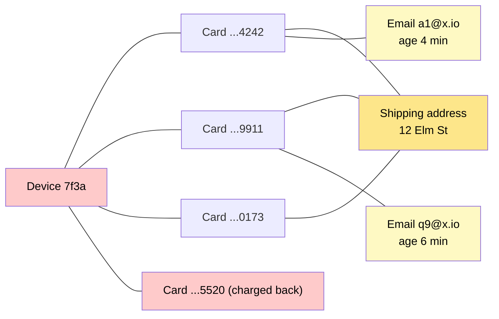

# Design a Real-Time Fraud Detection System (Stripe Radar)

> Score every payment in under 100 milliseconds, inside the authorization request, using features computed from the last few seconds and the last few years — then learn from chargebacks that arrive months later, all without blocking the honest customers who pay the bills.

**Difficulty:** ⭐⭐⭐⭐ · **Builds on:**
[Stream Processing](../../Level-07-Big-Data-and-Specialized/02-Stream-Processing/README.md) ·
[Recommendation & ML Systems](../../Level-07-Big-Data-and-Specialized/05-Recommendation-and-ML-Systems/README.md) ·
[Payment System (Stripe)](../17-Payment-System/README.md) ·
[Probabilistic Data Structures](../../Level-07-Big-Data-and-Specialized/06-Probabilistic-Data-Structures/README.md)

---

## 1. 🎯 Problem & Scope

A card-not-present payment arrives. Somewhere in the ~1 second between the customer clicking "Pay" and the bank's authorization response, the platform must decide: is this a stolen card, a hijacked account, a bot testing numbers — or a real person buying a real thing? It has roughly **100 ms** to answer, and it is wrong in two expensive directions: a **false positive** loses the sale and insults a customer; a **false negative** becomes a chargeback with fees, and enough of them get the merchant kicked off the card networks.

The adversary adapts. Rules written on Monday are routed around by Thursday. The signals that matter are often invisible to any single merchant — the same card hitting fifty stores in a minute — which is why network-scale platforms (Stripe Radar, Adyen, PayPal) see what no one else can.

**In scope:** the synchronous scoring service and its latency budget; the feature platform (real-time velocity counters, batch aggregates, graph features) with online/offline consistency; rules plus ML decisioning; the decision policy (allow / block / challenge / review); the feedback loop from chargebacks and manual review; safe model rollout; explainability; merchant-configurable rules.

**Out of scope:** KYC/AML identity verification, the payment rails and ledger ([Payment System](../17-Payment-System/README.md)), and content/account-abuse systems beyond payments.

---

## 2. 📋 Requirements

### Functional
- `score(transaction)` → decision, risk score, and human-readable reasons, synchronously.
- **Velocity and aggregate features** per card, email, IP, device, merchant over sliding windows (1 min → 90 days).
- **Link/graph features:** entities connected through shared cards, devices, addresses; distance to known fraud.
- **Rules engine:** global rules, merchant-specific rules, allow/block lists, applied before and after the model.
- **Decision policy:** thresholds per merchant risk appetite; **3-D Secure challenge** as the middle option.
- **Feedback ingestion:** chargebacks, disputes, refunds, manual-review verdicts → labels.
- **Model lifecycle:** train, evaluate offline, shadow, canary, promote, roll back; versioned.
- **Review queue** for borderline cases with reasons shown to analysts.

### Non-Functional
- **p99 < 100 ms** end-to-end for scoring; the model itself < 10 ms.
- **20K TPS peak**; 99.99% availability with an explicit **degradation policy** (rules-only → cached score → fail-open below an amount threshold).
- Real-time features fresh within **seconds**; batch features refreshed daily.
- Quality targets: block rate on legitimate traffic **< 0.1%**, catch rate on fraud as high as precision allows.
- **Point-in-time correct** training data — no leakage of future information.
- Full auditability of every decision; **PCI**: never touch raw card numbers (tokens only).

---

## 3. 🧮 Capacity Estimation

**Traffic**
- 430M transactions/day ≈ **5K TPS average, 20K TPS peak**.

**Feature reads**
- ~200 features per score; ~120 of them are precomputed per-entity aggregates fetched from the **online feature store** → 20K × ~20 entity lookups (card, email, IP, device, merchant … × windows) = **~400K key reads/s**, served from an in-memory KV cluster at sub-millisecond latency. Batched per request.

**Velocity counter writes**
- Each transaction updates counters for ~10 entities × 5 windows = **~50 counter updates → 1M updates/s at peak**, done asynchronously by stream jobs (never in the scoring path) with sub-second lag.

**Model inference**
- A gradient-boosted tree ensemble: **1–3 ms** on CPU in-process. A DNN over sequence features: 5–10 ms — still in budget, but on the edge of it.

**Storage**
- Events: 430M/day × 2 KB = **~860 GB/day** into the data lake; 2 years retained ≈ 600 TB (compressed far less).
- Online feature store: ~2B entities × ~1 KB = **~2 TB** in memory across the cluster, TTL-pruned.
- Labels: chargebacks arrive **30–120 days** after the transaction — the defining delay of the whole system.

---

## 4. 🔌 API Design

```
POST /risk/score
  { payment_intent_id, merchant_id, amount, currency, card_token, bin, card_country,
    email, ip, device_fingerprint, billing_address, shipping_address, session_signals }
  → { decision: "allow" | "block" | "challenge_3ds" | "review",
      score: 87, model_version: "gbdt-2026-05-14",
      reasons: ["card used at 14 merchants in 10 min", "email created 3 min ago"],
      rule_hits: ["merchant:block_high_risk_bins"], latency_ms: 42 }

POST /risk/feedback
  { payment_intent_id, label: "fraud" | "legit", source: "chargeback" | "dispute_won" | "manual_review" | "merchant" }

Rules:   POST /rules  { scope: global | merchant_id, predicate: "card.velocity_10m > 5 && amount > 200", action, priority }
Review:  GET /review/queue, POST /review/{id}/verdict
Models:  POST /models/{version}/promote  { stage: shadow | canary(5%) | active }
```

Design notes: the score endpoint is called with a **hard deadline** by the payment service; `reasons` are computed for every decision (not just blocks) so reviewers and merchants can understand them; feedback is **idempotent** on `(payment_intent_id, source)`.

---

## 5. 🗄️ Data Model



**Storage choices:** transaction events and decisions are **append-only** (Kafka → lake, with a hot copy in a wide-column store for recent lookups); the **online feature store** is an in-memory KV cluster (Redis-class) keyed by `(entity, feature, window)` with TTLs; the **offline feature store** is Parquet in the lake, partitioned by day, holding the same features as *time-series* so training can reconstruct any feature's value at any past instant; rules in a relational DB, compiled and cached in every scoring node; the entity graph as adjacency lists in KV for small neighborhoods plus batch-computed components in the lake.

---

## 6. 🏗️ High-Level Architecture



**Walk-through (one payment):**
1. The payment service calls the risk gateway with a **100 ms deadline** and the tokenized transaction.
2. The scoring node assembles features: request-time features (amount, BIN country vs IP country) plus **one batched read** of ~120 precomputed per-entity features from the online store and a couple of external lookups, all in parallel with hedged requests — target 20 ms.
3. **Pre-rules** run first: an allow-list hit returns immediately; a block-list hit blocks without paying for the model.
4. The **model ensemble** (loaded in-process, no network hop) produces a calibrated probability of fraud and the top contributing features as reasons.
5. The **decision policy** maps score → action using the merchant's thresholds: allow, block, route to **3-D Secure** (the customer's bank authenticates them and liability shifts), or open a review case.
6. The decision and a **feature snapshot reference** are published to Kafka; stream jobs update velocity counters and entity links within a second so the *next* transaction from this card already sees this one.
7. Weeks later a chargeback arrives; the label joins the stored decision and snapshot, feeding the next training run.

---

## 7. 🔬 Deep Dives

### 7.1 Features: the online/offline split and point-in-time correctness

Fraud models are only as good as their features, and the features that matter are **stateful**:

| Family | Examples | Computed |
|--------|----------|----------|
| Request-time | amount, currency, BIN vs IP country mismatch, hour of day | In the scoring node |
| Velocity | transactions on this card in 10 min / 1 h / 24 h; distinct merchants per card per hour; distinct cards per device | Streaming, sub-second |
| Aggregates | average ticket for this email over 90 d; chargeback rate for this merchant; refund ratio | Daily batch + streaming refresh |
| Entity age | minutes since email first seen; days since device first seen | Streaming (first-seen registry) |
| Graph | number of cards linked to this device; size of the connected component; hops to a known-fraud entity | Streaming for 1-hop, batch for components |
| External | BIN issuer and card type, IP reputation, email-domain age, breach-corpus hits | Cached lookups |

The **feature store** pattern keeps two copies in sync: the **online** store (latest value, low-latency KV) for serving, and the **offline** store (full history, in the lake) for training. The trap is **training/serving skew**: if a training job computes "transactions in the last hour" using data that includes events *after* the transaction, the model learns from the future and collapses in production. Training joins must be **point-in-time** — each row gets the feature values *as they were* at the moment of the transaction. Storing a `feature_snapshot_ref` with every decision makes this exact rather than reconstructed.

### 7.2 Sliding-window velocity counters at scale

"How many times has this card been used in the last 10 minutes" across 1M updates/s:

- **Time-bucketed counters:** per entity, a small ring of buckets (e.g., 10 × 1-minute buckets for the 10-minute window); increment the current bucket, sum the ring on read — the same structure as a [sliding-window rate limiter](../../Level-03-Communication/07-Rate-Limiting/README.md), run by stream jobs instead of the request path.
- **Hierarchical windows** (1 m → 1 h → 24 h → 7 d) derived from coarser buckets so 90-day features don't need 90 days of minute buckets.
- **TTL** on every entity key so the store only holds entities seen recently; the long tail lives in the offline store.
- For extremely high-cardinality distinct-counts ("distinct IPs per card") use **HyperLogLog**; for heavy-hitter detection use **count-min sketch** — approximate answers are fine for features and orders of magnitude cheaper ([Probabilistic Data Structures](../../Level-07-Big-Data-and-Specialized/06-Probabilistic-Data-Structures/README.md)).
- Updates are **idempotent** on event ID so Kafka's at-least-once delivery doesn't double-count.

### 7.3 Graph features and fraud rings

Fraud comes in **rings**: one device cycling through fifty stolen cards, one shipping address receiving orders from twenty "different" customers. Individually each transaction looks fine; the *links* give it away.

- Model entities (card, email, device, IP, phone, address) as nodes and transactions as edges.
- **Streaming 1-hop features** are cheap: maintain adjacency lists in KV ("cards seen on this device," "devices seen for this card") and compute degree and overlap at scoring time.
- **Batch multi-hop features** — connected-component size, PageRank-style "fraud propagation" from labeled nodes — run nightly over the lake and are pushed to the online store as plain numbers.
- The network effect is the platform's edge: a card first seen at merchant A that was charged back at merchants B and C is a known-bad node to everyone on the platform, minutes later.



*Caption: One device, four cards, one address, brand-new emails, and a chargeback two hops away. Each transaction alone is unremarkable; the neighborhood is a ring.*

### 7.4 Rules plus ML, and the decision policy

Rules and models are not rivals:

- **Rules** encode hard constraints and *speed of reaction*: block a BIN range under active attack in minutes, allow-list a trusted partner, enforce a merchant's own policy ("no orders over $2,000 to freight forwarders"). A new attack pattern gets a rule today and a model feature next week.
- **Models** handle the gray zone with hundreds of interacting signals. Gradient-boosted trees are the workhorse (fast, robust to skewed features, explainable via feature contributions); deep models over **transaction sequences** add lift at the top end.
- Scores are **calibrated** to probabilities so thresholds mean something; each merchant chooses thresholds by risk appetite, and the platform provides the trade-off curve (block rate vs fraud caught).
- **3-D Secure challenge** is the crucial middle action: instead of a binary block/allow, route uncertain transactions to the customer's bank for authentication; on success **liability shifts** to the issuer.
- Every decision carries **reasons** — the top feature contributions — so a merchant can understand a block and a reviewer can work a case. Unexplainable blocks generate support tickets and lost trust.

### 7.5 Living inside 100 ms — and degrading on purpose

The latency budget is the design constraint that touches everything:

- Model **in-process**, features **precomputed**, external lookups **cached**, feature fetch **batched and hedged**, strict per-stage deadlines.
- A **degradation ladder** the gateway walks when something is slow or down: full model → last cached score for this entity → rules-only → **fail-open below an amount threshold and fail-closed above it**. The fail-open rate is itself a monitored metric, because attackers will notice a fail-open window faster than your dashboards do.
- **Circuit breakers** on the feature store and external providers; scoring never blocks the payment beyond the deadline.

### 7.6 Labels, the feedback loop, and safe model rollout

This is where fraud systems differ from ordinary ML:

- **Labels are late and partial.** Chargebacks land 30–120 days later; some fraud never gets reported; refunds and early disputes serve as **proxy labels** to shorten the loop.
- **You never see the label for what you blocked.** A blocked transaction produces no chargeback — so a model that over-blocks looks *better* on its own labels. Mitigations: a small **exploration slice** (allow a tiny random fraction of would-be blocks), use **3DS outcomes** as ground truth for the gray zone, and evaluate on a held-out policy.
- **Class imbalance** (~0.1% fraud): metrics are precision at a fixed block rate and recall at a fixed false-positive rate, never accuracy.
- **Drift and adversaries:** monitor feature distributions and score distributions daily; retrain on a schedule *and* on detected drift.
- **Rollout:** offline evaluation on point-in-time data → **shadow mode** (score every transaction, act on none, compare) → **canary** on a few percent of traffic with guardrails on block rate and approval rate → active, with one-click rollback to the previous version. The same [canary discipline](../../Level-06-Scale-and-Reliability/08-Testing-Distributed-Systems/README.md) as any deploy, with the added twist that the "metric" is only fully known months later.

### 7.7 Humans in the loop

A **review queue** takes the uncertain middle: cases with reasons, entity history, and the graph neighborhood on one screen; verdicts within an SLA (before the order ships); every verdict becomes a **high-quality label** the same day — the fastest feedback the system ever gets. Merchant-facing tools expose rules, per-merchant thresholds, and the block/allow trade-off so the platform isn't blamed for every declined sale.

---

## 8. 📈 Scaling, Bottlenecks & Failure Modes

| Bottleneck / failure | Symptom | Mitigation |
|----------------------|---------|------------|
| Feature-store hot key (attack on one merchant/card) | One shard saturates, latency spikes | Batched reads, replica reads, per-entity request caching for a few seconds |
| Counter cardinality explosion | Memory blowup from bot-generated entities | TTLs, sketches for distinct counts, entity rate limits |
| Model latency regression on a new version | p99 breaches the budget | Latency is a canary guardrail; in-process only; fall back to previous version |
| Training/serving skew | Great offline metrics, bad production | Point-in-time joins; feature snapshot replay; parity tests |
| Label delay | Model quality unknown for months | Proxy labels, 3DS outcomes, review verdicts; shadow comparisons |
| Fail-open exploited | Fraud spike during a feature-store outage | Amount-capped fail-open, alert on fail-open rate, rules-only fallback |
| External signal outage (BIN/IP provider) | Missing features | Cached values with staleness flags; model trained with missing-value handling |
| Rule sprawl and conflicts | Contradictory actions | Priorities, scoped rules, rule impact simulation before enabling |
| Over-blocking | Merchant revenue drops silently | Block-rate guardrails per merchant; explainable reasons; exploration slice |
| PCI scope creep | Raw PAN in a feature | Tokens only; BIN (first 6–8 digits) is the maximum card data used |

---

## 9. ⚖️ Trade-offs & Alternatives

| Decision | Chosen | Alternative | Why |
|----------|--------|-------------|-----|
| Scoring timing | Synchronous in the authorization path | Asynchronous post-authorization review | Blocking fraud *before* money moves is worth the latency engineering |
| Decisioning | Rules + ML ensemble + 3DS middle path | ML only | Rules give speed of reaction and policy control; 3DS shifts liability |
| Degradation | Amount-capped fail-open | Fail-closed | Fail-closed turns an outage into lost revenue for every merchant |
| Feature freshness | Streaming velocity + daily batch | All batch | Attacks unfold in minutes |
| Distinct counts | HyperLogLog / sketches | Exact sets | Cardinality would exceed memory |
| Model family | GBDT (+ DNN on sequences) | DNN only | Latency, robustness, explainability |
| Graph features | Streaming 1-hop + batch components | Full graph DB queries at score time | Latency budget |
| Build vs buy | Buy the platform (Radar, Sift, Forter, Riskified, Adyen) for most merchants | Build | Network signals and label volume favor platforms |

---

## 10. 🌐 How It's Actually Done

**Stripe Radar:** Stripe's engineering posts describe scoring every payment in ~100 ms with models trained on the network's transactions across millions of businesses, an evolution from logistic regression to gradient-boosted trees to deep models over sequences, per-merchant rules and thresholds, 3DS routing for uncertain cases, and "Radar for Fraud Teams" review tooling — essentially the architecture above at production scale.

**PayPal:** one of the earliest and largest fraud-ML deployments; PayPal's teams have spoken extensively about graph and link analysis (shared devices, addresses, funding instruments) as the foundation of ring detection.

**Adyen RevenueProtect:** network-level risk with merchant-configurable rules and 3DS optimization; Adyen's documentation is a clear public statement of the "rules plus ML plus authentication" pattern.

**Uber's fraud systems and Michelangelo:** Uber built a general feature store into its ML platform (Michelangelo) largely because fraud and safety models needed the same real-time features across services; the online/offline split with point-in-time correctness comes from that lineage.

**Feast (originally at Gojek):** the open-source feature store that codified the online/offline pattern used here.

**Airbnb Trust & Safety:** published work on account-takeover and payment-fraud models, review tooling, and the label-delay problem for a marketplace.

**Sift, Forter, Riskified:** fraud-as-a-service vendors whose entire value proposition is the network effect — signals and labels aggregated across thousands of merchants.

---

## 11. 📝 Summary

| Aspect | Decision |
|--------|----------|
| Latency | Synchronous scoring under a 100 ms deadline; model in-process; precomputed features |
| Features | Online KV store + offline lake; point-in-time correct training; streaming velocity counters, batch aggregates, graph features |
| Decision | Pre-rules → calibrated model → per-merchant policy with 3DS as the middle path; reasons on every decision |
| Degradation | Ladder from full model to rules-only to amount-capped fail-open, with the fail-open rate monitored |
| Feedback | Chargebacks, disputes, and review verdicts as labels; proxy labels and exploration slice to counter delay and the blocked-transaction blind spot |
| Rollout | Offline eval → shadow → canary with block-rate guardrails → active; instant rollback |
| Humans | Review queue with graph context; merchant rules and threshold tooling |

The 30-second whiteboard pitch: a fraud system is a real-time feature platform wearing a model as a hat. The hard parts are keeping hundreds of stateful features fresh and point-in-time correct, fitting the whole decision inside a payment's latency budget with a deliberate degradation ladder, seeing the *network* — the device that touched four cards — rather than the transaction, and closing a feedback loop whose labels arrive months late and never arrive at all for what you blocked. Rules give you reflexes, models give you judgment, 3-D Secure gives you a third option, and humans in the loop give you tomorrow's training data.

---

[← Back to all real-world architectures](../README.md) · Related: [Payment System (Stripe)](../17-Payment-System/README.md) · [Ad Click Aggregator](../20-Ad-Click-Aggregator/README.md) · [Social Graph Store (TAO)](../42-Social-Graph-Store/README.md)
