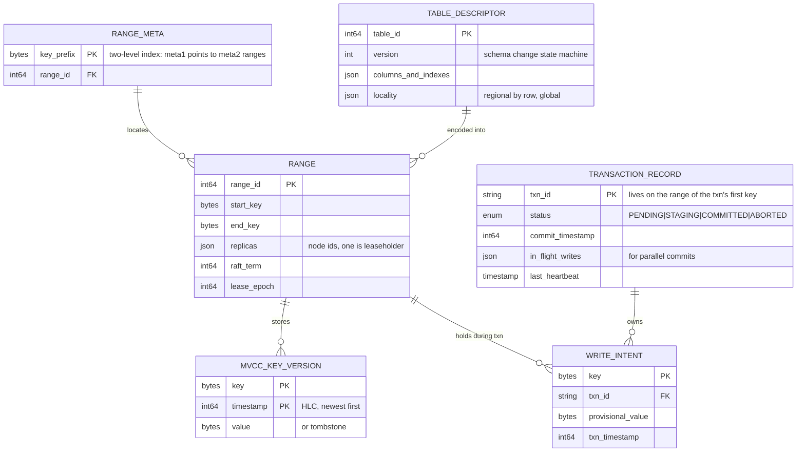
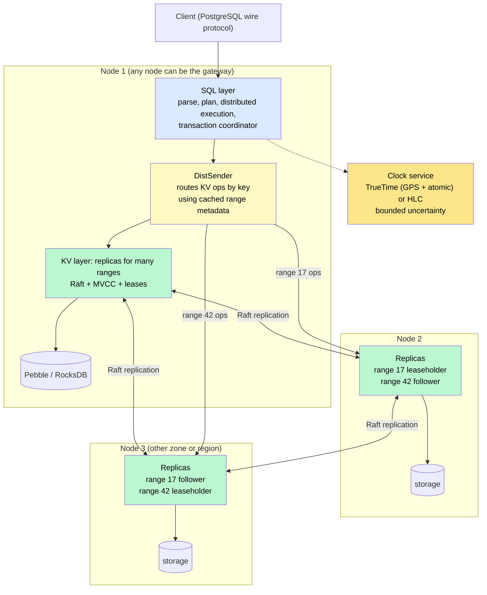
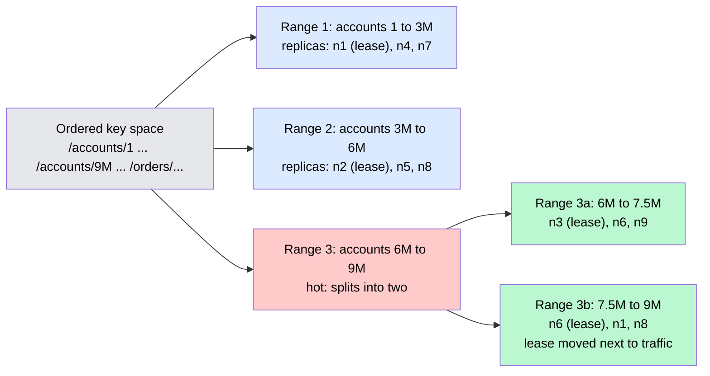
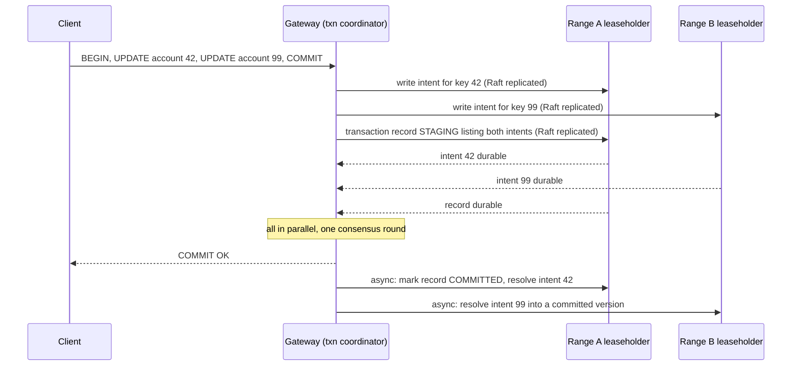

# Design a Distributed SQL Database (Spanner / CockroachDB)

> A database that speaks ordinary SQL with real ACID transactions, yet spreads itself across hundreds of nodes and several regions, survives the loss of any of them without losing a committed write, and never asks the application to think about shards — the hardest system on this list, and the one every other system quietly wishes it had underneath.

**Difficulty:** ⭐⭐⭐⭐⭐ · **Builds on:**
[Consensus — Paxos & Raft](../../Level-04-Distributed-Systems/03-Consensus-Paxos-Raft/README.md) ·
[Distributed Transactions](../../Level-04-Distributed-Systems/04-Distributed-Transactions/README.md) ·
[Clocks & Event Ordering](../../Level-04-Distributed-Systems/06-Clocks-and-Ordering/README.md) ·
[Key-Value Store (Dynamo)](../27-Key-Value-Store/README.md)

---

## 1. 🎯 Problem & Scope

Every growing product hits the same wall: one PostgreSQL primary runs out of headroom. The classic escape routes each give something up. **Manual sharding** keeps SQL on each shard but kills cross-shard joins and transactions, and it's an application rewrite. **NoSQL** scales but drops transactions, secondary indexes, and the query language everyone knows. **Read replicas** only help reads.

Google built Spanner (2012) because its ads business needed all three at once — SQL, transactions, and planet-scale — and CockroachDB, TiDB, and YugabyteDB followed with open-source designs. The idea is to build SQL *on top of* a strongly consistent, automatically sharded, replicated key-value layer, so scale and fault tolerance are handled below the SQL surface and the application sees one big database.

**In scope:** the key-value layout (ranges), replication (Raft per range) and leases, distributed transactions (MVCC, write intents, two-phase commit over Raft), timestamps and external consistency (TrueTime vs hybrid logical clocks), the SQL layer and distributed execution, follower reads, splitting and rebalancing, multi-region placement, online schema changes.

**Out of scope:** the query optimizer, columnar/analytical execution, and backup internals.

---

## 2. 📋 Requirements

### Functional
- Full SQL: tables, secondary indexes, joins, constraints including **unique** and **foreign keys**, DDL.
- **ACID transactions** spanning any rows, tables, and nodes; **serializable** isolation by default.
- **Online schema changes** with no downtime.
- **Geo-placement:** pin rows or tables to regions; global tables readable locally everywhere.
- Point-in-time and **stale reads** (`AS OF SYSTEM TIME`), backups, change feeds.

### Non-Functional
- Linear horizontal scale to hundreds of nodes and petabytes; automatic sharding — the application never sees a shard.
- **RPO = 0:** a committed write is never lost; survive node, zone, and (configurably) region failure with automatic failover in seconds.
- In-region single-row read/write latency in the low milliseconds; cross-region commits bounded by one round trip to a majority.
- **External consistency:** if transaction T2 starts after T1 commits, T2 sees T1 — everywhere.
- 99.999% availability (Spanner's published target).

---

## 3. 🧮 Capacity Estimation

**Data and ranges**
- 100 TB of table data, split into **512 MiB ranges** → ~200,000 ranges. Each range is replicated **3×** (5× for critical tables) → ~600,000 replicas.
- Across 100 nodes that's **~6,000 replicas per node**, each a Raft group — so the node must run thousands of Raft instances cheaply (batched heartbeats, quiescing idle ranges).

**Writes**
- 200K transactional writes/s cluster-wide → ~600K Raft log appends/s including replicas → each node fsyncs a batched log ~6K times/s. Requires local NVMe and group commit.

**Latency budget**
- In-region: Raft majority round trip ~1 ms + fsync ~0.5 ms + MVCC work → **2–5 ms** per write.
- Three regions with 60 ms RTT: a write whose range replicas span regions pays **one majority round trip ≈ 60 ms** — the price of surviving a region loss with RPO 0. Geo-partitioned rows with all replicas in one region stay at in-region latency.

**Metadata**
- Range addressing: a two-level index of ~200K range descriptors (a few hundred MB), cached on every node; the top level is itself a replicated range.

---

## 4. 🔌 API Design

The public API is **SQL over the PostgreSQL wire protocol** (CockroachDB, YugabyteDB) or the MySQL protocol (TiDB); Spanner speaks its own gRPC API plus SQL. What matters is what the database adds to plain SQL:

```sql
-- Ordinary transactions; the client retries on serialization failures
BEGIN;
UPDATE accounts SET balance = balance - 100 WHERE id = 42;
UPDATE accounts SET balance = balance + 100 WHERE id = 99;   -- may live on another node
COMMIT;                                                       -- error 40001 => retry

-- Stale but fast reads from the nearest replica
SELECT * FROM products AS OF SYSTEM TIME '-10s';

-- Placement is declarative
ALTER TABLE users SET LOCALITY REGIONAL BY ROW;               -- each row lives in its home region
ALTER TABLE currencies SET LOCALITY GLOBAL;                   -- replicated everywhere, local reads
ALTER DATABASE app SURVIVE REGION FAILURE;

-- Online, transactional DDL
CREATE INDEX CONCURRENTLY ON orders (customer_id, created_at);
```

Internal API between the SQL layer and the KV layer: `Get`, `Put`, `Scan`, `ConditionalPut`, batched and addressed by key, plus transaction control (`Begin`, `Commit`, `Heartbeat`, `ResolveIntent`). Every SQL statement compiles down to these.

---

## 5. 🗄️ Data Model

The trick is that **everything — rows, indexes, and system metadata — is encoded into one ordered key space**:

```
/table/<table_id>/<index_id>/<pk_value...>            → row columns (primary index)
/table/<table_id>/<secondary_index_id>/<indexed_cols>/<pk>  → (empty or covered columns)
```

Because keys are ordered, a table scan is a range scan and a secondary-index lookup is another range scan followed by a primary-key lookup. Ranges are simply contiguous slices of this key space.



**Storage engine:** each node runs an embedded LSM engine (RocksDB or CockroachDB's Pebble) holding the MVCC versions for all replicas on that node; Raft logs are written to the same engine. Older MVCC versions are garbage-collected after a retention window that also bounds how far back `AS OF SYSTEM TIME` can read.

---

## 6. 🏗️ High-Level Architecture



**Walk-through (a transfer touching two ranges):**
1. The client connects to **any node**; its SQL layer becomes the **transaction coordinator** and assigns the transaction a start timestamp from the clock.
2. `UPDATE accounts ... id = 42` compiles to a KV write for key `/accounts/42`. The DistSender looks up which range holds that key (cached metadata) and sends the write to that range's **leaseholder** on node 2.
3. The leaseholder writes a **write intent** — a provisional value tagged with the transaction ID — through **Raft** to its replicas, and creates the **transaction record** on the range of the first key written.
4. `UPDATE ... id = 99` goes the same way to range 42's leaseholder on node 3 — a second intent, replicated by *that* range's Raft group.
5. `COMMIT`: the coordinator flips the transaction record to **COMMITTED** — a single Raft write on one range. That one write is the atomic decision for the whole transaction. It acknowledges the client.
6. Asynchronously, the coordinator **resolves** the intents on both ranges into ordinary committed versions. Any reader that encounters an unresolved intent checks the transaction record and either waits, sees the committed value, or ignores an aborted one.

---

## 7. 🔬 Deep Dives

### 7.1 Ranges: splitting, merging, rebalancing, and leases

The ordered key space is cut into ranges of a target size. A range **splits** when it exceeds the size limit or when it's **hot** (load-based splitting), and small neighbors **merge**. Each range's replicas are placed under **constraints** — different nodes, zones, or regions — and a background **rebalancer** moves replicas when nodes join, die, or become unbalanced, by sending a snapshot and letting Raft catch the new replica up.

One replica per range holds the **lease** and serves all reads and coordinates writes for that range. Leases are time-bound and tied to node liveness (an epoch that a node renews by heartbeating a liveness record), so a dead leaseholder's lease expires within seconds and another replica takes over — that's the failover. The leaseholder is usually also the Raft leader, and the rebalancer keeps the lease close to where the range's traffic comes from ("follow the workload").



*Caption: Every range is its own Raft group with its own leaseholder. Splits, merges, and replica moves happen continuously and invisibly to SQL.*

### 7.2 Distributed transactions: intents, records, and one atomic flip

The elegant part: there is no separate transaction manager. A transaction's state *is* a replicated record, and its provisional writes *are* replicated intents:

- Each write is a **write intent**: the new value plus the transaction ID, stored in place of a committed version and replicated through that range's Raft group. Readers can see "there's an uncommitted write here from transaction T."
- The **transaction record** lives on the range of the first key the transaction touched (so it's replicated and highly available like any data), and holds the status.
- **Commit** is a single Raft write that sets the record to COMMITTED with a commit timestamp. Because every intent points at that record, flipping it commits every intent everywhere atomically — this is two-phase commit where the "prepare" is the intents already being durably replicated and the "decision" is one replicated write.
- **Parallel commits** (CockroachDB): instead of waiting for all intents and *then* writing the record, write the record as **STAGING** listing the in-flight writes *in parallel* with the intents; the transaction is implicitly committed once all listed intents are durable. This cuts a distributed commit to **one round of consensus latency**.
- **Conflict handling:** a reader hitting an intent from a still-pending transaction either waits or **pushes** it (forcing a decision based on priority/age); writes to a key another transaction read force a timestamp bump; the coordinator **heartbeats** its record so an abandoned transaction is detected and aborted; a wait-for graph among pushes detects deadlocks.
- **Serializability** comes from MVCC timestamps plus a **timestamp cache** of recent reads on each range: a write below a read's timestamp is bumped forward, and if the transaction's reads can't be "refreshed" to the new timestamp it restarts. Clients must be ready to retry.



*Caption: Parallel commits make a two-range transaction cost about the same as a single-range write. Any reader who finds a STAGING record checks whether all listed intents exist and can complete the commit itself.*

### 7.3 Time: TrueTime versus hybrid logical clocks

External consistency needs commit timestamps that respect real-time order across nodes whose clocks disagree.

- **Spanner / TrueTime:** GPS receivers and atomic clocks in every data center give each node a clock with a **known error bound ε** (a few ms). `TT.now()` returns an interval `[earliest, latest]`. A transaction picks a commit timestamp at `latest` and then **waits out ε** ("commit wait") before acknowledging, so that any transaction starting afterward — anywhere — gets a strictly later timestamp. Correctness is guaranteed by hardware plus a tiny pause.
- **CockroachDB / HLC:** no special hardware. Hybrid logical clocks combine wall time with a logical counter and assume a configured **maximum clock offset** (500 ms by default; a node that detects it's beyond the bound shuts itself down). Reads carry an **uncertainty interval**: a value with a timestamp inside `[read_ts, read_ts + max_offset]` *might* have committed before the read started, so the read **restarts** at a higher timestamp to be safe. In practice restarts are rare because NTP keeps offsets far below the bound.

Both give linearizable per-key behavior and serializable transactions; TrueTime buys cheaper global reads, HLC buys commodity deployability. See [Clocks & Event Ordering](../../Level-04-Distributed-Systems/06-Clocks-and-Ordering/README.md).

### 7.4 The SQL layer and distributed execution

Any node parses and plans a query, then **distributes** execution: scans and filters run on the nodes holding the relevant ranges, partial aggregates and joins are computed near the data, and only results flow back to the gateway. Secondary indexes are separate key ranges, so an `INSERT` into a table with two indexes is a **three-range transaction** — the same machinery as any distributed write, which is why every index costs write latency. Unique constraints are enforced by conditional writes on the unique index's keys; foreign keys by reads within the transaction.

### 7.5 Reads: leaseholder, follower, and stale

- **Consistent reads** go to the leaseholder and are served from its local MVCC store without a Raft round trip — the lease guarantees no other replica can be serving writes.
- **Follower reads** serve slightly stale data from *any* replica: leaseholders publish **closed timestamps** ("no more writes will land below T") so a follower can safely answer a read at a timestamp below its closed timestamp. This is what makes a region-local read of a globally replicated table possible.
- **`AS OF SYSTEM TIME`** lets an application opt into bounded staleness explicitly for reports and caches.

### 7.6 Multi-region: survival vs latency

| Table locality | Replica placement | Write latency | Read latency | Survives |
|----------------|-------------------|---------------|--------------|----------|
| **Regional by row** (home region per row) | Voting replicas in the row's region, non-voting copies elsewhere | In-region | In-region for home-region access | Zone failure; region failure with cross-region voters |
| **Regional** (whole table in one region) | All voters in one region | In-region | In-region | Zone failure |
| **Global** (read-mostly reference data) | Replicas in every region | Cross-region (one majority RTT) | Local everywhere via closed timestamps | Region failure |

The database exposes a single knob — *survive zone failure* or *survive region failure* — and derives placement from it. Region survival means a majority of voters must span regions, so writes pay a cross-region round trip; the application chooses per table.

### 7.7 Online schema changes

Schema is stored as versioned **descriptors**, and a change walks a state machine — an index is first **delete-only** (deletes are mirrored), then **write-only** (all writes are mirrored), then **backfilled** as a background job, and only then made **public** for reads. Nodes are guaranteed to be within one version of each other by leases on descriptors, so at no instant do two nodes disagree in an incompatible way. This is the design from Google's F1 paper, and it's the reason `CREATE INDEX` on a billion-row table is a background job rather than a lock — the cluster-level version of [Schema Migrations](../../Level-02-Data-Layer/11-Schema-Migrations/README.md).

---

## 8. 📈 Scaling, Bottlenecks & Failure Modes

| Bottleneck / failure | Symptom | Mitigation |
|----------------------|---------|------------|
| Hot range (sequential primary keys) | One leaseholder saturates; writes queue | Load-based splitting; hash-sharded indexes; random/UUID keys |
| Contention on the same rows | Retries, latency spikes | Smaller transactions, row-level design, priorities, read-committed where acceptable |
| Clock offset beyond the bound | Node self-terminates (CockroachDB) or commit-wait grows (Spanner) | NTP/PTP discipline; TrueTime hardware |
| Too many ranges per node | Raft heartbeat and memory overhead | Range quiescence, larger ranges, coalesced heartbeats |
| Cross-region writes | 60+ ms commits | Regional-by-row placement; accept for global tables |
| Rebalancing storm after node loss | I/O and network saturation | Rate-limited snapshots; delayed removal of dead replicas |
| Long-running transaction | Intents block others; pushes and aborts | Heartbeats and timeouts; batch large jobs at stale timestamps |
| Meta-range hotspot | Every new connection resolves ranges | Aggressive metadata caching on every node |
| Disk stall on a leaseholder | Range unavailable until lease expires | Liveness detection; move leases off slow disks |
| Schema change stuck at write-only | Backfill job failed | Job is resumable and observable; rollback restores previous descriptor |

**Failure semantics:** losing a minority of replicas of a range costs nothing but a lease transfer; losing a majority makes *that range* unavailable (never inconsistent) until replicas are restored; a region loss with region-survivable placement is a few seconds of lease transfers cluster-wide.

---

## 9. ⚖️ Trade-offs & Alternatives

| Decision | Chosen | Alternative | Why |
|----------|--------|-------------|-----|
| Replication unit | Raft group **per range** | One consensus group for the whole DB | Writes to different ranges proceed in parallel; failover is per range |
| Transactions | Intents + replicated record + parallel commits | Classic 2PC with a separate coordinator log | No extra component; the decision is just another replicated write |
| Ordering | HLC with uncertainty restarts | TrueTime hardware | Commodity deployability vs cheaper global reads |
| Isolation | Serializable by default | Snapshot / read committed | Correctness first; weaker modes offered for throughput |
| SQL storage | SQL compiled onto an ordered KV layer | Native row storage per shard | One mechanism handles tables, indexes, and metadata |
| Reads | Leaseholder reads (no quorum) | Quorum reads | Latency; leases make it safe |
| vs Vitess / Citus | — | Sharding middleware over MySQL/Postgres | Middleware keeps existing engines but can't do cross-shard transactions with the same guarantees |
| vs Aurora | — | Single writer, shared distributed storage | Aurora scales reads and durability, not writes |
| vs Dynamo-style NoSQL | — | Leaderless, eventually consistent | NoSQL gives availability during partitions; distributed SQL gives correctness and joins |
| vs Calvin (FaunaDB) | — | Deterministic pre-ordering of transactions | Calvin avoids 2PC but requires knowing read/write sets up front |

---

## 10. 🌐 How It's Actually Done

**Google Spanner (2012) and F1 (2013):** Paxos groups per tablet, TrueTime with commit-wait, external consistency, and the online schema-change protocol — all in service of Google Ads, the first customer. Cloud Spanner productized it with a 99.999% SLA.

**CockroachDB:** the open-source design followed most closely above — Raft per range, epoch-based leases, HLC, write intents with parallel commits, closed timestamps for follower reads, multi-region SQL with `REGIONAL BY ROW` and `GLOBAL` tables, Pebble as the storage engine. Its architecture docs and blog series on parallel commits and transaction contention are the best public explanations of these mechanisms.

**TiDB / TiKV:** the same shape with a MySQL-compatible SQL layer over TiKV, using the **Percolator** transaction model (primary-key lock as the commit point) and a Placement Driver for range scheduling and timestamps.

**YugabyteDB:** PostgreSQL's actual query layer running over DocDB, a Raft-replicated document store with HLC.

**FaunaDB:** a different bet — **Calvin**'s deterministic transaction ordering — trading a pre-declared transaction shape for avoiding two-phase commit.

**FoundationDB (Apple):** not SQL, but the same transactional-KV foundation with a separate resolver tier and legendary [simulation testing](../../Level-06-Scale-and-Reliability/08-Testing-Distributed-Systems/README.md); layers implement document and record models on top.

**Amazon Aurora and Vitess** are the counterpoints: Aurora scales storage and reads under a single writer; Vitess shards MySQL with middleware and powers YouTube and PlanetScale — both excellent, neither a distributed SQL database in this sense.

---

## 11. 📝 Summary

| Aspect | Decision |
|--------|----------|
| Layout | Everything encoded into one ordered key space, cut into ~512 MiB ranges |
| Replication | Raft group per range, 3–5 replicas across failure domains; leaseholder serves reads and coordinates writes |
| Transactions | MVCC write intents + replicated transaction record; commit is one Raft write; parallel commits give one-round latency |
| Time | TrueTime (bounded error + commit wait) or HLC (uncertainty intervals + read restarts) |
| SQL | Compiled to KV ops; distributed execution near the data; indexes are extra ranges in the same transaction |
| Reads | Leaseholder for consistency, followers via closed timestamps for locality, `AS OF SYSTEM TIME` for explicit staleness |
| Multi-region | Regional-by-row, regional, or global tables; survive zone or region failure by placement |
| Schema | Versioned descriptors, delete-only → write-only → backfill → public |

The 30-second whiteboard pitch: put SQL on top of a transactional, ordered key-value store. Slice the key space into ranges, give each range its own Raft group and leaseholder, and let ranges split, merge, and move on their own. Make every write a replicated *intent* and every transaction a replicated *record*, so committing is a single consensus write that flips them all at once — then parallelize the intents and the record into one round. Order everything with clocks that admit their uncertainty, serve consistent reads from leaseholders and local reads from followers, and place replicas by what each table needs to survive. The application gets Postgres; the cluster gets to lose a region.

---

[← Back to all real-world architectures](../README.md) · Related: [Distributed Coordination Service](../39-Distributed-Coordination-Service/README.md) · [Specialized Databases — NewSQL](../../Level-07-Big-Data-and-Specialized/08-Specialized-Databases/README.md) · [Schema Migrations](../../Level-02-Data-Layer/11-Schema-Migrations/README.md)
