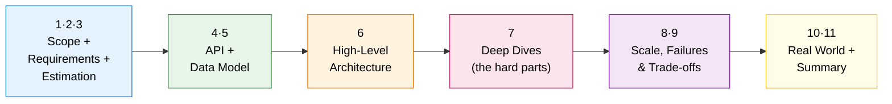

# 🏆 Bonus — 46 Real-World System Designs

> Theory is the grammar; these are the conversations. Here you apply everything from Levels 0–7 to design the systems you use every day.

This is where it all comes together. Each case study is a **complete, interview-style walkthrough** of a real product — from requirements and capacity math to the architecture diagram and the genuinely hard deep-dives. They're ordered so the difficulty (and the number of new ideas per design) ramps up gradually.

---

## 🧭 How to use this section

1. **Don't jump straight to Uber.** Start at #1. Each design introduces 1–2 new "hard parts"; later designs assume you've seen the earlier ones.
2. **Try it yourself first.** Read sections 1–3 (problem, requirements, estimation), then close the page and sketch your own architecture before reading on.
3. **Focus on the Deep Dives (section 7).** That's where the real engineering lives — the part that separates a junior answer from a senior one.
4. **Read "How It's Actually Done" (section 10)** to connect the textbook design to what the real company actually built.

---

## 📐 The framework every design follows

Every case study uses the same repeatable structure — internalize it and you can attack *any* "design X" question:

> 💡 **The #1 interview mistake** is jumping to boxes-and-arrows (step 6) without doing steps 1–3. The requirements and the numbers *are* the design. Always start there.

---

## 📚 The 46 designs

### 🟢 Warm-up tier (⭐–⭐⭐) — core patterns
| # | Design | What's genuinely hard about it |
|---|--------|-------------------------------|
| 1 | [URL Shortener](./01-URL-Shortener/) | Generating short, unique keys; surviving a 100:1 read load |
| 2 | [Pastebin](./02-Pastebin/) | Storing big blobs cheaply (object storage, not the DB) + expiry |
| 3 | [Distributed Rate Limiter](./03-Rate-Limiter/) | Counting accurately across many servers without races |
| 4 | [Notification Service](./04-Notification-Service/) | Fan-out across channels; retries & isolation when 3rd parties fail |
| 5 | [Web Crawler](./05-Web-Crawler/) | The URL frontier: politeness, dedup, and not getting trapped |
| 26 | [Unique ID Generator (Snowflake)](./26-Unique-ID-Generator/) | Unique, time-sortable 64-bit IDs without a single bottleneck |
| 35 | [Gaming Leaderboard](./35-Gaming-Leaderboard/) | Real-time rank queries at scale — sorted sets & sharded ranking |

### 🟡 Social, media & platform tier (⭐⭐⭐)
| # | Design | What's genuinely hard about it |
|---|--------|-------------------------------|
| 6 | [News Feed (Twitter/X)](./06-News-Feed-Twitter/) | Fan-out on write vs read; the celebrity hot-key problem |
| 7 | [Instagram](./07-Instagram/) | Media pipeline + feed + hot like/comment counters |
| 8 | [WhatsApp / Chat](./08-WhatsApp-Chat/) | Routing to the right socket; presence; delivery receipts |
| 9 | [YouTube / Netflix](./09-YouTube-Netflix-Streaming/) | Transcoding pipeline + adaptive bitrate + CDN economics |
| 10 | [Typeahead / Autocomplete](./10-Typeahead-Autocomplete/) | Sub-100ms suggestions via precomputed tries |
| 36 | [Webhook Delivery Service](./36-Webhook-Delivery-Service/) | Millions of flaky customer endpoints; retries without head-of-line blocking |
| 41 | [Online Code Judge (LeetCode)](./41-Online-Code-Judge/) | Running strangers' code safely: sandboxes, fair limits, contest spikes |
| 43 | [Calendar & Scheduling (Google Calendar)](./43-Calendar-and-Scheduling/) | Recurrence rules across time zones and DST; free/busy; reminders that all fire at :00 |

### 🟠 Marketplace & geo tier (⭐⭐⭐⭐)
| # | Design | What's genuinely hard about it |
|---|--------|-------------------------------|
| 11 | [Uber / Lyft](./11-Uber-Ride-Sharing/) | Geospatial indexing + real-time matching + location writes |
| 12 | [Food Delivery (Swiggy/DoorDash)](./12-Food-Delivery/) | Three-sided marketplace + courier dispatch + ETA |
| 13 | [Airbnb / Booking](./13-Airbnb-Booking/) | Search by availability + preventing double-booking |
| 14 | [Google Drive / Dropbox](./14-Google-Drive-Dropbox/) | Chunked sync, dedup, and conflict resolution |
| 15 | [Google Maps](./15-Google-Maps/) | Road graph + fast routing + live-traffic ETA |
| 29 | [Nearby Friends / Yelp](./29-Nearby-Friends-Proximity/) | Geospatial proximity for static places vs moving users |
| 31 | [E-Commerce (Amazon)](./31-E-Commerce-Platform/) | Catalog + cart + inventory oversell + checkout saga |
| 32 | [Email Service (Gmail)](./32-Email-Service/) | Mailbox storage, per-user search, spam, deliverability |

### 🔴 High-concurrency & infrastructure tier (⭐⭐⭐⭐–⭐⭐⭐⭐⭐)
| # | Design | What's genuinely hard about it |
|---|--------|-------------------------------|
| 16 | [Ticketmaster](./16-Ticketmaster/) | Double-booking under flash-sale concurrency; waiting rooms |
| 17 | [Payment System (Stripe)](./17-Payment-System/) | Idempotency, double-entry ledgers, exactly-once money |
| 18 | [Distributed Cache (Redis)](./18-Distributed-Cache/) | Consistent hashing, replication, hot keys |
| 19 | [Distributed Message Queue (Kafka)](./19-Distributed-Message-Queue/) | The commit log, partitions, consumer groups, ISR |
| 20 | [Ad Click Aggregator](./20-Ad-Click-Aggregator/) | Exactly-once counting of money-critical events at scale |
| 27 | [Distributed Key-Value Store (Dynamo)](./27-Key-Value-Store/) | Consistent hashing, quorums, vector clocks, anti-entropy |
| 33 | [Content Delivery Network](./33-Content-Delivery-Network/) | Edge routing, cache hierarchy, global purge |
| 34 | [Distributed Logging & Monitoring](./34-Distributed-Logging-Monitoring/) | Firehose ingestion, time-series storage, alerting |
| 40 | [A/B Testing Platform](./40-Experimentation-Platform/) | Stateless hash bucketing across thousands of experiments; statistics you can trust |
| 44 | [Identity & Access Service (Auth0/Okta)](./44-Identity-and-Access-Service/) | The service everything depends on: stateless tokens, stateful refresh, revocation in seconds |
| 45 | [Fraud Detection (Stripe Radar)](./45-Fraud-Detection-System/) | Scoring inside a payment's latency budget with features that must be fresh and point-in-time correct |

### ⚫ Grandmaster tier (⭐⭐⭐⭐⭐)
| # | Design | What's genuinely hard about it |
|---|--------|-------------------------------|
| 21 | [Distributed Job Scheduler](./21-Distributed-Job-Scheduler/) | Cron at scale: find-due-jobs, run-exactly-once, retries |
| 22 | [Google Search](./22-Google-Search/) | Indexing the web + scatter-gather ranking |
| 23 | [Distributed Counter / Analytics](./23-Distributed-Counter-Analytics/) | Hot-key writes, approximate counts, CRDTs |
| 24 | [Stock Exchange](./24-Stock-Exchange/) | Deterministic, ultra-low-latency matching engine |
| 25 | [Live Streaming (Twitch)](./25-Live-Streaming/) | Low-latency video + chat fan-out to millions |
| 28 | [Google Docs (Collaborative Editing)](./28-Google-Docs-Collaborative-Editing/) | Concurrent edits via OT vs CRDTs, real-time sync |
| 30 | [Video Conferencing (Zoom)](./30-Video-Conferencing/) | WebRTC, SFU vs MCU, NAT traversal, low latency |
| 37 | [Distributed File System (GFS/HDFS)](./37-Distributed-File-System/) | Petabytes on failing commodity disks; single-master metadata at scale |
| 38 | [LLM Chat Service (ChatGPT)](./38-LLM-Chat-Service/) | Streaming tokens from a scarce GPU fleet; quotas, caching, moderation |
| 39 | [Distributed Coordination Service (ZooKeeper/etcd)](./39-Distributed-Coordination-Service/) | The consensus-backed brain behind locks, elections, and config — must never be wrong |
| 42 | [Social Graph Store (Facebook TAO)](./42-Social-Graph-Store/) | A billion graph reads per second from a two-tier cache with read-after-write |
| 46 | [Distributed SQL Database (Spanner/CockroachDB)](./46-Distributed-SQL-Database/) | SQL and ACID across regions: Raft per range, write intents, and clocks that admit uncertainty |

> 📦 Designs **26–46** were added as expansions and are slotted into the tier matching their difficulty — that's why numbers aren't contiguous within a tier. Follow the tiers top-to-bottom for the smoothest difficulty ramp.

---

## 🎤 The universal "Design X" interview checklist

Print this. Use it on every design question:

- [ ] **Clarify scope** — what's in, what's out? Ask before assuming.
- [ ] **List functional requirements** — the verbs (post, follow, search, pay…).
- [ ] **List non-functional requirements** — scale, latency, availability, consistency.
- [ ] **Estimate** — DAU → QPS (with peak factor), storage/year, bandwidth.
- [ ] **Define the API** — the contract pins down the design.
- [ ] **Design the data model** — and *justify* SQL vs NoSQL vs blob/object store.
- [ ] **Draw the high-level architecture** — client → LB → services → data → async.
- [ ] **Go deep on the 2–3 hard parts** — this is what you're really being graded on.
- [ ] **Find the bottleneck** — what breaks first at 10×? Usually the database or a hot key.
- [ ] **Name your trade-offs** — every choice has a cost. Say it out loud.

---

*Finished all 46? You can now look at almost any product and reverse-engineer how it probably works. That's the whole goal.* 🚀

⬅️ Back to the [main curriculum](../README.md)
