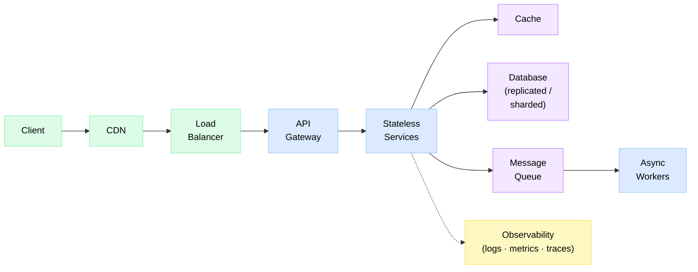

# 🎤 The System Design Interview Playbook

> One repeatable, 45-minute framework that works for **any** design question — from "design a URL shortener" to "design Uber." Learn it once, apply it forever.

**Read this after:** [What is System Design?](./Level-00-Foundations/01-What-is-System-Design/README.md) · **Pairs with:** [Capacity Planning & Estimation](./Level-06-Scale-and-Reliability/02-Capacity-Planning-and-Estimation/README.md) · **Practice on:** [the 34 real-world designs](./Bonus-Real-World-Architectures/README.md)

---

## 🎯 Why you need a framework

A system design interview is not a quiz — it's a **simulated design meeting**. There is no "right answer," and the interviewer knows it. What they're actually watching is *how you think*: do you clarify before building? Do you reason with numbers? Do you name trade-offs instead of reciting buzzwords?

The #1 failure mode is **unstructured rambling** — 45 minutes evaporate and you've drawn half a diagram. The fix is a fixed skeleton you can hang any problem on. Here it is.

---

## 🗺️ The 6-Phase Framework (with time budget)

*Six phases, one 45-minute clock. Understand (green) → build (blue) → prove depth (purple) → land it (yellow).*

```mermaid
flowchart LR
    P1["<b>Phase 1 · 0–5 min</b><br/>Requirements<br/>clarification"]
    P2["<b>Phase 2 · 5–10 min</b><br/>Back-of-envelope<br/>estimation"]
    P3["<b>Phase 3 · 10–15 min</b><br/>API design<br/>(3–5 endpoints)"]
    P4["<b>Phase 4 · 15–25 min</b><br/>High-level design<br/>(boxes + request path)"]
    P5["<b>Phase 5 · 25–40 min</b><br/>Deep dives<br/>(the 2 riskiest parts)"]
    P6["<b>Phase 6 · 40–45 min</b><br/>Wrap-up<br/>(failures, monitoring)"]

    P1 --> P2 --> P3 --> P4 --> P5 --> P6

    classDef understand fill:#dcfce7,stroke:#86efac,color:#000
    classDef build fill:#dbeafe,stroke:#93c5fd,color:#000
    classDef depth fill:#f3e8ff,stroke:#c084fc,color:#000
    classDef land fill:#fef9c3,stroke:#fde047,color:#000

    class P1,P2 understand
    class P3,P4 build
    class P5 depth
    class P6 land
```

> 💡 Got a 60-minute slot? Stretch Phases 4 and 5. Got 35 minutes? Compress Phases 2 and 3. The *order* never changes.

### Phase 1 (0–5 min) — Requirements clarification 📋

Never design what wasn't asked. Split requirements into two buckets and **write them in a corner of the board** — you'll point back at them all interview.

| Bucket | The exact questions to ask |
|---|---|
| **Functional** (what it does) | "Who are the users — consumers, businesses, internal?" · "What are the top 3 features? What's explicitly *out* of scope?" · "Mobile, web, or API-only?" |
| **Non-functional** (how well) | "How many users — DAU?" · "What's the read/write ratio?" · "Any latency target — is 200ms fine or do we need sub-50ms?" · "When the network partitions, do we prefer consistency or availability?" ([CAP](./Level-04-Distributed-Systems/01-CAP-Theorem/README.md)) · "Can we ever lose data?" |

Close the phase by reading your list back: *"So we're building X for Y users, optimizing for Z. Sound right?"* That one sentence earns more points than most diagrams.

### Phase 2 (5–10 min) — Back-of-envelope estimation 🧮

Numbers drive the design — a 100 QPS system and a 100K QPS system are *different systems*. Estimate three things, out loud, rounding aggressively:

| Estimate | How |
|---|---|
| **QPS** (read + write) | DAU × actions/user/day ÷ ~100K seconds/day. Peak ≈ 2–5× average. |
| **Storage** | writes/day × object size × retention (do it per-year, then ×5). |
| **Bandwidth** | QPS × payload size. Only matters for media-heavy systems. |

**When to skip it: ask!** *"Would quick capacity numbers be useful, or shall I move to the design?"* If the interviewer hands you the scale ("assume 10K QPS"), take the gift and move on. Full technique: [Capacity Planning & Estimation](./Level-06-Scale-and-Reliability/02-Capacity-Planning-and-Estimation/README.md).

### Phase 3 (10–15 min) — API design 🔌

Define the contract: **3–5 core endpoints only**, mapped straight from the functional requirements. Nobody wants your full CRUD matrix.

| Do | Don't |
|---|---|
| `POST /urls`, `GET /{code}` — the endpoints that carry the traffic | Admin panels, login flows, settings pages |
| Note pagination on list endpoints, idempotency keys on writes | Exhaustive field lists and status-code tables |
| Say which are read-heavy vs write-heavy | Debating REST vs gRPC for 5 minutes (state a choice, one reason, move on) |

### Phase 4 (15–25 min) — High-level design 🏗️

Draw the boxes: client → load balancer → services → cache → database → queue. Then — this is the part people skip — **walk the request path out loud, end to end**, for each core feature: *"The write request hits the LB, lands on a stateless API server, which…"*

Breadth over depth here. If you catch yourself explaining cache eviction policies, pull up: *"I'll flag caching as a deep-dive candidate and finish the picture first."*

### Phase 5 (25–40 min) — Deep dives 🔬

This is where the interview is won, and where seniority is measured. Two ways in:

1. **Let the interviewer steer.** Their questions are the syllabus — *"How does the feed stay fresh?"* means *dive there*.
2. **If they're quiet, propose:** *"The two riskiest parts of this design are X and Y — which would you like me to go deeper on?"*

In each dive: identify the bottleneck (it's usually the database), scale it (replicate reads, shard writes, cache the hot set), and name what each fix costs you (replication lag, resharding pain, invalidation bugs).

### Phase 6 (40–45 min) — Wrap-up ✅

Finish like an owner, not a candidate:

- **Failure modes:** "If the cache dies, the DB takes a thundering herd — I'd add request coalescing."
- **Monitoring:** the 2–3 metrics you'd alert on (p99 latency, error rate, queue depth).
- **Future work:** what you'd build next quarter (analytics, multi-region).

---

## 🔢 Cheat-Sheet Numbers

Memorize these. They turn "umm…" into "that's a cross-region hop, so ~150ms — too slow for this path."

### Latency numbers every engineer should know

| Operation | Time | Feel |
|---|---|---|
| L1 cache reference | 0.5 ns | Instant |
| Main memory reference | 100 ns | RAM is ~200× L1 |
| Compress 1 KB (Snappy) | 3 µs | Compression is cheap |
| Read 1 MB sequentially from memory | 250 µs | Memory is fast |
| Round trip within a datacenter | 500 µs | Intra-DC chatter is fine |
| Read 1 MB sequentially from SSD | 1 ms | SSD ≈ 4× slower than RAM |
| Disk seek (spinning) | 10 ms | Avoid random disk I/O |
| Read 1 MB sequentially from disk | 20 ms | Disk ≈ 80× slower than RAM |
| Round trip, same continent | ~30 ms | Region-to-region hurts |
| Round trip, cross-continent | ~150 ms | Never in a hot path |

### Powers of 2 (data volume shortcuts)

| Power | ≈ Value | Name |
|---|---|---|
| 2¹⁰ | 1 thousand | 1 KB |
| 2²⁰ | 1 million | 1 MB |
| 2³⁰ | 1 billion | 1 GB |
| 2⁴⁰ | 1 trillion | 1 TB |
| 2⁵⁰ | 1 quadrillion | 1 PB |

### QPS ↔ per-day conversions

*Trick: a day ≈ 86,400 s — round to **100K** and divide.*

| Requests per day | ≈ Average QPS | Peak (×3) |
|---|---|---|
| 1 million | 12 | ~35 |
| 10 million | 115 | ~350 |
| 100 million | 1,150 | ~3.5K |
| 1 billion | 11,500 | ~35K |

### Storage rules of thumb

| Rule | Number |
|---|---|
| 1 ASCII char | 1 byte |
| Int / timestamp | 4–8 bytes |
| UUID | 16 bytes |
| Tweet-sized record (text + metadata) | ~300 bytes — call it 500 B |
| 1M users × 1 KB each | 1 GB |
| 1B users × 1 KB each | 1 TB |
| Photo ~200 KB · HD video ~50 MB/min | media dominates everything else |

---

## 💬 The Phrase Bank

Sentences that score points — because they *show the thinking*, not just the answer.

| Situation | Say this |
|---|---|
| Opening | "Let me state my assumptions first, and please correct any of them." |
| After requirements | "Given the read-heavy ratio, I'd optimize the read path first: cache aggressively, replicate reads." |
| Any decision | "The trade-off here is X vs Y; given our requirement Z, I'd choose X." |
| Choosing a database | "This access pattern is key-value at high write volume, so I'd reach for a wide-column store — SQL would fight us on sharding." |
| Being wrong gracefully | "Good point — that breaks under concurrent writes. Let me revise: …" |
| Before diving deep | "The two riskiest components are the fan-out and the ID generator — shall I start with fan-out?" |
| At the bottleneck | "As traffic grows, the first thing to fall over is the single-writer DB — here's the sequence of fixes, cheapest first." |
| Estimating | "I'll round a day to 100K seconds — so 100M requests/day is roughly 1,000 QPS, call it 3K at peak." |
| Wrap-up | "If I had another week, I'd load-test the shard rebalancing and add an alert on replication lag." |

---

## 🧑‍⚖️ What Interviewers Actually Grade

Same question, different bar. Know which bar you're being measured against.

| Dimension | Junior / Mid | Senior | Staff+ |
|---|---|---|---|
| **Breadth** | Knows the standard blocks (LB, cache, DB) | Full toolbox, picks the right block per problem | Sees the whole sociotechnical system, incl. cost & team boundaries |
| **Depth** | 1 area explained solidly | 2–3 deep dives with internals (how sharding *actually* rebalances) | Can go arbitrarily deep on whatever the interviewer picks |
| **Trade-off judgment** | Names pros/cons when asked | Volunteers trade-offs unprompted, ties them to requirements | Weighs trade-offs against business context, cost, and migration risk |
| **Driving the conversation** | Follows the interviewer's lead | Proposes the agenda, checks in at each phase | Runs it like a design review they're chairing |
| **Estimation** | Rough numbers with help | Fluent back-of-envelope, sanity-checks own results | Uses numbers to *reject* designs before drawing them |

---

## 🚩 Red Flags That Fail Candidates

| Red flag | Why it fails | Do this instead |
|---|---|---|
| Jumping to tech buzzwords before requirements ("We'll use Kafka and Cassandra!") | Signals pattern-matching, not thinking | Requirements → numbers → *then* technology |
| Silent drawing | Interviewer can't grade a mime | Narrate every box as you draw it |
| One tool for everything (everything is Kafka / everything is Mongo) | Real systems are heterogeneous; this reads as shallow | Match each component to the access pattern it serves |
| Ignoring the interviewer's hints | Hints are the syllabus; ignoring them reads as uncoachable | Treat every interjection as a free deep-dive invitation |
| No trade-offs mentioned | "Best solution" thinking = junior thinking | Attach a cost to every choice you make |
| Blowing the clock on one phase | No high-level design by minute 30 = unrecoverable | Keep the 6-phase budget visible; time-box out loud |
| Fabricating numbers confidently | One absurd figure poisons trust in all the others | Round, state the assumption, invite correction |

---

## 🧱 The Universal Building-Blocks Checklist

Almost every design is assembled from the same eight blocks — walk this path mentally and check what the problem actually needs.

| Block | Earns its place when… | Skip it when… |
|---|---|---|
| **Load balancer** | More than one server (i.e., almost always) | Single-node internal tool |
| **API gateway** | Multiple services need shared auth / rate limiting / routing | One monolith — the LB is enough |
| **Stateless services** | Always — statelessness is what makes horizontal scaling trivial | (Don't skip; move state to cache/DB) |
| **Cache** | Read-heavy, tolerable staleness, hot working set | Write-heavy or strict-freshness data |
| **DB replication** | Read scaling + surviving node loss | — (you almost always want it) |
| **DB sharding** | One node can't hold the writes or the data | Data fits one box — sharding early is self-harm |
| **Message queue** | Work can be async: fan-out, retries, load leveling | The caller needs the result *now* |
| **CDN** | Static or cacheable content, global users | Internal, dynamic, or tiny-audience apps |
| **Observability** | Always — mention it in Phase 6 even if unasked | Never skip; it's a free senior signal |

---

## ⏱️ Worked Example: "Design a URL Shortener" in 45 Minutes

The classic warm-up, compressed phase-by-phase. Full treatment: [URL Shortener design](./Bonus-Real-World-Architectures/01-URL-Shortener/README.md).

| Clock | Phase | What you say / draw |
|---|---|---|
| 0:00–5:00 | 📋 Requirements | Core: shorten + redirect. Ask: custom aliases? expiry? analytics? → aliases yes, analytics out of scope. Non-functional: 100M new URLs/month, ~100:1 read:write, redirect p99 < 100ms, availability over consistency. |
| 5:00–9:00 | 🧮 Estimation | Writes: 100M/month ≈ 40/s. Reads: ×100 ≈ 4K/s. Storage: 100M × 500 B × 12 mo × 5 yr ≈ 3 TB — *tiny*. Conclusion out loud: "read-heavy and small — this is a caching problem, not a storage problem." |
| 9:00–14:00 | 🔌 API | `POST /urls {longUrl, alias?}` → `{shortUrl}` (idempotency key on create) · `GET /{code}` → `301/302` redirect. Two endpoints. Done. |
| 14:00–24:00 | 🏗️ High-level | Client → LB → stateless API servers → Redis (cache-aside) → key-value DB. Walk the read path: LB → API → cache hit (~1 ms) → redirect. Walk the write path: generate code → store → return. Flag "code generation" and "caching" as deep-dive candidates. |
| 24:00–39:00 | 🔬 Deep dives | **(1) ID generation:** hash-and-truncate collides; DB auto-increment shards badly → base62-encoded IDs from a range-allocating counter service. **(2) 301 vs 302:** 301 lets browsers cache (fewer hits, but blinds future analytics) → choose 302. **(3) Hot keys:** a viral link hammers one cache entry → local in-process cache on top of Redis. Mention DB sharding by code when 3 TB outgrows one box. |
| 39:00–43:00 | ✅ Wrap-up | Failure: cache cluster dies → thundering herd on DB → request coalescing + gradual cache warm-up. Monitoring: redirect p99, cache hit rate (>90%), 5xx rate. Future: analytics pipeline, custom domains. |
| 43:00–45:00 | 🤝 Buffer | "What would you have pushed on harder?" — end curious, not defensive. |

---

## 📅 Practice Plan: From Curriculum to Interview-Ready

### Map the levels to readiness

| You've finished… | You can handle… | Interview readiness |
|---|---|---|
| Levels 0–1 | The vocabulary + basic web-app designs | Junior screens |
| Levels 2–3 | Data modeling, APIs, queues — most ⭐–⭐⭐⭐ questions | Mid-level loops |
| Levels 4–5 | Consistency, consensus, microservice trade-offs | Senior loops |
| Levels 6–7 | Multi-region, capacity math, streaming pipelines | Staff conversations |
| Bonus designs | Pattern-matching any question to a known shape | Any loop, calmly |

### Then drill the [bonus designs](./Bonus-Real-World-Architectures/README.md) in difficulty order

1. **Warm-up (⭐–⭐⭐):** URL shortener, Pastebin, rate limiter, notification service — nail the *framework* on easy problems.
2. **Core loop (⭐⭐⭐):** news feed, chat, video streaming, autocomplete — the questions you'll most likely actually get.
3. **Senior tier (⭐⭐⭐⭐–⭐⭐⭐⭐⭐):** Uber, payments, Kafka-from-scratch, collaborative editing — one per day in your final week.

### Mock-interview rules

- **Use a 40-minute timer**, not 45 — real interviews lose 5 minutes to intros and small talk. If your high-level design isn't standing by minute 25, restart.
- **Record yourself** (screen + voice). Watching it back is brutal and worth 5 mocks: you'll catch silent drawing, filler words, and skipped trade-offs instantly.
- **Speak while drawing, always.** Practice until narration is automatic.
- **Do at least 5 full mocks** with a friend or out loud to a wall — the framework must be muscle memory before the real thing.
- Keep the [glossary](./GLOSSARY.md) open while you review recordings — every term you fumbled goes on a flash card.

---

## 📝 TL;DR

- **Six phases, one clock:** requirements (5) → estimation (5) → API (5) → high-level (10) → deep dives (15) → wrap-up (5).
- **Numbers before boxes, boxes before deep dives.** Estimate, then architect.
- **Narrate everything.** A silent whiteboard scores zero.
- **Every choice gets a price tag.** "The trade-off here is…" is the highest-value sentence in the room.
- **Let the interviewer steer the deep dives** — their hints are the grading rubric, leaked.
- Drill the framework on [easy designs first](./Bonus-Real-World-Architectures/README.md), then climb the stars.

---

*Back to the [full curriculum](./README.md) — and remember: the interview isn't a test of what you've memorized, it's a rehearsal of how you'll design on the job.* 🚀
