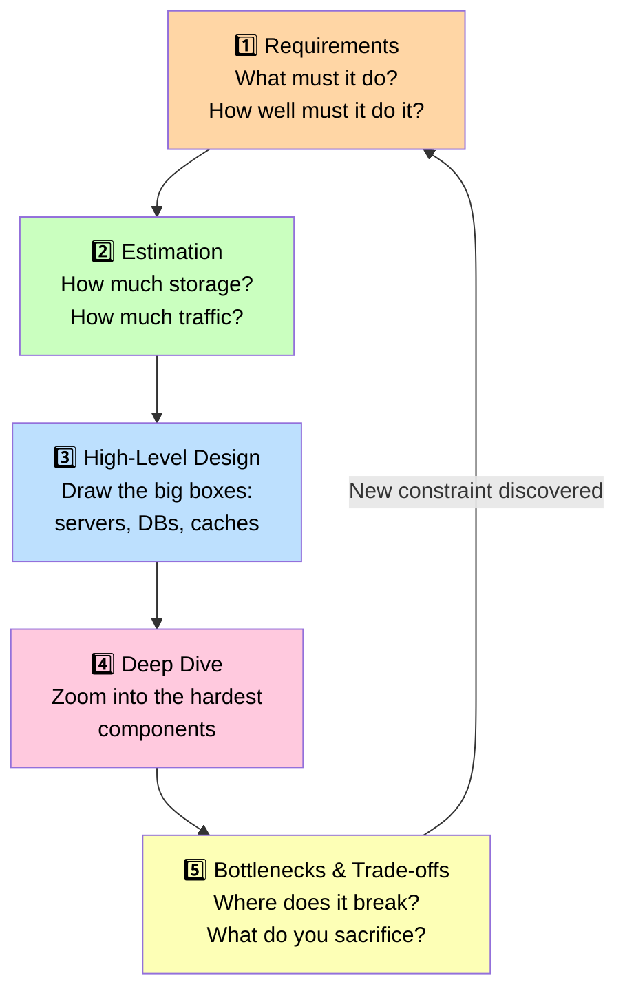

# What is System Design?

> System design is the process of defining the architecture, components, and data flow of a software system so it can reliably handle real-world scale, traffic, and failure.

**Level:** 0 · **Topic:** 1 of 7 · **Prerequisites:** none

---

## 🎯 The Problem

Imagine you are a developer at a hot new startup. You spend six months building a photo-sharing app. Launch day arrives, you post on Product Hunt, and within two hours 50,000 people try to sign up at once. Your single server melts. The database runs out of connections. Images fail to load. Users tweet about how broken the app is — and most of them never come back.

This is not a made-up horror story. It happened to Friendster in 2003, to Twitter during the 2010 World Cup, and to countless smaller products that never recovered from a bad launch. The root cause is almost always the same: the team thought about *what* the app does, but not *how* it will survive the real world.

System design is the discipline that answers the "how will it survive" question — *before* you write the first line of production code.

---

## 🌍 Real-World Analogy

Think about how a skyscraper gets built.

A construction crew does not show up on Monday and start pouring concrete wherever looks good. First, architects spend weeks or months drawing blueprints. They decide how many floors there will be, where the load-bearing walls go, how the elevators will be distributed, and what happens if a water pipe bursts on the 30th floor. Only after those plans are approved does the construction crew start building.

Software works the same way. **System designers are the architects. Engineers are the construction crew.** Before engineers write code for a system that needs to handle millions of users, a designer must answer: How many servers do we need? Where does data live? What happens when one server crashes? How do we make sure user data is never lost?

Skip the blueprint and you get a skyscraper with no fire exits. Skip system design and you get an app that crashes on launch day.

---

## 🧠 Core Idea

System design is the art of making big decisions about a software system before — and during — its construction.

Those decisions fall into two categories:

### Functional Requirements

**Functional requirements** describe *what the system does* — the features and behaviors a user can directly interact with.

Examples:
- "Users can upload a photo."
- "Users can send a direct message."
- "The system must let users search for products by name."

### Non-Functional Requirements

**Non-functional requirements** describe *how well the system does it* — quality attributes that users feel but cannot always see.

Examples:
- **Availability:** "The service must be up 99.99% of the time (about 52 minutes of downtime per year)."
- **Latency:** "Search results must appear in under 200 milliseconds."
- **Scalability:** "The system must handle 10 million active users without degradation."
- **Durability:** "No uploaded file should ever be permanently lost."
- **Consistency:** "A payment must never be double-charged."

Non-functional requirements are where most systems fail at scale. It is easy to build a feature that works for 100 users. It is hard to build one that works for 100 million users.

### The 5-Step Design Interview Framework

Whether you are in a job interview or designing a real production system, the same five-step process keeps you structured and thorough:

1. **Requirements** — Clarify what the system must do (functional) and how well (non-functional). Ask questions. State assumptions.
2. **Estimation** — Rough-order-of-magnitude math: how much storage, bandwidth, and compute will you need?
3. **High-Level Design** — Draw the big boxes: clients, load balancers, servers, databases, caches, message queues.
4. **Deep Dive** — Zoom into the hardest or most critical components and explain your design choices in detail.
5. **Bottlenecks and Trade-offs** — Identify where the system could fail or slow down, and explain what you would sacrifice (cost, complexity, consistency) to fix it.

You will use this framework throughout this curriculum.

---

## 📊 How It Works

The diagram below shows the 5-step design interview process as a flowchart. Each step feeds into the next, but you can always loop back when you discover something new.

*The 5-step system design framework. Notice the feedback arrow — real design is iterative, not linear.*

---

## 🔧 Types / Variations / Strategies

### Functional vs Non-Functional Requirements

| Dimension | Functional Requirement | Non-Functional Requirement |
|---|---|---|
| Definition | What the system does | How well the system does it |
| User-visible? | Yes — directly | Indirectly (felt as speed, reliability) |
| Example (Twitter) | "Users can post a tweet" | "Tweets must appear in the feed within 5 seconds" |
| Example (Netflix) | "Users can play a video" | "Video must start within 3 seconds on a 5 Mbps connection" |
| Example (Uber) | "Rider can request a car" | "Driver match must complete in under 10 seconds" |
| Measured by | Feature checklist | SLAs, latency percentiles, uptime %, RPS |

### Common System Design Question Types

| Question Type | Famous Example | Key Challenge |
|---|---|---|
| Social network / feed | Facebook News Feed, Twitter Timeline | Fan-out at scale, ranking, freshness |
| URL shortener | bit.ly, TinyURL | High read volume, redirect latency, analytics |
| Messaging system | WhatsApp, Slack | Real-time delivery, message ordering, offline sync |
| Video streaming | YouTube, Netflix | Bandwidth, CDN, adaptive bitrate |
| Ride-sharing | Uber, Lyft | Geo-indexing, real-time matching, surge pricing |
| Search engine | Google, Elasticsearch | Inverted index, ranking, query latency |
| Rate limiter | API gateways everywhere | Distributed counters, fairness, accuracy |
| Distributed cache | Redis, Memcached | Eviction policies, consistency, cache stampede |
| Notification service | Push notifications (iOS/Android) | Fan-out, delivery guarantees, throttling |
| File storage | Google Drive, Dropbox | Chunking, deduplication, sync conflicts |

---

## 🏢 Real-World Examples

### Netflix — Non-Functional Requirements Drive Everything

Netflix's core functional requirement is simple: "Users can watch a video." But the non-functional requirements are what make Netflix, Netflix:

- **Availability:** 99.99% uptime. Netflix runs in multiple AWS regions simultaneously so that if one entire data center goes down, users in other regions keep watching.
- **Latency:** Video playback must start in under 3 seconds. Netflix pre-positions video files in CDN (Content Delivery Network) nodes physically close to users — over 17,000 servers in 158 countries as of 2023.
- **Adaptive bitrate:** If your internet connection drops from 50 Mbps to 2 Mbps mid-stream, Netflix smoothly downgrades video quality rather than buffering. This is a non-functional requirement disguised as a feature.

The entire architecture of Netflix — its microservices, its CDN, its chaos engineering (intentionally killing servers to test resilience) — exists to satisfy non-functional requirements.

### Uber — The 5-Step Framework in Practice

When Uber's engineers designed the driver-matching system, they went through exactly the 5-step process:

1. **Requirements:** Riders need a nearby driver matched in under 10 seconds. The system must handle 14 million trips per day globally (their 2019 figure).
2. **Estimation:** At peak, ~10,000 ride requests per second worldwide. Each request needs to query driver locations within a 1-mile radius.
3. **High-level design:** A geo-indexing service (using S2 cells, a geospatial library from Google) partitions the map into cells. Drivers broadcast their GPS location every 4 seconds.
4. **Deep dive:** The matching algorithm weighs distance, driver rating, and estimated arrival time. Supply-demand data feeds into surge pricing calculations in real time.
5. **Bottlenecks:** GPS updates from millions of drivers create a write-heavy workload. Uber solved this by using in-memory stores (Redis) for live driver locations and only persisting completed trips to the database.

### WhatsApp — Scaling to 1 Million Users Per Engineer

By 2014, WhatsApp served 450 million monthly active users with a team of only 32 engineers. That is roughly 14 million users per engineer — a ratio unmatched in the industry.

How? Aggressive non-functional requirement prioritization:

- **Simplicity as a constraint:** WhatsApp chose Erlang (a language built for telecom-grade concurrent systems) which made each server handle 2 million concurrent connections.
- **No fluff:** WhatsApp deliberately had no games, no ads, no status updates (initially). Fewer features meant fewer systems to maintain and scale.
- **Single focus:** Their one non-functional obsession was message delivery reliability. Every engineering decision was filtered through that lens.

The lesson: clear non-functional requirements force architectural clarity. When you know your north star, you make better decisions.

---

## ⚖️ Trade-offs

### Doing System Design Upfront vs Winging It

| | Design Upfront | Wing It |
|---|---|---|
| **Pro** | Catch scaling issues before they cost money | Faster time to first prototype |
| **Pro** | Align team on architecture before code diverges | Less planning overhead for tiny teams |
| **Pro** | Identify bottlenecks on paper (cheap) vs in production (expensive) | Good for throwaway proofs-of-concept |
| **Con** | Takes time — can feel like "analysis paralysis" | Rewrites are painful at scale |
| **Con** | You may over-engineer for scale you never reach | "We'll fix it later" rarely happens |
| **Con** | Requirements change, making some early decisions obsolete | Technical debt compounds fast |
| **Verdict** | Use for anything expected to handle real user load | Use only for solo experiments or day-1 MVPs |

The sweet spot: spend just enough time on design to avoid catastrophic architecture mistakes, then iterate. Amazon's rule of thumb is a "two-pizza team" can complete a design doc in a week. If it takes longer, the scope is too large.

---

## ✅ When to Use / ❌ When NOT to Use

### When system design thinking applies

- You expect more than a few thousand users (even eventually)
- Multiple engineers will work on the same codebase
- Data loss would be catastrophic (payments, health records, user content)
- You are preparing for a software engineering interview at a mid-to-large company
- You are evaluating whether to build vs buy a component (e.g., build your own search vs use Elasticsearch)
- You are architecting a new service or a major feature from scratch

### When it is overkill

- You are building a weekend hackathon project with no expectation of production traffic
- You are writing a script that runs once and throws away results
- The team is one person and the expected user base is under 1,000 people
- You are prototyping to validate a product idea before anyone commits resources
- The system is internal tooling used by fewer than 50 people

The key question to ask yourself: "If this doubles in scale unexpectedly, does the architecture survive?" If the answer is obviously yes, skip the formal design. If the answer is "I have no idea," do the design.

---

## ⚠️ Common Pitfalls

### 1. Jumping Straight to Solutions

The most common mistake beginners make in system design (and in interviews) is immediately saying "I would use Kafka and microservices" before understanding what the system actually needs to do. Always start with requirements. A chat app for 100 users and a chat app for 100 million users have completely different architectures.

### 2. Ignoring Non-Functional Requirements

It is tempting to focus only on features because they are tangible and testable. But the non-functional requirements — latency, availability, consistency — are what separate a toy from a production system. Always ask: "How fast must this be? How available must this be? What happens when a server crashes?"

### 3. Not Asking Clarifying Questions

"Design a messaging system" is wildly underspecified. Is it one-on-one or group chat? Does it need message history? Is end-to-end encryption required? How many users? In an interview or in a real project, ambiguity is your enemy. Ask questions until you can state concrete requirements.

### 4. Designing for 1000x More Scale Than You Need

Over-engineering is just as dangerous as under-engineering. If your product has 10,000 users, you do not need a Kubernetes cluster with 50 microservices. Keep it simple until the complexity is justified by real data.

### 5. Forgetting the "Failure" Question

Every component eventually fails. Servers crash, networks partition, databases run out of disk space. A good system design always includes an answer to: "What happens when X fails?" If you cannot answer that, your design is incomplete.

---

## 🎤 Interview Tips

System design interviews are intentionally open-ended. There is rarely one correct answer. The interviewer wants to see *how you think*, not just *what you know*. Here is how to shine:

**Ask clarifying questions first.** Before drawing a single box, spend 3-5 minutes asking about scale, features, and constraints. "Should I optimize for reads or writes?" and "Are we designing for global users or a single region?" are great openers. This shows you know that requirements drive architecture.

**Always state your assumptions out loud.** If you assume the system will handle 1 million daily active users, say so. "I'm going to assume 1 million DAU and we can revisit if that's off." This keeps you and the interviewer aligned.

**Drive the conversation.** The interviewer will not volunteer information — you have to ask for it. Treat the interview like a collaborative design session with a colleague, not a quiz where you wait to be graded.

**Use the 5-step framework.** Requirements → Estimation → High-Level Design → Deep Dive → Bottlenecks and Trade-offs. State where you are in the framework as you move through it. This signals structure and experience.

**Talk about trade-offs explicitly.** Never say "I would use X" without also saying "The trade-off is Y." For example: "I would use a SQL database here because we need strong consistency for payments, but the trade-off is that it is harder to scale horizontally than a NoSQL store." Interviewers love candidates who think in trade-offs.

**Manage your time.** A typical system design interview is 45-60 minutes. Spend roughly 5 minutes on requirements, 5 on estimation, 15 on high-level design, 15 on deep dive, and 10 on bottlenecks. Do not get stuck on one section.

---

## 📝 TL;DR

- System design is the practice of planning software architecture before and during development — deciding what components exist, how they communicate, and how the system survives failure and scale.
- **Functional requirements** = what the system does; **non-functional requirements** = how well it does it (latency, availability, scalability). Most systems fail on the non-functional side.
- Use the 5-step framework in interviews and in real projects: Requirements → Estimation → High-Level Design → Deep Dive → Bottlenecks and Trade-offs.
- Real companies (Netflix, Uber, WhatsApp) built their architectures around clear non-functional requirements — and those constraints drove every major design decision.
- Always ask clarifying questions before proposing solutions, always discuss trade-offs, and never over-engineer for scale you have not yet earned.

---

## 🧪 Test Yourself

1. A friend says "I need to design a social media app." What are the first three clarifying questions you would ask them before proposing any architecture?

2. Classify each of the following as a **functional** or **non-functional** requirement:
   - "Users can like a post."
   - "The system must handle 50,000 requests per second."
   - "Users can search for other users by username."
   - "Search results must appear in under 100 milliseconds."

3. A startup's app goes down on launch day because the single database server cannot handle the traffic. Which step of the 5-step design framework, if done properly, would have caught this problem before launch?

4. You are designing a URL shortener (like bit.ly). Write two functional requirements and two non-functional requirements for it.

---

## 📚 Further Reading

- **Designing Data-Intensive Applications** by Martin Kleppmann — The most thorough book on the trade-offs behind databases, distributed systems, and data pipelines. Read Part I (Foundations of Data Systems) first.
- **System Design Interview – An Insider's Guide** by Alex Xu (Vol. 1 and Vol. 2) — The most practical, example-driven guide to system design interviews. Each chapter walks through a real system (URL shortener, Twitter, YouTube) using the same 5-step framework covered here.
- **High Scalability blog** (highscalability.com) — Real architecture breakdowns of how companies like Stack Overflow, Discord, and Pinterest actually built their systems at scale. Start with the "Real Life Architectures" section.
- **The System Design Primer** on GitHub (donnemartin/system-design-primer) — Free, open-source collection of system design resources and interview prep materials with diagrams and example answers.
- **ByteByteGo Newsletter** by Alex Xu — Weekly visual explainers of system design concepts, published at blog.bytebytego.com.
