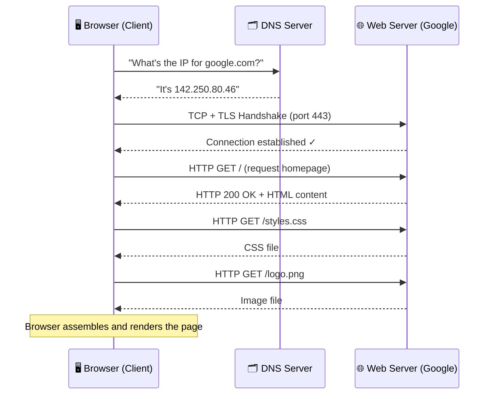
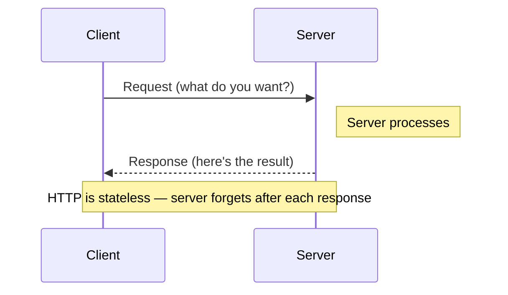

# The Client-Server Model

> The client-server model is the fundamental architecture of the internet: one program (the client) asks for something, and another program (the server) provides it.

**Level:** 0 · **Topic:** 2 of 7 · **Prerequisites:** [What is System Design?](../01-What-is-System-Design/README.md)

---

## 🎯 The Problem

You open your browser and type `google.com`. Half a second later, a search page appears. But think about what just happened — your laptop has no idea what Google's homepage looks like. It doesn't store it. It didn't come pre-installed. So where did it come from?

Without a clear model for *who asks* and *who answers*, none of this would work. The internet would just be a pile of connected cables with no way to make sense of the connections. Every device would need to store a copy of every website. Every time a page changed, you'd need to update every device on the planet.

The client-server model solves this by drawing a clean line: **some machines ask for things (clients), and some machines provide things (servers)**. That single idea is the backbone of almost every networked system you've ever used.

---

## 🌍 Real-World Analogy

Think about a restaurant.

You sit down at a table. You are the **client** — you have a need (hunger) and you make a request (order food). The **waiter** carries your request across the room to the **kitchen**. The kitchen is the **server** — it does the actual work of preparing your food and sends the result back through the waiter.

Notice a few things:
- The **kitchen never walks over to your table uninvited**. It waits for orders.
- **You don't cook your own food**. You offload that work to the kitchen.
- The waiter (the **network**) is just the delivery mechanism — it doesn't decide what you eat.
- If the kitchen is overwhelmed, everyone waits. The kitchen is a **shared resource**.

This is exactly how your browser and Google's servers work. You (client) make a request, the internet (waiter) carries it, and Google's data centers (kitchen) serve the response.

---

## 🧠 Core Idea

### Clients vs Servers

A **client** is any program or device that *initiates* a request. Your web browser is a client. So is the Spotify app on your phone, the weather widget on your desktop, and even a backend microservice calling another microservice.

A **server** is any program or device that *listens* for requests and *responds* to them. Google's web servers, Netflix's streaming servers, and your home router's admin page are all servers.

Key insight: **these are roles, not machine types**. A single physical machine can run both a client and a server at the same time. When your backend calls a database, it's acting as a client. When it responds to your browser, it's acting as a server.

### What is an IP Address?

Every device on a network needs an address so other devices know where to send data. That address is called an **IP address** (Internet Protocol address).

In the most common format (IPv4), an IP address is a **32-bit number**, written as four groups of digits separated by dots — like `192.168.1.1` or `142.250.80.46`. Think of it as your home's street address on the internet. Without it, responses wouldn't know where to go.

- `192.168.x.x` — private addresses (inside your home or office network)
- `142.250.80.46` — a real public address (one of Google's)

### What is a Port?

An IP address gets data to the right *machine*, but a machine can run dozens of different programs at once. How does incoming data know which program it's meant for?

That's what **ports** are for. A port is a number between 0 and 65535 that identifies a specific program on a machine. Think of the IP address as a building's street address, and the port as the apartment number inside that building.

Some ports are standardized by convention:

| Port | Protocol | What it's for |
|------|----------|----------------|
| 80   | HTTP     | Unencrypted web traffic |
| 443  | HTTPS    | Encrypted web traffic |
| 22   | SSH      | Secure remote terminal access |
| 25   | SMTP     | Sending email |
| 5432 | PostgreSQL | Database connections |

When your browser connects to `google.com`, it's actually connecting to something like `142.250.80.46:443` — IP address + port.

### The Full Lifecycle of One Web Request

Here is exactly what happens when you type `google.com` and press Enter:

1. **DNS Lookup** — Your browser doesn't know what `142.250.80.46` is. It only knows the human-readable name `google.com`. So it contacts a **DNS server** (Domain Name System — think of it as the internet's phone book) and asks: "What IP address does `google.com` map to?" The DNS server replies with the IP address.

2. **TCP Connection** — Your browser opens a connection to Google's server at that IP address on port `443`. This uses a protocol called TCP (Transmission Control Protocol), which makes sure data arrives reliably and in order.

3. **TLS Handshake** — Because the port is 443 (HTTPS), your browser and Google's server perform a brief security negotiation to encrypt the connection. This is called a **TLS handshake**.

4. **HTTP Request** — Your browser sends an HTTP GET request: "Please give me the contents of `/` (the homepage)."

5. **Server Processes the Request** — Google's server receives the request, figures out what to send back (personalized or not, cached or freshly generated), and prepares an HTTP response.

6. **HTTP Response** — The server sends back an HTTP response with a status code (`200 OK` means success), headers (metadata), and the body (the actual HTML).

7. **Browser Renders the Page** — Your browser reads the HTML, then fires off *more* requests for CSS files, JavaScript files, images, and fonts referenced in that HTML. Each one is a new client-server exchange.

### The Stateless Nature of HTTP

Here is something that surprises many beginners: **HTTP is stateless**. This means the server does not remember you from one request to the next. Every single HTTP request is treated as if it's the first time the server has ever seen you.

This is by design — it keeps servers simple and scalable. But it also creates a challenge: how does a website remember that you're logged in? The answer is **cookies** and **sessions** — small tokens the server gives you, which your browser sends back with every request so the server can look up your context. The server itself stays stateless; the state travels with the request.

---

## 📊 How It Works

### Full Page Load Sequence

*Each arrow is a separate round-trip over the network. Notice how the browser (client) always initiates — the server never pushes data unless asked (in basic HTTP).*

---

### Simplified Request-Response Loop

*This is the fundamental pattern. Everything else is built on top of it.*

---

## 🔧 Types / Variations / Strategies

### Client Thickness: How Much Work Does the Client Do?

Not all clients are the same. The term **"client thickness"** describes how much processing the client does locally vs how much it offloads to the server.

| Type | Description | Example | Trade-off |
|------|-------------|---------|-----------|
| **Thick Client** | Client does significant processing locally; may work offline | Photoshop, desktop Outlook, mobile apps with local caches | More complex client code; can work offline; faster for local tasks |
| **Thin Client** | Client just displays results; server does all the real work | A basic web browser loading server-rendered HTML | Simple client; requires network for everything; server bears all load |
| **Zero Client** | Client is just a screen and input device; everything streams from server | Amazon WorkSpaces, some VDI terminals | Minimal hardware; total dependency on network and server |

Most modern web apps fall somewhere between thick and thin. React or Vue apps ship JavaScript to the browser and do rendering on the client side — that's thicker than pure server-rendered HTML, but thinner than a full desktop app.

---

### Peer-to-Peer: The Alternative Model

The client-server model has a well-known alternative: **peer-to-peer (P2P)**, where every machine is both a client and a server simultaneously. There is no central authority.

**Example — BitTorrent:** When you download a file via BitTorrent, you don't download it from one central server. Instead, you connect to dozens of other users (called **peers**) who each have pieces of the file. You download different pieces from different peers simultaneously, and as soon as you have a piece, you start uploading it to others. There is no single server that can go down and kill the whole system.

P2P is powerful for distributing load across many nodes, but it comes with trade-offs around consistency, moderation, and discoverability — which is why most consumer products still use client-server.

---

## 🏢 Real-World Examples

**Google Search (Thin Client)**
When you search on Google, almost nothing happens in your browser. Your browser sends your query to Google's servers, which crawl billions of indexed pages, rank results, and return polished HTML. Your browser just displays it. The client is as thin as it gets — a display window for server-side intelligence.

**Netflix (Both Models Depending on Interface)**
If you watch Netflix in a browser, you're using a thin-ish client — the video stream comes from Netflix's CDN (Content Delivery Network) servers. But if you use the Netflix app on a smart TV or phone, you're using a **thick client**: the app manages local caching, adaptive bitrate switching, and DRM decryption locally. The same service, two different client thicknesses.

**WhatsApp (Hybrid: P2P + Client-Server)**
WhatsApp uses the **client-server model for text messages** — your messages go through WhatsApp's servers, which store and forward them. But **voice and video calls use a more P2P-like approach**: once the call is established, the audio/video data flows as directly as possible between your device and the other person's device to minimize latency. One product, two architectures for different jobs.

---

## ⚖️ Trade-offs

| Dimension | Client-Server | Peer-to-Peer |
|-----------|--------------|--------------|
| **Centralization** | Central server is a single point of control (and failure) | Decentralized — no single point of failure |
| **Scalability** | Server must scale as users grow; expensive | Load distributes naturally across peers |
| **Consistency** | Server is the source of truth; easy to keep data consistent | Hard to ensure all peers have the same data |
| **Discoverability** | Server knows all content; easy to search | Content discovery is harder without a central index |
| **Security / Moderation** | Server can enforce rules, block content, authenticate users | Much harder to moderate or enforce policies |
| **Operational complexity** | You own and operate the server | No server to maintain, but complex peer coordination |
| **Latency** | All requests route through server, even if peers are nearby | Can connect directly to nearby peers |
| **Reliability** | Server downtime = everyone affected | System can function even if many peers go offline |

---

## ✅ When to Use / ❌ When NOT to Use

**Use the client-server model when:**
- You need a single source of truth (e.g., bank balances, user accounts)
- You need to enforce access control and authentication centrally
- Your data changes frequently and all users need to see the same version
- You need to moderate content or enforce terms of service
- You're building a standard web application or mobile app

**Do NOT rely on pure client-server when:**
- You need to handle massive file distribution where bandwidth costs matter (consider CDNs or P2P)
- Censorship resistance or decentralization is a core requirement (e.g., blockchain, Tor)
- Latency is critical and peers are geographically close (consider WebRTC or direct peer connections)
- Your server becoming unavailable is simply unacceptable (add redundancy, or reconsider the architecture)

---

## ⚠️ Common Pitfalls

**1. Confusing "client" with "browser"**
A browser is one example of a client, but not the only one. A mobile app is a client. A cron job that fetches data from an API is a client. A backend service calling another backend service is a client. Whenever you hear "client," ask yourself: *what program is making the request?* — not *is there a browser involved?*

**2. Thinking servers are always big machines**
A server is just a program that listens for requests and responds. You can run a web server on your laptop right now with `python -m http.server`. The word "server" describes a *role*, not hardware. A Raspberry Pi can be a server. A single Docker container can be a server.

**3. Ignoring the network between them**
In diagrams and interviews, the network is often drawn as a single arrow. In reality, it's a complex, unreliable, variable-latency path through cables, routers, switches, and sometimes satellites. Real systems must account for dropped packets, timeouts, partial failures, and the fact that sending a request does *not* guarantee receiving a response. Never assume the network is instant or reliable.

**4. Forgetting that HTTP is stateless**
A very common beginner mistake is assuming the server "remembers" who you are between requests. It doesn't — unless you explicitly pass a token or cookie that lets it look you up. Design your systems around this reality rather than fighting it.

---

## 🎤 Interview Tips

**Always clarify who the client is.**
In a system design interview, the question "design a URL shortener" involves multiple client-server relationships: the user's browser, the shortener's backend, and possibly a separate database server. Mapping these out early shows structured thinking.

**Mention that servers can be clients of other servers.**
In microservices architectures, an API gateway (server) forwards requests to an auth service (where the gateway acts as a client), which in turn queries a user database (auth service is now a client). Demonstrating this fluency signals that you understand real distributed systems, not just browser-to-server interactions.

**Bring up statelessness and what it enables.**
Stateless servers can be horizontally scaled — you can add more server instances behind a load balancer without any of them needing to know about the others. This is a fundamental scalability insight. Mention it when discussing how to handle traffic growth.

**Know your port numbers.**
Casually referencing port 443 for HTTPS, port 22 for SSH, or port 5432 for PostgreSQL signals familiarity with real systems. It's a small detail that lands well.

**The network is not free.**
Interviewers appreciate candidates who treat network calls as expensive — in both latency and cost. Grouping requests, caching responses, and minimizing round-trips are all valid design considerations rooted in the client-server model.

---

## 📝 TL;DR

- The **client-server model** divides the world into programs that ask (clients) and programs that answer (servers) — this is the foundation of the internet.
- An **IP address** identifies a machine on a network (e.g., `192.168.1.1`); a **port** identifies a specific program on that machine (e.g., port 443 for HTTPS).
- A full web request involves DNS resolution, a TCP+TLS connection, an HTTP request, server processing, and an HTTP response — often followed by many more sub-requests for assets.
- **HTTP is stateless**: the server forgets you after every request; cookies and tokens are how applications fake continuity.
- **Servers can be clients too** — in microservices, services constantly call other services, making the client-server relationship recursive and layered.

---

## 🧪 Test Yourself

1. You open a mobile banking app and check your balance. Identify the client and the server. What protocol and port does the connection likely use?

2. Your friend says "servers are always powerful machines in a data center." How would you correct them? Give a concrete counter-example.

3. You log into a website, browse three pages, then log out. How does the server know you're logged in on page 2, given that HTTP is stateless?

4. A startup wants to build a video-sharing platform like YouTube. Should they use a client-server model, a P2P model, or a hybrid? What are the key trade-offs that inform your answer?

---

## 📚 Further Reading

- **Computer Networking: A Top-Down Approach** by James F. Kurose & Keith W. Ross — The gold-standard textbook for understanding how the internet actually works, from HTTP all the way down to physical signals. Chapters 1 and 2 are directly relevant to this topic.
- **MDN Web Docs: An overview of HTTP** — [https://developer.mozilla.org/en-US/docs/Web/HTTP/Overview](https://developer.mozilla.org/en-US/docs/Web/HTTP/Overview) — A free, beginner-friendly deep-dive into HTTP requests, responses, headers, and status codes written by the people who document the web platform.
- **MDN Web Docs: How the Web works** — [https://developer.mozilla.org/en-US/docs/Learn_web_development/Getting_started/Web_standards/How_the_web_works](https://developer.mozilla.org/en-US/docs/Learn_web_development/Getting_started/Web_standards/How_the_web_works) — A gentle walkthrough of DNS, TCP, and HTTP aimed at complete beginners.
- **High Performance Browser Networking** by Ilya Grigorik (free online at [https://hpbn.co](https://hpbn.co)) — If you want to go deeper on what happens inside that single arrow in the diagram, this book covers TCP, TLS, HTTP/1.1, HTTP/2, and WebRTC in accessible detail.
